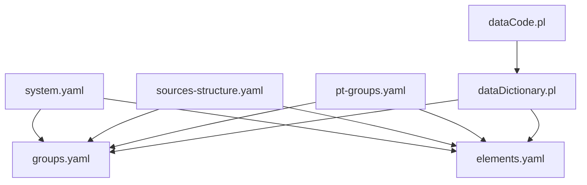
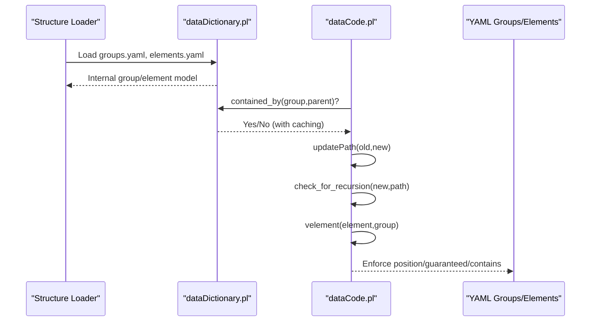
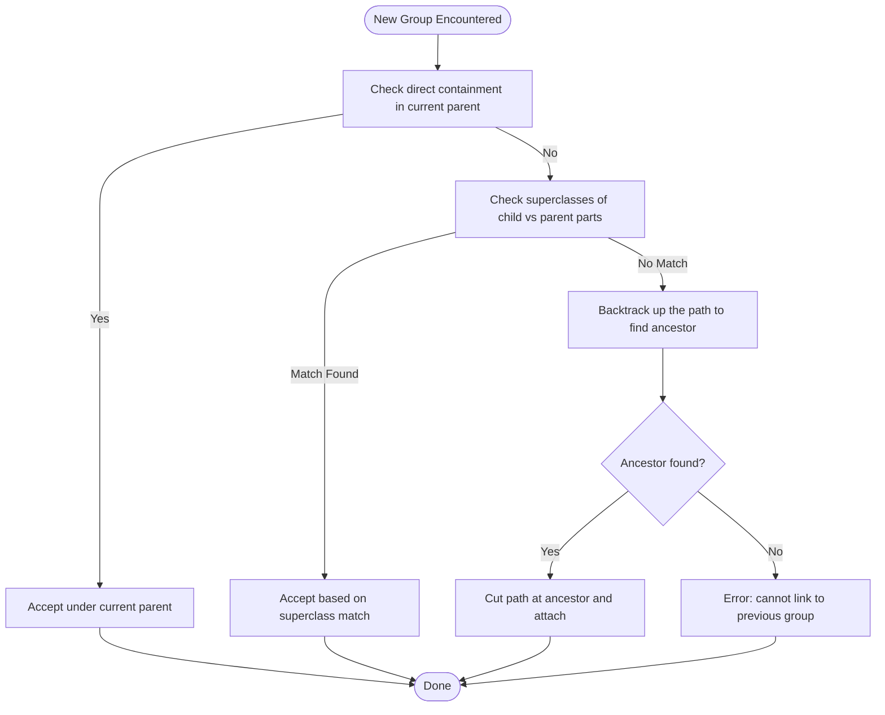
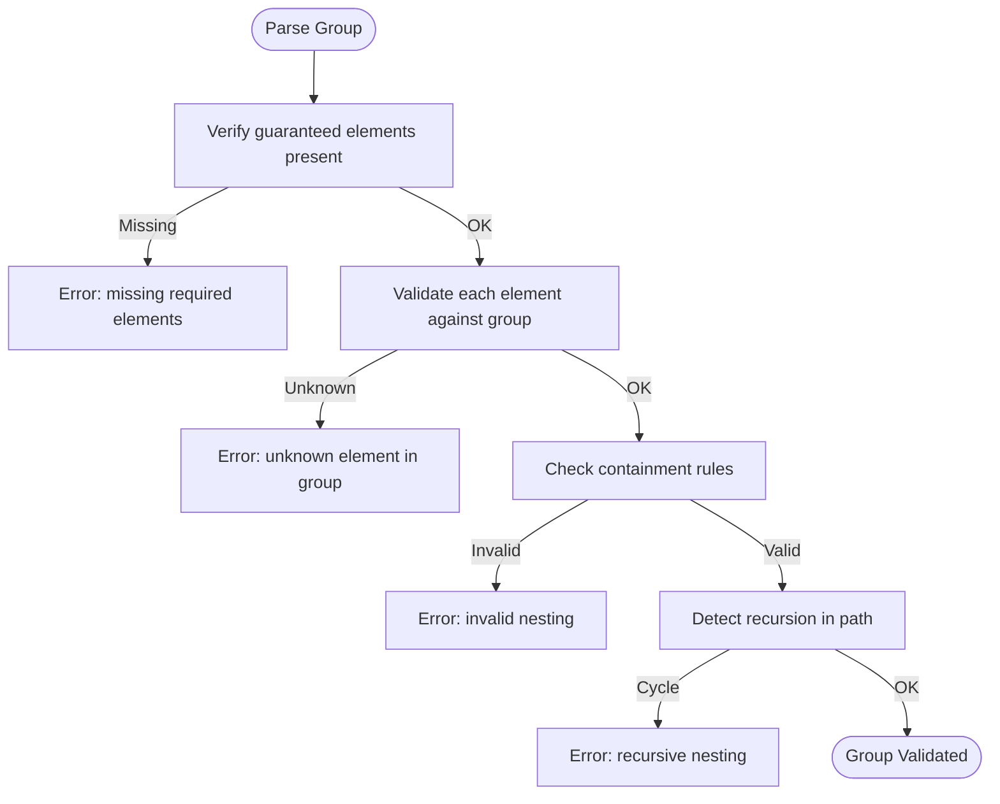
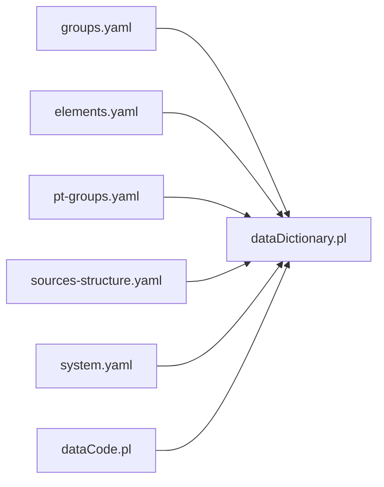

# Group Hierarchy Definitions

<cite>
**Referenced Files in This Document**
- [groups.yaml](file://src/stru/groups.yaml)
- [elements.yaml](file://src/stru/elements.yaml)
- [system.yaml](file://src/stru/system.yaml)
- [sources-structure.yaml](file://src/stru/sources-structure.yaml)
- [pt-groups.yaml](file://src/stru/pt-groups.yaml)
- [dataDictionary.pl](file://src/dataDictionary.pl)
- [dataCode.pl](file://src/dataCode.pl)
</cite>

## Table of Contents
1. [Introduction](#introduction)
2. [Project Structure](#project-structure)
3. [Core Components](#core-components)
4. [Architecture Overview](#architecture-overview)
5. [Detailed Component Analysis](#detailed-component-analysis)
6. [Dependency Analysis](#dependency-analysis)
7. [Performance Considerations](#performance-considerations)
8. [Troubleshooting Guide](#troubleshooting-guide)
9. [Conclusion](#conclusion)

## Introduction
This document explains how YAML group hierarchy definitions work in the project, focusing on:
- How groups are created and organized into logical hierarchies
- Nesting patterns and containment relationships
- Inheritance via source extension
- Cross-references between groups (e.g., relations and identifiers)
- Validation rules and constraint enforcement during parsing
- Performance considerations for large hierarchies

The system uses YAML structure files to define reusable building blocks (groups and elements). Groups can extend other groups to inherit properties and allowed children, enabling a flexible and layered schema design.

## Project Structure
At the heart of the schema system are YAML files that declare groups and elements, plus Prolog modules that load, validate, and enforce these definitions at runtime.

**Diagram sources**
- [system.yaml:1-4](file://src/stru/system.yaml#L1-L4)
- [sources-structure.yaml:1-10](file://src/stru/sources-structure.yaml#L1-L10)
- [groups.yaml:1-686](file://src/stru/groups.yaml#L1-L686)
- [elements.yaml:1-305](file://src/stru/elements.yaml#L1-L305)
- [pt-groups.yaml:1-238](file://src/stru/pt-groups.yaml#L1-L238)
- [dataDictionary.pl:1-200](file://src/dataDictionary.pl#L1-L200)
- [dataCode.pl:150-350](file://src/dataCode.pl#L150-L350)

**Section sources**
- [system.yaml:1-4](file://src/stru/system.yaml#L1-L4)
- [sources-structure.yaml:1-10](file://src/stru/sources-structure.yaml#L1-L10)
- [groups.yaml:1-686](file://src/stru/groups.yaml#L1-L686)
- [elements.yaml:1-305](file://src/stru/elements.yaml#L1-L305)
- [pt-groups.yaml:1-238](file://src/stru/pt-groups.yaml#L1-L238)

## Core Components
- Groups: Reusable containers with metadata such as position, guaranteed, also, contains/part, idprefix, and source inheritance.
- Elements: Primitive or derived data fields used by groups; they support type information and special behaviors.
- Inheritance: Groups extend other groups via source, inheriting properties unless overridden.
- Containment: The contains/part lists define which child groups may appear inside a parent group.
- Positional and mandatory constraints: position defines default ordering; guaranteed enforces required elements.

Key examples from the core schema include top-level container kleio, historical-source, event, entity, person, object, attribute/relation, and specialized Portuguese constructs like fonte and pt-acto.

**Section sources**
- [groups.yaml:69-133](file://src/stru/groups.yaml#L69-L133)
- [groups.yaml:141-176](file://src/stru/groups.yaml#L141-L176)
- [groups.yaml:219-244](file://src/stru/groups.yaml#L219-L244)
- [groups.yaml:353-381](file://src/stru/groups.yaml#L353-L381)
- [groups.yaml:524-568](file://src/stru/groups.yaml#L524-L568)
- [elements.yaml:86-125](file://src/stru/elements.yaml#L86-L125)
- [elements.yaml:129-177](file://src/stru/elements.yaml#L129-L177)

## Architecture Overview
The runtime architecture loads YAML structures, builds an internal dictionary of groups and elements, and enforces validation while parsing Kleio data.

**Diagram sources**
- [dataDictionary.pl:184-261](file://src/dataDictionary.pl#L184-L261)
- [dataCode.pl:217-281](file://src/dataCode.pl#L217-L281)
- [dataCode.pl:298-321](file://src/dataCode.pl#L298-L321)

## Detailed Component Analysis

### Group Creation and Inheritance
Groups are declared in YAML with keys such as name, description, position, guaranteed, also, contains/part, idprefix, and source. When source is specified, the group inherits all properties from its parent unless explicitly overridden.

Examples:
- entity is a base group with id/type/name and common attributes.
- historical-source extends entity and adds source-specific fields and allowed children.
- person/object/geoentity extend entity with domain-specific defaults.
- Portuguese groups like fonte and pt-acto extend core groups to tailor behavior for specific document types.

Inheritance flow:
- Source resolution copies parent properties into the child.
- Child overrides take precedence.
- Contains/part lists compose allowed children, including inherited ones.

**Section sources**
- [groups.yaml:84-94](file://src/stru/groups.yaml#L84-L94)
- [groups.yaml:110-133](file://src/stru/groups.yaml#L110-L133)
- [groups.yaml:373-381](file://src/stru/groups.yaml#L373-L381)
- [groups.yaml:453-463](file://src/stru/groups.yaml#L453-L463)
- [groups.yaml:353-366](file://src/stru/groups.yaml#L353-L366)
- [pt-groups.yaml:21-49](file://src/stru/pt-groups.yaml#L21-L49)
- [pt-groups.yaml:51-59](file://src/stru/pt-groups.yaml#L51-L59)

### Nesting Patterns and Containment
Containment is defined via contains/part lists. During parsing, the system determines where a new group fits in the current path using containment checks and ancestor traversal.

Key behaviors:
- Direct containment: child must be listed in parent’s contains/part.
- Superclass containment: if a child is not directly listed but a superclass is, it is accepted.
- Path updates: the parser maintains a stack-like path and chooses the longest valid nesting.
- Recursion prevention: cycles are detected and rejected.

**Diagram sources**
- [dataDictionary.pl:184-261](file://src/dataDictionary.pl#L184-L261)
- [dataCode.pl:217-267](file://src/dataCode.pl#L217-L267)

**Section sources**
- [dataDictionary.pl:184-261](file://src/dataDictionary.pl#L184-L261)
- [dataCode.pl:217-267](file://src/dataCode.pl#L217-L267)

### Relationship Definitions and Cross-References
Groups support cross-references through:
- Identifier elements: id, same_as, xsame_as, destination, origin.
- Relation groups: relation/rel with type/value and destination references.
- Authority registers: identifications contain real entities and occurrences linking back to source records.

These enable linking across documents and within a single file, and generating automatic identification relations.

**Section sources**
- [elements.yaml:86-125](file://src/stru/elements.yaml#L86-L125)
- [groups.yaml:545-568](file://src/stru/groups.yaml#L545-L568)
- [groups.yaml:163-176](file://src/stru/groups.yaml#L163-L176)

### Flat Group Structures
Flat structures occur when groups do not nest deeply and rely on positional and optional fields. Examples:
- kleio as a top-level container with no strict nesting beyond its allows.
- text as a simple leaf group with a single required element.
- property as a lightweight control group.

These patterns are useful for configuration and metadata without deep hierarchies.

**Section sources**
- [groups.yaml:95-108](file://src/stru/groups.yaml#L95-L108)
- [groups.yaml:272-292](file://src/stru/groups.yaml#L272-L292)
- [groups.yaml:200-216](file://src/stru/groups.yaml#L200-L216)

### Nested Hierarchies
Nested hierarchies leverage contains/part to build complex structures:
- historical-source contains acts/events/text.
- authority-register contains authority-record; identifications contains rentity/rperson/robject.
- geoentity hierarchy: geodesc -> geo1 -> geo2 -> geo3 -> geo4.

These patterns allow modeling rich relationships and multi-level organization.

**Section sources**
- [groups.yaml:110-133](file://src/stru/groups.yaml#L110-L133)
- [groups.yaml:141-176](file://src/stru/groups.yaml#L141-L176)
- [groups.yaml:639-686](file://src/stru/groups.yaml#L639-L686)

### Cross-References Between Groups
Cross-references are achieved via:
- Relations (relation/rel) connecting entities by type/value and destination.
- Identifiers (same_as/xsame_as) linking occurrences across files.
- Occurrence lists (occ) in authority registers tying real entities to source entries.

These mechanisms support robust linking and traceability.

**Section sources**
- [groups.yaml:545-568](file://src/stru/groups.yaml#L545-L568)
- [elements.yaml:96-125](file://src/stru/elements.yaml#L96-L125)
- [groups.yaml:341-350](file://src/stru/groups.yaml#L341-L350)

### Group Validation Rules and Constraint Enforcement
Validation occurs both at schema load time and during parsing:
- Element presence: guaranteed lists enforce required elements; missing elements trigger errors.
- Allowed elements: element_of checks ensure only permitted elements appear in a group.
- Containment checks: contained_by verifies hierarchical validity, including superclass-based matching.
- Recursion detection: updatePath + check_for_recursion prevent infinite nesting loops.

**Diagram sources**
- [dataCode.pl:154-168](file://src/dataCode.pl#L154-L168)
- [dataCode.pl:298-321](file://src/dataCode.pl#L298-L321)
- [dataCode.pl:217-281](file://src/dataCode.pl#L217-L281)

**Section sources**
- [dataCode.pl:154-168](file://src/dataCode.pl#L154-L168)
- [dataCode.pl:298-321](file://src/dataCode.pl#L298-L321)
- [dataCode.pl:217-281](file://src/dataCode.pl#L217-L281)
- [dataDictionary.pl:184-261](file://src/dataDictionary.pl#L184-L261)

## Dependency Analysis
The dependency graph shows how YAML schemas feed into the Prolog runtime, which enforces constraints and manages hierarchy navigation.

**Diagram sources**
- [groups.yaml:1-686](file://src/stru/groups.yaml#L1-L686)
- [elements.yaml:1-305](file://src/stru/elements.yaml#L1-L305)
- [pt-groups.yaml:1-238](file://src/stru/pt-groups.yaml#L1-L238)
- [sources-structure.yaml:1-10](file://src/stru/sources-structure.yaml#L1-L10)
- [system.yaml:1-4](file://src/stru/system.yaml#L1-L4)
- [dataDictionary.pl:1-200](file://src/dataDictionary.pl#L1-L200)
- [dataCode.pl:150-350](file://src/dataCode.pl#L150-L350)

**Section sources**
- [dataDictionary.pl:1-200](file://src/dataDictionary.pl#L1-L200)
- [dataCode.pl:150-350](file://src/dataCode.pl#L150-L350)

## Performance Considerations
For large group hierarchies:
- Use shallow, well-scoped groups to minimize path traversal cost.
- Prefer explicit contains/part lists to reduce superclass lookup overhead.
- Leverage caching: the system caches containment results to speed repeated checks.
- Avoid deep recursion: keep nesting levels reasonable and use end markers to reset context when processing long lists.
- Split schemas: organize related groups into modular YAML files and include them selectively to reduce memory footprint.

[No sources needed since this section provides general guidance]

## Troubleshooting Guide
Common issues and resolutions:
- Missing required elements: Ensure all guaranteed elements are present in the group instance.
- Unknown element in group: Verify the element is allowed by the group’s locus/ceteri/certe lists or its superclass.
- Invalid nesting: Confirm the child group appears in the parent’s contains/part list or that a superclass match applies.
- Recursive nesting error: Remove cycles in group definitions or adjust path logic to avoid self-reference.

Actionable checks:
- Inspect guaranteed and position lists in group definitions.
- Review contains/part lists for intended children.
- Validate inheritance chains to ensure expected property propagation.

**Section sources**
- [dataCode.pl:154-168](file://src/dataCode.pl#L154-L168)
- [dataCode.pl:298-321](file://src/dataCode.pl#L298-L321)
- [dataCode.pl:217-281](file://src/dataCode.pl#L217-L281)

## Conclusion
YAML group hierarchy definitions provide a powerful, extensible way to model complex historical data. By combining inheritance, containment, and cross-references, the system supports both flat and deeply nested structures while enforcing strong validation rules. Proper design of groups and careful attention to performance characteristics will yield maintainable and efficient schemas.

[No sources needed since this section summarizes without analyzing specific files]