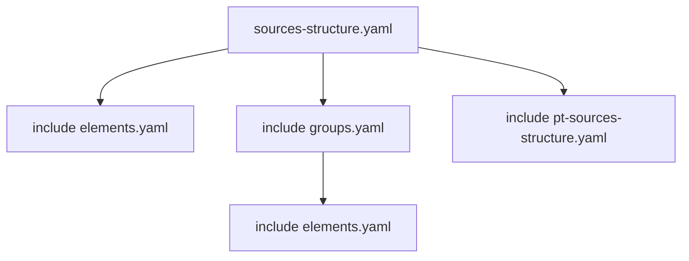
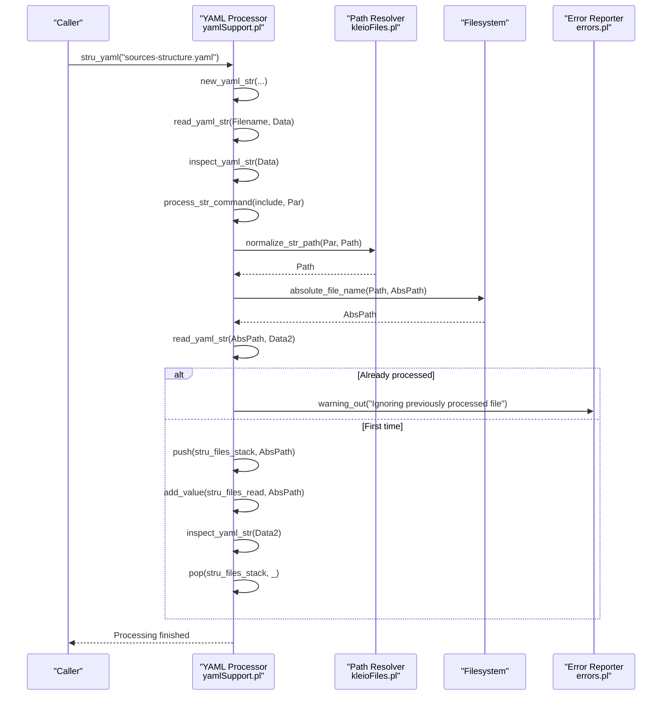
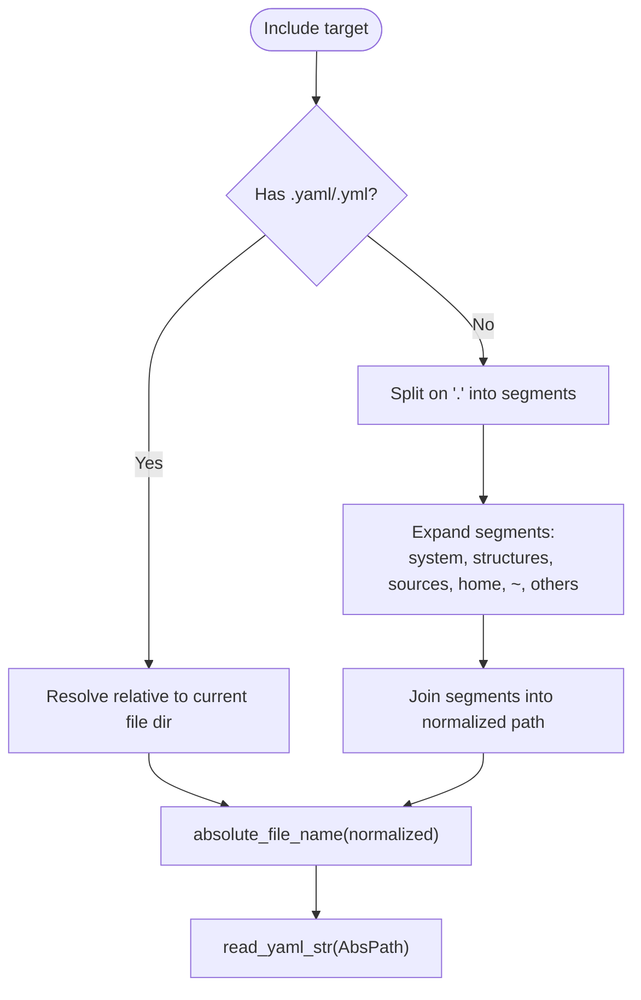
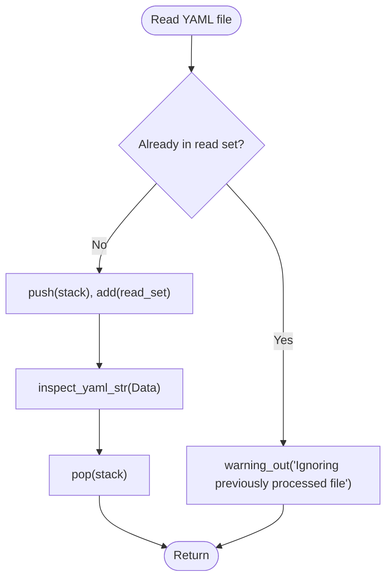
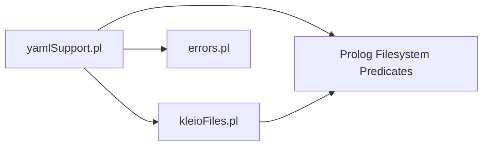

# Include and Import Commands

<cite>
**Referenced Files in This Document**
- [yamlSupport.pl](file://src/yamlSupport.pl)
- [kleioFiles.pl](file://src/kleioFiles.pl)
- [errors.pl](file://src/errors.pl)
- [sources-structure.yaml](file://src/stru/sources-structure.yaml)
- [groups.yaml](file://src/stru/groups.yaml)
- [elements.yaml](file://src/stru/elements.yaml)
</cite>

## Table of Contents
1. [Introduction](#introduction)
2. [Project Structure](#project-structure)
3. [Core Components](#core-components)
4. [Architecture Overview](#architecture-overview)
5. [Detailed Component Analysis](#detailed-component-analysis)
6. [Dependency Analysis](#dependency-analysis)
7. [Performance Considerations](#performance-considerations)
8. [Troubleshooting Guide](#troubleshooting-guide)
9. [Conclusion](#conclusion)
10. [Appendices](#appendices)

## Introduction
This document explains the YAML include and import functionality used to compose modular schema definitions. It covers:
- The include command syntax
- Path resolution mechanisms (relative, system, home, structures, sources, absolute)
- File inclusion patterns and processing order
- Circular dependency detection behavior
- Error handling for missing files and path resolution failures
- Examples of modular schema organization using includes

The implementation is driven by a YAML processor that reads structure files, inspects commands, and resolves included files before parsing their contents into the internal schema model.

## Project Structure
At a high level, YAML structure files are processed by a dedicated module that:
- Reads and parses YAML
- Dispatches commands such as file and include
- Resolves paths for included files
- Tracks processing state to avoid reprocessing and to report context

**Diagram sources**
- [sources-structure.yaml:1-10](file://src/stru/sources-structure.yaml#L1-L10)
- [groups.yaml:67-68](file://src/stru/groups.yaml#L67-L68)

**Section sources**
- [sources-structure.yaml:1-10](file://src/stru/sources-structure.yaml#L1-L10)
- [groups.yaml:67-68](file://src/stru/groups.yaml#L67-L68)

## Core Components
- YAML processor entry points:
  - Top-level driver initializes processing and delegates to the YAML reader
  - Command dispatcher handles file and include directives
  - Path resolver normalizes include targets to absolute paths
  - Error reporter provides contextual messages for warnings and errors

Key responsibilities:
- Read YAML and iterate over top-level items
- Execute include directive by resolving and loading referenced files
- Maintain a stack of currently processing files and a set of already read files
- Normalize include paths with support for special tokens and directory contexts

**Section sources**
- [yamlSupport.pl:28-46](file://src/yamlSupport.pl#L28-L46)
- [yamlSupport.pl:48-72](file://src/yamlSupport.pl#L48-L72)
- [yamlSupport.pl:93-129](file://src/yamlSupport.pl#L93-L129)
- [kleioFiles.pl:898-973](file://src/kleioFiles.pl#L898-L973)
- [errors.pl:77-113](file://src/errors.pl#L77-L113)

## Architecture Overview
The include mechanism follows a clear pipeline:
- YAML parser yields a list of commands
- The include command triggers path normalization and recursive reading
- The reader checks if the target has been previously processed; otherwise it reads and inspects it
- Errors and warnings are reported with context (current file, command, etc.)

**Diagram sources**
- [yamlSupport.pl:28-46](file://src/yamlSupport.pl#L28-L46)
- [yamlSupport.pl:48-72](file://src/yamlSupport.pl#L48-L72)
- [yamlSupport.pl:93-129](file://src/yamlSupport.pl#L93-L129)
- [kleioFiles.pl:898-973](file://src/kleioFiles.pl#L898-L973)
- [errors.pl:77-113](file://src/errors.pl#L77-L113)

## Detailed Component Analysis

### Include Command Syntax
- The include directive is specified as a top-level YAML item with key include and a string value representing the target file path.
- Example usage appears in structure files where multiple modules are composed via include entries.

Supported examples:
- Simple filename without extension or with .yaml/.yml
- Relative path segments separated by dots
- Special tokens like system, structures, sources, home
- Absolute paths

Examples from repository:
- Composing core modules in the main structure file
- Including shared element definitions within group definitions

**Section sources**
- [sources-structure.yaml:1-10](file://src/stru/sources-structure.yaml#L1-L10)
- [groups.yaml:67-68](file://src/stru/groups.yaml#L67-L68)

### Path Resolution Mechanisms
Path normalization supports several formats:
- Filename only (with optional .yaml/.yml): resolved relative to the directory of the current YAML file
- Dot-separated path segments:
  - system: resolves to the configured system structures directory
  - structures: resolves to user-specific structures directory when available, otherwise falls back to a local structures directory under the home
  - sources: resolves to user-specific sources directory when available, otherwise falls back to a local sources directory under the home
  - home: resolves to the Kleio home directory
  - ~: treated as the directory of the current structure file (implementation detail)
- Absolute paths: passed through after normalization

Resolution steps:
- Split the input path on dots into segments
- Expand each segment using create_str_path rules
- Concatenate segments into a normalized path
- Convert to an absolute path before reading

**Diagram sources**
- [kleioFiles.pl:898-973](file://src/kleioFiles.pl#L898-L973)

**Section sources**
- [kleioFiles.pl:898-973](file://src/kleioFiles.pl#L898-L973)

### File Inclusion Patterns
Common patterns observed in the codebase:
- Modular composition: a top-level structure file includes multiple sub-files (e.g., elements, groups, domain-specific extensions)
- Shared building blocks: elements.yaml defines reusable elements; groups.yaml includes elements.yaml and then defines groups
- Domain-specific overlays: additional files extend or specialize base definitions

These patterns enable maintainable schemas by separating concerns across files while keeping a single entry point.

**Section sources**
- [sources-structure.yaml:1-10](file://src/stru/sources-structure.yaml#L1-L10)
- [groups.yaml:67-68](file://src/stru/groups.yaml#L67-L68)
- [elements.yaml:1-305](file://src/stru/elements.yaml#L1-L305)

### Processing Order and Reentrancy
Processing order:
- Depth-first traversal of include tree
- Each file is pushed onto a stack during inspection and popped afterward
- A set of already-read files prevents duplicate processing

Behavior for repeated includes:
- If a file is encountered again, a warning is emitted indicating the file is being ignored because it was previously processed
- No circular dependency error is raised; instead, the system avoids infinite recursion by skipping reprocessed files

**Diagram sources**
- [yamlSupport.pl:48-72](file://src/yamlSupport.pl#L48-L72)
- [errors.pl:101-113](file://src/errors.pl#L101-L113)

**Section sources**
- [yamlSupport.pl:48-72](file://src/yamlSupport.pl#L48-L72)
- [errors.pl:101-113](file://src/errors.pl#L101-L113)

### Error Handling for Missing Files and Path Failures
- When a file is already processed, a warning is issued rather than failing
- Unknown commands produce errors with context including the current file and command
- Path resolution relies on filesystem predicates; if a path cannot be made absolute or the file does not exist, subsequent operations will fail at the filesystem layer
- Contextual reporting uses the current YAML file and command information to aid debugging

Practical implications:
- Ensure include targets resolve correctly using supported path formats
- Prefer explicit filenames with .yaml/.yml when referencing sibling files
- Use system, structures, sources, and home tokens to reference well-known directories

**Section sources**
- [yamlSupport.pl:48-72](file://src/yamlSupport.pl#L48-L72)
- [yamlSupport.pl:152-157](file://src/yamlSupport.pl#L152-L157)
- [errors.pl:77-113](file://src/errors.pl#L77-L113)

## Dependency Analysis
High-level dependencies among components involved in include processing:

- yamlSupport.pl orchestrates reading and dispatching include commands
- kleioFiles.pl provides path normalization and directory resolution helpers
- errors.pl centralizes error and warning output with context
- Both modules rely on Prolog’s built-in filesystem predicates for absolute path resolution and file access

**Diagram sources**
- [yamlSupport.pl:1-26](file://src/yamlSupport.pl#L1-L26)
- [kleioFiles.pl:1-40](file://src/kleioFiles.pl#L1-L40)
- [errors.pl:1-60](file://src/errors.pl#L1-L60)

**Section sources**
- [yamlSupport.pl:1-26](file://src/yamlSupport.pl#L1-L26)
- [kleioFiles.pl:1-40](file://src/kleioFiles.pl#L1-L40)
- [errors.pl:1-60](file://src/errors.pl#L1-L60)

## Performance Considerations
- Avoid redundant includes: the system skips previously processed files but still emits a warning; organizing includes to minimize duplication improves clarity and reduces noise
- Prefer stable, canonical paths (e.g., use system or home tokens) to reduce ambiguity and potential repeated lookups
- Keep include trees shallow and acyclic to simplify debugging and ensure predictable processing order

[No sources needed since this section provides general guidance]

## Troubleshooting Guide
Common issues and remedies:
- Warning about ignoring previously processed file
  - Cause: same file included more than once
  - Action: refactor includes to avoid duplicates; keep a single entry point per module
- Unknown command in YAML file
  - Cause: misspelled or unsupported directive
  - Action: verify spelling and supported keys (file, include)
- Include path not found
  - Cause: incorrect relative path or missing token expansion
  - Action: use dot-separated segments with recognized tokens; prefer absolute paths for external references; ensure .yaml/.yml extension when referencing sibling files
- Contextual error messages
  - Use the reported file and command in the message to locate the problematic include statement

**Section sources**
- [yamlSupport.pl:48-72](file://src/yamlSupport.pl#L48-L72)
- [yamlSupport.pl:152-157](file://src/yamlSupport.pl#L152-L157)
- [errors.pl:77-113](file://src/errors.pl#L77-L113)

## Conclusion
The YAML include mechanism enables modular schema design by composing multiple files through a simple directive and robust path resolution. The system safely handles repeated includes by issuing warnings and avoiding reprocessing, while providing contextual error reporting to guide users. By following recommended path formats and organizing includes logically, you can build maintainable and scalable structure definitions.

[No sources needed since this section summarizes without analyzing specific files]

## Appendices

### Supported Path Formats Summary
- Filename only (.yaml/.yml): resolved relative to the directory of the current YAML file
- Dot-separated segments:
  - system: system structures directory
  - structures: user structures directory (fallback to local structures)
  - sources: user sources directory (fallback to local sources)
  - home: Kleio home directory
  - ~: directory of the current structure file (implementation detail)
- Absolute paths: used directly after normalization

**Section sources**
- [kleioFiles.pl:898-973](file://src/kleioFiles.pl#L898-L973)

### Example Modular Organization
- Entry point includes core modules:
  - elements.yaml
  - groups.yaml
  - domain-specific overlay
- Shared elements defined once and reused across groups
- Groups extend or specialize base definitions by including elements and adding domain-specific content

**Section sources**
- [sources-structure.yaml:1-10](file://src/stru/sources-structure.yaml#L1-L10)
- [groups.yaml:67-68](file://src/stru/groups.yaml#L67-L68)
- [elements.yaml:1-305](file://src/stru/elements.yaml#L1-L305)