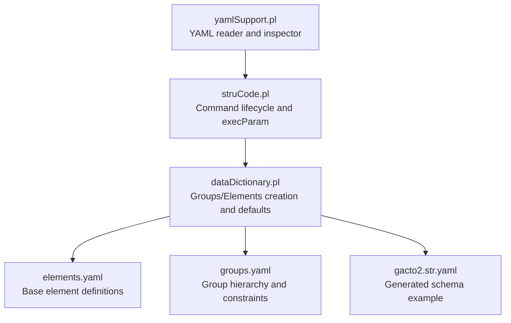
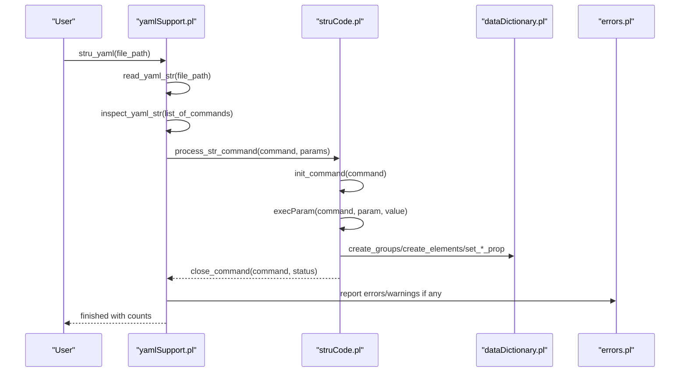
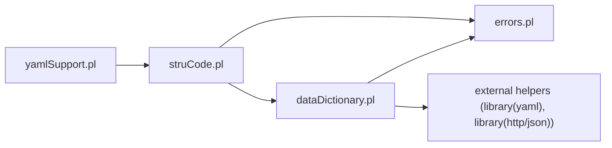

# Data Types and Validation

<cite>
**Referenced Files in This Document**
- [yamlSupport.pl](file://src/yamlSupport.pl)
- [struCode.pl](file://src/struCode.pl)
- [dataDictionary.pl](file://src/dataDictionary.pl)
- [elements.yaml](file://src/stru/elements.yaml)
- [groups.yaml](file://src/stru/groups.yaml)
- [gacto2.str.yaml](file://src/stru/gacto2.str.yaml)
- [errors.pl](file://src/errors.pl)
</cite>

## Table of Contents
1. Introduction
2. Project Structure
3. Core Components
4. Architecture Overview
5. Detailed Component Analysis
6. Dependency Analysis
7. Performance Considerations
8. Troubleshooting Guide
9. Conclusion

## Introduction
This document explains how YAML-based schema definitions represent data types and validation rules, focusing on supported types (strings, integers, lists, dictionaries, nested structures), type coercion, constraints, and custom validators. It also provides best practices for ensuring data integrity and effective error reporting when validation fails. The content is grounded in the repository’s YAML structure loader, command execution layer, and dictionary management modules.

## Project Structure
The YAML schema processing pipeline consists of:
- A YAML reader that inspects commands and parameters
- A command executor that bridges to internal Kleio commands
- A dictionary manager that creates groups and elements and stores their properties
- Example schemas defining base types and complex group hierarchies

**Diagram sources**
- [yamlSupport.pl](file://src/yamlSupport.pl)
- [struCode.pl](file://src/struCode.pl)
- [dataDictionary.pl](file://src/dataDictionary.pl)
- [elements.yaml](file://src/stru/elements.yaml)
- [groups.yaml](file://src/stru/groups.yaml)
- [gacto2.str.yaml](file://src/stru/gacto2.str.yaml)

**Section sources**
- [yamlSupport.pl](file://src/yamlSupport.pl)
- [struCode.pl](file://src/struCode.pl)
- [dataDictionary.pl](file://src/dataDictionary.pl)
- [elements.yaml](file://src/stru/elements.yaml)
- [groups.yaml](file://src/stru/groups.yaml)
- [gacto2.str.yaml](file://src/stru/gacto2.str.yaml)

## Core Components
- YAML support module: reads YAML files, normalizes values, dispatches commands, and includes other files.
- Command execution module: initializes/closes commands, sets defaults, executes parameter assignments, and performs completeness checks.
- Dictionary module: creates groups and elements, applies inheritance via source/fons, computes containment, and manages property storage.
- Schema examples: define base types and complex groups with constraints like guaranteed, position, contains/part, and idprefix.

Key responsibilities:
- Type representation: elements declare names and optional type-like attributes; some elements specialize others via source.
- Constraints: groups specify guaranteed, position, also, contains/part, and idprefix.
- Coercion: strings are sanitized to atoms during parameter processing.
- Validation: required parameters are checked; unknown commands/parameters produce errors/warnings.

**Section sources**
- [yamlSupport.pl](file://src/yamlSupport.pl)
- [struCode.pl](file://src/struCode.pl)
- [dataDictionary.pl](file://src/dataDictionary.pl)
- [elements.yaml](file://src/stru/elements.yaml)
- [groups.yaml](file://src/stru/groups.yaml)

## Architecture Overview
The end-to-end flow from a YAML file to an in-memory schema:

**Diagram sources**
- [yamlSupport.pl](file://src/yamlSupport.pl)
- [struCode.pl](file://src/struCode.pl)
- [dataDictionary.pl](file://src/dataDictionary.pl)
- [errors.pl](file://src/errors.pl)

## Detailed Component Analysis

### YAML Reader and Inspector (yamlSupport.pl)
Responsibilities:
- Read YAML into Prolog terms
- Normalize string values to atoms
- Dispatch commands and parameters to the execution layer
- Include other YAML files and track processed files to avoid duplicates

Type handling highlights:
- sanitize_value converts atomic strings to atoms and recursively processes lists, enabling consistent parameter values.
- Values can be scalars, lists, or dictionaries (command blocks).

Validation behavior:
- Unknown commands trigger error messages with context.
- Out-of-context commands (e.g., name/description outside file block) raise errors.

Best practices:
- Use include to modularize schemas.
- Keep command keys aligned with supported keywords.

**Section sources**
- [yamlSupport.pl](file://src/yamlSupport.pl)

### Command Execution Layer (struCode.pl)
Responsibilities:
- Initialize and finalize commands
- Set default values per command
- Execute parameter assignments (execParam)
- Perform completeness checks and propagate status

Type-related behaviors:
- For groups (pars), nomen must precede other parameters; otherwise, an error is raised.
- For elements (terminus), nomen must precede other parameters; otherwise, an error is raised.
- Source/fons parameters enable inheritance by copying properties from a base group/element.

Constraints enforcement:
- Required parameters are enforced via check_complete and missingParam.
- Unknown parameters generate warnings/errors.

Customization points:
- execParam predicates handle specific parameters and can extend behavior for new types/constraints.

**Section sources**
- [struCode.pl](file://src/struCode.pl)

### Dictionary Management (dataDictionary.pl)
Responsibilities:
- Create groups and elements, assign IDs, and store properties
- Apply defaults and generic inheritance mechanisms
- Compute containment relationships and super-group hierarchies
- Provide utilities to query and display schema information

Type modeling:
- Elements can specialize other elements via source, reusing descriptions and semantics.
- Groups can extend other groups via source, inheriting parts, guarantees, positions, etc.

Constraints and validation:
- Guaranteed fields enforce presence requirements at runtime.
- Position defines order and shorthand registration patterns.
- Contains/part define allowed subgroups.

Complex structures:
- Hierarchical group definitions (e.g., historical-source extends entity) demonstrate inheritance and composition.

**Section sources**
- [dataDictionary.pl](file://src/dataDictionary.pl)
- [groups.yaml](file://src/stru/groups.yaml)

### Base Element Definitions (elements.yaml)
Supported primitive-like types and building blocks:
- number: numeric values
- string64: short identifiers
- string256: longer text fields
- text: long free-form text
- date: YYYYMMDD or YYYY-MM-DD, ranges, and relative dates
- id: unique identifier referencing another entity
- same_as/xsame_as: intra-file and cross-file identity links
- type/value/class: attribute metadata
- ref/page/pages: bibliographic references
- obs/summary: notes and summaries
- control elements: prefix, structure, translations, translator, autorels

Type coercion and usage:
- Many elements specialize others via source, e.g., occurrence specializes id, dbase specializes string256.
- Date elements may carry extra info internally.

Examples of complex structures:
- Attribute and relation groups compose multiple elements and enforce required fields.

**Section sources**
- [elements.yaml](file://src/stru/elements.yaml)

### Group Hierarchy and Constraints (groups.yaml)
Core groups and their roles:
- kleio: top-level container
- historical-source: main container for acts/events
- authority-register and identifications: authority records and real-entity aggregation
- person/object/geoentity/abstraction: domain entities
- attribute/relation: time-varying attributes and relations
- cevent/event/historical-act: event modeling variants

Constraints:
- guaranteed: required elements
- position: ordered shorthand registration
- also: optional elements
- contains/part: allowed subgroups
- idprefix: ID generation prefixes

Inheritance:
- source: extend existing groups to reuse configuration and semantics

Example patterns:
- person extends entity with specific guarantees and contains.
- attribute and relation groups standardize common fields.

**Section sources**
- [groups.yaml](file://src/stru/groups.yaml)

### Generated Schema Example (gacto2.str.yaml)
Demonstrates:
- Automatic generation of YAML from legacy structure files
- Consistent element declarations with description, identification, prefix/suffix
- Group definitions mirroring the core hierarchy

Use this as a reference for expected YAML shape and naming conventions.

**Section sources**
- [gacto2.str.yaml](file://src/stru/gacto2.str.yaml)

### Error Reporting and Context (errors.pl)
Features:
- Unified error and warning output with context (file, line numbers, surrounding lines)
- Counters for errors and warnings
- Maximum error threshold to abort translation

Integration points:
- Called throughout schema processing to report unknown commands, missing parameters, and invalid configurations.

Best practices:
- Always provide context options (file, line_number, line_text) when raising errors for better diagnostics.

**Section sources**
- [errors.pl](file://src/errors.pl)

## Dependency Analysis
High-level dependencies among modules:

Coupling and cohesion:
- yamlSupport depends on struCode for command execution and on errors for reporting.
- struCode orchestrates dataDictionary operations and error reporting.
- dataDictionary encapsulates schema state and queries, maintaining high cohesion around group/element management.

Potential circular dependencies:
- None observed between these core modules; they follow a layered approach.

External integrations:
- library(yaml) for reading YAML
- library(http/json) for JSON/YAML export utilities

**Diagram sources**
- [yamlSupport.pl](file://src/yamlSupport.pl)
- [struCode.pl](file://src/struCode.pl)
- [dataDictionary.pl](file://src/dataDictionary.pl)
- [errors.pl](file://src/errors.pl)

**Section sources**
- [yamlSupport.pl](file://src/yamlSupport.pl)
- [struCode.pl](file://src/struCode.pl)
- [dataDictionary.pl](file://src/dataDictionary.pl)
- [errors.pl](file://src/errors.pl)

## Performance Considerations
- Avoid deep nesting in YAML where possible; prefer modular includes to keep processing efficient.
- Reuse base elements and groups via source to minimize duplication and speed up initialization.
- Limit excessive guaranteed/position lists to reduce runtime checks.
- Monitor error counts; early detection prevents costly downstream failures.

[No sources needed since this section provides general guidance]

## Troubleshooting Guide
Common issues and resolutions:
- Unknown command in YAML: verify spelling and ensure it maps to a supported keyword.
- Missing required parameters: ensure nomen precedes other parameters for pars/terminus.
- Duplicate definitions: merging occurs with warnings; review intended overrides.
- Undefined source/fons: ensure referenced groups/elements exist before use.

Error reporting tips:
- Use context options to pinpoint file and line numbers.
- Inspect generated reports for near-line context to locate issues quickly.

**Section sources**
- [struCode.pl](file://src/struCode.pl)
- [errors.pl](file://src/errors.pl)

## Conclusion
The YAML schema system models data types through element definitions and enforces validation via group constraints and command execution logic. By leveraging inheritance (source), clear constraints (guaranteed, position, contains/part), and robust error reporting, you can build reliable, maintainable schemas. Follow best practices for modularity, explicit typing via specialization, and comprehensive diagnostics to ensure data integrity and smooth development workflows.

[No sources needed since this section summarizes without analyzing specific files]