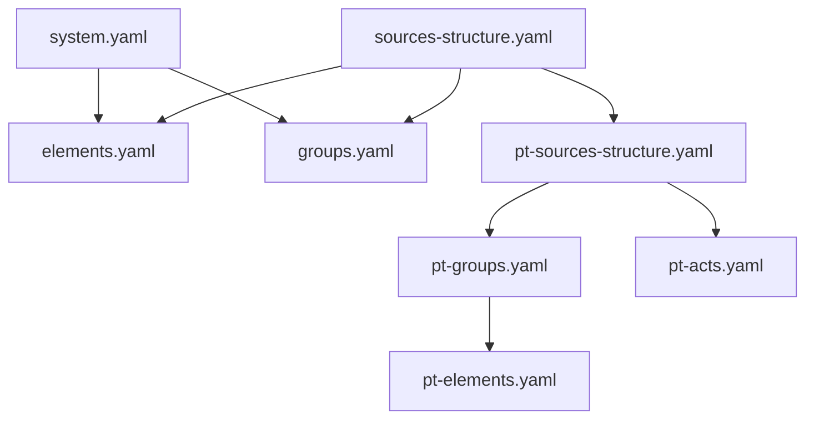
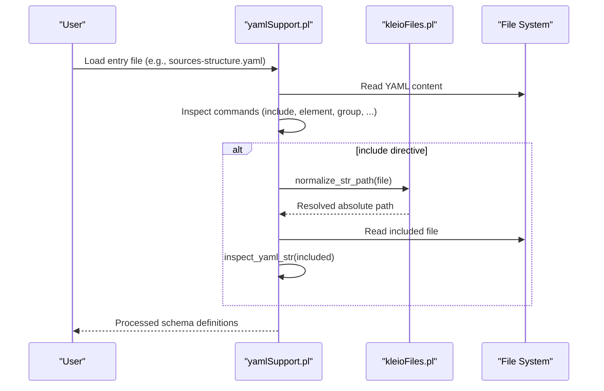
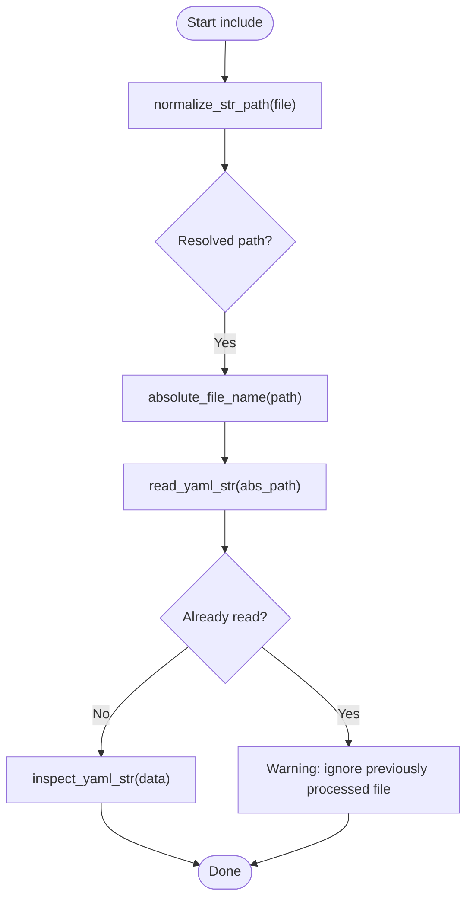
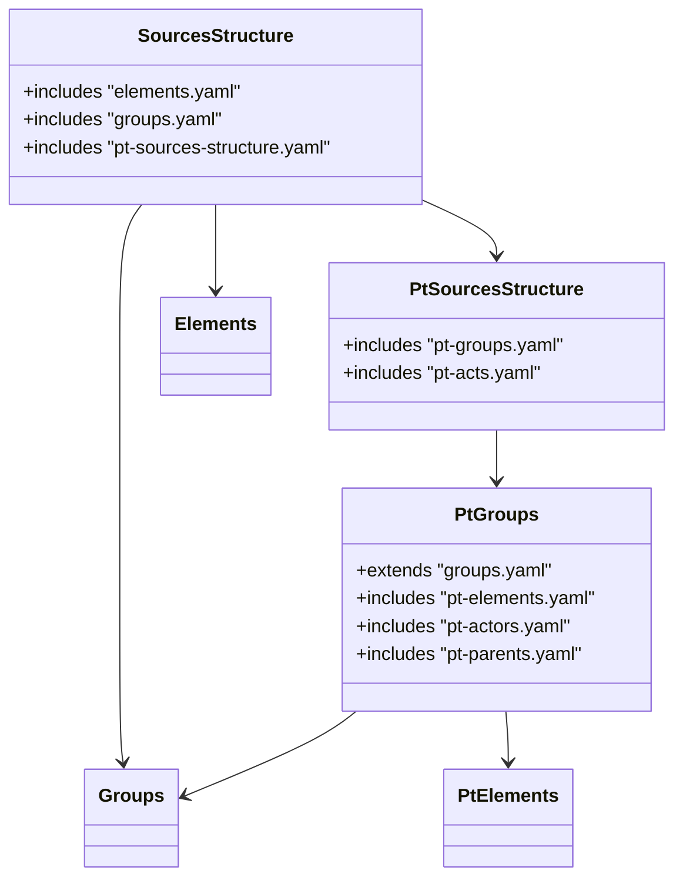
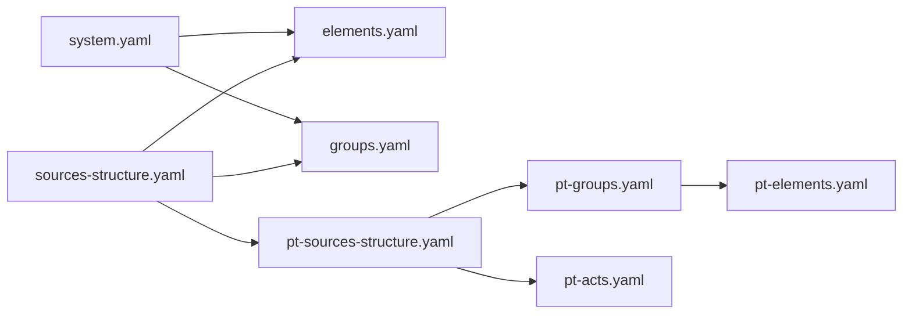

# File Organization and Structure

<cite>
**Referenced Files in This Document**
- [sources-structure.yaml](file://src/stru/sources-structure.yaml)
- [elements.yaml](file://src/stru/elements.yaml)
- [groups.yaml](file://src/stru/groups.yaml)
- [pt-sources-structure.yaml](file://src/stru/pt-sources-structure.yaml)
- [pt-groups.yaml](file://src/stru/pt-groups.yaml)
- [pt-elements.yaml](file://src/stru/pt-elements.yaml)
- [system.yaml](file://src/stru/system.yaml)
- [README.md](file://src/stru/README.md)
- [yamlSupport.pl](file://src/yamlSupport.pl)
- [kleioFiles.pl](file://src/kleioFiles.pl)
- [test_duplicate_1.yaml](file://tests/kleio-home/structures/in_process/test_duplicate_1.yaml)
- [test_duplicate_2.yaml](file://tests/kleio-home/structures/in_process/test_duplicate_2.yaml)
- [test_duplicate_include.yaml](file://tests/kleio-home/structures/in_process/test_duplicate_include.yaml)
</cite>

## Table of Contents
1. [Introduction](#introduction)
2. [Project Structure](#project-structure)
3. [Core Components](#core-components)
4. [Architecture Overview](#architecture-overview)
5. [Detailed Component Analysis](#detailed-component-analysis)
6. [Dependency Analysis](#dependency-analysis)
7. [Performance Considerations](#performance-considerations)
8. [Troubleshooting Guide](#troubleshooting-guide)
9. [Conclusion](#conclusion)
10. [Appendices](#appendices)

## Introduction
This document explains how to organize YAML schema files for Kleio structures, focusing on modular composition using include directives, file naming conventions, directory structure best practices, and collaborative workflows. It clarifies the role of sources-structure.yaml as the default entry point and shows how core building blocks (elements and groups) are composed into domain-specific schemas such as Portuguese sources.

## Project Structure
The repository organizes schema definitions under src/stru with a clear separation between:
- Core building blocks: elements.yaml and groups.yaml
- Domain-specific extensions: pt-elements.yaml, pt-groups.yaml, pt-sources-structure.yaml
- Entry points: sources-structure.yaml (default), system.yaml (alternative base)
- Documentation: README.md

**Diagram sources**
- [sources-structure.yaml:1-10](file://src/stru/sources-structure.yaml#L1-L10)
- [pt-sources-structure.yaml:1-4](file://src/stru/pt-sources-structure.yaml#L1-L4)
- [pt-groups.yaml:1-20](file://src/stru/pt-groups.yaml#L1-L20)
- [system.yaml:1-4](file://src/stru/system.yaml#L1-L4)

**Section sources**
- [README.md:1-7](file://src/stru/README.md#L1-L7)
- [sources-structure.yaml:1-10](file://src/stru/sources-structure.yaml#L1-L10)
- [system.yaml:1-4](file://src/stru/system.yaml#L1-L4)

## Core Components
- Entry points
  - sources-structure.yaml: Default structure that composes core elements, core groups, and Portuguese source extensions.
  - system.yaml: Alternative base that includes core groups and elements without language-specific extensions.
- Building blocks
  - elements.yaml: Defines fundamental data types and standard elements used across all schemas.
  - groups.yaml: Defines core groups (e.g., kleio, historical-source, entity, person, relation) and their relationships.
- Language/domain extensions
  - pt-elements.yaml: Provides Portuguese aliases for core elements by referencing English names via source mapping.
  - pt-groups.yaml: Extends core groups with Portuguese-specific constructs and includes Portuguese actors and parents.
  - pt-sources-structure.yaml: Composes Portuguese groups and acts into a cohesive Portuguese source structure.

Best practices
- Keep core building blocks immutable and reusable.
- Use include directives to compose higher-level schemas from lower-level modules.
- Prefer short, descriptive filenames aligned with content (e.g., elements.yaml, groups.yaml).
- Maintain a single entry point per project or environment (e.g., sources-structure.yaml).

**Section sources**
- [sources-structure.yaml:1-10](file://src/stru/sources-structure.yaml#L1-L10)
- [elements.yaml:1-305](file://src/stru/elements.yaml#L1-L305)
- [groups.yaml:1-686](file://src/stru/groups.yaml#L1-L686)
- [pt-elements.yaml:1-136](file://src/stru/pt-elements.yaml#L1-L136)
- [pt-groups.yaml:1-200](file://src/stru/pt-groups.yaml#L1-L200)
- [pt-sources-structure.yaml:1-4](file://src/stru/pt-sources-structure.yaml#L1-L4)
- [system.yaml:1-4](file://src/stru/system.yaml#L1-L4)

## Architecture Overview
The schema loader reads an entry YAML file, processes include directives, resolves paths relative to the current file or special directories, and merges definitions while preventing duplicate processing.

**Diagram sources**
- [yamlSupport.pl:49-72](file://src/yamlSupport.pl#L49-L72)
- [yamlSupport.pl:192-195](file://src/yamlSupport.pl#L192-L195)
- [kleioFiles.pl:898-911](file://src/kleioFiles.pl#L898-L911)
- [kleioFiles.pl:934-973](file://src/kleioFiles.pl#L934-L973)

## Detailed Component Analysis

### Include Directive Processing and Path Resolution
- The loader inspects each YAML command and handles include by normalizing the path and reading the target file.
- Path normalization supports:
  - Simple filename resolution relative to the including file’s directory.
  - Special tokens like system, structures, home, and dot-based separators to build absolute paths.
- Duplicate inclusion is detected and warned to avoid reprocessing the same file.

**Diagram sources**
- [yamlSupport.pl:192-195](file://src/yamlSupport.pl#L192-L195)
- [yamlSupport.pl:49-72](file://src/yamlSupport.pl#L49-L72)
- [kleioFiles.pl:898-911](file://src/kleioFiles.pl#L898-L911)
- [kleioFiles.pl:934-973](file://src/kleioFiles.pl#L934-L973)

**Section sources**
- [yamlSupport.pl:49-72](file://src/yamlSupport.pl#L49-L72)
- [yamlSupport.pl:192-195](file://src/yamlSupport.pl#L192-L195)
- [kleioFiles.pl:898-911](file://src/kleioFiles.pl#L898-L911)
- [kleioFiles.pl:934-973](file://src/kleioFiles.pl#L934-L973)

### Composition of Default Structure
- sources-structure.yaml composes:
  - Core elements (elements.yaml)
  - Core groups (groups.yaml)
  - Portuguese source structure (pt-sources-structure.yaml)
- pt-sources-structure.yaml further composes:
  - Portuguese groups (pt-groups.yaml)
  - Portuguese acts (pt-acts.yaml)
- pt-groups.yaml extends core groups and includes Portuguese elements and actor/parent modules.

**Diagram sources**
- [sources-structure.yaml:1-10](file://src/stru/sources-structure.yaml#L1-L10)
- [pt-sources-structure.yaml:1-4](file://src/stru/pt-sources-structure.yaml#L1-L4)
- [pt-groups.yaml:1-20](file://src/stru/pt-groups.yaml#L1-L20)
- [elements.yaml:1-305](file://src/stru/elements.yaml#L1-L305)
- [groups.yaml:1-686](file://src/stru/groups.yaml#L1-L686)
- [pt-elements.yaml:1-136](file://src/stru/pt-elements.yaml#L1-L136)

**Section sources**
- [sources-structure.yaml:1-10](file://src/stru/sources-structure.yaml#L1-L10)
- [pt-sources-structure.yaml:1-4](file://src/stru/pt-sources-structure.yaml#L1-L4)
- [pt-groups.yaml:1-20](file://src/stru/pt-groups.yaml#L1-L20)

### Naming Conventions and Directory Best Practices
- Use .yaml extension consistently; the loader recognizes both .yaml and .yml during normalization.
- Place shared building blocks at the top level of src/stru (e.g., elements.yaml, groups.yaml).
- Group language-specific or domain-specific modules in dedicated files (e.g., pt-elements.yaml, pt-groups.yaml).
- Maintain a single entry point per context (e.g., sources-structure.yaml for default, system.yaml for minimal base).
- For cross-project reuse, leverage special path tokens (system, structures, home) when composing includes.

**Section sources**
- [kleioFiles.pl:898-911](file://src/kleioFiles.pl#L898-L911)
- [system.yaml:1-4](file://src/stru/system.yaml#L1-L4)
- [README.md:1-7](file://src/stru/README.md#L1-L7)

### Practical Examples of Large Schema Collections
- Modular hierarchy
  - Base: elements.yaml, groups.yaml
  - Domain layer: pt-elements.yaml, pt-groups.yaml, pt-actors.yaml, pt-parents.yaml
  - Composition: pt-sources-structure.yaml, sources-structure.yaml
- Example patterns
  - Reuse core elements and groups across multiple domains by including them once and extending via new groups.
  - Create language variants by aliasing core elements (see pt-elements.yaml) and grouping domain-specific constructs (see pt-groups.yaml).
  - Compose final structures through small, focused include files (see pt-sources-structure.yaml).

**Section sources**
- [elements.yaml:1-305](file://src/stru/elements.yaml#L1-L305)
- [groups.yaml:1-686](file://src/stru/groups.yaml#L1-L686)
- [pt-elements.yaml:1-136](file://src/stru/pt-elements.yaml#L1-L136)
- [pt-groups.yaml:1-200](file://src/stru/pt-groups.yaml#L1-L200)
- [pt-sources-structure.yaml:1-4](file://src/stru/pt-sources-structure.yaml#L1-L4)
- [sources-structure.yaml:1-10](file://src/stru/sources-structure.yaml#L1-L10)

### Collaborative Development Workflows
- Version control
  - Commit small, focused changes to individual module files (e.g., pt-groups.yaml).
  - Keep entry points stable; prefer adding new includes rather than editing large monolithic files.
- Code review
  - Review include chains to ensure no circular dependencies and consistent ordering.
  - Validate that aliases and extensions do not conflict with core definitions.
- Testing
  - Use test fixtures that exercise include chains and duplicate detection (see tests below).
  - Add regression tests for path resolution scenarios (relative, system, structures, home).

**Section sources**
- [test_duplicate_1.yaml:1-10](file://tests/kleio-home/structures/in_process/test_duplicate_1.yaml#L1-L10)
- [test_duplicate_2.yaml:1-9](file://tests/kleio-home/structures/in_process/test_duplicate_2.yaml#L1-L9)
- [test_duplicate_include.yaml:1-19](file://tests/kleio-home/structures/in_process/test_duplicate_include.yaml#L1-L19)

## Dependency Analysis
The following diagram maps key include relationships among the primary schema files.

**Diagram sources**
- [sources-structure.yaml:1-10](file://src/stru/sources-structure.yaml#L1-L10)
- [pt-sources-structure.yaml:1-4](file://src/stru/pt-sources-structure.yaml#L1-L4)
- [pt-groups.yaml:1-20](file://src/stru/pt-groups.yaml#L1-L20)
- [system.yaml:1-4](file://src/stru/system.yaml#L1-L4)

**Section sources**
- [sources-structure.yaml:1-10](file://src/stru/sources-structure.yaml#L1-L10)
- [pt-sources-structure.yaml:1-4](file://src/stru/pt-sources-structure.yaml#L1-L4)
- [pt-groups.yaml:1-20](file://src/stru/pt-groups.yaml#L1-L20)
- [system.yaml:1-4](file://src/stru/system.yaml#L1-L4)

## Performance Considerations
- Avoid deep include chains where possible; keep composition shallow and readable.
- Leverage the built-in duplicate detection to prevent redundant processing.
- Prefer including only necessary modules to reduce parsing overhead.
- Organize frequently reused components as separate files to enable incremental updates.

[No sources needed since this section provides general guidance]

## Troubleshooting Guide
Common issues and resolutions
- Circular includes
  - Symptom: Warning about ignoring previously processed file due to duplicate inclusion.
  - Resolution: Refactor include graph to remove cycles; use intermediate composition files if needed.
- Path resolution errors
  - Symptom: Include file not found.
  - Resolution: Ensure correct relative paths or use special tokens (system, structures, home) appropriately.
- Extension conflicts
  - Symptom: Redefinition warnings or unexpected behavior.
  - Resolution: Verify that aliases and extensions do not override core definitions unintentionally.

Operational references
- Duplicate detection and warning logic
- Include path normalization and token expansion

**Section sources**
- [yamlSupport.pl:49-72](file://src/yamlSupport.pl#L49-L72)
- [kleioFiles.pl:898-911](file://src/kleioFiles.pl#L898-L911)
- [kleioFiles.pl:934-973](file://src/kleioFiles.pl#L934-L973)

## Conclusion
A well-organized schema collection relies on clear separation of concerns, consistent naming, and disciplined use of include directives. By anchoring your setup around a single entry point (sources-structure.yaml), composing domain-specific layers (pt-* modules), and leveraging robust path resolution, you can maintain scalable, collaborative-friendly schema architectures.

[No sources needed since this section summarizes without analyzing specific files]

## Appendices

### Appendix A: Key Include Relationships
- sources-structure.yaml includes elements.yaml, groups.yaml, and pt-sources-structure.yaml.
- pt-sources-structure.yaml includes pt-groups.yaml and pt-acts.yaml.
- pt-groups.yaml includes groups.yaml, pt-elements.yaml, pt-actors.yaml, and pt-parents.yaml.
- system.yaml includes groups.yaml and elements.yaml.

**Section sources**
- [sources-structure.yaml:1-10](file://src/stru/sources-structure.yaml#L1-L10)
- [pt-sources-structure.yaml:1-4](file://src/stru/pt-sources-structure.yaml#L1-L4)
- [pt-groups.yaml:1-20](file://src/stru/pt-groups.yaml#L1-L20)
- [system.yaml:1-4](file://src/stru/system.yaml#L1-L4)

### Appendix B: Test Scenarios for Includes and Duplicates
- test_duplicate_1.yaml and test_duplicate_2.yaml demonstrate mutual includes and duplicate handling.
- test_duplicate_include.yaml exercises multiple includes at the top level.

**Section sources**
- [test_duplicate_1.yaml:1-10](file://tests/kleio-home/structures/in_process/test_duplicate_1.yaml#L1-L10)
- [test_duplicate_2.yaml:1-9](file://tests/kleio-home/structures/in_process/test_duplicate_2.yaml#L1-L9)
- [test_duplicate_include.yaml:1-19](file://tests/kleio-home/structures/in_process/test_duplicate_include.yaml#L1-L19)