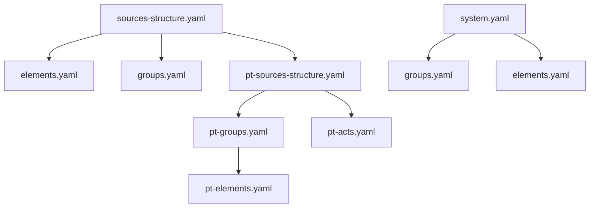
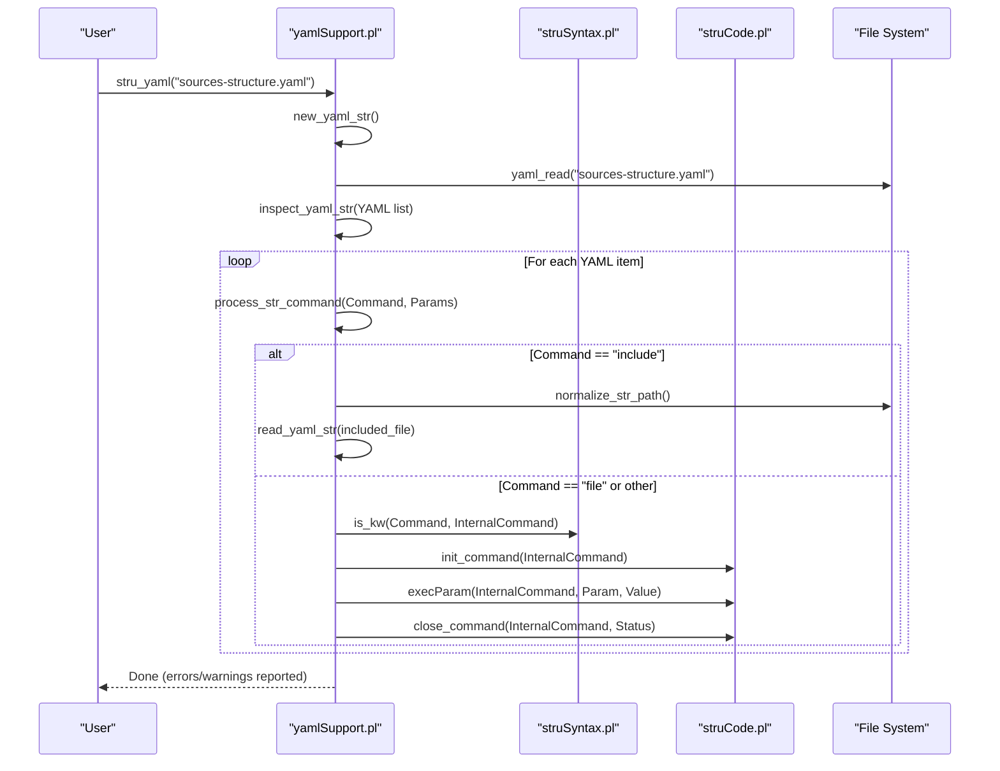
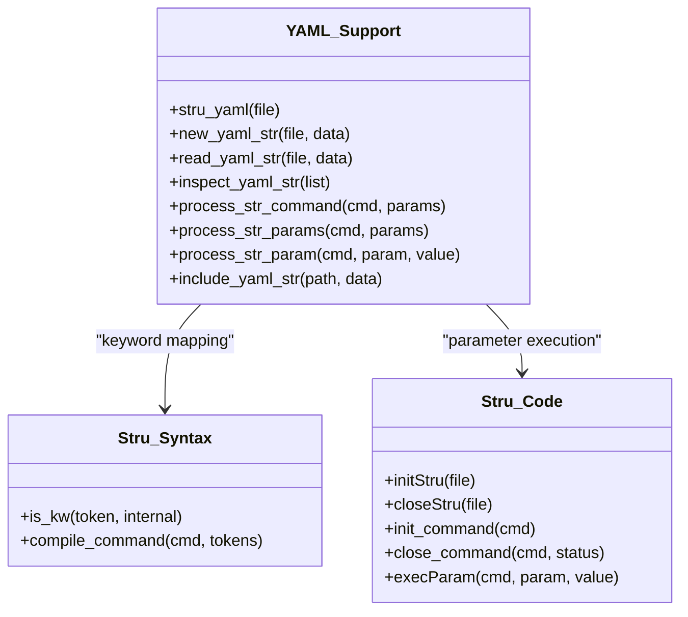
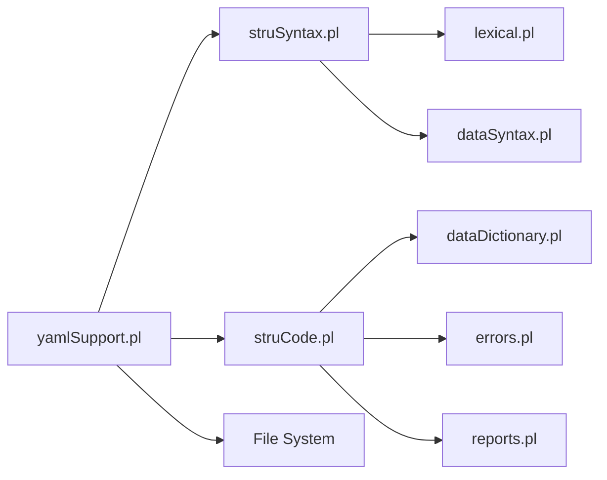

# Modern YAML Schemas

<cite>
**Referenced Files in This Document**
- [src/stru/README.md](file://src/stru/README.md)
- [src/yamlSupport.pl](file://src/yamlSupport.pl)
- [src/stru/sources-structure.yaml](file://src/stru/sources-structure.yaml)
- [src/stru/system.yaml](file://src/stru/system.yaml)
- [src/stru/elements.yaml](file://src/stru/elements.yaml)
- [src/stru/groups.yaml](file://src/stru/groups.yaml)
- [src/stru/pt-elements.yaml](file://src/stru/pt-elements.yaml)
- [src/stru/pt-groups.yaml](file://src/stru/pt-groups.yaml)
- [src/stru/pt-sources-structure.yaml](file://src/stru/pt-sources-structure.yaml)
- [src/struCode.pl](file://src/struCode.pl)
- [src/struSyntax.pl](file://src/struSyntax.pl)
</cite>

## Table of Contents
1. [Introduction](#introduction)
2. [Project Structure](#project-structure)
3. [Core Components](#core-components)
4. [Architecture Overview](#architecture-overview)
5. [Detailed Component Analysis](#detailed-component-analysis)
6. [Dependency Analysis](#dependency-analysis)
7. [Performance Considerations](#performance-considerations)
8. [Troubleshooting Guide](#troubleshooting-guide)
9. [Conclusion](#conclusion)
10. [Appendices](#appendices)

## Introduction
This document explains modern YAML-based schema definitions in Kleio. It covers the YAML structure, command syntax, and parameter options; how to organize schemas across multiple files using include directives; the relationship between YAML schemas and internal data structures; practical examples for complex schemas with nested elements, conditional logic, and advanced validation rules; best practices for organization, naming conventions, and maintainability; and strategies for versioning and collaborative development.

Kleio’s preferred schema format is YAML. The system reads a top-level structure file (commonly sources-structure.yaml), processes commands such as file and include, and translates them into internal structure definitions via the YAML support module and core structure processing modules.

## Project Structure
The repository provides a clear separation between:
- Core YAML schema definitions (elements, groups, language-specific variants)
- Top-level assembly files that compose schemas from reusable parts
- Processing modules that parse YAML and build internal representations

**Diagram sources**
- [src/stru/sources-structure.yaml:1-10](file://src/stru/sources-structure.yaml#L1-L10)
- [src/stru/system.yaml:1-4](file://src/stru/system.yaml#L1-L4)
- [src/stru/pt-sources-structure.yaml:1-4](file://src/stru/pt-sources-structure.yaml#L1-L4)

**Section sources**
- [src/stru/README.md:1-7](file://src/stru/README.md#L1-L7)
- [src/stru/sources-structure.yaml:1-10](file://src/stru/sources-structure.yaml#L1-L10)
- [src/stru/system.yaml:1-4](file://src/stru/system.yaml#L1-L4)

## Core Components
- YAML entry point: stru_yaml/1 initializes processing and delegates to new_yaml_str/2.
- YAML reader and inspector: read_yaml_str/2 loads YAML, tracks included files, inspects commands, and bridges to internal processing.
- Command dispatcher: process_str_command/2 maps YAML commands (file, include, and legacy Latin/English keywords) to internal handlers.
- Parameter bridge: process_str_params/2 and process_str_param/3 translate YAML key-value pairs into internal parameters.
- Internal structure engine: struCode.pl manages initialization, defaults, execution of parameters, and finalization.
- Syntax layer: struSyntax.pl defines grammar and keyword handling used by the internal engine.

Key responsibilities:
- YAML parsing and normalization
- Include resolution and deduplication
- Mapping YAML commands to internal structure commands
- Validation and error reporting
- Building internal representation consumed by downstream components

**Section sources**
- [src/yamlSupport.pl:28-46](file://src/yamlSupport.pl#L28-L46)
- [src/yamlSupport.pl:49-91](file://src/yamlSupport.pl#L49-L91)
- [src/yamlSupport.pl:94-100](file://src/yamlSupport.pl#L94-L100)
- [src/yamlSupport.pl:118-130](file://src/yamlSupport.pl#L118-L130)
- [src/yamlSupport.pl:132-141](file://src/yamlSupport.pl#L132-L141)
- [src/yamlSupport.pl:159-178](file://src/yamlSupport.pl#L159-L178)
- [src/struCode.pl:64-82](file://src/struCode.pl#L64-L82)
- [src/struCode.pl:91-118](file://src/struCode.pl#L91-L118)
- [src/struSyntax.pl:48-101](file://src/struSyntax.pl#L48-L101)

## Architecture Overview
The YAML schema pipeline transforms declarative YAML into an internal structure model.

**Diagram sources**
- [src/yamlSupport.pl:28-46](file://src/yamlSupport.pl#L28-L46)
- [src/yamlSupport.pl:49-91](file://src/yamlSupport.pl#L49-L91)
- [src/yamlSupport.pl:118-130](file://src/yamlSupport.pl#L118-L130)
- [src/yamlSupport.pl:132-141](file://src/yamlSupport.pl#L132-L141)
- [src/struCode.pl:91-118](file://src/struCode.pl#L91-L118)
- [src/struSyntax.pl:48-101](file://src/struSyntax.pl#L48-L101)

## Detailed Component Analysis

### YAML Schema Language and Commands
Top-level YAML is a list of commands. Each command is a mapping with a single key indicating the command name and its parameters.

Supported top-level commands:
- file: Declares metadata about the current schema file.
  - Parameters:
    - name: string identifying the file
    - description: free-form text describing the file
- include: Includes another schema file.
  - Parameters:
    - path: string or normalized path reference resolved relative to the current file or known locations

Notes:
- Duplicate includes are detected and warned against.
- Paths can be relative or use special prefixes handled by the path normalizer.

Example composition patterns:
- A root file declares file metadata and includes core building blocks (elements, groups).
- A regional/language variant file includes the core plus local extensions.

**Section sources**
- [src/yamlSupport.pl:102-116](file://src/yamlSupport.pl#L102-L116)
- [src/yamlSupport.pl:118-130](file://src/yamlSupport.pl#L118-L130)
- [src/yamlSupport.pl:49-72](file://src/yamlSupport.pl#L49-L72)
- [src/stru/sources-structure.yaml:1-10](file://src/stru/sources-structure.yaml#L1-L10)
- [src/stru/system.yaml:1-4](file://src/stru/system.yaml#L1-L4)

### Elements and Groups: Building Blocks
Elements define atomic fields (types, identifiers, texts, dates, etc.). Groups define composite entities with required/optional fields, nesting, and id prefixes.

Common element categories:
- Basic types: number, string64, string256, text, json
- Identification: id, same_as, xsame_as, entity, origin, destination
- Standard attributes: type, value, class, loc, name, description, obs, summary
- Source control: replaces, prefix, structure, translations, translator, urlpattern, shortname, inside
- Metadata: groupname, level, line, kleiofile

Group concepts:
- position: ordered elements allowed without explicit names
- guaranteed: required elements
- also: optional elements
- contains/part: nested groups allowed
- source: inheritance from a parent group
- idprefix: default identifier prefix for instances

Examples of core groups:
- kleio: top-level container for sources, authority registers, links, properties
- historical-source / source: main container for records
- authority-register and identifications: identity management and linking
- person, object, geoentity, abstraction, topic: domain entities
- attribute/ls/atr: time-varying attributes
- relation/rel: relationships between entities
- event, historical-act, cevent: temporal constructs
- end: boundary marker for inference triggers and context clearing

Portuguese variants:
- pt-elements.yaml: aliases for English elements (e.g., dia, mes, ano, data, nome, mesmo_que)
- pt-groups.yaml: Portuguese-oriented groups (fonte, acto, evento, fim, lugar, bem, fogo, viagem, viajante, pevento, estadia)

**Section sources**
- [src/stru/elements.yaml:39-305](file://src/stru/elements.yaml#L39-L305)
- [src/stru/groups.yaml:69-686](file://src/stru/groups.yaml#L69-L686)
- [src/stru/pt-elements.yaml:1-136](file://src/stru/pt-elements.yaml#L1-L136)
- [src/stru/pt-groups.yaml:1-238](file://src/stru/pt-groups.yaml#L1-L238)

### Relationship Between YAML Schemas and Internal Data Structures
YAML commands map to internal structure commands processed by struCode.pl and validated by struSyntax.pl. The flow:
- YAML command -> internal command (via keyword mapping)
- Parameters sanitized and dispatched to execParam
- Command lifecycle managed by init_command/close_command
- Finalized structure persisted via dataDictionary integration

**Diagram sources**
- [src/yamlSupport.pl:94-100](file://src/yamlSupport.pl#L94-L100)
- [src/yamlSupport.pl:132-141](file://src/yamlSupport.pl#L132-L141)
- [src/struCode.pl:91-118](file://src/struCode.pl#L91-L118)
- [src/struSyntax.pl:48-101](file://src/struSyntax.pl#L48-L101)

**Section sources**
- [src/yamlSupport.pl:132-141](file://src/yamlSupport.pl#L132-L141)
- [src/struCode.pl:91-118](file://src/struCode.pl#L91-L118)
- [src/struSyntax.pl:48-101](file://src/struSyntax.pl#L48-L101)

### Practical Examples

#### Composing Multi-file Schemas with include
- Root file declares metadata and includes core elements and groups.
- Regional file composes core with Portuguese-specific groups and acts.

References:
- [src/stru/sources-structure.yaml:1-10](file://src/stru/sources-structure.yaml#L1-L10)
- [src/stru/pt-sources-structure.yaml:1-4](file://src/stru/pt-sources-structure.yaml#L1-L4)

#### Defining Complex Nested Groups
- Use contains/part to nest subgroups (e.g., historical-act containing persons, objects, relations).
- Use position/guaranteed/also to constrain field order and presence.
- Use source to inherit and specialize behavior.

References:
- [src/stru/groups.yaml:219-231](file://src/stru/groups.yaml#L219-L231)
- [src/stru/groups.yaml:373-381](file://src/stru/groups.yaml#L373-L381)
- [src/stru/groups.yaml:545-568](file://src/stru/groups.yaml#L545-L568)

#### Conditional Logic and Advanced Validation
- Guaranteed fields enforce requiredness at schema definition time.
- Positional ordering constrains compact notation usage.
- End markers trigger inference and context resets for large lists.

References:
- [src/stru/groups.yaml:524-530](file://src/stru/groups.yaml#L524-L530)
- [src/stru/groups.yaml:481-521](file://src/stru/groups.yaml#L481-L521)

#### Aliasing and Localization
- Create aliases for elements and groups to support different languages or project conventions.
- Reference existing definitions via source to avoid duplication.

References:
- [src/stru/pt-elements.yaml:8-136](file://src/stru/pt-elements.yaml#L8-L136)
- [src/stru/pt-groups.yaml:21-72](file://src/stru/pt-groups.yaml#L21-L72)

**Section sources**
- [src/stru/sources-structure.yaml:1-10](file://src/stru/sources-structure.yaml#L1-L10)
- [src/stru/pt-sources-structure.yaml:1-4](file://src/stru/pt-sources-structure.yaml#L1-L4)
- [src/stru/groups.yaml:219-231](file://src/stru/groups.yaml#L219-L231)
- [src/stru/groups.yaml:373-381](file://src/stru/groups.yaml#L373-L381)
- [src/stru/groups.yaml:481-521](file://src/stru/groups.yaml#L481-L521)
- [src/stru/groups.yaml:524-530](file://src/stru/groups.yaml#L524-L530)
- [src/stru/pt-elements.yaml:8-136](file://src/stru/pt-elements.yaml#L8-L136)
- [src/stru/pt-groups.yaml:21-72](file://src/stru/pt-groups.yaml#L21-L72)

## Dependency Analysis
High-level dependencies among modules and files:

Observations:
- yamlSupport.pl depends on struSyntax.pl for keyword mapping and struCode.pl for command execution.
- struCode.pl integrates with persistence and reporting subsystems.
- struSyntax.pl relies on lexical and data syntax layers.

**Diagram sources**
- [src/yamlSupport.pl:1-26](file://src/yamlSupport.pl#L1-L26)
- [src/struCode.pl:49-56](file://src/struCode.pl#L49-L56)
- [src/struSyntax.pl:37-43](file://src/struSyntax.pl#L37-L43)

**Section sources**
- [src/yamlSupport.pl:1-26](file://src/yamlSupport.pl#L1-L26)
- [src/struCode.pl:49-56](file://src/struCode.pl#L49-L56)
- [src/struSyntax.pl:37-43](file://src/struSyntax.pl#L37-L43)

## Performance Considerations
- Avoid redundant includes: the loader warns when a file has already been processed.
- Prefer modular composition: split large schemas into focused files and assemble via include.
- Keep id prefixes consistent to reduce collisions and simplify debugging.
- Use position and guaranteed judiciously to minimize parser ambiguity and improve performance.

[No sources needed since this section provides general guidance]

## Troubleshooting Guide
Common issues and diagnostics:
- Unknown command in YAML: check spelling and supported commands (file, include).
- Out-of-context parameters: name/description must appear within a file block.
- Duplicate includes: warnings indicate previously processed files; reorganize includes if necessary.
- Path resolution: ensure include paths resolve correctly relative to the current file or known directories.

Where to look:
- Error and warning output during structure processing
- File stack tracking and indentation logs for included files

**Section sources**
- [src/yamlSupport.pl:142-157](file://src/yamlSupport.pl#L142-L157)
- [src/yamlSupport.pl:54-72](file://src/yamlSupport.pl#L54-L72)
- [src/yamlSupport.pl:192-195](file://src/yamlSupport.pl#L192-L195)

## Conclusion
Modern YAML schemas in Kleio provide a flexible, composable way to define structures through simple commands and rich grouping semantics. By leveraging include directives, inheritance, and well-defined validation constraints, teams can maintain scalable, localized, and versioned schema ecosystems. Following the best practices outlined here will improve clarity, collaboration, and long-term maintainability.

[No sources needed since this section summarizes without analyzing specific files]

## Appendices

### Best Practices for Schema Organization
- Split concerns: keep elements, core groups, and regional extensions in separate files.
- Use descriptive file names and concise descriptions in file blocks.
- Centralize shared definitions and reuse via include.
- Maintain consistent id prefixes per group to aid traceability.

**Section sources**
- [src/stru/elements.yaml:1-30](file://src/stru/elements.yaml#L1-L30)
- [src/stru/groups.yaml:1-68](file://src/stru/groups.yaml#L1-L68)
- [src/stru/sources-structure.yaml:1-10](file://src/stru/sources-structure.yaml#L1-L10)

### Naming Conventions
- Use lowercase-with-hyphens for filenames.
- Prefer English base names with language alias files for localization.
- Align group names with domain terminology and keep synonyms minimal.

**Section sources**
- [src/stru/pt-elements.yaml:1-20](file://src/stru/pt-elements.yaml#L1-L20)
- [src/stru/pt-groups.yaml:1-20](file://src/stru/pt-groups.yaml#L1-L20)

### Versioning Strategies
- Embed metadata placeholders in file descriptions for build-time injection.
- Tag releases and maintain changelogs for schema evolution.
- Use backward-compatible changes (additive) where possible; deprecate gradually.

**Section sources**
- [src/stru/sources-structure.yaml:1-10](file://src/stru/sources-structure.yaml#L1-L10)

### Collaborative Development Workflows
- Feature branches for schema changes with code review.
- Automated checks for unknown commands and duplicate includes.
- Shared test datasets validating critical paths across schema versions.

[No sources needed since this section provides general guidance]