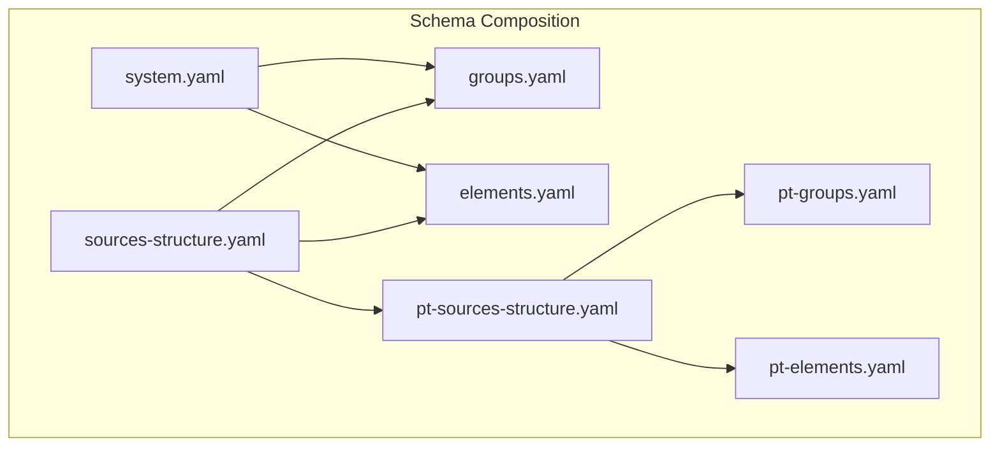
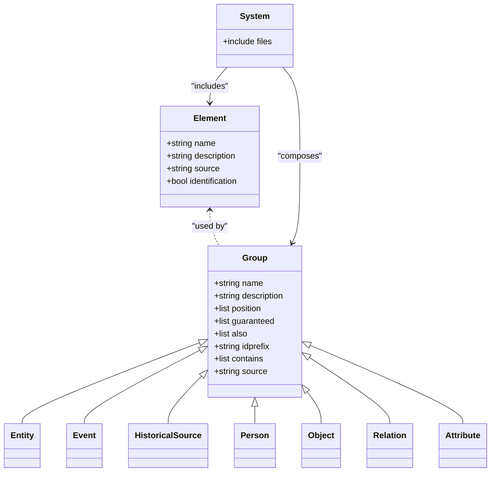
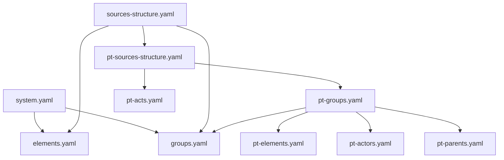

# Custom Elements and Groups

<cite>
**Referenced Files in This Document**
- [elements.yaml](file://src/stru/elements.yaml)
- [groups.yaml](file://src/stru/groups.yaml)
- [system.yaml](file://src/stru/system.yaml)
- [sources-structure.yaml](file://src/stru/sources-structure.yaml)
- [pt-sources-structure.yaml](file://src/stru/pt-sources-structure.yaml)
- [pt-groups.yaml](file://src/stru/pt-groups.yaml)
- [pt-elements.yaml](file://src/stru/pt-elements.yaml)
- [README_KLEIO_NOTATION.md](file://README_KLEIO_NOTATION.md)
- [dataDictionary.pl](file://src/dataDictionary.pl)
</cite>

## Table of Contents
1. [Introduction](#introduction)
2. [Project Structure](#project-structure)
3. [Core Components](#core-components)
4. [Architecture Overview](#architecture-overview)
5. [Detailed Component Analysis](#detailed-component-analysis)
6. [Dependency Analysis](#dependency-analysis)
7. [Performance Considerations](#performance-considerations)
8. [Troubleshooting Guide](#troubleshooting-guide)
9. [Conclusion](#conclusion)
10. [Appendices](#appendices)

## Introduction
This document explains how to define custom elements and groups in Kleio schemas, focusing on YAML-based structure definitions. It covers element definition syntax, attribute specifications, validation rules, data type constraints, group creation patterns, hierarchical organization, relationship modeling, extension of base elements, domain-specific groups, complex business rules, naming conventions, documentation standards, and testing strategies for custom definitions.

## Project Structure
Kleio schema definitions are organized as YAML files that compose a hierarchy of elements and groups:
- Core elements are defined in a central file and reused across domains.
- Core groups build upon these elements and provide reusable building blocks (e.g., entity, event, person).
- Domain-specific structures extend core groups and add localized or specialized elements.
- A top-level system file composes the final structure by including multiple modules.

**Diagram sources**
- [system.yaml:1-4](file://src/stru/system.yaml#L1-L4)
- [sources-structure.yaml:1-10](file://src/stru/sources-structure.yaml#L1-L10)
- [pt-sources-structure.yaml:1-4](file://src/stru/pt-sources-structure.yaml#L1-L4)
- [elements.yaml:1-305](file://src/stru/elements.yaml#L1-L305)
- [groups.yaml:1-686](file://src/stru/groups.yaml#L1-L686)
- [pt-groups.yaml:1-200](file://src/stru/pt-groups.yaml#L1-L200)
- [pt-elements.yaml:1-136](file://src/stru/pt-elements.yaml#L1-L136)

**Section sources**
- [system.yaml:1-4](file://src/stru/system.yaml#L1-L4)
- [sources-structure.yaml:1-10](file://src/stru/sources-structure.yaml#L1-L10)
- [pt-sources-structure.yaml:1-4](file://src/stru/pt-sources-structure.yaml#L1-L4)

## Core Components
- Elements: Primitive building blocks with names, descriptions, optional source types, and metadata such as identification flags. They represent attributes of groups.
- Groups: Named containers that specify allowed elements, positional ordering, required fields, optional fields, containment relationships, id prefixes, and inheritance via source.

Key responsibilities:
- Element definitions establish data semantics and mapping targets.
- Group definitions enforce structural constraints and model relationships between entities.

Examples of core elements include identifiers, dates, text fields, and control elements used during processing. Examples of core groups include entity, event, historical-source, person, object, relation, and attribute.

**Section sources**
- [elements.yaml:1-305](file://src/stru/elements.yaml#L1-L305)
- [groups.yaml:1-686](file://src/stru/groups.yaml#L1-L686)

## Architecture Overview
The schema architecture follows a layered composition pattern:
- Base layer: core elements and groups.
- Domain layer: Portuguese-specific extensions and additional act/event groups.
- Composition layer: top-level files that assemble the final structure for use by the parser and downstream tools.

**Diagram sources**
- [elements.yaml:1-305](file://src/stru/elements.yaml#L1-L305)
- [groups.yaml:1-686](file://src/stru/groups.yaml#L1-L686)
- [system.yaml:1-4](file://src/stru/system.yaml#L1-L4)

## Detailed Component Analysis

### Element Definition Syntax and Data Types
- Element entries are YAML dictionaries with keys:
  - name: unique identifier for the element.
  - description: human-readable explanation.
  - source: reference to a base element or primitive type (e.g., string64, number, date).
  - identification: flag indicating the element serves as an entity identifier.
- Built-in primitives and common elements include number, string64, string256, text, json, day, month, year, date, id, same_as, xsame_as, entity, origin, destination, type, value, class, loc, name, description, obs, summary, ref, page, pages, title, replaces, prefix, structure, translations, translator, urlpattern, shortname, inside, groupname, level, line, kleiofile, and several authority-related elements.

Validation and constraints:
- The identification flag marks elements that uniquely identify entities.
- Source references propagate type semantics; e.g., id is based on string64.
- Date elements support formats and ranges as documented.

Best practices:
- Prefer extending existing elements via source to reuse behavior and mappings.
- Use identification only for true entity identifiers.
- Keep descriptions concise and informative for maintainability.

**Section sources**
- [elements.yaml:1-305](file://src/stru/elements.yaml#L1-L305)

### Group Creation Patterns and Hierarchical Organization
- Group entries are YAML dictionaries with keys:
  - name: unique group identifier.
  - description: purpose and usage notes.
  - position: ordered list of elements that can appear without explicit names after the group header.
  - guaranteed: required elements within the group.
  - also: optional elements allowed in the group.
  - idprefix: default prefix for ids generated under this group.
  - contains/part: lists of child groups permitted inside this group.
  - source: parent group to inherit from (extends behavior and constraints).
- Core groups include event, entity, kleio, historical-source, authority-register, identifications, link, property, historical-act, cevent, text, authority-record, rentity, rperson, robject, occ, geoentity, place, person, female, male, object, abstraction, topic, end, attribute, ls, attr, atr, relation, rel, group-element, relation-type, attribute-list, geodesc, geo1–geo4.

Hierarchical modeling:
- Use contains/part to model containment relationships (e.g., historical-source contains historical-act and event).
- Extend base groups via source to specialize behavior (e.g., person extends entity).
- Use guaranteed to enforce presence of critical fields (e.g., id, name, sex).
- Use position to enable compact notation where element names can be omitted if they match the expected order.

Naming and prefixes:
- Define idprefix consistently per group to avoid collisions and aid readability.
- Use descriptive names aligned with domain concepts.

**Section sources**
- [groups.yaml:1-686](file://src/stru/groups.yaml#L1-L686)

### Relationship Modeling and Attributes
- Relations capture links between entities with type, value, destname, destination, and optional date.
- Attributes record time-varying properties with type, value, and optional date.
- Specialized aliases exist for convenience (ls, attr, atr for attributes; rel for relations).
- Automatic relations may be inferred (e.g., identification relations from same_as/xsame_as).

Modeling guidance:
- Use relation for inter-entity connections; attribute for intra-entity properties.
- Leverage guaranteed and position to ensure consistent representation.
- Employ idprefix to keep relation and attribute ids distinct and traceable.

**Section sources**
- [groups.yaml:1-686](file://src/stru/groups.yaml#L1-L686)

### Extending Base Elements and Creating Domain-Specific Groups
- Portuguese extensions demonstrate localization and specialization:
  - pt-elements.yaml defines synonyms and aliases for core elements (e.g., dia/mes/ano/data/tipo/valor/localizacao/local/cota/nome/mesmo_que/xmesmo_que/sexo/nomedest/iddest/sumario/pagina/paginas/fol/fols/folio/folios/descricao/desc/substitui/titulo/resumo).
  - pt-groups.yaml specializes groups like fonte (historical-source), pt-acto (historical-act), acto, evento, item, topico, lugar, bem, fogo, viagem, etc., adding position, guaranteed, also, contains/part, and idprefix tailored to Portuguese documents.
- These extensions show how to:
  - Reuse core elements via source while providing local names.
  - Introduce domain-specific groups by extending base groups.
  - Enforce domain constraints through guaranteed and position.

Example patterns:
- Create a new domain group by setting source to a base group and refining position/guaranteed/also/contains.
- Add localized element aliases by defining new element names with source pointing to core elements.

**Section sources**
- [pt-elements.yaml:1-136](file://src/stru/pt-elements.yaml#L1-L136)
- [pt-groups.yaml:1-200](file://src/stru/pt-groups.yaml#L1-L200)

### Complex Business Rules and Validation Semantics
- Positional elements allow shorthand notation when element order matches position declarations.
- Guaranteed fields enforce mandatory presence, aiding validation at parse time.
- Containment checks consider both direct parts and superclasses of groups to validate nesting.
- End markers can trigger processing boundaries and inference rules for acts/events.

Validation logic highlights:
- The system verifies whether a group is contained by another by checking direct parts and superclass relationships.
- This ensures that extended groups still respect the containment contracts of their ancestors.

**Section sources**
- [groups.yaml:1-686](file://src/stru/groups.yaml#L1-L686)
- [dataDictionary.pl:225-254](file://src/dataDictionary.pl#L225-L254)

### Naming Conventions and Documentation Standards
- Group and element names must start with a letter and can include digits, hyphens, and underscores.
- Use clear, domain-aligned names and maintain consistency across files.
- Provide concise descriptions for each element and group to aid maintainers and users.
- Follow the Kleio notation guidelines for whitespace handling and special characters.

**Section sources**
- [README_KLEIO_NOTATION.md:1-125](file://README_KLEIO_NOTATION.md#L1-L125)

### Testing Custom Definitions
- Validate structure composition by ensuring includes resolve correctly and no circular dependencies exist.
- Test positional shorthand and guaranteed field enforcement using representative samples.
- Verify containment rules by attempting to nest groups according to contains/part and inheritance.
- Use Portuguese-specific examples to confirm localization aliases work as expected.
- Compare outputs against known-good baselines to detect regressions in schema changes.

[No sources needed since this section provides general guidance]

## Dependency Analysis
The schema composition depends on inclusion directives and inheritance relationships:
- system.yaml includes groups.yaml and elements.yaml.
- sources-structure.yaml includes elements.yaml, groups.yaml, and pt-sources-structure.yaml.
- pt-sources-structure.yaml includes pt-groups.yaml and pt-acts.yaml.
- pt-groups.yaml includes groups.yaml, pt-elements.yaml, pt-actors.yaml, and pt-parents.yaml.

**Diagram sources**
- [system.yaml:1-4](file://src/stru/system.yaml#L1-L4)
- [sources-structure.yaml:1-10](file://src/stru/sources-structure.yaml#L1-L10)
- [pt-sources-structure.yaml:1-4](file://src/stru/pt-sources-structure.yaml#L1-L4)
- [pt-groups.yaml:1-200](file://src/stru/pt-groups.yaml#L1-L200)

**Section sources**
- [system.yaml:1-4](file://src/stru/system.yaml#L1-L4)
- [sources-structure.yaml:1-10](file://src/stru/sources-structure.yaml#L1-L10)
- [pt-sources-structure.yaml:1-4](file://src/stru/pt-sources-structure.yaml#L1-L4)
- [pt-groups.yaml:1-200](file://src/stru/pt-groups.yaml#L1-L200)

## Performance Considerations
- Prefer reusing elements via source to minimize duplication and improve consistency.
- Limit deep nesting to reduce parsing overhead and simplify validation.
- Use idprefix to generate predictable ids and avoid costly collision resolution.
- Keep descriptions and comments concise to reduce schema size and improve load times.

[No sources needed since this section provides general guidance]

## Troubleshooting Guide
Common issues and resolutions:
- Circular includes: Ensure include chains do not form cycles; verify system.yaml and sources-structure.yaml compositions.
- Missing required fields: Check guaranteed lists for groups and ensure all required elements are present in instances.
- Invalid nesting: Confirm that child groups are listed in contains/part of parent groups or valid superclasses.
- Localization mismatches: Verify that Portuguese aliases point to correct core elements via source.

Diagnostic steps:
- Inspect error messages related to missing elements or invalid positions.
- Validate containment using superclass checks implemented in the dictionary module.
- Review idprefix usage to prevent id conflicts across files.

**Section sources**
- [dataDictionary.pl:225-254](file://src/dataDictionary.pl#L225-L254)

## Conclusion
Kleio’s YAML-based schema system enables robust modeling of historical data through reusable elements and extensible groups. By leveraging source inheritance, positional shorthand, guaranteed constraints, and containment rules, you can create domain-specific structures that are both expressive and validated. Following naming conventions and documentation standards ensures clarity and maintainability, while systematic testing helps catch issues early.

[No sources needed since this section summarizes without analyzing specific files]

## Appendices

### Quick Reference: Element Keys
- name: string
- description: string
- source: string (reference to base element/type)
- identification: boolean

### Quick Reference: Group Keys
- name: string
- description: string
- position: list of element names
- guaranteed: list of element names
- also: list of element names
- idprefix: string
- contains/part: list of group names
- source: string (parent group)

[No sources needed since this section provides general guidance]