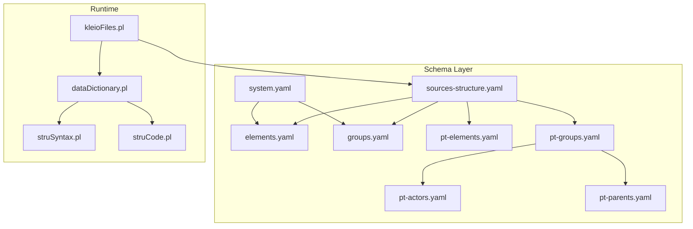
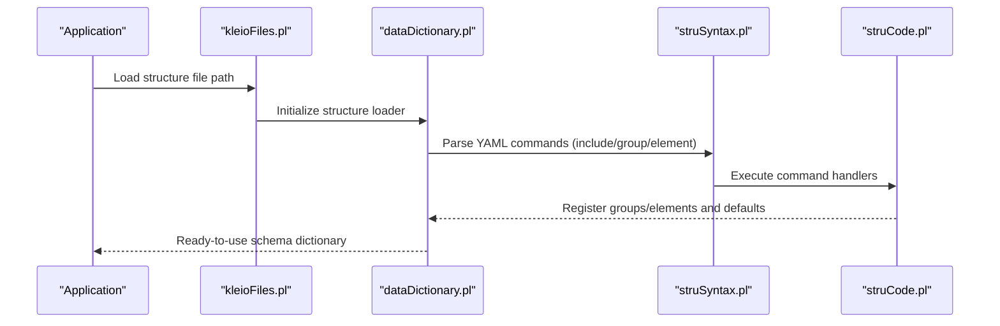
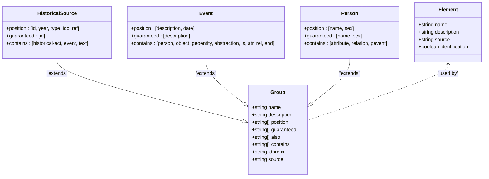
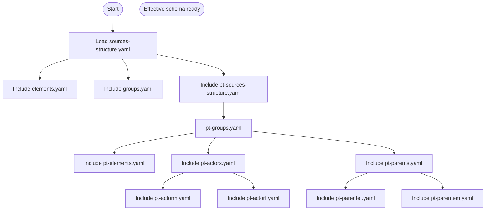

# Schema Extension and Customization

<cite>
**Referenced Files in This Document**
- [README.md](file://src/stru/README.md)
- [system.yaml](file://src/stru/system.yaml)
- [elements.yaml](file://src/stru/elements.yaml)
- [groups.yaml](file://src/stru/groups.yaml)
- [sources-structure.yaml](file://src/stru/sources-structure.yaml)
- [pt-elements.yaml](file://src/stru/pt-elements.yaml)
- [pt-groups.yaml](file://src/stru/pt-groups.yaml)
- [pt-actors.yaml](file://src/stru/pt-actors.yaml)
- [pt-parents.yaml](file://src/stru/pt-parents.yaml)
- [gacto2.str.yaml](file://src/stru/gacto2.str.yaml)
- [kleioFiles.pl](file://src/kleioFiles.pl)
- [dataDictionary.pl](file://src/dataDictionary.pl)
- [struSyntax.pl](file://src/struSyntax.pl)
- [struCode.pl](file://src/struCode.pl)
</cite>

## Table of Contents
1. [Introduction](#introduction)
2. [Project Structure](#project-structure)
3. [Core Components](#core-components)
4. [Architecture Overview](#architecture-overview)
5. [Detailed Component Analysis](#detailed-component-analysis)
6. [Dependency Analysis](#dependency-analysis)
7. [Performance Considerations](#performance-considerations)
8. [Troubleshooting Guide](#troubleshooting-guide)
9. [Conclusion](#conclusion)
10. [Appendices](#appendices)

## Introduction
This document explains how to extend and customize Kleio schemas using YAML-based structure definitions. It covers inheritance, mixins via includes, composition strategies, domain-specific extensions, integration with third-party schemas, versioning and compatibility, collaborative workflows, packaging, distribution, and dependency management. The guidance is grounded in the repository’s schema files and processing modules.

## Project Structure
Kleio schemas are defined as YAML files under src/stru. A top-level “sources structure” composes core elements and groups, then adds domain-specific layers (e.g., Portuguese sources). The system also maintains a generated legacy representation for compatibility.

**Diagram sources**
- [sources-structure.yaml:1-10](file://src/stru/sources-structure.yaml#L1-L10)
- [elements.yaml:1-305](file://src/stru/elements.yaml#L1-L305)
- [groups.yaml:1-686](file://src/stru/groups.yaml#L1-L686)
- [pt-elements.yaml:1-136](file://src/stru/pt-elements.yaml#L1-L136)
- [pt-groups.yaml:1-238](file://src/stru/pt-groups.yaml#L1-L238)
- [pt-actors.yaml:1-8](file://src/stru/pt-actors.yaml#L1-L8)
- [pt-parents.yaml:1-7](file://src/stru/pt-parents.yaml#L1-L7)
- [system.yaml:1-4](file://src/stru/system.yaml#L1-L4)
- [kleioFiles.pl](file://src/kleioFiles.pl)
- [dataDictionary.pl](file://src/dataDictionary.pl)
- [struSyntax.pl:1-200](file://src/struSyntax.pl#L1-L200)
- [struCode.pl:1-200](file://src/struCode.pl#L1-L200)

**Section sources**
- [README.md:1-7](file://src/stru/README.md#L1-L7)
- [sources-structure.yaml:1-10](file://src/stru/sources-structure.yaml#L1-L10)
- [system.yaml:1-4](file://src/stru/system.yaml#L1-L4)

## Core Components
- Elements: Primitive building blocks such as identifiers, strings, dates, and control fields. They can be specialized by referencing a base element via source.
- Groups: Named containers that define position, guaranteed, optional, containment, id prefixes, and inheritance from other groups.
- Includes: Mechanism to compose multiple schema files into a single effective schema.
- System entry: A minimal file that composes core components.
- Generated legacy format: A large auto-generated YAML mirroring the classic str format for compatibility.

Key extension mechanisms:
- Inheritance via group.source to reuse and override behavior.
- Composition via - include: to assemble reusable parts.
- Element specialization via element.source to map names or types to canonical elements.

Practical examples in this repository:
- Portuguese aliases for core elements (pt-elements.yaml).
- Domain-specific groups for Portuguese acts and events (pt-groups.yaml).
- Top-level assembly of default structures (sources-structure.yaml).
- Minimal system composition (system.yaml).

**Section sources**
- [elements.yaml:1-305](file://src/stru/elements.yaml#L1-L305)
- [groups.yaml:1-686](file://src/stru/groups.yaml#L1-L686)
- [pt-elements.yaml:1-136](file://src/stru/pt-elements.yaml#L1-L136)
- [pt-groups.yaml:1-238](file://src/stru/pt-groups.yaml#L1-L238)
- [sources-structure.yaml:1-10](file://src/stru/sources-structure.yaml#L1-L10)
- [system.yaml:1-4](file://src/stru/system.yaml#L1-L4)
- [gacto2.str.yaml:1-800](file://src/stru/gacto2.str.yaml#L1-L800)

## Architecture Overview
The runtime loads the active structure file, resolves includes, merges inheritance, and builds an internal dictionary used during parsing and validation.

**Diagram sources**
- [kleioFiles.pl](file://src/kleioFiles.pl)
- [dataDictionary.pl](file://src/dataDictionary.pl)
- [struSyntax.pl:1-200](file://src/struSyntax.pl#L1-L200)
- [struCode.pl:1-200](file://src/struCode.pl#L1-L200)

## Detailed Component Analysis

### Inheritance and Specialization
Groups inherit from a source group and may override parameters like position, guaranteed, also, contains, and idprefix. Elements specialize base elements via element.source.

**Diagram sources**
- [groups.yaml:100-140](file://src/stru/groups.yaml#L100-L140)
- [groups.yaml:218-244](file://src/stru/groups.yaml#L218-L244)
- [groups.yaml:373-381](file://src/stru/groups.yaml#L373-L381)
- [elements.yaml:86-125](file://src/stru/elements.yaml#L86-L125)

**Section sources**
- [groups.yaml:1-686](file://src/stru/groups.yaml#L1-L686)
- [elements.yaml:1-305](file://src/stru/elements.yaml#L1-L305)

### Mixins via Include
Use - include: to compose reusable pieces. Examples:
- Default structure composes core elements and groups, then adds Portuguese layers.
- Portuguese actors and parents are included from pt-groups.yaml.

**Diagram sources**
- [sources-structure.yaml:1-10](file://src/stru/sources-structure.yaml#L1-L10)
- [pt-groups.yaml:1-238](file://src/stru/pt-groups.yaml#L1-L238)
- [pt-actors.yaml:1-8](file://src/stru/pt-actors.yaml#L1-L8)
- [pt-parents.yaml:1-7](file://src/stru/pt-parents.yaml#L1-L7)

**Section sources**
- [sources-structure.yaml:1-10](file://src/stru/sources-structure.yaml#L1-L10)
- [pt-groups.yaml:1-238](file://src/stru/pt-groups.yaml#L1-L238)
- [pt-actors.yaml:1-8](file://src/stru/pt-actors.yaml#L1-L8)
- [pt-parents.yaml:1-7](file://src/stru/pt-parents.yaml#L1-L7)

### Composition Strategies
- Base-first composition: Always include core elements and groups before domain-specific overrides.
- Layered localization: Provide language-specific aliases (e.g., pt-elements.yaml) without duplicating semantics.
- Feature toggling via includes: Add or remove features by including/excluding files.

**Section sources**
- [elements.yaml:1-305](file://src/stru/elements.yaml#L1-L305)
- [pt-elements.yaml:1-136](file://src/stru/pt-elements.yaml#L1-L136)
- [groups.yaml:1-686](file://src/stru/groups.yaml#L1-L686)

### Creating Domain-Specific Extensions
Steps:
1. Create a new YAML file under src/stru.
2. Include core elements and groups.
3. Define new groups extending existing ones via source.
4. Optionally add localized element aliases.
5. Compose your new file into a top-level structure.

Example patterns present in the repo:
- Extending historical-source to create a domain-specific source container.
- Specializing person into gendered variants and kinship roles.
- Defining personal events (pevent) and their containment rules.

**Section sources**
- [groups.yaml:110-140](file://src/stru/groups.yaml#L110-L140)
- [groups.yaml:250-262](file://src/stru/groups.yaml#L250-L262)
- [groups.yaml:373-441](file://src/stru/groups.yaml#L373-L441)

### Integrating Third-Party Schemas
- Place third-party schema files under src/stru.
- Reference them via - include: in your project’s top-level structure.
- Resolve naming conflicts by aliasing elements or groups through source mappings.
- Validate against the core schema to ensure compatibility.

**Section sources**
- [sources-structure.yaml:1-10](file://src/stru/sources-structure.yaml#L1-L10)
- [elements.yaml:1-305](file://src/stru/elements.yaml#L1-L305)
- [groups.yaml:1-686](file://src/stru/groups.yaml#L1-L686)

### Practical Use Cases
- Genealogical research: Extend person and attribute/relation groups to capture lineage, vital events, and sources; use same_as/xsame_as for entity resolution across records.
- Archival management: Model archival units with hierarchical geoentities and attributes; leverage link groups for external catalog references.
- Historical analysis: Build event-centric schemas with cevent and attribute-list to annotate cohorts and temporal contexts.

[No sources needed since this section provides conceptual guidance]

### Managing Schema Versions and Backward Compatibility
- Version markers: Embed metadata placeholders in top-level structure files to track versions and build info.
- Aliasing strategy: Introduce new element/group names via aliases while keeping old names mapped via source to maintain compatibility.
- Deprecation workflow: Move obsolete definitions to a deprecated directory and keep stable includes pointing to current versions.

**Section sources**
- [sources-structure.yaml:1-10](file://src/stru/sources-structure.yaml#L1-L10)
- [pt-elements.yaml:1-136](file://src/stru/pt-elements.yaml#L1-L136)

### Collaborative Development Workflows
- Feature branches per domain extension; merge into main after validation.
- Centralize shared components in src/stru and include them from project-specific top-level structures.
- Use consistent idprefixes and guaranteed sets to avoid collisions and enforce data quality.

[No sources needed since this section provides general guidance]

### Packaging, Distribution, and Dependency Management
- Package a complete structure bundle by providing a top-level structure file that includes all dependencies.
- Distribute via repositories or archives; consumers include your top-level file to pull in your schema graph.
- Pin versions by tagging releases and referencing specific commits or tags in documentation.

[No sources needed since this section provides general guidance]

## Dependency Analysis
The runtime depends on the structure loader and parser to transform YAML definitions into an internal dictionary.

**Diagram sources**
- [kleioFiles.pl](file://src/kleioFiles.pl)
- [dataDictionary.pl](file://src/dataDictionary.pl)
- [struSyntax.pl:1-200](file://src/struSyntax.pl#L1-L200)
- [struCode.pl:1-200](file://src/struCode.pl#L1-L200)

**Section sources**
- [kleioFiles.pl](file://src/kleioFiles.pl)
- [dataDictionary.pl](file://src/dataDictionary.pl)
- [struSyntax.pl:1-200](file://src/struSyntax.pl#L1-L200)
- [struCode.pl:1-200](file://src/struCode.pl#L1-L200)

## Performance Considerations
- Prefer composition over duplication: reuse core elements and groups to minimize schema size and parsing overhead.
- Limit deep nesting: excessive hierarchy increases validation cost; prefer flat attribute lists where appropriate.
- Use includes judiciously: avoid circular includes and redundant inclusions to reduce load time.

[No sources needed since this section provides general guidance]

## Troubleshooting Guide
Common issues and checks:
- Unknown command or parameter errors during structure compilation indicate syntax mismatches or typos.
- Missing required elements: ensure guaranteed lists match actual usage.
- Conflicting names: resolve via aliases and source mappings rather than redefining core elements.

Relevant runtime hooks:
- Syntax compilation and error reporting.
- Command execution and completeness checks.

**Section sources**
- [struSyntax.pl:48-83](file://src/struSyntax.pl#L48-L83)
- [struSyntax.pl:95-122](file://src/struSyntax.pl#L95-L122)
- [struCode.pl:105-118](file://src/struCode.pl#L105-L118)

## Conclusion
Kleio’s YAML-based schema system supports powerful extension through inheritance, mixins, and composition. By organizing core components, localizing names, and layering domain-specific groups, teams can build robust, reusable schemas for genealogy, archives, and historical analysis. Versioning, backward compatibility, and clear packaging enable collaborative development and reliable distribution.

[No sources needed since this section summarizes without analyzing specific files]

## Appendices

### Quick Reference: Key Keys and Semantics
- group keys: name, description, position, guaranteed, also, contains/part, idprefix, source.
- element keys: name, description, source, identification.
- include directive: - include: filename.yaml.

**Section sources**
- [groups.yaml:1-30](file://src/stru/groups.yaml#L1-L30)
- [elements.yaml:1-305](file://src/stru/elements.yaml#L1-L305)