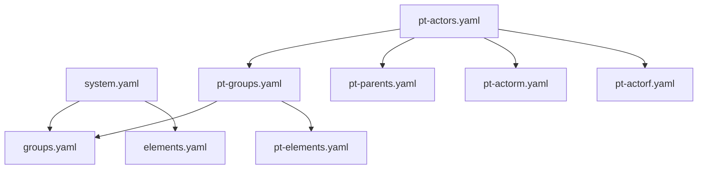
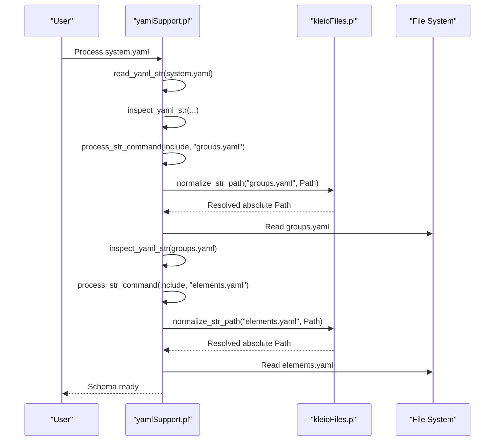
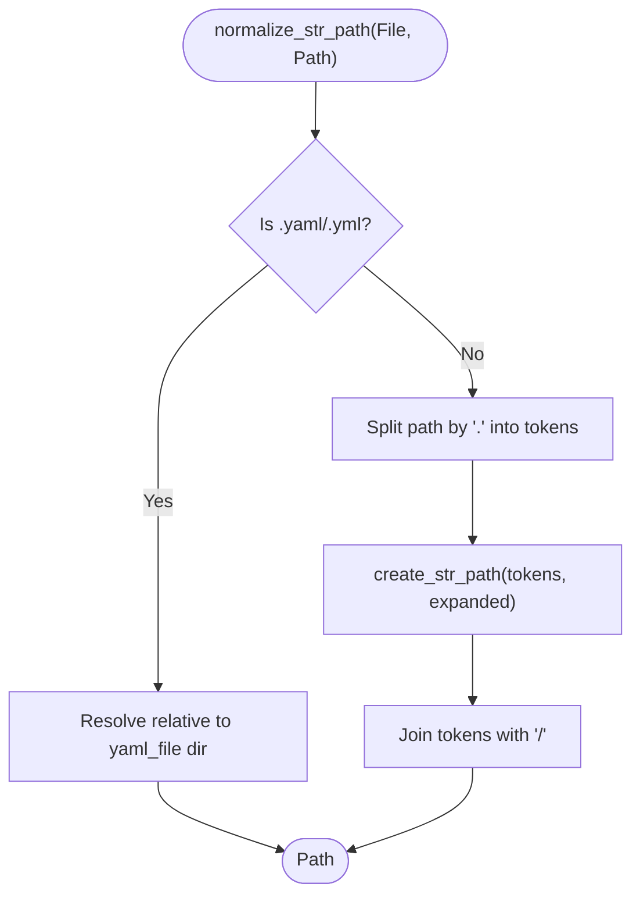
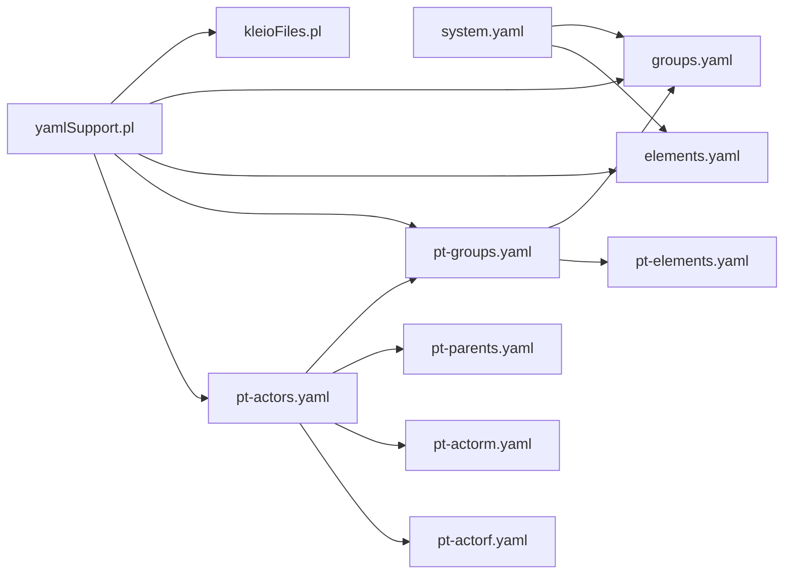

# Schema Inheritance and Composition

<cite>
**Referenced Files in This Document**
- [system.yaml](file://src/stru/system.yaml)
- [groups.yaml](file://src/stru/groups.yaml)
- [elements.yaml](file://src/stru/elements.yaml)
- [pt-groups.yaml](file://src/stru/pt-groups.yaml)
- [pt-actors.yaml](file://src/stru/pt-actors.yaml)
- [yamlSupport.pl](file://src/yamlSupport.pl)
- [kleioFiles.pl](file://src/kleioFiles.pl)
</cite>

## Table of Contents
1. [Introduction](#introduction)
2. [Project Structure](#project-structure)
3. [Core Components](#core-components)
4. [Architecture Overview](#architecture-overview)
5. [Detailed Component Analysis](#detailed-component-analysis)
6. [Dependency Analysis](#dependency-analysis)
7. [Performance Considerations](#performance-considerations)
8. [Troubleshooting Guide](#troubleshooting-guide)
9. [Conclusion](#conclusion)
10. [Appendices](#appendices)

## Introduction
This document explains how Kleio composes schemas from multiple YAML files using the include mechanism, how inheritance works via the source parameter, and how file resolution determines where included files are found. It also provides practical guidance for organizing large schema hierarchies, avoiding circular references, handling duplicate definitions, and applying best practices for modular design.

## Project Structure
Kleio’s schema system is primarily implemented in YAML files under src/stru. A top-level system.yaml composes core building blocks (groups and elements). Language-specific or project-specific extensions build on these by including additional modules.

**Diagram sources**
- [system.yaml:1-4](file://src/stru/system.yaml#L1-L4)
- [groups.yaml:1-70](file://src/stru/groups.yaml#L1-L70)
- [elements.yaml:1-20](file://src/stru/elements.yaml#L1-L20)
- [pt-groups.yaml:1-20](file://src/stru/pt-groups.yaml#L1-L20)
- [pt-actors.yaml:1-8](file://src/stru/pt-actors.yaml#L1-L8)

**Section sources**
- [system.yaml:1-4](file://src/stru/system.yaml#L1-L4)
- [groups.yaml:1-70](file://src/stru/groups.yaml#L1-L70)
- [elements.yaml:1-20](file://src/stru/elements.yaml#L1-L20)
- [pt-groups.yaml:1-20](file://src/stru/pt-groups.yaml#L1-L20)
- [pt-actors.yaml:1-8](file://src/stru/pt-actors.yaml#L1-L8)

## Core Components
- Include mechanism: The include command loads another YAML schema file into the current composition context.
- Inheritance: Groups and elements can extend a base definition using the source parameter to inherit attributes, position lists, guaranteed fields, and allowed children.
- File resolution: Relative paths and special tokens determine where included files are resolved, supporting system directories, user home directories, and per-file relative locations.

Key behaviors:
- Duplicate includes are detected and skipped with a warning to prevent cycles and redundant processing.
- The include order matters because it affects the final merged schema state.

**Section sources**
- [yamlSupport.pl:118-130](file://src/yamlSupport.pl#L118-L130)
- [yamlSupport.pl:48-72](file://src/yamlSupport.pl#L48-L72)
- [groups.yaml:120-140](file://src/stru/groups.yaml#L120-L140)
- [elements.yaml:85-110](file://src/stru/elements.yaml#L85-L110)

## Architecture Overview
The YAML loader orchestrates reading, including, and inspecting schema files. It delegates path normalization and directory resolution to the file utilities.

**Diagram sources**
- [yamlSupport.pl:36-46](file://src/yamlSupport.pl#L36-L46)
- [yamlSupport.pl:48-72](file://src/yamlSupport.pl#L48-L72)
- [yamlSupport.pl:118-130](file://src/yamlSupport.pl#L118-L130)
- [yamlSupport.pl:192-195](file://src/yamlSupport.pl#L192-L195)
- [kleioFiles.pl:900-978](file://src/kleioFiles.pl#L900-L978)

## Detailed Component Analysis

### Include Command and Circular Reference Handling
- The include command triggers loading of another YAML file.
- Before processing, the loader checks if the file has already been read; if so, it emits a warning and skips reprocessing. This prevents infinite loops and redundant work.

Practical implications:
- You can safely include shared modules from multiple places without duplicating definitions.
- If you encounter warnings about previously processed files, verify your include graph for unnecessary duplication.

**Section sources**
- [yamlSupport.pl:118-130](file://src/yamlSupport.pl#L118-L130)
- [yamlSupport.pl:48-72](file://src/yamlSupport.pl#L48-L72)

### File Resolution System
Path resolution supports:
- Absolute paths
- Relative paths resolved against the current file’s directory
- Special tokens that expand to known directories:
  - system: resolves to the system structure directory
  - structures: resolves to the user structures directory (or falls back to home/structures)
  - sources: resolves to the user sources directory (or falls back to home/sources)
  - home: resolves to the Kleio home directory
  - ~: resolves to the directory of the main schema file being processed

Normalization steps:
- Split the path by separators and expand each token using create_str_path rules.
- For atomic filenames, resolve relative to the current file’s directory.
- Append .yaml extension when needed.

**Diagram sources**
- [kleioFiles.pl:900-978](file://src/kleioFiles.pl#L900-L978)

**Section sources**
- [kleioFiles.pl:900-978](file://src/kleioFiles.pl#L900-L978)

### Inheritance via source Parameter
Groups and elements can extend existing definitions by specifying source. This allows:
- Reusing common attributes, position ordering, guaranteed fields, and allowed children.
- Specializing behavior by overriding specific parameters while inheriting defaults.

Examples in the codebase:
- Portuguese groups extend core groups (e.g., historical-source, historical-act).
- Elements specialize base types (e.g., string-based identifiers).

Best practices:
- Prefer extending over copying definitions to keep changes centralized.
- Keep base modules stable and add specialization layers for domain-specific needs.

**Section sources**
- [groups.yaml:120-140](file://src/stru/groups.yaml#L120-L140)
- [groups.yaml:220-240](file://src/stru/groups.yaml#L220-L240)
- [elements.yaml:85-110](file://src/stru/elements.yaml#L85-L110)

### Practical Examples of Reusable Components
- Base composition: system.yaml includes core groups and elements.
- Domain layer: pt-groups.yaml includes core groups plus language-specific elements and actors.
- Actor composition: pt-actors.yaml composes parent and gendered actor modules.

These examples demonstrate a layered approach:
- Core layer: groups.yaml, elements.yaml
- Domain layer: pt-groups.yaml, pt-elements.yaml
- Feature layer: pt-actors.yaml, pt-parents.yaml, pt-actorm.yaml, pt-actorf.yaml

**Section sources**
- [system.yaml:1-4](file://src/stru/system.yaml#L1-L4)
- [pt-groups.yaml:1-20](file://src/stru/pt-groups.yaml#L1-L20)
- [pt-actors.yaml:1-8](file://src/stru/pt-actors.yaml#L1-L8)

### Organizing Large Schema Hierarchies
Recommended structure:
- Place shared core definitions in a central module (e.g., groups.yaml, elements.yaml).
- Create domain-specific modules that include core and define specialized groups/elements.
- Use small, focused feature modules (e.g., actors, parents) and compose them at higher levels.
- Maintain a single entry point (system.yaml) that wires everything together.

Benefits:
- Clear separation of concerns
- Reduced duplication
- Easier testing and maintenance

**Section sources**
- [system.yaml:1-4](file://src/stru/system.yaml#L1-L4)
- [pt-groups.yaml:1-20](file://src/stru/pt-groups.yaml#L1-L20)
- [pt-actors.yaml:1-8](file://src/stru/pt-actors.yaml#L1-L8)

### Handling Duplicate Definitions and Conflict Resolution
- Duplicate includes are detected and skipped with a warning.
- When extending via source, later overrides take precedence for explicitly provided parameters.
- To avoid conflicts:
  - Centralize shared definitions and import them rather than copy-pasting.
  - Use distinct namespaces (prefixes) for IDs when merging schemas across projects.
  - Keep specialization modules narrow and explicit about what they override.

Operational notes:
- If you see warnings about previously processed files, review your include graph for redundant imports.
- Ensure consistent include ordering to achieve deterministic merges.

**Section sources**
- [yamlSupport.pl:48-72](file://src/yamlSupport.pl#L48-L72)
- [yamlSupport.pl:118-130](file://src/yamlSupport.pl#L118-L130)

## Dependency Analysis
The following diagram shows key dependencies among schema modules and the runtime components responsible for include and resolution.

**Diagram sources**
- [system.yaml:1-4](file://src/stru/system.yaml#L1-L4)
- [groups.yaml:1-70](file://src/stru/groups.yaml#L1-L70)
- [elements.yaml:1-20](file://src/stru/elements.yaml#L1-L20)
- [pt-groups.yaml:1-20](file://src/stru/pt-groups.yaml#L1-L20)
- [pt-actors.yaml:1-8](file://src/stru/pt-actors.yaml#L1-L8)
- [yamlSupport.pl:118-130](file://src/yamlSupport.pl#L118-L130)
- [kleioFiles.pl:900-978](file://src/kleioFiles.pl#L900-L978)

**Section sources**
- [system.yaml:1-4](file://src/stru/system.yaml#L1-L4)
- [groups.yaml:1-70](file://src/stru/groups.yaml#L1-L70)
- [elements.yaml:1-20](file://src/stru/elements.yaml#L1-L20)
- [pt-groups.yaml:1-20](file://src/stru/pt-groups.yaml#L1-L20)
- [pt-actors.yaml:1-8](file://src/stru/pt-actors.yaml#L1-L8)
- [yamlSupport.pl:118-130](file://src/yamlSupport.pl#L118-L130)
- [kleioFiles.pl:900-978](file://src/kleioFiles.pl#L900-L978)

## Performance Considerations
- Avoid deep include chains; prefer flat compositions where possible.
- Centralize shared modules to minimize repeated parsing overhead.
- Keep include graphs acyclic to prevent stack growth and redundant checks.
- Use stable include ordering to ensure deterministic builds.

[No sources needed since this section provides general guidance]

## Troubleshooting Guide
Common issues and resolutions:
- “Ignoring previously processed file” warning: Indicates a duplicate include. Review your include graph and remove redundant imports.
- File not found errors: Verify path resolution tokens and relative paths. Use system, structures, sources, home, or ~ tokens appropriately.
- Unexpected field ordering or missing guarantees: Confirm that your group extends the correct source and that include order matches intended precedence.

Diagnostic tips:
- Inspect the processing log to see which files are being included and in what order.
- Validate that all referenced modules exist in the expected directories.

**Section sources**
- [yamlSupport.pl:48-72](file://src/yamlSupport.pl#L48-L72)
- [kleioFiles.pl:900-978](file://src/kleioFiles.pl#L900-L978)

## Conclusion
Kleio’s schema system leverages YAML includes and source-based inheritance to support modular, reusable designs. By organizing schemas into core, domain, and feature layers, and by using robust file resolution, teams can maintain large, coherent schema hierarchies with minimal duplication and clear conflict resolution strategies.

[No sources needed since this section summarizes without analyzing specific files]

## Appendices

### Best Practices Checklist
- Define core building blocks once and include them everywhere needed.
- Extend via source instead of copying definitions.
- Keep include graphs shallow and acyclic.
- Use consistent include ordering to stabilize merges.
- Centralize shared modules and isolate domain-specific customizations.
- Monitor warnings about previously processed files and adjust include graphs accordingly.

[No sources needed since this section provides general guidance]