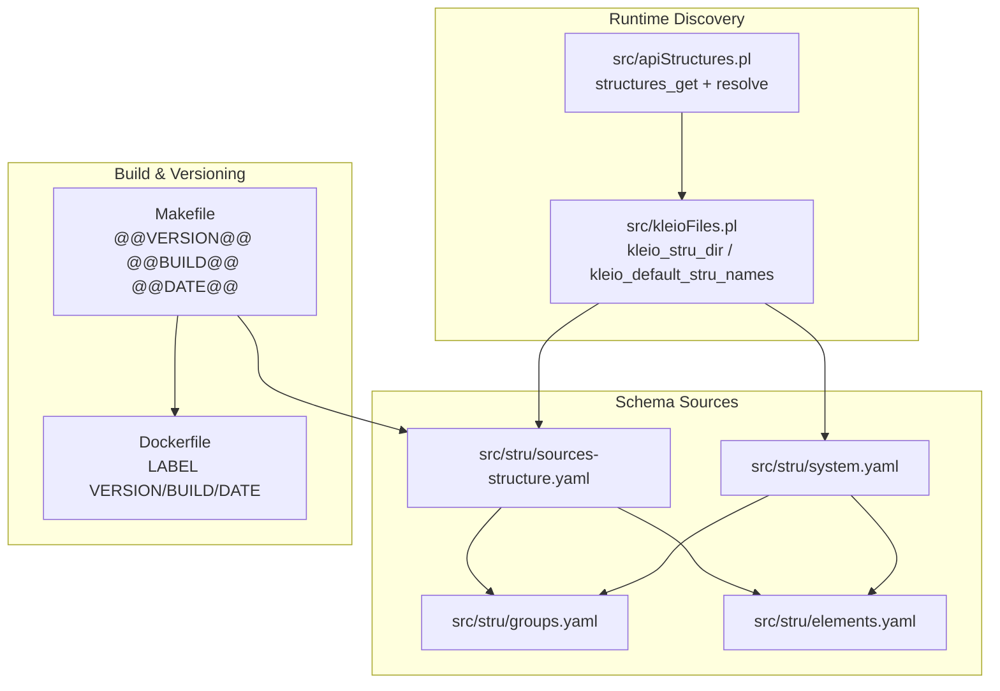
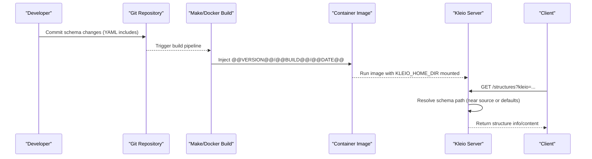
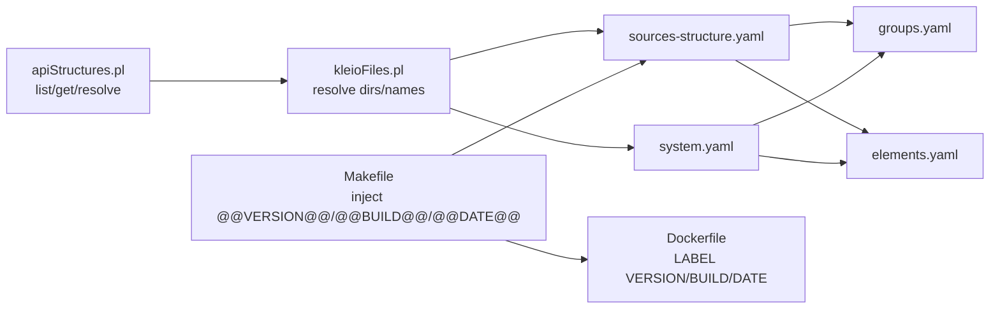

# Schema Packaging and Distribution

<cite>
**Referenced Files in This Document**
- [README.md](file://README.md)
- [Makefile](file://Makefile)
- [Dockerfile](file://Dockerfile)
- [.env-sample](file://.env-sample)
- [kleioFiles.pl](file://src/kleioFiles.pl)
- [apiStructures.pl](file://src/apiStructures.pl)
- [stru_file_location.md](file://docs/doc/stru_file_location.md)
- [sources-structure.yaml](file://src/stru/sources-structure.yaml)
- [system.yaml](file://src/stru/system.yaml)
- [groups.yaml](file://src/stru/groups.yaml)
- [elements.yaml](file://src/stru/elements.yaml)
- [dataDictionary.pl](file://src/dataDictionary.pl)
</cite>

## Table of Contents
1. [Introduction](#introduction)
2. [Project Structure](#project-structure)
3. [Core Components](#core-components)
4. [Architecture Overview](#architecture-overview)
5. [Detailed Component Analysis](#detailed-component-analysis)
6. [Dependency Analysis](#dependency-analysis)
7. [Performance Considerations](#performance-considerations)
8. [Troubleshooting Guide](#troubleshooting-guide)
9. [Conclusion](#conclusion)
10. [Appendices](#appendices)

## Introduction
This document explains how to package, version, and distribute Kleio schemas (structures) within the project. It covers schema bundling strategies using YAML includes, dependency management via include directives, and version compatibility practices tied to server builds and images. It also provides guidance for publishing schemas through the structures API, creating catalogs, and establishing collaborative workflows. Where applicable, it references repository files that implement these capabilities.

## Project Structure
Kleio schemas are defined as YAML structure files under src/stru. The default entry point is sources-structure.yaml, which composes core groups and elements via include directives. A system-level aggregator (system.yaml) demonstrates a minimal composition pattern. The runtime discovers and serves schemas from well-known directories and supports resolving the appropriate schema per source file.

**Diagram sources**
- [sources-structure.yaml:1-10](file://src/stru/sources-structure.yaml#L1-L10)
- [system.yaml:1-4](file://src/stru/system.yaml#L1-L4)
- [groups.yaml:1-686](file://src/stru/groups.yaml#L1-L686)
- [elements.yaml:1-305](file://src/stru/elements.yaml#L1-L305)
- [kleioFiles.pl:687-797](file://src/kleioFiles.pl#L687-L797)
- [apiStructures.pl:1-124](file://src/apiStructures.pl#L1-L124)
- [Makefile:60-79](file://Makefile#L60-L79)
- [Dockerfile:3-5](file://Dockerfile#L3-L5)

**Section sources**
- [README.md:1-120](file://README.md#L1-L120)
- [stru_file_location.md:1-34](file://docs/doc/stru_file_location.md#L1-L34)

## Core Components
- Schema composition: YAML-based bundles using include directives to compose reusable parts (groups, elements).
- Default structure selection: The server resolves a default structure and can locate schemas near sources or in standard locations.
- Structures API: Endpoints list and retrieve structure files and resolve the effective structure for a given Kleio source.
- Build-time versioning: Make targets inject version/build/date into artifacts; Docker labels embed them into images.

Key implementation anchors:
- Schema bundle entry points and includes
- Runtime discovery and resolution logic
- API endpoints for listing and retrieving structures
- Build-time substitution of version placeholders

**Section sources**
- [sources-structure.yaml:1-10](file://src/stru/sources-structure.yaml#L1-L10)
- [system.yaml:1-4](file://src/stru/system.yaml#L1-L4)
- [kleioFiles.pl:687-797](file://src/kleioFiles.pl#L687-L797)
- [apiStructures.pl:1-124](file://src/apiStructures.pl#L1-L124)
- [Makefile:60-79](file://Makefile#L60-L79)
- [Dockerfile:3-5](file://Dockerfile#L3-L5)

## Architecture Overview
The packaging and distribution architecture centers on three layers:
- Authoring layer: YAML schema files composed with includes.
- Resolution layer: Server-side logic locates and loads schemas based on environment and source paths.
- Distribution layer: Artifacts (images and build outputs) carry version metadata; APIs expose schemas for consumption.

**Diagram sources**
- [Makefile:60-79](file://Makefile#L60-L79)
- [Dockerfile:3-5](file://Dockerfile#L3-L5)
- [kleioFiles.pl:687-797](file://src/kleioFiles.pl#L687-L797)
- [apiStructures.pl:1-124](file://src/apiStructures.pl#L1-L124)

## Detailed Component Analysis

### Schema Bundling Strategy (YAML Includes)
- Use a top-level bundle (e.g., sources-structure.yaml) to aggregate domain-specific schemas by including shared groups and elements.
- Keep reusable building blocks in separate files (groups.yaml, elements.yaml) and reference them via include directives.
- Maintain a minimal system aggregator (system.yaml) for quick bootstrap or testing.

Best practices:
- Prefer YAML over legacy .str where possible for readability and tooling support.
- Centralize common definitions in groups.yaml and elements.yaml to reduce duplication.
- Document each bundle’s purpose and dependencies at the top of the file.

**Section sources**
- [sources-structure.yaml:1-10](file://src/stru/sources-structure.yaml#L1-L10)
- [system.yaml:1-4](file://src/stru/system.yaml#L1-L4)
- [groups.yaml:1-686](file://src/stru/groups.yaml#L1-L686)
- [elements.yaml:1-305](file://src/stru/elements.yaml#L1-L305)

### Dependency Management and Resolution
- The server determines the schema directory and default structure names, supporting both YAML and legacy formats.
- Resolution order allows placing schemas close to sources for localized control while falling back to global defaults.

Operational notes:
- Environment variables can override default locations.
- The server lists and retrieves structure files and can resolve the effective structure for a specific Kleio file.

**Section sources**
- [kleioFiles.pl:687-797](file://src/kleioFiles.pl#L687-L797)
- [stru_file_location.md:1-34](file://docs/doc/stru_file_location.md#L1-L34)
- [apiStructures.pl:1-124](file://src/apiStructures.pl#L1-L124)

### Version Compatibility and Matrices
- Build-time injection: Makefile replaces placeholders in key artifacts with concrete values.
- Container labeling: Dockerfile embeds version, build number, and date into image metadata.
- Semantic tagging: Make targets tag images with latest/stable and semantic versions.

Compatibility guidance:
- Treat major/minor increments as potential breaking changes; patch updates should be backward compatible.
- Publish stable tags for consumers who require predictable behavior.
- Maintain a simple matrix mapping server image tags to supported schema features when evolving schemas.

**Section sources**
- [Makefile:60-79](file://Makefile#L60-L79)
- [Makefile:133-153](file://Makefile#L133-L153)
- [Dockerfile:3-5](file://Dockerfile#L3-L5)
- [README.md:288-354](file://README.md#L288-L354)

### Publishing Schemas to Repositories and Catalogs
- Store schemas in a structured directory (e.g., src/stru) and mount the home directory at runtime.
- Expose schemas via the structures API for clients to discover and consume.
- Generate machine-readable catalog artifacts (JSON/YAML) from the current schema using built-in utilities.

Catalog generation:
- Use the dictionary utility to export JSON/YAML representations of the active schema for documentation or catalogs.

**Section sources**
- [apiStructures.pl:1-124](file://src/apiStructures.pl#L1-L124)
- [dataDictionary.pl:570-614](file://src/dataDictionary.pl#L570-L614)
- [.env-sample:65-75](file://.env-sample#L65-L75)

### Collaborative Development Workflows
- Co-locate schemas near sources for team ownership while maintaining shared components centrally.
- Use include directives to reuse common definitions across projects.
- Leverage semantic versioning and stable tags to coordinate upgrades across teams.

**Section sources**
- [stru_file_location.md:1-34](file://docs/doc/stru_file_location.md#L1-L34)
- [README.md:288-354](file://README.md#L288-L354)

### Licensing, Attribution, and Contribution Guidelines
- Include license headers and attribution comments in schema files and their includes.
- Document contributors and change history in bundle files’ descriptions.
- Follow contribution standards consistent with the project’s development workflow (PRs, tests, and release process).

[No sources needed since this section provides general guidance]

## Dependency Analysis
The following diagram shows how schema files depend on shared components and how the runtime and build systems interact with them.

**Diagram sources**
- [sources-structure.yaml:1-10](file://src/stru/sources-structure.yaml#L1-L10)
- [system.yaml:1-4](file://src/stru/system.yaml#L1-L4)
- [groups.yaml:1-686](file://src/stru/groups.yaml#L1-L686)
- [elements.yaml:1-305](file://src/stru/elements.yaml#L1-L305)
- [kleioFiles.pl:687-797](file://src/kleioFiles.pl#L687-L797)
- [apiStructures.pl:1-124](file://src/apiStructures.pl#L1-L124)
- [Makefile:60-79](file://Makefile#L60-L79)
- [Dockerfile:3-5](file://Dockerfile#L3-L5)

**Section sources**
- [kleioFiles.pl:687-797](file://src/kleioFiles.pl#L687-L797)
- [apiStructures.pl:1-124](file://src/apiStructures.pl#L1-L124)
- [Makefile:60-79](file://Makefile#L60-L79)
- [Dockerfile:3-5](file://Dockerfile#L3-L5)

## Performance Considerations
- Prefer modular schemas with includes to avoid large monolithic files and improve maintainability.
- Cache resolved schema paths at the application level if frequently accessed.
- Limit recursive scanning of structure directories unless necessary; use explicit paths when possible.

[No sources needed since this section provides general guidance]

## Troubleshooting Guide
Common issues and resolutions:
- Schema not found: Ensure KLEIO_HOME_DIR and KLEIO_STRU_DIR are set correctly and that the expected files exist in the mounted volume.
- Wrong schema applied: Verify the resolution order and that no local overrides conflict with global defaults.
- Version mismatch: Confirm the running image tag matches the intended schema version and that build-time substitutions were applied.

Useful checks:
- List available structures via the structures API.
- Inspect the server configuration and logs for warnings about missing or conflicting definitions.

**Section sources**
- [kleioFiles.pl:687-797](file://src/kleioFiles.pl#L687-L797)
- [apiStructures.pl:1-124](file://src/apiStructures.pl#L1-L124)
- [.env-sample:65-75](file://.env-sample#L65-L75)

## Conclusion
Kleio schemas are packaged as composable YAML bundles, discovered and served by the server, and distributed via container images with embedded version metadata. By leveraging include-based modularity, clear resolution rules, and semantic versioning, teams can collaboratively evolve schemas while maintaining compatibility and traceability.

[No sources needed since this section summarizes without analyzing specific files]

## Appendices

### Appendix A: Key Directories and Files
- Schema authoring: src/stru
- System aggregator: src/stru/system.yaml
- Default bundle: src/stru/sources-structure.yaml
- Shared components: src/stru/groups.yaml, src/stru/elements.yaml
- Runtime discovery: src/kleioFiles.pl
- Structures API: src/apiStructures.pl
- Build/versioning: Makefile, Dockerfile
- Environment template: .env-sample

**Section sources**
- [sources-structure.yaml:1-10](file://src/stru/sources-structure.yaml#L1-L10)
- [system.yaml:1-4](file://src/stru/system.yaml#L1-L4)
- [groups.yaml:1-686](file://src/stru/groups.yaml#L1-L686)
- [elements.yaml:1-305](file://src/stru/elements.yaml#L1-L305)
- [kleioFiles.pl:687-797](file://src/kleioFiles.pl#L687-L797)
- [apiStructures.pl:1-124](file://src/apiStructures.pl#L1-L124)
- [Makefile:60-79](file://Makefile#L60-L79)
- [Dockerfile:3-5](file://Dockerfile#L3-L5)
- [.env-sample:65-75](file://.env-sample#L65-L75)