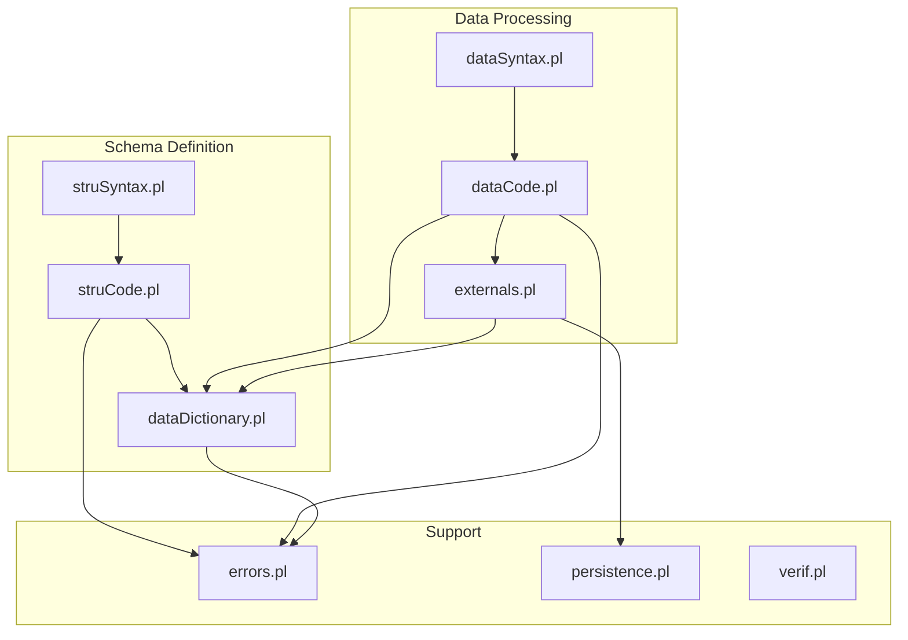
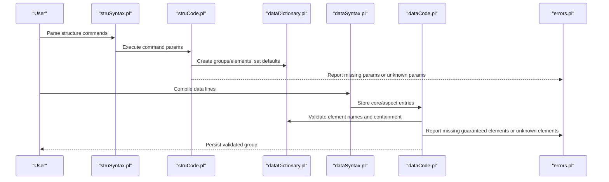
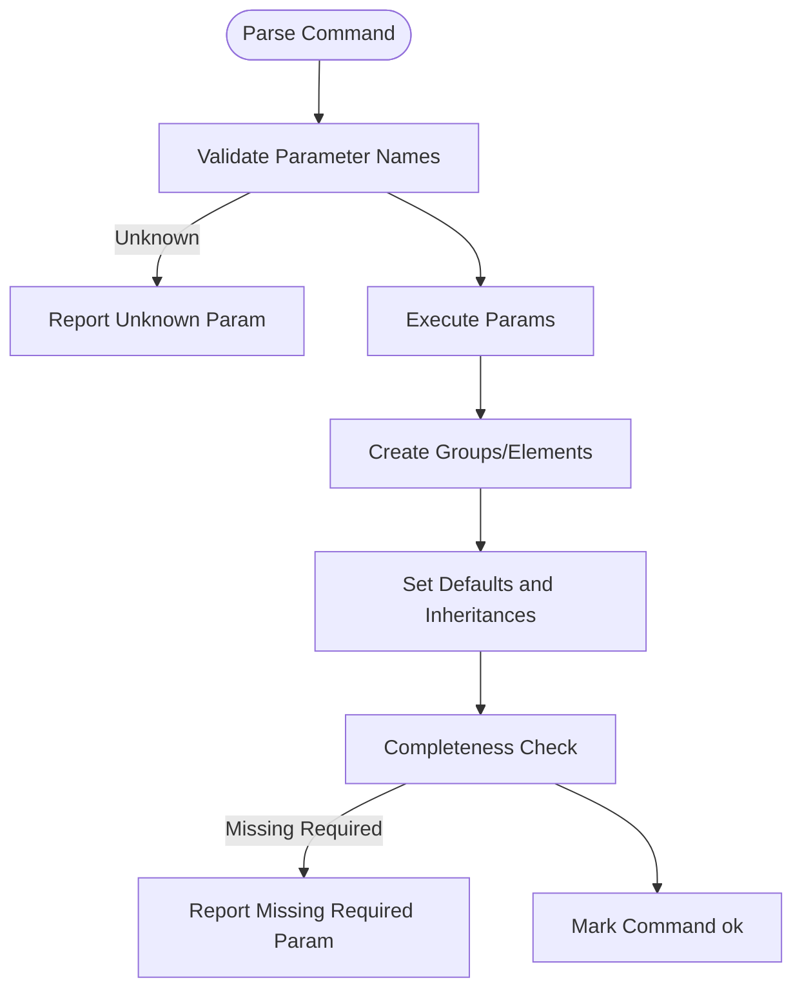
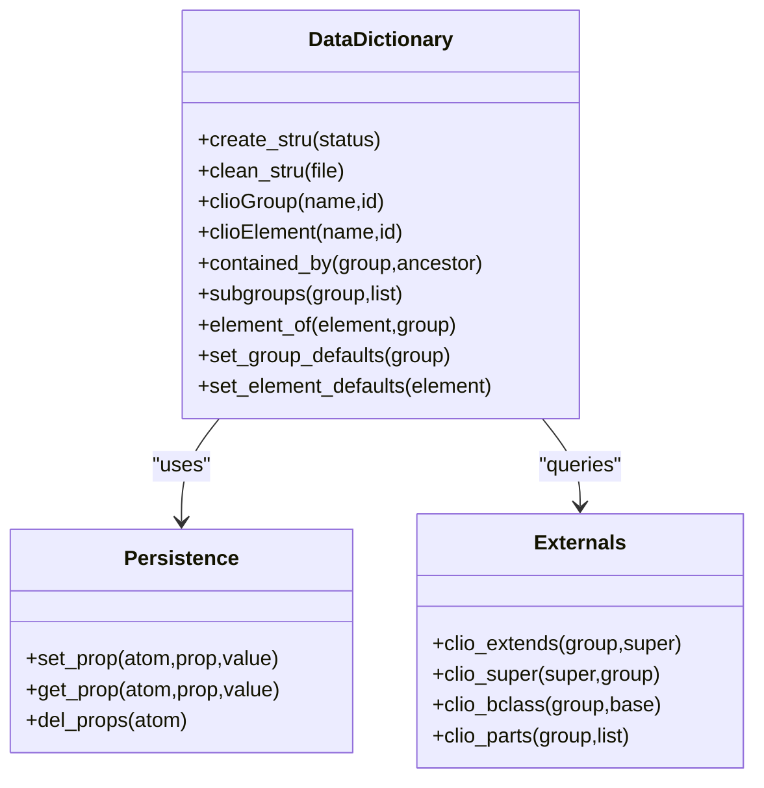
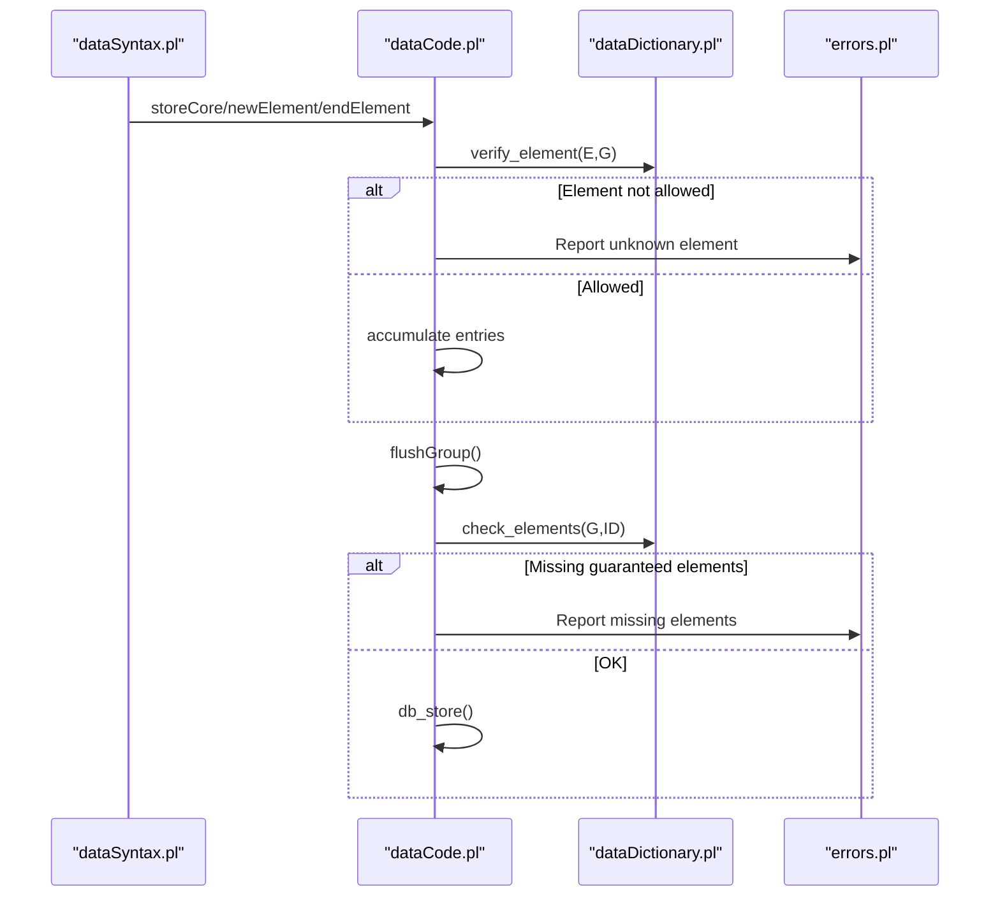
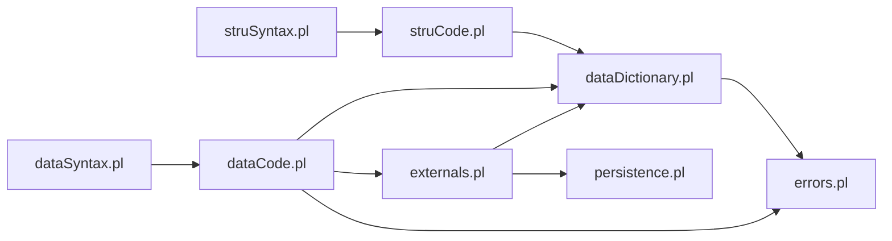

# Schema Validation and Constraints

<cite>
**Referenced Files in This Document**
- [dataDictionary.pl](file://src/dataDictionary.pl)
- [struCode.pl](file://src/struCode.pl)
- [struSyntax.pl](file://src/struSyntax.pl)
- [dataCode.pl](file://src/dataCode.pl)
- [dataSyntax.pl](file://src/dataSyntax.pl)
- [errors.pl](file://src/errors.pl)
- [persistence.pl](file://src/persistence.pl)
- [externals.pl](file://src/externals.pl)
- [verif.pl](file://src/verif.pl)
</cite>

## Table of Contents
1. [Introduction](#introduction)
2. [Project Structure](#project-structure)
3. [Core Components](#core-components)
4. [Architecture Overview](#architecture-overview)
5. [Detailed Component Analysis](#detailed-component-analysis)
6. [Dependency Analysis](#dependency-analysis)
7. [Performance Considerations](#performance-considerations)
8. [Troubleshooting Guide](#troubleshooting-guide)
9. [Conclusion](#conclusion)

## Introduction
This document explains how Kleio validates schemas and enforces constraints during structure definition and data processing. It covers:
- Built-in validation rules for groups and elements (required fields, containment, inheritance).
- How to implement custom constraint predicates using the external API.
- Error reporting mechanisms and how to produce meaningful messages.
- Practical patterns for cross-reference validation and conditional constraints.
- Debugging strategies and performance tips for large datasets.

Kleio’s schema language defines groups and elements with parameters that act as declarative constraints. During parsing and translation, these constraints are enforced, and violations are reported through a unified error system. Custom business rules can be added by implementing predicates that query the current group context and the data dictionary via the external API.

## Project Structure
The validation and constraint system spans several modules:
- Structure definition parsing and command execution
- Data dictionary management (groups, elements, inheritance, containment)
- Data compilation and runtime checks against the schema
- Error reporting and persistence utilities
- External API used by exporters and custom validators

**Diagram sources**
- [struSyntax.pl:1-120](file://src/struSyntax.pl#L1-L120)
- [struCode.pl:1-120](file://src/struCode.pl#L1-L120)
- [dataDictionary.pl:1-120](file://src/dataDictionary.pl#L1-L120)
- [dataSyntax.pl:1-120](file://src/dataSyntax.pl#L1-L120)
- [dataCode.pl:1-120](file://src/dataCode.pl#L1-L120)
- [errors.pl:1-120](file://src/errors.pl#L1-L120)
- [persistence.pl:1-120](file://src/persistence.pl#L1-L120)
- [externals.pl:1-120](file://src/externals.pl#L1-L120)

**Section sources**
- [struSyntax.pl:1-120](file://src/struSyntax.pl#L1-L120)
- [struCode.pl:1-120](file://src/struCode.pl#L1-L120)
- [dataDictionary.pl:1-120](file://src/dataDictionary.pl#L1-L120)
- [dataSyntax.pl:1-120](file://src/dataSyntax.pl#L1-L120)
- [dataCode.pl:1-120](file://src/dataCode.pl#L1-L120)
- [errors.pl:1-120](file://src/errors.pl#L1-L120)
- [persistence.pl:1-120](file://src/persistence.pl#L1-L120)
- [externals.pl:1-120](file://src/externals.pl#L1-L120)

## Core Components
- Structure syntax parser and command executor: parses structure commands, validates required parameters, and populates the data dictionary.
- Data dictionary: stores groups and elements, their properties, inheritance (source/fons), containment relationships, and default values.
- Data compiler: compiles data lines into internal structures and enforces element presence and validity at group boundaries.
- Error reporting: centralizes error/warning output with file and line context and supports aborting on too many errors.
- External API: provides accessors to current group context, data dictionary, and element hierarchies for custom validations.

Key built-in validation rules include:
- Required parameters for structure commands (e.g., nomen, primum).
- Guaranteed elements per group (must be present).
- Element name validity within a group (including inherited elements).
- Containment hierarchy enforcement (group nesting and recursion checks).
- Cross-group inheritance via source/fons for both groups and elements.

**Section sources**
- [struSyntax.pl:120-200](file://src/struSyntax.pl#L120-L200)
- [struCode.pl:120-200](file://src/struCode.pl#L120-L200)
- [dataDictionary.pl:120-220](file://src/dataDictionary.pl#L120-L220)
- [dataCode.pl:140-170](file://src/dataCode.pl#L140-L170)
- [errors.pl:70-120](file://src/errors.pl#L70-L120)
- [externals.pl:120-160](file://src/externals.pl#L120-L160)

## Architecture Overview
The validation pipeline has two phases:
1. Schema definition phase: parse structure files, enforce command completeness, build the data dictionary.
2. Data processing phase: parse data lines, compile into CDS, validate element presence and names, enforce containment, then persist.

**Diagram sources**
- [struSyntax.pl:40-120](file://src/struSyntax.pl#L40-L120)
- [struCode.pl:90-180](file://src/struCode.pl#L90-L180)
- [dataDictionary.pl:120-220](file://src/dataDictionary.pl#L120-L220)
- [dataSyntax.pl:30-120](file://src/dataSyntax.pl#L30-L120)
- [dataCode.pl:140-200](file://src/dataCode.pl#L140-L200)
- [errors.pl:70-120](file://src/errors.pl#L70-L120)

## Detailed Component Analysis

### Schema Definition Phase: Commands, Parameters, and Completeness Checks
- The structure syntax module recognizes commands and parameters, mapping English/Latin keywords and validating parameter lists.
- The code module executes parameters, creates groups/elements, sets defaults, and performs completeness checks. Missing required parameters trigger errors and mark commands notOk.

Built-in constraints:
- Required parameters: nomino requires nomen and primum; pars and terminus require nomen; exitus requires nomen.
- Unknown parameters are rejected with informative errors.
- Group and element creation merges existing definitions with warnings.

**Diagram sources**
- [struSyntax.pl:120-200](file://src/struSyntax.pl#L120-L200)
- [struCode.pl:120-200](file://src/struCode.pl#L120-L200)

**Section sources**
- [struSyntax.pl:120-200](file://src/struSyntax.pl#L120-L200)
- [struCode.pl:120-200](file://src/struCode.pl#L120-L200)

### Data Dictionary: Groups, Elements, Inheritance, and Containment
- Groups and elements are stored with properties such as locus, ceteri, certe, pars, semper, solum, fons/source, and others.
- Containment is inferred from direct parts and superclasses, with caching to avoid repeated computation.
- Element membership in a group considers certe, ceteri, and locus lists.

Key behaviors:
- contained_by checks direct containment and superclass-based containment.
- super_groups and clio_extends traverse inheritance hierarchies.
- element_of returns allowed elements for a group.

**Diagram sources**
- [dataDictionary.pl:120-220](file://src/dataDictionary.pl#L120-L220)
- [persistence.pl:120-220](file://src/persistence.pl#L120-L220)
- [externals.pl:120-160](file://src/externals.pl#L120-L160)

**Section sources**
- [dataDictionary.pl:120-220](file://src/dataDictionary.pl#L120-L220)
- [externals.pl:120-160](file://src/externals.pl#L120-L160)

### Data Compilation and Runtime Validation
- The data syntax module tokenizes and parses data lines, generating calls to store core/aspect entries and manage elements.
- The data code module maintains the Current Data Structure (CDS), tracks group paths, and enforces element presence and naming.

Runtime constraints:
- newElement verifies element names against the current group (including inherited elements).
- flushGroup finalizes a group, constructs an ID, checks guaranteed elements, and persists.
- updatePath ensures valid nesting and prevents recursive containment loops.

**Diagram sources**
- [dataSyntax.pl:30-120](file://src/dataSyntax.pl#L30-L120)
- [dataCode.pl:140-200](file://src/dataCode.pl#L140-L200)
- [dataCode.pl:290-330](file://src/dataCode.pl#L290-L330)
- [errors.pl:70-120](file://src/errors.pl#L70-L120)

**Section sources**
- [dataSyntax.pl:30-120](file://src/dataSyntax.pl#L30-L120)
- [dataCode.pl:140-200](file://src/dataCode.pl#L140-L200)
- [dataCode.pl:290-330](file://src/dataCode.pl#L290-L330)

### Error Reporting Mechanisms
- Centralized error and warning output with context (file, line number, surrounding text).
- Counters track errors and warnings; translation can abort when exceeding a maximum threshold.
- Useful for debugging validation issues and producing actionable messages.

Practical guidance:
- Use error_out/2 to attach context options like file, line_number, line_text, last_line_text.
- Use warning_out/2 for non-fatal issues.
- Monitor error_count/1 and warning_count/1 to decide whether to continue processing.

**Section sources**
- [errors.pl:70-120](file://src/errors.pl#L70-L120)
- [errors.pl:180-220](file://src/errors.pl#L180-L220)

### Implementing Custom Constraint Predicates
Custom constraints can be implemented by writing Prolog predicates that:
- Query the current group and its path via externals.pl.
- Inspect element aspects and values via the data dictionary and CDS.
- Enforce business rules and report errors/warnings via errors.pl.

Common patterns:
- Cross-reference validation: ensure referenced IDs exist and match expected types.
- Conditional constraints: if certain elements are present, require additional ones.
- Value domain checks: validate formats, ranges, or vocabularies.

Example workflow (conceptual):
- At group boundary (flushGroup), call your custom predicate with the group ID and element list.
- Use clio_aspect/3 or getCDField to read element content.
- Use clio_extends/2 or clio_element_extends/2 to resolve base elements.
- Report violations with error_out/2 including file and line context.

[No sources needed since this section provides general guidance]

### Built-in Validation Rules Summary
- Structure command completeness: required parameters enforced.
- Element presence: guaranteed elements must appear in each group instance.
- Element names: only defined elements (including inherited) are allowed.
- Containment hierarchy: valid nesting and no recursive loops.
- Inheritance: source/fons propagates properties across groups and elements.

**Section sources**
- [struCode.pl:290-346](file://src/struCode.pl#L290-L346)
- [dataCode.pl:140-170](file://src/dataCode.pl#L140-L170)
- [dataCode.pl:290-330](file://src/dataCode.pl#L290-L330)
- [dataDictionary.pl:180-260](file://src/dataDictionary.pl#L180-L260)

## Dependency Analysis
The following diagram shows key dependencies among validation-related modules:

**Diagram sources**
- [struSyntax.pl:1-120](file://src/struSyntax.pl#L1-L120)
- [struCode.pl:1-120](file://src/struCode.pl#L1-L120)
- [dataDictionary.pl:1-120](file://src/dataDictionary.pl#L1-L120)
- [dataSyntax.pl:1-120](file://src/dataSyntax.pl#L1-L120)
- [dataCode.pl:1-120](file://src/dataCode.pl#L1-L120)
- [errors.pl:1-120](file://src/errors.pl#L1-L120)
- [persistence.pl:1-120](file://src/persistence.pl#L1-L120)
- [externals.pl:1-120](file://src/externals.pl#L1-L120)

**Section sources**
- [struSyntax.pl:1-120](file://src/struSyntax.pl#L1-L120)
- [struCode.pl:1-120](file://src/struCode.pl#L1-L120)
- [dataDictionary.pl:1-120](file://src/dataDictionary.pl#L1-L120)
- [dataSyntax.pl:1-120](file://src/dataSyntax.pl#L1-L120)
- [dataCode.pl:1-120](file://src/dataCode.pl#L1-L120)
- [errors.pl:1-120](file://src/errors.pl#L1-L120)
- [persistence.pl:1-120](file://src/persistence.pl#L1-L120)
- [externals.pl:1-120](file://src/externals.pl#L1-L120)

## Performance Considerations
- Containment inference caching: dataDictionary caches results of contained_by checks to reduce recomputation across large schemas.
- Avoid excessive backtracking in custom predicates; prefer deterministic checks where possible.
- Batch operations: leverage setof/findall judiciously and minimize repeated dictionary lookups.
- Limit logging verbosity in production runs; use logging selectively for hot paths.
- Tune max_errors to balance early termination with comprehensive diagnostics.

[No sources needed since this section provides general guidance]

## Troubleshooting Guide
Common issues and remedies:
- Missing required parameters in structure commands: check pars/terminus/nomino definitions and ensure all required keys are present.
- Unknown element names: verify element definitions and inheritance (fons/source) so that extended elements are recognized.
- Missing guaranteed elements: ensure every instance includes all required fields for the group.
- Invalid group nesting: review pars/part/semper/solum/repetitio settings and avoid recursive containment.
- Too many errors causing abort: inspect error counts and adjust max_errors if necessary.

Debugging steps:
- Use error_out/2 with context options to pinpoint file and line numbers.
- Print intermediate state using reports and persistence utilities.
- Inspect the data dictionary with show_groups/show_elements helpers.
- Use verif.pl vocabulary listing to audit attribute and relation value distributions.

**Section sources**
- [errors.pl:70-120](file://src/errors.pl#L70-L120)
- [dataDictionary.pl:690-760](file://src/dataDictionary.pl#L690-L760)
- [verif.pl:40-62](file://src/verif.pl#L40-L62)

## Conclusion
Kleio’s schema validation combines declarative constraints (guaranteed elements, containment, inheritance) with robust runtime checks and centralized error reporting. Custom business rules can be layered on top using the external API to query the current context and data dictionary. By leveraging caching, careful predicate design, and targeted error reporting, you can maintain data integrity and scalability even with large datasets.