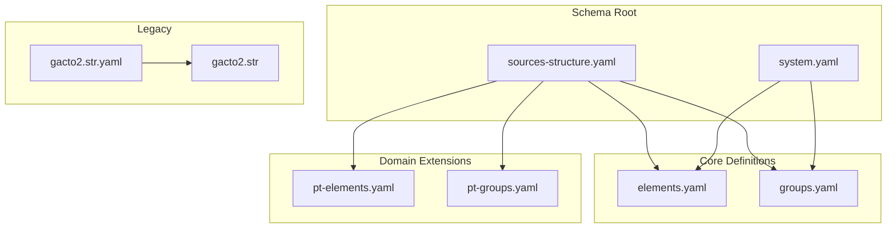
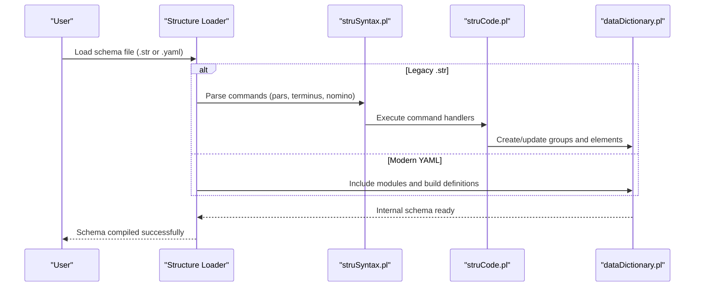
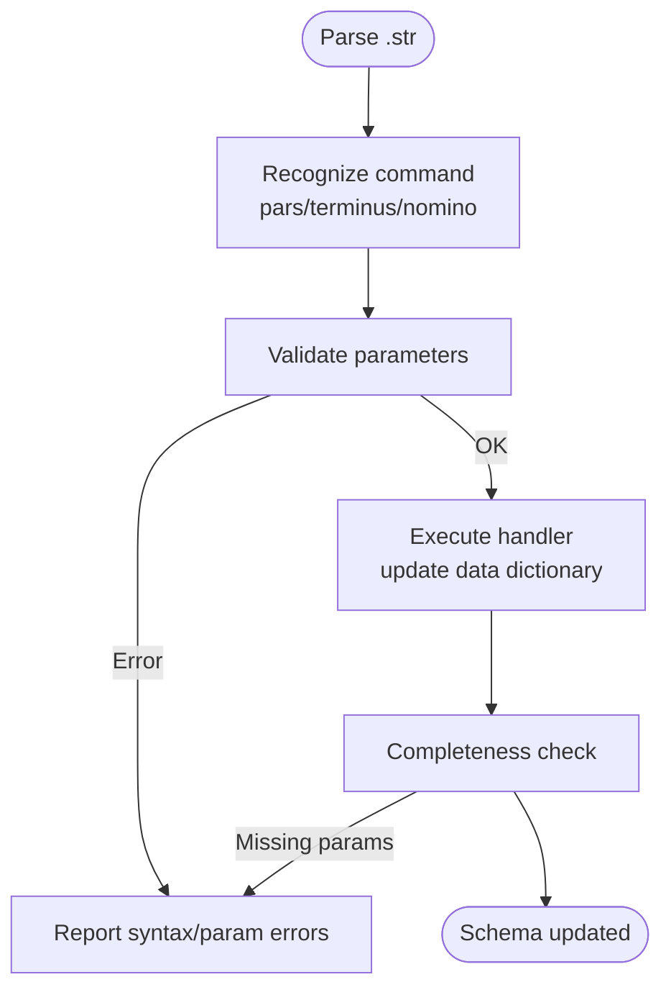
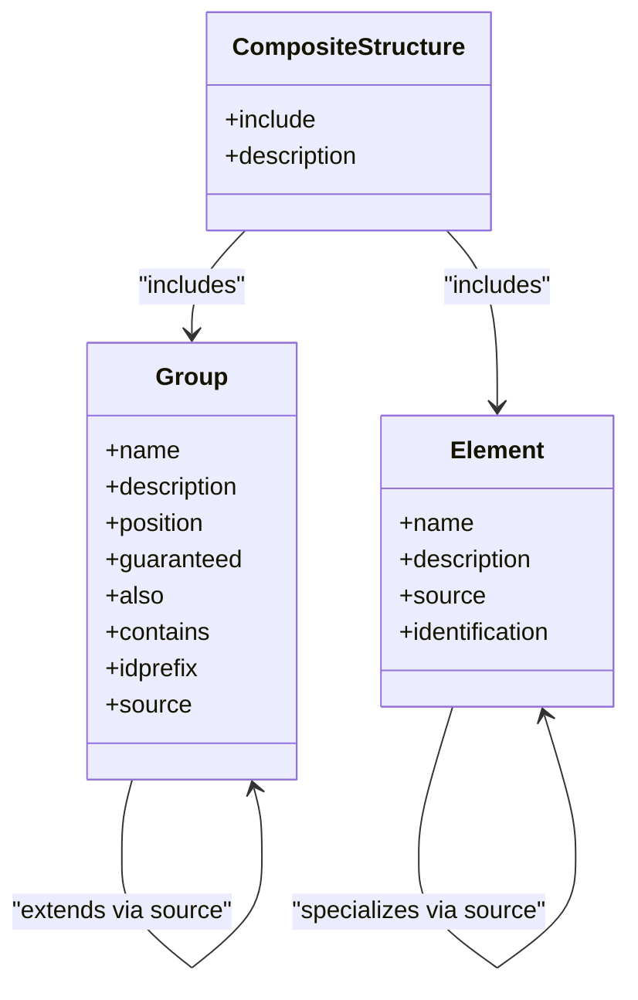
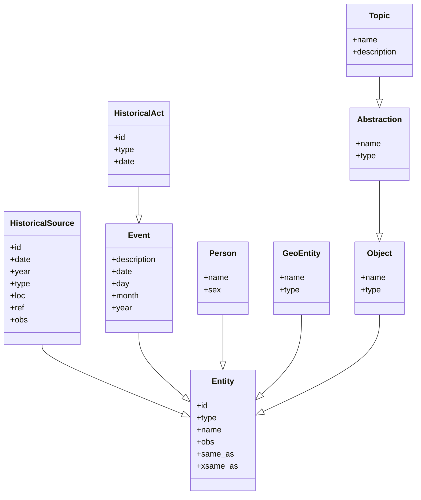
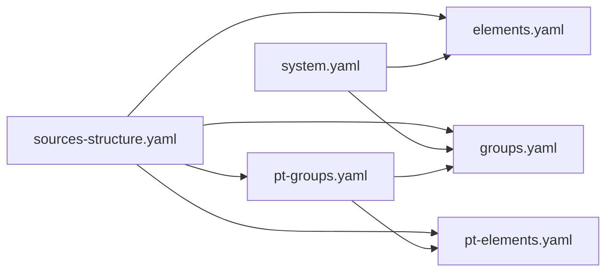

# Schema Management

<cite>
**Referenced Files in This Document**
- [README.md](file://src/stru/README.md)
- [sources-structure.yaml](file://src/stru/sources-structure.yaml)
- [system.yaml](file://src/stru/system.yaml)
- [elements.yaml](file://src/stru/elements.yaml)
- [groups.yaml](file://src/stru/groups.yaml)
- [pt-elements.yaml](file://src/stru/pt-elements.yaml)
- [pt-groups.yaml](file://src/stru/pt-groups.yaml)
- [gacto2.str](file://src/stru/gacto2.str)
- [gacto2.str.yaml](file://src/stru/gacto2.str.yaml)
- [struCode.pl](file://src/struCode.pl)
- [struSyntax.pl](file://src/struSyntax.pl)
- [dataDictionary.pl](file://src/dataDictionary.pl)
</cite>

## Table of Contents
1. Introduction
2. Project Structure
3. Core Components
4. Architecture Overview
5. Detailed Component Analysis
6. Dependency Analysis
7. Performance Considerations
8. Troubleshooting Guide
9. Conclusion
10. Appendices

## Introduction
This document explains how Kleio manages schemas for translating historical documents into a person-oriented database model. It covers both legacy .str structure files and modern YAML-based schemas, detailing element definitions, group hierarchies, validation rules, inheritance patterns, and practical examples for persons, locations, events, and relationships. It also provides guidance on schema validation, error reporting, debugging, versioning, migration strategies, and best practices for maintaining large collections of schemas.

## Project Structure
Kleio’s schema system is centered around the src/stru directory, which contains:
- A default composite structure that includes core groups and elements plus domain-specific extensions (e.g., Portuguese sources).
- Legacy .str files defining structures using a Prolog-based DSL.
- Modern YAML files defining elements and groups with explicit inheritance and composition.

**Diagram sources**
- [sources-structure.yaml:1-10](file://src/stru/sources-structure.yaml#L1-L10)
- [system.yaml:1-4](file://src/stru/system.yaml#L1-L4)
- [elements.yaml:1-305](file://src/stru/elements.yaml#L1-L305)
- [groups.yaml:1-686](file://src/stru/groups.yaml#L1-L686)
- [pt-elements.yaml:1-136](file://src/stru/pt-elements.yaml#L1-L136)
- [pt-groups.yaml:1-238](file://src/stru/pt-groups.yaml#L1-L238)
- [gacto2.str.yaml:1-800](file://src/stru/gacto2.str.yaml#L1-L800)
- [gacto2.str:1-800](file://src/stru/gacto2.str#L1-L800)

**Section sources**
- [README.md:1-7](file://src/stru/README.md#L1-L7)
- [sources-structure.yaml:1-10](file://src/stru/sources-structure.yaml#L1-L10)
- [system.yaml:1-4](file://src/stru/system.yaml#L1-L4)

## Core Components
- Elements: Primitive building blocks such as identifiers, dates, text fields, and control metadata. They can be specialized via source to inherit behavior and types.
- Groups: Structured containers that define allowed elements, required fields, positional ordering, containment rules, and id prefixes. Groups support inheritance through source.
- Composite Structures: YAML files that include multiple modules (core elements, core groups, and domain-specific extensions) to assemble a complete schema.

Key responsibilities:
- Element specialization enables language variants and domain-specific names while preserving processing semantics.
- Group inheritance allows reuse of common structures (e.g., entity, event, act) and specialization for specific document types.
- Validation ensures required fields are present, optional fields are recognized, and containment rules are respected.

**Section sources**
- [elements.yaml:1-305](file://src/stru/elements.yaml#L1-L305)
- [groups.yaml:1-686](file://src/stru/groups.yaml#L1-L686)
- [pt-elements.yaml:1-136](file://src/stru/pt-elements.yaml#L1-L136)
- [pt-groups.yaml:1-238](file://src/stru/pt-groups.yaml#L1-L238)

## Architecture Overview
The schema system supports two parallel representation formats:
- Legacy .str format: A Prolog-based DSL parsed by struSyntax.pl and executed by struCode.pl, which updates the data dictionary.
- Modern YAML format: Declarative definitions included by composite structure files; processed into the same internal representation used by the translator.

**Diagram sources**
- [struSyntax.pl:1-417](file://src/struSyntax.pl#L1-L417)
- [struCode.pl:1-402](file://src/struCode.pl#L1-L402)
- [dataDictionary.pl:343-395](file://src/dataDictionary.pl#L343-L395)

## Detailed Component Analysis

### Legacy .str Format
Legacy structures use commands like pars (for groups), terminus (for elements), and nomino/exitus for scope control. The parser validates parameters and executes handlers that update the internal schema.

Key behaviors:
- Command parsing and parameter validation occur in struSyntax.pl.
- Execution logic and completeness checks are implemented in struCode.pl.
- The data dictionary stores group and element definitions and merges duplicates with warnings.

**Diagram sources**
- [struSyntax.pl:120-180](file://src/struSyntax.pl#L120-L180)
- [struCode.pl:298-346](file://src/struCode.pl#L298-L346)
- [dataDictionary.pl:343-395](file://src/dataDictionary.pl#L343-L395)

**Section sources**
- [gacto2.str:1-800](file://src/stru/gacto2.str#L1-L800)
- [struSyntax.pl:1-417](file://src/struSyntax.pl#L1-L417)
- [struCode.pl:1-402](file://src/struCode.pl#L1-L402)

### Modern YAML Schemas
Modern schemas are declarative YAML files that include core elements and groups and extend them for specific domains.

- Default composite structure includes core modules and domain-specific extensions.
- System base structure composes core groups and elements.
- Domain-specific modules add aliases and specializations (e.g., Portuguese elements and groups).

**Diagram sources**
- [sources-structure.yaml:1-10](file://src/stru/sources-structure.yaml#L1-L10)
- [system.yaml:1-4](file://src/stru/system.yaml#L1-L4)
- [elements.yaml:1-305](file://src/stru/elements.yaml#L1-L305)
- [groups.yaml:1-686](file://src/stru/groups.yaml#L1-L686)
- [pt-elements.yaml:1-136](file://src/stru/pt-elements.yaml#L1-L136)
- [pt-groups.yaml:1-238](file://src/stru/pt-groups.yaml#L1-L238)

**Section sources**
- [sources-structure.yaml:1-10](file://src/stru/sources-structure.yaml#L1-L10)
- [system.yaml:1-4](file://src/stru/system.yaml#L1-L4)
- [elements.yaml:1-305](file://src/stru/elements.yaml#L1-L305)
- [groups.yaml:1-686](file://src/stru/groups.yaml#L1-L686)
- [pt-elements.yaml:1-136](file://src/stru/pt-elements.yaml#L1-L136)
- [pt-groups.yaml:1-238](file://src/stru/pt-groups.yaml#L1-L238)

### Inheritance Patterns and Group Hierarchies
Groups form a hierarchy where specialized groups extend base classes:
- entity -> historical-source -> fonte (Portuguese source)
- entity -> event -> historical-act -> pt-acto -> acto
- entity -> geoentity -> place/lugar
- entity -> person -> male/female -> kin-* and actor* roles
- entity -> object -> abstraction -> topic
- attribute-list and geodesc provide list and hierarchical grouping utilities

Elements specialize base types:
- dia/mes/ano/data map to day/month/year/date
- nome/tipo/valor/localizacao/cota map to name/type/value/loc/ref
- mesmo_que/xmesmo_que map to same_as/xsame_as

**Diagram sources**
- [groups.yaml:84-132](file://src/stru/groups.yaml#L84-L132)
- [groups.yaml:219-244](file://src/stru/groups.yaml#L219-L244)
- [groups.yaml:353-381](file://src/stru/groups.yaml#L353-L381)
- [groups.yaml:454-479](file://src/stru/groups.yaml#L454-L479)
- [pt-groups.yaml:21-72](file://src/stru/pt-groups.yaml#L21-L72)
- [pt-groups.yaml:73-115](file://src/stru/pt-groups.yaml#L73-L115)

**Section sources**
- [groups.yaml:84-132](file://src/stru/groups.yaml#L84-L132)
- [groups.yaml:219-244](file://src/stru/groups.yaml#L219-L244)
- [groups.yaml:353-381](file://src/stru/groups.yaml#L353-L381)
- [groups.yaml:454-479](file://src/stru/groups.yaml#L454-L479)
- [pt-groups.yaml:21-72](file://src/stru/pt-groups.yaml#L21-L72)
- [pt-groups.yaml:73-115](file://src/stru/pt-groups.yaml#L73-L115)

### Practical Examples

#### Persons
- Base person requires name and sex; supports attributes, relations, and personal events.
- Specializations: male/female impose gender constraints; kin-* and actor* roles narrow context within acts/events.

Implementation references:
- person, male, female, kin-*, actorf, actorm definitions.

**Section sources**
- [groups.yaml:373-397](file://src/stru/groups.yaml#L373-L397)
- [groups.yaml:399-451](file://src/stru/groups.yaml#L399-L451)

#### Locations
- Geoentity represents spatial entities; place/lugar are synonyms.
- Hierarchical geography provided via geodesc and geo1..geo4 levels.

Implementation references:
- geoentity, place/lugar, geodesc, geo1..geo4 definitions.

**Section sources**
- [groups.yaml:353-371](file://src/stru/groups.yaml#L353-L371)
- [groups.yaml:639-686](file://src/stru/groups.yaml#L639-L686)

#### Events
- Event captures occurrences without requiring an id; historical-act extends event with id and type.
- Chronology event cevent emphasizes date-first ordering.

Implementation references:
- event, historical-act, cevent definitions.

**Section sources**
- [groups.yaml:69-83](file://src/stru/groups.yaml#L69-L83)
- [groups.yaml:219-244](file://src/stru/groups.yaml#L219-L244)

#### Relationships
- Relation defines typed links between entities with destination and destname.
- Automatic relations may be generated from same_as/xsame_as and function-in-act contexts.

Implementation references:
- relation, rel definitions and notes about automatic relations.

**Section sources**
- [groups.yaml:545-568](file://src/stru/groups.yaml#L545-L568)

### Creating Custom Schemas
To create a custom schema for a new document type:
- Compose a YAML structure file that includes core modules and your domain extensions.
- Define new elements by specializing existing ones via source to preserve processing semantics.
- Define new groups extending base groups (e.g., historical-source, event, person) and specify position, guaranteed, also, contains, and idprefix.
- Use include directives to modularize your schema across multiple files.

References:
- Composite structure assembly and include usage.
- Element and group definition keys documented in YAML headers.

**Section sources**
- [sources-structure.yaml:1-10](file://src/stru/sources-structure.yaml#L1-L10)
- [groups.yaml:1-30](file://src/stru/groups.yaml#L1-L30)
- [elements.yaml:1-305](file://src/stru/elements.yaml#L1-L305)

## Dependency Analysis
Schema modules depend on each other via include directives and inheritance via source. The default structure composes core elements and groups and adds domain-specific extensions.

**Diagram sources**
- [sources-structure.yaml:1-10](file://src/stru/sources-structure.yaml#L1-L10)
- [system.yaml:1-4](file://src/stru/system.yaml#L1-L4)
- [pt-groups.yaml:1-20](file://src/stru/pt-groups.yaml#L1-L20)

**Section sources**
- [sources-structure.yaml:1-10](file://src/stru/sources-structure.yaml#L1-L10)
- [system.yaml:1-4](file://src/stru/system.yaml#L1-L4)
- [pt-groups.yaml:1-20](file://src/stru/pt-groups.yaml#L1-L20)

## Performance Considerations
- Prefer YAML schemas for maintainability and clarity; they compose efficiently via includes.
- Reuse base groups and elements through inheritance to minimize duplication and reduce parsing overhead.
- Keep idprefix consistent per group to avoid collisions and simplify ID generation.
- Avoid deep nesting beyond necessary; use attribute-list and geodesc for structured lists and hierarchies.

[No sources needed since this section provides general guidance]

## Troubleshooting Guide
Common issues and diagnostics:
- Syntax errors in .str files: The parser reports unknown commands, bad parameters, or missing equal signs.
- Missing required parameters: Completeness checks flag missing fields for groups and elements.
- Duplicate definitions: Merging duplicate elements emits warnings; ensure unique names or intentional overrides.
- Connection or runtime errors during translation: Inspect .xrpt logs for stack traces and line numbers.

Debugging techniques:
- Review structure compilation output and error messages produced by the parser and execution layer.
- Validate YAML includes and inheritance chains to ensure referenced groups and elements exist.
- Use small incremental changes and recompile to isolate issues.

**Section sources**
- [struSyntax.pl:52-58](file://src/struSyntax.pl#L52-L58)
- [struCode.pl:306-337](file://src/struCode.pl#L306-L337)
- [dataDictionary.pl:380-387](file://src/dataDictionary.pl#L380-L387)

## Conclusion
Kleio’s schema management supports both legacy .str and modern YAML formats, enabling flexible, extensible modeling of historical documents. By leveraging element specialization, group inheritance, and modular composition, teams can create robust schemas for diverse document types while maintaining consistency and clarity. Adhering to validation rules and employing systematic debugging will streamline development and maintenance of large schema collections.

[No sources needed since this section summarizes without analyzing specific files]

## Appendices

### Best Practices for Large Schema Collections
- Modularize by domain and feature; use include directives to assemble composite structures.
- Centralize shared elements and groups; specialize only when necessary.
- Maintain clear documentation comments in YAML files describing purpose and usage.
- Version schemas alongside data migrations; keep backward compatibility where possible.
- Establish naming conventions for ids, prefixes, and module organization.

[No sources needed since this section provides general guidance]