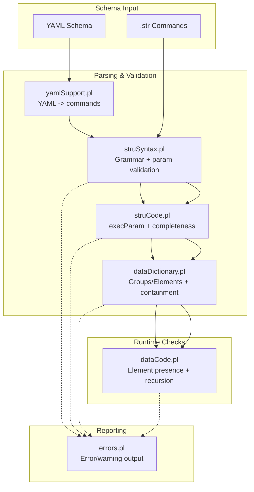
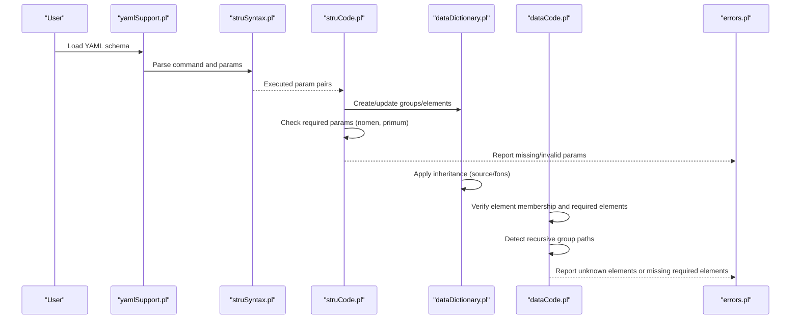
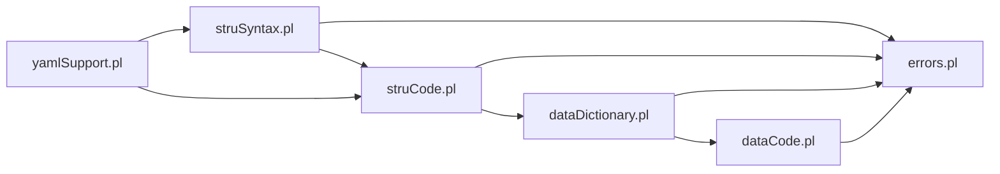

# Built-in Validators

<cite>
**Referenced Files in This Document**
- [struSyntax.pl](file://src/struSyntax.pl)
- [struCode.pl](file://src/struCode.pl)
- [dataDictionary.pl](file://src/dataDictionary.pl)
- [yamlSupport.pl](file://src/yamlSupport.pl)
- [errors.pl](file://src/errors.pl)
- [dataCode.pl](file://src/dataCode.pl)
</cite>

## Table of Contents
1. [Introduction](#introduction)
2. [Project Structure](#project-structure)
3. [Core Components](#core-components)
4. [Architecture Overview](#architecture-overview)
5. [Detailed Component Analysis](#detailed-component-analysis)
6. [Dependency Analysis](#dependency-analysis)
7. [Performance Considerations](#performance-considerations)
8. [Troubleshooting Guide](#troubleshooting-guide)
9. [Conclusion](#conclusion)

## Introduction
This document explains the built-in validation mechanisms that Kleio applies during schema compilation. It covers automatic type checking, constraint enforcement, and structural validation for both legacy .str commands and modern YAML-based schemas. You will learn how required parameters are enforced (notably nomen and primum), how duplicate definitions are handled, how parameter ordering rules are applied, and how cross-references between groups and elements are validated. The guide also includes examples of common validation errors and guidance on interpreting error messages and understanding the validation pipeline stages.

## Project Structure
The validation pipeline spans several modules:
- Syntax parsing and keyword/value validation for structure commands
- Execution of command parameters and completeness checks
- Dictionary management for groups and elements, including inheritance and containment
- YAML bridge to translate YAML structures into internal commands
- Error reporting infrastructure used throughout the pipeline

**Diagram sources**
- [struSyntax.pl:48-101](file://src/struSyntax.pl#L48-L101)
- [struCode.pl:105-118](file://src/struCode.pl#L105-L118)
- [dataDictionary.pl:336-387](file://src/dataDictionary.pl#L336-L387)
- [yamlSupport.pl:132-140](file://src/yamlSupport.pl#L132-L140)
- [dataCode.pl:154-168](file://src/dataCode.pl#L154-L168)
- [errors.pl:85-113](file://src/errors.pl#L85-L113)

**Section sources**
- [struSyntax.pl:48-101](file://src/struSyntax.pl#L48-L101)
- [struCode.pl:105-118](file://src/struCode.pl#L105-L118)
- [dataDictionary.pl:336-387](file://src/dataDictionary.pl#L336-L387)
- [yamlSupport.pl:132-140](file://src/yamlSupport.pl#L132-L140)
- [dataCode.pl:154-168](file://src/dataCode.pl#L154-L168)
- [errors.pl:85-113](file://src/errors.pl#L85-L113)

## Core Components
- Syntax validator: Ensures commands and parameters are recognized and well-formed; validates value types and allowed keywords.
- Command executor and completeness checker: Enforces required parameters (e.g., nomen, primum), sets defaults, and persists command state.
- Data dictionary: Manages group and element definitions, inheritance via source/fons, containment relationships, and default propagation.
- YAML support: Translates YAML structure files into internal commands with ordered parameter processing.
- Runtime data validation: Verifies element membership in groups and enforces presence of required elements; detects recursive group paths.
- Error reporting: Centralized error and warning output with file and line context.

Key responsibilities by module:
- struSyntax.pl: Grammar, parameter name/value validation, English/Latin keyword mapping.
- struCode.pl: Parameter execution, missing-parameter detection, completeness checks.
- dataDictionary.pl: Group/element creation, defaults, inheritance, containment queries, topological ordering.
- yamlSupport.pl: YAML reading, command dispatch, parameter ordering normalization.
- dataCode.pl: Element verification against group definitions, required-element checks, recursion detection.
- errors.pl: Unified error/warning emission and continuation control.

**Section sources**
- [struSyntax.pl:124-181](file://src/struSyntax.pl#L124-L181)
- [struCode.pl:305-346](file://src/struCode.pl#L305-L346)
- [dataDictionary.pl:336-387](file://src/dataDictionary.pl#L336-L387)
- [yamlSupport.pl:159-177](file://src/yamlSupport.pl#L159-L177)
- [dataCode.pl:154-168](file://src/dataCode.pl#L154-L168)
- [errors.pl:85-113](file://src/errors.pl#L85-L113)

## Architecture Overview
The validation pipeline proceeds through distinct stages:

**Diagram sources**
- [yamlSupport.pl:132-140](file://src/yamlSupport.pl#L132-L140)
- [struSyntax.pl:48-101](file://src/struSyntax.pl#L48-L101)
- [struCode.pl:105-118](file://src/struCode.pl#L105-L118)
- [dataDictionary.pl:336-387](file://src/dataDictionary.pl#L336-L387)
- [dataCode.pl:154-168](file://src/dataCode.pl#L154-L168)
- [errors.pl:85-113](file://src/errors.pl#L85-L113)

## Detailed Component Analysis

### Syntax Validator (struSyntax.pl)
- Validates command names and parameter names against known lists.
- Enforces value constraints (e.g., specific keywords for certain parameters).
- Maps English equivalents to canonical Latin forms for compatibility.
- Reports bad parameters and mismatched values early.

Common validations:
- Unknown command or parameter names
- Invalid parameter values (e.g., non-allowed keywords)
- Missing equal sign where expected

Error signals:
- Bad parameter name/value errors
- “equal sign expected” when syntax is incorrect

**Section sources**
- [struSyntax.pl:48-101](file://src/struSyntax.pl#L48-L101)
- [struSyntax.pl:124-181](file://src/struSyntax.pl#L124-L181)
- [struSyntax.pl:257-261](file://src/struSyntax.pl#L257-L261)

### Command Executor and Completeness Checker (struCode.pl)
- Executes each parameter-value pair for a command.
- Enforces required parameters per command:
  - nomino requires nomen and primum
  - pars requires nomen
  - terminus requires nomen
- Sets defaults and stores properties for groups/elements.
- On close_command, performs completeness checks and marks status ok/notOk.

Typical errors:
- Missing required parameters (e.g., nomen or primum)
- Unknown parameters for a given command

**Section sources**
- [struCode.pl:105-118](file://src/struCode.pl#L105-L118)
- [struCode.pl:305-346](file://src/struCode.pl#L305-L346)

### Data Dictionary (groups, elements, inheritance, containment)
- Creates and manages groups and elements with unique internal IDs.
- Warns on duplicate definitions and merges properties.
- Applies inheritance via source/fons for both groups and elements.
- Computes containment relationships (direct and via superclasses).
- Provides topological ordering for class hierarchies.

Validation behaviors:
- Duplicate group/element definitions produce warnings and merge properties
- Inheritance copies properties from source unless overridden
- Containment checks ensure valid nesting and references

**Section sources**
- [dataDictionary.pl:336-387](file://src/dataDictionary.pl#L336-L387)
- [dataDictionary.pl:618-646](file://src/dataDictionary.pl#L618-L646)
- [dataDictionary.pl:272-280](file://src/dataDictionary.pl#L272-L280)
- [dataDictionary.pl:665-686](file://src/dataDictionary.pl#L665-L686)

### YAML Support (yamlSupport.pl)
- Reads YAML structure files and translates them into internal commands.
- Normalizes parameter order to ensure critical parameters (name/source) are processed first.
- Sanitizes values (strings to atoms) before passing to execParam.
- Bridges YAML commands to the same validation path as .str commands.

Ordering rule highlights:
- Ensures source and name parameters are prepended so they are processed before dependent parameters.

**Section sources**
- [yamlSupport.pl:132-140](file://src/yamlSupport.pl#L132-L140)
- [yamlSupport.pl:159-177](file://src/yamlSupport.pl#L159-L177)
- [yamlSupport.pl:174-189](file://src/yamlSupport.pl#L174-L189)

### Runtime Data Validation (dataCode.pl)
- Verifies that elements belong to the current group (including inherited elements).
- Enforces presence of required elements (certe) at group boundaries.
- Detects recursive group paths to prevent infinite loops.

Common runtime errors:
- Unknown element in a group
- Missing required elements in a group
- Recursive group linkage detected

**Section sources**
- [dataCode.pl:154-168](file://src/dataCode.pl#L154-L168)
- [dataCode.pl:269-281](file://src/dataCode.pl#L269-L281)
- [dataCode.pl:298-321](file://src/dataCode.pl#L298-L321)

### Error Reporting (errors.pl)
- Centralized error and warning output with file and line context.
- Tracks counts and can abort translation after a maximum number of errors.
- Formats messages consistently across the pipeline.

Usage patterns:
- error_out/1 and error_out/2 for structured errors
- warning_out/1 and warning_out/2 for non-fatal issues
- check_continuation to enforce max error thresholds

**Section sources**
- [errors.pl:85-113](file://src/errors.pl#L85-L113)
- [errors.pl:186-198](file://src/errors.pl#L186-L198)

## Dependency Analysis
The following diagram shows key dependencies among validation components:

**Diagram sources**
- [struSyntax.pl:48-101](file://src/struSyntax.pl#L48-L101)
- [struCode.pl:105-118](file://src/struCode.pl#L105-L118)
- [dataDictionary.pl:336-387](file://src/dataDictionary.pl#L336-L387)
- [yamlSupport.pl:132-140](file://src/yamlSupport.pl#L132-L140)
- [dataCode.pl:154-168](file://src/dataCode.pl#L154-L168)
- [errors.pl:85-113](file://src/errors.pl#L85-L113)

**Section sources**
- [struSyntax.pl:48-101](file://src/struSyntax.pl#L48-L101)
- [struCode.pl:105-118](file://src/struCode.pl#L105-L118)
- [dataDictionary.pl:336-387](file://src/dataDictionary.pl#L336-L387)
- [yamlSupport.pl:132-140](file://src/yamlSupport.pl#L132-L140)
- [dataCode.pl:154-168](file://src/dataCode.pl#L154-L168)
- [errors.pl:85-113](file://src/errors.pl#L85-L113)

## Performance Considerations
- Caching of containment results improves repeated queries for group containment and superclass checks.
- Topological ordering avoids redundant traversal when generating outputs or validating hierarchies.
- Early syntax and parameter validation reduces downstream work and prevents costly failures later.

[No sources needed since this section provides general guidance]

## Troubleshooting Guide

### Interpreting Validation Errors
- Look for the file and line context included in error messages to locate the problematic definition quickly.
- Distinguish between fatal errors (which may halt translation) and warnings (non-fatal but indicative of potential issues).
- Use error counts to understand the scale of problems encountered.

Common error categories and causes:
- Missing required parameters:
  - For nomino: nomen and primum must be present.
  - For pars and terminus: nomen must be present.
- Invalid parameter combinations:
  - Unknown parameter names or invalid values for a given command.
- Duplicate definitions:
  - Groups or elements redefined; system warns and merges properties.
- Cross-reference issues:
  - Unknown elements in a group.
  - Missing required elements (certe) in a group.
  - Recursive group paths detected.

Guidance:
- Ensure YAML parameter order respects name and source precedence; the system normalizes this, but explicit ordering helps readability.
- When encountering “unknown element” errors, verify that the element is declared in the group’s locus/ceteri/certe lists or that it extends a super element included in the group.
- If you see missing required elements, add them to the group’s certe list or include them explicitly in the data.

**Section sources**
- [struCode.pl:305-346](file://src/struCode.pl#L305-L346)
- [dataDictionary.pl:336-387](file://src/dataDictionary.pl#L336-L387)
- [dataCode.pl:154-168](file://src/dataCode.pl#L154-L168)
- [dataCode.pl:298-321](file://src/dataCode.pl#L298-L321)
- [errors.pl:85-113](file://src/errors.pl#L85-L113)

## Conclusion
Kleio’s built-in validators provide robust, multi-stage validation for schema definitions. They enforce required parameters, validate types and allowed values, manage inheritance and containment, and detect structural issues such as duplicates and recursion. By understanding the pipeline stages and error messages, you can quickly diagnose and resolve schema problems, ensuring reliable and consistent structure definitions.