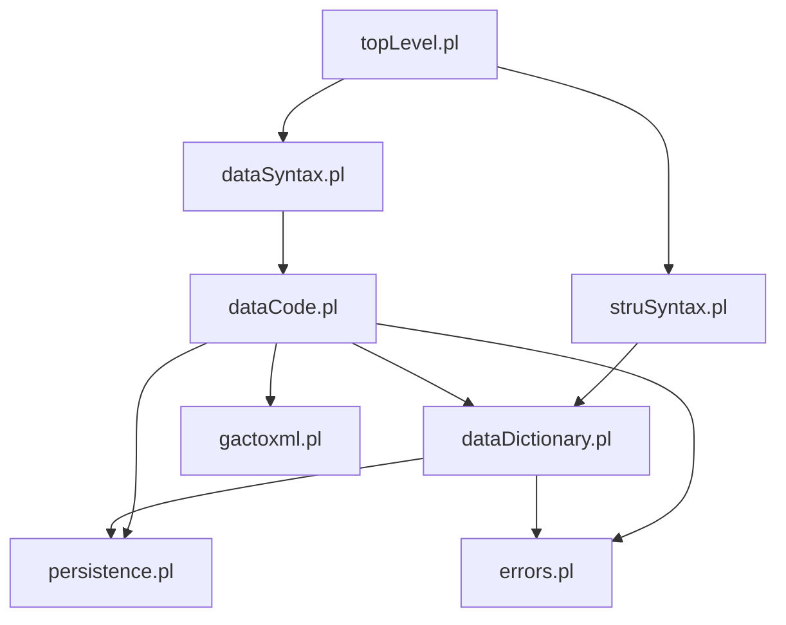
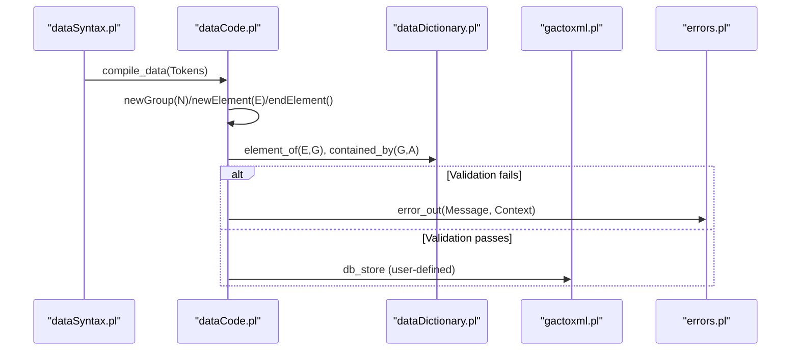
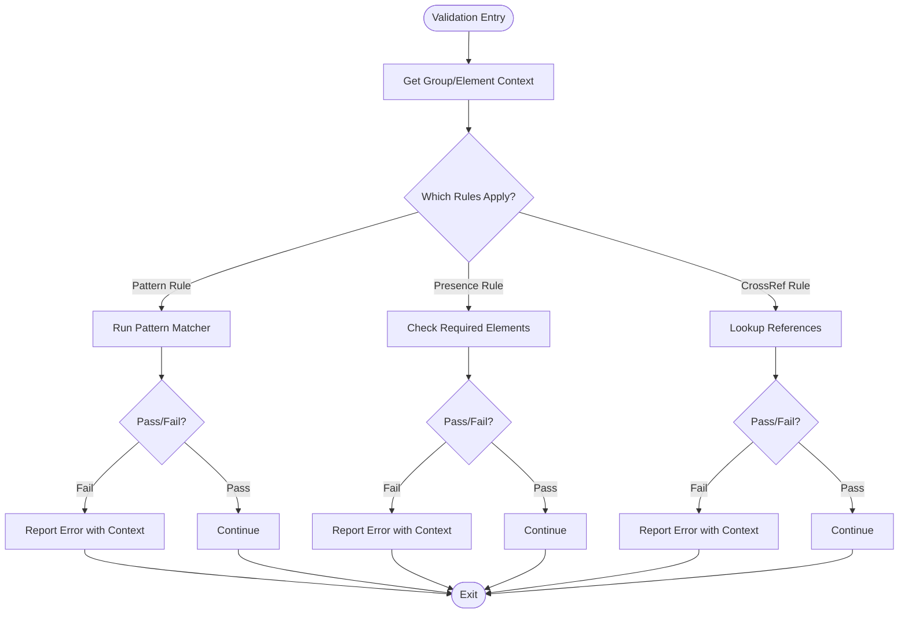
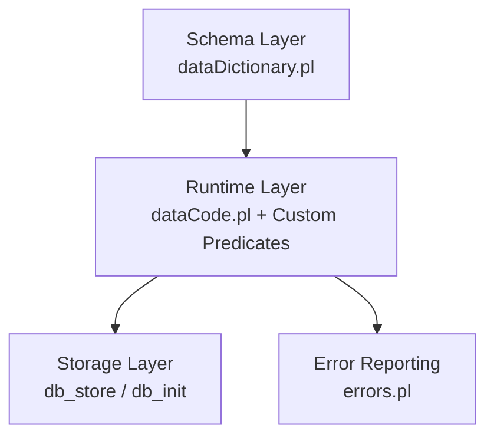
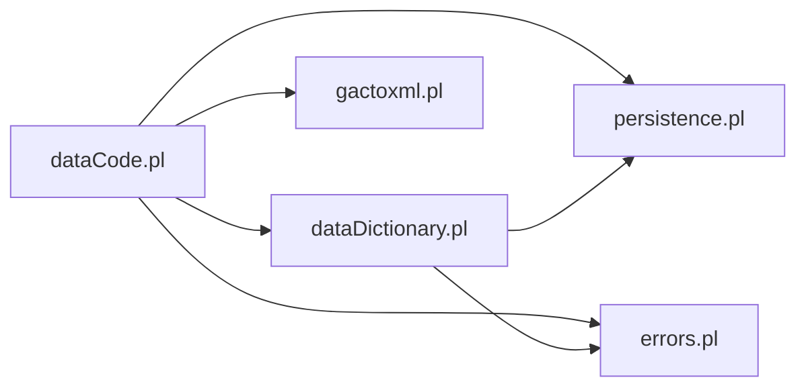

# Custom Validation Rules

<cite>
**Referenced Files in This Document**
- [topLevel.pl](file://src/topLevel.pl)
- [dataSyntax.pl](file://src/dataSyntax.pl)
- [struSyntax.pl](file://src/struSyntax.pl)
- [dataCode.pl](file://src/dataCode.pl)
- [dataDictionary.pl](file://src/dataDictionary.pl)
- [persistence.pl](file://src/persistence.pl)
- [errors.pl](file://src/errors.pl)
- [verif.pl](file://src/verif.pl)
- [inference.pl](file://src/inference.pl)
- [gactoxml.pl](file://src/gactoxml.pl)
</cite>

## Table of Contents
1. [Introduction](#introduction)
2. [Project Structure](#project-structure)
3. [Core Components](#core-components)
4. [Architecture Overview](#architecture-overview)
5. [Detailed Component Analysis](#detailed-component-analysis)
6. [Dependency Analysis](#dependency-analysis)
7. [Performance Considerations](#performance-considerations)
8. [Troubleshooting Guide](#troubleshooting-guide)
9. [Conclusion](#conclusion)
10. [Appendices](#appendices)

## Introduction
This document explains how to implement custom validation rules in Kleio schemas using Prolog predicates. It covers:
- Creating domain-specific business rules via Prolog predicates
- Implementing complex data integrity checks and conditional logic
- The predicate interface for custom validators, parameter passing, and integration points
- Practical examples such as validating historical date patterns, enforcing naming conventions, cross-reference validation between document types, and building reusable validation modules
- Performance considerations for complex validations
- Debugging techniques for custom rule development

Kleio’s translation pipeline parses structure definitions and data files, builds a runtime schema (dictionary), and then processes data records through a series of hooks where custom validation can be integrated.

## Project Structure
The relevant parts of the codebase for custom validation are organized around parsing, schema management, runtime state, and error reporting:
- Parsing and compilation: top-level driver, syntax analyzers for structure and data
- Schema dictionary: groups, elements, containment, inheritance, defaults
- Data processing: current data structure (CDS), element/group lifecycle, storage callbacks
- Persistence utilities: thread-local values and properties
- Error reporting: structured errors with context
- Inference and user-defined hooks: extension points for custom behavior

**Diagram sources**
- [topLevel.pl:34-57](file://src/topLevel.pl#L34-L57)
- [dataSyntax.pl:1-28](file://src/dataSyntax.pl#L1-L28)
- [struSyntax.pl:1-42](file://src/struSyntax.pl#L1-L42)
- [dataCode.pl:1-48](file://src/dataCode.pl#L1-L48)
- [dataDictionary.pl:1-98](file://src/dataDictionary.pl#L1-L98)
- [persistence.pl:1-31](file://src/persistence.pl#L1-L31)
- [errors.pl:1-60](file://src/errors.pl#L1-L60)
- [gactoxml.pl:106-121](file://src/gactoxml.pl#L106-L121)

**Section sources**
- [topLevel.pl:34-57](file://src/topLevel.pl#L34-L57)
- [dataSyntax.pl:1-28](file://src/dataSyntax.pl#L1-L28)
- [struSyntax.pl:1-42](file://src/struSyntax.pl#L1-L42)
- [dataCode.pl:1-48](file://src/dataCode.pl#L1-L48)
- [dataDictionary.pl:1-98](file://src/dataDictionary.pl#L1-L98)
- [persistence.pl:1-31](file://src/persistence.pl#L1-L31)
- [errors.pl:1-60](file://src/errors.pl#L1-L60)
- [gactoxml.pl:106-121](file://src/gactoxml.pl#L106-L121)

## Core Components
- Structure parser and command execution: struSyntax.pl compiles structure commands and triggers initialization/finalization hooks.
- Data parser and CDS handling: dataSyntax.pl tokenizes and compiles data lines; dataCode.pl manages the Current Data Structure (CDS) and group/element lifecycle.
- Schema dictionary: dataDictionary.pl maintains groups, elements, containment, inheritance, and default propagation.
- Persistence utilities: persistence.pl provides thread-safe property/value storage used by all components.
- Error reporting: errors.pl formats and counts errors/warnings with file/line context.
- User hooks and inference: gactoxml.pl exposes db_init/db_close hooks; inference.pl defines declarative inference rules.

Key integration points for custom validation:
- During structure definition: validate or augment group/element properties after they are created.
- During data processing: validate elements and entries at newElement/endEntry/flushGroup boundaries.
- At database initialization/cleanup: set up caches, indexes, or preconditions for cross-document validation.

**Section sources**
- [struSyntax.pl:48-82](file://src/struSyntax.pl#L48-L82)
- [dataSyntax.pl:38-66](file://src/dataSyntax.pl#L38-L66)
- [dataCode.pl:115-148](file://src/dataCode.pl#L115-L148)
- [dataDictionary.pl:118-146](file://src/dataDictionary.pl#L118-L146)
- [persistence.pl:124-174](file://src/persistence.pl#L124-L174)
- [errors.pl:77-113](file://src/errors.pl#L77-L113)
- [gactoxml.pl:117-121](file://src/gactoxml.pl#L117-L121)

## Architecture Overview
Custom validation integrates into Kleio’s pipeline at well-defined points:
- Structure phase: after a group or element is defined, you can enforce naming conventions, required attributes, or cross-group constraints.
- Data phase: when an element begins/ends or a group flushes, you can perform field-level checks, pattern matching, and cross-reference validation.
- Initialization phase: during db_init, build lookup tables or caches for efficient cross-document checks.

**Diagram sources**
- [dataSyntax.pl:38-66](file://src/dataSyntax.pl#L38-L66)
- [dataCode.pl:115-148](file://src/dataCode.pl#L115-L148)
- [dataDictionary.pl:289-308](file://src/dataDictionary.pl#L289-L308)
- [errors.pl:77-113](file://src/errors.pl#L77-L113)
- [gactoxml.pl:117-121](file://src/gactoxml.pl#L117-L121)

## Detailed Component Analysis

### Predicate Interface for Custom Validators
Custom validators are implemented as Prolog predicates invoked from the data processing pipeline. Typical entry points:
- Element-level validation: called from newElement/verify_element or endElement flows
- Group-level validation: called from flushGroup/check_elements
- Cross-document validation: initialized in db_init and queried later

Recommended interface patterns:
- validate_element(Element, GroupId, Path, Entries)
  - Inputs: element name, group id, path, and collected entries
  - Side effects: report errors/warnings via errors module
- validate_group(Group, GroupId, Path)
  - Inputs: group name, group id, path
  - Side effects: report errors/warnings
- initialize_validation()
  - Called from db_init to build caches or load reference data

Parameter passing mechanisms:
- Use persistence.pl get_prop/set_prop to attach metadata to groups/elements
- Use persistence.pl put_value/get_value for per-thread transient state
- Use dataDictionary.pl to query schema relationships (element_of, contained_by, super_groups)

Integration points:
- Insert calls in dataCode.pl hooks (e.g., verify_element, check_elements, flushGroup)
- Optionally extend struSyntax.pl to parse additional structure parameters that drive validation behavior

**Section sources**
- [dataCode.pl:298-321](file://src/dataCode.pl#L298-L321)
- [dataCode.pl:154-168](file://src/dataCode.pl#L154-L168)
- [dataCode.pl:140-148](file://src/dataCode.pl#L140-L148)
- [dataDictionary.pl:289-308](file://src/dataDictionary.pl#L289-L308)
- [dataDictionary.pl:184-261](file://src/dataDictionary.pl#L184-L261)
- [persistence.pl:124-174](file://src/persistence.pl#L124-L174)
- [errors.pl:77-113](file://src/errors.pl#L77-L113)

### Implementing Complex Data Integrity Checks
Complex checks often require:
- Pattern matching on text fields (e.g., dates, IDs)
- Conditional logic based on group hierarchy or element presence
- Cross-references across documents or within the same document

Approach:
- Build lookup structures in initialize_validation() (e.g., maps from identifiers to locations)
- Use persistence.pl to store and retrieve these structures efficiently
- In validate_element/validate_group, query the schema via dataDictionary.pl and run Prolog-based checks
- Report issues using errors.pl with rich context (file, line numbers)

Example categories:
- Historical data patterns: validate date ranges, calendar transitions, or era-specific formats
- Naming conventions: enforce prefixes/suffixes, uniqueness, or allowed character sets
- Cross-reference validation: ensure referenced entities exist and are consistent across document types

**Section sources**
- [gactoxml.pl:117-121](file://src/gactoxml.pl#L117-L121)
- [dataDictionary.pl:289-308](file://src/dataDictionary.pl#L289-L308)
- [errors.pl:135-167](file://src/errors.pl#L135-L167)

### Defining Conditional Validation Logic
Conditional logic can be driven by:
- Group hierarchy: use contained_by and super_groups to determine context
- Element presence: use element_of to check if certain elements are present
- Properties: read group/element properties via get_prop to decide which rules apply

Flowchart example for conditional validation:

[No sources needed since this diagram shows conceptual workflow, not actual code structure]

### Practical Examples

#### Validating Historical Data Patterns
Use Prolog string/date utilities to validate:
- Date formats specific to periods (e.g., Julian vs Gregorian)
- Chronological consistency (e.g., birth before death)
- Era-appropriate names or titles

Implementation tips:
- Store period-specific rules in a cache during initialize_validation()
- Match tokens against expected patterns and report mismatches with line context

**Section sources**
- [dataCode.pl:426-451](file://src/dataCode.pl#L426-L451)
- [errors.pl:135-167](file://src/errors.pl#L135-L167)

#### Enforcing Naming Conventions
Enforce:
- Prefix/suffix requirements for identifiers
- Allowed character sets
- Uniqueness within a scope

Implementation tips:
- Read element_of and group membership to scope rules
- Maintain a registry of seen identifiers in a shared structure for uniqueness checks

**Section sources**
- [dataDictionary.pl:289-308](file://src/dataDictionary.pl#L289-L308)
- [persistence.pl:124-174](file://src/persistence.pl#L124-L174)

#### Cross-Reference Validation Between Different Document Types
Ensure:
- Referenced actors/events exist in other documents
- Relationships are consistent across documents

Implementation tips:
- In initialize_validation(), build indices keyed by identifier and document type
- During validation, look up references and report missing or inconsistent links

**Section sources**
- [gactoxml.pl:117-121](file://src/gactoxml.pl#L117-L121)
- [dataDictionary.pl:184-261](file://src/dataDictionary.pl#L184-L261)

#### Creating Reusable Validation Modules
Organize validation logic into modular Prolog files:
- Define a common interface (e.g., validate_module(Name, Params))
- Register modules during initialization
- Parameterize rules via structure properties or global configuration

Benefits:
- Encapsulation and reuse across projects
- Easier testing and maintenance

**Section sources**
- [persistence.pl:124-174](file://src/persistence.pl#L124-L174)
- [dataDictionary.pl:467-480](file://src/dataDictionary.pl#L467-L480)

### Conceptual Overview
The validation pipeline can be viewed as a layered system:
- Schema layer: defines what is valid structurally
- Runtime layer: enforces business rules dynamically
- Storage layer: persists validated data and supports queries for cross-document checks

[No sources needed since this diagram shows conceptual workflow, not actual code structure]

## Dependency Analysis
Custom validation depends on several core modules:
- dataCode.pl orchestrates validation hooks
- dataDictionary.pl provides schema queries
- persistence.pl supplies state management
- errors.pl formats messages
- gactoxml.pl offers initialization hooks

**Diagram sources**
- [dataCode.pl:1-48](file://src/dataCode.pl#L1-L48)
- [dataDictionary.pl:1-98](file://src/dataDictionary.pl#L1-L98)
- [persistence.pl:1-31](file://src/persistence.pl#L1-L31)
- [errors.pl:1-60](file://src/errors.pl#L1-L60)
- [gactoxml.pl:106-121](file://src/gactoxml.pl#L106-L121)

**Section sources**
- [dataCode.pl:1-48](file://src/dataCode.pl#L1-L48)
- [dataDictionary.pl:1-98](file://src/dataDictionary.pl#L1-L98)
- [persistence.pl:1-31](file://src/persistence.pl#L1-L31)
- [errors.pl:1-60](file://src/errors.pl#L1-L60)
- [gactoxml.pl:106-121](file://src/gactoxml.pl#L106-L121)

## Performance Considerations
- Cache expensive lookups: build indices in initialize_validation() to avoid repeated scans
- Prefer deterministic checks: minimize backtracking in validation predicates
- Batch operations: process large datasets in chunks and update caches incrementally
- Use thread-local state wisely: leverage persistence.pl’s thread-local features to avoid contention
- Limit error reporting overhead: aggregate warnings where appropriate and avoid excessive I/O

[No sources needed since this section provides general guidance]

## Troubleshooting Guide
Common issues and debugging techniques:
- Enable debug logging in critical paths to trace validation decisions
- Use errors.pl context options to pinpoint file and line numbers
- Inspect schema properties via show_props or similar utilities to confirm rule applicability
- Validate incremental changes: test small batches to isolate failures
- Leverage verif.pl vocabularies to audit attribute-value usage across life stories and relations

Practical steps:
- Add logging statements around validation predicates
- Print intermediate states using persistence.pl get_prop/get_shared_prop
- Use check_continuation to control error thresholds during heavy runs

**Section sources**
- [errors.pl:77-113](file://src/errors.pl#L77-L113)
- [errors.pl:135-167](file://src/errors.pl#L135-L167)
- [verif.pl:10-61](file://src/verif.pl#L10-L61)

## Conclusion
Custom validation in Kleio leverages Prolog predicates integrated at key points in the parsing and processing pipeline. By using the provided interfaces and leveraging schema queries, persistence utilities, and error reporting, developers can implement robust, domain-specific business rules. Organizing validations into reusable modules and caching expensive computations ensures scalability and maintainability.

[No sources needed since this section summarizes without analyzing specific files]

## Appendices

### Appendix A: Key Integration Points Reference
- Structure command compilation: struSyntax.pl
- Data compilation and CDS lifecycle: dataSyntax.pl, dataCode.pl
- Schema queries and defaults: dataDictionary.pl
- State management: persistence.pl
- Error reporting: errors.pl
- Initialization hooks: gactoxml.pl

**Section sources**
- [struSyntax.pl:48-82](file://src/struSyntax.pl#L48-L82)
- [dataSyntax.pl:38-66](file://src/dataSyntax.pl#L38-L66)
- [dataCode.pl:115-148](file://src/dataCode.pl#L115-L148)
- [dataDictionary.pl:118-146](file://src/dataDictionary.pl#L118-L146)
- [persistence.pl:124-174](file://src/persistence.pl#L124-L174)
- [errors.pl:77-113](file://src/errors.pl#L77-L113)
- [gactoxml.pl:117-121](file://src/gactoxml.pl#L117-L121)

### Appendix B: Inference Rules as Complementary Validation
Inference rules can complement validation by deriving relations and attributes automatically. They operate declaratively and can be extended with clause-based checks.

**Section sources**
- [inference.pl:1-52](file://src/inference.pl#L1-L52)