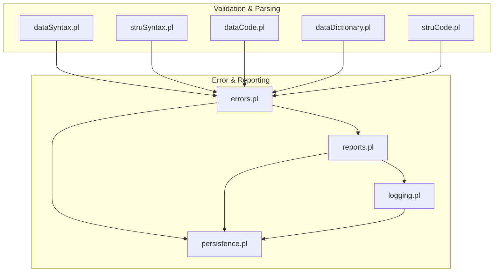
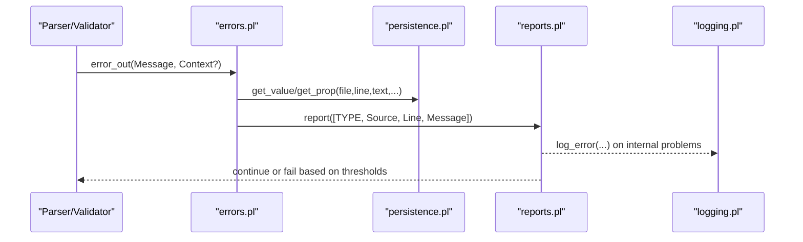
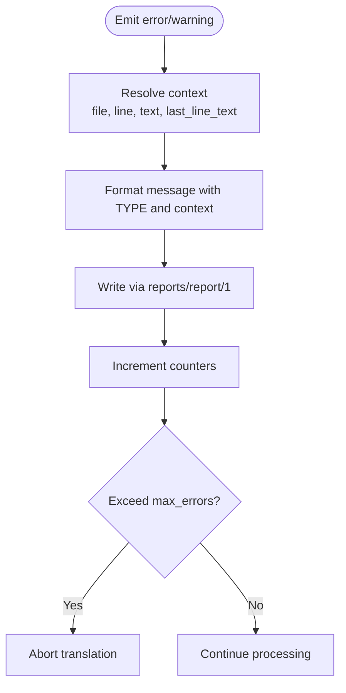
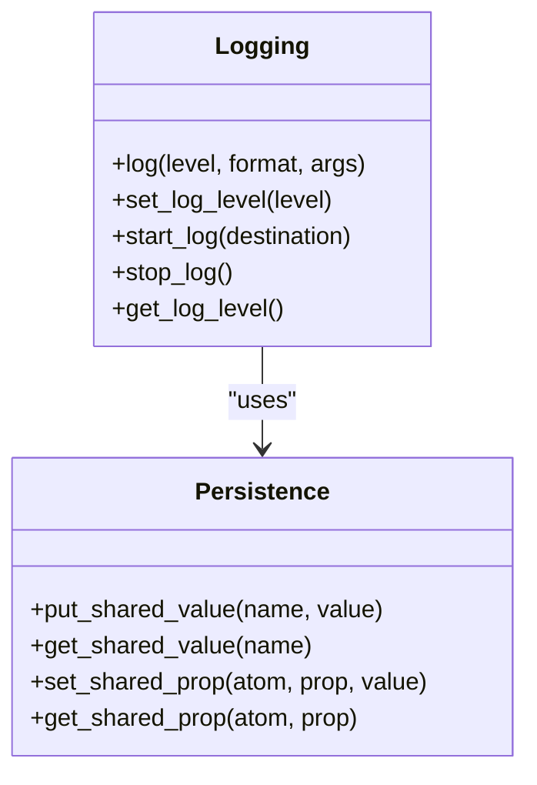
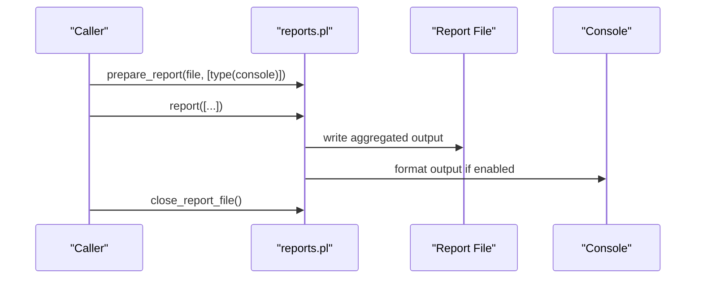
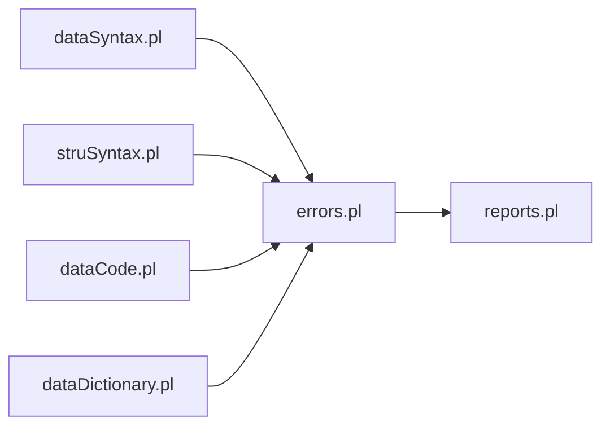
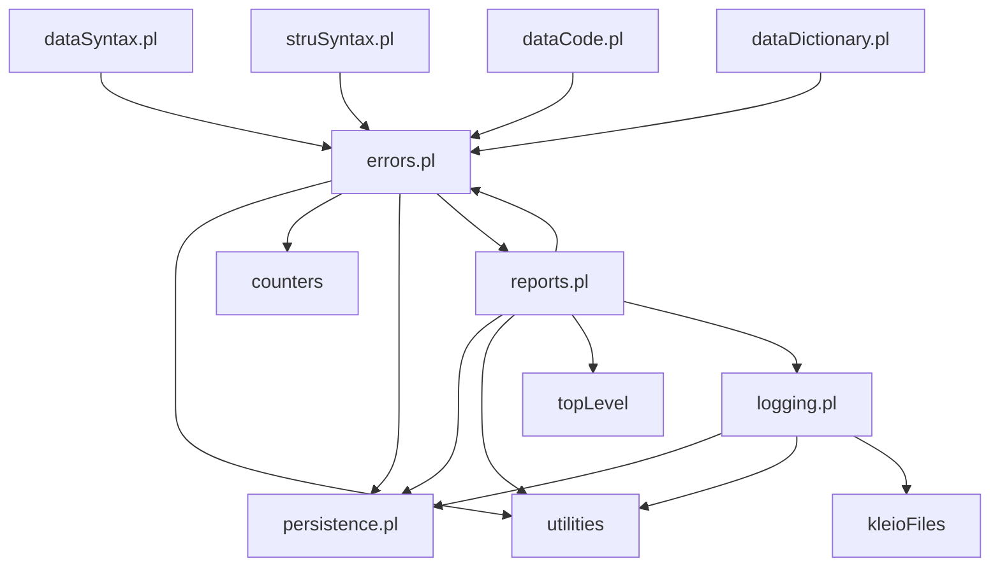

# Error Handling and Reporting

<cite>
**Referenced Files in This Document**
- [errors.pl](file://src/errors.pl)
- [logging.pl](file://src/logging.pl)
- [reports.pl](file://src/reports.pl)
- [persistence.pl](file://src/persistence.pl)
- [dataSyntax.pl](file://src/dataSyntax.pl)
- [struSyntax.pl](file://src/struSyntax.pl)
- [dataCode.pl](file://src/dataCode.pl)
- [dataDictionary.pl](file://src/dataDictionary.pl)
- [struCode.pl](file://src/struCode.pl)
</cite>

## Table of Contents
1. [Introduction](#introduction)
2. [Project Structure](#project-structure)
3. [Core Components](#core-components)
4. [Architecture Overview](#architecture-overview)
5. [Detailed Component Analysis](#detailed-component-analysis)
6. [Dependency Analysis](#dependency-analysis)
7. [Performance Considerations](#performance-considerations)
8. [Troubleshooting Guide](#troubleshooting-guide)
9. [Conclusion](#conclusion)
10. [Appendices](#appendices)

## Introduction
This document explains the error handling and reporting system used by Kleio’s schema validation and translation pipeline. It covers how errors are categorized (error vs warning), how messages are formatted with rich context, how logging is configured and controlled, and how validation errors integrate with the overall translation workflow. It also provides guidance on configuring reporting levels, customizing user-facing messages, preserving error context, collecting debugging information, and adopting best practices for actionable feedback to schema authors.

## Project Structure
The error and reporting subsystem spans several modules:
- Centralized error/warning emission and counting
- Structured logging with severity levels and destinations
- Report file management and dual output (file and console)
- Persistence utilities for shared state and per-thread properties
- Syntax analyzers that raise contextualized errors during parsing
- Data processing code that validates structure and emits detailed diagnostics

**Diagram sources**
- [errors.pl:1-220](file://src/errors.pl#L1-L220)
- [logging.pl:1-161](file://src/logging.pl#L1-L161)
- [reports.pl:1-136](file://src/reports.pl#L1-L136)
- [persistence.pl:1-200](file://src/persistence.pl#L1-L200)
- [dataSyntax.pl:1-194](file://src/dataSyntax.pl#L1-L194)
- [struSyntax.pl:1-417](file://src/struSyntax.pl#L1-L417)
- [dataCode.pl:1-200](file://src/dataCode.pl#L1-L200)
- [dataDictionary.pl:1-200](file://src/dataDictionary.pl#L1-L200)
- [struCode.pl:1-200](file://src/struCode.pl#L1-L200)

**Section sources**
- [errors.pl:1-220](file://src/errors.pl#L1-L220)
- [logging.pl:1-161](file://src/logging.pl#L1-L161)
- [reports.pl:1-136](file://src/reports.pl#L1-L136)
- [persistence.pl:1-200](file://src/persistence.pl#L1-L200)
- [dataSyntax.pl:1-194](file://src/dataSyntax.pl#L1-L194)
- [struSyntax.pl:1-417](file://src/struSyntax.pl#L1-L417)
- [dataCode.pl:1-200](file://src/dataCode.pl#L1-L200)
- [dataDictionary.pl:1-200](file://src/dataDictionary.pl#L1-L200)
- [struCode.pl:1-200](file://src/struCode.pl#L1-L200)

## Core Components
- Error and warning emission:
  - Central predicates for emitting errors and warnings with optional context (file, line number, surrounding lines).
  - Counters track totals; a continuation check can abort processing after a threshold.
- Logging:
  - Severity-based logging with configurable level and destination (file or current output).
  - Helpers for emergency through debug levels and log lifecycle control.
- Reports:
  - Dual-output mechanism writing to a report file and optionally to the console.
  - Header injection and safe execution of report actions.
- Persistence:
  - Shared values and thread-local properties used to store source context (e.g., current file, line numbers).
- Validation integration:
  - Syntax analyzers and data processors call into error emission with precise context.

**Section sources**
- [errors.pl:62-220](file://src/errors.pl#L62-L220)
- [logging.pl:25-161](file://src/logging.pl#L25-L161)
- [reports.pl:27-136](file://src/reports.pl#L27-L136)
- [persistence.pl:33-200](file://src/persistence.pl#L33-L200)
- [dataSyntax.pl:54-63](file://src/dataSyntax.pl#L54-L63)
- [struSyntax.pl:48-58](file://src/struSyntax.pl#L48-L58)
- [dataCode.pl:115-166](file://src/dataCode.pl#L115-L166)

## Architecture Overview
The validation pipeline uses a layered approach:
- Parsers and validators detect issues and emit structured errors/warnings via the error module.
- The error module formats messages using context from persistence and writes them through the reports module.
- The reports module persists human-readable diagnostics and can mirror to console.
- A separate logging subsystem records operational events at various severities for debugging and monitoring.

**Diagram sources**
- [errors.pl:85-167](file://src/errors.pl#L85-L167)
- [reports.pl:91-110](file://src/reports.pl#L91-L110)
- [logging.pl:98-113](file://src/logging.pl#L98-L113)
- [persistence.pl:124-174](file://src/persistence.pl#L124-L174)

## Detailed Component Analysis

### Error Emission and Categorization
- Categories:
  - ERROR: fatal or blocking issues detected during parsing/validation.
  - WARNING: non-fatal issues that may indicate potential problems.
- Contextual enrichment:
  - Optional context options include source file, line number, current line text, and previous line text.
  - If not provided, context is inferred from persistent state (current data/structure file and line properties).
- Formatting:
  - For data files, outputs include type, source file, line number, message, and “Near lines” showing adjacent lines for context.
  - For non-data files, includes command context when available.
- Counting and limits:
  - Each error increments an error counter; each warning increments a warning counter.
  - A continuation check compares the current error count against a maximum threshold (configurable via shared value) and aborts translation if exceeded.

**Diagram sources**
- [errors.pl:85-167](file://src/errors.pl#L85-L167)
- [errors.pl:186-198](file://src/errors.pl#L186-L198)

**Section sources**
- [errors.pl:77-167](file://src/errors.pl#L77-L167)
- [errors.pl:186-198](file://src/errors.pl#L186-L198)

### Logging Mechanisms
- Severity levels:
  - Emergency, alert, critical, error, warning, notice, info, debug.
- Configuration:
  - Set global log level; default is notice.
  - Start logging to a file under the Kleio logs directory or to current output.
- Behavior:
  - Messages below the configured level are ignored.
  - Timestamped entries are written to the active log stream.
  - Internal errors in reporting are logged via the logging module.

**Diagram sources**
- [logging.pl:25-161](file://src/logging.pl#L25-L161)
- [persistence.pl:55-123](file://src/persistence.pl#L55-L123)

**Section sources**
- [logging.pl:25-161](file://src/logging.pl#L25-L161)
- [reports.pl:107-110](file://src/reports.pl#L107-L110)

### Reports System
- Purpose:
  - Provide human-readable diagnostics to a report file and optionally to the console.
- Lifecycle:
  - Prepare report with target file and options (console mirroring).
  - Emit report entries; close report file when done.
- Output behavior:
  - Aggregates predicate list output into a string and writes to both file and console depending on configuration.
  - Wraps calls to safely handle exceptions within report actions.

**Diagram sources**
- [reports.pl:27-106](file://src/reports.pl#L27-L106)
- [reports.pl:123-126](file://src/reports.pl#L123-L126)

**Section sources**
- [reports.pl:27-136](file://src/reports.pl#L27-L136)

### Integration Points in Validation
- Data syntax analyzer:
  - On parse failures, emits an error with token context.
- Structure syntax analyzer:
  - On unknown commands or bad parameters, emits errors with file and line context.
- Data processing:
  - Validates group membership, required elements, and element definitions; emits contextual errors and warnings.
- Dictionary operations:
  - Warns about redefinitions and undefined references; fails fast on missing structure definitions.

**Diagram sources**
- [dataSyntax.pl:54-63](file://src/dataSyntax.pl#L54-L63)
- [struSyntax.pl:48-58](file://src/struSyntax.pl#L48-L58)
- [dataCode.pl:115-166](file://src/dataCode.pl#L115-L166)
- [dataDictionary.pl:117-118](file://src/dataDictionary.pl#L117-L118)

**Section sources**
- [dataSyntax.pl:54-63](file://src/dataSyntax.pl#L54-L63)
- [struSyntax.pl:48-58](file://src/struSyntax.pl#L48-L58)
- [dataCode.pl:115-166](file://src/dataCode.pl#L115-L166)
- [dataDictionary.pl:117-118](file://src/dataDictionary.pl#L117-L118)

## Dependency Analysis
Key dependencies:
- errors.pl depends on utilities, counters, persistence, and reports.
- logging.pl depends on persistence, utilities, kleioFiles, and Prolog libraries.
- reports.pl depends on persistence, utilities, topLevel, errors, logging, and file utilities.
- Syntax and data modules depend on errors and reports for diagnostics.

**Diagram sources**
- [errors.pl:57-61](file://src/errors.pl#L57-L61)
- [logging.pl:19-24](file://src/logging.pl#L19-L24)
- [reports.pl:13-18](file://src/reports.pl#L13-L18)
- [dataSyntax.pl:24-28](file://src/dataSyntax.pl#L24-L28)
- [struSyntax.pl:37-42](file://src/struSyntax.pl#L37-L42)
- [dataCode.pl:39-47](file://src/dataCode.pl#L39-L47)
- [dataDictionary.pl:87-98](file://src/dataDictionary.pl#L87-L98)

**Section sources**
- [errors.pl:57-61](file://src/errors.pl#L57-L61)
- [logging.pl:19-24](file://src/logging.pl#L19-L24)
- [reports.pl:13-18](file://src/reports.pl#L13-L18)
- [dataSyntax.pl:24-28](file://src/dataSyntax.pl#L24-L28)
- [struSyntax.pl:37-42](file://src/struSyntax.pl#L37-L42)
- [dataCode.pl:39-47](file://src/dataCode.pl#L39-L47)
- [dataDictionary.pl:87-98](file://src/dataDictionary.pl#L87-L98)

## Performance Considerations
- Error thresholding:
  - Use the continuation check to avoid excessive error flooding and to stop early when many errors occur.
- Logging overhead:
  - Configure appropriate log levels to minimize I/O cost; use notice or higher for production.
- Report formatting:
  - Avoid heavy computations inside report actions; keep report predicates lightweight.

[No sources needed since this section provides general guidance]

## Troubleshooting Guide
Common scenarios and strategies:
- Too many errors:
  - Adjust the maximum error threshold via shared value and review the first few errors to fix root causes.
- Missing context:
  - Ensure callers pass explicit context options (file, line_number, line_text, last_line_text) when possible.
- Silent failures:
  - Enable logging at debug level to capture internal issues in the reports module.
- Confusing messages:
  - Improve error messages to include actionable steps and reference relevant schema sections.

**Section sources**
- [errors.pl:186-198](file://src/errors.pl#L186-L198)
- [reports.pl:107-110](file://src/reports.pl#L107-L110)
- [logging.pl:89-97](file://src/logging.pl#L89-L97)

## Conclusion
Kleio’s error handling and reporting system provides robust categorization, rich contextual messages, and flexible logging. By leveraging structured error emission, careful context preservation, and configurable reporting levels, developers can deliver clear, actionable feedback to schema authors while maintaining performance and reliability.

[No sources needed since this section summarizes without analyzing specific files]

## Appendices

### Configuring Error Reporting Levels
- Set log level:
  - Use the logging module to set the desired severity level before starting translations.
- Control report output:
  - Prepare reports with options to enable or disable console mirroring.

**Section sources**
- [logging.pl:89-97](file://src/logging.pl#L89-L97)
- [reports.pl:37-57](file://src/reports.pl#L37-L57)

### Customizing Error Messages for Better UX
- Include:
  - Clear description of what went wrong.
  - Exact location (file and line).
  - Suggested corrective action.
- Avoid:
  - Internal jargon or stack traces in user-facing messages.

**Section sources**
- [errors.pl:135-167](file://src/errors.pl#L135-L167)
- [dataCode.pl:154-166](file://src/dataCode.pl#L154-L166)

### Integrating Validation Errors with Translation Workflow
- Ensure parsers and validators call error emission with context.
- Use the continuation check to halt translation when necessary.
- Log operational milestones and anomalies for post-mortem analysis.

**Section sources**
- [dataSyntax.pl:54-63](file://src/dataSyntax.pl#L54-L63)
- [struSyntax.pl:48-58](file://src/struSyntax.pl#L48-L58)
- [errors.pl:186-198](file://src/errors.pl#L186-L198)
- [logging.pl:98-113](file://src/logging.pl#L98-L113)

### Examples of Structured Error Reporting and Context Preservation
- Passing context:
  - Provide file, line_number, line_text, and last_line_text to error_out/warning_out.
- Preserving context:
  - Store current line and file properties in persistence before emitting diagnostics.

**Section sources**
- [errors.pl:89-167](file://src/errors.pl#L89-L167)
- [persistence.pl:124-174](file://src/persistence.pl#L124-L174)

### Debugging Information Collection
- Enable debug logging:
  - Set log level to debug and start logging to a file.
- Capture backtraces:
  - Use logging helpers to record caller information where helpful.

**Section sources**
- [logging.pl:25-161](file://src/logging.pl#L25-L161)

### Error Recovery Strategies
- Graceful degradation:
  - Skip problematic segments and continue processing when safe.
- Early termination:
  - Stop translation upon reaching the error threshold to prevent cascading failures.

**Section sources**
- [errors.pl:186-198](file://src/errors.pl#L186-L198)

### Warning vs Error Classification Best Practices
- Use warnings for:
  - Non-blocking issues, deprecated features, or potential misconfigurations.
- Use errors for:
  - Structural violations, missing required elements, or invalid syntax.

**Section sources**
- [dataDictionary.pl:338-381](file://src/dataDictionary.pl#L338-L381)
- [dataCode.pl:154-166](file://src/dataCode.pl#L154-L166)