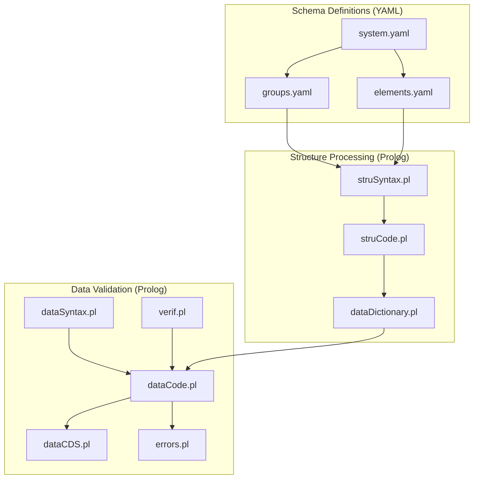
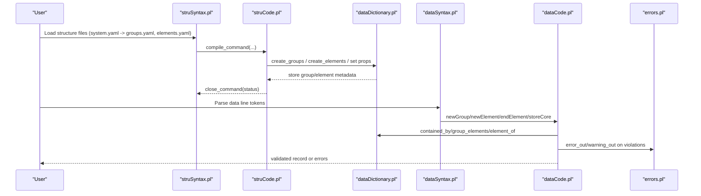
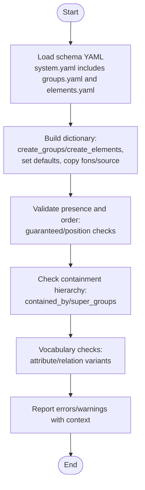
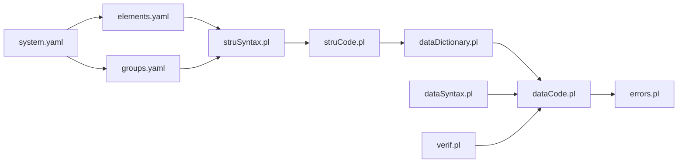

# Validation Rules

<cite>
**Referenced Files in This Document**
- [elements.yaml](file://src/stru/elements.yaml)
- [groups.yaml](file://src/stru/groups.yaml)
- [system.yaml](file://src/stru/system.yaml)
- [dataDictionary.pl](file://src/dataDictionary.pl)
- [struCode.pl](file://src/struCode.pl)
- [struSyntax.pl](file://src/struSyntax.pl)
- [dataSyntax.pl](file://src/dataSyntax.pl)
- [errors.pl](file://src/errors.pl)
- [verif.pl](file://src/verif.pl)
- [dataCDS.pl](file://src/dataCDS.pl)
- [dataCode.pl](file://src/dataCode.pl)
</cite>

## Table of Contents
1. [Introduction](#introduction)
2. [Project Structure](#project-structure)
3. [Core Components](#core-components)
4. [Architecture Overview](#architecture-overview)
5. [Detailed Component Analysis](#detailed-component-analysis)
6. [Dependency Analysis](#dependency-analysis)
7. [Performance Considerations](#performance-considerations)
8. [Troubleshooting Guide](#troubleshooting-guide)
9. [Conclusion](#conclusion)
10. [Appendices](#appendices)

## Introduction
This document explains how validation rules are defined and enforced in Kleio schema definitions. It covers built-in mechanisms for type checking, constraint enforcement, and cross-reference validation; custom validation predicates; error reporting; business rule implementation; debugging; performance optimization; testing; and user-friendly feedback strategies. The goal is to help you design robust schemas and validate data effectively using Kleio’s structure system.

## Project Structure
Kleio schemas are primarily defined in YAML files under src/stru and processed by Prolog modules that build an internal dictionary and enforce constraints during translation.

**Diagram sources**
- [system.yaml:1-4](file://src/stru/system.yaml#L1-L4)
- [groups.yaml:1-686](file://src/stru/groups.yaml#L1-L686)
- [elements.yaml:1-305](file://src/stru/elements.yaml#L1-L305)
- [struSyntax.pl:1-417](file://src/struSyntax.pl#L1-L417)
- [struCode.pl:1-402](file://src/struCode.pl#L1-L402)
- [dataDictionary.pl:1-1224](file://src/dataDictionary.pl#L1-L1224)
- [dataSyntax.pl:1-194](file://src/dataSyntax.pl#L1-L194)
- [dataCode.pl:1-600](file://src/dataCode.pl#L1-L600)
- [dataCDS.pl:1-600](file://src/dataCDS.pl#L1-L600)
- [errors.pl:1-220](file://src/errors.pl#L1-L220)
- [verif.pl:1-62](file://src/verif.pl#L1-L62)

**Section sources**
- [system.yaml:1-4](file://src/stru/system.yaml#L1-L4)
- [groups.yaml:1-686](file://src/stru/groups.yaml#L1-L686)
- [elements.yaml:1-305](file://src/stru/elements.yaml#L1-L305)
- [struSyntax.pl:1-417](file://src/struSyntax.pl#L1-L417)
- [struCode.pl:1-402](file://src/struCode.pl#L1-L402)
- [dataDictionary.pl:1-1224](file://src/dataDictionary.pl#L1-L1224)
- [dataSyntax.pl:1-194](file://src/dataSyntax.pl#L1-L194)
- [dataCode.pl:1-600](file://src/dataCode.pl#L1-L600)
- [dataCDS.pl:1-600](file://src/dataCDS.pl#L1-L600)
- [errors.pl:1-220](file://src/errors.pl#L1-L220)
- [verif.pl:1-62](file://src/verif.pl#L1-L62)

## Core Components
- Schema elements and groups define the vocabulary and constraints:
  - Elements specify types and roles (e.g., id, date, string lengths).
  - Groups declare positional order, required fields, allowed children, and inheritance via source.
- Structure compiler builds an internal dictionary with group/element metadata and containment relationships.
- Data parser enforces syntax and validates presence/order of elements per group definitions.
- Error reporting centralizes messages with file/line context and counts.
- Vocabulary verification supports controlled vocabularies for attributes and relations.

Key responsibilities:
- Type and format constraints: element descriptions and usage patterns (e.g., date formats).
- Presence and ordering: guaranteed and position lists in groups.
- Containment and hierarchy: contains/source properties and super-group checks.
- Cross-reference integrity: identification-related elements and linking semantics.
- Custom checks: vocabulary stores and extension points.

**Section sources**
- [elements.yaml:1-305](file://src/stru/elements.yaml#L1-L305)
- [groups.yaml:1-686](file://src/stru/groups.yaml#L1-L686)
- [dataDictionary.pl:1-1224](file://src/dataDictionary.pl#L1-L1224)
- [dataSyntax.pl:1-194](file://src/dataSyntax.pl#L1-L194)
- [dataCode.pl:1-600](file://src/dataCode.pl#L1-L600)
- [errors.pl:1-220](file://src/errors.pl#L1-L220)
- [verif.pl:1-62](file://src/verif.pl#L1-L62)

## Architecture Overview
The validation pipeline spans two phases:
- Structure phase: parse YAML schema into a runtime dictionary and compute containment/superclass relationships.
- Data phase: parse data lines, match against groups/elements, enforce presence/order/type, and report errors.

**Diagram sources**
- [struSyntax.pl:1-417](file://src/struSyntax.pl#L1-L417)
- [struCode.pl:1-402](file://src/struCode.pl#L1-L402)
- [dataDictionary.pl:1-1224](file://src/dataDictionary.pl#L1-L1224)
- [dataSyntax.pl:1-194](file://src/dataSyntax.pl#L1-L194)
- [dataCode.pl:1-600](file://src/dataCode.pl#L1-L600)
- [errors.pl:1-220](file://src/errors.pl#L1-L220)

## Detailed Component Analysis

### Built-in Type Checking and Constraints
- Element-level typing and usage:
  - Elements such as id, same_as, xsame_as, entity, date, string64/string256/text define expected value shapes and semantics.
  - Date element supports YYYYMMDD, YYYY-MM-DD, ranges, and relative dates.
- Group-level constraints:
  - guaranteed: required elements must be present.
  - position: ordered core elements.
  - also: optional elements allowed.
  - contains: allowed child groups.
  - source: inheritance from another group, merging parameters.

Implementation highlights:
- Dictionary creation and property storage:
  - create_groups/create_elements and set_group_defaults/set_element_defaults initialize defaults and propagate inherited properties.
  - contained_by and super_groups compute containment and superclass relationships used during validation.
- Data validation:
  - dataCode checks missing required elements and unknown elements, producing contextual errors.

Examples of where to look:
- Element definitions and types: [elements.yaml:1-305]
- Group definitions with guaranteed/position/contains/source: [groups.yaml:1-686]
- Dictionary operations and containment logic: [dataDictionary.pl:1-1224]
- Missing required elements error path: [dataCode.pl:1-600]

**Section sources**
- [elements.yaml:1-305](file://src/stru/elements.yaml#L1-L305)
- [groups.yaml:1-686](file://src/stru/groups.yaml#L1-L686)
- [dataDictionary.pl:1-1224](file://src/dataDictionary.pl#L1-L1224)
- [dataCode.pl:1-600](file://src/dataCode.pl#L1-L600)

### Cross-Reference Validation
- Identification elements:
  - id: primary identifier for entities.
  - same_as/xsame_as: link occurrences within or across files.
  - entity/origin/destination: reference other entities.
- Linking behavior:
  - Groups like identifications aggregate real entities and their occurrences.
  - Relations can be generated automatically for identification and function-in-act.

Where this is modeled:
- Element semantics for ids and links: [elements.yaml:1-305]
- Authority registers and identifications groups: [groups.yaml:1-686]
- Relation generation notes in relation group description: [groups.yaml:1-686]

**Section sources**
- [elements.yaml:1-305](file://src/stru/elements.yaml#L1-L305)
- [groups.yaml:1-686](file://src/stru/groups.yaml#L1-L686)

### Custom Validation Predicates and Business Rules
- Controlled vocabularies:
  - verif.pl maintains attribute and relation vocabularies, enabling domain-specific checks on allowed values.
- Extensibility:
  - Add new predicates to existing modules or implement custom structure processors to enforce business rules.
  - Use the structure dictionary APIs to query group/element properties and containment when implementing checks.

How to extend:
- Store and check attribute/relation variants: [verif.pl:1-62]
- Integrate with structure processing: [struCode.pl:1-402], [dataDictionary.pl:1-1224]

**Section sources**
- [verif.pl:1-62](file://src/verif.pl#L1-L62)
- [struCode.pl:1-402](file://src/struCode.pl#L1-L402)
- [dataDictionary.pl:1-1224](file://src/dataDictionary.pl#L1-L1224)

### Error Reporting System
- Centralized error/warning output with context:
  - errors.pl provides error_out/warning_out with file, line number, and surrounding text.
  - Maintains counters and aborts translation after a threshold.
- Usage in validation:
  - dataCode and struSyntax call error utilities to report structural and data issues.

Key behaviors:
- Contextual messages include source file, command, and nearby lines.
- Max error limit configurable via environment.

**Section sources**
- [errors.pl:1-220](file://src/errors.pl#L1-L220)
- [dataCode.pl:1-600](file://src/dataCode.pl#L1-L600)
- [struSyntax.pl:1-417](file://src/struSyntax.pl#L1-L417)

### Data Flow and Processing Logic

**Diagram sources**
- [system.yaml:1-4](file://src/stru/system.yaml#L1-L4)
- [dataDictionary.pl:1-1224](file://src/dataDictionary.pl#L1-L1224)
- [dataCode.pl:1-600](file://src/dataCode.pl#L1-L600)
- [verif.pl:1-62](file://src/verif.pl#L1-L62)
- [errors.pl:1-220](file://src/errors.pl#L1-L220)

## Dependency Analysis

**Diagram sources**
- [struSyntax.pl:1-417](file://src/struSyntax.pl#L1-L417)
- [struCode.pl:1-402](file://src/struCode.pl#L1-L402)
- [dataDictionary.pl:1-1224](file://src/dataDictionary.pl#L1-L1224)
- [dataSyntax.pl:1-194](file://src/dataSyntax.pl#L1-L194)
- [dataCode.pl:1-600](file://src/dataCode.pl#L1-L600)
- [errors.pl:1-220](file://src/errors.pl#L1-L220)
- [verif.pl:1-62](file://src/verif.pl#L1-L62)
- [elements.yaml:1-305](file://src/stru/elements.yaml#L1-L305)
- [groups.yaml:1-686](file://src/stru/groups.yaml#L1-L686)
- [system.yaml:1-4](file://src/stru/system.yaml#L1-L4)

**Section sources**
- [struSyntax.pl:1-417](file://src/struSyntax.pl#L1-L417)
- [struCode.pl:1-402](file://src/struCode.pl#L1-L402)
- [dataDictionary.pl:1-1224](file://src/dataDictionary.pl#L1-L1224)
- [dataSyntax.pl:1-194](file://src/dataSyntax.pl#L1-L194)
- [dataCode.pl:1-600](file://src/dataCode.pl#L1-L600)
- [errors.pl:1-220](file://src/errors.pl#L1-L220)
- [verif.pl:1-62](file://src/verif.pl#L1-L62)
- [elements.yaml:1-305](file://src/stru/elements.yaml#L1-L305)
- [groups.yaml:1-686](file://src/stru/groups.yaml#L1-L686)
- [system.yaml:1-4](file://src/stru/system.yaml#L1-L4)

## Performance Considerations
- Cache containment results:
  - dataDictionary caches containment decisions to avoid repeated traversal of super-groups and parts.
- Minimize redundant work:
  - Avoid redefining groups/elements unnecessarily; warnings indicate merges.
- Control error volume:
  - Configure max_errors to stop early if many issues exist.
- Prefer hierarchical reuse:
  - Use source inheritance to reduce duplication and speed up property resolution.

[No sources needed since this section provides general guidance]

## Troubleshooting Guide
Common issues and remedies:
- Missing required elements:
  - Ensure all guaranteed elements are present and correctly named.
  - Check position ordering if applicable.
- Unknown elements:
  - Verify element names against the current schema; ensure they are defined in elements.yaml or inherited.
- Containment errors:
  - Confirm that child groups are listed in contains of parent groups or inheritable via source.
- Vocabulary mismatches:
  - Update controlled vocabularies in verif.pl or adjust data to use allowed variants.
- Excessive errors:
  - Adjust max_errors setting to continue processing longer or fix top issues first.

Useful references:
- Missing required elements error path: [dataCode.pl:1-600]
- Unknown element error path: [dataCode.pl:1-600]
- Error reporting with context: [errors.pl:1-220]
- Vocabulary stores and listing: [verif.pl:1-62]

**Section sources**
- [dataCode.pl:1-600](file://src/dataCode.pl#L1-L600)
- [errors.pl:1-220](file://src/errors.pl#L1-L220)
- [verif.pl:1-62](file://src/verif.pl#L1-L62)

## Conclusion
Kleio’s validation combines declarative schema definitions with a robust Prolog-based engine. Types and constraints are expressed through elements and groups, while the dictionary and validator enforce presence, order, containment, and vocabulary rules. Errors are reported with rich context, and extensibility points allow custom business rules. By leveraging inheritance, caching, and controlled vocabularies, you can achieve both clarity and performance in complex validation scenarios.

[No sources needed since this section summarizes without analyzing specific files]

## Appendices

### Implementing Business Rules and Domain-Specific Validations
- Define domain-specific elements and groups to capture constraints explicitly.
- Extend verif.pl to maintain controlled vocabularies for your domain.
- Use structure dictionary queries to implement cross-entity checks during validation.

References:
- Element/group modeling: [elements.yaml:1-305], [groups.yaml:1-686]
- Vocabulary management: [verif.pl:1-62]
- Structure dictionary APIs: [dataDictionary.pl:1-1224]

**Section sources**
- [elements.yaml:1-305](file://src/stru/elements.yaml#L1-L305)
- [groups.yaml:1-686](file://src/stru/groups.yaml#L1-L686)
- [verif.pl:1-62](file://src/verif.pl#L1-L62)
- [dataDictionary.pl:1-1224](file://src/dataDictionary.pl#L1-L1224)

### Testing Validation Rules
- Create small schema fragments and data samples to exercise each rule.
- Use the structure display utilities to verify group/element properties and containment.
- Inspect error reports for correctness and clarity.

References:
- Structure inspection: [dataDictionary.pl:1-1224]
- Error outputs: [errors.pl:1-220]

**Section sources**
- [dataDictionary.pl:1-1224](file://src/dataDictionary.pl#L1-L1224)
- [errors.pl:1-220](file://src/errors.pl#L1-L220)

### Error Message Customization and User-Friendly Feedback
- Provide descriptive element/group nota fields to guide users.
- Use consistent naming and clear guaranteed/position lists to reduce ambiguity.
- Leverage contextual error reporting to point users to exact locations and nearby lines.

References:
- Nota and documentation: [dataDictionary.pl:1-1224]
- Contextual errors: [errors.pl:1-220]

**Section sources**
- [dataDictionary.pl:1-1224](file://src/dataDictionary.pl#L1-L1224)
- [errors.pl:1-220](file://src/errors.pl#L1-L220)