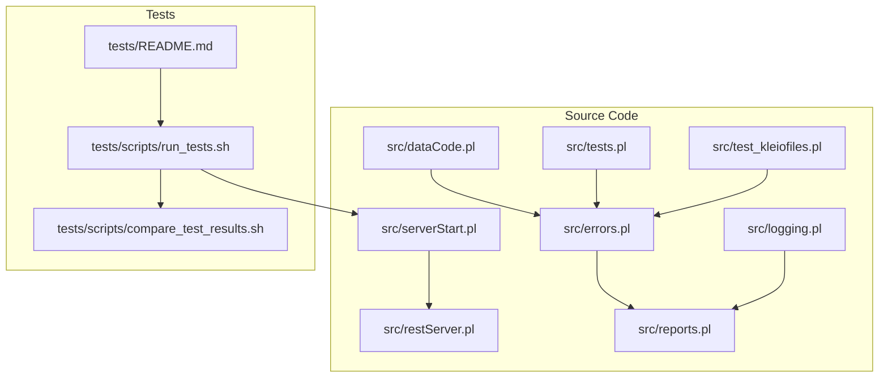
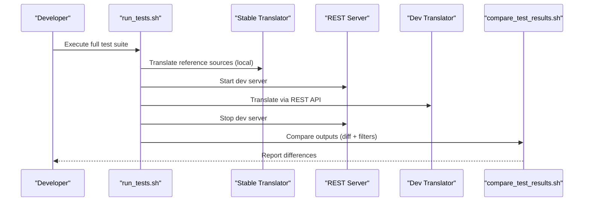
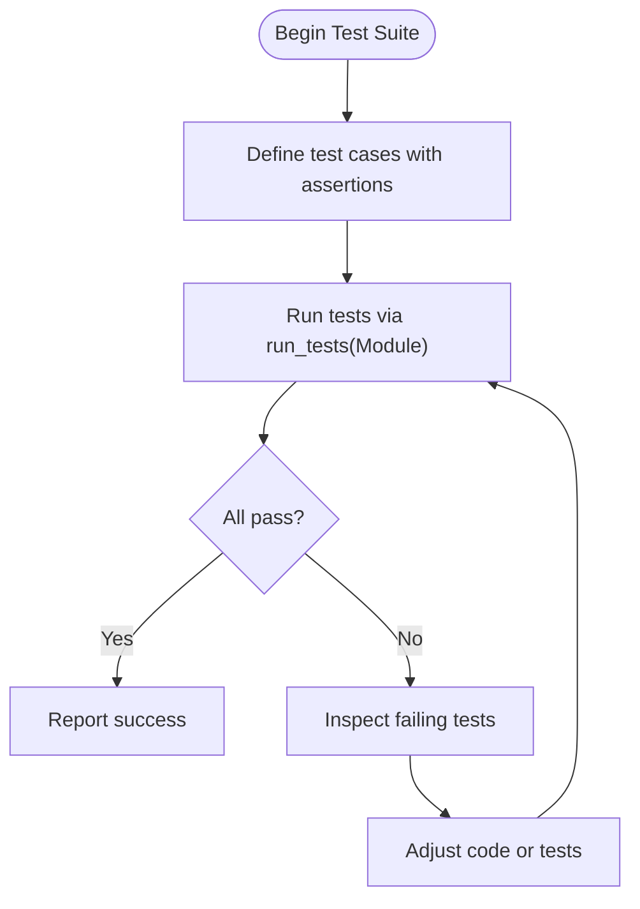
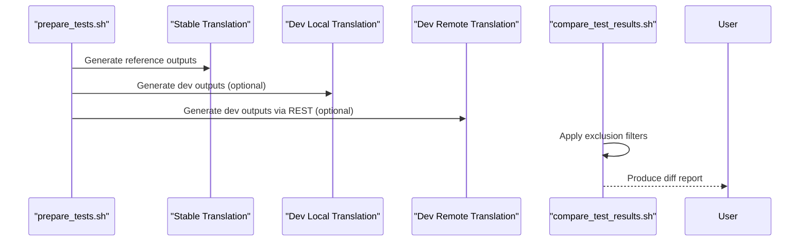
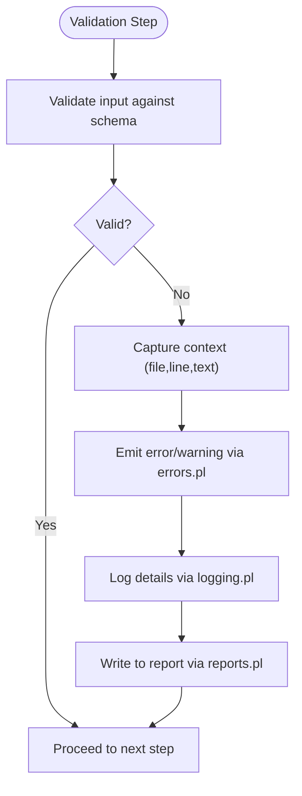
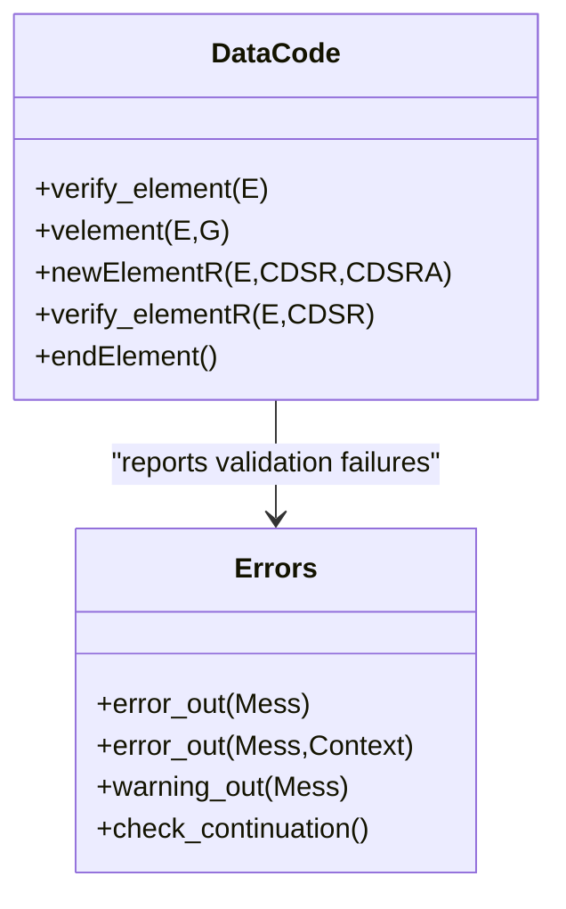
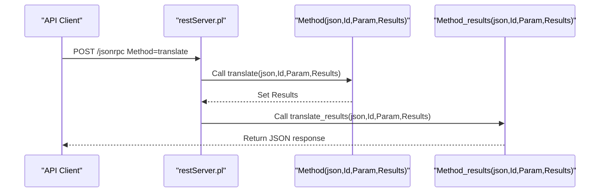
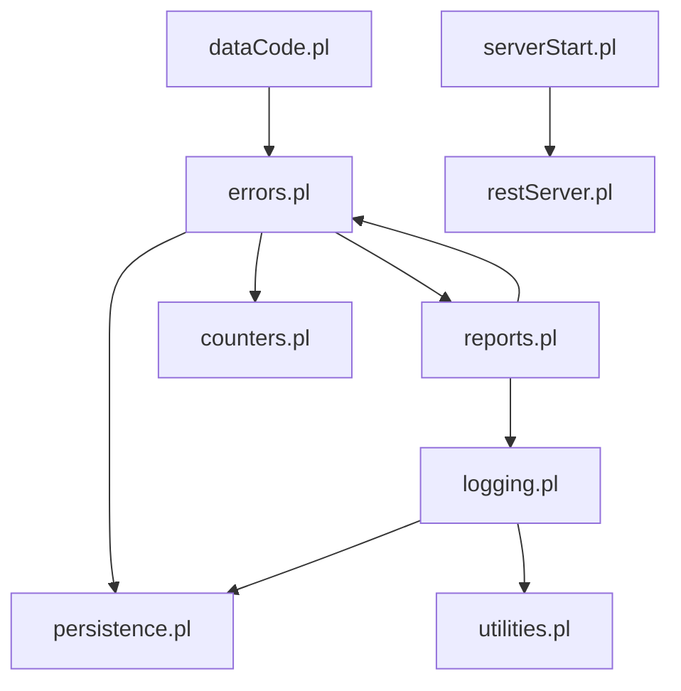

# Validation Testing and Debugging

<cite>
**Referenced Files in This Document**
- [tests/README.md](file://tests/README.md)
- [src/tests.pl](file://src/tests.pl)
- [src/test_kleiofiles.pl](file://src/test_kleiofiles.pl)
- [src/errors.pl](file://src/errors.pl)
- [src/logging.pl](file://src/logging.pl)
- [src/reports.pl](file://src/reports.pl)
- [src/serverStart.pl](file://src/serverStart.pl)
- [src/restServer.pl](file://src/restServer.pl)
- [src/dataCode.pl](file://src/dataCode.pl)
- [tests/scripts/run_tests.sh](file://tests/scripts/run_tests.sh)
- [tests/scripts/compare_test_results.sh](file://tests/scripts/compare_test_results.sh)
</cite>

## Table of Contents
1. [Introduction](#introduction)
2. [Project Structure](#project-structure)
3. [Core Components](#core-components)
4. [Architecture Overview](#architecture-overview)
5. [Detailed Component Analysis](#detailed-component-analysis)
6. [Dependency Analysis](#dependency-analysis)
7. [Performance Considerations](#performance-considerations)
8. [Troubleshooting Guide](#troubleshooting-guide)
9. [Conclusion](#conclusion)
10. [Appendices](#appendices)

## Introduction
This document explains how to test and debug validation rules in Kleio schemas, with a focus on:
- Unit testing approaches for custom validators and core utilities
- Integration testing for complete schema validation workflows (local and server-based)
- Debugging techniques for validation failures
- Performance profiling strategies for complex validation rules
- Tools and patterns for analyzing validation bottlenecks
- Examples of test case creation, assertion patterns, and automated testing strategies
- Common pitfalls, debugging workflows, and best practices for robust validation systems

The repository provides both Prolog unit tests and an end-to-end semantic test harness that compares outputs between a stable translator and the development version. Error reporting, logging, and report generation facilities are available to support debugging and performance analysis.

## Project Structure
Key areas relevant to validation testing and debugging:
- src/: Core system modules including error handling, logging, reports, server startup, REST API, and data processing/validation logic
- tests/: Semantic test suite, scripts, and environment configuration
- api/postman/: API test collection for functional verification

**Diagram sources**
- [src/serverStart.pl](file://src/serverStart.pl)
- [src/restServer.pl](file://src/restServer.pl)
- [src/errors.pl](file://src/errors.pl)
- [src/logging.pl](file://src/logging.pl)
- [src/reports.pl](file://src/reports.pl)
- [src/dataCode.pl](file://src/dataCode.pl)
- [src/tests.pl](file://src/tests.pl)
- [src/test_kleiofiles.pl](file://src/test_kleiofiles.pl)
- [tests/README.md](file://tests/README.md)
- [tests/scripts/run_tests.sh](file://tests/scripts/run_tests.sh)
- [tests/scripts/compare_test_results.sh](file://tests/scripts/compare_test_results.sh)

**Section sources**
- [tests/README.md](file://tests/README.md)
- [src/tests.pl](file://src/tests.pl)
- [src/test_kleiofiles.pl](file://src/test_kleiofiles.pl)
- [src/errors.pl](file://src/errors.pl)
- [src/logging.pl](file://src/logging.pl)
- [src/reports.pl](file://src/reports.pl)
- [src/serverStart.pl](file://src/serverStart.pl)
- [src/restServer.pl](file://src/restServer.pl)
- [src/dataCode.pl](file://src/dataCode.pl)
- [tests/scripts/run_tests.sh](file://tests/scripts/run_tests.sh)
- [tests/scripts/compare_test_results.sh](file://tests/scripts/compare_test_results.sh)

## Core Components
- Unit testing framework: SWI-Prolog plunit-based tests in src/tests.pl and src/test_kleiofiles.pl demonstrate assertion patterns and test organization.
- Error reporting: src/errors.pl centralizes error/warning output, context capture (file, line, text), and continuation checks based on max errors.
- Logging: src/logging.pl provides structured logging with levels and file or console destinations.
- Reports: src/reports.pl manages report files and dual output to file and console.
- Server and API: src/serverStart.pl and src/restServer.pl provide local and remote execution paths for translation and validation workflows.
- Data validation: src/dataCode.pl contains element/group validation logic used during parsing and translation.
- Semantic test harness: tests/README.md and tests/scripts/* orchestrate full pipeline runs and diff-based comparisons.

**Section sources**
- [src/tests.pl](file://src/tests.pl)
- [src/test_kleiofiles.pl](file://src/test_kleiofiles.pl)
- [src/errors.pl](file://src/errors.pl)
- [src/logging.pl](file://src/logging.pl)
- [src/reports.pl](file://src/reports.pl)
- [src/serverStart.pl](file://src/serverStart.pl)
- [src/restServer.pl](file://src/restServer.pl)
- [src/dataCode.pl](file://src/dataCode.pl)
- [tests/README.md](file://tests/README.md)
- [tests/scripts/run_tests.sh](file://tests/scripts/run_tests.sh)
- [tests/scripts/compare_test_results.sh](file://tests/scripts/compare_test_results.sh)

## Architecture Overview
The validation and testing architecture supports two modes:
- Local mode: Direct invocation of the translator via Prolog for fast iteration and debugging.
- Remote mode: REST API-driven translation and validation through a running server.

**Diagram sources**
- [tests/scripts/run_tests.sh](file://tests/scripts/run_tests.sh)
- [tests/scripts/compare_test_results.sh](file://tests/scripts/compare_test_results.sh)
- [src/serverStart.pl](file://src/serverStart.pl)
- [src/restServer.pl](file://src/restServer.pl)

## Detailed Component Analysis

### Unit Testing Framework and Patterns
- Test organization: Tests are grouped by module using begin_tests/end_tests blocks.
- Assertions: Use assertion/1 and built-in plunit features like fail, true, all, nondet.
- Example patterns:
  - Utilities tests verify helper predicates and list transformations.
  - kleiofiles tests assert properties of file sets and status values.

**Diagram sources**
- [src/tests.pl](file://src/tests.pl)
- [src/test_kleiofiles.pl](file://src/test_kleiofiles.pl)

**Section sources**
- [src/tests.pl](file://src/tests.pl)
- [src/test_kleiofiles.pl](file://src/test_kleiofiles.pl)

### Integration Testing for Schema Validation Workflows
- Semantic tests compare outputs from stable vs dev translators across many source files.
- The pipeline:
  - Prepare environment and copy structure files
  - Translate with stable translator to produce baseline outputs
  - Translate with dev translator (local or server mode)
  - Compare outputs using diff with filtering for expected differences

**Diagram sources**
- [tests/README.md](file://tests/README.md)
- [tests/scripts/run_tests.sh](file://tests/scripts/run_tests.sh)
- [tests/scripts/compare_test_results.sh](file://tests/scripts/compare_test_results.sh)

**Section sources**
- [tests/README.md](file://tests/README.md)
- [tests/scripts/run_tests.sh](file://tests/scripts/run_tests.sh)
- [tests/scripts/compare_test_results.sh](file://tests/scripts/compare_test_results.sh)

### Debugging Techniques for Validation Failures
- Error reporting:
  - Centralized error/warning output with context (file, line number, surrounding lines).
  - Continuation control to abort after maximum errors.
- Logging:
  - Structured log levels (emerg, alert, crit, err, warning, notice, info, debug).
  - Configurable destination (file or current output).
- Reports:
  - Dual output to file and console; controlled via prepare_report and set_report.
- Server-side debugging:
  - Start debug server and use thread-aware debugging tools.
  - Environment setup for tests simplifies reproducing issues.

**Diagram sources**
- [src/errors.pl](file://src/errors.pl)
- [src/logging.pl](file://src/logging.pl)
- [src/reports.pl](file://src/reports.pl)
- [src/serverStart.pl](file://src/serverStart.pl)

**Section sources**
- [src/errors.pl](file://src/errors.pl)
- [src/logging.pl](file://src/logging.pl)
- [src/reports.pl](file://src/reports.pl)
- [src/serverStart.pl](file://src/serverStart.pl)

### Data Validation Logic in Parsing and Translation
- Element/group validation:
  - Verify elements belong to groups or extend superclasses.
  - Report unknown elements with contextual information.
- End-of-element processing:
  - Ensure required fields and naming conventions before storing entries.

**Diagram sources**
- [src/dataCode.pl](file://src/dataCode.pl)
- [src/errors.pl](file://src/errors.pl)

**Section sources**
- [src/dataCode.pl](file://src/dataCode.pl)
- [src/errors.pl](file://src/errors.pl)

### REST API and Server-Based Testing
- Server startup:
  - Provides debug and production modes, environment setup for tests, and idle timeout controls.
- JSON-RPC dispatch:
  - Dynamic method invocation and result retrieval patterns.
- API tests:
  - Postman collection exercises endpoints and validates responses.

**Diagram sources**
- [src/restServer.pl](file://src/restServer.pl)
- [src/serverStart.pl](file://src/serverStart.pl)

**Section sources**
- [src/restServer.pl](file://src/restServer.pl)
- [src/serverStart.pl](file://src/serverStart.pl)

## Dependency Analysis
High-level dependencies among components involved in validation and testing:
- dataCode depends on errors for reporting validation failures.
- errors uses persistence and counters for state and counts, and reports for formatted output.
- logging integrates with persistence and utilities, and can write to files or console.
- reports coordinates output streams and integrates with errors and logging.
- serverStart orchestrates server lifecycle and test environments.
- restServer handles JSON-RPC dispatch and interacts with handlers.

**Diagram sources**
- [src/dataCode.pl](file://src/dataCode.pl)
- [src/errors.pl](file://src/errors.pl)
- [src/logging.pl](file://src/logging.pl)
- [src/reports.pl](file://src/reports.pl)
- [src/serverStart.pl](file://src/serverStart.pl)
- [src/restServer.pl](file://src/restServer.pl)

**Section sources**
- [src/dataCode.pl](file://src/dataCode.pl)
- [src/errors.pl](file://src/errors.pl)
- [src/logging.pl](file://src/logging.pl)
- [src/reports.pl](file://src/reports.pl)
- [src/serverStart.pl](file://src/serverStart.pl)
- [src/restServer.pl](file://src/restServer.pl)

## Performance Considerations
- Enable detailed logging at debug level to capture timing and call sites when diagnosing slow validations.
- Use server idle detection to avoid long-running processes during CI or batch runs.
- Prefer local mode for rapid iteration; switch to remote mode to validate concurrency and REST overhead.
- Leverage semantic comparison to detect regressions early and reduce manual inspection time.

[No sources needed since this section provides general guidance]

## Troubleshooting Guide
Common issues and remedies:
- Excessive errors causing early termination:
  - Adjust max_errors threshold and review error messages with context.
- Missing or stale reports:
  - Ensure prepare_report is called and close_report_file is invoked after writing.
- Logging not appearing:
  - Verify log destination and level; open_log must be called before logging.
- Server not responding:
  - Confirm ports and tokens; use run_debug_server and wait_for_idle to manage lifecycle.
- Validation failures in elements/groups:
  - Inspect velement and endElement flows; check group membership and extension relationships.

**Section sources**
- [src/errors.pl](file://src/errors.pl)
- [src/reports.pl](file://src/reports.pl)
- [src/logging.pl](file://src/logging.pl)
- [src/serverStart.pl](file://src/serverStart.pl)
- [src/dataCode.pl](file://src/dataCode.pl)

## Conclusion
The Kleio project provides a comprehensive foundation for testing and debugging validation rules:
- Unit tests demonstrate clear assertion patterns and modular organization.
- Semantic tests ensure stability across architectural changes by comparing outputs.
- Robust error reporting, logging, and report generation facilitate effective debugging.
- Server and API layers enable integration testing under realistic conditions.
Adopting these practices helps maintain robust validation systems and quickly identify regressions.

[No sources needed since this section summarizes without analyzing specific files]

## Appendices

### Automated Testing Strategies
- Full pipeline:
  - Use run_tests.sh to execute stable and dev translations and compare results.
- Local-only mode:
  - Skip server steps for faster feedback loops.
- Custom configurations:
  - Provide alternative .env-tests to tailor paths and tokens.

**Section sources**
- [tests/README.md](file://tests/README.md)
- [tests/scripts/run_tests.sh](file://tests/scripts/run_tests.sh)

### Assertion Patterns for Validation Results
- Use assertion/1 to verify lists, members, and statuses.
- Employ fail and true tags to express negative and positive outcomes.
- Combine all and nondet for non-deterministic scenarios.

**Section sources**
- [src/tests.pl](file://src/tests.pl)
- [src/test_kleiofiles.pl](file://src/test_kleiofiles.pl)