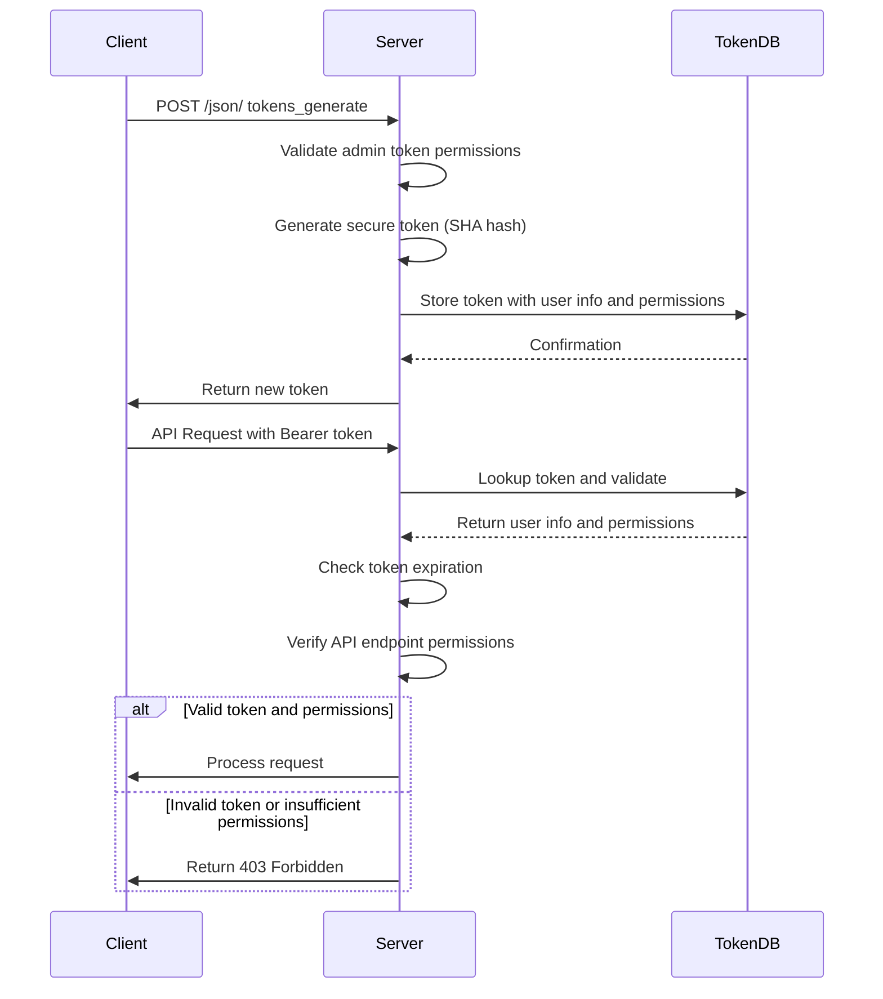

# Security and Authentication

<cite>
**Referenced Files in This Document**   
- [apiTokens.pl](file://src/apiTokens.pl)
- [tokens.pl](file://src/tokens.pl)
- [apiLog.pl](file://src/apiLog.pl)
- [restServer.pl](file://src/restServer.pl)
- [logging.pl](file://src/logging.pl)
- [.env-sample](file://.env-sample)
</cite>

## Table of Contents
1. [Token-Based Authentication System](#token-based-authentication-system)
2. [Access Control and User Permissions](#access-control-and-user-permissions)
3. [Token Generation, Validation, and Expiration](#token-generation-validation-and-expiration)
4. [Security Logging and Audit Capabilities](#security-logging-and-audit-capabilities)
5. [Security Configuration Options](#security-configuration-options)
6. [Secure API Usage Patterns](#secure-api-usage-patterns)
7. [Troubleshooting Authentication Issues](#troubleshooting-authentication-issues)
8. [Security Best Practices](#security-best-practices)

## Token-Based Authentication System

The timelink-kleio system implements a robust token-based authentication mechanism using API tokens to secure access to its REST and JSON-RPC endpoints. The authentication system is primarily managed through two core modules: `apiTokens.pl` and `tokens.pl`. These modules work together to generate, validate, and manage API tokens that are required for all incoming requests.

Authentication is enforced through the Bearer token scheme, where clients must include a valid token in the Authorization header of their HTTP requests in the format "Bearer TOKEN". The system validates these tokens on every request to ensure the client has the necessary permissions to perform the requested operation. The token serves as a key that maps to a specific user and their associated permissions, data directory, and structure directory.

The authentication flow begins when a client requests a new token by calling the `tokens_generate` endpoint with appropriate credentials and permissions. The system generates a cryptographically secure token using SHA hashing based on the username, timestamp, and a random number. This token is then stored in a persistent database along with the user's information and permissions. Subsequent requests use this token for authentication and authorization.

**Section sources**
- [apiTokens.pl](file://src/apiTokens.pl#L1-L125)
- [tokens.pl](file://src/tokens.pl#L1-L426)
- [restServer.pl](file://src/restServer.pl#L1-L800)

## Access Control and User Permissions

The timelink-kleio system implements a comprehensive access control mechanism that enforces permissions at the API endpoint level. Access control is managed through the token system, where each token is associated with a specific set of permissions that determine what operations the bearer can perform.

The permission system is defined in the `tokens.pl` module and is based on a list of allowed API endpoints. When a request is received, the system checks whether the token has permission to access the requested endpoint by calling the `is_api_allowed/2` predicate. This function verifies that the requested operation is included in the token's permission list before allowing the request to proceed.

The system supports a granular set of permissions that control access to different functionality:
- `files`: Download files (GET method only)
- `structures`: Download structure files (GET method only)
- `translations`: Translate files
- `upload`: Upload files (allows POST and PUT methods on files)
- `sources`: Search for source files
- `kleioset`: Get information on translation of a Kleio file
- `generate_token`: Generate tokens for new users
- `invalidate_token`: Revoke a specific token
- `invalidate_user`: Revoke all tokens associated with a user
- `token_info`: Return information associated with a token
- `delete`: Delete a file (allows DELETE method on files)
- `mkdir`: Create a directory
- `rmdir`: Remove a directory

The system also includes special administrative permissions that allow users to manage tokens and users. The KLEIO_ADMIN user has comprehensive permissions including the ability to generate and invalidate tokens, translate files, upload and delete files, and create and remove directories. This role-based access control ensures that users can only perform operations for which they have explicit permission.

**Section sources**
- [tokens.pl](file://src/tokens.pl#L49-L185)
- [apiTokens.pl](file://src/apiTokens.pl#L46-L68)
- [restServer.pl](file://src/restServer.pl#L590-L600)

## Token Generation, Validation, and Expiration

The token lifecycle in timelink-kleio consists of three main phases: generation, validation, and expiration. The system provides a comprehensive API for managing tokens through the `apiTokens.pl` and `tokens.pl` modules.

Token generation is handled by the `tokens_generate/3` predicate in `apiTokens.pl`, which serves as the entry point for REST calls related to token creation. When a client requests a new token, the system first verifies that the requesting token has the `generate_token` permission. The `generate_token/3` predicate in `tokens.pl` then creates a new token using a combination of the username, current timestamp, and a random number, which is hashed using SHA to produce a cryptographically secure token.

The token validation process occurs on every API request through the `decode_token/3` predicate. This function extracts the username and permissions associated with a token by looking up the token in the persistent database. The system automatically checks for token expiration during validation, ensuring that expired tokens cannot be used for authentication.

Token expiration is managed through the `life_span` parameter that can be specified when generating a token. The system tracks the creation time of each token and compares it against the current time to determine if the token has exceeded its lifespan. The `expired_token/1` predicate checks if a token has exceeded its life span and automatically removes expired tokens from the database. This automatic cleanup mechanism ensures that stale tokens do not accumulate in the system.

The system also provides mechanisms for token invalidation through the `tokens_invalidate/3` and `users_invalidate/3` predicates. These functions allow authorized users to revoke specific tokens or invalidate all tokens associated with a particular user, providing an important security control for managing access.

**Diagram sources**
- [apiTokens.pl](file://src/apiTokens.pl#L22-L28)
- [tokens.pl](file://src/tokens.pl#L104-L139)
- [tokens.pl](file://src/tokens.pl#L141-L147)

## Security Logging and Audit Capabilities

The timelink-kleio system includes comprehensive logging and audit capabilities through the `apiLog.pl` and `logging.pl` modules. These components provide detailed monitoring of system activity, security events, and API usage, enabling administrators to track and analyze system behavior.

The logging system supports multiple log levels including emergency, alert, critical, error, warning, notice, info, and debug. Administrators can configure the log level using the `set_log_level/1` predicate, which determines which messages are recorded based on their severity. The system writes logs to a file specified in the configuration, with the default location being `/kleio-home/system/conf/kleio/token_db`.

The `apiLog.pl` module provides a client-facing logging API that allows authorized users to send debug messages to the server logs. The `client_log/5` predicate requires the `files` privilege to execute, ensuring that only authorized users can generate log entries. This function accepts a message and log level parameter, allowing clients to specify the severity of the message being logged.

The audit capabilities are integrated throughout the system, with key security events automatically logged. Token generation, validation, and invalidation operations are logged with debug level, providing a complete audit trail of authentication activities. The system also logs API request details including the requesting user, token, and requested operation, enabling comprehensive monitoring of system usage.

The logging system is designed to be extensible, with the ability to output to different destinations including files and standard output. The `start_log/1` predicate initializes the logging system with a specified destination, while `stop_log/0` closes the current log file. This flexibility allows administrators to configure logging based on their specific security and monitoring requirements.

**Section sources**
- [apiLog.pl](file://src/apiLog.pl#L1-L36)
- [logging.pl](file://src/logging.pl#L1-L161)
- [tokens.pl](file://src/tokens.pl#L23-L47)

## Security Configuration Options

The timelink-kleio system provides several configuration options for security policies that can be set through environment variables or configuration files. These options allow administrators to customize the security behavior of the system to meet their specific requirements.

Token lifetime and expiration policies are configured through the `life_span` parameter when generating tokens. While the system does not have a global default token lifetime setting, administrators can specify the lifespan for each token during generation. This allows for flexible security policies where different tokens can have different expiration times based on their purpose and sensitivity.

The system supports token renewal strategies through the token invalidation and regeneration mechanisms. While there is no automated token renewal process, administrators can implement renewal by invalidating an existing token and generating a new one with updated permissions or expiration time. The bootstrap token mechanism provides an example of temporary token usage, where a short-lived token with `generate_token` permission is used to create longer-lived tokens and then automatically invalidated.

Security policies are also configured through environment variables defined in the `.env-sample` file. Key security-related variables include:
- `KLEIO_ADMIN_TOKEN`: Sets the administrative token with full privileges
- `KLEIO_CORS_SITES`: Configures cross-origin resource sharing policies
- `KLEIO_TOKEN_DB`: Specifies the path to the token database file
- `KLEIO_SERVER_PORT`: Sets the port on which the server listens
- `KLEIO_SERVER_WORKERS`: Configures the number of worker threads

The system also supports configuration of the token database location through the `KLEIO_TOKEN_DB` environment variable or by using the `attach_token_db/1` predicate to specify a custom database file. This allows administrators to control where authentication data is stored and implement appropriate security measures for the database file.

**Section sources**
- [.env-sample](file://.env-sample#L1-L119)
- [tokens.pl](file://src/tokens.pl#L59-L85)
- [restServer.pl](file://src/restServer.pl#L398-L406)

## Secure API Usage Patterns

The timelink-kleio system encourages secure API usage patterns through its design and implementation. The Postman collection provided in the repository demonstrates recommended patterns for interacting with the API securely.

The recommended authentication flow begins with obtaining an administrative token, either through the `KLEIO_ADMIN_TOKEN` environment variable or by using a bootstrap token. This administrative token is then used to generate user-specific tokens with the minimum necessary permissions. For example, a token for a user who only needs to translate files would be granted the `translations` and `sources` permissions but not `upload` or `delete` permissions.

API requests should always include the token in the Authorization header using the Bearer scheme rather than including it in the request body or URL parameters. This follows security best practices by keeping authentication credentials separate from the request data. The system supports both REST and JSON-RPC interfaces, with JSON-RPC being the preferred method for complex operations due to its structured request format.

When generating tokens, it is recommended to include descriptive comments and limit the token's permissions to only what is necessary for the intended use case. The system's support for relative paths for data and structure directories allows for secure isolation of user data, preventing unauthorized access to files outside designated directories.

Error handling should be implemented to gracefully handle authentication failures and permission errors. The system returns appropriate HTTP status codes and error messages that can be used to diagnose issues without revealing sensitive information about the system's internal state.

**Section sources**
- [api-postman/api-tests.postman_collection.json](file://api/postman/api-tests.postman_collection.json#L1-L200)
- [apiCommon.pl](file://src/apiCommon.pl#L1-L89)
- [restServer.pl](file://src/restServer.pl#L617-L624)

## Troubleshooting Authentication Issues

Common authentication issues in timelink-kleio typically fall into several categories: token generation failures, permission errors, and token expiration problems. Understanding these issues and their solutions is essential for maintaining system security and availability.

Token generation failures often occur when the requesting token does not have the `generate_token` permission. This can be resolved by ensuring that the administrative token is being used or that the requesting token has been granted the necessary permission. Another common issue is attempting to generate a token for a user who already has an active token, which results in an error. This can be resolved by first invalidating the existing token using the `invalidate_user` operation.

Permission errors occur when a token attempts to access an API endpoint for which it does not have permission. These errors are indicated by HTTP 403 Forbidden responses. To troubleshoot these issues, verify the token's permissions using the `get_token_options/2` predicate and ensure that the requested operation is included in the permission list. The system's logging capabilities can also be used to identify which permission is missing.

Token expiration issues can manifest as authentication failures even with valid token values. The system automatically removes expired tokens from the database, so attempting to use an expired token will result in an authentication error. To resolve this, generate a new token with an appropriate lifespan. The system's bootstrap token mechanism can be used to recover access if all tokens have expired, by setting the `KLEIO_ADMIN_TOKEN` environment variable.

When troubleshooting authentication issues, consult the system logs which contain detailed information about authentication attempts, including timestamps, requesting tokens, and the nature of any failures. The `print_server_config` predicate can also be used to verify the current security configuration, including the status of the token database and administrative token.

**Section sources**
- [tokens.pl](file://src/tokens.pl#L263-L281)
- [apiTokens.pl](file://src/apiTokens.pl#L76-L80)
- [restServer.pl](file://src/restServer.pl#L1413-L1538)

## Security Best Practices

To ensure the secure deployment and operation of timelink-kleio, several best practices should be followed. These practices address both configuration and operational aspects of system security.

For deployment, always set a strong `KLEIO_ADMIN_TOKEN` using a cryptographically secure random generator, such as the OpenSSL command suggested in the `.env-sample` file (`openssl rand -hex 20`). Never use the default empty value in production environments. The token database file should be protected with appropriate file system permissions to prevent unauthorized access or modification.

Implement the principle of least privilege when creating tokens, granting only the minimum permissions necessary for the intended use case. Avoid creating tokens with broad permissions like `generate_token` or `invalidate_token` unless absolutely necessary. Regularly review and clean up unused tokens to minimize the attack surface.

Enable comprehensive logging by setting an appropriate log level and ensuring that log files are stored securely with restricted access. Regularly monitor log files for suspicious activity, such as repeated authentication failures or unauthorized access attempts. Consider implementing log rotation and retention policies to manage storage requirements while maintaining an adequate audit trail.

Keep the system updated with the latest stable version to benefit from security patches and improvements. When deploying in a containerized environment, follow container security best practices, including using minimal base images, running containers with non-root users, and limiting container privileges.

For API usage, always use HTTPS in production environments to encrypt authentication tokens and sensitive data in transit. Implement proper error handling in client applications to avoid exposing sensitive information in error messages. Regularly rotate tokens, especially administrative tokens, to limit the potential impact of token compromise.

**Section sources**
- [.env-sample](file://.env-sample#L42-L46)
- [tokens.pl](file://src/tokens.pl#L44-L46)
- [restServer.pl](file://src/restServer.pl#L270-L292)