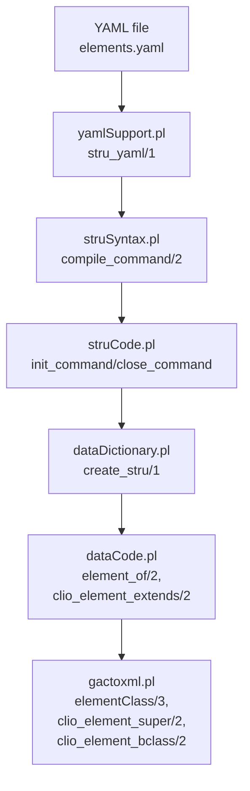
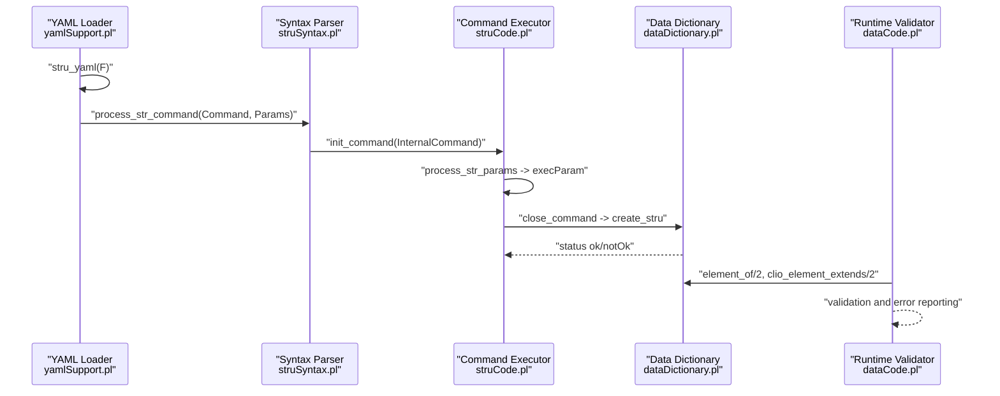
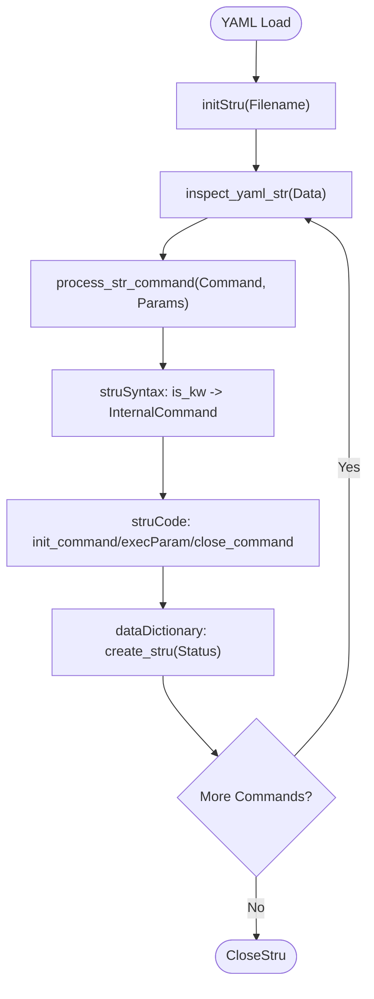
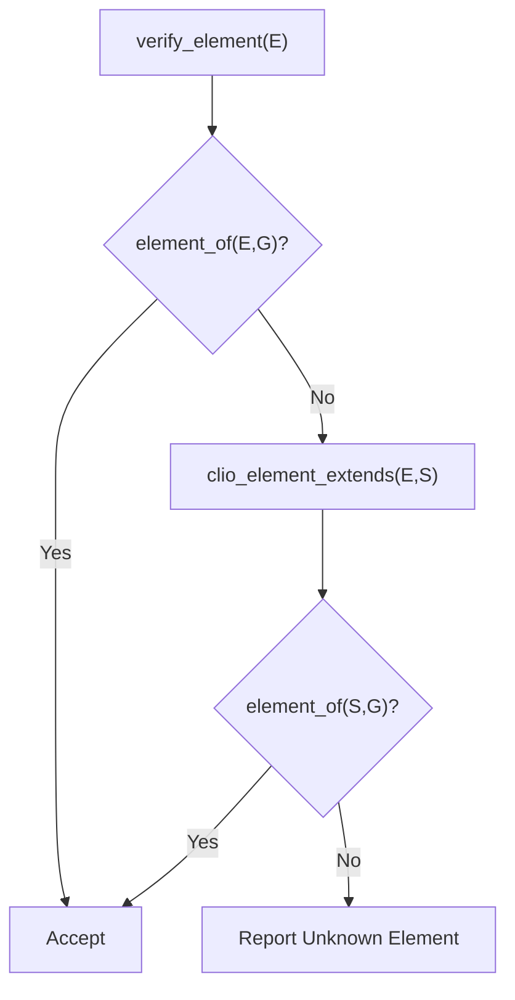
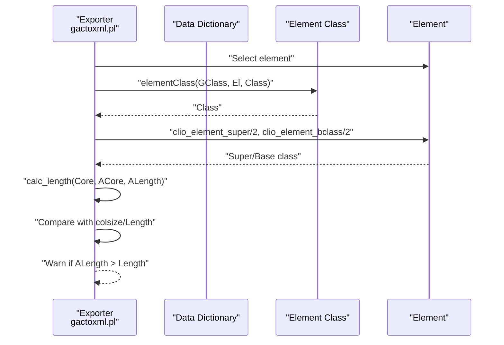
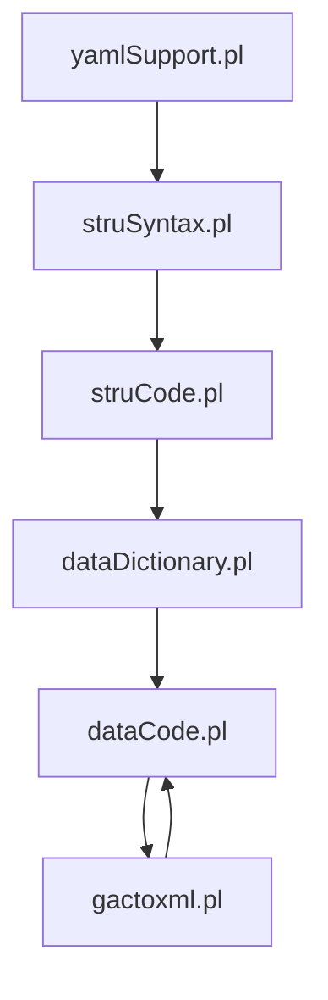

# Element Definitions

<cite>
**Referenced Files in This Document**
- [elements.yaml](file://src/stru/elements.yaml)
- [yamlSupport.pl](file://src/yamlSupport.pl)
- [struCode.pl](file://src/struCode.pl)
- [struSyntax.pl](file://src/struSyntax.pl)
- [dataCode.pl](file://src/dataCode.pl)
- [gactoxml.pl](file://src/gactoxml.pl)
- [externals.pl](file://src/externals.pl)
</cite>

## Table of Contents
1. [Introduction](#introduction)
2. [Project Structure](#project-structure)
3. [Core Components](#core-components)
4. [Architecture Overview](#architecture-overview)
5. [Detailed Component Analysis](#detailed-component-analysis)
6. [Dependency Analysis](#dependency-analysis)
7. [Performance Considerations](#performance-considerations)
8. [Troubleshooting Guide](#troubleshooting-guide)
9. [Conclusion](#conclusion)

## Introduction
This document explains how element definitions are specified and processed in the Kleio structure system. It focuses on the YAML-based schema definitions, the compilation pipeline from YAML to internal representations, and the runtime validation and inheritance mechanisms used by the processing engine. It covers:
- How elements are defined in elements.yaml, including element types, attributes, and relationships
- The YAML-to-internal compilation flow
- Validation logic, type checking, and constraint enforcement
- Element inheritance via source/specialization and reuse strategies
- Guidelines for designing reusable element definitions

## Project Structure
The element definition system centers around:
- A canonical set of base elements defined in YAML
- A YAML processor that translates YAML commands into internal structure definitions
- A syntax and code layer that validates and stores element definitions
- Runtime utilities that enforce element inheritance and validate usage

**Diagram sources**
- [elements.yaml](file://src/stru/elements.yaml#L1-L221)
- [yamlSupport.pl](file://src/yamlSupport.pl#L28-L69)
- [struSyntax.pl](file://src/struSyntax.pl#L48-L101)
- [struCode.pl](file://src/struCode.pl#L91-L118)
- [dataCode.pl](file://src/dataCode.pl#L312-L321)
- [gactoxml.pl](file://src/gactoxml.pl#L2455-L2485)

**Section sources**
- [elements.yaml](file://src/stru/elements.yaml#L1-L221)
- [yamlSupport.pl](file://src/yamlSupport.pl#L28-L69)
- [struSyntax.pl](file://src/struSyntax.pl#L48-L101)
- [struCode.pl](file://src/struCode.pl#L91-L118)

## Core Components
- elements.yaml: Defines the base element catalog with names, descriptions, and optional semantic markers (e.g., identification, source).
- yamlSupport.pl: Loads YAML structure files, normalizes paths, and dispatches commands to the structure compiler.
- struSyntax.pl: Provides the grammar and keyword mapping for structure commands and parameters.
- struCode.pl: Implements command execution, parameter handling, and completion checks for structure definitions.
- dataCode.pl: Enforces element validation against the current group context and supports element inheritance via source/specialization.
- gactoxml.pl: Exports element metadata and enforces constraints like database field lengths.

**Section sources**
- [elements.yaml](file://src/stru/elements.yaml#L39-L221)
- [yamlSupport.pl](file://src/yamlSupport.pl#L28-L69)
- [struSyntax.pl](file://src/struSyntax.pl#L124-L135)
- [struCode.pl](file://src/struCode.pl#L148-L280)
- [dataCode.pl](file://src/dataCode.pl#L298-L321)
- [gactoxml.pl](file://src/gactoxml.pl#L2455-L2485)

## Architecture Overview
The element definition lifecycle:
1. YAML file is loaded and parsed into a sequence of commands.
2. Each command is validated against the structure syntax and parameters.
3. Parameters are sanitized and stored as properties associated with the current command.
4. On command completion, the internal representation is finalized and persisted.
5. During runtime, element validation checks membership in the current group and supports inheritance via source/specialization.
6. Export and reporting utilities use element metadata to enforce constraints and produce diagnostics.

**Diagram sources**
- [yamlSupport.pl](file://src/yamlSupport.pl#L129-L137)
- [struSyntax.pl](file://src/struSyntax.pl#L77-L82)
- [struCode.pl](file://src/struCode.pl#L91-L118)
- [dataCode.pl](file://src/dataCode.pl#L312-L321)

## Detailed Component Analysis

### Element Definition Syntax and Categories
Elements in elements.yaml are defined as a list of element blocks. Each block specifies:
- name: Unique identifier for the element
- description: Human-readable description
- type: Optional type hint for downstream processing
- identification: Optional flag indicating this element carries entity identity
- source: Optional base element to specialize (inheritance)

Categories of elements:
- Simple elements: Basic data carriers (e.g., string types, numeric types, text).
- Compound elements: Logical aggregations of date parts (day, month, year) or composite identifiers.
- Reference elements: Pointers to entities or relations (e.g., id, same_as, xsame_as, entity, origin, destination).

Examples present in the base catalog:
- Simple: number, string64, string256, text
- Compound: day, month, year, date
- Identification and references: id, same_as, xsame_as, entity, origin, destination
- Standard: type, value, class, loc
- Text: obs, summary
- Source metadata: ref, page, pages
- Processing: replaces/replaces, inside
- Provenance: groupname, level, line, kleiofile

These definitions are the foundation for specialized element sets in domain-specific structures.

**Section sources**
- [elements.yaml](file://src/stru/elements.yaml#L39-L221)

### YAML to Internal Representation Compilation
The YAML loader reads a structure file and iterates through its commands:
- file: Sets metadata for the structure file (name, description).
- include: Includes another YAML structure file (with path normalization).
- Other commands: Mapped to internal Latin keywords and executed via struSyntax and struCode.

Key steps:
- stru_yaml/1 initializes processing and sets the current structure file.
- read_yaml_str/1 reads and inspects each command term.
- process_str_command/2 resolves the internal command and invokes struCode.
- process_str_params/2 sanitizes values and executes execParam for each parameter.
- prepend_if_member ensures deterministic ordering (e.g., source before name).

**Diagram sources**
- [yamlSupport.pl](file://src/yamlSupport.pl#L28-L69)
- [yamlSupport.pl](file://src/yamlSupport.pl#L129-L137)
- [struCode.pl](file://src/struCode.pl#L91-L118)

**Section sources**
- [yamlSupport.pl](file://src/yamlSupport.pl#L28-L69)
- [yamlSupport.pl](file://src/yamlSupport.pl#L129-L165)
- [struCode.pl](file://src/struCode.pl#L91-L118)

### Element Validation and Inheritance
Validation occurs during element usage:
- verify_element/1 checks whether an element belongs to the current group.
- velement/2 accepts direct membership or membership via inheritance through clio_element_extends/2.
- If invalid, an error is reported with context (line number and text).

Inheritance via source/specialization:
- Elements can declare a source to inherit semantics from a base element.
- During validation, an element E is considered valid if either:
  - E is declared in the current group, or
  - E specializes a base element S (via source), and S is declared in the current group.

**Diagram sources**
- [dataCode.pl](file://src/dataCode.pl#L298-L321)

**Section sources**
- [dataCode.pl](file://src/dataCode.pl#L298-L321)
- [externals.pl](file://src/externals.pl#L154-L188)

### Export-Time Constraints and Metadata
During export, element metadata is used to enforce constraints:
- elementClass/3 determines the target class for an element.
- clio_element_super/2 and clio_element_bclass/2 retrieve super and base classes.
- gactoxml.pl computes value lengths and compares against database column sizes to warn on truncation.

**Diagram sources**
- [gactoxml.pl](file://src/gactoxml.pl#L2455-L2485)

**Section sources**
- [gactoxml.pl](file://src/gactoxml.pl#L2455-L2485)

### Examples of Element Definitions from the Base Catalog
Below are representative definitions from the base elements.yaml, illustrating categories and properties:

- Simple elements
  - number: Numeric type for downstream mapping
  - string64: Short identifiers
  - string256: Names or short descriptions
  - text: Long free-form text

- Date-related elements
  - day, month, year: Numeric parts
  - date: String-like date with supported formats and ranges

- Identification and references
  - id: Entity identifier (identification: yes), sourced from string64
  - same_as: Local cross-file linking, sourced from string64
  - xsame_as: Cross-file linking, sourced from string64
  - entity, origin, destination: Relation pointers, sourced from string64

- Standard and descriptive elements
  - type, value, class, loc: Common semantic roles
  - name, description, destname: Person/object/event descriptors
  - sex: Gender indicator

- Text and provenance
  - obs, summary: Descriptive text
  - ref, page, pages: Archival reference metadata
  - replaces/replace: Replacement mapping, sourced from string64
  - inside: Containment relationship, sourced from string64
  - groupname, level, line, kleiofile: Source provenance

These definitions demonstrate:
- Naming conventions (lowercase, descriptive)
- Type hints for downstream processing
- Identification flags for identity-sensitive elements
- Source-based specialization for localization or readability

**Section sources**
- [elements.yaml](file://src/stru/elements.yaml#L39-L221)

### Guidelines for Reusable Element Definitions
- Prefer specialization via source to reuse base semantics while localizing naming.
- Use identification flags for elements intended to carry entity identity.
- Keep names concise and descriptive; align with domain semantics.
- Use type hints to guide downstream mapping and validation.
- Group related elements consistently across structures for maintainability.
- Leverage include to modularize shared definitions across projects.

## Dependency Analysis
The following diagram shows how the key modules depend on each other in the element definition and validation pipeline.

**Diagram sources**
- [yamlSupport.pl](file://src/yamlSupport.pl#L28-L69)
- [struSyntax.pl](file://src/struSyntax.pl#L48-L101)
- [struCode.pl](file://src/struCode.pl#L91-L118)
- [dataCode.pl](file://src/dataCode.pl#L298-L321)
- [gactoxml.pl](file://src/gactoxml.pl#L2455-L2485)

**Section sources**
- [yamlSupport.pl](file://src/yamlSupport.pl#L28-L69)
- [struSyntax.pl](file://src/struSyntax.pl#L48-L101)
- [struCode.pl](file://src/struCode.pl#L91-L118)
- [dataCode.pl](file://src/dataCode.pl#L298-L321)
- [gactoxml.pl](file://src/gactoxml.pl#L2455-L2485)

## Performance Considerations
- Validation via element_of/2 and clio_element_extends/2 is linear in the number of elements in the current group and the depth of inheritance.
- YAML loading and parameter processing are O(n) over the number of commands and parameters.
- Export-time length checks are O(m) per element, where m is the number of aspects (core/original/comment).

## Troubleshooting Guide
Common issues and resolutions:
- Unknown element in current group: The validator reports the group and element name along with the line context. Ensure the element is declared in the current group or that a source-based specialization is declared.
- Missing required parameters: check_complete/2 reports missing parameters for commands (e.g., nomen, primum). Add the required parameters to the YAML command.
- YAML path resolution: include_yaml_str/2 normalizes and resolves paths. Verify file paths and directory permissions.
- Export warnings for field length: gactoxml.pl warns when element values exceed database column sizes. Adjust element definitions or mapping constraints accordingly.

**Section sources**
- [dataCode.pl](file://src/dataCode.pl#L312-L321)
- [struCode.pl](file://src/struCode.pl#L306-L337)
- [yamlSupport.pl](file://src/yamlSupport.pl#L189-L192)
- [gactoxml.pl](file://src/gactoxml.pl#L2467-L2473)

## Conclusion
The Kleio element definition system provides a robust, extensible framework for specifying and validating elements in YAML-based structure files. Through inheritance via source, specialization, and strict validation, it enables consistent semantics across diverse schemas. The compilation pipeline from YAML to internal representations, coupled with export-time constraints, ensures reliable processing and mapping to downstream systems.