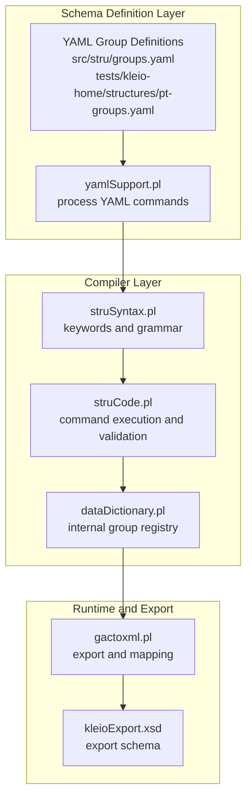
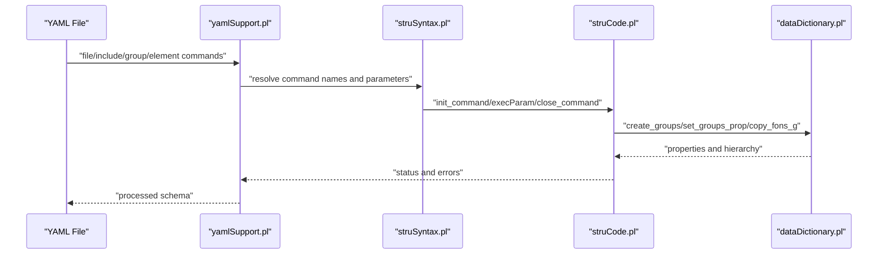
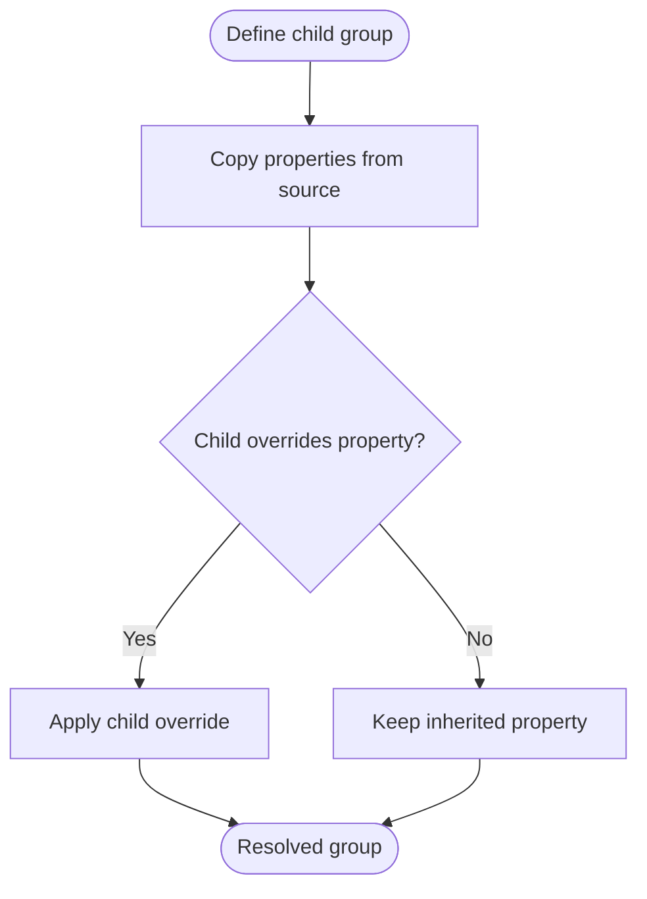
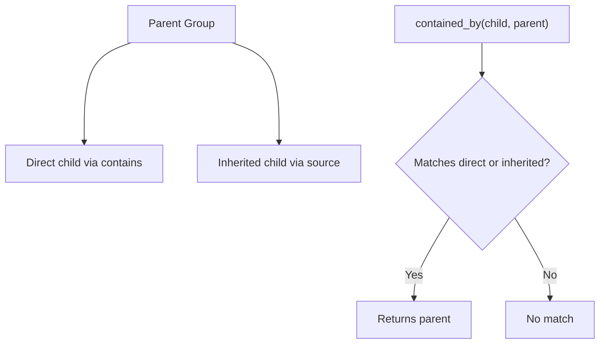
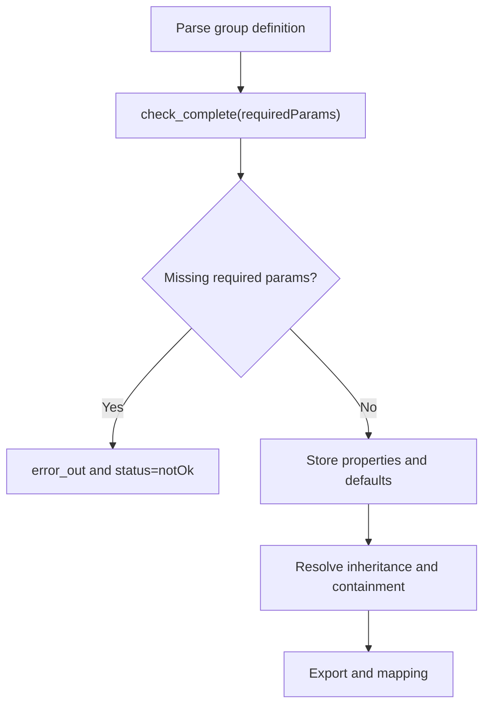
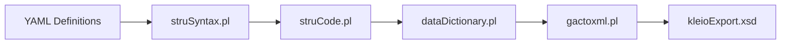

# Group Configurations

<cite>
**Referenced Files in This Document**
- [src/stru/groups.yaml](file://src/stru/groups.yaml)
- [tests/kleio-home/structures/pt-groups.yaml](file://tests/kleio-home/structures/pt-groups.yaml)
- [src/stru/elements.yaml](file://src/stru/elements.yaml)
- [src/struSyntax.pl](file://src/struSyntax.pl)
- [src/struCode.pl](file://src/struCode.pl)
- [src/dataDictionary.pl](file://src/dataDictionary.pl)
- [src/yamlSupport.pl](file://src/yamlSupport.pl)
- [src/gactoxml.pl](file://src/gactoxml.pl)
- [tests/stable/gactoxml.pl](file://tests/stable/gactoxml.pl)
- [tests/dev/gactoxml.pl](file://tests/dev/gactoxml.pl)
- [src/kleioExport.xsd](file://src/kleioExport.xsd)
- [tests/stable/kleioExport.xsd](file://tests/stable/kleioExport.xsd)
</cite>

## Update Summary
**Changes Made**
- Updated group composition syntax from 'part' to 'contains' throughout the documentation
- Added comprehensive coverage of new group types: event, entity, cevent, pevent, ulist, text, and source
- Enhanced element source corrections documentation (string64 → id)
- Expanded group description fields with proper documentation
- Updated containment relationships and inheritance patterns

## Table of Contents
1. [Introduction](#introduction)
2. [Project Structure](#project-structure)
3. [Core Components](#core-components)
4. [Architecture Overview](#architecture-overview)
5. [Detailed Component Analysis](#detailed-component-analysis)
6. [Dependency Analysis](#dependency-analysis)
7. [Performance Considerations](#performance-considerations)
8. [Troubleshooting Guide](#troubleshooting-guide)
9. [Conclusion](#conclusion)
10. [Appendices](#appendices)

## Introduction
This document explains how group configurations work in the Kleio structure system. Groups define modular schemas that organize related elements into cohesive units. They support inheritance, containment, and positional element registration, enabling reusable, extensible, and maintainable schema designs across diverse historical sources.

**Updated** Enhanced with new group types and improved syntax documentation reflecting the transition from 'part' to 'contains' for group composition.

## Project Structure
The group configuration system centers around:
- YAML-based group definitions that declare group metadata, element membership, and containment relationships
- A Prolog-based compiler that validates and materializes group definitions into an internal data dictionary
- Export and translation utilities that rely on group definitions to enforce constraints and produce structured outputs

**Diagram sources**
- [src/yamlSupport.pl](file://src/yamlSupport.pl#L28-L43)
- [src/struSyntax.pl](file://src/struSyntax.pl#L48-L101)
- [src/struCode.pl](file://src/struCode.pl#L105-L126)
- [src/dataDictionary.pl](file://src/dataDictionary.pl#L119-L125)
- [src/gactoxml.pl](file://src/gactoxml.pl#L2434-L2460)
- [src/kleioExport.xsd](file://src/kleioExport.xsd#L25-L50)

**Section sources**
- [src/stru/groups.yaml](file://src/stru/groups.yaml#L1-L31)
- [tests/kleio-home/structures/pt-groups.yaml](file://tests/kleio-home/structures/pt-groups.yaml#L1-L20)
- [src/yamlSupport.pl](file://src/yamlSupport.pl#L28-L43)

## Core Components
- Group definitions: Each group specifies identity, membership rules, containment, and inheritance.
- Membership keys:
  - guaranteed: required elements
  - also: optional elements
  - position: ordered elements for positional registration
  - arbitrary: elements allowed anywhere within the group
  - contains: child groups permitted inside this group (updated from 'part')
  - source: parent group to inherit properties from
  - idprefix: identifier prefix for instances of this group
- Compiler pipeline:
  - YAML parsing and command dispatch
  - Parameter validation and defaults
  - Property propagation and inheritance
  - Containment resolution and ancestor queries

**Updated** Enhanced documentation of group composition syntax, now using 'contains' instead of the deprecated 'part' keyword.

**Section sources**
- [src/stru/groups.yaml](file://src/stru/groups.yaml#L8-L30)
- [src/struSyntax.pl](file://src/struSyntax.pl#L124-L135)
- [src/struCode.pl](file://src/struCode.pl#L193-L236)
- [src/dataDictionary.pl](file://src/dataDictionary.pl#L160-L204)

## Architecture Overview
The group configuration architecture is a layered pipeline:
- YAML layer: declares groups and elements with metadata
- Syntax layer: maps YAML terms to internal commands and validates parameters
- Code layer: executes commands, sets properties, and manages defaults
- Dictionary layer: stores and resolves group hierarchies, containment, and inheritance
- Export layer: uses group definitions to generate structured outputs and validate constraints

**Diagram sources**
- [src/yamlSupport.pl](file://src/yamlSupport.pl#L129-L137)
- [src/struSyntax.pl](file://src/struSyntax.pl#L105-L121)
- [src/struCode.pl](file://src/struCode.pl#L193-L236)
- [src/dataDictionary.pl](file://src/dataDictionary.pl#L119-L125)

## Detailed Component Analysis

### Group Definition Syntax and Semantics
- Keys and roles:
  - name: group identity
  - description: human-readable documentation (enhanced with proper descriptions)
  - position: ordered elements enabling positional registration
  - guaranteed: required elements enforced at parse-time
  - also: optional elements
  - arbitrary: elements allowed anywhere
  - contains: child groups permitted inside (updated from 'part')
  - source: parent group for inheritance
  - idprefix: instance ID prefix
- Positional registration example:
  - When a group defines position, elements can be registered without explicit names in that order
  - Guaranteed elements must be present; optional elements may be omitted

**Updated** Improved documentation of group composition syntax, emphasizing the use of 'contains' over the deprecated 'part' keyword.

**Section sources**
- [src/stru/groups.yaml](file://src/stru/groups.yaml#L8-L30)
- [src/stru/groups.yaml](file://src/stru/groups.yaml#L13-L23)

### Inheritance and Source Propagation
- source establishes a parent-child relationship
- During compilation, properties from the source group are copied to the child unless overridden
- This enables modular reuse and extension of base schemas

**Diagram sources**
- [src/dataDictionary.pl](file://src/dataDictionary.pl#L166-L173)
- [src/struCode.pl](file://src/struCode.pl#L288-L293)

**Section sources**
- [src/stru/groups.yaml](file://src/stru/groups.yaml#L29-L30)
- [src/dataDictionary.pl](file://src/dataDictionary.pl#L166-L173)
- [src/struCode.pl](file://src/struCode.pl#L288-L293)

### Containment and Child Group Relationships
- contains defines which groups may appear inside another (updated from 'part')
- contained_by resolves direct and inherited containment relationships
- This supports hierarchical composition and modular schema design

**Updated** Clarified that 'contains' is the current syntax for defining child group relationships, replacing the older 'part' keyword.

**Diagram sources**
- [src/dataDictionary.pl](file://src/dataDictionary.pl#L160-L204)

**Section sources**
- [src/stru/groups.yaml](file://src/stru/groups.yaml#L28-L29)
- [src/dataDictionary.pl](file://src/dataDictionary.pl#L160-L204)

### Element Membership Strategies
- guaranteed: mandatory elements enforced during parsing
- also: optional elements that may be omitted
- position: ordered elements for positional registration
- arbitrary: elements allowed anywhere within the group
- These strategies enable flexible, robust schema designs that adapt to varying data formats

**Section sources**
- [src/stru/groups.yaml](file://src/stru/groups.yaml#L24-L26)
- [src/stru/groups.yaml](file://src/stru/groups.yaml#L12-L13)

### Group Types and Patterns
- Mandatory groups: require guaranteed elements
- Optional groups: rely on also elements
- Conditional groups: leverage arbitrary elements for flexible composition
- Hierarchical groups: extend base groups via source to inherit and refine properties

**Updated** Added comprehensive coverage of new group types including event, entity, cevent, pevent, ulist, text, and source groups.

Examples from the codebase:
- Base groups define core schemas (e.g., historical-source, person, object)
- National/custom groups extend base groups (e.g., Portuguese-specific groups)
- New specialized groups: event (general events), entity (core entity type), cevent (chronology events), pevent (personal events), ulist (unique lists), text (text recording), source (historical source alias)

**Section sources**
- [src/stru/groups.yaml](file://src/stru/groups.yaml#L32-L39)
- [tests/kleio-home/structures/pt-groups.yaml](file://tests/kleio-home/structures/pt-groups.yaml#L21-L48)
- [tests/kleio-home/structures/pt-groups.yaml](file://tests/kleio-home/structures/pt-groups.yaml#L51-L59)

### Validation Rules and Constraint Enforcement
- Required parameters are enforced during command completion
- Missing parameters trigger errors and mark the command as notOk
- Positional registration enforces ordering constraints
- Containment and inheritance rules are validated during schema processing

**Diagram sources**
- [src/struCode.pl](file://src/struCode.pl#L306-L337)
- [src/struSyntax.pl](file://src/struSyntax.pl#L105-L121)

**Section sources**
- [src/struCode.pl](file://src/struCode.pl#L306-L337)
- [src/struSyntax.pl](file://src/struSyntax.pl#L105-L121)

### Modular Schema Design and Reusability
- Inheritance allows extending base schemas without duplicating definitions
- Containment enables hierarchical composition of groups
- Positional registration simplifies common patterns
- Arbitrary elements support variability across datasets

**Updated** Enhanced documentation of modular design patterns with new group types and improved containment relationships.

**Section sources**
- [src/stru/groups.yaml](file://src/stru/groups.yaml#L27-L30)
- [src/stru/groups.yaml](file://src/stru/groups.yaml#L12-L13)

### Group Inheritance, Nested Structures, and Dynamic Composition
- Inheritance: child groups inherit properties from parents; overrides apply where specified
- Nested structures: contains defines allowable children; contained_by resolves relationships
- Dynamic composition: arbitrary elements permit flexible element placement within groups

**Updated** Comprehensive coverage of new group types and their inheritance patterns, including specialized event and entity groups.

**Section sources**
- [src/dataDictionary.pl](file://src/dataDictionary.pl#L160-L204)
- [src/stru/groups.yaml](file://src/stru/groups.yaml#L27-L30)

### Element Source Corrections and Type Safety
**Updated** Added documentation for element source corrections, particularly the transition from string64 to id for identifier elements.

- Element source corrections:
  - string64 → id for entity identifiers (proper type safety)
  - string256 → string64 for URL patterns and similar elements
  - Enhanced type safety across element definitions
- Type hierarchy improvements:
  - id inherits from string64 for consistent identifier handling
  - same_as, xsame_as, entity, origin, destination inherit from id
  - Proper source chain ensures consistent processing

**Section sources**
- [src/stru/elements.yaml](file://src/stru/elements.yaml#L87-L125)
- [src/stru/groups.yaml](file://src/stru/groups.yaml#L196-L202)

### Guidelines for Effective Group Organization
- Naming conventions:
  - Use descriptive, consistent names aligned with domain semantics
  - Prefer hierarchical names that reflect containment relationships
- Group organization:
  - Define minimal base groups with shared properties
  - Extend via source to specialize behavior
  - Use contains to express composition (updated syntax)
- Membership strategies:
  - Use guaranteed for strict requirements
  - Use also for optional flexibility
  - Use position for common, ordered registrations
  - Use arbitrary for variable element placement
- Maintenance:
  - Keep inheritance shallow to reduce complexity
  - Document source relationships and rationale
  - Validate frequently against representative datasets
- New group types:
  - Leverage event, entity, cevent, pevent for specialized use cases
  - Use ulist for unique entity collections
  - Apply text for original text preservation
  - Utilize source as historical-source alias

**Updated** Added guidelines for working with new group types and updated syntax requirements.

## Dependency Analysis
Group configurations depend on:
- YAML definitions for schema declarations
- Syntax and code layers for parameter validation and defaults
- Data dictionary for property storage and hierarchy resolution
- Export utilities for mapping and validation

**Diagram sources**
- [src/yamlSupport.pl](file://src/yamlSupport.pl#L129-L137)
- [src/struSyntax.pl](file://src/struSyntax.pl#L105-L121)
- [src/struCode.pl](file://src/struCode.pl#L193-L236)
- [src/dataDictionary.pl](file://src/dataDictionary.pl#L119-L125)
- [src/gactoxml.pl](file://src/gactoxml.pl#L2434-L2460)
- [src/kleioExport.xsd](file://src/kleioExport.xsd#L25-L50)

**Section sources**
- [src/yamlSupport.pl](file://src/yamlSupport.pl#L28-L43)
- [src/struCode.pl](file://src/struCode.pl#L105-L126)
- [src/dataDictionary.pl](file://src/dataDictionary.pl#L119-L125)

## Performance Considerations
- Inheritance and containment resolution are performed during schema processing; keep hierarchies shallow for faster lookups
- Positional element registration reduces ambiguity and speeds parsing for common patterns
- Avoid excessive use of arbitrary elements to maintain predictable validation costs
- New group types (event, entity, cevent, pevent) provide specialized processing paths for improved performance

**Updated** Added performance considerations for new group types and their optimized processing paths.

## Troubleshooting Guide
Common issues and resolutions:
- Missing required parameters:
  - Symptom: parse errors indicating missing parameters
  - Resolution: ensure requiredParams are present in group definitions
- Unknown parameters or commands:
  - Symptom: errors about bad parameters or unknown commands
  - Resolution: verify parameter names and command spelling against supported keywords
- Circular inheritance or containment:
  - Symptom: unexpected behavior or resolution failures
  - Resolution: review source and contains relationships to eliminate cycles
- Positional registration mismatches:
  - Symptom: errors when positional elements are not in the expected order
  - Resolution: align element order with the group's position specification
- Syntax errors with 'contains' vs 'part':
  - Symptom: errors about unknown 'part' parameter
  - Resolution: use 'contains' instead of the deprecated 'part' keyword
- Element source type errors:
  - Symptom: type mismatch errors for identifier elements
  - Resolution: ensure elements inherit from proper base types (id, string64, string256)

**Updated** Added troubleshooting guidance for new syntax requirements and element type corrections.

**Section sources**
- [src/struCode.pl](file://src/struCode.pl#L306-L337)
- [src/struSyntax.pl](file://src/struSyntax.pl#L105-L121)
- [src/struSyntax.pl](file://src/struSyntax.pl#L114-L121)

## Conclusion
Group configurations in Kleio provide a powerful, extensible mechanism for organizing schema definitions. Through inheritance, containment, and flexible membership strategies, schemas become modular, reusable, and maintainable. The enhanced group types (event, entity, cevent, pevent, ulist, text, source) and improved syntax (contains instead of part) enable more precise and maintainable schema designs. Proper use of guaranteed, also, position, and arbitrary elements ensures robust validation and adaptable data modeling across diverse historical sources.

**Updated** Enhanced conclusion reflecting the improved group system with new types, corrected syntax, and better type safety.

## Appendices

### Appendix A: Example Group Definitions
- Core groups: define foundational schemas (e.g., historical-source, person, object)
- National/custom groups: extend core groups for specific domains (e.g., Portuguese groups)
- New specialized groups: event, entity, cevent, pevent, ulist, text, source for enhanced functionality

**Updated** Added comprehensive coverage of new group types and their applications.

**Section sources**
- [src/stru/groups.yaml](file://src/stru/groups.yaml#L32-L39)
- [tests/kleio-home/structures/pt-groups.yaml](file://tests/kleio-home/structures/pt-groups.yaml#L21-L48)

### Appendix B: Export and Mapping References
- Export utilities rely on group definitions to generate structured outputs and validate constraints
- Export schema defines the structure of exported artifacts

**Section sources**
- [src/gactoxml.pl](file://src/gactoxml.pl#L2434-L2460)
- [tests/stable/gactoxml.pl](file://tests/stable/gactoxml.pl#L2408-L2440)
- [tests/dev/gactoxml.pl](file://tests/dev/gactoxml.pl#L2428-L2460)
- [src/kleioExport.xsd](file://src/kleioExport.xsd#L25-L50)
- [tests/stable/kleioExport.xsd](file://tests/stable/kleioExport.xsd#L25-L50)

### Appendix C: New Group Types and Their Applications
**New** Comprehensive documentation of newly added group types:

- **event**: General-purpose event recording for informal historical accounts
- **entity**: Core entity type serving as foundation for person, object, geoentity
- **cevent**: Chronology event for chronological transcriptions
- **pevent**: Personal event contained within persons/objects
- **ulist**: Unique entity lists for prosopographies and biographical dictionaries
- **text**: Original text preservation with triple-quote support
- **source**: Historical-source alias for simplified usage

**Section sources**
- [src/stru/groups.yaml](file://src/stru/groups.yaml#L69-L300)
- [src/stru/groups.yaml](file://src/stru/groups.yaml#L357-L525)