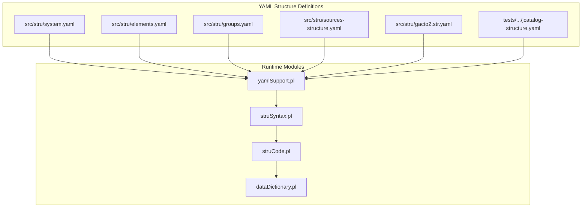
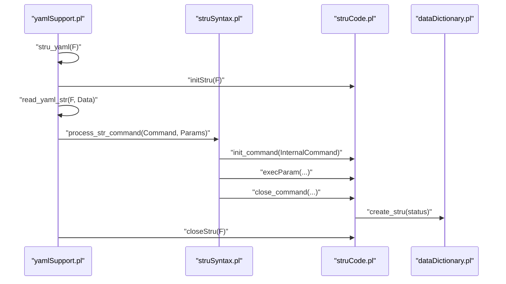
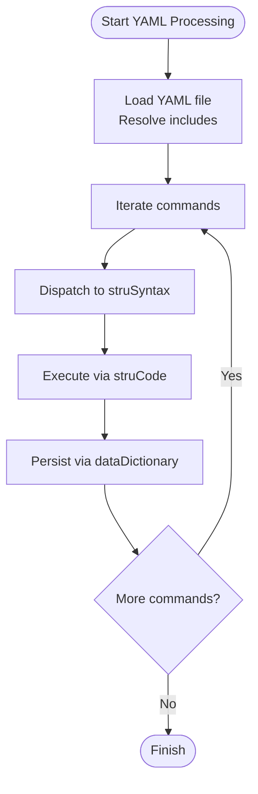
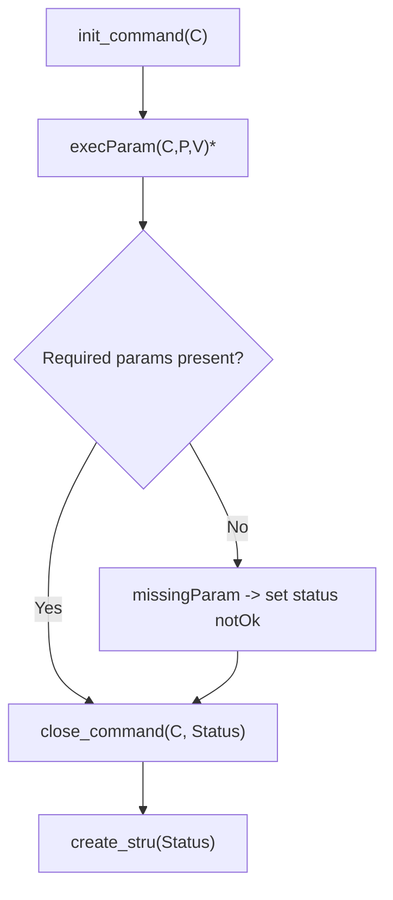
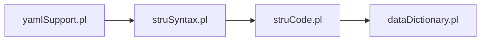

# Structure Definition System

<cite>
**Referenced Files in This Document**
- [system.yaml](file://src/stru/system.yaml)
- [elements.yaml](file://src/stru/elements.yaml)
- [groups.yaml](file://src/stru/groups.yaml)
- [sources-structure.yaml](file://src/stru/sources-structure.yaml)
- [gacto2.str.yaml](file://src/stru/gacto2.str.yaml)
- [jcatalog-structure.yaml](file://tests/kleio-home/sources/reference_sources/yaml/jcatalog-structure.yaml)
- [pt-groups.kleio](file://tests/kleio-home/sources/reference_sources/yaml/pt-groups.kleio)
- [README.md](file://src/stru/README.md)
- [struCode.pl](file://src/struCode.pl)
- [struSyntax.pl](file://src/struSyntax.pl)
- [yamlSupport.pl](file://src/yamlSupport.pl)
- [dataDictionary.pl](file://src/dataDictionary.pl)
</cite>

## Table of Contents
1. [Introduction](#introduction)
2. [Project Structure](#project-structure)
3. [Core Components](#core-components)
4. [Architecture Overview](#architecture-overview)
5. [Detailed Component Analysis](#detailed-component-analysis)
6. [Dependency Analysis](#dependency-analysis)
7. [Performance Considerations](#performance-considerations)
8. [Troubleshooting Guide](#troubleshooting-guide)
9. [Conclusion](#conclusion)
10. [Appendices](#appendices)

## Introduction
This document explains the Structure Definition System used by Kleio to model and validate data schemas for historical documents. The system defines:
- Global settings via system.yaml
- Reusable element definitions via elements.yaml
- Grouping of elements via groups.yaml
- YAML-based structure files that declare elements, groups, and relationships
- A compilation pipeline that transforms YAML definitions into internal structure representations

It covers syntax for element types, attributes, relationships, validation constraints, inheritance, reuse, and advanced topics such as conditional validation, dynamic definitions, and versioning. Practical examples are drawn from the repository’s YAML structure files.

## Project Structure
The Structure Definition System centers around a small set of YAML files and supporting Prolog modules that parse, validate, and materialize structure definitions into an internal schema.

**Diagram sources**
- [system.yaml](file://src/stru/system.yaml#L1-L4)
- [elements.yaml](file://src/stru/elements.yaml#L1-L221)
- [groups.yaml](file://src/stru/groups.yaml#L1-L259)
- [sources-structure.yaml](file://src/stru/sources-structure.yaml#L1-L800)
- [gacto2.str.yaml](file://src/stru/gacto2.str.yaml#L1-L800)
- [jcatalog-structure.yaml](file://tests/kleio-home/sources/reference_sources/yaml/jcatalog-structure.yaml#L1-L66)
- [yamlSupport.pl](file://src/yamlSupport.pl#L28-L43)
- [struSyntax.pl](file://src/struSyntax.pl#L48-L58)
- [struCode.pl](file://src/struCode.pl#L64-L82)
- [dataDictionary.pl](file://src/dataDictionary.pl#L118-L126)

**Section sources**
- [README.md](file://src/stru/README.md#L1-L4)
- [system.yaml](file://src/stru/system.yaml#L1-L4)
- [elements.yaml](file://src/stru/elements.yaml#L1-L221)
- [groups.yaml](file://src/stru/groups.yaml#L1-L259)

## Core Components
- system.yaml: Declares global includes for groups and elements, forming the base schema.
- elements.yaml: Defines reusable element templates (types, identifiers, locations, dates, relations, metadata).
- groups.yaml: Defines hierarchical groups (entities, acts, events, attributes, relations) and their composition rules (position, guaranteed, also, arbitrary, part, source).
- YAML structure files: Define concrete schemas by declaring elements and groups, often inheriting from base definitions.
- yamlSupport.pl: Loads YAML, resolves includes, and dispatches commands to the syntax/semantic engine.
- struSyntax.pl: Lexical and syntactic layer for structure commands and parameters.
- struCode.pl: Executes command semantics, enforces completeness, and builds internal properties.
- dataDictionary.pl: Stores and exposes the compiled structure (groups, elements, containment, defaults).

**Section sources**
- [system.yaml](file://src/stru/system.yaml#L1-L4)
- [elements.yaml](file://src/stru/elements.yaml#L39-L221)
- [groups.yaml](file://src/stru/groups.yaml#L32-L259)
- [yamlSupport.pl](file://src/yamlSupport.pl#L28-L43)
- [struSyntax.pl](file://src/struSyntax.pl#L48-L58)
- [struCode.pl](file://src/struCode.pl#L64-L82)
- [dataDictionary.pl](file://src/dataDictionary.pl#L118-L126)

## Architecture Overview
The compilation pipeline converts YAML structure definitions into an internal representation:

**Diagram sources**
- [yamlSupport.pl](file://src/yamlSupport.pl#L28-L43)
- [struSyntax.pl](file://src/struSyntax.pl#L48-L58)
- [struCode.pl](file://src/struCode.pl#L64-L82)
- [dataDictionary.pl](file://src/dataDictionary.pl#L118-L126)

## Detailed Component Analysis

### YAML Structure Definition Format
- Root-level directives:
  - file: Provides metadata for the structure file (name, description).
  - include: References other YAML files (e.g., system.yaml includes groups.yaml and elements.yaml).
- Element declarations:
  - name: Unique identifier for the element.
  - description: Human-readable description.
  - source: Inherits behavior/type from another element.
  - type: Type category (e.g., lingua, tempora, numerus, condicio, situs, relatio).
  - identification: Marks an element as an identifier (sic/non).
  - prefix/suffix: Flags for output formatting.
- Group declarations:
  - name: Unique identifier for the group.
  - description: Human-readable description.
  - source: Extends another group; properties are inherited and overridden.
  - position: Ordered positional elements for compact notation.
  - guaranteed: Required elements for completeness.
  - also: Optional elements allowed in addition to position.
  - arbitrary: Allows repeated instances of listed child groups.
  - part: Static containment of child groups.
  - idprefix: Prefix for generated IDs within the group.

Examples in the repository:
- Base includes and element templates: [system.yaml](file://src/stru/system.yaml#L1-L4), [elements.yaml](file://src/stru/elements.yaml#L39-L221)
- Core groups and inheritance: [groups.yaml](file://src/stru/groups.yaml#L32-L259)
- Generated structure snapshots: [sources-structure.yaml](file://src/stru/sources-structure.yaml#L1-L800), [gacto2.str.yaml](file://src/stru/gacto2.str.yaml#L1-L800)
- Domain-specific structure: [jcatalog-structure.yaml](file://tests/kleio-home/sources/reference_sources/yaml/jcatalog-structure.yaml#L1-L66)

**Section sources**
- [system.yaml](file://src/stru/system.yaml#L1-L4)
- [elements.yaml](file://src/stru/elements.yaml#L39-L221)
- [groups.yaml](file://src/stru/groups.yaml#L32-L259)
- [sources-structure.yaml](file://src/stru/sources-structure.yaml#L1-L800)
- [gacto2.str.yaml](file://src/stru/gacto2.str.yaml#L1-L800)
- [jcatalog-structure.yaml](file://tests/kleio-home/sources/reference_sources/yaml/jcatalog-structure.yaml#L1-L66)

### Compilation Pipeline
- YAML loading and includes:
  - yamlSupport.pl reads YAML, logs inclusion depth, and prevents cycles.
  - Includes are resolved relative to the including file’s directory.
- Command dispatch:
  - struSyntax.pl lexes and validates commands and parameters against keyword mappings.
  - struCode.pl executes semantic actions, enforces required parameters, and stores properties.
- Internal representation:
  - dataDictionary.pl persists groups and elements, computes containment, and exposes queries.

**Diagram sources**
- [yamlSupport.pl](file://src/yamlSupport.pl#L46-L68)
- [struSyntax.pl](file://src/struSyntax.pl#L48-L58)
- [struCode.pl](file://src/struCode.pl#L104-L118)
- [dataDictionary.pl](file://src/dataDictionary.pl#L118-L126)

**Section sources**
- [yamlSupport.pl](file://src/yamlSupport.pl#L28-L43)
- [struSyntax.pl](file://src/struSyntax.pl#L48-L58)
- [struCode.pl](file://src/struCode.pl#L64-L82)
- [dataDictionary.pl](file://src/dataDictionary.pl#L118-L126)

### Inheritance and Reuse Patterns
- Element specialization:
  - Use source to inherit type and behavior from base elements (e.g., Portuguese variants of generic elements).
- Group extension:
  - Use source to extend core groups; properties are copied and overridden.
  - part and arbitrary define containment and repetition rules.
- ID generation:
  - idprefix on groups controls auto-generated IDs for entities.

Example references:
- Element specialization: [elements.yaml](file://src/stru/elements.yaml#L33-L35)
- Group inheritance: [groups.yaml](file://src/stru/groups.yaml#L69-L71), [groups.yaml](file://src/stru/groups.yaml#L149-L149)
- Containment and repetition: [groups.yaml](file://src/stru/groups.yaml#L136-L137), [groups.yaml](file://src/stru/groups.yaml#L144-L145)

**Section sources**
- [elements.yaml](file://src/stru/elements.yaml#L33-L35)
- [groups.yaml](file://src/stru/groups.yaml#L69-L71)
- [groups.yaml](file://src/stru/groups.yaml#L136-L145)

### Validation Logic and Completeness
- Required parameters:
  - struCode.pl enforces required parameters per command (e.g., nomen, primum for nomino; nomen for pars and terminus).
- Completeness checks:
  - check_complete marks commands as ok/notOk and attaches status to names.
- Parameter validation:
  - struSyntax.pl validates parameter names and values, including keyword mappings and typed values.

**Diagram sources**
- [struCode.pl](file://src/struCode.pl#L91-L118)
- [struCode.pl](file://src/struCode.pl#L306-L321)
- [struSyntax.pl](file://src/struSyntax.pl#L124-L135)

**Section sources**
- [struCode.pl](file://src/struCode.pl#L306-L321)
- [struSyntax.pl](file://src/struSyntax.pl#L124-L135)

### Advanced Topics

#### Conditional Validation and Dynamic Definitions
- Position and guaranteed:
  - position enables compact notation; guaranteed ensures presence for completeness.
- Arbitrary and part:
  - arbitrary allows repeated child groups; part declares static containment.
- Dynamic element definitions:
  - YAML supports adding new elements and groups dynamically; inheritance via source preserves behavior.

References:
- [groups.yaml](file://src/stru/groups.yaml#L13-L28)
- [groups.yaml](file://src/stru/groups.yaml#L136-L137)
- [groups.yaml](file://src/stru/groups.yaml#L144-L145)

**Section sources**
- [groups.yaml](file://src/stru/groups.yaml#L13-L28)
- [groups.yaml](file://src/stru/groups.yaml#L136-L145)

#### Structure Versioning
- The system does not define explicit version fields in the analyzed files.
- Recommendations:
  - Add a version field in the file block.
  - Use include to compose major/minor versions.
  - Maintain backward-compatible extensions via source inheritance.

[No sources needed since this section provides general guidance]

#### Creating Custom Structure Definitions
- Start from system.yaml and include groups.yaml and elements.yaml.
- Define domain-specific groups with source to reuse core semantics.
- Use position, guaranteed, also, arbitrary, and part to model document structure.
- Add elements with source to specialize base types.

References:
- [system.yaml](file://src/stru/system.yaml#L1-L4)
- [groups.yaml](file://src/stru/groups.yaml#L32-L259)
- [elements.yaml](file://src/stru/elements.yaml#L39-L221)

**Section sources**
- [system.yaml](file://src/stru/system.yaml#L1-L4)
- [groups.yaml](file://src/stru/groups.yaml#L32-L259)
- [elements.yaml](file://src/stru/elements.yaml#L39-L221)

### Example Structures from the Codebase
- Historical source modeling:
  - Base groups and elements: [groups.yaml](file://src/stru/groups.yaml#L32-L149), [elements.yaml](file://src/stru/elements.yaml#L39-L221)
  - Generated snapshot: [sources-structure.yaml](file://src/stru/sources-structure.yaml#L207-L290)
- GActo2 structure:
  - Generated snapshot: [gacto2.str.yaml](file://src/stru/gacto2.str.yaml#L209-L292)
- Domain-specific catalog structure:
  - [jcatalog-structure.yaml](file://tests/kleio-home/sources/reference_sources/yaml/jcatalog-structure.yaml#L6-L62)

**Section sources**
- [groups.yaml](file://src/stru/groups.yaml#L32-L149)
- [elements.yaml](file://src/stru/elements.yaml#L39-L221)
- [sources-structure.yaml](file://src/stru/sources-structure.yaml#L207-L290)
- [gacto2.str.yaml](file://src/stru/gacto2.str.yaml#L209-L292)
- [jcatalog-structure.yaml](file://tests/kleio-home/sources/reference_sources/yaml/jcatalog-structure.yaml#L6-L62)

## Dependency Analysis
The runtime modules depend on each other in a layered fashion: yamlSupport orchestrates YAML processing, struSyntax handles syntax, struCode executes semantics, and dataDictionary persists the schema.

**Diagram sources**
- [yamlSupport.pl](file://src/yamlSupport.pl#L28-L43)
- [struSyntax.pl](file://src/struSyntax.pl#L48-L58)
- [struCode.pl](file://src/struCode.pl#L64-L82)
- [dataDictionary.pl](file://src/dataDictionary.pl#L118-L126)

**Section sources**
- [yamlSupport.pl](file://src/yamlSupport.pl#L28-L43)
- [struSyntax.pl](file://src/struSyntax.pl#L48-L58)
- [struCode.pl](file://src/struCode.pl#L64-L82)
- [dataDictionary.pl](file://src/dataDictionary.pl#L118-L126)

## Performance Considerations
- YAML includes are logged with indentation to reflect nesting; deep include chains increase processing time.
- The system avoids redundant processing by tracking already-read files and issuing warnings for duplicates.
- Internal caching of containment relationships reduces repeated inference overhead.

[No sources needed since this section provides general guidance]

## Troubleshooting Guide
- Unknown command or parameter:
  - struSyntax.pl reports syntax errors with file, line number, and line text.
- Missing required parameters:
  - struCode.pl emits errors for missing required parameters and marks commands notOk.
- Out-of-context commands:
  - yamlSupport.pl detects misuse of file/description outside the file block and reports errors with context.

**Section sources**
- [struSyntax.pl](file://src/struSyntax.pl#L52-L58)
- [struCode.pl](file://src/struCode.pl#L323-L337)
- [yamlSupport.pl](file://src/yamlSupport.pl#L139-L147)

## Conclusion
The Structure Definition System provides a robust, extensible framework for modeling historical document schemas in Kleio. By combining YAML-based definitions with a clear compilation pipeline, it supports inheritance, reuse, validation, and dynamic composition. The analyzed files demonstrate how to define elements, groups, and relationships, and how to extend core schemas for domain-specific needs.

## Appendices

### Appendix A: Command and Parameter Reference
- Commands:
  - file, include, group, element (mapped to Latin/English keywords)
- Parameters:
  - nomen, primum, modus, antiquum, scribe, plures, identificatio, nota (for nomino)
  - nomen, ordo, sequentia, identificatio, signum, fons, prae, post, locus, ceteri, certe, pars, solum, semper, repetitio (for pars)
  - nomen, modus, primum, secundum, ordo, fons, prae, post, pars, sine, signa, forma, ceteri, identificatio, cumule, solum (for terminus)
  - nomen (for exitus)

**Section sources**
- [struSyntax.pl](file://src/struSyntax.pl#L124-L135)

### Appendix B: Example Usage Patterns
- Base schema composition:
  - [system.yaml](file://src/stru/system.yaml#L1-L4)
- Element specialization:
  - [elements.yaml](file://src/stru/elements.yaml#L33-L35)
- Group extension and containment:
  - [groups.yaml](file://src/stru/groups.yaml#L69-L71), [groups.yaml](file://src/stru/groups.yaml#L136-L145)
- Domain-specific structure:
  - [jcatalog-structure.yaml](file://tests/kleio-home/sources/reference_sources/yaml/jcatalog-structure.yaml#L6-L62)

**Section sources**
- [system.yaml](file://src/stru/system.yaml#L1-L4)
- [elements.yaml](file://src/stru/elements.yaml#L33-L35)
- [groups.yaml](file://src/stru/groups.yaml#L69-L71)
- [groups.yaml](file://src/stru/groups.yaml#L136-L145)
- [jcatalog-structure.yaml](file://tests/kleio-home/sources/reference_sources/yaml/jcatalog-structure.yaml#L6-L62)