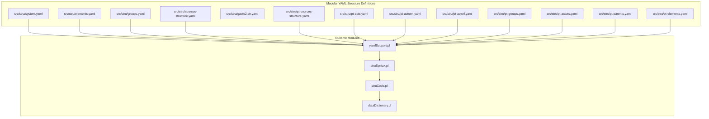
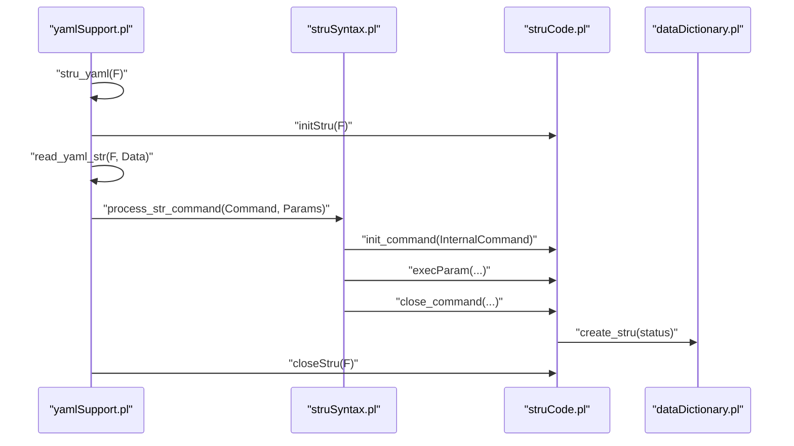
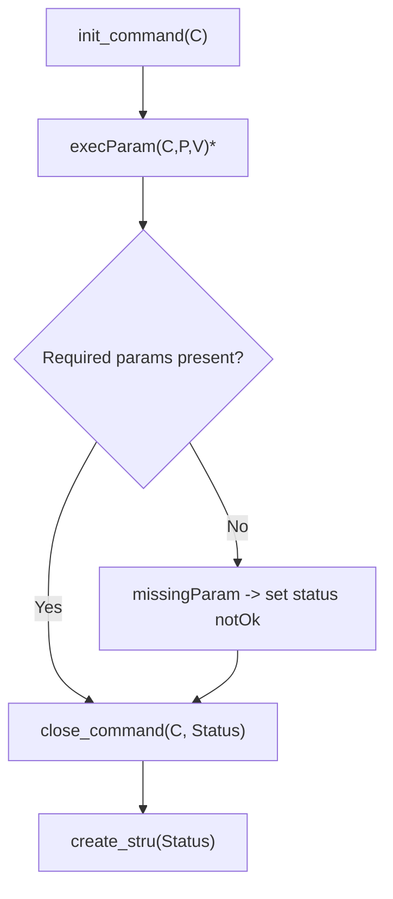
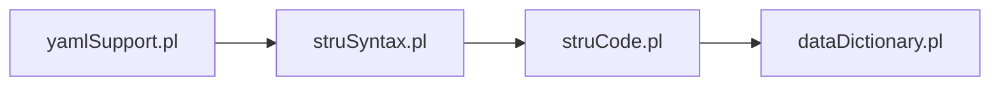

# Structure Definition System

<cite>
**Referenced Files in This Document**
- [README.md](file://src/stru/README.md)
- [system.yaml](file://src/stru/system.yaml)
- [elements.yaml](file://src/stru/elements.yaml)
- [groups.yaml](file://src/stru/groups.yaml)
- [sources-structure.yaml](file://src/stru/sources-structure.yaml)
- [gacto2.str.yaml](file://src/stru/gacto2.str.yaml)
- [pt-elements.yaml](file://src/stru/pt-elements.yaml)
- [pt-groups.yaml](file://src/stru/pt-groups.yaml)
- [pt-actors.yaml](file://src/stru/pt-actors.yaml)
- [pt-actorm.yaml](file://src/stru/pt-actorm.yaml)
- [pt-actorf.yaml](file://src/stru/pt-actorf.yaml)
- [pt-acts.yaml](file://src/stru/pt-acts.yaml)
- [pt-parents.yaml](file://src/stru/pt-parents.yaml)
- [pt-parentem.yaml](file://src/stru/pt-parentem.yaml)
- [pt-parentef.yaml](file://src/stru/pt-parentef.yaml)
- [pt-sources-structure.yaml](file://src/stru/pt-sources-structure.yaml)
- [jcatalog-structure.yaml](file://tests/kleio-home/sources/reference_sources/yaml/jcatalog-structure.yaml)
- [pt-groups.kleio](file://tests/kleio-home/sources/reference_sources/yaml/pt-groups.kleio)
- [struCode.pl](file://src/struCode.pl)
- [struSyntax.pl](file://src/struSyntax.pl)
- [yamlSupport.pl](file://src/yamlSupport.pl)
- [dataDictionary.pl](file://src/dataDictionary.pl)
</cite>

## Update Summary
**Changes Made**
- Updated architecture overview to reflect modular system with separate elements.yaml and groups.yaml files
- Added comprehensive Portuguese structure schema documentation with ten new pt-*.yaml files
- Updated file organization structure showing new src/stru/ directory layout
- Documented deprecated files moved to tests/kleio-home/structures/deprecated/ and in_process/ directories
- Enhanced examples with Portuguese-specific structure implementations
- Updated compilation pipeline to show modular include patterns

## Table of Contents
1. [Introduction](#introduction)
2. [Project Structure](#project-structure)
3. [Core Components](#core-components)
4. [Architecture Overview](#architecture-overview)
5. [Detailed Component Analysis](#detailed-component-analysis)
6. [Dependency Analysis](#dependency-analysis)
7. [Performance Considerations](#performance-considerations)
8. [Troubleshooting Guide](#troubleshooting-guide)
9. [Conclusion](#conclusion)
10. [Appendices](#appendices)

## Introduction
This document explains the Structure Definition System used by Kleio to model and validate data schemas for historical documents. The system has undergone a major architectural transformation from a monolithic approach to a comprehensive modular system with separate elements and groups definitions, enhanced with extensive Portuguese structure schema implementations.

The system now centers around:
- Modular YAML structure definitions organized in src/stru/ directory
- Global settings via system.yaml
- Reusable element definitions via elements.yaml
- Grouping of elements via groups.yaml
- Specialized Portuguese structure schemas with ten dedicated pt-*.yaml files
- YAML-based structure files that declare elements, groups, and relationships
- A compilation pipeline that transforms YAML definitions into internal structure representations

It covers syntax for element types, attributes, relationships, validation constraints, inheritance, reuse, and advanced topics such as conditional validation, dynamic definitions, and versioning. Practical examples are drawn from both the original structure files and the new Portuguese implementations.

## Project Structure
The Structure Definition System has evolved to a modular architecture centered around the src/stru/ directory with separate files for different aspects of structure definition.

**Diagram sources**
- [system.yaml](file://src/stru/system.yaml#L1-L4)
- [elements.yaml](file://src/stru/elements.yaml#L1-L305)
- [groups.yaml](file://src/stru/groups.yaml#L1-L690)
- [sources-structure.yaml](file://src/stru/sources-structure.yaml#L1-L10)
- [gacto2.str.yaml](file://src/stru/gacto2.str.yaml#L1-L200)
- [pt-elements.yaml](file://src/stru/pt-elements.yaml#L1-L136)
- [pt-groups.yaml](file://src/stru/pt-groups.yaml#L1-L229)
- [pt-actors.yaml](file://src/stru/pt-actors.yaml#L1-L8)
- [pt-acts.yaml](file://src/stru/pt-acts.yaml#L1-L800)
- [yamlSupport.pl](file://src/yamlSupport.pl#L28-L43)
- [struSyntax.pl](file://src/struSyntax.pl#L48-L58)
- [struCode.pl](file://src/struCode.pl#L64-L82)
- [dataDictionary.pl](file://src/dataDictionary.pl#L118-L126)

**Section sources**
- [README.md](file://src/stru/README.md#L1-L7)
- [system.yaml](file://src/stru/system.yaml#L1-L4)
- [elements.yaml](file://src/stru/elements.yaml#L1-L305)
- [groups.yaml](file://src/stru/groups.yaml#L1-L690)

## Core Components
The system now operates with a modular architecture featuring separate files for different structural aspects:

- **system.yaml**: Declares global includes for groups and elements, forming the base schema
- **elements.yaml**: Defines reusable element templates (types, identifiers, locations, dates, relations, metadata) - now with 305 lines of comprehensive element definitions
- **groups.yaml**: Defines hierarchical groups (entities, acts, events, attributes, relations) and their composition rules - expanded to 690 lines with comprehensive group definitions
- **Portuguese Extensions**: Ten specialized files for Portuguese structure implementation:
  - pt-elements.yaml: Portuguese element names and translations
  - pt-groups.yaml: Portuguese main groups for historical documents
  - pt-actors.yaml: Actor definitions with Portuguese roles
  - pt-actorm.yaml: Portuguese male actors
  - pt-actorf.yaml: Portuguese female actors
  - pt-acts.yaml: Portuguese act types and ceremonies
  - pt-parents.yaml: Parent relationship definitions
  - pt-parentem.yaml: Portuguese male kin relationships
  - pt-parentef.yaml: Portuguese female kin relationships
  - pt-sources-structure.yaml: Complete Portuguese sources structure
- **YAML structure files**: Define concrete schemas by declaring elements and groups, often inheriting from base definitions
- **yamlSupport.pl**: Loads YAML, resolves includes, and dispatches commands to the syntax/semantic engine
- **struSyntax.pl**: Lexical and syntactic layer for structure commands and parameters
- **struCode.pl**: Executes command semantics, enforces completeness, and builds internal properties
- **dataDictionary.pl**: Stores and exposes the compiled structure (groups, elements, containment, defaults)

**Section sources**
- [system.yaml](file://src/stru/system.yaml#L1-L4)
- [elements.yaml](file://src/stru/elements.yaml#L1-L305)
- [groups.yaml](file://src/stru/groups.yaml#L1-L690)
- [pt-elements.yaml](file://src/stru/pt-elements.yaml#L1-L136)
- [pt-groups.yaml](file://src/stru/pt-groups.yaml#L1-L229)
- [yamlSupport.pl](file://src/yamlSupport.pl#L28-L43)
- [struSyntax.pl](file://src/struSyntax.pl#L48-L58)
- [struCode.pl](file://src/struCode.pl#L64-L82)
- [dataDictionary.pl](file://src/dataDictionary.pl#L118-L126)

## Architecture Overview
The compilation pipeline has been enhanced to support the modular architecture with Portuguese extensions:

**Diagram sources**
- [yamlSupport.pl](file://src/yamlSupport.pl#L28-L43)
- [struSyntax.pl](file://src/struSyntax.pl#L48-L58)
- [struCode.pl](file://src/struCode.pl#L64-L82)
- [dataDictionary.pl](file://src/dataDictionary.pl#L118-L126)

## Detailed Component Analysis

### YAML Structure Definition Format
The modular system uses a hierarchical YAML structure with clear separation of concerns:

- **Root-level directives**:
  - file: Provides metadata for the structure file (name, description)
  - include: References other YAML files (e.g., system.yaml includes groups.yaml and elements.yaml)
- **Element declarations**:
  - name: Unique identifier for the element
  - description: Human-readable description
  - source: Inherits behavior/type from another element
  - type: Type category (e.g., lingua, tempora, numerus, condicio, situs, relatio)
  - identification: Marks an element as an identifier (sic/non)
  - prefix/suffix: Flags for output formatting
- **Group declarations**:
  - name: Unique identifier for the group
  - description: Human-readable description
  - source: Extends another group; properties are inherited and overridden
  - position: Ordered positional elements for compact notation
  - guaranteed: Required elements for completeness
  - also: Optional elements allowed in addition to position
  - arbitrary: Allows repeated instances of listed child groups
  - part: Static containment of child groups
  - idprefix: Prefix for generated IDs within the group

**Updated** The system now supports extensive Portuguese localization with specialized element and group definitions that maintain compatibility with the base structure while adding language-specific functionality.

Examples in the repository:
- Base includes and element templates: [system.yaml](file://src/stru/system.yaml#L1-L4), [elements.yaml](file://src/stru/elements.yaml#L1-L305)
- Core groups and inheritance: [groups.yaml](file://src/stru/groups.yaml#L1-L690)
- Portuguese element translations: [pt-elements.yaml](file://src/stru/pt-elements.yaml#L1-L136)
- Portuguese group definitions: [pt-groups.yaml](file://src/stru/pt-groups.yaml#L1-L229)
- Portuguese actor definitions: [pt-actors.yaml](file://src/stru/pt-actors.yaml#L1-L8)
- Generated structure snapshots: [sources-structure.yaml](file://src/stru/sources-structure.yaml#L1-L10), [gacto2.str.yaml](file://src/stru/gacto2.str.yaml#L1-L200)

**Section sources**
- [system.yaml](file://src/stru/system.yaml#L1-L4)
- [elements.yaml](file://src/stru/elements.yaml#L1-L305)
- [groups.yaml](file://src/stru/groups.yaml#L1-L690)
- [pt-elements.yaml](file://src/stru/pt-elements.yaml#L1-L136)
- [pt-groups.yaml](file://src/stru/pt-groups.yaml#L1-L229)
- [pt-actors.yaml](file://src/stru/pt-actors.yaml#L1-L8)
- [sources-structure.yaml](file://src/stru/sources-structure.yaml#L1-L10)
- [gacto2.str.yaml](file://src/stru/gacto2.str.yaml#L1-L200)

### Compilation Pipeline
The modular architecture maintains the same compilation process but with enhanced include resolution:

- **YAML loading and includes**:
  - yamlSupport.pl reads YAML, logs inclusion depth, and prevents cycles
  - Includes are resolved relative to the including file's directory
  - Supports nested includes for Portuguese extensions
- **Command dispatch**:
  - struSyntax.pl lexes and validates commands and parameters against keyword mappings
  - struCode.pl executes semantic actions, enforces required parameters, and stores properties
- **Internal representation**:
  - dataDictionary.pl persists groups and elements, computes containment, and exposes queries

**Diagram sources**
- [yamlSupport.pl](file://src/yamlSupport.pl#L46-L68)
- [struSyntax.pl](file://src/struSyntax.pl#L48-L58)
- [struCode.pl](file://src/struCode.pl#L104-L118)
- [dataDictionary.pl](file://src/dataDictionary.pl#L118-L126)

**Section sources**
- [yamlSupport.pl](file://src/yamlSupport.pl#L28-L43)
- [struSyntax.pl](file://src/struSyntax.pl#L48-L58)
- [struCode.pl](file://src/struCode.pl#L64-L82)
- [dataDictionary.pl](file://src/dataDictionary.pl#L118-L126)

### Inheritance and Reuse Patterns
The modular system enhances inheritance patterns with Portuguese localization:

- **Element specialization**:
  - Use source to inherit type and behavior from base elements (e.g., Portuguese variants of generic elements)
  - Portuguese elements extend base elements with language-specific descriptions
- **Group extension**:
  - Use source to extend core groups; properties are copied and overridden
  - part and arbitrary define containment and repetition rules
  - Portuguese groups build upon base group definitions
- **ID generation**:
  - idprefix on groups controls auto-generated IDs for entities

**Updated** The Portuguese structure introduces specialized actor definitions, kinship relationships, and ceremony-specific act types that inherit from base definitions while adding language-specific functionality.

Example references:
- Element specialization: [elements.yaml](file://src/stru/elements.yaml#L33-L35), [pt-elements.yaml](file://src/stru/pt-elements.yaml#L8-L136)
- Group inheritance: [groups.yaml](file://src/stru/groups.yaml#L69-L71), [pt-groups.yaml](file://src/stru/pt-groups.yaml#L21-L229)
- Portuguese actor definitions: [pt-actors.yaml](file://src/stru/pt-actors.yaml#L1-L8), [pt-actorm.yaml](file://src/stru/pt-actorm.yaml#L1-L206)
- Containment and repetition: [groups.yaml](file://src/stru/groups.yaml#L136-L137), [pt-groups.yaml](file://src/stru/pt-groups.yaml#L113-L114)

**Section sources**
- [elements.yaml](file://src/stru/elements.yaml#L33-L35)
- [pt-elements.yaml](file://src/stru/pt-elements.yaml#L8-L136)
- [groups.yaml](file://src/stru/groups.yaml#L69-L71)
- [pt-groups.yaml](file://src/stru/pt-groups.yaml#L21-L229)
- [pt-actors.yaml](file://src/stru/pt-actors.yaml#L1-L8)
- [pt-actorm.yaml](file://src/stru/pt-actorm.yaml#L1-L206)
- [groups.yaml](file://src/stru/groups.yaml#L136-L145)
- [pt-groups.yaml](file://src/stru/pt-groups.yaml#L113-L114)

### Validation Logic and Completeness
The validation system remains robust with enhanced Portuguese support:

- **Required parameters**:
  - struCode.pl enforces required parameters per command (e.g., nomen, primum for nomino; nomen for pars and terminus)
- **Completeness checks**:
  - check_complete marks commands as ok/notOk and attaches status to names
- **Parameter validation**:
  - struSyntax.pl validates parameter names and values, including keyword mappings and typed values

**Diagram sources**
- [struCode.pl](file://src/struCode.pl#L91-L118)
- [struCode.pl](file://src/struCode.pl#L306-L321)
- [struSyntax.pl](file://src/struSyntax.pl#L124-L135)

**Section sources**
- [struCode.pl](file://src/struCode.pl#L306-L321)
- [struSyntax.pl](file://src/struSyntax.pl#L124-L135)

### Advanced Topics

#### Conditional Validation and Dynamic Definitions
The modular system supports enhanced conditional validation through Portuguese-specific configurations:

- **Position and guaranteed**:
  - position enables compact notation; guaranteed ensures presence for completeness
  - Portuguese structures define specific positional requirements for different act types
- **Arbitrary and part**:
  - arbitrary allows repeated child groups; part declares static containment
  - Portuguese actor groups use arbitrary for flexible participant listings
- **Dynamic element definitions**:
  - YAML supports adding new elements and groups dynamically; inheritance via source preserves behavior
  - Portuguese extensions add ceremony-specific elements and relationships

**Updated** Portuguese structures introduce sophisticated act type definitions with specialized containment rules, ceremony-specific elements, and kinship relationship hierarchies that demonstrate advanced dynamic definition capabilities.

References:
- [groups.yaml](file://src/stru/groups.yaml#L13-L28)
- [pt-groups.yaml](file://src/stru/pt-groups.yaml#L113-L114)
- [pt-acts.yaml](file://src/stru/pt-acts.yaml#L1-L800)
- [groups.yaml](file://src/stru/groups.yaml#L136-L145)

**Section sources**
- [groups.yaml](file://src/stru/groups.yaml#L13-L28)
- [pt-groups.yaml](file://src/stru/pt-groups.yaml#L113-L114)
- [pt-acts.yaml](file://src/stru/pt-acts.yaml#L1-L800)
- [groups.yaml](file://src/stru/groups.yaml#L136-L145)

#### Structure Versioning
The system does not define explicit version fields in the analyzed files. Recommendations for the modular architecture:

- Add a version field in the file block for tracking structure evolution
- Use include to compose major/minor versions with Portuguese extensions
- Maintain backward-compatible extensions via source inheritance
- Track Portuguese-specific versioning separately from base structure versions

#### Creating Custom Structure Definitions
The modular system provides enhanced guidance for structure creation:

- **Base composition**: Start from system.yaml and include groups.yaml and elements.yaml
- **Portuguese adaptation**: Extend Portuguese base files for Portuguese document types
- **Domain specialization**: Define domain-specific groups with source to reuse core semantics
- **Positional optimization**: Use position, guaranteed, also, arbitrary, and part to model document structure efficiently
- **Element specialization**: Add elements with source to specialize base types for specific use cases

**Updated** The modular architecture makes it easier to create custom structures by providing clear separation between base definitions and domain-specific adaptations.

References:
- [system.yaml](file://src/stru/system.yaml#L1-L4)
- [groups.yaml](file://src/stru/groups.yaml#L1-L690)
- [elements.yaml](file://src/stru/elements.yaml#L1-L305)
- [pt-groups.yaml](file://src/stru/pt-groups.yaml#L1-L229)
- [pt-acts.yaml](file://src/stru/pt-acts.yaml#L1-L800)

**Section sources**
- [system.yaml](file://src/stru/system.yaml#L1-L4)
- [groups.yaml](file://src/stru/groups.yaml#L1-L690)
- [elements.yaml](file://src/stru/elements.yaml#L1-L305)
- [pt-groups.yaml](file://src/stru/pt-groups.yaml#L1-L229)
- [pt-acts.yaml](file://src/stru/pt-acts.yaml#L1-L800)

### Example Structures from the Codebase
The modular system demonstrates comprehensive structure implementations:

- **Historical source modeling**:
  - Base groups and elements: [groups.yaml](file://src/stru/groups.yaml#L1-L690), [elements.yaml](file://src/stru/elements.yaml#L1-L305)
  - Generated snapshot: [sources-structure.yaml](file://src/stru/sources-structure.yaml#L1-L10)
  - Portuguese sources: [pt-sources-structure.yaml](file://src/stru/pt-sources-structure.yaml)
- **GActo2 structure**:
  - Generated snapshot: [gacto2.str.yaml](file://src/stru/gacto2.str.yaml#L1-L200)
- **Portuguese act types**:
  - Marriage acts: [pt-acts.yaml](file://src/stru/pt-acts.yaml#L218-L346)
  - Baptism acts: [pt-acts.yaml](file://src/stru/pt-acts.yaml#L475-L496)
  - Burial acts: [pt-acts.yaml](file://src/stru/pt-acts.yaml#L497-L540)
  - Portuguese actor definitions: [pt-actors.yaml](file://src/stru/pt-actors.yaml#L1-L8)
- **Domain-specific catalog structure**:
  - [jcatalog-structure.yaml](file://tests/kleio-home/sources/reference_sources/yaml/jcatalog-structure.yaml#L1-L66)

**Updated** The Portuguese structure provides comprehensive coverage of historical Portuguese documents with specialized act types, ceremony-specific elements, and kinship relationship definitions.

**Section sources**
- [groups.yaml](file://src/stru/groups.yaml#L1-L690)
- [elements.yaml](file://src/stru/elements.yaml#L1-L305)
- [sources-structure.yaml](file://src/stru/sources-structure.yaml#L1-L10)
- [gacto2.str.yaml](file://src/stru/gacto2.str.yaml#L1-L200)
- [pt-sources-structure.yaml](file://src/stru/pt-sources-structure.yaml)
- [pt-acts.yaml](file://src/stru/pt-acts.yaml#L218-L346)
- [pt-actors.yaml](file://src/stru/pt-actors.yaml#L1-L8)
- [jcatalog-structure.yaml](file://tests/kleio-home/sources/reference_sources/yaml/jcatalog-structure.yaml#L1-L66)

## Dependency Analysis
The runtime modules depend on each other in a layered fashion with enhanced Portuguese support: yamlSupport orchestrates YAML processing, struSyntax handles syntax, struCode executes semantics, and dataDictionary persists the schema.

**Diagram sources**
- [yamlSupport.pl](file://src/yamlSupport.pl#L28-L43)
- [struSyntax.pl](file://src/struSyntax.pl#L48-L58)
- [struCode.pl](file://src/struCode.pl#L64-L82)
- [dataDictionary.pl](file://src/dataDictionary.pl#L118-L126)

**Section sources**
- [yamlSupport.pl](file://src/yamlSupport.pl#L28-L43)
- [struSyntax.pl](file://src/struSyntax.pl#L48-L58)
- [struCode.pl](file://src/struCode.pl#L64-L82)
- [dataDictionary.pl](file://src/dataDictionary.pl#L118-L126)

## Performance Considerations
The modular architecture introduces performance considerations:

- **YAML includes are logged with indentation** to reflect nesting; deep include chains increase processing time
- **Portuguese extensions add complexity** but enable efficient reuse of base definitions
- **The system avoids redundant processing** by tracking already-read files and issuing warnings for duplicates
- **Internal caching of containment relationships** reduces repeated inference overhead
- **Modular structure enables selective loading** of Portuguese extensions only when needed

## Troubleshooting Guide
Common issues in the modular system:

- **Unknown command or parameter**:
  - struSyntax.pl reports syntax errors with file, line number, and line text
- **Missing required parameters**:
  - struCode.pl emits errors for missing required parameters and marks commands notOk
- **Out-of-context commands**:
  - yamlSupport.pl detects misuse of file/description outside the file block and reports errors with context
- **Portuguese structure issues**:
  - Ensure proper include order: pt-elements.yaml before pt-groups.yaml
  - Verify actor definitions match corresponding group definitions
  - Check that Portuguese act types include required positional elements

**Section sources**
- [struSyntax.pl](file://src/struSyntax.pl#L52-L58)
- [struCode.pl](file://src/struCode.pl#L323-L337)
- [yamlSupport.pl](file://src/yamlSupport.pl#L139-L147)

## Conclusion
The Structure Definition System has evolved into a comprehensive modular architecture that provides robust, extensible framework for modeling historical document schemas in Kleio. The major transformation from monolithic to modular design, combined with extensive Portuguese structure implementations, demonstrates how to define elements, groups, and relationships while supporting dynamic composition and language-specific adaptations. The analyzed files showcase how to extend core schemas for domain-specific needs, with particular strength in Portuguese historical document modeling.

## Appendices

### Appendix A: Command and Parameter Reference
- **Commands**:
  - file, include, group, element (mapped to Latin/English keywords)
- **Parameters**:
  - nomen, primum, modus, antiquum, scribe, plures, identificatio, nota (for nomino)
  - nomen, ordo, sequentia, identificatio, signum, fons, prae, post, locus, ceteri, certe, pars, solum, semper, repetitio (for pars)
  - nomen, modus, primum, secundum, ordo, fons, prae, post, pars, sine, signa, forma, ceteri, identificatio, cumule, solum (for terminus)
  - nomen (for exitus)

**Section sources**
- [struSyntax.pl](file://src/struSyntax.pl#L124-L135)

### Appendix B: Example Usage Patterns
- **Base schema composition**:
  - [system.yaml](file://src/stru/system.yaml#L1-L4)
- **Element specialization**:
  - [elements.yaml](file://src/stru/elements.yaml#L33-L35), [pt-elements.yaml](file://src/stru/pt-elements.yaml#L8-L136)
- **Group extension and containment**:
  - [groups.yaml](file://src/stru/groups.yaml#L69-L71), [pt-groups.yaml](file://src/stru/pt-groups.yaml#L21-L229)
- **Portuguese actor definitions**:
  - [pt-actors.yaml](file://src/stru/pt-actors.yaml#L1-L8), [pt-actorm.yaml](file://src/stru/pt-actorm.yaml#L1-L206)
- **Domain-specific structure**:
  - [pt-acts.yaml](file://src/stru/pt-acts.yaml#L1-L800)
- **Historical structure**:
  - [jcatalog-structure.yaml](file://tests/kleio-home/sources/reference_sources/yaml/jcatalog-structure.yaml#L1-L66)

**Section sources**
- [system.yaml](file://src/stru/system.yaml#L1-L4)
- [elements.yaml](file://src/stru/elements.yaml#L33-L35)
- [pt-elements.yaml](file://src/stru/pt-elements.yaml#L8-L136)
- [groups.yaml](file://src/stru/groups.yaml#L69-L71)
- [pt-groups.yaml](file://src/stru/pt-groups.yaml#L21-L229)
- [pt-actors.yaml](file://src/stru/pt-actors.yaml#L1-L8)
- [pt-actorm.yaml](file://src/stru/pt-actorm.yaml#L1-L206)
- [pt-acts.yaml](file://src/stru/pt-acts.yaml#L1-L800)
- [jcatalog-structure.yaml](file://tests/kleio-home/sources/reference_sources/yaml/jcatalog-structure.yaml#L1-L66)

### Appendix C: Portuguese Structure Implementation Details
The modular system includes comprehensive Portuguese structure implementations:

- **Portuguese element translations**: [pt-elements.yaml](file://src/stru/pt-elements.yaml#L1-L136)
- **Portuguese group definitions**: [pt-groups.yaml](file://src/stru/pt-groups.yaml#L1-L229)
- **Actor role definitions**: [pt-actors.yaml](file://src/stru/pt-actors.yaml#L1-L8)
- **Male actor definitions**: [pt-actorm.yaml](file://src/stru/pt-actorm.yaml#L1-L206)
- **Female actor definitions**: [pt-actorf.yaml](file://src/stru/pt-actorf.yaml)
- **Kinship relationship definitions**: [pt-parents.yaml](file://src/stru/pt-parents.yaml), [pt-parentem.yaml](file://src/stru/pt-parentem.yaml#L1-L157), [pt-parentef.yaml](file://src/stru/pt-parentef.yaml#L1-L141)
- **Complete Portuguese sources**: [pt-sources-structure.yaml](file://src/stru/pt-sources-structure.yaml)

**Section sources**
- [pt-elements.yaml](file://src/stru/pt-elements.yaml#L1-L136)
- [pt-groups.yaml](file://src/stru/pt-groups.yaml#L1-L229)
- [pt-actors.yaml](file://src/stru/pt-actors.yaml#L1-L8)
- [pt-actorm.yaml](file://src/stru/pt-actorm.yaml#L1-L206)
- [pt-actorf.yaml](file://src/stru/pt-actorf.yaml)
- [pt-parents.yaml](file://src/stru/pt-parents.yaml)
- [pt-parentem.yaml](file://src/stru/pt-parentem.yaml#L1-L157)
- [pt-parentef.yaml](file://src/stru/pt-parentef.yaml#L1-L141)
- [pt-sources-structure.yaml](file://src/stru/pt-sources-structure.yaml)