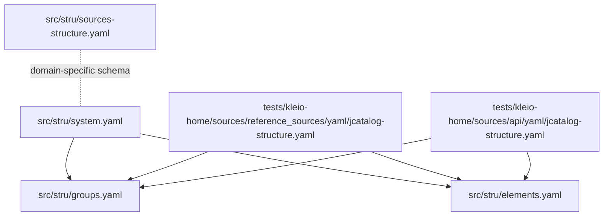
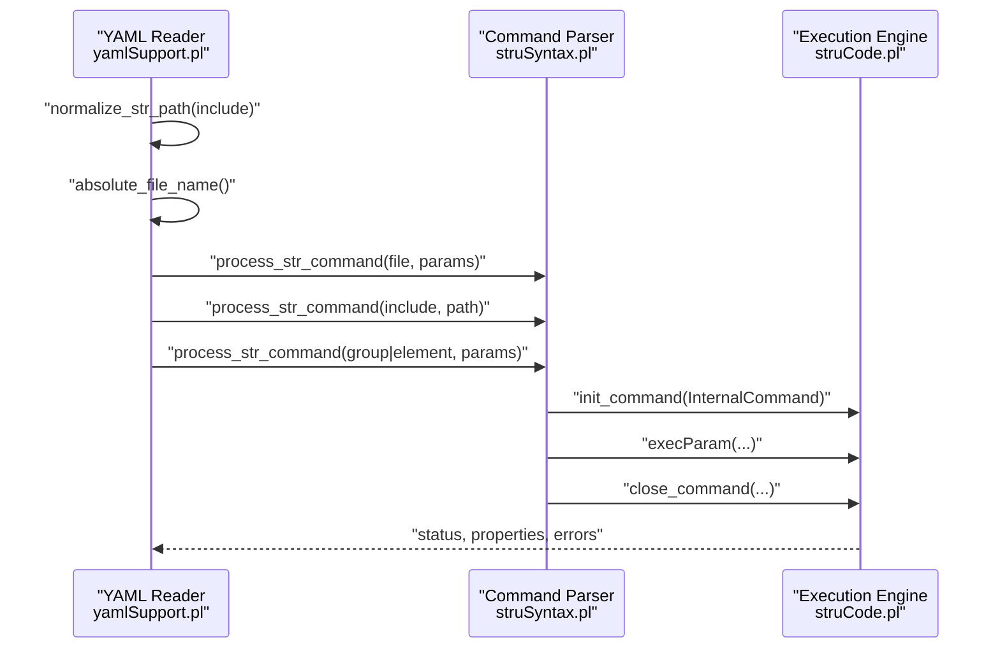
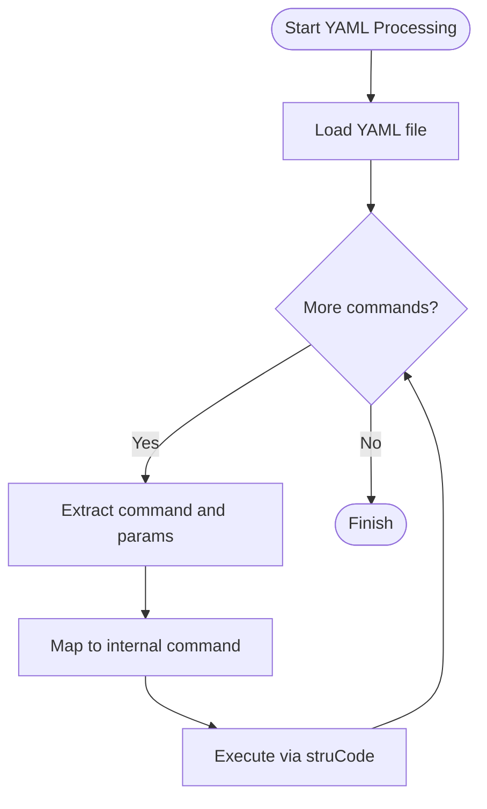
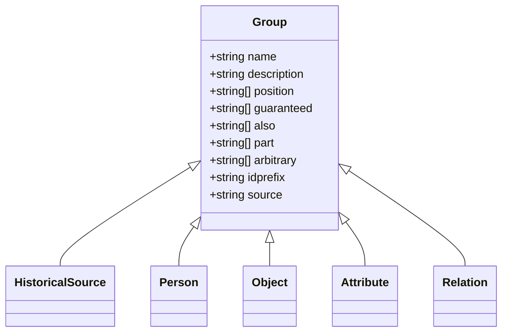
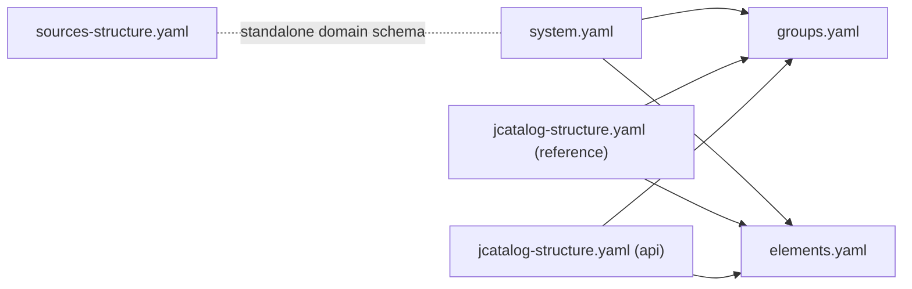

# Structure File Formats

<cite>
**Referenced Files in This Document**
- [system.yaml](file://src/stru/system.yaml)
- [elements.yaml](file://src/stru/elements.yaml)
- [groups.yaml](file://src/stru/groups.yaml)
- [sources-structure.yaml](file://src/stru/sources-structure.yaml)
- [jcatalog-structure.yaml (tests reference)](file://tests/kleio-home/sources/reference_sources/yaml/jcatalog-structure.yaml)
- [jcatalog-structure.yaml (tests api)](file://tests/kleio-home/sources/api/yaml/jcatalog-structure.yaml)
- [stru_file_location.md](file://docs/doc/stru_file_location.md)
- [yamlSupport.pl](file://src/yamlSupport.pl)
- [struSyntax.pl](file://src/struSyntax.pl)
- [struCode.pl](file://src/struCode.pl)
</cite>

## Table of Contents
1. [Introduction](#introduction)
2. [Project Structure](#project-structure)
3. [Core Components](#core-components)
4. [Architecture Overview](#architecture-overview)
5. [Detailed Component Analysis](#detailed-component-analysis)
6. [Dependency Analysis](#dependency-analysis)
7. [Performance Considerations](#performance-considerations)
8. [Troubleshooting Guide](#troubleshooting-guide)
9. [Conclusion](#conclusion)
10. [Appendices](#appendices)

## Introduction
This document explains the YAML-based structure definition system used by Kleio to define schemas for parsing historical source files. It covers:
- The base configuration file system.yaml
- The sources-structure.yaml schema for document-specific structures
- Modular composition via include directives
- Syntax for structure blocks, element references, and file inclusion patterns
- How YAML files are validated and processed
- Guidelines for organizing large structure definitions and ensuring consistency across multiple files

## Project Structure
Kleio’s structure files live primarily under src/stru and are complemented by examples and tests under tests/kleio-home/structures and tests/kleio-home/sources. The key files are:
- src/stru/system.yaml: Base composition of groups and elements
- src/stru/groups.yaml: Core group definitions and relationships
- src/stru/elements.yaml: Basic element definitions and specializations
- src/stru/sources-structure.yaml: A comprehensive schema for historical sources and entities
- tests/kleio-home/sources/*/yaml/*.yaml: Examples of modular, domain-specific structures composed via include

**Diagram sources**
- [system.yaml](file://src/stru/system.yaml#L1-L4)
- [groups.yaml](file://src/stru/groups.yaml#L1-L20)
- [elements.yaml](file://src/stru/elements.yaml#L1-L30)
- [sources-structure.yaml](file://src/stru/sources-structure.yaml#L1-L40)
- [jcatalog-structure.yaml (tests reference)](file://tests/kleio-home/sources/reference_sources/yaml/jcatalog-structure.yaml#L1-L20)
- [jcatalog-structure.yaml (tests api)](file://tests/kleio-home/sources/api/yaml/jcatalog-structure.yaml#L1-L20)

**Section sources**
- [system.yaml](file://src/stru/system.yaml#L1-L4)
- [groups.yaml](file://src/stru/groups.yaml#L1-L20)
- [elements.yaml](file://src/stru/elements.yaml#L1-L30)
- [sources-structure.yaml](file://src/stru/sources-structure.yaml#L1-L40)
- [jcatalog-structure.yaml (tests reference)](file://tests/kleio-home/sources/reference_sources/yaml/jcatalog-structure.yaml#L1-L20)
- [jcatalog-structure.yaml (tests api)](file://tests/kleio-home/sources/api/yaml/jcatalog-structure.yaml#L1-L20)

## Core Components
- system.yaml: Declares include directives to compose the base schema from groups.yaml and elements.yaml.
- groups.yaml: Defines core groups (e.g., historical-source, person, object, attribute, relation) with metadata such as idprefix, position, guaranteed, also, and optional part relationships.
- elements.yaml: Defines basic elements (e.g., id, name, date, type, value) and specialized variants (e.g., string64, string256, text) with optional source references to inherit behavior.
- sources-structure.yaml: A domain-specific schema for historical sources, defining groups like historical-act, event, cevent, and entities like person, object, geoentity, plus attributes and relations.
- Test examples: jcatalog-structure.yaml files demonstrate modular composition using include directives and specialization via source references.

Key syntax highlights:
- include: references another YAML structure file
- file: metadata block for the current file
- group: defines a group with keys like name, description, idprefix, position, guaranteed, also, part, arbitrary, source
- element: defines an element with name, description, and optional source

**Section sources**
- [system.yaml](file://src/stru/system.yaml#L1-L4)
- [groups.yaml](file://src/stru/groups.yaml#L32-L160)
- [elements.yaml](file://src/stru/elements.yaml#L39-L120)
- [sources-structure.yaml](file://src/stru/sources-structure.yaml#L207-L267)
- [jcatalog-structure.yaml (tests reference)](file://tests/kleio-home/sources/reference_sources/yaml/jcatalog-structure.yaml#L1-L20)
- [jcatalog-structure.yaml (tests api)](file://tests/kleio-home/sources/api/yaml/jcatalog-structure.yaml#L1-L20)

## Architecture Overview
The YAML structure system is processed by a pipeline that:
- Reads YAML files and normalizes include paths
- Validates commands against a legacy Latin/English keyword set
- Translates YAML commands into internal structure definitions
- Enforces parameter completeness and emits errors/warnings

**Diagram sources**
- [yamlSupport.pl](file://src/yamlSupport.pl#L28-L43)
- [yamlSupport.pl](file://src/yamlSupport.pl#L115-L137)
- [struSyntax.pl](file://src/struSyntax.pl#L48-L58)
- [struCode.pl](file://src/struCode.pl#L91-L118)

## Detailed Component Analysis

### YAML Processing Pipeline
- YAML loading: The YAML file is read and inspected recursively. Includes are resolved and processed in order, with safeguards against cycles and repeated processing.
- Command dispatch: YAML commands (e.g., file, include, group, element) are mapped to internal Latin keywords and executed via struCode.
- Parameter sanitization: Values are sanitized (atoms to strings, lists recursively processed) before execution.
- Error handling: Errors and warnings are reported with contextual information (current file, line, stack).

**Diagram sources**
- [yamlSupport.pl](file://src/yamlSupport.pl#L46-L88)
- [yamlSupport.pl](file://src/yamlSupport.pl#L128-L137)
- [struCode.pl](file://src/struCode.pl#L148-L179)

**Section sources**
- [yamlSupport.pl](file://src/yamlSupport.pl#L28-L43)
- [yamlSupport.pl](file://src/yamlSupport.pl#L115-L137)
- [struCode.pl](file://src/struCode.pl#L148-L179)

### Base Schema Composition (system.yaml)
- Purpose: Compose the base schema from reusable components.
- Mechanism: include directives pull in groups.yaml and elements.yaml.
- Result: Provides the foundational groups and elements used by domain schemas.

**Section sources**
- [system.yaml](file://src/stru/system.yaml#L1-L4)
- [groups.yaml](file://src/stru/groups.yaml#L1-L2)
- [elements.yaml](file://src/stru/elements.yaml#L1-L10)

### Groups Definition (groups.yaml)
- Defines core groups with metadata:
  - idprefix: Prefix for generated identifiers
  - position: Ordered list of elements that can be provided without explicit names
  - guaranteed: Required elements for completeness
  - also: Optional elements
  - part: Subgroups that can be contained
  - arbitrary: Optional subgroups not constrained by part
  - source: Extends another group, inheriting its properties unless overridden
- Examples: kleio, historical-source, person, object, attribute, relation, and aliases.

**Diagram sources**
- [groups.yaml](file://src/stru/groups.yaml#L32-L160)

**Section sources**
- [groups.yaml](file://src/stru/groups.yaml#L32-L160)

### Elements Definition (elements.yaml)
- Defines basic elements and their types (e.g., number, string64, string256, text).
- Supports specialization via source to inherit behavior and improve mapping consistency.
- Includes identification semantics for unique identifiers and cross-file linking.

**Section sources**
- [elements.yaml](file://src/stru/elements.yaml#L39-L120)

### Domain Schema (sources-structure.yaml)
- Comprehensive schema for historical sources and entities.
- Defines groups such as historical-act, event, cevent, person, object, geoentity, and their relationships.
- Uses position, guaranteed, also, and part to constrain and organize content.

**Section sources**
- [sources-structure.yaml](file://src/stru/sources-structure.yaml#L207-L267)
- [sources-structure.yaml](file://src/stru/sources-structure.yaml#L569-L632)
- [sources-structure.yaml](file://src/stru/sources-structure.yaml#L669-L748)

### Modular Composition Examples (jcatalog-structure.yaml)
- Demonstrates include usage to reuse groups and elements from external files.
- Shows specialization via source to extend base groups (e.g., source: historical-source).
- Illustrates domain-specific groups and containment relationships.

**Section sources**
- [jcatalog-structure.yaml (tests reference)](file://tests/kleio-home/sources/reference_sources/yaml/jcatalog-structure.yaml#L1-L20)
- [jcatalog-structure.yaml (tests api)](file://tests/kleio-home/sources/api/yaml/jcatalog-structure.yaml#L1-L20)

### File Inclusion Patterns and Resolution
- include: Resolves relative paths and prevents cycles; logs include depth for readability.
- normalize_str_path: Handles "." and system-relative paths; integrates with absolute_file_name for resolution.
- Stack tracking: Maintains a stack of currently processed files to detect recursion and report context.

**Section sources**
- [yamlSupport.pl](file://src/yamlSupport.pl#L115-L137)
- [yamlSupport.pl](file://src/yamlSupport.pl#L188-L192)
- [yamlSupport.pl](file://src/yamlSupport.pl#L46-L68)

### Syntax Validation and Error Handling
- Keyword mapping: YAML command names are mapped to internal Latin/English keywords recognized by struSyntax.
- Parameter completeness: Commands require specific parameters; missing parameters trigger errors with file and line context.
- Error reporting: Errors and warnings include file, line number, and last line text for debugging.

**Section sources**
- [struSyntax.pl](file://src/struSyntax.pl#L262-L276)
- [struSyntax.pl](file://src/struSyntax.pl#L105-L121)
- [struCode.pl](file://src/struCode.pl#L306-L337)

## Dependency Analysis
- system.yaml depends on groups.yaml and elements.yaml via include.
- groups.yaml depends on elements.yaml via include.
- sources-structure.yaml is a standalone domain schema; it can be composed with base files or used independently.
- Test jcatalog-structure.yaml files depend on shared groups and elements via include.

**Diagram sources**
- [system.yaml](file://src/stru/system.yaml#L1-L4)
- [groups.yaml](file://src/stru/groups.yaml#L1-L2)
- [elements.yaml](file://src/stru/elements.yaml#L1-L10)
- [sources-structure.yaml](file://src/stru/sources-structure.yaml#L1-L40)
- [jcatalog-structure.yaml (tests reference)](file://tests/kleio-home/sources/reference_sources/yaml/jcatalog-structure.yaml#L1-L10)
- [jcatalog-structure.yaml (tests api)](file://tests/kleio-home/sources/api/yaml/jcatalog-structure.yaml#L1-L10)

**Section sources**
- [system.yaml](file://src/stru/system.yaml#L1-L4)
- [groups.yaml](file://src/stru/groups.yaml#L1-L2)
- [elements.yaml](file://src/stru/elements.yaml#L1-L10)
- [sources-structure.yaml](file://src/stru/sources-structure.yaml#L1-L40)
- [jcatalog-structure.yaml (tests reference)](file://tests/kleio-home/sources/reference_sources/yaml/jcatalog-structure.yaml#L1-L10)
- [jcatalog-structure.yaml (tests api)](file://tests/kleio-home/sources/api/yaml/jcatalog-structure.yaml#L1-L10)

## Performance Considerations
- Prefer modular composition with include to avoid duplicating definitions and reduce maintenance overhead.
- Keep element and group definitions centralized (elements.yaml, groups.yaml) to maximize reuse.
- Limit deep include chains to minimize processing depth and potential recursion risks.
- Use position and guaranteed judiciously to enforce early validation and reduce runtime ambiguity.

## Troubleshooting Guide
Common issues and resolutions:
- Unknown command in YAML file: Ensure the YAML command name matches a supported keyword (Latin or English equivalent). Check spelling and capitalization.
- Missing parameter for a command: Review required parameters for group/element definitions and add missing values.
- Include recursion or repeated processing: The processor ignores previously processed files and logs include depth; verify include paths and avoid circular references.
- Out-of-context parameters: Some parameters (e.g., name, description) must be within a file block; move them accordingly.

Debugging tips:
- Enable verbose logging to observe include depth and file processing order.
- Use small, incremental YAML files and include to localize issues.
- Validate parameter completeness by reviewing required fields for group/element commands.

**Section sources**
- [yamlSupport.pl](file://src/yamlSupport.pl#L46-L68)
- [yamlSupport.pl](file://src/yamlSupport.pl#L149-L154)
- [struSyntax.pl](file://src/struSyntax.pl#L105-L121)
- [struCode.pl](file://src/struCode.pl#L306-L337)

## Conclusion
Kleio’s YAML-based structure system enables modular, maintainable schema definitions for historical sources. By composing base schemas from groups and elements, and specializing them for domains, teams can scale structure definitions while preserving consistency and leveraging robust validation and error reporting.

## Appendices

### Appendix A: File Resolution and Location Strategy
- Default resolution order for locating a structure file for a given source follows a hierarchy of specificity.
- This supports per-file, per-directory, and global defaults, enabling flexible schema selection.

**Section sources**
- [stru_file_location.md](file://docs/doc/stru_file_location.md#L17-L30)