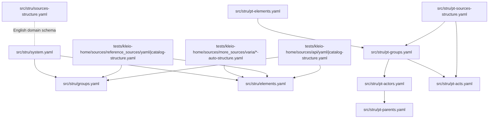
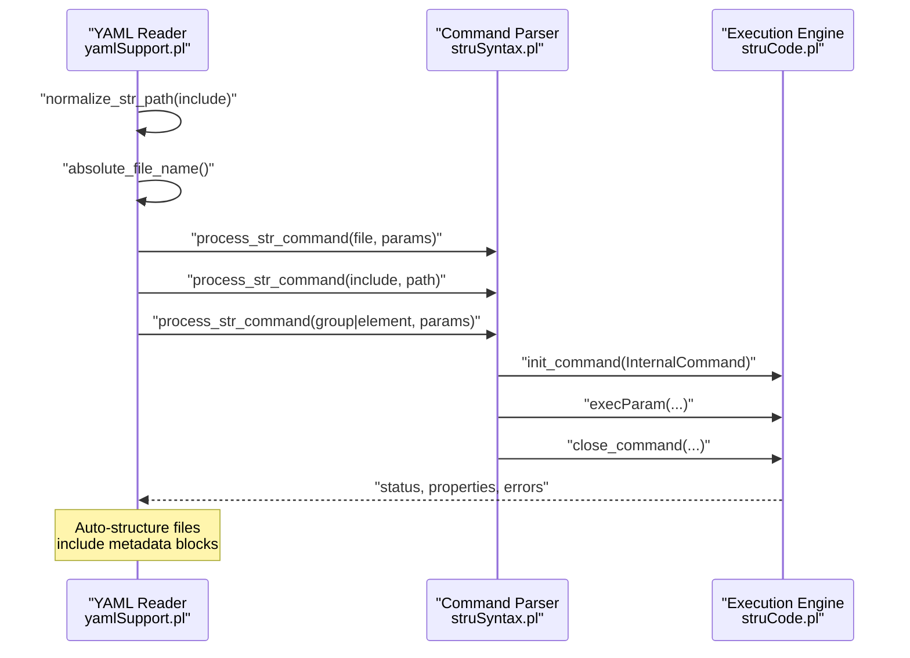
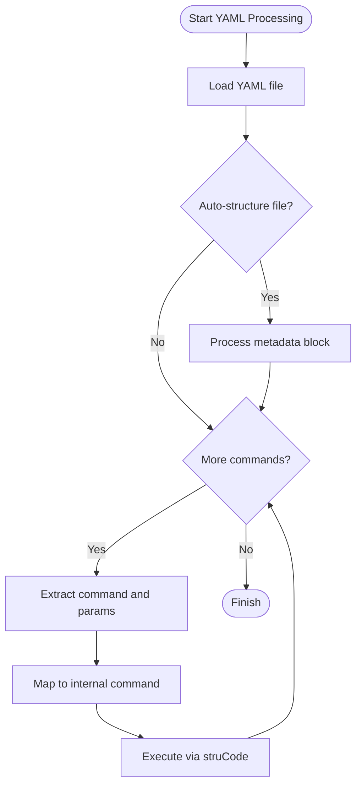
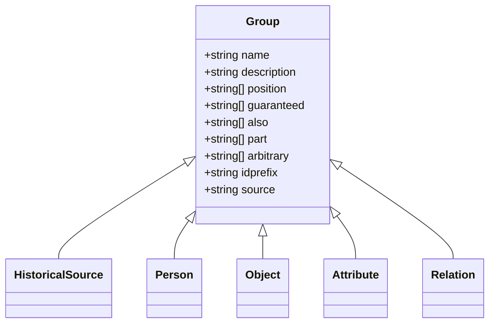
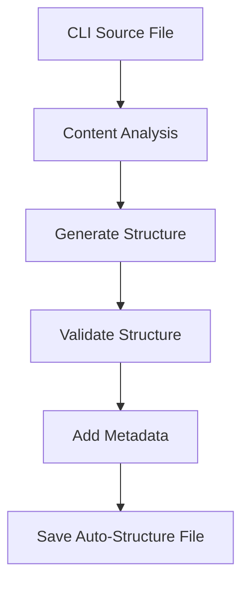
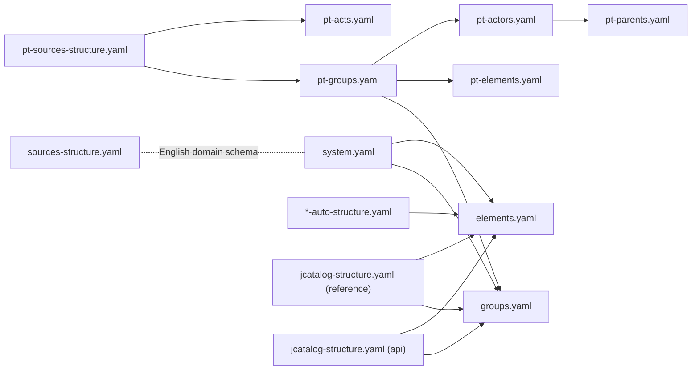

# Structure File Formats

<cite>
**Referenced Files in This Document**
- [system.yaml](file://src/stru/system.yaml)
- [elements.yaml](file://src/stru/elements.yaml)
- [groups.yaml](file://src/stru/groups.yaml)
- [sources-structure.yaml](file://src/stru/sources-structure.yaml)
- [pt-elements.yaml](file://src/stru/pt-elements.yaml)
- [pt-groups.yaml](file://src/stru/pt-groups.yaml)
- [pt-actors.yaml](file://src/stru/pt-actors.yaml)
- [pt-parents.yaml](file://src/stru/pt-parents.yaml)
- [pt-acts.yaml](file://src/stru/pt-acts.yaml)
- [pt-sources-structure.yaml](file://src/stru/pt-sources-structure.yaml)
- [auc-alunos-264605-A-140337-140771-auto-structure.yaml](file://tests/kleio-home/sources/more_sources/varia/auc-alunos-264605-A-140337-140771-auto-structure.yaml)
- [jcatalog-structure.yaml (tests reference)](file://tests/kleio-home/sources/reference_sources/yaml/jcatalog-structure.yaml)
- [jcatalog-structure.yaml (tests api)](file://tests/kleio-home/sources/api/yaml/jcatalog-structure.yaml)
- [stru_file_location.md](file://docs/doc/stru_file_location.md)
- [yamlSupport.pl](file://src/yamlSupport.pl)
- [struSyntax.pl](file://src/struSyntax.pl)
- [struCode.pl](file://src/struCode.pl)
</cite>

## Update Summary
**Changes Made**
- Added comprehensive documentation for Portuguese schema implementations
- Updated file naming conventions from -structure.yaml to -auto-structure.yaml
- Enhanced modular composition system documentation
- Added new Portuguese-specific structure files documentation
- Updated directory organization to reflect src/stru/ structure

## Table of Contents
1. [Introduction](#introduction)
2. [Project Structure](#project-structure)
3. [Core Components](#core-components)
4. [Architecture Overview](#architecture-overview)
5. [Detailed Component Analysis](#detailed-component-analysis)
6. [Portuguese Schema Implementation](#portuguese-schema-implementation)
7. [Auto-Generated Structure Files](#auto-generated-structure-files)
8. [Dependency Analysis](#dependency-analysis)
9. [Performance Considerations](#performance-considerations)
10. [Troubleshooting Guide](#troubleshooting-guide)
11. [Conclusion](#conclusion)
12. [Appendices](#appendices)

## Introduction
This document explains the YAML-based structure definition system used by Kleio to define schemas for parsing historical source files. The system has been enhanced with a comprehensive modular structure system, Portuguese schema implementations, and improved file naming conventions. It covers:
- The base configuration file system.yaml
- The sources-structure.yaml schema for document-specific structures
- Portuguese schema implementations for historical Portuguese documents
- Auto-generated structure files for automated schema discovery
- Modular composition via include directives
- Syntax for structure blocks, element references, and file inclusion patterns
- How YAML files are validated and processed
- Guidelines for organizing large structure definitions and ensuring consistency across multiple files

## Project Structure
Kleio's structure files live primarily under src/stru and are complemented by examples and tests under tests/kleio-home/structures and tests/kleio-home/sources. The enhanced structure now includes comprehensive Portuguese schema support and auto-generated structure files. The key files are:

**Updated** Enhanced directory organization with Portuguese schema support and auto-generated files

- src/stru/system.yaml: Base composition of groups and elements
- src/stru/groups.yaml: Core group definitions and relationships
- src/stru/elements.yaml: Basic element definitions and specializations
- src/stru/sources-structure.yaml: A comprehensive schema for historical sources and entities
- src/stru/pt-elements.yaml: Portuguese element names and translations
- src/stru/pt-groups.yaml: Portuguese group definitions for historical documents
- src/stru/pt-actors.yaml: Portuguese actor-related group compositions
- src/stru/pt-parents.yaml: Portuguese parent relationship definitions
- src/stru/pt-acts.yaml: Portuguese act-specific group definitions
- src/stru/pt-sources-structure.yaml: Complete Portuguese schema composition
- tests/kleio-home/sources/more_sources/varia/*-auto-structure.yaml: Auto-generated structure files

**Diagram sources**
- [system.yaml](file://src/stru/system.yaml#L1-L4)
- [groups.yaml](file://src/stru/groups.yaml#L1-L20)
- [elements.yaml](file://src/stru/elements.yaml#L1-L30)
- [sources-structure.yaml](file://src/stru/sources-structure.yaml#L1-L40)
- [pt-elements.yaml](file://src/stru/pt-elements.yaml#L1-L136)
- [pt-groups.yaml](file://src/stru/pt-groups.yaml#L1-L229)
- [pt-actors.yaml](file://src/stru/pt-actors.yaml#L1-L8)
- [pt-parents.yaml](file://src/stru/pt-parents.yaml#L1-L7)
- [pt-acts.yaml](file://src/stru/pt-acts.yaml#L1-L800)
- [pt-sources-structure.yaml](file://src/stru/pt-sources-structure.yaml#L1-L4)
- [auc-alunos-264605-A-140337-140771-auto-structure.yaml](file://tests/kleio-home/sources/more_sources/varia/auc-alunos-264605-A-140337-140771-auto-structure.yaml#L1-L907)

**Section sources**
- [system.yaml](file://src/stru/system.yaml#L1-L4)
- [groups.yaml](file://src/stru/groups.yaml#L1-L20)
- [elements.yaml](file://src/stru/elements.yaml#L1-L30)
- [sources-structure.yaml](file://src/stru/sources-structure.yaml#L1-L40)
- [pt-elements.yaml](file://src/stru/pt-elements.yaml#L1-L136)
- [pt-groups.yaml](file://src/stru/pt-groups.yaml#L1-L229)
- [pt-actors.yaml](file://src/stru/pt-actors.yaml#L1-L8)
- [pt-parents.yaml](file://src/stru/pt-parents.yaml#L1-L7)
- [pt-acts.yaml](file://src/stru/pt-acts.yaml#L1-L800)
- [pt-sources-structure.yaml](file://src/stru/pt-sources-structure.yaml#L1-L4)
- [auc-alunos-264605-A-140337-140771-auto-structure.yaml](file://tests/kleio-home/sources/more_sources/varia/auc-alunos-264605-A-140337-140771-auto-structure.yaml#L1-L907)

## Core Components
The enhanced structure system now includes several key components:

**Updated** Enhanced with Portuguese schema support and auto-generated files

- **system.yaml**: Declares include directives to compose the base schema from groups.yaml and elements.yaml.
- **groups.yaml**: Defines core groups (e.g., historical-source, person, object, attribute, relation) with metadata such as idprefix, position, guaranteed, also, and optional part relationships.
- **elements.yaml**: Defines basic elements (e.g., id, name, date, type, value) and specialized variants (e.g., string64, string256, text) with optional source references to inherit behavior.
- **sources-structure.yaml**: A domain-specific schema for historical sources, defining groups like historical-act, event, cevent, and entities like person, object, geoentity, plus attributes and relations.
- **pt-elements.yaml**: Portuguese translations of core elements with bilingual support for Portuguese historical documents.
- **pt-groups.yaml**: Portuguese group definitions with localized descriptions and field specifications for Portuguese historical sources.
- **pt-actors.yaml**: Composed Portuguese actor-related groups including family relationships and social roles.
- **pt-parents.yaml**: Portuguese parent relationship definitions for kinship and family structures.
- **pt-acts.yaml**: Portuguese act-specific group definitions covering various historical Portuguese legal and administrative acts.
- **pt-sources-structure.yaml**: Complete Portuguese schema composition combining all Portuguese elements.
- **Auto-structure files**: Automatically generated structure files (*.auto-structure.yaml) for automated schema discovery and validation.

Key syntax highlights:
- include: references another YAML structure file
- file: metadata block for the current file
- group: defines a group with keys like name, description, idprefix, position, guaranteed, also, part, arbitrary, source
- element: defines an element with name, description, and optional source
- Auto-generation: Automated structure file generation with JSON and YAML path metadata

**Section sources**
- [system.yaml](file://src/stru/system.yaml#L1-L4)
- [groups.yaml](file://src/stru/groups.yaml#L32-L160)
- [elements.yaml](file://src/stru/elements.yaml#L39-L120)
- [sources-structure.yaml](file://src/stru/sources-structure.yaml#L207-L267)
- [pt-elements.yaml](file://src/stru/pt-elements.yaml#L1-L136)
- [pt-groups.yaml](file://src/stru/pt-groups.yaml#L1-L229)
- [pt-actors.yaml](file://src/stru/pt-actors.yaml#L1-L8)
- [pt-parents.yaml](file://src/stru/pt-parents.yaml#L1-L7)
- [pt-acts.yaml](file://src/stru/pt-acts.yaml#L1-L800)
- [pt-sources-structure.yaml](file://src/stru/pt-sources-structure.yaml#L1-L4)
- [auc-alunos-264605-A-140337-140771-auto-structure.yaml](file://tests/kleio-home/sources/more_sources/varia/auc-alunos-264605-A-140337-140771-auto-structure.yaml#L1-L800)

## Architecture Overview
The YAML structure system is processed by a pipeline that:
- Reads YAML files and normalizes include paths
- Validates commands against a legacy Latin/English keyword set
- Translates YAML commands into internal structure definitions
- Enforces parameter completeness and emits errors/warnings
- Supports both manual and auto-generated structure files

**Updated** Enhanced pipeline to support auto-generated structure files

**Diagram sources**
- [yamlSupport.pl](file://src/yamlSupport.pl#L28-L43)
- [yamlSupport.pl](file://src/yamlSupport.pl#L115-L137)
- [struSyntax.pl](file://src/struSyntax.pl#L48-L58)
- [struCode.pl](file://src/struCode.pl#L91-L118)

## Detailed Component Analysis

### YAML Processing Pipeline
- YAML loading: The YAML file is read and inspected recursively. Includes are resolved and processed in order, with safeguards against cycles and repeated processing.
- Command dispatch: YAML commands (e.g., file, include, group, element) are mapped to internal Latin keywords and executed via struCode.
- Parameter sanitization: Values are sanitized (atoms to strings, lists recursively processed) before execution.
- Error handling: Errors and warnings are reported with contextual information (current file, line, stack).
- **Auto-generation support**: Auto-structure files include metadata blocks with generation timestamps, origins, and file paths.

**Updated** Enhanced processing pipeline for auto-generated files

**Diagram sources**
- [yamlSupport.pl](file://src/yamlSupport.pl#L46-L88)
- [yamlSupport.pl](file://src/yamlSupport.pl#L128-L137)
- [struCode.pl](file://src/struCode.pl#L148-L179)

**Section sources**
- [yamlSupport.pl](file://src/yamlSupport.pl#L28-L43)
- [yamlSupport.pl](file://src/yamlSupport.pl#L115-L137)
- [struCode.pl](file://src/struCode.pl#L148-L179)

### Base Schema Composition (system.yaml)
- Purpose: Compose the base schema from reusable components.
- Mechanism: include directives pull in groups.yaml and elements.yaml.
- Result: Provides the foundational groups and elements used by domain schemas.

**Section sources**
- [system.yaml](file://src/stru/system.yaml#L1-L4)
- [groups.yaml](file://src/stru/groups.yaml#L1-L2)
- [elements.yaml](file://src/stru/elements.yaml#L1-L10)

### Groups Definition (groups.yaml)
- Defines core groups with metadata:
  - idprefix: Prefix for generated identifiers
  - position: Ordered list of elements that can be provided without explicit names
  - guaranteed: Required elements for completeness
  - also: Optional elements
  - part: Subgroups that can be contained
  - arbitrary: Optional subgroups not constrained by part
  - source: Extends another group, inheriting its properties unless overridden
- Examples: kleio, historical-source, person, object, attribute, relation, and aliases.

**Diagram sources**
- [groups.yaml](file://src/stru/groups.yaml#L32-L160)

**Section sources**
- [groups.yaml](file://src/stru/groups.yaml#L32-L160)

### Elements Definition (elements.yaml)
- Defines basic elements and their types (e.g., number, string64, string256, text).
- Supports specialization via source to inherit behavior and improve mapping consistency.
- Includes identification semantics for unique identifiers and cross-file linking.

**Section sources**
- [elements.yaml](file://src/stru/elements.yaml#L39-L120)

### Domain Schema (sources-structure.yaml)
- Comprehensive schema for historical sources and entities.
- Defines groups such as historical-act, event, cevent, person, object, geoentity, and their relationships.
- Uses position, guaranteed, also, and part to constrain and organize content.

**Section sources**
- [sources-structure.yaml](file://src/stru/sources-structure.yaml#L207-L267)
- [sources-structure.yaml](file://src/stru/sources-structure.yaml#L569-L632)
- [sources-structure.yaml](file://src/stru/sources-structure.yaml#L669-L748)

### Modular Composition Examples (jcatalog-structure.yaml)
- Demonstrates include usage to reuse groups and elements from external files.
- Shows specialization via source to extend base groups (e.g., source: historical-source).
- Illustrates domain-specific groups and containment relationships.

**Section sources**
- [jcatalog-structure.yaml (tests reference)](file://tests/kleio-home/sources/reference_sources/yaml/jcatalog-structure.yaml#L1-L20)
- [jcatalog-structure.yaml (tests api)](file://tests/kleio-home/sources/api/yaml/jcatalog-structure.yaml#L1-L20)

### File Inclusion Patterns and Resolution
- include: Resolves relative paths and prevents cycles; logs include depth for readability.
- normalize_str_path: Handles "." and system-relative paths; integrates with absolute_file_name for resolution.
- Stack tracking: Maintains a stack of currently processed files to detect recursion and report context.

**Section sources**
- [yamlSupport.pl](file://src/yamlSupport.pl#L115-L137)
- [yamlSupport.pl](file://src/yamlSupport.pl#L188-L192)
- [yamlSupport.pl](file://src/yamlSupport.pl#L46-L68)

### Syntax Validation and Error Handling
- Keyword mapping: YAML command names are mapped to internal Latin/English keywords recognized by struSyntax.
- Parameter completeness: Commands require specific parameters; missing parameters trigger errors with file and line context.
- Error reporting: Errors and warnings include file, line number, and last line text for debugging.

**Section sources**
- [struSyntax.pl](file://src/struSyntax.pl#L262-L276)
- [struSyntax.pl](file://src/struSyntax.pl#L105-L121)
- [struCode.pl](file://src/struCode.pl#L306-L337)

## Portuguese Schema Implementation

### Portuguese Element Definitions (pt-elements.yaml)
The Portuguese schema provides comprehensive element translations and localizations:

**Updated** New Portuguese element definitions with bilingual support

- **Purpose**: Provide Portuguese translations for core elements used in Portuguese historical documents
- **Structure**: Includes file metadata, base elements.yaml, and Portuguese-specific element definitions
- **Coverage**: Dates (dia, mes, ano), personal names (nome), locations (localizacao, local), documents (cota, ref), and specialized terms
- **Bilingual support**: Each Portuguese element includes English source references for consistency

Key Portuguese elements:
- **Dates**: dia (day), mes (month), ano (year), data (date)
- **Personal**: nome (name), sexo (sex), mesmo_que (same_as), xmesmo_que (xsame_as)
- **Locations**: localizacao (location), local (place)
- **Documents**: cota (reference), titulo (title), sumario/resumo (summary)
- **Relationships**: nomedest (destination name), iddest (destination id)

**Section sources**
- [pt-elements.yaml](file://src/stru/pt-elements.yaml#L1-L136)

### Portuguese Group Definitions (pt-groups.yaml)
Comprehensive Portuguese group definitions for historical Portuguese documents:

**Updated** Extensive Portuguese group definitions with localized descriptions

- **Base composition**: Includes groups.yaml, pt-elements.yaml, pt-actors.yaml, and pt-parents.yaml
- **Core groups**: fonte (source), pt-acto (Portuguese act), fim (end), acto (generic act)
- **Event groups**: evento (event), pevento (personal event), viagem (journey)
- **Object groups**: bem (property), fogo (household), lugar (place)
- **Topic groups**: topico (topic), bem (property)
- **Localizations**: Full Portuguese descriptions and field specifications

Portuguese-specific groups:
- **fonte**: Main Portuguese historical document group with positional constraints
- **pt-acto**: Portuguese act abstract class with standardized fields
- **acto**: Generic Portuguese acts with mandatory type field
- **evento**: Events that occurred without formal acts
- **item**: Parts of acts, particularly important for Portuguese legal documents

**Section sources**
- [pt-groups.yaml](file://src/stru/pt-groups.yaml#L1-L229)

### Portuguese Actor Compositions (pt-actors.yaml)
Composed Portuguese actor-related groups:

**Updated** Portuguese actor composition with family relationships

- **Composition**: Includes pt-groups.yaml, pt-parents.yaml, pt-actorm.yaml, and pt-actorf.yaml
- **Purpose**: Define Portuguese-specific actor relationships and family structures
- **Integration**: Extends Portuguese group definitions with actor-specific elements

**Section sources**
- [pt-actors.yaml](file://src/stru/pt-actors.yaml#L1-L8)

### Portuguese Parent Relationships (pt-parents.yaml)
Portuguese parent relationship definitions:

**Updated** Portuguese parent relationship definitions

- **Composition**: Includes pt-parentef.yaml and pt-parentem.yaml
- **Purpose**: Define Portuguese kinship and family relationship terminology
- **Scope**: Covers extended family relationships beyond immediate parents

**Section sources**
- [pt-parents.yaml](file://src/stru/pt-parents.yaml#L1-L7)

### Portuguese Act Definitions (pt-acts.yaml)
Extensive Portuguese act-specific group definitions:

**Updated** Comprehensive Portuguese act definitions covering various historical contexts

- **Scope**: Covers 1545 lines of Portuguese legal and administrative act definitions
- **Categories**: Civil law acts (casamentos, obitos, escrituras), religious acts (baptismos, crisma), administrative acts (vereacoes, eleicoes)
- **Complexity**: Includes detailed family relationship groups (pai, mae, noivo, mulher1, etc.)
- **Specialized acts**: Notarial acts, court proceedings, property transfers, religious ceremonies

Portuguese act categories:
- **Civil acts**: Marriage (cas), Baptism (bap/b), Death (obito/o)
- **Administrative acts**: Council meetings (vereacao), elections (eleicao), oaths (juramento)
- **Religious acts**: Religious ceremonies and sacraments
- **Property acts**: Legal documents (escritura), transactions (compras, vendas)

**Section sources**
- [pt-acts.yaml](file://src/stru/pt-acts.yaml#L1-L800)

### Portuguese Schema Composition (pt-sources-structure.yaml)
Complete Portuguese schema composition:

**Updated** Portuguese schema composition combining all Portuguese elements

- **Purpose**: Compose the complete Portuguese schema from Portuguese components
- **Mechanism**: Includes pt-groups.yaml and pt-acts.yaml
- **Result**: Provides comprehensive Portuguese historical document schema

**Section sources**
- [pt-sources-structure.yaml](file://src/stru/pt-sources-structure.yaml#L1-L4)

## Auto-Generated Structure Files

### Auto-Structure File Format
Auto-generated structure files represent a significant enhancement to the schema system:

**Updated** New auto-generated structure file support

- **Naming convention**: Files ending with -auto-structure.yaml
- **Purpose**: Automatically generated structure files for schema discovery and validation
- **Metadata**: Include comprehensive metadata blocks with generation information
- **Origin tracking**: Track file origins, JSON paths, and YAML paths for debugging

Key features of auto-structure files:
- **Metadata block**: Contains generation date, description, and file paths
- **Element definitions**: Automatic element definitions with proper typing
- **Group definitions**: Generated group structures based on content analysis
- **Identification**: Automatic identification element definitions
- **Control elements**: Special control elements for structure management

Auto-structure file metadata:
- **Generation date**: Timestamp of file creation
- **Description**: Automatic generation description
- **JSON path**: Path to corresponding JSON structure file
- **Origin**: Original CLI file that generated the structure
- **YAML path**: Path to the auto-structure YAML file itself

**Section sources**
- [auc-alunos-264605-A-140337-140771-auto-structure.yaml](file://tests/kleio-home/sources/more_sources/varia/auc-alunos-264605-A-140337-140771-auto-structure.yaml#L1-L907)

### Auto-Generation Process
The auto-generation system creates structure files automatically:

**Updated** Enhanced auto-generation process for structure files

- **Trigger**: Generated from CLI source files during processing
- **Analysis**: Analyzes source file content to determine appropriate structure
- **Mapping**: Maps content patterns to appropriate group and element definitions
- **Validation**: Validates generated structure against schema requirements
- **Integration**: Seamlessly integrates with manual structure files

**Diagram sources**
- [auc-alunos-264605-A-140337-140771-auto-structure.yaml](file://tests/kleio-home/sources/more_sources/varia/auc-alunos-264605-A-140337-140771-auto-structure.yaml#L1-L800)

## Dependency Analysis
The enhanced dependency structure reflects the new Portuguese schema implementations and auto-generated files:

**Updated** Enhanced dependency analysis with Portuguese and auto-generated files

- system.yaml depends on groups.yaml and elements.yaml via include.
- groups.yaml depends on elements.yaml via include.
- sources-structure.yaml is a standalone domain schema; it can be composed with base files or used independently.
- pt-sources-structure.yaml composes Portuguese schema from pt-groups.yaml and pt-acts.yaml.
- pt-groups.yaml depends on groups.yaml, pt-elements.yaml, pt-actors.yaml, and pt-parents.yaml.
- pt-actors.yaml depends on pt-groups.yaml, pt-parents.yaml, pt-actorm.yaml, and pt-actorf.yaml.
- Auto-structure files depend on elements.yaml for automatic element definitions.

**Diagram sources**
- [system.yaml](file://src/stru/system.yaml#L1-L4)
- [groups.yaml](file://src/stru/groups.yaml#L1-L2)
- [elements.yaml](file://src/stru/elements.yaml#L1-L10)
- [sources-structure.yaml](file://src/stru/sources-structure.yaml#L1-L40)
- [pt-sources-structure.yaml](file://src/stru/pt-sources-structure.yaml#L1-L4)
- [pt-groups.yaml](file://src/stru/pt-groups.yaml#L1-L229)
- [pt-elements.yaml](file://src/stru/pt-elements.yaml#L1-L136)
- [pt-actors.yaml](file://src/stru/pt-actors.yaml#L1-L8)
- [pt-parents.yaml](file://src/stru/pt-parents.yaml#L1-L7)
- [auc-alunos-264605-A-140337-140771-auto-structure.yaml](file://tests/kleio-home/sources/more_sources/varia/auc-alunos-264605-A-140337-140771-auto-structure.yaml#L1-L907)

**Section sources**
- [system.yaml](file://src/stru/system.yaml#L1-L4)
- [groups.yaml](file://src/stru/groups.yaml#L1-L2)
- [elements.yaml](file://src/stru/elements.yaml#L1-L10)
- [sources-structure.yaml](file://src/stru/sources-structure.yaml#L1-L40)
- [pt-sources-structure.yaml](file://src/stru/pt-sources-structure.yaml#L1-L4)
- [pt-groups.yaml](file://src/stru/pt-groups.yaml#L1-L229)
- [pt-elements.yaml](file://src/stru/pt-elements.yaml#L1-L136)
- [pt-actors.yaml](file://src/stru/pt-actors.yaml#L1-L8)
- [pt-parents.yaml](file://src/stru/pt-parents.yaml#L1-L7)
- [auc-alunos-264605-A-140337-140771-auto-structure.yaml](file://tests/kleio-home/sources/more_sources/varia/auc-alunos-264605-A-140337-140771-auto-structure.yaml#L1-L907)

## Performance Considerations
Enhanced performance considerations for the expanded schema system:

**Updated** Additional performance considerations for Portuguese and auto-generated files

- Prefer modular composition with include to avoid duplicating definitions and reduce maintenance overhead.
- Keep element and group definitions centralized (elements.yaml, groups.yaml) to maximize reuse.
- Limit deep include chains to minimize processing depth and potential recursion risks.
- Use position and guaranteed judiciously to enforce early validation and reduce runtime ambiguity.
- **Portuguese schema optimization**: Leverage Portuguese schema caching for frequently used Portuguese document types.
- **Auto-generation benefits**: Auto-generated files reduce manual schema maintenance overhead.
- **File naming consistency**: Use consistent -auto-structure.yaml naming for easy file discovery and processing.

## Troubleshooting Guide
Enhanced troubleshooting guide for the expanded schema system:

**Updated** Additional troubleshooting guidance for Portuguese and auto-generated files

Common issues and resolutions:
- Unknown command in YAML file: Ensure the YAML command name matches a supported keyword (Latin or English equivalent). Check spelling and capitalization.
- Missing parameter for a command: Review required parameters for group/element definitions and add missing values.
- Include recursion or repeated processing: The processor ignores previously processed files and logs include depth; verify include paths and avoid circular references.
- Out-of-context parameters: Some parameters (e.g., name, description) must be within a file block; move them accordingly.
- **Portuguese schema issues**: Verify Portuguese element translations match expected Portuguese terminology.
- **Auto-structure file problems**: Check metadata blocks for correct file paths and generation dates.
- **Schema composition errors**: Ensure Portuguese schema includes are properly ordered and dependencies are resolved.

Debugging tips:
- Enable verbose logging to observe include depth and file processing order.
- Use small, incremental YAML files and include to localize issues.
- Validate parameter completeness by reviewing required fields for group/element commands.
- **Portuguese debugging**: Use pt-elements.yaml and pt-groups.yaml for Portuguese-specific validation.
- **Auto-generation debugging**: Check auto-structure file metadata for origin tracking and file path validation.

**Section sources**
- [yamlSupport.pl](file://src/yamlSupport.pl#L46-L68)
- [yamlSupport.pl](file://src/yamlSupport.pl#L149-L154)
- [struSyntax.pl](file://src/struSyntax.pl#L105-L121)
- [struCode.pl](file://src/struCode.pl#L306-L337)

## Conclusion
Kleio's enhanced YAML-based structure system enables comprehensive, modular, maintainable schema definitions for historical sources across multiple languages and document types. The addition of Portuguese schema implementations and auto-generated structure files significantly expands the system's capabilities while maintaining consistency and robust validation. By composing base schemas from groups and elements, implementing specialized Portuguese schemas, and leveraging auto-generated files, teams can scale structure definitions while preserving consistency and supporting diverse historical document types.

## Appendices

### Appendix A: File Resolution and Location Strategy
- Default resolution order for locating a structure file for a given source follows a hierarchy of specificity.
- This supports per-file, per-directory, and global defaults, enabling flexible schema selection.

**Section sources**
- [stru_file_location.md](file://docs/doc/stru_file_location.md#L17-L30)

### Appendix B: Portuguese Schema Reference
Comprehensive Portuguese schema elements and groups for historical document processing.

**Section sources**
- [pt-elements.yaml](file://src/stru/pt-elements.yaml#L1-L136)
- [pt-groups.yaml](file://src/stru/pt-groups.yaml#L1-L229)
- [pt-actors.yaml](file://src/stru/pt-actors.yaml#L1-L8)
- [pt-parents.yaml](file://src/stru/pt-parents.yaml#L1-L7)
- [pt-acts.yaml](file://src/stru/pt-acts.yaml#L1-L800)
- [pt-sources-structure.yaml](file://src/stru/pt-sources-structure.yaml#L1-L4)

### Appendix C: Auto-Structure File Specifications
Technical specifications for auto-generated structure files and their metadata.

**Section sources**
- [auc-alunos-264605-A-140337-140771-auto-structure.yaml](file://tests/kleio-home/sources/more_sources/varia/auc-alunos-264605-A-140337-140771-auto-structure.yaml#L1-L907)