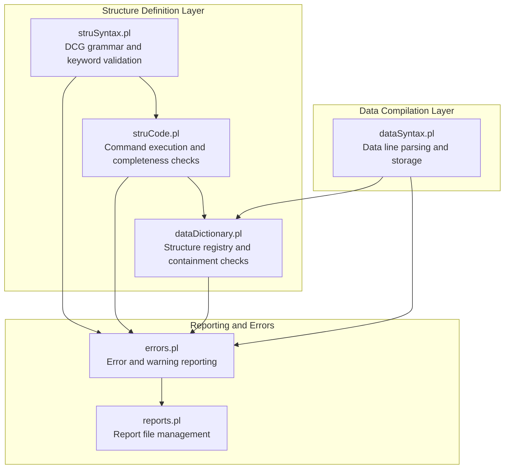
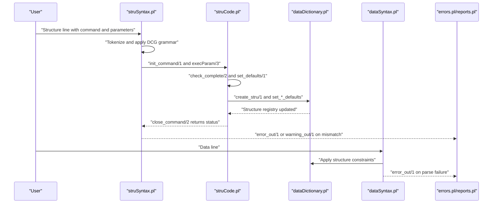
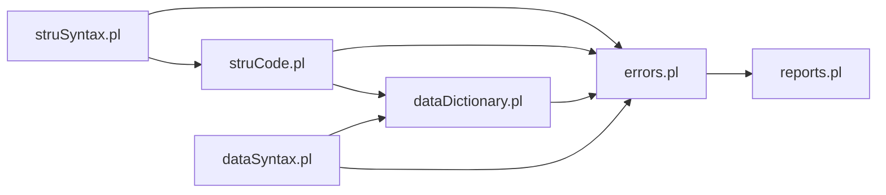

# Validation Rules

<cite>
**Referenced Files in This Document**
- [struCode.pl](file://src/struCode.pl)
- [struSyntax.pl](file://src/struSyntax.pl)
- [dataDictionary.pl](file://src/dataDictionary.pl)
- [errors.pl](file://src/errors.pl)
- [reports.pl](file://src/reports.pl)
- [dataSyntax.pl](file://src/dataSyntax.pl)
- [elements.yaml](file://src/stru/elements.yaml)
- [groups.yaml](file://src/stru/groups.yaml)
- [system.yaml](file://src/stru/system.yaml)
- [sources-structure.yaml](file://src/stru/sources-structure.yaml)
</cite>

## Table of Contents
1. [Introduction](#introduction)
2. [Project Structure](#project-structure)
3. [Core Components](#core-components)
4. [Architecture Overview](#architecture-overview)
5. [Detailed Component Analysis](#detailed-component-analysis)
6. [Dependency Analysis](#dependency-analysis)
7. [Performance Considerations](#performance-considerations)
8. [Troubleshooting Guide](#troubleshooting-guide)
9. [Conclusion](#conclusion)
10. [Appendices](#appendices)

## Introduction
This document explains the validation framework for the Kleio structure system. It covers how syntax validation, semantic validation, and constraint enforcement are implemented and enforced during document processing. It describes how validation rules are defined in structure files and how they are applied to incoming data. It also documents error handling, validation reporting, debugging techniques, and performance considerations for validation.

## Project Structure
The validation pipeline spans three layers:
- Structure file parsing and validation: syntax and semantic checks for structure definitions (commands, parameters, and defaults).
- Data file compilation and validation: syntax parsing of data entries and application of structure-defined constraints.
- Reporting and error handling: centralized logging, warnings, and error counts.

**Diagram sources**
- [struSyntax.pl](file://src/struSyntax.pl#L48-L120)
- [struCode.pl](file://src/struCode.pl#L64-L120)
- [dataDictionary.pl](file://src/dataDictionary.pl#L118-L146)
- [dataSyntax.pl](file://src/dataSyntax.pl#L54-L62)
- [errors.pl](file://src/errors.pl#L85-L113)
- [reports.pl](file://src/reports.pl#L51-L106)

**Section sources**
- [struSyntax.pl](file://src/struSyntax.pl#L48-L120)
- [struCode.pl](file://src/struCode.pl#L64-L120)
- [dataDictionary.pl](file://src/dataDictionary.pl#L118-L146)
- [dataSyntax.pl](file://src/dataSyntax.pl#L54-L62)
- [errors.pl](file://src/errors.pl#L85-L113)
- [reports.pl](file://src/reports.pl#L51-L106)

## Core Components
- Structure syntax validation: validates commands, parameters, and values against keyword and value grammars.
- Structure semantic validation: enforces required parameters, defaults, and inter-command dependencies.
- Structure constraint enforcement: maintains group and element registries, containment relationships, and inheritance via source references.
- Data syntax validation: parses data lines and ensures syntactic correctness before storing.
- Reporting and error handling: centralizes error and warning output with counts and optional termination thresholds.

Key responsibilities:
- struSyntax.pl: DCG grammar for commands and values, keyword lookup, and value type validation.
- struCode.pl: command initialization, parameter execution, completeness checks, and default settings.
- dataDictionary.pl: structure registry creation, group/element creation, defaults, containment queries, and inheritance copying.
- dataSyntax.pl: line-by-line data parsing and storage triggers.
- errors.pl and reports.pl: unified error/warning reporting and report file management.

**Section sources**
- [struSyntax.pl](file://src/struSyntax.pl#L12-L36)
- [struCode.pl](file://src/struCode.pl#L15-L47)
- [dataDictionary.pl](file://src/dataDictionary.pl#L39-L85)
- [dataSyntax.pl](file://src/dataSyntax.pl#L6-L23)
- [errors.pl](file://src/errors.pl#L12-L56)
- [reports.pl](file://src/reports.pl#L20-L33)

## Architecture Overview
The validation architecture integrates structure and data processing with a robust error-reporting subsystem.

**Diagram sources**
- [struSyntax.pl](file://src/struSyntax.pl#L48-L120)
- [struCode.pl](file://src/struCode.pl#L91-L120)
- [dataDictionary.pl](file://src/dataDictionary.pl#L118-L146)
- [dataSyntax.pl](file://src/dataSyntax.pl#L54-L62)
- [errors.pl](file://src/errors.pl#L85-L113)
- [reports.pl](file://src/reports.pl#L84-L106)

## Detailed Component Analysis

### Structure Syntax Validation (struSyntax.pl)
- Purpose: Validates structure command syntax and values using a DCG grammar.
- Key behaviors:
  - Keyword recognition with bilingual support (Latin and English).
  - Parameter name validation and value type checks.
  - Value grammar for specific parameters (e.g., type keywords, lists, slash-separated pairs).
  - Command availability and “not yet” statuses.

Validation types:
- Type checking: parameter values constrained to predefined keyword sets (e.g., type keywords).
- Format validation: list parsing, slash-separated name/number pairs, and equality/semicolon tokenization.
- Cross-referencing validation: references to groups/elements in fons parameters are validated during execution.

Common validation patterns:
- Parameter existence and correct naming.
- Value domain checks for typed parameters.
- Structural dependency checks (e.g., nomen must precede other parameters).

**Section sources**
- [struSyntax.pl](file://src/struSyntax.pl#L103-L135)
- [struSyntax.pl](file://src/struSyntax.pl#L137-L180)
- [struSyntax.pl](file://src/struSyntax.pl#L291-L313)

### Structure Semantic Validation (struCode.pl)
- Purpose: Enforces semantic completeness and defaults for structure commands.
- Key behaviors:
  - Required parameters per command (nomino, pars, terminus, exitus).
  - Default parameter settings for commands.
  - Completeness checks that propagate status to group/element names.
  - Multi-line command caching and retrieval.

Validation types:
- Constraint enforcement: required parameter presence.
- Defaults: sets default values for missing parameters.
- Inter-command dependencies: ensures dependent parameters are processed after required ones.

Common validation patterns:
- RequiredParams lists define mandatory parameters.
- MissingParam traversal logs missing parameters and marks status as notOk.
- Property propagation to names associated with commands.

**Section sources**
- [struCode.pl](file://src/struCode.pl#L343-L346)
- [struCode.pl](file://src/struCode.pl#L328-L337)
- [struCode.pl](file://src/struCode.pl#L128-L146)

### Structure Constraint Enforcement (dataDictionary.pl)
- Purpose: Maintains the active structure registry and enforces structural constraints.
- Key behaviors:
  - Structure creation and cleanup.
  - Group and element creation with defaults.
  - Containment relationships and inheritance via source references.
  - Copying of properties from source groups/elements to derived ones.

Validation types:
- Containment validation: determines whether a group is contained by another (directly or via inheritance).
- Inheritance validation: copies properties from source groups/elements to derived definitions.
- Identification and uniqueness: enforces identification flags and id prefixes.

Common validation patterns:
- contained_by/2 backtracking to ancestors and caching of containment results.
- copy_fons_g/2 and copy_fons_e/2 to propagate source properties.
- set_*_defaults/1 to initialize default flags and identifiers.

**Section sources**
- [dataDictionary.pl](file://src/dataDictionary.pl#L184-L261)
- [dataDictionary.pl](file://src/dataDictionary.pl#L614-L642)
- [dataDictionary.pl](file://src/dataDictionary.pl#L478-L512)

### Data Syntax Validation (dataSyntax.pl)
- Purpose: Validates and compiles data lines according to the active structure.
- Key behaviors:
  - Line-by-line parsing with triple/double-quote handling.
  - Recognition of group, element, aspect, and entry boundaries.
  - Storage triggers for new group, element, aspect, and entry.

Validation types:
- Syntax validation: ensures proper separators and quoting rules.
- Structural alignment: verifies that elements and groups conform to the active structure.

Common validation patterns:
- Triple-quote and double-quote handling for literal content.
- Aspect markers (#, %, ;) and entry separators (;) are parsed and stored.
- Unknown or malformed constructs trigger errors.

**Section sources**
- [dataSyntax.pl](file://src/dataSyntax.pl#L65-L111)
- [dataSyntax.pl](file://src/dataSyntax.pl#L127-L141)

### Structure Definitions and Validation Logic (YAML and Generated Structures)
Structure definitions are expressed in YAML and can be generated into structured forms for validation.

- elements.yaml: defines base elements and their metadata (identification flags, types).
- groups.yaml: defines groups, their positions, guarantees, and inheritance via source.
- system.yaml: includes elements and groups to form the base structure.
- sources-structure.yaml: generated structure reflecting the base elements and groups.

Validation implications:
- Identification flags drive uniqueness checks during processing.
- Guaranteed lists and position ordering constrain data entry layout.
- Source references enable inheritance of properties across specialized groups/elements.

**Section sources**
- [elements.yaml](file://src/stru/elements.yaml#L39-L221)
- [groups.yaml](file://src/stru/groups.yaml#L32-L259)
- [system.yaml](file://src/stru/system.yaml#L1-L4)
- [sources-structure.yaml](file://src/stru/sources-structure.yaml#L1-L800)

### Error Handling, Validation Reporting, and Debugging
- Centralized error/warning reporting with context (file, line number, surrounding lines).
- Counters track errors and warnings; optional threshold-based abortion.
- Report files capture all messages and can be directed to console or file.

Common validation patterns:
- error_out/1 and error_out/2 emit contextualized errors.
- warning_out/1 and warning_out/2 emit warnings.
- check_continuation/0 enforces maximum error thresholds.

Debugging techniques:
- Review last and current lines for context.
- Inspect report files for detailed error trails.
- Use show_stru/0 and show_groups/0 to inspect current structure state.

**Section sources**
- [errors.pl](file://src/errors.pl#L85-L113)
- [errors.pl](file://src/errors.pl#L135-L167)
- [errors.pl](file://src/errors.pl#L186-L198)
- [reports.pl](file://src/reports.pl#L51-L106)
- [dataDictionary.pl](file://src/dataDictionary.pl#L689-L704)

## Dependency Analysis
The validation system exhibits tight coupling among structure parsing, execution, and registry maintenance, with clear separation of concerns for reporting and data compilation.

**Diagram sources**
- [struSyntax.pl](file://src/struSyntax.pl#L37-L42)
- [struCode.pl](file://src/struCode.pl#L49-L55)
- [dataDictionary.pl](file://src/dataDictionary.pl#L87-L100)
- [dataSyntax.pl](file://src/dataSyntax.pl#L24-L28)
- [errors.pl](file://src/errors.pl#L57-L60)
- [reports.pl](file://src/reports.pl#L13-L18)

**Section sources**
- [struSyntax.pl](file://src/struSyntax.pl#L37-L42)
- [struCode.pl](file://src/struCode.pl#L49-L55)
- [dataDictionary.pl](file://src/dataDictionary.pl#L87-L100)
- [dataSyntax.pl](file://src/dataSyntax.pl#L24-L28)
- [errors.pl](file://src/errors.pl#L57-L60)
- [reports.pl](file://src/reports.pl#L13-L18)

## Performance Considerations
- Grammar-driven parsing: DCG-based parsing minimizes branching and leverages backtracking efficiently.
- Containment caching: cached containment results reduce repeated containment checks across large hierarchies.
- Thread-local properties: reduces contention for concurrent validations.
- Early exits: missing required parameters and invalid values short-circuit further processing.

Optimization strategies:
- Prefer precomputed defaults to avoid repeated computation.
- Use cached containment results for deep hierarchies.
- Limit report verbosity in production runs to reduce IO overhead.
- Batch report writes to minimize filesystem operations.

[No sources needed since this section provides general guidance]

## Troubleshooting Guide
Common validation issues and resolutions:
- Missing required parameters: Ensure all required parameters are present for nomino, pars, terminus, and exitus commands.
- Unknown parameter names or values: Verify parameter names against keyword lists and value grammars.
- Structural inconsistencies: Confirm that fons references resolve to existing groups/elements and that inheritance is correctly applied.
- Data syntax errors: Check quoting, separators, and aspect markers in data lines.

Debugging steps:
- Enable report files and review contextualized error messages.
- Use show_stru/0 and show_groups/0 to inspect current structure state.
- Temporarily increase verbosity for detailed parsing traces.

**Section sources**
- [struCode.pl](file://src/struCode.pl#L328-L337)
- [struSyntax.pl](file://src/struSyntax.pl#L103-L121)
- [dataDictionary.pl](file://src/dataDictionary.pl#L614-L642)
- [dataSyntax.pl](file://src/dataSyntax.pl#L54-L62)
- [errors.pl](file://src/errors.pl#L135-L167)
- [reports.pl](file://src/reports.pl#L51-L106)

## Conclusion
The Kleio validation framework combines DCG-based syntax validation, semantic completeness checks, and structural constraint enforcement to ensure robust and consistent processing of both structure and data files. Centralized error reporting and caching mechanisms provide reliability and performance. By leveraging structure definitions and inheritance, the system supports extensible and maintainable validation rules across diverse schemas.

[No sources needed since this section summarizes without analyzing specific files]

## Appendices

### Validation Rule Composition Guidelines
- Define required parameters per command to enforce structural completeness.
- Use identification flags and guaranteed lists to enforce uniqueness and presence constraints.
- Leverage source references to propagate inherited properties and reduce duplication.
- Keep value domains constrained via keyword lists and typed parameters.

[No sources needed since this section provides general guidance]