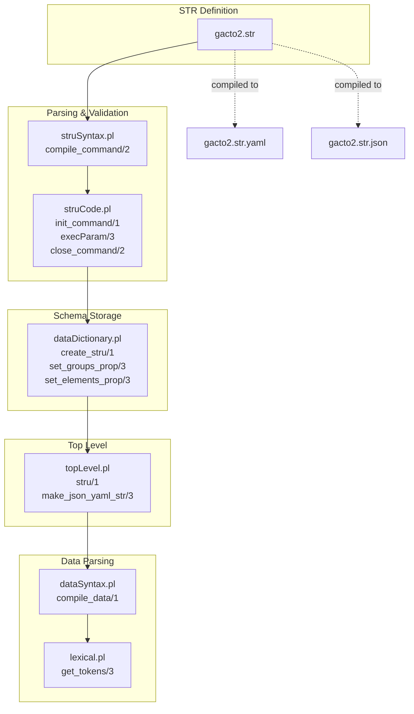
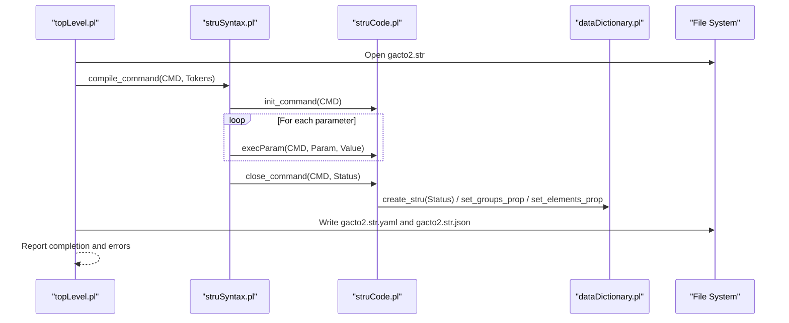
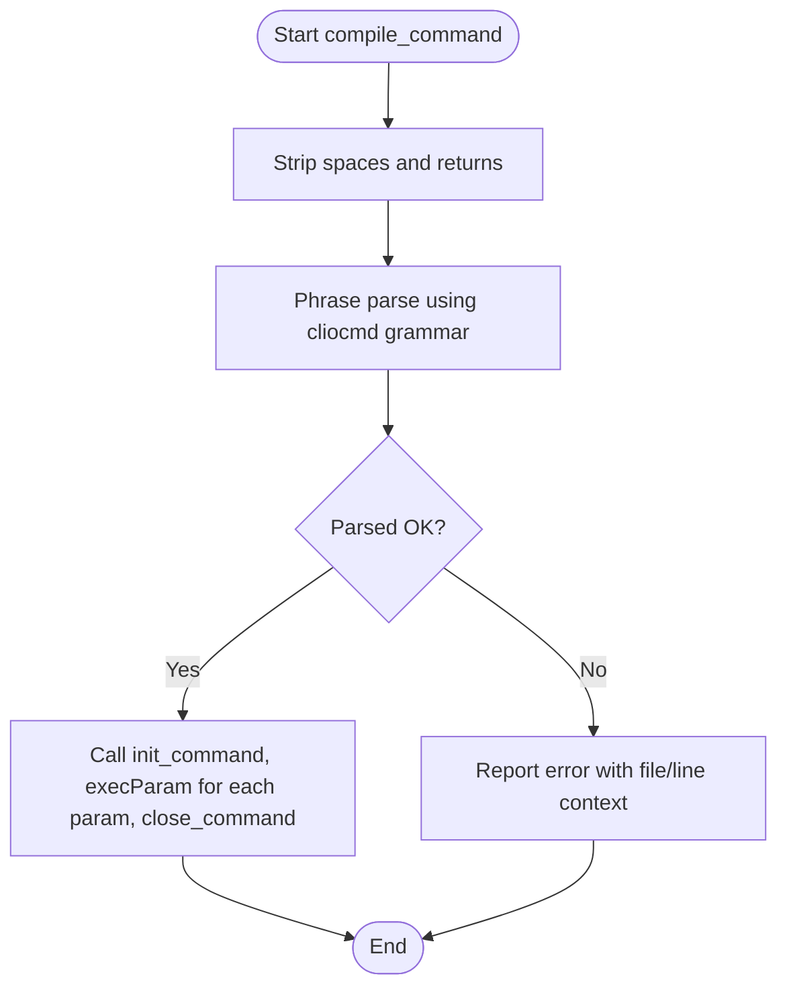
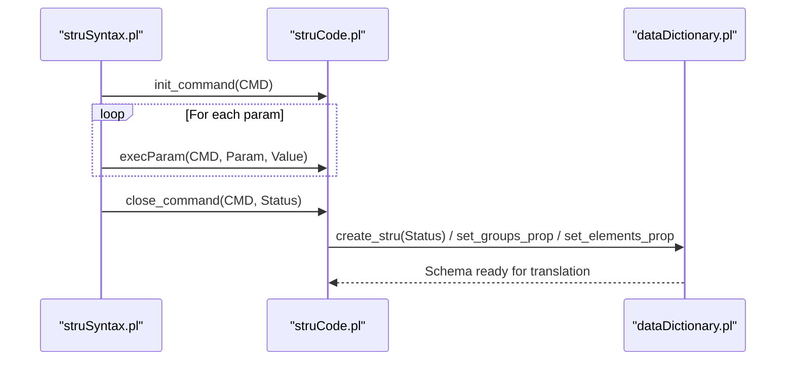
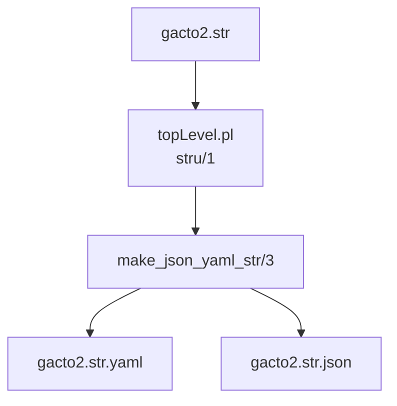
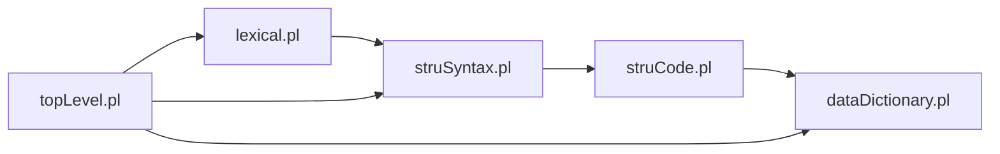

# STR File Format

<cite>
**Referenced Files in This Document**
- [gacto2.str](file://src/stru/gacto2.str)
- [gacto2.srpt](file://src/stru/gacto2.srpt)
- [gacto2.str.yaml](file://src/stru/gacto2.str.yaml)
- [gacto2.str.json](file://src/stru/gacto2.str.json)
- [struSyntax.pl](file://src/struSyntax.pl)
- [struCode.pl](file://src/struCode.pl)
- [dataDictionary.pl](file://src/dataDictionary.pl)
- [topLevel.pl](file://src/topLevel.pl)
- [dataSyntax.pl](file://src/dataSyntax.pl)
- [lexical.pl](file://src/lexical.pl)
</cite>

## Table of Contents
1. [Introduction](#introduction)
2. [Project Structure](#project-structure)
3. [Core Components](#core-components)
4. [Architecture Overview](#architecture-overview)
5. [Detailed Component Analysis](#detailed-component-analysis)
6. [Dependency Analysis](#dependency-analysis)
7. [Performance Considerations](#performance-considerations)
8. [Troubleshooting Guide](#troubleshooting-guide)
9. [Conclusion](#conclusion)
10. [Appendices](#appendices)

## Introduction
This document explains the STR file format used by timelink-kleio for defining hierarchical schemas that drive source processing. STR files declare elements and groups, establish inheritance and composition relationships, and define how Kleio data files are parsed and translated into structured output. The repository’s canonical STR schema is gacto2.str, which defines a comprehensive structure for historical sources (e.g., Portuguese parish records, notarial acts, and specialized registries). The STR format is processed by two complementary layers:
- Syntax validation and parsing: handled by struSyntax.pl and struCode.pl
- Schema compilation and runtime storage: handled by dataDictionary.pl and invoked from topLevel.pl

Additionally, STR definitions are compiled into machine-readable artifacts (.yaml and .json) for documentation and tooling support.

## Project Structure
The STR ecosystem centers around:
- STR definition files (e.g., gacto2.str)
- Syntax and code modules (struSyntax.pl, struCode.pl)
- Runtime schema storage (dataDictionary.pl)
- Top-level orchestration (topLevel.pl)
- Data file parsing (dataSyntax.pl, lexical.pl)

**Diagram sources**
- [gacto2.str](file://src/stru/gacto2.str#L1-L120)
- [struSyntax.pl](file://src/struSyntax.pl#L48-L120)
- [struCode.pl](file://src/struCode.pl#L90-L140)
- [dataDictionary.pl](file://src/dataDictionary.pl#L106-L141)
- [topLevel.pl](file://src/topLevel.pl#L106-L130)
- [dataSyntax.pl](file://src/dataSyntax.pl#L38-L112)
- [lexical.pl](file://src/lexical.pl#L27-L74)

**Section sources**
- [gacto2.str](file://src/stru/gacto2.str#L1-L120)
- [topLevel.pl](file://src/topLevel.pl#L106-L130)

## Core Components
- STR syntax and semantics are defined by commands and parameters in STR files. The primary commands are:
  - database: declares the top-level document group and default identification behavior
  - element: declares reusable atomic fields (e.g., id, name, date)
  - part: declares hierarchical groups (e.g., person, object, historical-act)
  - Also, auxiliary directives like also, position, guaranteed, repeat, arbitrary, source, and others shape composition and inheritance
- struSyntax.pl validates and parses STR commands using a grammar-driven approach and keyword recognition
- struCode.pl executes command semantics, stores properties, and performs completeness checks
- dataDictionary.pl persists the compiled schema into runtime predicates and properties
- topLevel.pl orchestrates STR processing, triggers YAML/JSON generation, and coordinates error reporting

Key roles:
- Element declaration: element statements define typed fields used across groups
- Group composition: part statements define containment, ordering, and optional/repeated subgroups
- Inheritance: source parameters enable specialization (e.g., male inherits from person)
- Validation: required parameters and completeness checks ensure schema integrity

**Section sources**
- [gacto2.str](file://src/stru/gacto2.str#L24-L120)
- [struSyntax.pl](file://src/struSyntax.pl#L121-L180)
- [struCode.pl](file://src/struCode.pl#L148-L214)
- [dataDictionary.pl](file://src/dataDictionary.pl#L106-L141)

## Architecture Overview
The STR processing pipeline transforms a human-authored STR file into an executable schema and supporting artifacts.

**Diagram sources**
- [topLevel.pl](file://src/topLevel.pl#L106-L130)
- [struSyntax.pl](file://src/struSyntax.pl#L48-L83)
- [struCode.pl](file://src/struCode.pl#L90-L140)
- [dataDictionary.pl](file://src/dataDictionary.pl#L106-L141)

## Detailed Component Analysis

### STR Syntax and Structure
- STR files are composed of comments, declarations, and directives. Declarations include:
  - database: establishes the top-level document group and default identification behavior
  - element: defines typed fields (e.g., id, name, date, number, string64, string256, text)
  - part: defines hierarchical groups (e.g., historical-source, person, object, attribute, relation)
- Composition directives:
  - also: declares additional elements present in a group
  - position: defines the display order of elements
  - guaranteed: marks required elements for a group
  - repeat: allows repeated subgroups
  - arbitrary: permits free-form subgroups not explicitly enumerated
  - source: enables inheritance/specialization (e.g., male inherits from person)
- Real-world example patterns from gacto2.str:
  - Base types and identification: id, same_as, xsame_as, entity, type, class, ref, loc, page, pages, name, sex, obs, description, summary, value, origin, destination, destname, replace, inside, groupname, level, line, kleiofile
  - Historical source model: historical-source with parts historical-act and event
  - Person/object taxonomy: person, male, female, object, abstraction, topic
  - Attributes and relations: attribute, relation, and specialized relation-type groups
  - Portuguese-specific acts: cas, termo, bap, b, obito, o, integr, acao, lcc, devassa, denuncia, nom, amz, vereacao, pauta, eleicao, juramento, hab, proc, po, beneficio, chanc, encarte, arrolamento, capela, ar, lista, ordenancas, credito, milicias, rmerce, merce, let, lbach, rol, fogo, crisma, escritura, bem, divida, garantia, fianca, siza, sisa, aforamento, prazo, arrendamento, escambo, obra
  - Authority registers: authority-register, identifications, and authority-record groups (rentity, rperson, robject) with occurrences (occ)

These patterns demonstrate:
- Hierarchical specialization via source
- Controlled composition via also, position, guaranteed
- Flexible extension via repeat and arbitrary
- Clear identification semantics via id and identification flags

**Section sources**
- [gacto2.str](file://src/stru/gacto2.str#L24-L120)
- [gacto2.str](file://src/stru/gacto2.str#L110-L200)
- [gacto2.str](file://src/stru/gacto2.str#L200-L400)
- [gacto2.str](file://src/stru/gacto2.str#L400-L800)
- [gacto2.str](file://src/stru/gacto2.str#L800-L1200)

### STR Parsing and Validation (struSyntax.pl)
- compile_command/2 tokenizes and parses STR commands using a grammar. It strips whitespace, recognizes commands, validates parameters against allowed keyword sets, and delegates execution to struCode.pl
- Keyword handling:
  - Latin and English keywords are supported; struSyntax.pl resolves ambiguities and maps equivalents
  - Parameters are validated against allowed sets per command
- Error reporting:
  - On parse failure, detailed context (file, line number, last line text) is captured
  - Unknown commands and bad parameters are reported with actionable messages

**Diagram sources**
- [struSyntax.pl](file://src/struSyntax.pl#L48-L83)
- [struSyntax.pl](file://src/struSyntax.pl#L93-L120)

**Section sources**
- [struSyntax.pl](file://src/struSyntax.pl#L48-L120)
- [struSyntax.pl](file://src/struSyntax.pl#L121-L214)

### STR Processing and Schema Compilation (struCode.pl, dataDictionary.pl)
- struCode.pl:
  - Initializes command processing, sets defaults, and accumulates parameter values
  - Executes parameter actions (e.g., storing group/element properties)
  - Performs completeness checks (required parameters) and signals status
- dataDictionary.pl:
  - Persists the compiled schema into runtime predicates and properties
  - Provides predicates to query group ancestry, containment, and element membership
  - Cleans and reinitializes schema definitions per file

**Diagram sources**
- [struCode.pl](file://src/struCode.pl#L90-L140)
- [struCode.pl](file://src/struCode.pl#L148-L214)
- [dataDictionary.pl](file://src/dataDictionary.pl#L106-L141)

**Section sources**
- [struCode.pl](file://src/struCode.pl#L90-L140)
- [struCode.pl](file://src/struCode.pl#L148-L214)
- [dataDictionary.pl](file://src/dataDictionary.pl#L106-L141)

### STR Translation Artifacts (.yaml and .json)
- After processing a STR file, topLevel.pl generates:
  - gacto2.str.yaml: a YAML serialization of the schema for documentation and tooling
  - gacto2.str.json: a JSON serialization for programmatic consumption
- These artifacts mirror the STR definitions and are used for downstream tooling and validation.

**Diagram sources**
- [topLevel.pl](file://src/topLevel.pl#L118-L130)
- [gacto2.str.yaml](file://src/stru/gacto2.str.yaml#L1-L40)
- [gacto2.str.json](file://src/stru/gacto2.str.json#L1-L40)

**Section sources**
- [topLevel.pl](file://src/topLevel.pl#L118-L130)
- [gacto2.str.yaml](file://src/stru/gacto2.str.yaml#L1-L40)
- [gacto2.str.json](file://src/stru/gacto2.str.json#L1-L40)

### Data File Parsing Context (for completeness)
While STR files define the schema, dataSyntax.pl and lexical.pl handle parsing of actual data files using the compiled schema. This ensures that data entries conform to the declared groups and elements.

**Section sources**
- [dataSyntax.pl](file://src/dataSyntax.pl#L38-L112)
- [lexical.pl](file://src/lexical.pl#L27-L74)

## Dependency Analysis
The STR subsystem exhibits clear separation of concerns:
- struSyntax.pl depends on lexical.pl for tokenization and on struCode.pl for command execution
- struCode.pl depends on dataDictionary.pl for schema persistence and on utilities/errors for reporting
- dataDictionary.pl depends on persistence and utilities for property management
- topLevel.pl orchestrates the end-to-end flow and invokes YAML/JSON generation

**Diagram sources**
- [lexical.pl](file://src/lexical.pl#L27-L74)
- [struSyntax.pl](file://src/struSyntax.pl#L37-L47)
- [struCode.pl](file://src/struCode.pl#L49-L56)
- [dataDictionary.pl](file://src/dataDictionary.pl#L86-L97)
- [topLevel.pl](file://src/topLevel.pl#L34-L58)

**Section sources**
- [lexical.pl](file://src/lexical.pl#L27-L74)
- [struSyntax.pl](file://src/struSyntax.pl#L37-L47)
- [struCode.pl](file://src/struCode.pl#L49-L56)
- [dataDictionary.pl](file://src/dataDictionary.pl#L86-L97)
- [topLevel.pl](file://src/topLevel.pl#L34-L58)

## Performance Considerations
- STR parsing is line-oriented and uses grammar-driven tokenization; performance primarily depends on file size and number of declarations
- YAML/JSON generation runs after schema processing; it is generally fast but scales with the number of elements and groups
- Best practices:
  - Keep STR files modular and reuse elements via source/specialization to reduce duplication
  - Use repeat and arbitrary judiciously to avoid excessive memory usage in translation
  - Validate early with small test datasets to catch structural issues before large-scale translation

[No sources needed since this section provides general guidance]

## Troubleshooting Guide
Common issues and resolutions:
- Unknown command or parameter:
  - Symptom: Error indicating an unknown command or parameter
  - Resolution: Verify keyword spelling and ensure parameters belong to the command’s allowed set
- Missing required parameters:
  - Symptom: Completeness check fails for a command
  - Resolution: Add required parameters (e.g., nomen, primum for nomino; nomen for pars/terminus)
- Bad parameter values:
  - Symptom: Parameter value mismatch or illegal combination
  - Resolution: Align values with allowed keyword sets and grammatical forms
- Inheritance and specialization errors:
  - Symptom: Errors related to source/specialization or missing parent groups
  - Resolution: Ensure parent groups are declared before children and that source references are valid
- Post-processing artifacts:
  - Symptom: Missing or inconsistent YAML/JSON outputs
  - Resolution: Re-run stru/1 and check error counts; ensure no parse failures

Debugging tips:
- Use the error reporting hooks in struSyntax.pl and struCode.pl to capture file, line number, and last line text
- Validate small subsets of STR definitions incrementally
- Compare generated YAML/JSON with the original STR to spot discrepancies

**Section sources**
- [struSyntax.pl](file://src/struSyntax.pl#L48-L83)
- [struSyntax.pl](file://src/struSyntax.pl#L113-L120)
- [struCode.pl](file://src/struCode.pl#L306-L336)
- [topLevel.pl](file://src/topLevel.pl#L118-L130)

## Conclusion
STR files in timelink-kleio define a powerful, hierarchical schema language that supports precise modeling of historical sources. Through struSyntax.pl and struCode.pl, STR definitions are validated and compiled into a runtime schema managed by dataDictionary.pl. The system produces human-readable and machine-consumable artifacts (.yaml/.json) for documentation and tooling. By following best practices—careful use of inheritance, composition directives, and incremental validation—you can maintain robust, scalable STR schemas that evolve over time while preserving backward compatibility.

[No sources needed since this section summarizes without analyzing specific files]

## Appendices

### Appendix A: STR Commands and Parameters Reference
- database: declares the top-level document group and default identification behavior
- element: declares typed fields (e.g., id, name, date, number, string64, string256, text)
- part: declares hierarchical groups with composition directives:
  - also: additional elements
  - position: ordering
  - guaranteed: required elements
  - repeat: repeated subgroups
  - arbitrary: free-form subgroups
  - source: inheritance/specialization
- Additional directives:
  - idprefix/prefix/suffix: control ID generation prefixes
  - identification: marks identification semantics
  - type/class/ref/loc/page/pages/obs/description/summary/value/origin/destination/destname/replace/inside/groupname/level/line/kleiofile: standard fields

**Section sources**
- [gacto2.str](file://src/stru/gacto2.str#L24-L120)
- [gacto2.str](file://src/stru/gacto2.str#L110-L200)
- [gacto2.str](file://src/stru/gacto2.str#L200-L400)

### Appendix B: STR to Compiled Artifacts
- gacto2.srpt: processing report indicating successful compilation and zero errors/warnings
- gacto2.str.yaml and gacto2.str.json: generated artifacts mirroring the STR schema for documentation and tooling

**Section sources**
- [gacto2.srpt](file://src/stru/gacto2.srpt#L1-L10)
- [gacto2.str.yaml](file://src/stru/gacto2.str.yaml#L1-L40)
- [gacto2.str.json](file://src/stru/gacto2.str.json#L1-L40)