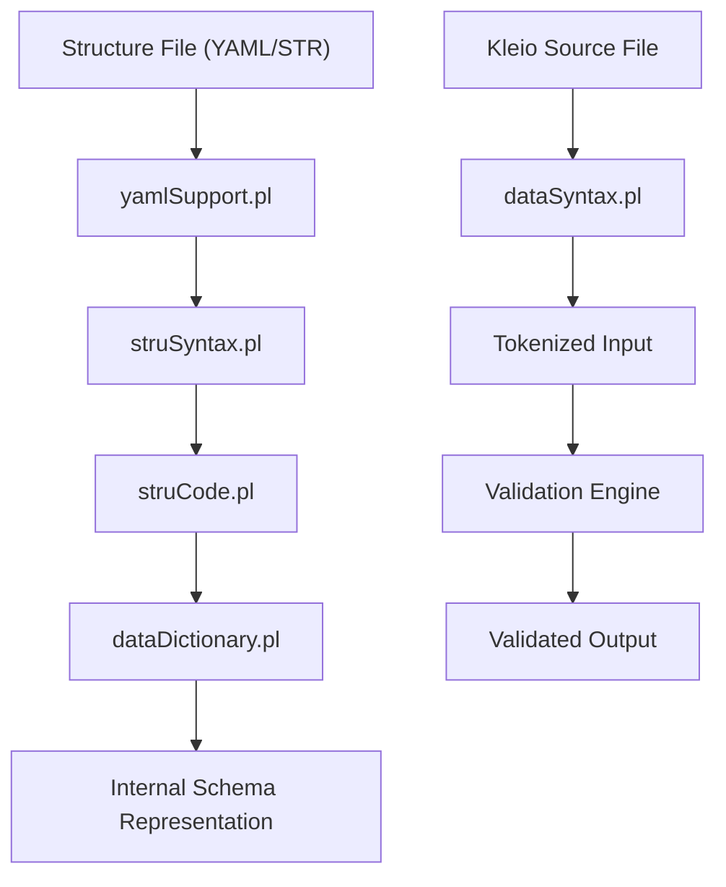
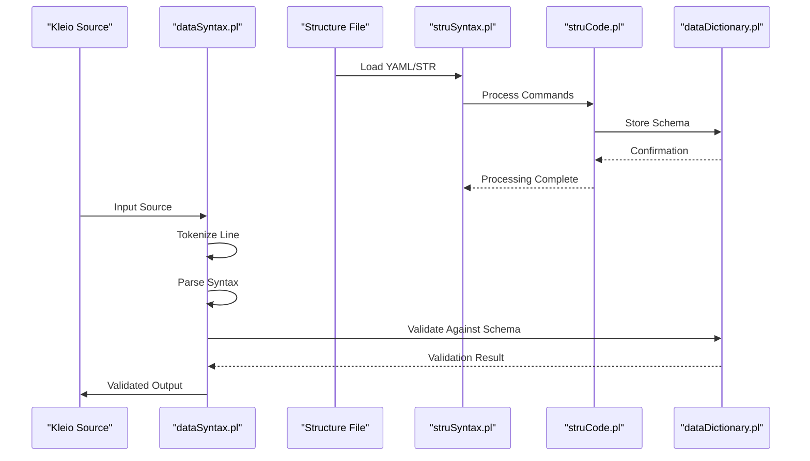
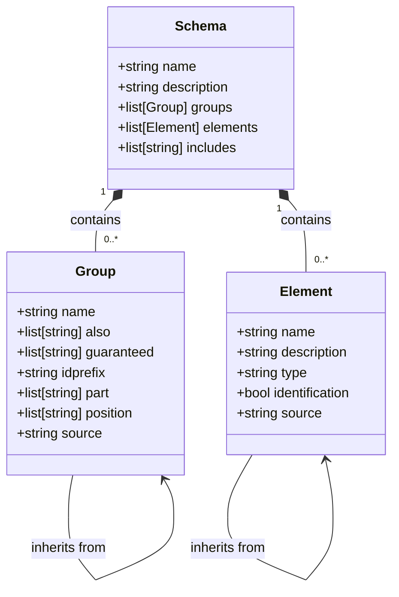
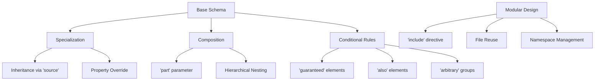
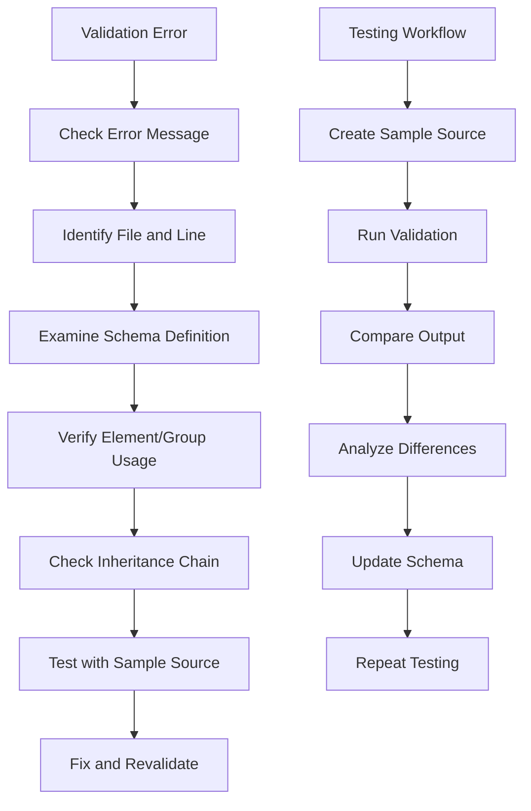

# Schema Design and Validation

<cite>
**Referenced Files in This Document**   
- [dataSyntax.pl](file://src/dataSyntax.pl)
- [struCode.pl](file://src/struCode.pl)
- [struSyntax.pl](file://src/struSyntax.pl)
- [yamlSupport.pl](file://src/yamlSupport.pl)
- [dataDictionary.pl](file://src/dataDictionary.pl)
- [elements.yaml](file://src/stru/elements.yaml)
- [groups.yaml](file://src/stru/groups.yaml)
- [sources-structure.yaml](file://src/stru/sources-structure.yaml)
- [system.yaml](file://src/stru/system.yaml)
- [test_duplicate_include.yaml](file://tests/kleio-home/structures/test_duplicate_include.yaml)
</cite>

## Table of Contents
1. [Introduction](#introduction)
2. [Structure File Formats](#structure-file-formats)
3. [Validation Pipeline](#validation-pipeline)
4. [Schema Design Principles](#schema-design-principles)
5. [Design Patterns](#design-patterns)
6. [Performance Considerations](#performance-considerations)
7. [Troubleshooting and Testing](#troubleshooting-and-testing)
8. [Conclusion](#conclusion)

## Introduction
The timelink-kleio system employs a sophisticated schema validation mechanism to ensure the integrity and consistency of Kleio source files during translation. The validation process relies on structure files (STR/YAML) that define the rules for data organization, element constraints, group membership, and hierarchical relationships. This document details the schema design and validation framework, explaining how structure files are processed, how validation is enforced, and best practices for creating maintainable and extensible schemas.

**Section sources**
- [dataSyntax.pl](file://src/dataSyntax.pl#L1-L194)
- [struCode.pl](file://src/struCode.pl#L1-L391)
- [struSyntax.pl](file://src/struSyntax.pl#L1-L417)

## Structure File Formats
The timelink-kleio system supports both legacy STR format and modern YAML format for structure definitions. The YAML format has become the preferred choice due to its readability and support for advanced features like file inclusion and hierarchical organization.

YAML structure files use a list-based format where each item represents either a file metadata declaration, an include directive, or a schema component (element or group). The `include` directive allows modular schema design by incorporating definitions from other files, promoting reuse and reducing duplication.

The system provides a base structure in `system.yaml` that includes core definitions from `groups.yaml` and `elements.yaml`. These files contain fundamental building blocks that can be specialized for specific use cases. For example, `elements.yaml` defines basic data types like `number`, `string64`, and `date`, while `groups.yaml` defines structural components like `historical-source`, `person`, and `event`.

**Diagram sources**
- [yamlSupport.pl](file://src/yamlSupport.pl#L1-L273)
- [struSyntax.pl](file://src/struSyntax.pl#L1-L417)
- [struCode.pl](file://src/struCode.pl#L1-L391)
- [dataDictionary.pl](file://src/dataDictionary.pl#L1-L1057)
- [dataSyntax.pl](file://src/dataSyntax.pl#L1-L194)

**Section sources**
- [yamlSupport.pl](file://src/yamlSupport.pl#L1-L273)
- [elements.yaml](file://src/stru/elements.yaml#L1-L217)
- [groups.yaml](file://src/stru/groups.yaml#L1-L259)
- [system.yaml](file://src/stru/system.yaml#L1-L4)

## Validation Pipeline
The validation pipeline in timelink-kleio consists of two main phases: schema compilation and source validation. The process begins with the parsing of structure files by `yamlSupport.pl`, which processes YAML input and converts it into internal representations through `struSyntax.pl` and `struCode.pl`.

The `dataSyntax.pl` module handles the parsing of Kleio source files, tokenizing the input and analyzing its syntactic structure. During this phase, the system checks for proper element usage, group membership, and hierarchical integrity. The validation process is line-by-line, with the system accumulating calls to store elements, groups, and aspects until the end of each line.

The `struCode.pl` module plays a crucial role in processing structure definitions, handling commands like `nomino` (database), `pars` (group), and `terminus` (element). Each command triggers specific actions that build the internal schema representation. The `execParam/3` predicate processes parameter-value pairs, enforcing constraints and storing properties associated with groups and elements.

**Diagram sources**
- [dataSyntax.pl](file://src/dataSyntax.pl#L1-L194)
- [struSyntax.pl](file://src/struSyntax.pl#L1-L417)
- [struCode.pl](file://src/struCode.pl#L1-L391)
- [dataDictionary.pl](file://src/dataDictionary.pl#L1-L1057)

**Section sources**
- [dataSyntax.pl](file://src/dataSyntax.pl#L1-L194)
- [struSyntax.pl](file://src/struSyntax.pl#L1-L417)
- [struCode.pl](file://src/struCode.pl#L1-L391)
- [dataDictionary.pl](file://src/dataDictionary.pl#L1-L1057)

## Schema Design Principles
Effective schema design in timelink-kleio follows several key principles that promote maintainability, extensibility, and consistency. The system emphasizes modularity through the use of include directives, allowing schemas to be composed from reusable components. This approach reduces duplication and makes it easier to maintain consistency across related schemas.

Versioning strategies are supported through file naming conventions and explicit version declarations within structure files. The system allows for backward compatibility by supporting both legacy STR format and modern YAML format, enabling gradual migration of existing schemas.

The design encourages the use of specialization hierarchies, where specific groups and elements inherit properties from more general ones. This is achieved through the `source` parameter, which establishes inheritance relationships. For example, a `female` group can inherit properties from a `person` group while adding gender-specific constraints.

**Diagram sources**
- [dataDictionary.pl](file://src/dataDictionary.pl#L1-L1057)
- [elements.yaml](file://src/stru/elements.yaml#L1-L217)
- [groups.yaml](file://src/stru/groups.yaml#L1-L259)

**Section sources**
- [dataDictionary.pl](file://src/dataDictionary.pl#L1-L1057)
- [elements.yaml](file://src/stru/elements.yaml#L1-L217)
- [groups.yaml](file://src/stru/groups.yaml#L1-L259)

## Design Patterns
The timelink-kleio system supports several common schema design patterns that enhance flexibility and reusability. Inheritance is implemented through the `source` parameter, allowing groups and elements to inherit properties from parent definitions. This enables the creation of specialized types while maintaining consistency with base definitions.

Composition is achieved through the `part` parameter in groups, which specifies which subgroups can be contained within a group. This establishes hierarchical relationships and enforces structural integrity. For example, a `historical-source` group can contain `historical-act` and `event` subgroups, ensuring proper nesting of related data.

Conditional rules are implemented through parameters like `guaranteed`, `also`, and `arbitrary`. The `guaranteed` parameter specifies elements that must be present, while `also` lists optional elements. The `arbitrary` parameter allows for flexible inclusion of certain groups without requiring explicit declaration.

**Diagram sources**
- [groups.yaml](file://src/stru/groups.yaml#L1-L259)
- [elements.yaml](file://src/stru/elements.yaml#L1-L217)
- [sources-structure.yaml](file://src/stru/sources-structure.yaml#L1-L800)

**Section sources**
- [groups.yaml](file://src/stru/groups.yaml#L1-L259)
- [elements.yaml](file://src/stru/elements.yaml#L1-L217)
- [sources-structure.yaml](file://src/stru/sources-structure.yaml#L1-L800)

## Performance Considerations
The performance of schema validation in timelink-kleio is influenced by several factors, including schema complexity, file size, and the number of cross-references. Complex schema designs with deep inheritance hierarchies or extensive use of includes can impact validation speed due to the overhead of resolving dependencies and checking constraints.

To optimize validation speed, it is recommended to minimize the depth of inheritance hierarchies and avoid circular dependencies. The system caches processed commands and schema components to reduce redundant processing, but excessive modularity can negate these benefits by increasing the overhead of file inclusion and resolution.

The validation process is designed to be efficient by processing input line-by-line and accumulating validation checks. However, large files with complex structures may benefit from preprocessing steps that validate against simplified schema subsets before full validation.

**Section sources**
- [struCode.pl](file://src/struCode.pl#L1-L391)
- [yamlSupport.pl](file://src/yamlSupport.pl#L1-L273)
- [dataSyntax.pl](file://src/dataSyntax.pl#L1-L194)

## Troubleshooting and Testing
Troubleshooting schema validation errors in timelink-kleio involves analyzing error messages and understanding common failure patterns. The system provides detailed error reporting that includes file names, line numbers, and specific validation failures. Warnings are issued for non-critical issues like duplicate file inclusions, helping identify potential problems without halting processing.

Testing schema behavior is facilitated through sample source files and automated test suites. The system includes test files like `test_duplicate_include.yaml` that verify the correct handling of edge cases such as duplicate inclusions. The test reports capture differences between expected and actual outputs, enabling systematic validation of schema changes.

Common validation errors include missing required elements, incorrect group nesting, and invalid element values. These can be diagnosed by examining the error context and comparing against the schema definition. The system's modular design allows for isolated testing of schema components, making it easier to identify and fix issues.

**Diagram sources**
- [test_duplicate_include.yaml](file://tests/kleio-home/structures/test_duplicate_include.yaml#L1-L6)
- [test_duplicate_include.srpt](file://tests/kleio-home/structures/test_duplicate_include.srpt#L1-L188)

**Section sources**
- [test_duplicate_include.yaml](file://tests/kleio-home/structures/test_duplicate_include.yaml#L1-L6)
- [test_duplicate_include.srpt](file://tests/kleio-home/structures/test_duplicate_include.srpt#L1-L188)

## Conclusion
The schema design and validation system in timelink-kleio provides a robust framework for ensuring data integrity and consistency in historical document processing. By leveraging YAML-based structure files, the system offers a flexible and maintainable approach to schema definition that supports inheritance, composition, and conditional rules. The validation pipeline efficiently processes Kleio source files against these schemas, enforcing element constraints, group membership rules, and hierarchical integrity. Following best practices for modular design, versioning, and performance optimization enables the creation of scalable and extensible schemas that meet the complex requirements of historical data processing.