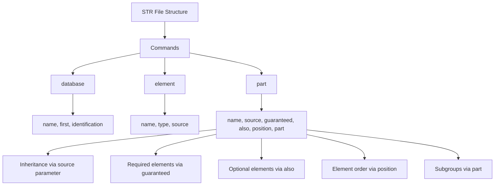
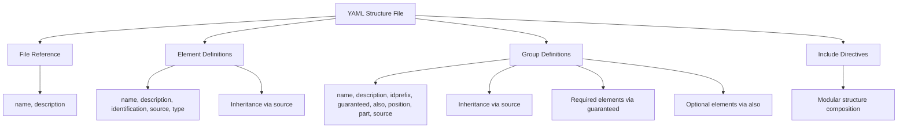
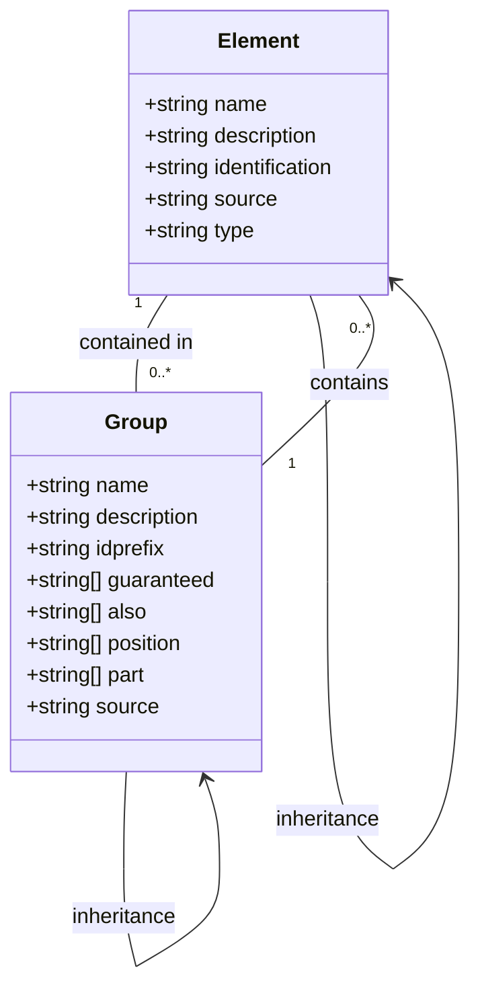
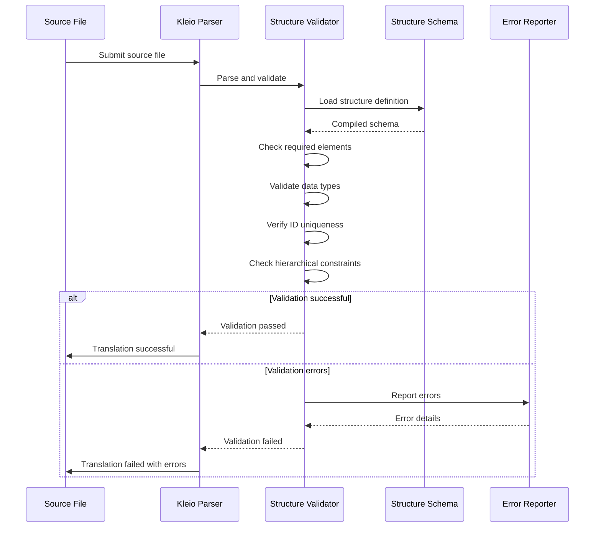
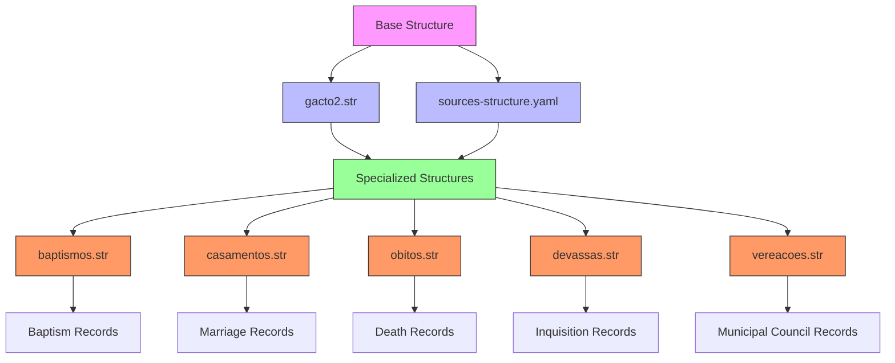
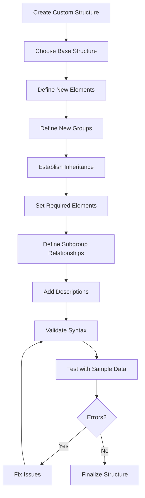
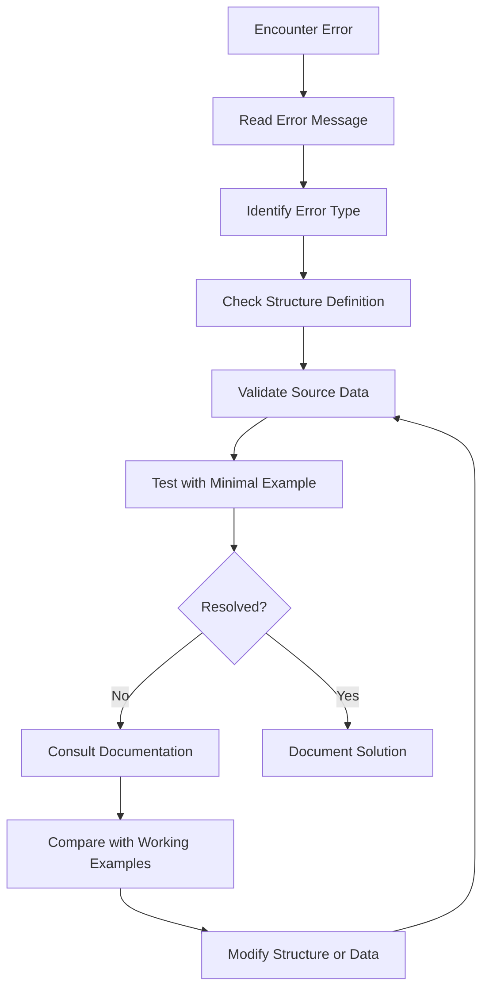
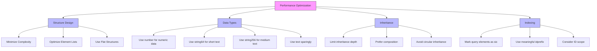

# Structure Definition

<cite>
**Referenced Files in This Document**   
- [gacto2.str](file://src/stru/gacto2.str)
- [sources-structure.yaml](file://src/stru/sources-structure.yaml)
- [elements.yaml](file://src/stru/elements.yaml)
- [groups.yaml](file://src/stru/groups.yaml)
- [system.yaml](file://src/stru/system.yaml)
- [struCode.pl](file://src/struCode.pl)
- [struSyntax.pl](file://src/struSyntax.pl)
- [dataDictionary.pl](file://src/dataDictionary.pl)
</cite>

## Table of Contents
1. [Introduction](#introduction)
2. [STR File Format](#str-file-format)
3. [YAML File Format](#yaml-file-format)
4. [Structure Definition Components](#structure-definition-components)
5. [Structure Validation](#structure-validation)
6. [Inheritance and Composition](#inheritance-and-composition)
7. [Real-World Structure Examples](#real-world-structure-examples)
8. [Creating Custom Structure Files](#creating-custom-structure-files)
9. [Debugging Structure Errors](#debugging-structure-errors)
10. [Performance Optimization](#performance-optimization)
11. [Common Pitfalls and Best Practices](#common-pitfalls-and-best-practices)

## Introduction

The timelink-kleio system uses structure definition files to control the translation process of Kleio notation. These structure files define the schema for processing historical source data, specifying elements, groups, and their hierarchical relationships. The system supports two formats for structure definitions: the traditional STR format and the more flexible YAML format. The preferred format is YAML due to its enhanced readability and editing capabilities.

Structure files like gacto2.str and sources-structure.yaml serve as blueprints for how source files should be interpreted and translated. They define the valid elements and groups that can appear in Kleio notation, their relationships, required fields, and optional fields. This documentation provides a comprehensive guide to understanding and working with these structure definition formats, including syntax, semantics, validation, inheritance, and best practices for creating custom structure files.

**Section sources**
- [README.md](file://src/stru/README.md#L1-L4)

## STR File Format

The STR file format is the classic structure definition format used in timelink-kleio. It uses a domain-specific language with specific syntax for defining elements and groups. The format consists of commands that define the structure, with each command having parameters that specify various properties.

The primary commands in the STR format are:
- `database`: Defines the top-level database structure
- `element`: Defines a data element with its properties
- `part`: Defines a group (or part) and its characteristics

Each command uses a semicolon-separated parameter syntax, where parameters are specified as `parameter=value`. Comments are indicated with the `note` keyword.

Key structural components in STR files include:
- `name`: The identifier for the element or group
- `type`: The data type of an element
- `source`: Indicates inheritance from another element or group
- `guaranteed`: Required elements within a group
- `also`: Optional elements within a group
- `position`: The order in which elements can be specified without explicit naming
- `part`: Subgroups that can be contained within a group

The STR format supports inheritance through the `source` parameter, allowing groups to extend other groups and inherit their properties. This enables a hierarchical structure where specialized groups can build upon more general ones.



**Diagram sources **
- [gacto2.str](file://src/stru/gacto2.str#L1-L800)

**Section sources**
- [gacto2.str](file://src/stru/gacto2.str#L1-L800)
- [struSyntax.pl](file://src/struSyntax.pl#L48-L58)

## YAML File Format

The YAML file format is the preferred method for defining structures in timelink-kleio due to its enhanced flexibility and ease of editing. YAML files provide a more readable and maintainable format for structure definitions compared to the traditional STR format.

YAML structure files use a list-based format where each item represents either a file reference, element definition, or group definition. The structure follows these patterns:

```yaml
- file:
    name: /path/to/source.str
    description: Generated from source.str
- element:
    name: element_name
    description: Description of the element
    identification: sic|non
    source: base_element
    type: data_type
- group:
    name: group_name
    description: Description of the group
    idprefix: prefix
    guaranteed: [required_elements]
    also: [optional_elements]
    position: [ordered_elements]
    part: [subgroups]
    source: parent_group
```

Key advantages of the YAML format include:
- Better readability and maintainability
- Native support for comments using # 
- Hierarchical structure that's easy to understand
- Support for complex data types and nested structures
- Easier version control and diffing

The YAML format maintains compatibility with the STR format by allowing the inclusion of STR files and providing equivalent functionality for all STR features. It also supports the `include` directive to incorporate other YAML files, enabling modular structure definitions.



**Diagram sources **
- [sources-structure.yaml](file://src/stru/sources-structure.yaml#L1-L800)
- [gacto2.str.yaml](file://src/stru/gacto2.str.yaml#L1-L800)

**Section sources**
- [sources-structure.yaml](file://src/stru/sources-structure.yaml#L1-L800)
- [system.yaml](file://src/stru/system.yaml#L1-L4)

## Structure Definition Components

Structure definitions in timelink-kleio consist of two fundamental components: elements and groups. These components work together to define the schema for processing Kleio notation.

### Elements

Elements represent the basic data fields that can appear in Kleio notation. They are defined with specific attributes that determine their behavior:

- **name**: The identifier used to reference the element
- **description**: Documentation explaining the element's purpose
- **identification**: Whether the element serves as an identifier (sic) or not (non)
- **source**: The base element from which this element inherits properties
- **type**: The data type of the element (e.g., numerus, lingua)

Elements can be specialized by creating new elements that use existing elements as their source. This allows for semantic specialization while maintaining consistent processing. For example, the `dia` element is defined with `source: day`, indicating it represents a day value but with Portuguese terminology.

### Groups

Groups represent structured collections of elements and can contain other groups. They are the primary organizational units in structure definitions and correspond to semantic entities in historical sources. Key group attributes include:

- **name**: The identifier for the group
- **description**: Documentation explaining the group's purpose
- **idprefix**: Prefix used for generating IDs within this group
- **guaranteed**: Elements that must be present in instances of this group
- **also**: Optional elements that may appear in instances of this group
- **position**: Order of elements when specified positionally
- **part**: Subgroups that can be contained within this group
- **source**: The parent group from which this group inherits properties

The hierarchical relationship between groups enables the creation of specialized structures that inherit properties from more general ones. For example, the `female` group sources from the `person` group, inheriting all its properties while specializing the sex attribute.



**Diagram sources **
- [elements.yaml](file://src/stru/elements.yaml#L1-L217)
- [groups.yaml](file://src/stru/groups.yaml#L1-L259)

**Section sources**
- [elements.yaml](file://src/stru/elements.yaml#L1-L217)
- [groups.yaml](file://src/stru/groups.yaml#L1-L259)

## Structure Validation

The timelink-kleio system validates source files against structure definitions to ensure data integrity and consistency. This validation process occurs during the translation phase and checks that source files adhere to the rules defined in the structure files.

### Validation Process

The validation process involves several steps:

1. **Structure Loading**: The system loads the structure definition file (STR or YAML) and parses it into an internal representation.
2. **Schema Compilation**: The parsed structure is compiled into a validation schema that can be efficiently applied to source files.
3. **Source File Parsing**: The source file is parsed according to the Kleio notation syntax.
4. **Rule Application**: The validation rules from the structure definition are applied to the parsed source data.
5. **Error Reporting**: Any violations of the structure rules are reported with specific error messages.

### Validation Rules

The system enforces several types of validation rules based on the structure definition:

- **Required Elements**: Checks that all elements listed in the `guaranteed` parameter are present
- **Element Types**: Validates that elements contain data of the expected type
- **ID Uniqueness**: Ensures that identification elements (those with `identification: sic`) have unique values within their scope
- **Hierarchical Constraints**: Verifies that groups appear in valid contexts according to their `part` relationships
- **Positional Constraints**: Validates that positionally specified elements appear in the correct order

The validation process is implemented in the `dataDictionary.pl` module, which stores the structure information and provides predicates for checking compliance. The `create_stru/1` predicate initializes the structure definition, while various `get_prop/3` and `set_prop/3` predicates manage the properties of elements and groups during validation.



**Diagram sources **
- [dataDictionary.pl](file://src/dataDictionary.pl#L106-L121)
- [struCode.pl](file://src/struCode.pl#L306-L336)

**Section sources**
- [dataDictionary.pl](file://src/dataDictionary.pl#L1-L200)
- [struCode.pl](file://src/struCode.pl#L1-L391)

## Inheritance and Composition

The timelink-kleio structure system supports both inheritance and composition as mechanisms for organizing and reusing schema definitions. These features enable the creation of flexible, maintainable structure definitions that can adapt to various historical source types.

### Inheritance

Inheritance is implemented through the `source` parameter in both element and group definitions. When a component specifies a source, it inherits all properties from that source component. This creates an "is-a" relationship where the specialized component is a type of the source component.

For elements, inheritance allows semantic specialization while maintaining consistent processing. For example:
```yaml
- element:
    name: dia
    source: day
    description: Day in Portuguese sources
```

For groups, inheritance enables the creation of specialized historical record types that build upon more general ones. For example:
```yaml
- group:
    name: female
    source: person
    description: Female person with sex automatically set to 'f'
```

The inheritance mechanism ensures that all properties (guaranteed elements, optional elements, subgroups, etc.) from the source are inherited, unless explicitly overridden in the specialized component.

### Composition

Composition is implemented through the `part` parameter in group definitions, which specifies what subgroups can be contained within a group. This creates a "has-a" relationship between components.

The `part` parameter defines the hierarchical structure of the data model, specifying which groups can appear as children of other groups. For example, the `historical-source` group includes `historical-act` and `event` in its part list, indicating that these act types can appear within historical sources.

Composition enables the creation of complex, nested data structures that reflect the hierarchical nature of historical documents. It also supports multiple composition patterns:
- **Exclusive composition**: Using `solum` to specify that only certain subgroups are allowed
- **Arbitrary composition**: Using `arbitrary` to allow flexible inclusion of certain group types
- **Repeated composition**: Using `repeat` to allow multiple instances of subgroups

The combination of inheritance and composition allows for sophisticated schema design, where general patterns are defined once and specialized as needed for specific historical source types.

```mermaid
classDiagram
class Element {
+name
+description
+identification
+source
+type
}
class Group {
+name
+description
+idprefix
+guaranteed
+also
+position
+part
+source
}
Group "1" --> "0..*" Group : part
Group "1" --> "0..*" Element : contains
Element --> Element : source
Group --> Group : source
note right of Element
Inheritance via source parameter
Creates "is-a" relationship
end note
note right of Group
Composition via part parameter
Creates "has-a" relationship
end note
```

**Diagram sources **
- [gacto2.str](file://src/stru/gacto2.str#L290-L293)
- [sources-structure.yaml](file://src/stru/sources-structure.yaml#L594-L624)

**Section sources**
- [gacto2.str](file://src/stru/gacto2.str#L1-L800)
- [sources-structure.yaml](file://src/stru/sources-structure.yaml#L1-L800)

## Real-World Structure Examples

The timelink-kleio repository contains several real-world examples of structure definitions that demonstrate practical applications of the STR and YAML formats. These examples illustrate how structure files control the translation process for different types of historical sources.

### gacto2.str Example

The gacto2.str file represents a comprehensive structure definition for the Source-Act-Person model, extended with geoentities and authority registers. This structure serves as a reference version for processing various historical sources.

Key features of gacto2.str include:
- **System Definitions**: Base data types and core groups like `kleio`, `historical-source`, and `authority-register`
- **Person Modeling**: Specialized groups for `female` and `male` that inherit from the base `person` group
- **Act Types**: Various historical act specializations like `baptismos`, `casamentos`, and `obitos`
- **Authority Control**: Support for `identifications` and `authority-register` groups for entity reconciliation

The structure demonstrates hierarchical organization with the `kleio` group as the top-level container, which can contain historical sources, authority registers, and other components.

### sources-structure.yaml Example

The sources-structure.yaml file provides the YAML representation of structure definitions, demonstrating the preferred format for modern development. This file shows how the same structural concepts are expressed in YAML syntax.

Notable aspects of sources-structure.yaml include:
- **Modular Design**: Use of `include` directives to incorporate base definitions from elements.yaml and groups.yaml
- **Enhanced Readability**: Clear separation of element and group definitions with descriptive comments
- **Consistent Pattern**: Uniform structure for all definitions using the list-based YAML format

The file also demonstrates how STR files can be referenced within YAML structures, maintaining compatibility between the two formats.

### Specialized Structure Examples

Additional examples in the codebase show specialized structures for particular historical source types:
- **baptismos.str**: Structure for baptism records with specific elements for godparents, officiants, and religious details
- **casamentos.str**: Structure for marriage records with elements for spouses, witnesses, and marital status
- **obitos.str**: Structure for death records with elements for cause of death, burial details, and survivors

These specialized structures inherit from more general act types while adding domain-specific elements and constraints, demonstrating the power of the inheritance system.



**Diagram sources **
- [gacto2.str](file://src/stru/gacto2.str#L1-L800)
- [sources-structure.yaml](file://src/stru/sources-structure.yaml#L1-L800)

**Section sources**
- [gacto2.str](file://src/stru/gacto2.str#L1-L800)
- [sources-structure.yaml](file://src/stru/sources-structure.yaml#L1-L800)

## Creating Custom Structure Files

Creating custom structure files in timelink-kleio involves understanding both the STR and YAML formats and following best practices for schema design. The process requires careful consideration of the historical source material and the data model needed to represent it accurately.

### Starting with Existing Structures

The recommended approach is to begin with existing structure files as templates:
1. Copy an existing structure file that closely matches your source type
2. Modify the elements and groups to fit your specific needs
3. Test the structure with sample data to ensure it works correctly

For example, when creating a structure for notarial records, you might start with gacto2.str as a base and add specialized elements for legal terminology, property descriptions, and witness lists.

### Defining New Elements

When creating new elements, follow these guidelines:
- Use descriptive names that clearly indicate the element's purpose
- Specify appropriate data types (number, string64, string256, text)
- Use the `source` parameter to inherit from existing elements when appropriate
- Provide clear descriptions for documentation
- Mark elements as `identification: sic` only if they serve as unique identifiers

Example of a new element definition in YAML:
```yaml
- element:
    name: property_type
    description: Type of property in notarial records (land, house, slave, etc.)
    source: string64
    identification: non
```

### Defining New Groups

When creating new groups, consider:
- The hierarchical relationship to existing groups (use `source` for inheritance)
- Required elements (list in `guaranteed`)
- Optional elements (list in `also`)
- Element order for positional specification (list in `position`)
- Contained subgroups (list in `part`)
- Appropriate ID prefix (set with `idprefix`)

Example of a new group definition:
```yaml
- group:
    name: notarial_act
    source: historical-act
    description: Notarial record with legal parties and property details
    idprefix: not
    guaranteed: [id, type, date, notary]
    also: [witnesses, property_description, value]
    position: [id, type, date, notary]
    part: [party, property, clause]
```

### Testing and Validation

After creating a custom structure file:
1. Validate the syntax using the system's structure processing tools
2. Test with sample source files to ensure proper translation
3. Check for error messages and warnings in the processing report
4. Iterate on the design based on testing results

The system generates .srpt files (structure reports) that provide feedback on the processing of structure files, including any errors or warnings that need to be addressed.



**Section sources**
- [gacto2.str](file://src/stru/gacto2.str#L1-L800)
- [sources-structure.yaml](file://src/stru/sources-structure.yaml#L1-L800)

## Debugging Structure Errors

Debugging structure errors in timelink-kleio requires understanding the common error types, their causes, and the tools available for diagnosis. The system provides several mechanisms for identifying and resolving structure-related issues.

### Common Error Types

**Missing Required Elements**: Occurs when a group instance lacks elements specified in its `guaranteed` list.
- **Solution**: Ensure all required elements are present in source files
- **Prevention**: Review structure definitions to confirm required elements are appropriate

**Invalid Element Types**: Happens when an element contains data of the wrong type.
- **Solution**: Verify data conforms to expected type (number, string, etc.)
- **Prevention**: Use appropriate element types in structure definitions

**ID Conflicts**: Arises when identification elements (with `identification: sic`) have duplicate values.
- **Solution**: Ensure unique IDs within the appropriate scope
- **Prevention**: Implement ID generation strategies that guarantee uniqueness

**Hierarchical Violations**: Occurs when groups appear in contexts not allowed by their `part` relationships.
- **Solution**: Restructure the source data to follow valid hierarchies
- **Prevention**: Design structure definitions with appropriate `part` relationships

### Diagnostic Tools

The system provides several tools for debugging structure issues:

**Structure Reports (.srpt files)**: Generated when processing structure files, these reports contain:
- Processing status (errors and warnings)
- Structure definition details
- Validation results
- Error locations and descriptions

**Validation Feedback**: During translation, the system provides specific error messages indicating:
- The source file and line number where the error occurred
- The type of error
- Suggestions for correction

**Logging and Tracing**: The system can generate detailed logs of the structure processing and validation steps, helping to trace the source of issues.

### Debugging Process

An effective debugging process involves:
1. **Reproduce the Error**: Identify a minimal example that triggers the issue
2. **Examine Error Messages**: Carefully read the error description and location
3. **Check Structure Definition**: Verify the relevant elements and groups in the structure file
4. **Validate Data**: Ensure the source data conforms to the expected format
5. **Test Incrementally**: Make small changes and test frequently
6. **Consult Examples**: Compare with working structure files like gacto2.str

The struCode.pl and struSyntax.pl modules contain the core logic for structure processing and provide valuable insights into how errors are detected and reported.



**Section sources**
- [gacto2.srpt](file://src/stru/gacto2.srpt#L1-L10)
- [sources-structure.srpt](file://src/stru/sources-structure.srpt#L1-L5)
- [struCode.pl](file://src/struCode.pl#L1-L391)

## Performance Optimization

Optimizing structure performance in timelink-kleio involves several strategies to improve processing speed, reduce memory usage, and enhance overall system efficiency. Well-designed structure files can significantly impact the performance of the translation process.

### Structure Design Principles

**Minimize Complexity**: Avoid overly complex hierarchies that require extensive validation. Use flat structures when possible, and only introduce nesting when semantically necessary.

**Optimize Element Lists**: Keep `guaranteed` and `also` lists focused on essential elements. Remove unused or rarely used elements to reduce validation overhead.

**Efficient Inheritance**: Use inheritance judiciously. While it promotes reuse, deep inheritance chains can increase processing time. Favor composition over deep inheritance when possible.

**Appropriate Data Types**: Choose the most efficient data type for each element:
- Use `number` for numeric data
- Use `string64` for short text (IDs, codes)
- Use `string256` for medium text (names, titles)
- Use `text` only for long descriptions

### Indexing and Caching

The system can benefit from strategic use of identification elements:
- Mark frequently queried elements as `identification: sic` to enable efficient lookups
- Use appropriate `idprefix` values to organize IDs logically
- Consider the scope of ID uniqueness (document-level vs. system-level)

### Processing Optimizations

**Batch Processing**: When processing multiple files with the same structure, load the structure definition once and reuse it, rather than reloading for each file.

**Incremental Validation**: Design structures to allow early validation failure, preventing unnecessary processing of invalid data.

**Memory Management**: Be mindful of memory usage when defining large structures with many elements and groups.

### Monitoring and Profiling

Implement monitoring to identify performance bottlenecks:
- Track processing time for structure loading and validation
- Monitor memory usage during translation
- Profile the most frequently used structure components

The dataDictionary.pl module provides the foundation for structure storage and retrieval, and optimizing its usage patterns can yield significant performance improvements.



**Section sources**
- [dataDictionary.pl](file://src/dataDictionary.pl#L1-L200)
- [gacto2.str](file://src/stru/gacto2.str#L1-L800)

## Common Pitfalls and Best Practices

Creating effective structure definitions in timelink-kleio requires awareness of common pitfalls and adherence to established best practices. These guidelines help ensure robust, maintainable, and efficient schema designs.

### Common Pitfalls

**Overly Complex Hierarchies**: Creating deep inheritance chains or excessive nesting makes structures difficult to understand and maintain.
- **Solution**: Favor flat, modular designs over deep hierarchies

**Inconsistent Naming**: Using inconsistent or unclear names for elements and groups reduces readability.
- **Solution**: Establish and follow naming conventions

**Missing Required Elements**: Over-specifying `guaranteed` elements makes data entry unnecessarily restrictive.
- **Solution**: Only mark truly essential elements as guaranteed

**Circular Dependencies**: Creating inheritance loops between groups causes processing errors.
- **Solution**: Design hierarchies with clear directional relationships

**Ignoring Localization**: Not accounting for multilingual sources limits reusability.
- **Solution**: Use language-neutral base elements with language-specific specializations

### Best Practices

**Start Simple**: Begin with minimal structures and expand as needed, rather than creating comprehensive schemas upfront.

**Reuse Existing Components**: Leverage existing elements and groups through inheritance rather than duplicating definitions.

**Document Thoroughly**: Provide clear descriptions for all elements and groups to aid understanding and maintenance.

**Test Early and Often**: Validate structures with real data throughout the development process.

**Follow the YAML Preference**: Use YAML format for new structures due to its readability and flexibility.

**Modular Design**: Break large structures into smaller, reusable components using include directives.

**Consistent Patterns**: Apply consistent design patterns across similar structure types.

**Version Control**: Treat structure files as code, using version control to track changes and collaborate effectively.

**Performance Awareness**: Consider the performance implications of structural decisions, especially for frequently used components.

By following these best practices and avoiding common pitfalls, developers can create structure definitions that are robust, maintainable, and effective for processing historical sources in the timelink-kleio system.

```mermaid
flowchart TD
A["Best Practices"] --> B["Start Simple"]
A --> C["Reuse Components"]
A --> D["Document Thoroughly"]
A --> E["Test Early"]
A --> F["Use YAML"]
A --> G["Modular Design"]
A --> H["Consistent Patterns"]
A --> I["Version Control"]
A --> J["Performance Awareness"]
K["Avoid Pitfalls"] --> L["Overly Complex Hierarchies"]
K --> M["Inconsistent Naming"]
K --> N["Over-specified Requirements"]
K --> O["Circular Dependencies"]
K --> P["Ignoring Localization"]
style A fill:#9f9,stroke:#333
style B fill:#f96,stroke:#333
style C fill:#f96,stroke:#333
style D fill:#f96,stroke:#333
style E fill:#f96,stroke:#333
style F fill:#f96,stroke:#333
style G fill:#f96,stroke:#333
style H fill:#f96,stroke:#333
style I fill:#f96,stroke:#333
style J fill:#f96,stroke:#333
style K fill:#f96,stroke:#333
style L fill:#f66,stroke:#333
style M fill:#f66,stroke:#333
style N fill:#f66,stroke:#333
style O fill:#f66,stroke:#333
style P fill:#f66,stroke:#333
```



**Section sources**
- [gacto2.str](file://src/stru/gacto2.str#L1-L800)
- [sources-structure.yaml](file://src/stru/sources-structure.yaml#L1-L800)
- [README.md](file://src/stru/README.md#L1-L4)