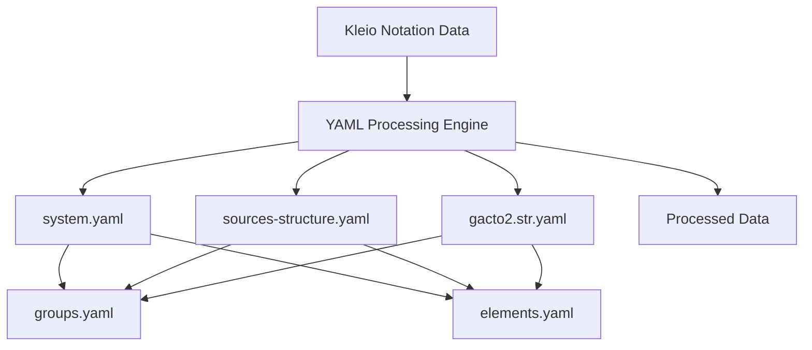
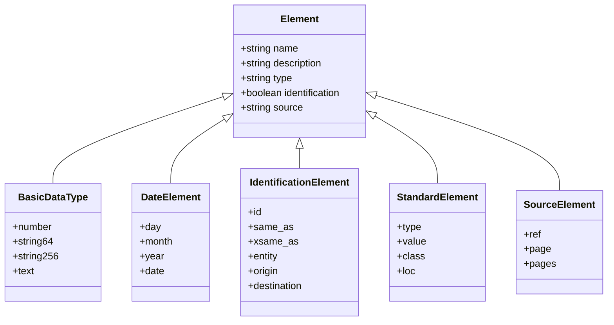
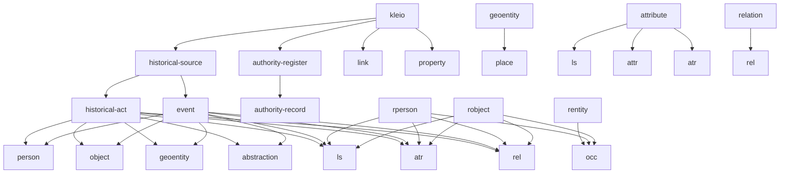
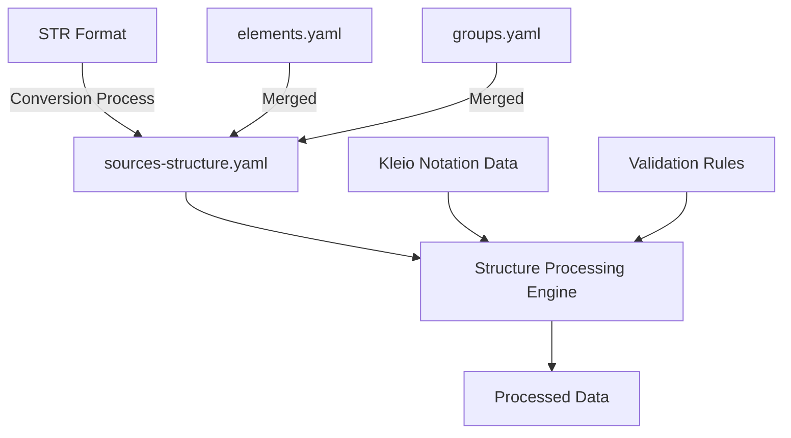
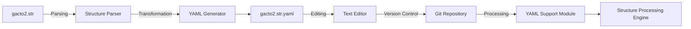
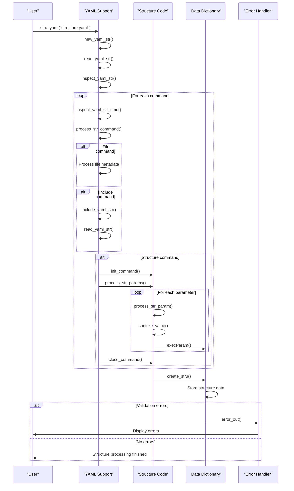
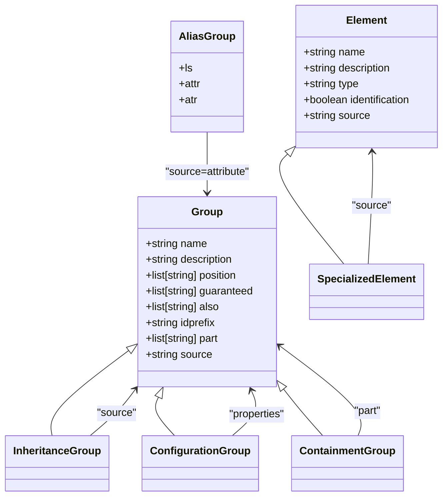
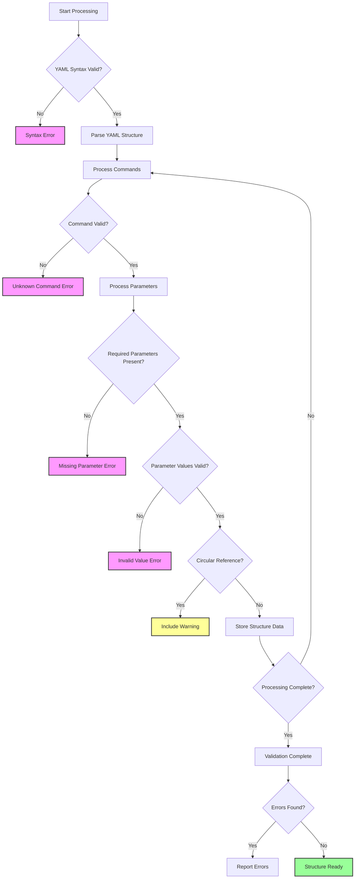
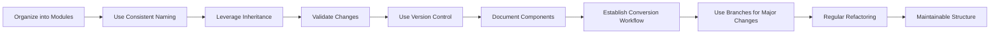

# YAML Structure Components

<cite>
**Referenced Files in This Document**   
- [elements.yaml](file://src/stru/elements.yaml)
- [groups.yaml](file://src/stru/groups.yaml)
- [sources-structure.yaml](file://src/stru/sources-structure.yaml)
- [gacto2.str.yaml](file://src/stru/gacto2.str.yaml)
- [system.yaml](file://src/stru/system.yaml)
- [yamlSupport.pl](file://src/yamlSupport.pl)
- [struCode.pl](file://src/struCode.pl)
- [struSyntax.pl](file://src/struSyntax.pl)
- [dataDictionary.pl](file://src/dataDictionary.pl)
- [persistence.pl](file://src/persistence.pl)
</cite>

## Table of Contents
1. [Introduction](#introduction)
2. [Core YAML Structure Files](#core-yaml-structure-files)
3. [Elements Definition in elements.yaml](#elements-definition-in-elementsyaml)
4. [Groups Definition in groups.yaml](#groups-definition-in-groupsyaml)
5. [Sources Structure in sources-structure.yaml](#sources-structure-in-sources-structureyaml)
6. [STR to YAML Conversion with gacto2.str.yaml](#str-to-yaml-conversion-with-gacto2stryaml)
7. [Structure Processing and Validation](#structure-processing-and-validation)
8. [Configuration and Inheritance Patterns](#configuration-and-inheritance-patterns)
9. [Error Handling and Validation](#error-handling-and-validation)
10. [Best Practices for YAML Structure Management](#best-practices-for-yaml-structure-management)
11. [Conclusion](#conclusion)

## Introduction

The timelink-kleio system utilizes YAML-based structure components to define the schema for Kleio notation processing. These YAML files serve as the foundation for defining the data model, validation rules, and processing behavior for historical source data. The system employs a modular approach with multiple YAML files that work together to create a comprehensive structure definition.

The core YAML components include `elements.yaml`, `groups.yaml`, and `sources-structure.yaml`, which define the fundamental building blocks of the data model. Additionally, the `gacto2.str.yaml` file provides a YAML representation of the STR file format, enabling easier editing and version control. These files are processed at runtime to create an internal representation of the structure that guides the parsing and validation of Kleio notation data.

This documentation provides a comprehensive analysis of these YAML structure components, explaining their purpose, structure, and interrelationships. It covers how the system merges and validates these components during runtime, configuration options, inheritance patterns, error handling for malformed YAML files, and best practices for organizing structure definitions.

**Section sources**
- [elements.yaml](file://src/stru/elements.yaml#L1-L217)
- [groups.yaml](file://src/stru/groups.yaml#L1-L259)
- [sources-structure.yaml](file://src/stru/sources-structure.yaml#L1-L800)
- [gacto2.str.yaml](file://src/stru/gacto2.str.yaml#L1-L800)

## Core YAML Structure Files

The timelink-kleio system relies on several key YAML files to define its structure components. These files work together to create a comprehensive schema for Kleio notation processing. The primary files are `elements.yaml`, `groups.yaml`, `sources-structure.yaml`, and `gacto2.str.yaml`, each serving a specific purpose in the overall structure definition.

The `system.yaml` file acts as the entry point for the structure definition, including both `groups.yaml` and `elements.yaml` through the include directive. This modular approach allows for separation of concerns, with elements defining the basic data types and attributes, while groups define the organizational structure and relationships between entities.

The `sources-structure.yaml` file appears to be a generated structure file that combines multiple structure definitions, including elements and groups, into a single comprehensive structure. Similarly, `gacto2.str.yaml` serves as a YAML representation of the STR file format, providing a more accessible format for editing and version control compared to the original STR format.

These YAML files follow a consistent structure pattern, using lists of dictionaries to define elements and groups. Each definition includes a name, description, and various properties that control the behavior and validation rules for that component. The system processes these files at runtime to create an internal representation that guides the parsing and validation of Kleio notation data.

**Diagram sources **
- [system.yaml](file://src/stru/system.yaml#L1-L4)
- [groups.yaml](file://src/stru/groups.yaml#L1-L259)
- [elements.yaml](file://src/stru/elements.yaml#L1-L217)
- [sources-structure.yaml](file://src/stru/sources-structure.yaml#L1-L800)
- [gacto2.str.yaml](file://src/stru/gacto2.str.yaml#L1-L800)
- [yamlSupport.pl](file://src/yamlSupport.pl#L28-L67)

**Section sources**
- [system.yaml](file://src/stru/system.yaml#L1-L4)
- [sources-structure.yaml](file://src/stru/sources-structure.yaml#L1-L800)
- [gacto2.str.yaml](file://src/stru/gacto2.str.yaml#L1-L800)

## Elements Definition in elements.yaml

The `elements.yaml` file defines the basic elements used in Kleio schemas, serving as the fundamental building blocks for data definition. These elements represent atomic data types and attributes that can be used across various groups and structures within the system. The file is organized into logical sections that categorize elements by their purpose and data type.

The file begins with basic data types such as `number`, `string64`, `string256`, and `text`, which define the fundamental data storage capabilities. These types are used to specify the format and constraints for data fields in the destination database. For example, `string64` is used for IDs of other entities, while `string256` is used for longer strings like names or short descriptions.

A significant portion of the file is dedicated to date-related elements, including `day`, `month`, `year`, and `date`. The `date` element is particularly important as it supports multiple formats (YYYYMMDD or YYYY-MM-DD), date ranges, and relative dates, providing flexibility for historical data representation. This comprehensive date handling is crucial for processing historical sources where date precision may vary.

The file also defines unique identification elements such as `id`, `same_as`, `xsame_as`, `entity`, `origin`, and `destination`. These elements are essential for entity resolution and relationship management, allowing the system to link occurrences of the same entity within and across files. The `id` element is marked with `identification: yes`, indicating its special role in entity identification.

Additional sections cover standard elements used in Kleio schemas (`type`, `value`, `class`, `loc`), people and objects elements (`name`, `description`, `destname`, `sex`), elements for longer texts (`obs`, `summary`), and elements related to source information (`ref`, `page`, `pages`). The file also includes elements for file processing (`replace`, `inside`) and elements that register the original source text (`groupname`, `level`, `line`, `kleiofile`).

**Diagram sources **
- [elements.yaml](file://src/stru/elements.yaml#L39-L217)

**Section sources**
- [elements.yaml](file://src/stru/elements.yaml#L1-L217)

## Groups Definition in groups.yaml

The `groups.yaml` file defines the core groups used in Kleio schemas, establishing the hierarchical structure and relationships between different entity types. Groups represent collections of related elements and define how entities are organized within the data model. The file uses a YAML list format where each group is defined as a dictionary with specific properties that control its behavior and validation rules.

Each group definition includes several key properties: `name` (the group identifier), `description` (a detailed explanation of the group's purpose), `position` (a list of elements that can be registered without specifying the element name), `guaranteed` (a list of elements that must be present), `also` (a list of optional elements), `idprefix` (the prefix for IDs of entities in this group), `part` (a list of subgroups that can be contained within this group), and `source` (the group that this group extends).

The file begins with the `kleio` group, which serves as the top-level group for Kleio files. This group contains other core groups such as `historical-source`, `authority-register`, `link`, and `property`. The `historical-source` group is particularly important as it represents main groups for registering historical sources, with subgroups like `historical-act` and `event` for specific types of historical records.

Inheritance is a key feature of the group system, implemented through the `source` property. For example, the `place` group extends the `geoentity` group, inheriting its properties while potentially overriding specific aspects. This allows for specialization of groups while maintaining consistency in the data model. Other examples include `female` and `male` groups that extend the `person` group, and `rperson` and `robject` groups that extend `rentity`.

The file also defines specialized groups for different entity types, including `person`, `object`, `abstraction`, `topic`, `attribute` (with aliases `ls`, `attr`, `atr`), and `relation` (with alias `rel`). These groups establish the fundamental entity types in the system and their relationships. The `arbitrary` property in some groups (like `historical-act`) allows for flexible inclusion of various entity types, providing extensibility to the data model.

**Diagram sources **
- [groups.yaml](file://src/stru/groups.yaml#L32-L259)

**Section sources**
- [groups.yaml](file://src/stru/groups.yaml#L1-L259)

## Sources Structure in sources-structure.yaml

The `sources-structure.yaml` file represents a comprehensive structure definition that combines multiple structure components into a single cohesive schema. This file appears to be generated from the `gacto2.str` file, serving as a complete representation of the structure used for processing historical sources. It contains definitions for both elements and groups, effectively merging the content from `elements.yaml` and `groups.yaml` into a unified structure.

The file begins with metadata about its origin, specifying that it was generated from `src/gacto2.str`. This indicates that the file is likely produced by a conversion process that transforms the STR format into YAML, making it more accessible for editing and version control. The structure follows the same pattern as other YAML structure files, with a list of dictionaries defining elements and groups.

For elements, the file includes all the basic data types defined in `elements.yaml` such as `number`, `string64`, `string256`, and `text`, along with their descriptions and properties. It also includes the date-related elements (`day`, `month`, `year`, `date`) and identification elements (`id`, `same_as`, `xsame_as`, `entity`, `origin`, `destination`). Each element definition includes additional properties like `prefix` and `suffix` with values of "non", suggesting these are default values for elements that don't have specific prefix or suffix requirements.

The group definitions in `sources-structure.yaml` mirror those in `groups.yaml`, including the top-level `kleio` group, `historical-source`, `geoentity`, `place`, `authority-register`, `identifications`, `link`, `property`, `rentity`, `rperson`, `robject`, `occ`, `historical-act`, `event`, `cevent`, `person`, `female`, `male`, `object`, `abstraction`, `topic`, `attribute`, `ls`, `rel`, `end`, `group-element`, and `relation-type`. Each group definition includes all the properties specified in `groups.yaml`, such as `also`, `guaranteed`, `idprefix`, `part`, and `position`.

An important aspect of this file is that it appears to be automatically generated, which suggests a workflow where structure definitions are maintained in the STR format and then converted to YAML for easier manipulation. This approach allows for version control of the structure definitions while maintaining compatibility with the existing STR-based processing system. The generated YAML file serves as a single source of truth for the complete structure, ensuring consistency across different components of the system.

**Diagram sources **
- [sources-structure.yaml](file://src/stru/sources-structure.yaml#L1-L800)

**Section sources**
- [sources-structure.yaml](file://src/stru/sources-structure.yaml#L1-L800)

## STR to YAML Conversion with gacto2.str.yaml

The `gacto2.str.yaml` file serves as a YAML representation of the STR file format, enabling easier editing and version control of structure definitions. This conversion from the traditional STR format to YAML provides several advantages, including improved readability, better support for modern development tools, and enhanced version control capabilities. The file appears to be automatically generated from the `gacto2.str` file, preserving the structure and semantics of the original format while making it more accessible for human editing.

The conversion process maintains all the essential components of the STR format, including elements, groups, and their properties. Each element definition in `gacto2.str.yaml` includes the same properties as in the original STR format, such as `name`, `description`, `identification`, `prefix`, `suffix`, and `type`. For example, the `number` element is defined with a description of "Any number" and `identification` set to "non", while the `id` element has `identification` set to "sic", indicating its special role in entity identification.

Similarly, group definitions in `gacto2.str.yaml` preserve all the properties from the STR format, including `name`, `description`, `also`, `guaranteed`, `idprefix`, `part`, `position`, and `source`. The `kleio` group, for instance, is defined with `also` elements like `structure`, `translator`, `autorels`, `obs`, `prefix`, and `translations`, and contains parts like `historical-source`, `fonte`, `authority-register`, `identifications`, `link`, and `property`.

The YAML format provides several advantages over the original STR format. First, it is more human-readable, with clear hierarchical structure and indentation that makes it easier to understand the relationships between different components. Second, it integrates better with modern development tools and IDEs, which often have built-in support for YAML syntax highlighting, validation, and auto-completion. Third, it works more effectively with version control systems, allowing for clearer diff comparisons and merge conflict resolution.

The conversion process likely involves parsing the STR file and transforming its content into the equivalent YAML structure. This process preserves the semantic meaning of the original structure while adapting it to the YAML syntax. The resulting file can then be edited using standard text editors or YAML-specific tools, and the changes can be tracked using version control systems like Git. When the structure needs to be processed by the Kleio system, the YAML file can be converted back to the STR format or processed directly by the YAML support module.

**Diagram sources **
- [gacto2.str.yaml](file://src/stru/gacto2.str.yaml#L1-L800)
- [yamlSupport.pl](file://src/yamlSupport.pl#L28-L67)

**Section sources**
- [gacto2.str.yaml](file://src/stru/gacto2.str.yaml#L1-L800)

## Structure Processing and Validation

The timelink-kleio system processes and validates YAML structure components through a sophisticated pipeline implemented in Prolog modules. The core of this process is the `yamlSupport.pl` module, which coordinates the reading, parsing, and validation of YAML files. This module works in conjunction with `struCode.pl`, `struSyntax.pl`, and `dataDictionary.pl` to create a comprehensive structure processing system.

The processing begins with the `stru_yaml/1` predicate in `yamlSupport.pl`, which initializes the structure processing by setting up the necessary state and calling `new_yaml_str/2`. This function reads the YAML file and processes its configuration, using `read_yaml_str/2` to parse the YAML content and `inspect_yaml_str/1` to examine each command in the structure. The `read_yaml_str/2` predicate includes safeguards against circular references by maintaining a list of already processed files in `stru_files_read`.

The `inspect_yaml_str/1` predicate iterates through each command in the YAML structure, calling `inspect_yaml_str_cmd/1` to process individual commands. This function extracts the command and its parameters, then calls `process_str_command/2` to handle the specific command type. The `process_str_command/2` predicate acts as a dispatcher, routing commands to their appropriate handlers based on the command type.

For file commands, the system processes metadata such as name and description, while include commands trigger the processing of additional YAML files through `include_yaml_str/2`. This function resolves file paths using `normalize_str_path/2` and processes the included file recursively, allowing for modular structure definitions. The system maintains a stack of processed files to detect and prevent circular references.

The actual processing of structure commands is handled by `struCode.pl`, which contains predicates like `init_command/1`, `execParam/3`, and `close_command/2`. The `execParam/3` predicate processes individual parameter-value pairs, with specialized handling for different command types (nomino, pars, terminus, exitus). Parameters are sanitized using `sanitize_value/2`, which converts strings to atoms and handles lists appropriately.

The `dataDictionary.pl` module plays a crucial role in storing and managing the processed structure information. It maintains predicates like `clioStru_/1`, `clioGroup_/2`, and `clioElement_/2` to store structure, group, and element definitions. The `create_stru/1` predicate creates a new structure definition, while `set_groups_prop/3` and `set_elements_prop/3` store property values for groups and elements.

Validation occurs at multiple levels: syntax validation during YAML parsing, semantic validation during command processing, and completeness validation through `check_complete/2`. The system checks for required parameters using `requiredParams/2` and reports missing parameters as errors. Error handling is managed through `errors.pl`, with warnings for non-critical issues and errors for critical problems that prevent structure processing.

**Diagram sources **
- [yamlSupport.pl](file://src/yamlSupport.pl#L28-L67)
- [struCode.pl](file://src/struCode.pl#L156-L186)
- [dataDictionary.pl](file://src/dataDictionary.pl#L115-L121)

**Section sources**
- [yamlSupport.pl](file://src/yamlSupport.pl#L28-L67)
- [struCode.pl](file://src/struCode.pl#L156-L186)
- [struSyntax.pl](file://src/struSyntax.pl#L48-L58)
- [dataDictionary.pl](file://src/dataDictionary.pl#L115-L121)
- [persistence.pl](file://src/persistence.pl#L118-L137)

## Configuration and Inheritance Patterns

The timelink-kleio system employs sophisticated configuration and inheritance patterns to create a flexible and extensible structure definition system. These patterns are implemented through the YAML structure files and the underlying Prolog processing engine, allowing for both specialization and reuse of structure components.

The primary configuration mechanism is the use of properties in group and element definitions. Each group and element can have various properties that control its behavior, such as `position` (elements that can be registered without specifying the element name), `guaranteed` (required elements), `also` (optional elements), `idprefix` (ID prefix for entities), and `part` (subgroups that can be contained). These properties provide fine-grained control over how entities are defined and related within the data model.

Inheritance is implemented through the `source` property in group definitions. When a group specifies a `source`, it inherits all the properties of the source group, unless explicitly overridden. For example, the `place` group extends the `geoentity` group, inheriting its properties while potentially adding or modifying specific aspects. This allows for specialization of groups while maintaining consistency in the data model. The inheritance mechanism is processed by the `execFons/1` predicate in `struCode.pl`, which copies the properties of the source group to the current group.

The system also supports configuration through the inclusion of multiple YAML files using the `include` directive. The `system.yaml` file demonstrates this pattern by including both `groups.yaml` and `elements.yaml`, effectively merging their content into a single structure definition. This modular approach allows for separation of concerns, with different files responsible for different aspects of the structure.

Another important configuration pattern is the use of aliases, where multiple group names refer to the same underlying structure. For example, the `attribute` group has aliases `ls`, `attr`, and `atr`, while the `relation` group has the alias `rel`. This is implemented by defining these alias groups with the same `source` property, pointing to the base group. This pattern provides flexibility in terminology while maintaining a consistent underlying structure.

The system also supports hierarchical configuration through the `part` property, which defines containment relationships between groups. For example, the `kleio` group contains `historical-source`, `authority-register`, `link`, and `property` groups, establishing a clear hierarchy. This containment relationship is processed by the `dataDictionary.pl` module, which maintains the relationships between groups through predicates like `contained_by/2` and `subgroups/2`.

These configuration and inheritance patterns work together to create a powerful and flexible system for defining structure components. They allow for the creation of complex data models through composition and specialization, while maintaining consistency and reusability across different parts of the system.

**Diagram sources **
- [groups.yaml](file://src/stru/groups.yaml#L71-L72)
- [groups.yaml](file://src/stru/groups.yaml#L222-L223)
- [struCode.pl](file://src/struCode.pl#L289-L293)
- [dataDictionary.pl](file://src/dataDictionary.pl#L161-L178)

**Section sources**
- [groups.yaml](file://src/stru/groups.yaml#L1-L259)
- [struCode.pl](file://src/struCode.pl#L289-L293)
- [dataDictionary.pl](file://src/dataDictionary.pl#L161-L178)

## Error Handling and Validation

The timelink-kleio system implements comprehensive error handling and validation mechanisms to ensure the integrity and correctness of YAML structure components. These mechanisms operate at multiple levels, from syntax validation to semantic validation, and provide detailed feedback to help users identify and correct issues in their structure definitions.

At the syntax level, the system uses the SWI-Prolog YAML library to parse YAML files, which automatically detects and reports syntax errors such as incorrect indentation, invalid characters, or malformed structures. When a YAML file cannot be parsed, the system generates a clear error message indicating the nature and location of the syntax problem.

For semantic validation, the system employs a multi-stage process. The `process_str_command/2` predicate in `yamlSupport.pl` validates commands and their parameters, reporting unknown commands or misspelled command names. The `requiredParams/2` predicate in `struCode.pl` defines the required parameters for each command type, and the `check_complete/2` predicate verifies that all required parameters are present. If a required parameter is missing, the system generates an error message specifying the missing parameter and the command it belongs to.

The system also includes validation for specific parameter values. For example, the `sicNon/1` predicate validates parameters that should have values of "sic" or "non", while the `perAdHoc/1` predicate validates parameters that should have values of "permanens" or "adHoc". These validation predicates ensure that parameter values conform to the expected format and semantics.

Circular reference detection is implemented through the `stru_files_read` value, which maintains a list of already processed files. When an `include` command is encountered, the system checks if the target file is already in the list, and if so, issues a warning to prevent infinite recursion. This mechanism protects against accidental or intentional circular references in the structure definition.

Error reporting is handled by the `errors.pl` module, which provides predicates like `error_out/2` and `warning_out/2` for generating error and warning messages. These messages include contextual information such as the file name, line number, and specific error details, making it easier for users to locate and fix issues. The system distinguishes between errors (which prevent structure processing from continuing) and warnings (which allow processing to continue but indicate potential issues).

The validation process also includes checks for consistency between related components. For example, when a group specifies a `source` group, the system verifies that the source group exists and is properly defined. Similarly, when elements are referenced in group definitions (in `position`, `guaranteed`, or `also` lists), the system checks that these elements are defined in the structure.

**Diagram sources **
- [yamlSupport.pl](file://src/yamlSupport.pl#L150-L154)
- [struCode.pl](file://src/struCode.pl#L307-L326)
- [errors.pl](file://src/errors.pl)
- [persistence.pl](file://src/persistence.pl#L118-L137)

**Section sources**
- [yamlSupport.pl](file://src/yamlSupport.pl#L150-L154)
- [struCode.pl](file://src/struCode.pl#L307-L326)
- [errors.pl](file://src/errors.pl)
- [persistence.pl](file://src/persistence.pl#L118-L137)

## Best Practices for YAML Structure Management

Effective management of YAML structure components in the timelink-kleio system requires adherence to several best practices that ensure maintainability, consistency, and reliability. These practices cover file organization, version control, validation, and collaboration, helping teams work efficiently with the structure definitions.

First, organize structure definitions into logical modules using the include mechanism. Separate core elements from specialized groups, and group related components together in dedicated files. For example, maintain `elements.yaml` for basic data types, `groups.yaml` for core entity types, and create specialized files for domain-specific structures. This modular approach improves readability and makes it easier to locate and modify specific components.

Use consistent naming conventions throughout the structure definitions. Follow the established patterns in the existing files, such as using lowercase names with hyphens for multi-word identifiers. Maintain consistency in property usage, ensuring that similar groups and elements have consistent property values where appropriate. This consistency reduces cognitive load and minimizes errors when creating or modifying structure components.

Leverage inheritance and specialization to avoid duplication. When creating new groups that share characteristics with existing groups, use the `source` property to inherit from the appropriate base group rather than duplicating properties. This approach ensures consistency and makes maintenance easier, as changes to the base group automatically propagate to specialized groups.

Implement comprehensive validation and testing of structure changes. Before deploying modified structure definitions, validate them using the system's built-in validation mechanisms and test them with sample data to ensure they behave as expected. Use version control to track changes to structure files, and include descriptive commit messages that explain the purpose of each change.

Document structure components thoroughly using the description property. Provide clear, concise explanations of each element and group, including their purpose, usage examples, and any special considerations. This documentation helps new team members understand the structure and reduces the risk of incorrect usage.

When working with the STR to YAML conversion process, establish a clear workflow for maintaining structure definitions. Decide whether to maintain the primary source in STR format and convert to YAML, or to maintain the primary source in YAML and convert to STR as needed. Document this workflow and ensure all team members follow it consistently.

Use version control branches for significant structure changes, allowing for review and testing before merging into the main branch. This practice helps prevent breaking changes from affecting the production system and enables collaboration on complex structure modifications.

Finally, regularly review and refactor the structure definitions to improve their organization and efficiency. As the system evolves, previously optimal structures may become suboptimal, and periodic refactoring helps maintain a clean, efficient structure that meets current requirements.

**Diagram sources **
- [system.yaml](file://src/stru/system.yaml#L2-L3)
- [groups.yaml](file://src/stru/groups.yaml#L31-L32)
- [elements.yaml](file://src/stru/elements.yaml#L2-L3)

**Section sources**
- [system.yaml](file://src/stru/system.yaml#L1-L4)
- [groups.yaml](file://src/stru/groups.yaml#L1-L259)
- [elements.yaml](file://src/stru/elements.yaml#L1-L217)

## Conclusion

The YAML structure components in timelink-kleio provide a powerful and flexible framework for defining the schema for Kleio notation processing. Through the use of `elements.yaml`, `groups.yaml`, `sources-structure.yaml`, and `gacto2.str.yaml`, the system establishes a comprehensive data model that supports complex historical source data.

The modular design, with separate files for elements and groups, enables clear separation of concerns and promotes reusability. The inclusion mechanism allows for composition of structure definitions from multiple sources, while inheritance through the `source` property enables specialization and extension of existing components. These features work together to create a flexible system that can adapt to various data modeling requirements.

The conversion of STR files to YAML format, exemplified by `gacto2.str.yaml`, represents a significant improvement in usability and maintainability. The YAML format's readability and compatibility with modern development tools make it easier to edit, review, and version control structure definitions. This conversion process bridges the gap between the traditional STR format and contemporary development practices.

The robust processing and validation pipeline, implemented in `yamlSupport.pl`, `struCode.pl`, and related modules, ensures the integrity of structure definitions. The multi-level validation approach, from syntax checking to semantic validation, helps prevent errors and provides clear feedback for correction. The error handling mechanisms protect against common issues like circular references and missing required parameters.

By following best practices for YAML structure management, including modular organization, consistent naming, thorough documentation, and effective version control, teams can maintain high-quality structure definitions that evolve with the system's needs. The combination of technical capabilities and sound practices creates a solid foundation for reliable and maintainable data modeling in the timelink-kleio system.

[No sources needed since this section summarizes without analyzing specific files]