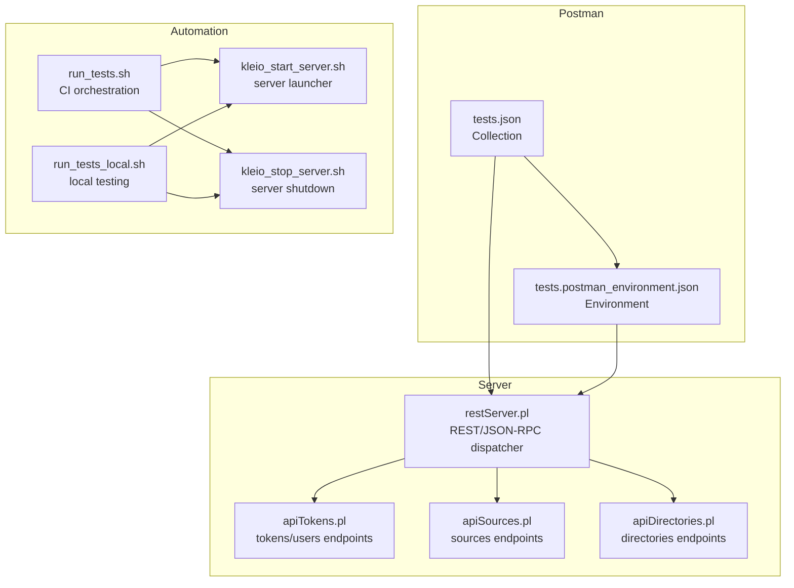
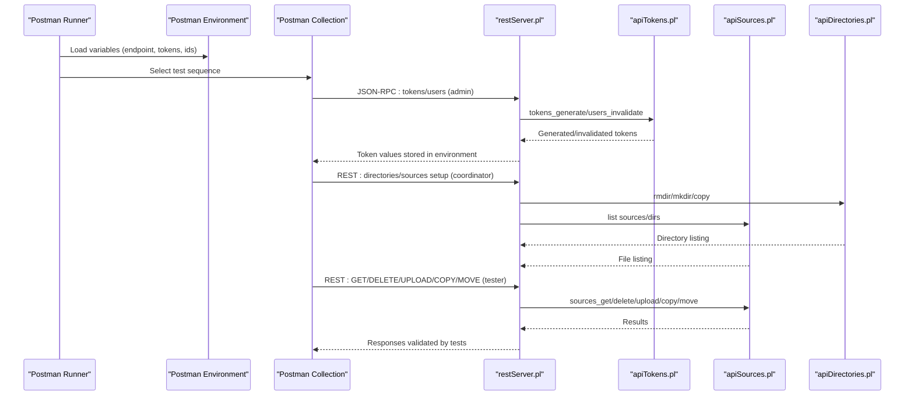
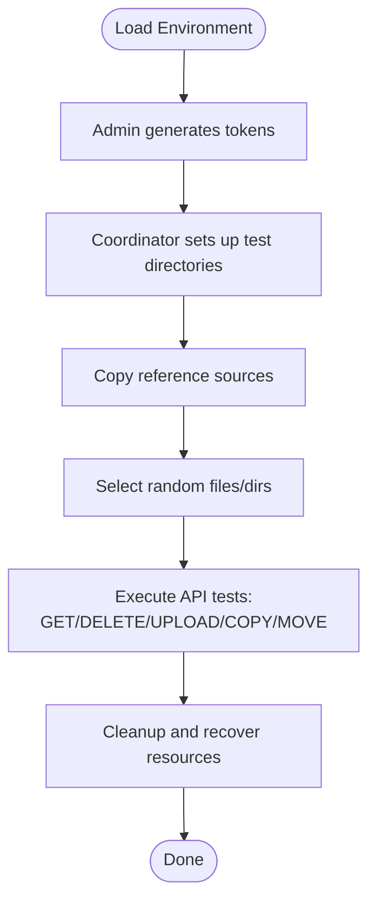
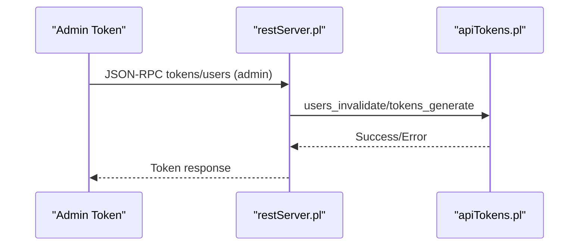
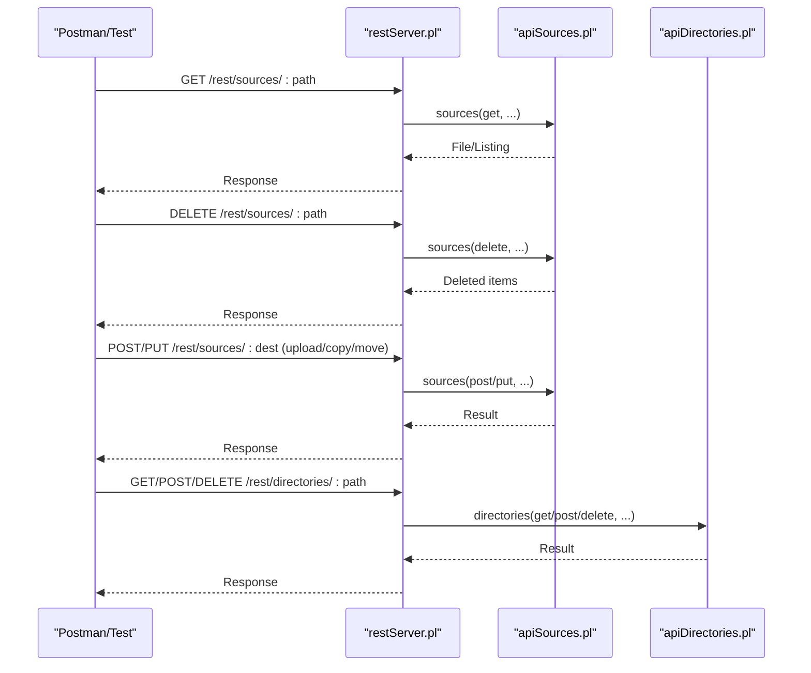
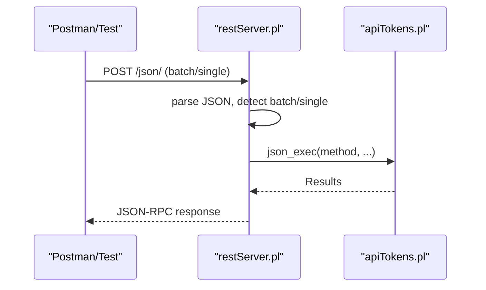
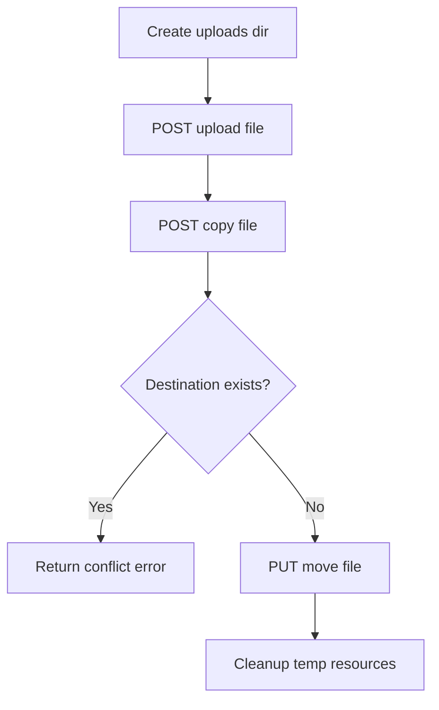
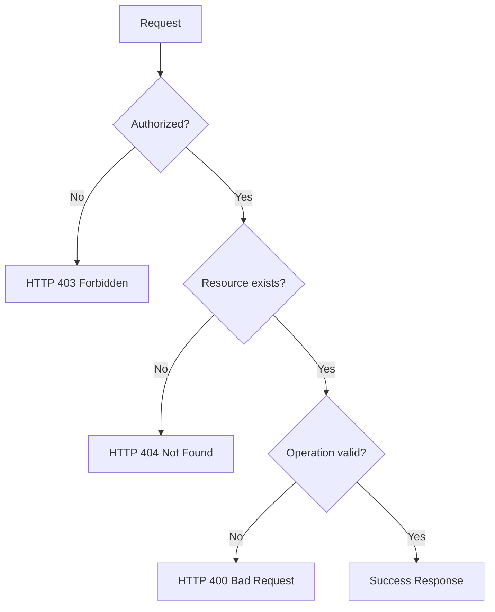
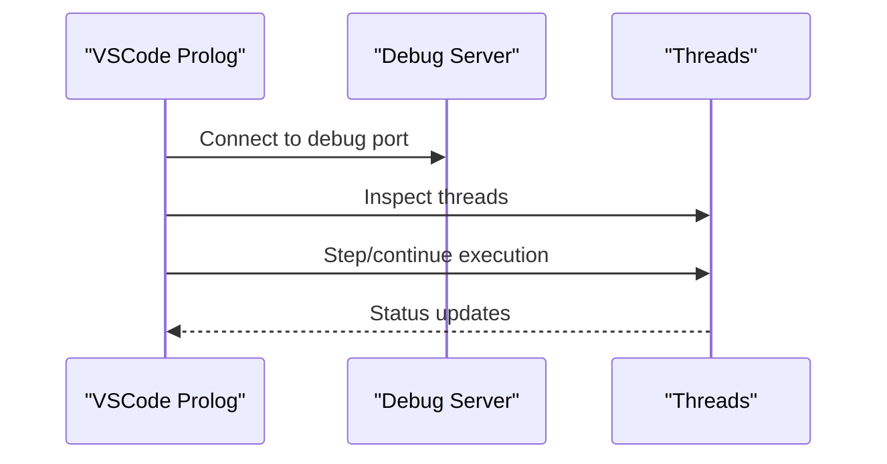
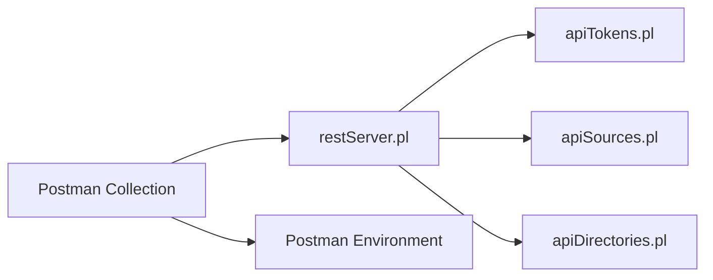

# API and Server Testing

<cite>
**Referenced Files in This Document**
- [tests.json](file://api/postman/tests.json)
- [tests.postman_environment.json](file://api/postman/tests.postman_environment.json)
- [api-tests.postman_collection.json](file://api/postman/api-tests.postman_collection.json)
- [restServer.pl](file://src/restServer.pl)
- [apiTokens.pl](file://src/apiTokens.pl)
- [apiSources.pl](file://src/apiSources.pl)
- [apiDirectories.pl](file://src/apiDirectories.pl)
- [run_tests.sh](file://tests/scripts/run_tests.sh)
- [run_tests_local.sh](file://tests/scripts/run_tests_local.sh)
- [kleio_start_server.sh](file://tests/scripts/kleio_start_server.sh)
- [kleio_stop_server.sh](file://tests/scripts/kleio_stop_server.sh)
</cite>

## Table of Contents
1. [Introduction](#introduction)
2. [Project Structure](#project-structure)
3. [Core Components](#core-components)
4. [Architecture Overview](#architecture-overview)
5. [Detailed Component Analysis](#detailed-component-analysis)
6. [Dependency Analysis](#dependency-analysis)
7. [Performance Considerations](#performance-considerations)
8. [Troubleshooting Guide](#troubleshooting-guide)
9. [Conclusion](#conclusion)
10. [Appendices](#appendices)

## Introduction
This document describes the API and server testing subsystem for validating REST API functionality and server operations in the Timelink Kleio project. It explains the Postman-based testing framework using the tests.json collection and tests.postman_environment.json environment configuration, details JSON-RPC and REST API testing procedures (including authentication via admin tokens, file upload testing, and endpoint validation), and outlines Newman CLI integration for automated API testing and CI workflows. It also provides guidelines for creating new API test cases, updating test environments, debugging failed tests, and using server-side debugging with VSCode Prolog extension and tspy thread debugging. Finally, it covers common API testing scenarios, error handling verification, and performance testing considerations.

## Project Structure
The API and server testing subsystem spans:
- Postman collections and environments for manual and automated testing
- Server implementation supporting REST and JSON-RPC endpoints
- Test scripts orchestrating server lifecycle and semantic comparison
- Prolog modules implementing API endpoints for tokens, sources, and directories

**Diagram sources**
- [tests.json](file://api/postman/tests.json#L1-L120)
- [tests.postman_environment.json](file://api/postman/tests.postman_environment.json#L1-L119)
- [restServer.pl](file://src/restServer.pl#L424-L447)
- [apiTokens.pl](file://src/apiTokens.pl#L1-L125)
- [apiSources.pl](file://src/apiSources.pl#L1-L120)
- [apiDirectories.pl](file://src/apiDirectories.pl#L1-L90)
- [run_tests.sh](file://tests/scripts/run_tests.sh#L1-L39)
- [run_tests_local.sh](file://tests/scripts/run_tests_local.sh#L1-L13)
- [kleio_start_server.sh](file://tests/scripts/kleio_start_server.sh#L1-L22)
- [kleio_stop_server.sh](file://tests/scripts/kleio_stop_server.sh#L1-L6)

**Section sources**
- [tests.json](file://api/postman/tests.json#L1-L120)
- [tests.postman_environment.json](file://api/postman/tests.postman_environment.json#L1-L119)
- [restServer.pl](file://src/restServer.pl#L424-L447)

## Core Components
- Postman Collection and Environment
  - tests.json defines a comprehensive sequence of requests covering token generation/invalidation, directory setup, file listing, retrieval, deletion, uploads, copies/moves, and cleanup. It uses bearer tokens and environment variables for dynamic configuration.
  - tests.postman_environment.json defines variables such as endpoint, admin token, request_id, and placeholders for generated tokens and selected resources.

- REST and JSON-RPC Server
  - restServer.pl implements the REST/JSON-RPC dispatchers, CORS handling, request decoding, authorization checks, and error formatting. It exposes endpoints under /rest/ and /json/.

- API Modules
  - apiTokens.pl: Implements token and user management via JSON-RPC and REST, including privilege enforcement.
  - apiSources.pl: Implements sources operations (GET file/dir, DELETE, POST/PUT upload, POST/PUT copy/move).
  - apiDirectories.pl: Implements directory listing, creation, copying, and deletion.

- Automation Scripts
  - run_tests.sh and run_tests_local.sh orchestrate server startup/teardown and semantic comparison of translation outputs.
  - kleio_start_server.sh and kleio_stop_server.sh launch and stop the server for testing.

**Section sources**
- [tests.json](file://api/postman/tests.json#L1-L200)
- [tests.postman_environment.json](file://api/postman/tests.postman_environment.json#L1-L119)
- [restServer.pl](file://src/restServer.pl#L491-L546)
- [apiTokens.pl](file://src/apiTokens.pl#L18-L125)
- [apiSources.pl](file://src/apiSources.pl#L88-L178)
- [apiDirectories.pl](file://src/apiDirectories.pl#L18-L92)
- [run_tests.sh](file://tests/scripts/run_tests.sh#L1-L39)
- [kleio_start_server.sh](file://tests/scripts/kleio_start_server.sh#L1-L22)
- [kleio_stop_server.sh](file://tests/scripts/kleio_stop_server.sh#L1-L6)

## Architecture Overview
The testing architecture integrates Postman-driven requests against the REST/JSON-RPC server, with environment-driven configuration and automated orchestration.

**Diagram sources**
- [tests.json](file://api/postman/tests.json#L1-L200)
- [tests.postman_environment.json](file://api/postman/tests.postman_environment.json#L1-L119)
- [restServer.pl](file://src/restServer.pl#L491-L546)
- [apiTokens.pl](file://src/apiTokens.pl#L71-L125)
- [apiSources.pl](file://src/apiSources.pl#L88-L178)
- [apiDirectories.pl](file://src/apiDirectories.pl#L18-L92)

## Detailed Component Analysis

### Postman Collection and Environment
- Collection structure
  - Setup phase: admin token required to generate limited, tester, and coordinator tokens; erase/clean test directories; copy reference sources; select random files/dirs for subsequent tests.
  - Sources tests: GET file and directory listings (with recursion and filters), DELETE files/directories, upload new files, copy/move files, and cleanup.
  - Directory tests: list directories, create directories, copy directories, delete directories (with force).
- Environment variables
  - endpoint: server address/port
  - testadmintoken: admin token for privileged operations
  - request_id: request identifier
  - tester_token, limited_token, coordinator_token: generated tokens
  - test_sources, reference_sources: directory names
  - source_*, dir_*: selected items for tests
  - deleted_file, moved_file, selected_dir, nfiles: runtime state

**Diagram sources**
- [tests.json](file://api/postman/tests.json#L1-L200)
- [tests.postman_environment.json](file://api/postman/tests.postman_environment.json#L1-L119)

**Section sources**
- [tests.json](file://api/postman/tests.json#L1-L200)
- [tests.postman_environment.json](file://api/postman/tests.postman_environment.json#L1-L119)

### Authentication with Admin Tokens
- The collection uses an admin token to:
  - Invalidate existing users
  - Generate limited, tester, and coordinator tokens with specific API permissions
- The server validates tokens during request decoding and enforces API permissions per token.

**Diagram sources**
- [tests.json](file://api/postman/tests.json#L18-L365)
- [apiTokens.pl](file://src/apiTokens.pl#L38-L125)
- [restServer.pl](file://src/restServer.pl#L553-L579)

**Section sources**
- [tests.json](file://api/postman/tests.json#L18-L365)
- [apiTokens.pl](file://src/apiTokens.pl#L38-L125)
- [restServer.pl](file://src/restServer.pl#L553-L579)

### REST API Testing Procedures
- Sources endpoints
  - GET: retrieve a file or list directory contents; supports recursion and URL generation for JSON mode.
  - DELETE: remove files or directories (with recursion and force).
  - POST/PUT upload: upload new files or replace existing ones.
  - POST/PUT copy/move: copy or move files with destination validation.
- Directory endpoints
  - GET: list subdirectories (optionally recursive).
  - POST: create directory or copy directory from origin.
  - DELETE: remove directory (with force to delete non-empty).

**Diagram sources**
- [apiSources.pl](file://src/apiSources.pl#L88-L178)
- [apiDirectories.pl](file://src/apiDirectories.pl#L18-L92)
- [restServer.pl](file://src/restServer.pl#L491-L546)

**Section sources**
- [apiSources.pl](file://src/apiSources.pl#L88-L178)
- [apiDirectories.pl](file://src/apiDirectories.pl#L18-L92)
- [restServer.pl](file://src/restServer.pl#L491-L546)

### JSON-RPC Testing Procedures
- The server accepts JSON-RPC 2.0 requests on /json/, decodes commands, executes methods, and formats results.
- Methods invoked by the collection include token/user management and directory/file operations.

**Diagram sources**
- [restServer.pl](file://src/restServer.pl#L656-L751)
- [apiTokens.pl](file://src/apiTokens.pl#L71-L125)

**Section sources**
- [restServer.pl](file://src/restServer.pl#L656-L751)
- [apiTokens.pl](file://src/apiTokens.pl#L71-L125)

### File Upload Testing
- The collection demonstrates:
  - Creating upload directories
  - Uploading new files via multipart/form-data
  - Copying files between locations
  - Handling conflicts (destination exists) and validation errors
- The server enforces permissions and validates destinations.

**Diagram sources**
- [tests.json](file://api/postman/tests.json#L1917-L2399)
- [apiSources.pl](file://src/apiSources.pl#L324-L425)

**Section sources**
- [tests.json](file://api/postman/tests.json#L1917-L2399)
- [apiSources.pl](file://src/apiSources.pl#L324-L425)

### Endpoint Validation and Error Handling
- The collection includes tests for:
  - Forbidden access with insufficient privileges
  - Not found errors for missing resources
  - Bad request errors for invalid operations
- The server returns appropriate HTTP status codes and JSON-RPC error objects.

**Diagram sources**
- [tests.json](file://api/postman/tests.json#L919-L1031)
- [restServer.pl](file://src/restServer.pl#L544-L546)

**Section sources**
- [tests.json](file://api/postman/tests.json#L919-L1031)
- [restServer.pl](file://src/restServer.pl#L544-L546)

### Newman CLI Integration and CI Workflows
- The repository includes a Postman collection and environment suitable for Newman automation.
- While the repository does not include a dedicated Newman runner script, the same collection and environment can be used with Newman to execute tests in CI pipelines.
- Recommended approach:
  - Export the collection and environment from Postman.
  - Configure CI to install Newman and run the collection against the target server.
  - Use environment variables to override endpoint and tokens for different stages.

[No sources needed since this section provides general guidance]

### Creating New API Test Cases
- Guidelines
  - Use the existing collection as a template; add new requests grouped by functional areas (tokens, sources, directories).
  - Leverage environment variables for dynamic values (tokens, ids, selected files/dirs).
  - Add pre-request scripts to set state and test scripts to assert responses.
  - Keep tests self-contained; ensure cleanup steps restore the environment.

**Section sources**
- [tests.json](file://api/postman/tests.json#L1-L200)
- [tests.postman_environment.json](file://api/postman/tests.postman_environment.json#L1-L119)

### Updating Test Environments
- Update tests.postman_environment.json to reflect:
  - New endpoint URLs
  - Updated admin tokens
  - Additional variables for new test flows
- Ensure variables are enabled/disabled appropriately to avoid accidental overrides.

**Section sources**
- [tests.postman_environment.json](file://api/postman/tests.postman_environment.json#L1-L119)

### Debugging Failed API Tests
- Use Postman’s Runner to execute collections and review response bodies, headers, and timings.
- Inspect server logs and enable debug mode to capture detailed request traces.
- Validate token scopes and permissions; confirm environment variable values.

**Section sources**
- [tests.json](file://api/postman/tests.json#L1-L200)
- [restServer.pl](file://src/restServer.pl#L189-L226)

### Server-Side Debugging with VSCode Prolog Extension and tspy Thread Debugging
- The server supports a debug server and thread introspection:
  - Debug server listens on a configurable port and can be started via server launch goals.
  - Threads can be inspected and managed; idle detection helps automate shutdown.
- Use the VSCode Prolog extension to connect to the debug server for interactive debugging sessions.

**Diagram sources**
- [restServer.pl](file://src/restServer.pl#L310-L325)
- [restServer.pl](file://src/restServer.pl#L375-L387)
- [kleio_start_server.sh](file://tests/scripts/kleio_start_server.sh#L1-L22)
- [kleio_stop_server.sh](file://tests/scripts/kleio_stop_server.sh#L1-L6)

**Section sources**
- [restServer.pl](file://src/restServer.pl#L310-L325)
- [restServer.pl](file://src/restServer.pl#L375-L387)
- [kleio_start_server.sh](file://tests/scripts/kleio_start_server.sh#L1-L22)
- [kleio_stop_server.sh](file://tests/scripts/kleio_stop_server.sh#L1-L6)

## Dependency Analysis
The Postman collection depends on the server’s REST/JSON-RPC endpoints and environment variables. The server modules depend on shared utilities and token validation.

**Diagram sources**
- [tests.json](file://api/postman/tests.json#L1-L200)
- [tests.postman_environment.json](file://api/postman/tests.postman_environment.json#L1-L119)
- [restServer.pl](file://src/restServer.pl#L491-L546)
- [apiTokens.pl](file://src/apiTokens.pl#L1-L125)
- [apiSources.pl](file://src/apiSources.pl#L1-L120)
- [apiDirectories.pl](file://src/apiDirectories.pl#L1-L90)

**Section sources**
- [tests.json](file://api/postman/tests.json#L1-L200)
- [restServer.pl](file://src/restServer.pl#L491-L546)

## Performance Considerations
- Batch JSON-RPC requests can reduce overhead when performing multiple operations.
- Use recursion judiciously for directory listings; prefer shallow listings for large trees.
- Avoid unnecessary file uploads/downloads; reuse reference sources where possible.
- Monitor server thread pool and timeouts; adjust worker counts and idle thresholds as needed.

[No sources needed since this section provides general guidance]

## Troubleshooting Guide
- Common issues
  - Unauthorized access: verify token scopes and ensure admin token is configured.
  - Resource not found: confirm paths resolve under user source directories.
  - Upload conflicts: ensure destination does not exist or use appropriate overwrite semantics.
  - Permission denied: check API permissions granted to tokens.
- Server-side diagnostics
  - Enable debug mode and inspect logs for request traces and errors.
  - Use the debug server to inspect threads and request queues.

**Section sources**
- [tests.json](file://api/postman/tests.json#L919-L1031)
- [restServer.pl](file://src/restServer.pl#L189-L226)

## Conclusion
The API and server testing subsystem combines a comprehensive Postman collection with environment-driven configuration, robust REST/JSON-RPC endpoints, and automation scripts. By following the guidelines here, teams can reliably validate API functionality, enforce error handling, and integrate automated testing into CI workflows while leveraging server-side debugging capabilities for efficient troubleshooting.

## Appendices
- Example test case creation procedure
  - Add a new request in the collection under the appropriate functional group.
  - Define pre-request scripts to set environment variables and state.
  - Add test scripts to assert status codes, headers, and response content.
  - Validate with both REST and JSON-RPC modes where applicable.
- Maintenance checklist
  - Review environment variables for correctness and security.
  - Verify token permissions align with test requirements.
  - Confirm cleanup steps restore the test environment.
  - Update documentation and run a dry-run via Newman in CI.

[No sources needed since this section provides general guidance]