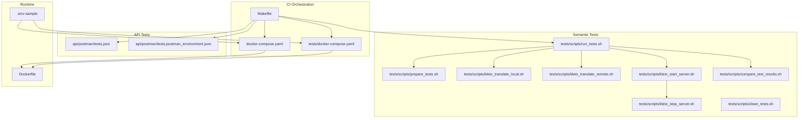
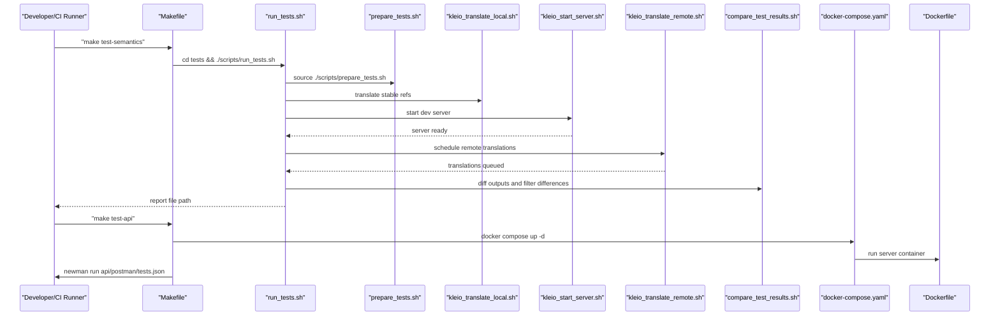
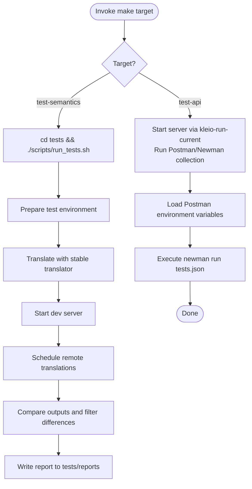
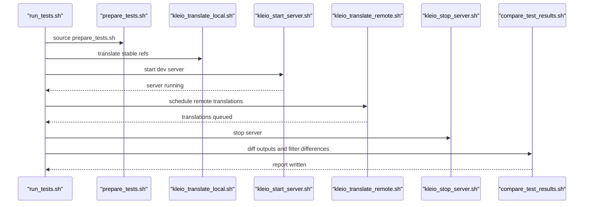
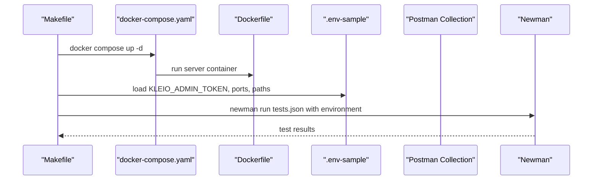
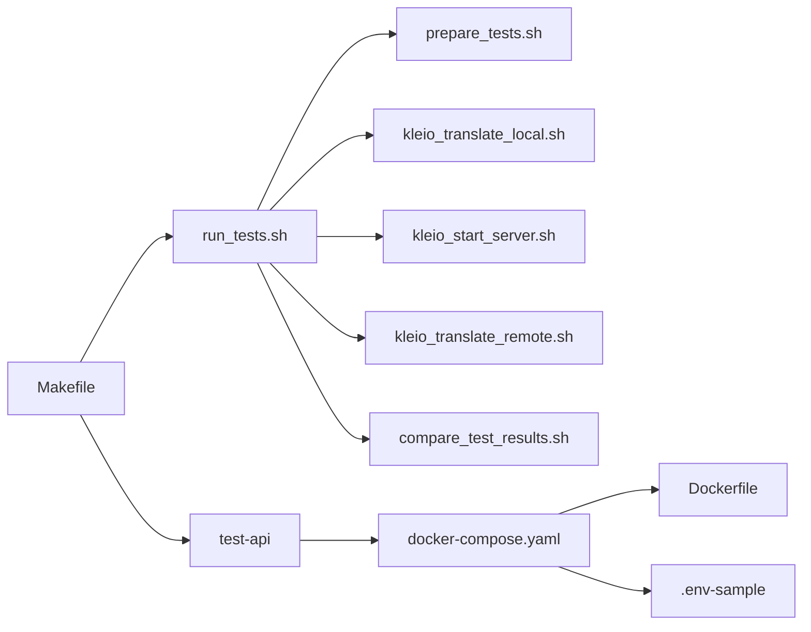

# Continuous Integration

<cite>
**Referenced Files in This Document**
- [Makefile](file://Makefile)
- [tests/README.md](file://tests/README.md)
- [tests/scripts/run_tests.sh](file://tests/scripts/run_tests.sh)
- [tests/scripts/prepare_tests.sh](file://tests/scripts/prepare_tests.sh)
- [tests/scripts/clean_tests.sh](file://tests/scripts/clean_tests.sh)
- [tests/scripts/kleio_translate_local.sh](file://tests/scripts/kleio_translate_local.sh)
- [tests/scripts/kleio_translate_remote.sh](file://tests/scripts/kleio_translate_remote.sh)
- [tests/scripts/kleio_start_server.sh](file://tests/scripts/kleio_start_server.sh)
- [tests/scripts/kleio_stop_server.sh](file://tests/scripts/kleio_stop_server.sh)
- [tests/scripts/compare_test_results.sh](file://tests/scripts/compare_test_results.sh)
- [.env-sample](file://.env-sample)
- [Dockerfile](file://Dockerfile)
- [docker-compose.yaml](file://docker-compose.yaml)
- [tests/docker-compose.yaml](file://tests/docker-compose.yaml)
</cite>

## Table of Contents
1. [Introduction](#introduction)
2. [Project Structure](#project-structure)
3. [Core Components](#core-components)
4. [Architecture Overview](#architecture-overview)
5. [Detailed Component Analysis](#detailed-component-analysis)
6. [Dependency Analysis](#dependency-analysis)
7. [Performance Considerations](#performance-considerations)
8. [Troubleshooting Guide](#troubleshooting-guide)
9. [Conclusion](#conclusion)
10. [Appendices](#appendices)

## Introduction
This document describes the continuous integration framework for automating testing workflows and quality assurance processes in the project. It focuses on:
- Makefile targets for test execution, specifically test-semantics and test-api
- The automated testing pipeline that orchestrates semantic testing, API testing, and result comparison
- Test preparation and cleanup procedures, environment setup, and dependency management
- Guidelines for integrating tests into CI/CD pipelines, configuring automated test execution, and handling test artifacts
- Reporting mechanisms, failure notifications, and test result archiving
- Performance optimization for test execution, parallel testing strategies, and resource management
- Examples of CI configuration files and best practices for reliable automated testing workflows

## Project Structure
The CI/CD testing system centers around the Makefile targets and a set of shell scripts under tests/scripts. The semantic tests compare outputs between a stable translator and a development translator, while API tests use Postman/Newman against a running server. Environment variables are managed via .env-sample and docker-compose configurations.

**Diagram sources**
- [Makefile](file://Makefile#L252-L265)
- [tests/scripts/run_tests.sh](file://tests/scripts/run_tests.sh#L1-L39)
- [tests/scripts/prepare_tests.sh](file://tests/scripts/prepare_tests.sh#L1-L51)
- [tests/scripts/kleio_translate_local.sh](file://tests/scripts/kleio_translate_local.sh#L1-L23)
- [tests/scripts/kleio_translate_remote.sh](file://tests/scripts/kleio_translate_remote.sh#L1-L15)
- [tests/scripts/kleio_start_server.sh](file://tests/scripts/kleio_start_server.sh#L1-L22)
- [tests/scripts/kleio_stop_server.sh](file://tests/scripts/kleio_stop_server.sh#L1-L6)
- [tests/scripts/compare_test_results.sh](file://tests/scripts/compare_test_results.sh#L1-L9)
- [tests/scripts/clean_tests.sh](file://tests/scripts/clean_tests.sh#L1-L5)
- [docker-compose.yaml](file://docker-compose.yaml#L1-L22)
- [tests/docker-compose.yaml](file://tests/docker-compose.yaml#L1-L20)
- [Dockerfile](file://Dockerfile#L1-L22)
- [.env-sample](file://.env-sample#L1-L119)

**Section sources**
- [Makefile](file://Makefile#L252-L265)
- [tests/README.md](file://tests/README.md#L1-L200)

## Core Components
- Makefile targets:
  - test-semantics: Executes semantic tests by running tests/scripts/run_tests.sh from the tests directory.
  - test-api: Starts a server using kleio-run-current and executes Postman/Newman tests via api/postman/tests.json with environment variables from api/postman/tests.postman_environment.json.
- Semantic testing pipeline:
  - Preparation: tests/scripts/prepare_tests.sh sets up directories, copies reference sources, and configures environment variables.
  - Execution: tests/scripts/run_tests.sh orchestrates translation with a stable translator, starts a development server, translates remotely, and compares outputs.
  - Comparison: tests/scripts/compare_test_results.sh diffs outputs and filters expected differences.
- API testing pipeline:
  - Uses Newman to run Postman collections against a running server configured by docker-compose and .env-sample.
- Environment and runtime:
  - .env-sample defines KLEIO_ADMIN_TOKEN, ports, worker counts, and paths.
  - Dockerfile and docker-compose.yaml define the server image, ports, volumes, and environment propagation.

**Section sources**
- [Makefile](file://Makefile#L252-L265)
- [tests/scripts/run_tests.sh](file://tests/scripts/run_tests.sh#L1-L39)
- [tests/scripts/prepare_tests.sh](file://tests/scripts/prepare_tests.sh#L1-L51)
- [tests/scripts/compare_test_results.sh](file://tests/scripts/compare_test_results.sh#L1-L9)
- [.env-sample](file://.env-sample#L1-L119)
- [Dockerfile](file://Dockerfile#L1-L22)
- [docker-compose.yaml](file://docker-compose.yaml#L1-L22)
- [tests/docker-compose.yaml](file://tests/docker-compose.yaml#L1-L20)

## Architecture Overview
The CI architecture integrates Makefile orchestration, semantic translation comparisons, and API testing with a server containerized via Docker.

**Diagram sources**
- [Makefile](file://Makefile#L252-L265)
- [tests/scripts/run_tests.sh](file://tests/scripts/run_tests.sh#L1-L39)
- [tests/scripts/prepare_tests.sh](file://tests/scripts/prepare_tests.sh#L1-L51)
- [tests/scripts/kleio_translate_local.sh](file://tests/scripts/kleio_translate_local.sh#L1-L23)
- [tests/scripts/kleio_start_server.sh](file://tests/scripts/kleio_start_server.sh#L1-L22)
- [tests/scripts/kleio_translate_remote.sh](file://tests/scripts/kleio_translate_remote.sh#L1-L15)
- [tests/scripts/compare_test_results.sh](file://tests/scripts/compare_test_results.sh#L1-L9)
- [docker-compose.yaml](file://docker-compose.yaml#L1-L22)
- [Dockerfile](file://Dockerfile#L1-L22)

## Detailed Component Analysis

### Makefile Targets for Test Execution
- test-semantics:
  - Purpose: Run semantic translator tests by invoking tests/scripts/run_tests.sh from the tests directory.
  - Behavior: Creates a timestamped report file under tests/reports, prepares test environments, runs translations with stable and dev translators, starts/stops the server for remote translation, and compares outputs.
- test-api:
  - Purpose: Execute Postman/Newman API tests against a running server.
  - Behavior: Starts the server using kleio-run-current, then runs api/postman/tests.json with environment variables from api/postman/tests.postman_environment.json, passing KLEIO_ADMIN_TOKEN and KLEIO_HOME_DIR.

**Diagram sources**
- [Makefile](file://Makefile#L252-L265)
- [tests/scripts/run_tests.sh](file://tests/scripts/run_tests.sh#L1-L39)
- [tests/scripts/prepare_tests.sh](file://tests/scripts/prepare_tests.sh#L1-L51)
- [tests/scripts/compare_test_results.sh](file://tests/scripts/compare_test_results.sh#L1-L9)

**Section sources**
- [Makefile](file://Makefile#L252-L265)
- [tests/README.md](file://tests/README.md#L101-L176)

### Semantic Testing Pipeline
- Preparation:
  - Cleans and initializes test directories.
  - Copies translator source code to dev and structure files to both default and alternate structure directories.
  - Sets KLEIO_* environment variables and creates reports directory.
- Execution:
  - Translates reference sources with a stable translator using kleio_translate_local.sh.
  - Starts a development server via kleio_start_server.sh and schedules remote translations using kleio_translate_remote.sh.
  - Stops the server after translations complete.
- Comparison:
  - Compares reference_translations and test_translations directories, filtering expected differences via patterns in tests/scripts/exclude_while_comparing.grep.

**Diagram sources**
- [tests/scripts/run_tests.sh](file://tests/scripts/run_tests.sh#L1-L39)
- [tests/scripts/prepare_tests.sh](file://tests/scripts/prepare_tests.sh#L1-L51)
- [tests/scripts/kleio_translate_local.sh](file://tests/scripts/kleio_translate_local.sh#L1-L23)
- [tests/scripts/kleio_start_server.sh](file://tests/scripts/kleio_start_server.sh#L1-L22)
- [tests/scripts/kleio_translate_remote.sh](file://tests/scripts/kleio_translate_remote.sh#L1-L15)
- [tests/scripts/kleio_stop_server.sh](file://tests/scripts/kleio_stop_server.sh#L1-L6)
- [tests/scripts/compare_test_results.sh](file://tests/scripts/compare_test_results.sh#L1-L9)

**Section sources**
- [tests/scripts/run_tests.sh](file://tests/scripts/run_tests.sh#L1-L39)
- [tests/scripts/prepare_tests.sh](file://tests/scripts/prepare_tests.sh#L1-L51)
- [tests/scripts/kleio_translate_local.sh](file://tests/scripts/kleio_translate_local.sh#L1-L23)
- [tests/scripts/kleio_translate_remote.sh](file://tests/scripts/kleio_translate_remote.sh#L1-L15)
- [tests/scripts/kleio_start_server.sh](file://tests/scripts/kleio_start_server.sh#L1-L22)
- [tests/scripts/kleio_stop_server.sh](file://tests/scripts/kleio_stop_server.sh#L1-L6)
- [tests/scripts/compare_test_results.sh](file://tests/scripts/compare_test_results.sh#L1-L9)
- [tests/README.md](file://tests/README.md#L3-L75)

### API Testing Pipeline
- Execution:
  - make test-api starts the server using kleio-run-current, then runs api/postman/tests.json with api/postman/tests.postman_environment.json.
  - Environment variables include KLEIO_ADMIN_TOKEN and KLEIO_HOME_DIR.
- Dependencies:
  - Requires Newman CLI installation and a running server image configured by docker-compose.yaml and .env-sample.

**Diagram sources**
- [Makefile](file://Makefile#L255-L262)
- [docker-compose.yaml](file://docker-compose.yaml#L1-L22)
- [Dockerfile](file://Dockerfile#L1-L22)
- [.env-sample](file://.env-sample#L1-L119)

**Section sources**
- [Makefile](file://Makefile#L255-L262)
- [tests/README.md](file://tests/README.md#L146-L176)

### Test Preparation and Cleanup Procedures
- Preparation:
  - Cleans reference_translations, test_translations, and dev directories.
  - Copies translator source code and structure files into appropriate locations.
  - Sets KLEIO_* environment variables and ensures reports directory exists.
- Cleanup:
  - Removes contents of reference_translations, test_translations, and dev directories for a clean state.

**Section sources**
- [tests/scripts/prepare_tests.sh](file://tests/scripts/prepare_tests.sh#L1-L51)
- [tests/scripts/clean_tests.sh](file://tests/scripts/clean_tests.sh#L1-L5)

### Environment Setup Requirements and Dependency Management
- Environment variables:
  - KLEIO_ADMIN_TOKEN, KLEIO_SERVER_PORT, KLEIO_EXTERNAL_PORT, KLEIO_SERVER_WORKERS, KLEIO_IDLE_TIMEOUT, KLEIO_HOME_DIR, and others are defined in .env-sample and propagated via docker-compose.
- Dependencies:
  - SWI-Prolog for local translations and server execution.
  - Newman for Postman collection execution.
  - Docker and docker-compose for containerized server execution.

**Section sources**
- [.env-sample](file://.env-sample#L1-L119)
- [Makefile](file://Makefile#L255-L262)
- [tests/README.md](file://tests/README.md#L146-L176)

### Reporting Mechanisms, Failure Notifications, and Test Artifacts
- Reports:
  - Semantic tests write a timestamped diff report under tests/reports/test_report_YYYY-MM-DD_HH:MM:SS.diff.
- Failure handling:
  - The test-api target uses || true to prevent the pipeline from failing immediately on Newman errors, allowing artifact capture and inspection.
- Artifacts:
  - Translation outputs (.err, .rpt, .xml, .org, .old) and diff reports are the primary artifacts for review.

**Section sources**
- [tests/scripts/run_tests.sh](file://tests/scripts/run_tests.sh#L10-L12)
- [Makefile](file://Makefile#L262-L262)
- [tests/README.md](file://tests/README.md#L108-L126)

## Dependency Analysis
The CI system depends on:
- Makefile targets to coordinate tasks
- Shell scripts for preparation, translation, server lifecycle, and comparison
- Docker configuration for server runtime
- Environment variables for credentials and paths
- Postman/Newman for API tests

**Diagram sources**
- [Makefile](file://Makefile#L252-L265)
- [tests/scripts/run_tests.sh](file://tests/scripts/run_tests.sh#L1-L39)
- [tests/scripts/prepare_tests.sh](file://tests/scripts/prepare_tests.sh#L1-L51)
- [tests/scripts/kleio_translate_local.sh](file://tests/scripts/kleio_translate_local.sh#L1-L23)
- [tests/scripts/kleio_start_server.sh](file://tests/scripts/kleio_start_server.sh#L1-L22)
- [tests/scripts/kleio_translate_remote.sh](file://tests/scripts/kleio_translate_remote.sh#L1-L15)
- [tests/scripts/compare_test_results.sh](file://tests/scripts/compare_test_results.sh#L1-L9)
- [docker-compose.yaml](file://docker-compose.yaml#L1-L22)
- [Dockerfile](file://Dockerfile#L1-L22)
- [.env-sample](file://.env-sample#L1-L119)

**Section sources**
- [Makefile](file://Makefile#L252-L265)
- [tests/scripts/run_tests.sh](file://tests/scripts/run_tests.sh#L1-L39)
- [docker-compose.yaml](file://docker-compose.yaml#L1-L22)

## Performance Considerations
- Parallelism:
  - KLEIO_SERVER_WORKERS controls concurrent translations in the server.
  - KLEIO_WORKERS is exported by prepare_tests.sh for local translation scripts.
- Resource management:
  - KLEIO_IDLE_TIMEOUT prevents premature disconnections when handling large outputs.
  - Using cached volumes in docker-compose.yaml reduces I/O overhead.
- Execution time:
  - The semantic pipeline measures translation durations via time wrappers around translation steps.
- Recommendations:
  - Increase KLEIO_SERVER_WORKERS cautiously based on CPU cores.
  - Ensure sufficient KLEIO_IDLE_TIMEOUT for large XML outputs.
  - Use parallel file processing in local translation scripts if needed.

**Section sources**
- [.env-sample](file://.env-sample#L35-L115)
- [tests/scripts/prepare_tests.sh](file://tests/scripts/prepare_tests.sh#L20-L22)
- [tests/scripts/run_tests.sh](file://tests/scripts/run_tests.sh#L24-L34)
- [tests/README.md](file://tests/README.md#L101-L126)

## Troubleshooting Guide
- Semantic tests fail due to expected differences:
  - Add patterns to exclude in tests/scripts/exclude_while_comparing.grep to filter non-relevant diffs.
- API tests fail with authentication:
  - Ensure KLEIO_ADMIN_TOKEN is set in .env and passed to Newman via environment variables.
- Server connectivity issues:
  - Verify KLEIO_SERVER_PORT and KLEIO_EXTERNAL_PORT in .env-sample and docker-compose.yaml.
- Translation hangs or timeouts:
  - Increase KLEIO_IDLE_TIMEOUT and confirm server logs.
- Docker permission errors:
  - Set KLEIO_USER to the current user ID and group ID before running docker compose.

**Section sources**
- [tests/scripts/compare_test_results.sh](file://tests/scripts/compare_test_results.sh#L7-L8)
- [.env-sample](file://.env-sample#L42-L119)
- [docker-compose.yaml](file://docker-compose.yaml#L9-L21)
- [tests/README.md](file://tests/README.md#L146-L176)

## Conclusion
The CI framework provides a robust, script-driven pipeline for semantic and API testing. Makefile targets coordinate environment setup, server lifecycle, translation execution, and result comparison. By leveraging Docker, environment variables, and Newman, the system supports reproducible, automated quality assurance. Proper configuration of environment variables, worker counts, and timeouts ensures reliable and efficient test execution.

## Appendices

### CI Configuration Examples
- GitHub Actions example outline:
  - Steps:
    - Checkout repository
    - Set up Docker Buildx
    - Build image with make build-local
    - Prepare environment with make kleio-run-current
    - Run semantic tests with make test-semantics
    - Run API tests with make test-api
    - Archive reports and artifacts
- Jenkins pipeline example outline:
  - Stage: Build image
  - Stage: Start server
  - Stage: Run semantic tests
  - Stage: Run API tests
  - Post-build: Publish reports and notify failures

[No sources needed since this section provides general CI configuration outlines]