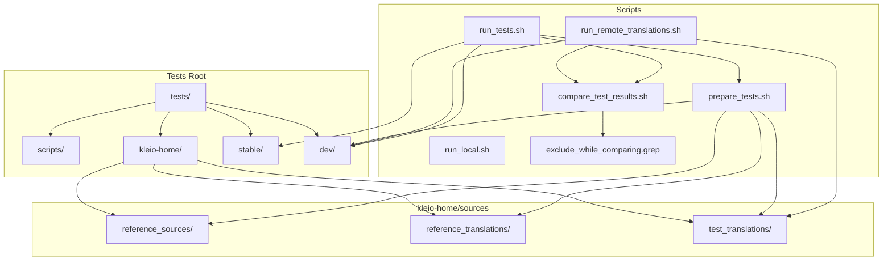
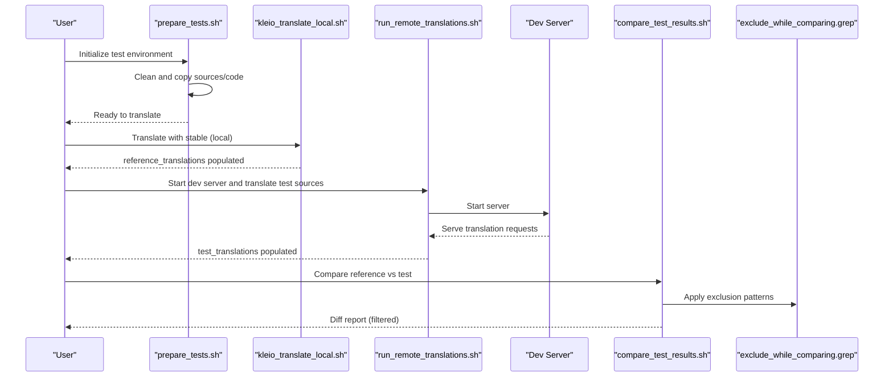
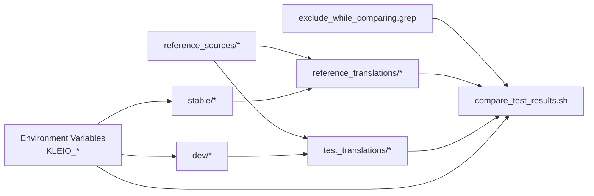

# Semantic Testing

<cite>
**Referenced Files in This Document**
- [tests/README.md](file://tests/README.md)
- [tests/scripts/run_tests.sh](file://tests/scripts/run_tests.sh)
- [tests/scripts/run_remote_translations.sh](file://tests/scripts/run_remote_translations.sh)
- [tests/scripts/prepare_tests.sh](file://tests/scripts/prepare_tests.sh)
- [tests/scripts/kleio_translate_local.sh](file://tests/scripts/kleio_translate_local.sh)
- [tests/scripts/compare_test_results.sh](file://tests/scripts/compare_test_results.sh)
- [tests/scripts/exclude_while_comparing.grep](file://tests/scripts/exclude_while_comparing.grep)
- [tests/kleio-home/sources/reference_sources/bugs/bugs.cli](file://tests/kleio-home/sources/reference_sources/bugs/bugs.cli)
- [tests/kleio-home/sources/reference_translations/bugs/bugs.err](file://tests/kleio-home/sources/reference_translations/bugs/bugs.err)
- [tests/kleio-home/sources/test_translations/bugs/bugs.err](file://tests/kleio-home/sources/test_translations/bugs/bugs.err)
</cite>

## Table of Contents
1. [Introduction](#introduction)
2. [Project Structure](#project-structure)
3. [Core Components](#core-components)
4. [Architecture Overview](#architecture-overview)
5. [Detailed Component Analysis](#detailed-component-analysis)
6. [Dependency Analysis](#dependency-analysis)
7. [Performance Considerations](#performance-considerations)
8. [Troubleshooting Guide](#troubleshooting-guide)
9. [Conclusion](#conclusion)
10. [Appendices](#appendices)

## Introduction
This document describes the semantic testing subsystem for validating translation output consistency between a stable and a development version of the Kleio translator. The goal is to ensure that architectural and functional changes do not introduce unintended differences in translation results. The system compares outputs from both versions using a diff-based approach with a filtering mechanism to ignore expected differences such as timestamps, auto-generated identifiers, and file paths.

## Project Structure
The semantic testing area is organized under the tests directory with the following key elements:
- Test data hierarchy:
  - reference_sources: canonical source files used as the basis for translation.
  - reference_translations: outputs generated by the stable translator.
  - test_translations: outputs generated by the development translator.
  - stable and dev: code roots for the stable and development translator versions.
- Scripts to orchestrate preparation, translation, server startup/teardown, and comparison.
- Reports directory for diff outputs.

**Diagram sources**
- [tests/README.md](file://tests/README.md#L38-L75)
- [tests/scripts/prepare_tests.sh](file://tests/scripts/prepare_tests.sh#L1-L51)
- [tests/scripts/run_remote_translations.sh](file://tests/scripts/run_remote_translations.sh#L1-L51)
- [tests/scripts/run_tests.sh](file://tests/scripts/run_tests.sh#L1-L39)
- [tests/scripts/compare_test_results.sh](file://tests/scripts/compare_test_results.sh#L1-L9)
- [tests/scripts/exclude_while_comparing.grep](file://tests/scripts/exclude_while_comparing.grep#L1-L51)

**Section sources**
- [tests/README.md](file://tests/README.md#L38-L75)

## Core Components
- Test data hierarchy:
  - reference_sources: seed files for translation.
  - reference_translations: outputs from the stable translator.
  - test_translations: outputs from the development translator.
- Comparison filtering:
  - exclude_while_comparing.grep: a list of patterns to suppress expected differences in diffs.
- Orchestration scripts:
  - prepare_tests.sh: initializes directories and copies sources and code.
  - run_tests.sh: orchestrates stable and dev translation runs and comparison.
  - run_remote_translations.sh: prepares dev environment and runs server-mode translation.
  - kleio_translate_local.sh: runs translator locally via SWI-Prolog for stable or dev.
  - compare_test_results.sh: performs diff and applies filtering.

Key responsibilities:
- Prepare a controlled environment with identical inputs for both translators.
- Translate the same sources with stable and dev versions.
- Compare outputs with intelligent filtering to surface only meaningful differences.
- Produce a report for review and action.

**Section sources**
- [tests/README.md](file://tests/README.md#L38-L75)
- [tests/scripts/prepare_tests.sh](file://tests/scripts/prepare_tests.sh#L1-L51)
- [tests/scripts/run_tests.sh](file://tests/scripts/run_tests.sh#L1-L39)
- [tests/scripts/run_remote_translations.sh](file://tests/scripts/run_remote_translations.sh#L1-L51)
- [tests/scripts/kleio_translate_local.sh](file://tests/scripts/kleio_translate_local.sh#L1-L23)
- [tests/scripts/compare_test_results.sh](file://tests/scripts/compare_test_results.sh#L1-L9)
- [tests/scripts/exclude_while_comparing.grep](file://tests/scripts/exclude_while_comparing.grep#L1-L51)

## Architecture Overview
The semantic testing pipeline follows a deterministic flow:
- Preparation: copy sources and code into controlled directories.
- Stable translation: run stable translator on reference_sources to populate reference_translations.
- Dev translation: start dev server and translate the same sources to test_translations.
- Comparison: diff outputs and filter expected differences.

**Diagram sources**
- [tests/scripts/prepare_tests.sh](file://tests/scripts/prepare_tests.sh#L1-L51)
- [tests/scripts/kleio_translate_local.sh](file://tests/scripts/kleio_translate_local.sh#L1-L23)
- [tests/scripts/run_remote_translations.sh](file://tests/scripts/run_remote_translations.sh#L1-L51)
- [tests/scripts/compare_test_results.sh](file://tests/scripts/compare_test_results.sh#L1-L9)
- [tests/scripts/exclude_while_comparing.grep](file://tests/scripts/exclude_while_comparing.grep#L1-L51)

## Detailed Component Analysis

### Test Data Hierarchy
- reference_sources: contains the canonical set of .cli/.kleio files used as inputs.
- reference_translations: populated by the stable translator; serves as the baseline.
- test_translations: populated by the dev translator; compared against reference_translations.
- stable and dev: translator code roots for stable and development versions respectively.

Operational notes:
- Both reference_translations and test_translations are seeded from reference_sources.
- The dev translator runs in server mode and translates files remotely.
- The stable translator runs locally via SWI-Prolog.

**Section sources**
- [tests/README.md](file://tests/README.md#L46-L52)

### Comparison Filtering Mechanism
The filtering mechanism uses a grep-based pattern list to ignore expected differences:
- Timestamps and build metadata.
- Auto-generated identifiers and relation IDs.
- Paths and filenames differing only by directory location.
- Structural and informational headers that vary across runs.

Patterns include:
- Version/build markers.
- ID-like tokens and element attributes.
- File path references in CDATA and error reports.
- Report headers and counts.

These patterns are applied to the raw diff output to reduce noise and focus on meaningful differences.

**Section sources**
- [tests/README.md](file://tests/README.md#L11-L11)
- [tests/scripts/exclude_while_comparing.grep](file://tests/scripts/exclude_while_comparing.grep#L1-L51)

### Orchestration Scripts
- prepare_tests.sh:
  - Cleans and creates target directories.
  - Copies translator code and structure files to dev.
  - Seeds reference_translations and test_translations from reference_sources.
  - Sets environment variables for downstream scripts.

- run_tests.sh:
  - Generates a timestamped report file.
  - Runs stable translation locally.
  - Starts dev server and runs remote translation.
  - Compares results and writes the report.

- run_remote_translations.sh:
  - Prepares environment variables for dev translation.
  - Copies current src to dev and seeds test_translations.
  - Starts dev server, translates, stops server, and compares.

- kleio_translate_local.sh:
  - Iterates over .cli/.kleio files and invokes SWI-Prolog for translation.

- compare_test_results.sh:
  - Performs recursive diff between reference and test directories.
  - Filters output using exclude_while_comparing.grep.

**Section sources**
- [tests/scripts/prepare_tests.sh](file://tests/scripts/prepare_tests.sh#L1-L51)
- [tests/scripts/run_tests.sh](file://tests/scripts/run_tests.sh#L1-L39)
- [tests/scripts/run_remote_translations.sh](file://tests/scripts/run_remote_translations.sh#L1-L51)
- [tests/scripts/kleio_translate_local.sh](file://tests/scripts/kleio_translate_local.sh#L1-L23)
- [tests/scripts/compare_test_results.sh](file://tests/scripts/compare_test_results.sh#L1-L9)

### Example Test Case Files
- reference_sources/bugs/bugs.cli: a representative input file used in semantic tests.
- reference_translations/bugs/bugs.err and test_translations/bugs/bugs.err: error reports from stable and dev translators, respectively.

Observations:
- Error reports include version/build metadata and timestamps.
- Differences in timestamps are expected and filtered by the exclusion patterns.

**Section sources**
- [tests/kleio-home/sources/reference_sources/bugs/bugs.cli](file://tests/kleio-home/sources/reference_sources/bugs/bugs.cli#L1-L20)
- [tests/kleio-home/sources/reference_translations/bugs/bugs.err](file://tests/kleio-home/sources/reference_translations/bugs/bugs.err#L1-L5)
- [tests/kleio-home/sources/test_translations/bugs/bugs.err](file://tests/kleio-home/sources/test_translations/bugs/bugs.err#L1-L5)

## Dependency Analysis
The semantic testing subsystem depends on:
- Consistent test data in reference_sources.
- Correct environment variable setup for translator invocation.
- Stable and dev code roots with compatible APIs.
- Exclusion patterns aligned with expected output variations.

**Diagram sources**
- [tests/scripts/prepare_tests.sh](file://tests/scripts/prepare_tests.sh#L9-L29)
- [tests/scripts/compare_test_results.sh](file://tests/scripts/compare_test_results.sh#L7-L8)
- [tests/scripts/exclude_while_comparing.grep](file://tests/scripts/exclude_while_comparing.grep#L1-L51)

**Section sources**
- [tests/scripts/prepare_tests.sh](file://tests/scripts/prepare_tests.sh#L9-L29)
- [tests/scripts/compare_test_results.sh](file://tests/scripts/compare_test_results.sh#L7-L8)

## Performance Considerations
- Minimize redundant translations by reusing prepared directories.
- Prefer server mode for dev translation to leverage multi-worker concurrency.
- Keep the number of test files manageable; use targeted subsets for quick iterations.
- Filter patterns should be precise to avoid masking real differences while reducing noise.

## Troubleshooting Guide
Common issues and resolutions:
- No differences reported:
  - Verify that both reference_translations and test_translations contain outputs.
  - Confirm that the dev server started and served translation requests.
- Unexpected differences:
  - Inspect the report file for excluded lines to confirm they match intended patterns.
  - Add new exclusion patterns to exclude_while_comparing.grep if differences are expected.
- Path or ID differences:
  - These are commonly filtered; ensure patterns cover the specific forms in your outputs.
- Build/version differences:
  - Ensure version/build metadata is covered by exclusion patterns.

Interpreting diff results:
- Lines starting with "<" indicate differences present only in reference_translations.
- Lines starting with ">" indicate differences present only in test_translations.
- Use the exclusion patterns to distinguish expected from unexpected differences.

Handling false positives:
- If a change is intentional and should persist, update the reference implementation (stable) to match.
- Alternatively, update the reference_translations to reflect the new expected output.
- Add or refine exclusion patterns to suppress expected differences.

Maintaining test stability across architectural changes:
- Keep exclude patterns aligned with output variations.
- Rebuild reference_translations when deliberate output changes occur.
- Validate that new features do not inadvertently alter unrelated outputs.

**Section sources**
- [tests/README.md](file://tests/README.md#L34-L37)
- [tests/scripts/compare_test_results.sh](file://tests/scripts/compare_test_results.sh#L7-L8)
- [tests/scripts/exclude_while_comparing.grep](file://tests/scripts/exclude_while_comparing.grep#L1-L51)

## Conclusion
The semantic testing subsystem ensures translation consistency between stable and development versions of the Kleio translator. By controlling inputs, translating with both versions, and applying intelligent filtering, it highlights meaningful differences while suppressing expected noise. Proper maintenance of test data, exclusion patterns, and reference outputs is essential for reliable and actionable results.

## Appendices

### Step-by-Step Procedures

- Running semantic tests:
  - From the repository root, execute the provided make target to run the semantic tests.
  - Review the generated report file in the reports directory for diff results.

- Interpreting diff results:
  - Focus on lines prefixed with "<" or ">" indicating differences.
  - Confirm whether differences are expected by checking exclusion patterns.

- Handling false positives:
  - Update reference_translations or stable outputs to align with new expectations.
  - Add or refine exclusion patterns to suppress expected differences.

- Adding new test cases:
  - Place new .cli/.kleio files in reference_sources under appropriate categories.
  - Seed reference_translations and test_translations by running the preparation script.

- Updating reference implementations:
  - After validating a change, copy outputs from test_translations to reference_translations to establish the new baseline.

- Managing test data:
  - Keep reference_sources curated and representative.
  - Periodically refresh reference_translations when deliberate output changes occur.

**Section sources**
- [tests/README.md](file://tests/README.md#L101-L109)
- [tests/scripts/run_tests.sh](file://tests/scripts/run_tests.sh#L11-L39)
- [tests/scripts/prepare_tests.sh](file://tests/scripts/prepare_tests.sh#L30-L39)