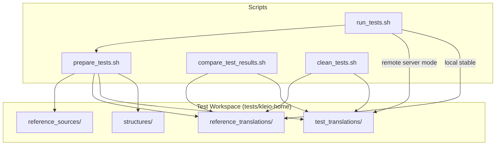
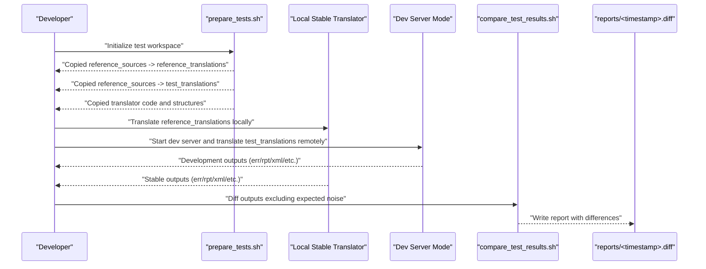
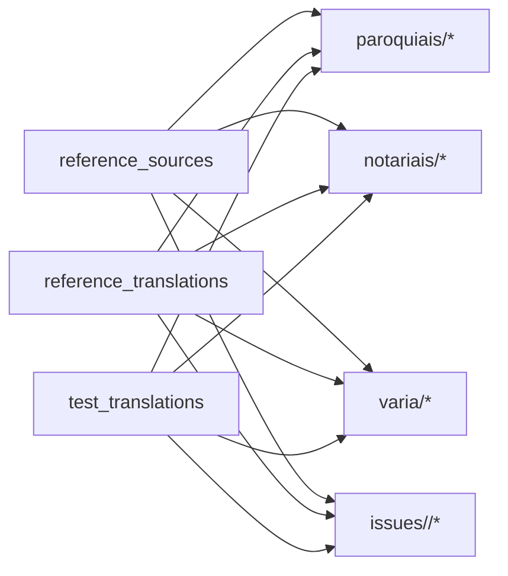
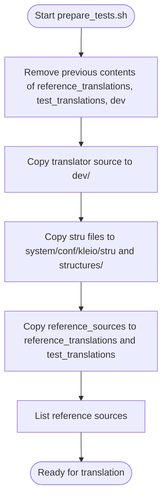
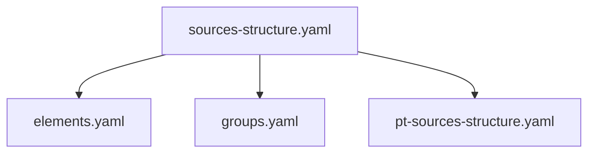
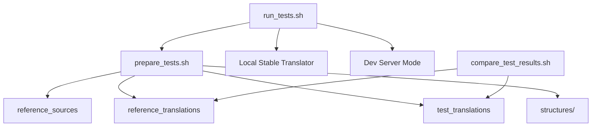

# Test Data Management

<cite>
**Referenced Files in This Document**
- [tests/README.md](file://tests/README.md)
- [tests/kleio-home/sources/reference_sources/yaml/README.md](file://tests/kleio-home/sources/reference_sources/yaml/README.md)
- [tests/kleio-home/sources/reference_translations/yaml/README.md](file://tests/kleio-home/sources/reference_translations/yaml/README.md)
- [tests/kleio-home/structures/sources-structure.yaml](file://tests/kleio-home/structures/sources-structure.yaml)
- [tests/scripts/prepare_tests.sh](file://tests/scripts/prepare_tests.sh)
- [tests/scripts/run_tests.sh](file://tests/scripts/run_tests.sh)
- [tests/scripts/clean_tests.sh](file://tests/scripts/clean_tests.sh)
- [tests/scripts/compare_test_results.sh](file://tests/scripts/compare_test_results.sh)
</cite>

## Table of Contents
1. [Introduction](#introduction)
2. [Project Structure](#project-structure)
3. [Core Components](#core-components)
4. [Architecture Overview](#architecture-overview)
5. [Detailed Component Analysis](#detailed-component-analysis)
6. [Dependency Analysis](#dependency-analysis)
7. [Performance Considerations](#performance-considerations)
8. [Troubleshooting Guide](#troubleshooting-guide)
9. [Conclusion](#conclusion)
10. [Appendices](#appendices)

## Introduction
This document describes the test data management system for the Kleio translator. It explains the hierarchical organization of test datasets, the automatic copying mechanisms between source and target directories, and the rationale for separating reference and test datasets. It also documents how test data is categorized by domain, how issue tracking is integrated, and how version control and structure files relate to test data. Practical guidance is provided for adding new test data, maintaining data integrity, and managing large test datasets, including anonymization considerations and strategies to keep datasets current with evolving requirements.

## Project Structure
The test data system centers around a dedicated test workspace under tests/kleio-home. The key directories and roles are:
- Reference sources: A canonical set of “cli” source files used as the baseline for translation comparisons.
- Reference translations: A working copy of reference_sources used to generate stable translation outputs (err, rpt, xml, org, old, and others).
- Test translations: A working copy of reference_sources used to generate translation outputs with the development version of the translator.
- Structures: Default and domain-specific structure definitions that guide translation behavior.
- Scripts: Automation to prepare, run, compare, and clean test datasets.

**Diagram sources**
- [tests/scripts/prepare_tests.sh](file://tests/scripts/prepare_tests.sh#L1-L51)
- [tests/scripts/run_tests.sh](file://tests/scripts/run_tests.sh#L1-L39)
- [tests/scripts/compare_test_results.sh](file://tests/scripts/compare_test_results.sh#L1-L9)
- [tests/scripts/clean_tests.sh](file://tests/scripts/clean_tests.sh#L1-L5)

**Section sources**
- [tests/README.md](file://tests/README.md#L38-L75)
- [tests/scripts/prepare_tests.sh](file://tests/scripts/prepare_tests.sh#L1-L51)
- [tests/scripts/run_tests.sh](file://tests/scripts/run_tests.sh#L1-L39)

## Core Components
- Hierarchical test data structure
  - reference_sources: Canonical source files organized by domain (e.g., parish, notarial, civil).
  - reference_translations: Stable outputs generated from reference_sources.
  - test_translations: Development outputs generated from reference_sources.
- Automatic copying mechanisms
  - prepare_tests.sh initializes test directories by copying reference_sources into both reference_translations and test_translations, and by copying translator code and structure files into the test environment.
- Separation rationale
  - Maintaining separate reference and test datasets ensures reproducible comparisons between stable and development translators, preventing cross-contamination of outputs.
- Domain categorization
  - Domains such as paroquiais (parish), notariais (notarial), and varia (miscellaneous) are supported and mirrored across directories.
- Issue tracking integration
  - Dedicated issues/<issue-id> subdirectories enable targeted regression testing and incremental validation.
- Version control integration
  - Structure files (e.g., sources-structure.yaml) and YAML-based structures are included to align test behavior with evolving structure definitions.

**Section sources**
- [tests/README.md](file://tests/README.md#L46-L52)
- [tests/scripts/prepare_tests.sh](file://tests/scripts/prepare_tests.sh#L34-L39)
- [tests/kleio-home/structures/sources-structure.yaml](file://tests/kleio-home/structures/sources-structure.yaml#L1-L9)

## Architecture Overview
The test lifecycle orchestrates preparation, translation, comparison, and reporting. It supports both local stable translation and remote server-mode translation for the development version.

**Diagram sources**
- [tests/scripts/run_tests.sh](file://tests/scripts/run_tests.sh#L24-L36)
- [tests/scripts/prepare_tests.sh](file://tests/scripts/prepare_tests.sh#L34-L39)
- [tests/scripts/compare_test_results.sh](file://tests/scripts/compare_test_results.sh#L7-L8)

## Detailed Component Analysis

### Hierarchical Test Data Organization
- Domains and subdomains
  - Paroquiais (parish): Includes domains such as baptismos, casamentos, crisma, obitos.
  - Notariais (notarial): Includes notarial documents.
  - Varia (miscellaneous): Includes diverse edge cases and experiments.
- Issues tracking
  - Dedicated issue folders under issues/<issue-id> allow isolating and validating specific bug fixes or features.
- YAML structures
  - YAML-based structure files enable testing of new structure definitions alongside corresponding Kleio inputs.

**Diagram sources**
- [tests/README.md](file://tests/README.md#L46-L49)

**Section sources**
- [tests/README.md](file://tests/README.md#L46-L49)
- [tests/kleio-home/sources/reference_sources/yaml/README.md](file://tests/kleio-home/sources/reference_sources/yaml/README.md#L1-L12)
- [tests/kleio-home/sources/reference_translations/yaml/README.md](file://tests/kleio-home/sources/reference_translations/yaml/README.md#L1-L12)

### Automatic Copying Mechanisms
- Preparation
  - prepare_tests.sh clears and repopulates reference_translations and test_translations by copying reference_sources.
  - Copies translator code and structure files into the test environment to ensure consistent behavior.
- Execution
  - run_tests.sh invokes prepare_tests.sh, runs stable translator on reference_translations, starts the dev server for test_translations, and compares outputs via compare_test_results.sh.
- Cleaning
  - clean_tests.sh resets test directories to a clean state.

**Diagram sources**
- [tests/scripts/prepare_tests.sh](file://tests/scripts/prepare_tests.sh#L30-L45)

**Section sources**
- [tests/scripts/prepare_tests.sh](file://tests/scripts/prepare_tests.sh#L1-L51)
- [tests/scripts/run_tests.sh](file://tests/scripts/run_tests.sh#L13-L20)
- [tests/scripts/clean_tests.sh](file://tests/scripts/clean_tests.sh#L1-L5)

### Relationship Between Test Data and Structure Files
- Default structure definitions
  - sources-structure.yaml aggregates core elements, groups, and Portuguese sources definitions.
- YAML-based structures
  - YAML structure files enable testing of new structure definitions against corresponding Kleio inputs.
- Mapping configurations and inference rules
  - While not part of this document’s scope, structure files define the mapping and inference contexts that influence translation outputs.

**Diagram sources**
- [tests/kleio-home/structures/sources-structure.yaml](file://tests/kleio-home/structures/sources-structure.yaml#L1-L9)

**Section sources**
- [tests/kleio-home/structures/sources-structure.yaml](file://tests/kleio-home/structures/sources-structure.yaml#L1-L9)
- [tests/kleio-home/sources/reference_sources/yaml/README.md](file://tests/kleio-home/sources/reference_sources/yaml/README.md#L3-L11)
- [tests/kleio-home/sources/reference_translations/yaml/README.md](file://tests/kleio-home/sources/reference_translations/yaml/README.md#L3-L11)

### Test Data Organization Principles
- File categorization by domain
  - Paroquiais, notariais, and varia directories mirror the structure of reference_sources across reference_translations and test_translations.
- Issue tracking
  - Dedicated issues/<issue-id> subdirectories isolate test cases for specific issues, enabling targeted regression checks.
- Version control integration
  - Structure files and YAML definitions are maintained alongside test data to ensure tests remain aligned with evolving structure specifications.

**Section sources**
- [tests/README.md](file://tests/README.md#L46-L49)
- [tests/kleio-home/sources/reference_sources/yaml/README.md](file://tests/kleio-home/sources/reference_sources/yaml/README.md#L1-L12)
- [tests/kleio-home/sources/reference_translations/yaml/README.md](file://tests/kleio-home/sources/reference_translations/yaml/README.md#L1-L12)

### Guidelines for Adding New Test Data
- Add to reference_sources
  - Place new Kleio files under the appropriate domain (e.g., paroquiais/baptismos, notariais, varia).
  - For YAML structure testing, place corresponding YAML structure files under structures/api/yaml.
- Trigger translation and comparison
  - Use run_tests.sh to prepare, translate, and compare outputs.
- Maintain parity
  - Ensure that corresponding structure files are present in structures/ to match the intended translation behavior.

**Section sources**
- [tests/README.md](file://tests/README.md#L76-L98)
- [tests/scripts/run_tests.sh](file://tests/scripts/run_tests.sh#L13-L20)

### Maintaining Data Integrity
- Use prepare_tests.sh to ensure clean and consistent test environments.
- Use compare_test_results.sh to diff outputs while filtering expected differences.
- Keep structure files synchronized with test data to avoid mismatches.

**Section sources**
- [tests/scripts/prepare_tests.sh](file://tests/scripts/prepare_tests.sh#L30-L45)
- [tests/scripts/compare_test_results.sh](file://tests/scripts/compare_test_results.sh#L7-L8)

### Managing Large Test Datasets
- Parallelization
  - The dev server mode allows scaling translation throughput for large datasets.
- Selective activation
  - Use the translate_file predicate in server mode to selectively activate subsets of test files for quick iterations.
- Reporting
  - Reports are timestamped and stored under reports/ for later inspection.

**Section sources**
- [tests/README.md](file://tests/README.md#L82-L98)
- [tests/scripts/run_tests.sh](file://tests/scripts/run_tests.sh#L29-L34)

### Data Anonymization and Maintenance
- Anonymization
  - Prefer using anonymized or synthetic data in reference_sources to protect privacy.
- Maintenance
  - Regularly review and prune obsolete test files; keep structure files updated to reflect current requirements.
- Keeping datasets current
  - Align structure files and YAML definitions with evolving requirements; regenerate reference_translations outputs when structure definitions change.

[No sources needed since this section provides general guidance]

## Dependency Analysis
The test system depends on:
- Script orchestration: prepare_tests.sh, run_tests.sh, compare_test_results.sh, clean_tests.sh.
- Directory layout: reference_sources, reference_translations, test_translations, structures.
- Structure files: sources-structure.yaml and domain-specific YAML structures.

**Diagram sources**
- [tests/scripts/prepare_tests.sh](file://tests/scripts/prepare_tests.sh#L34-L39)
- [tests/scripts/run_tests.sh](file://tests/scripts/run_tests.sh#L24-L36)
- [tests/scripts/compare_test_results.sh](file://tests/scripts/compare_test_results.sh#L7-L8)

**Section sources**
- [tests/scripts/prepare_tests.sh](file://tests/scripts/prepare_tests.sh#L30-L45)
- [tests/scripts/run_tests.sh](file://tests/scripts/run_tests.sh#L24-L36)
- [tests/scripts/compare_test_results.sh](file://tests/scripts/compare_test_results.sh#L7-L8)

## Performance Considerations
- Use server mode for development translation to leverage concurrency and reduce overhead for large datasets.
- Filter diffs to focus on meaningful differences and avoid noise from timestamps and auto-generated identifiers.
- Keep structure files minimal and modular to speed up translation and reduce memory footprint.

[No sources needed since this section provides general guidance]

## Troubleshooting Guide
- Differences in reports
  - Review reports/<timestamp>.diff for discrepancies between reference_translations and test_translations.
  - Use compare_test_results.sh to confirm whether differences are expected or unexpected.
- Clean state
  - Use clean_tests.sh to reset directories and rerun tests from a clean baseline.
- Structure mismatches
  - Ensure structure files (e.g., sources-structure.yaml and YAML structures) are present and consistent with test data.

**Section sources**
- [tests/README.md](file://tests/README.md#L108-L126)
- [tests/scripts/clean_tests.sh](file://tests/scripts/clean_tests.sh#L1-L5)
- [tests/scripts/compare_test_results.sh](file://tests/scripts/compare_test_results.sh#L7-L8)

## Conclusion
The test data management system for the Kleio translator provides a robust framework for maintaining and validating translation outputs. By separating reference and test datasets, automating copying and comparison, and organizing data by domain and issue, it enables reliable regression testing and continuous validation against evolving structure definitions. Following the guidelines herein will help ensure data integrity, efficient maintenance, and scalability for large test suites.

## Appendices
- Quick reference
  - Prepare: run prepare_tests.sh
  - Translate: run run_tests.sh
  - Compare: run compare_test_results.sh
  - Clean: run clean_tests.sh

[No sources needed since this section provides general guidance]