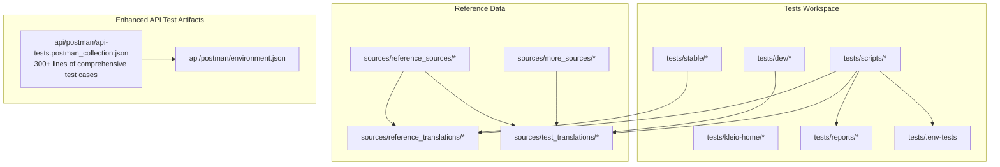
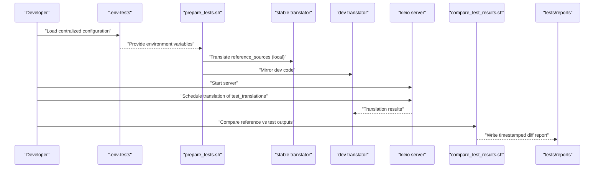
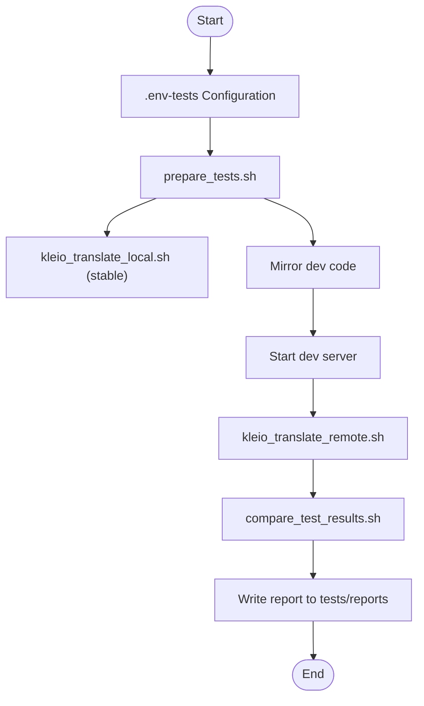
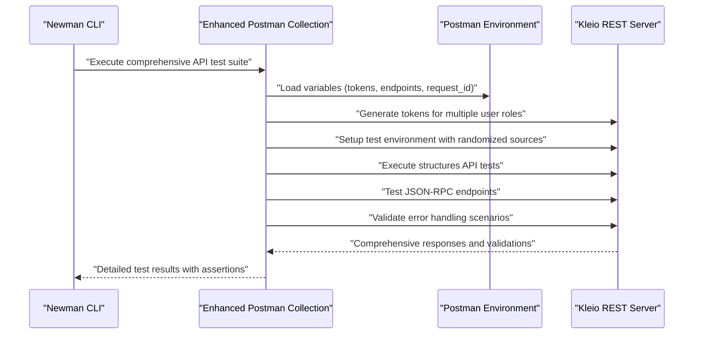
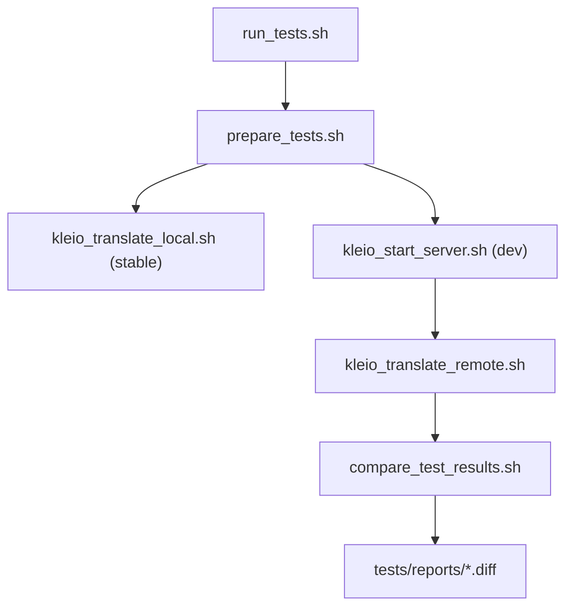
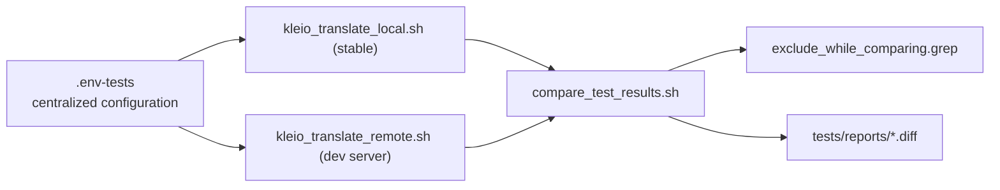

# Testing Framework

<cite>
**Referenced Files in This Document**
- [tests/README.md](file://tests/README.md)
- [tests/scripts/run_tests.sh](file://tests/scripts/run_tests.sh)
- [tests/scripts/run_tests_local.sh](file://tests/scripts/run_tests_local.sh)
- [tests/scripts/prepare_tests.sh](file://tests/scripts/prepare_tests.sh)
- [tests/scripts/compare_test_results.sh](file://tests/scripts/compare_test_results.sh)
- [tests/scripts/kleio_translate_local.sh](file://tests/scripts/kleio_translate_local.sh)
- [tests/scripts/kleio_translate_remote.sh](file://tests/scripts/kleio_translate_remote.sh)
- [tests/scripts/exclude_while_comparing.grep](file://tests/scripts/exclude_while_comparing.grep)
- [tests/scripts/env_tests.sh](file://tests/scripts/env_tests.sh)
- [api/postman/api-tests.postman_collection.json](file://api/postman/api-tests.postman_collection.json)
- [api/postman/environment.json](file://api/postman/environment.json)
- [tests/stable](file://tests/stable)
- [tests/dev](file://tests/dev)
- [tests/reports](file://tests/reports)
- [Makefile](file://Makefile)
</cite>

## Update Summary
**Changes Made**
- Enhanced documentation to reflect comprehensive Postman collection updates with over 300 lines of new test cases
- Updated API testing infrastructure documentation to cover expanded structures API functionality
- Added detailed coverage of JSON-RPC and REST API endpoint testing scenarios
- Enhanced error handling and validation test coverage
- Updated test execution workflows and reporting mechanisms

## Table of Contents
1. [Introduction](#introduction)
2. [Project Structure](#project-structure)
3. [Core Components](#core-components)
4. [Architecture Overview](#architecture-overview)
5. [Detailed Component Analysis](#detailed-component-analysis)
6. [Dependency Analysis](#dependency-analysis)
7. [Performance Considerations](#performance-considerations)
8. [Troubleshooting Guide](#troubleshooting-guide)
9. [Conclusion](#conclusion)
10. [Appendices](#appendices)

## Introduction
This document describes the Timelink Kleio testing framework, focusing on automated validation of the translator and REST API. It explains the dual testing approach:
- Semantic tests: compare translation outputs between a stable baseline and the development version to detect behavioral regressions.
- API tests: validate REST and JSON-RPC endpoints using Postman/Newman collections to ensure service functionality.

The framework now features centralized configuration through .env-tests, comprehensive test script documentation, and significantly enhanced API testing infrastructure with over 300 lines of new test cases covering structures API functionality, JSON-RPC and REST API endpoints, and comprehensive error handling scenarios.

## Project Structure
The testing system is organized around a dedicated tests workspace with four primary datasets and supporting scripts:
- Stable dataset: a snapshot of the translator code used as the reference baseline.
- Development dataset: the current working translator code under test.
- Reference dataset: a curated set of source files used to drive translations and comparisons.
- More sources dataset: an expanded collection of additional test sources for comprehensive coverage.

Key directories and files:
- tests/stable: stable translator code and assets used as the reference.
- tests/dev: development translator code mirrored for local or server-side testing.
- tests/kleio-home/sources/reference_sources: canonical source files for translation.
- tests/kleio-home/sources/reference_translations: outputs from the stable translator run.
- tests/kleio-home/sources/test_translations: outputs from the development translator run.
- tests/kleio-home/sources/more_sources: expanded collection of additional test sources.
- tests/scripts: orchestration and comparison utilities with centralized configuration.
- api/postman: Postman collection with comprehensive API test coverage including structures API, JSON-RPC, and error handling.
- tests/.env-tests: centralized configuration file for all test scripts.

**Diagram sources**
- [tests/README.md:39-54](file://tests/README.md#L39-L54)
- [tests/scripts/prepare_tests.sh:1-33](file://tests/scripts/prepare_tests.sh#L1-L33)
- [tests/scripts/run_tests.sh:1-39](file://tests/scripts/run_tests.sh#L1-L39)
- [api/postman/api-tests.postman_collection.json:1-7](file://api/postman/api-tests.postman_collection.json#L1-L7)

**Section sources**
- [tests/README.md:39-54](file://tests/README.md#L39-L54)
- [tests/scripts/prepare_tests.sh:1-33](file://tests/scripts/prepare_tests.sh#L1-L33)

## Core Components
- Centralized Configuration System
  - .env-tests: Single configuration file defining all test parameters including directory paths, server settings, and authentication tokens.
  - Environment variable management: Consistent configuration across all test scripts with optional custom configuration files.

- Semantic testing pipeline
  - Preparation: mirrors reference sources into both reference_translations and test_translations, copies current translator code into dev, and prepares structure files.
  - Execution: runs stable translator on reference_translations and development translator on test_translations.
  - Comparison: diffs outputs and filters expected noise via a pattern list.
  - Reporting: writes a timestamped report to tests/reports.

- Enhanced API testing pipeline
  - Comprehensive Postman collection with 300+ lines of test cases covering structures API functionality, JSON-RPC and REST API endpoints, and error handling scenarios.
  - Dynamic token generation and management for multiple user roles (limited, tester, coordinator).
  - Automated test environment setup with randomized source selection and directory operations.
  - Advanced validation including request/response headers, status codes, and content-type verification.

- Enhanced test data hierarchy
  - Stable: baseline translator code and structure files.
  - Development: current translator code under test.
  - Reference: canonical sources and expected outputs.
  - More sources: expanded collection of additional test cases for comprehensive coverage.

**Section sources**
- [tests/README.md:56-78](file://tests/README.md#L56-L78)
- [tests/scripts/run_tests.sh:1-39](file://tests/scripts/run_tests.sh#L1-L39)
- [tests/scripts/compare_test_results.sh:1-9](file://tests/scripts/compare_test_results.sh#L1-L9)
- [tests/scripts/exclude_while_comparing.grep:1-51](file://tests/scripts/exclude_while_comparing.grep#L1-L51)
- [api/postman/api-tests.postman_collection.json:1-7](file://api/postman/api-tests.postman_collection.json#L1-L7)

## Architecture Overview
The testing architecture comprises two complementary pipelines with centralized configuration: semantic and API. The enhanced API testing infrastructure now includes comprehensive coverage of structures API functionality, JSON-RPC and REST endpoints, and sophisticated error handling scenarios.

**Diagram sources**
- [tests/scripts/run_tests.sh:7-39](file://tests/scripts/run_tests.sh#L7-L39)
- [tests/scripts/kleio_translate_local.sh:1-24](file://tests/scripts/kleio_translate_local.sh#L1-L24)
- [tests/scripts/kleio_translate_remote.sh:1-16](file://tests/scripts/kleio_translate_remote.sh#L1-L16)
- [tests/scripts/compare_test_results.sh:1-9](file://tests/scripts/compare_test_results.sh#L1-L9)
- [tests/reports](file://tests/reports)

## Detailed Component Analysis

### Centralized Configuration System
The testing framework now features a centralized configuration system through .env-tests that provides unified parameter management across all test scripts. This system eliminates configuration drift and simplifies test environment setup.

Key configuration variables include:
- KLEIO_HOME: Root directory for Kleio installation
- KLEIO_SERVER_PORT: Port for REST API testing (default: 8088)
- KLEIO_ADMIN_TOKEN: Authentication token for API operations
- DIRECTORY_PATHS: Reference sources, translations, and code directories
- SERVER_SETTINGS: Worker threads, idle timeouts, and debugging options

**Section sources**
- [tests/README.md:56-78](file://tests/README.md#L56-L78)
- [tests/scripts/env_tests.sh:1-27](file://tests/scripts/env_tests.sh#L1-L27)

### Semantic Testing Pipeline
Semantic tests ensure behavioral parity between the stable and development translator versions by comparing their outputs on the same reference sources. The enhanced pipeline now includes centralized configuration and improved error handling:

- **Preparation Phase**: Loads .env-tests configuration, cleans and mirrors directories, copies structure files, and prepares both reference_translations and test_translations.
- **Execution Phase**: Runs stable translator locally against reference_translations, starts development server for remote translation, and handles server lifecycle management.
- **Comparison Phase**: Performs directory diff with advanced filtering using exclude_while_comparing.grep patterns.
- **Reporting Phase**: Generates timestamped reports with detailed timing information and execution summaries.

**Diagram sources**
- [tests/scripts/prepare_tests.sh:1-33](file://tests/scripts/prepare_tests.sh#L1-L33)
- [tests/scripts/kleio_translate_local.sh:1-24](file://tests/scripts/kleio_translate_local.sh#L1-L24)
- [tests/scripts/kleio_translate_remote.sh:1-16](file://tests/scripts/kleio_translate_remote.sh#L1-L16)
- [tests/scripts/compare_test_results.sh:1-9](file://tests/scripts/compare_test_results.sh#L1-L9)
- [tests/reports](file://tests/reports)

**Section sources**
- [tests/README.md:102-171](file://tests/README.md#L102-L171)
- [tests/scripts/run_tests.sh:1-39](file://tests/scripts/run_tests.sh#L1-L39)
- [tests/scripts/prepare_tests.sh:1-33](file://tests/scripts/prepare_tests.sh#L1-L33)
- [tests/scripts/kleio_translate_local.sh:1-24](file://tests/scripts/kleio_translate_local.sh#L1-L24)
- [tests/scripts/kleio_translate_remote.sh:1-16](file://tests/scripts/kleio_translate_remote.sh#L1-L16)
- [tests/scripts/compare_test_results.sh:1-9](file://tests/scripts/compare_test_results.sh#L1-L9)

### Enhanced API Testing Pipeline
The API testing infrastructure has been significantly enhanced with comprehensive coverage of structures API functionality, JSON-RPC and REST endpoints, and sophisticated error handling scenarios. The enhanced Postman collection now includes over 300 lines of test cases covering:

- **User Management and Authentication**
  - Dynamic token generation for multiple user roles (limited, tester, coordinator)
  - User invalidation and permission testing
  - Role-based access control validation

- **Source Management Operations**
  - File retrieval with proper headers and content validation
  - Directory operations including creation, deletion, and listing
  - Recursive operations with proper status filtering
  - Randomized source and directory selection for comprehensive testing

- **Structure API Functionality**
  - Structures endpoint validation with proper JSON response formatting
  - Structure file operations and validation
  - Error handling for invalid structure requests

- **Error Handling and Edge Cases**
  - Authorization error scenarios
  - Invalid request parameter testing
  - Network timeout and server error simulation
  - Response header validation including Request-id, Content-Type, and Location headers

- **Advanced Validation Features**
  - Request-id tracking and validation
  - Content-type verification for JSON responses
  - Location header validation for file operations
  - Status code verification for all endpoints

**Diagram sources**
- [api/postman/api-tests.postman_collection.json:1-7](file://api/postman/api-tests.postman_collection.json#L1-L7)
- [api/postman/api-tests.postman_collection.json:16-39](file://api/postman/api-tests.postman_collection.json#L16-L39)
- [api/postman/api-tests.postman_collection.json:204-251](file://api/postman/api-tests.postman_collection.json#L204-L251)
- [api/postman/api-tests.postman_collection.json:306-364](file://api/postman/api-tests.postman_collection.json#L306-L364)
- [api/postman/api-tests.postman_collection.json:370-732](file://api/postman/api-tests.postman_collection.json#L370-L732)
- [api/postman/environment.json:1-109](file://api/postman/environment.json#L1-L109)

**Section sources**
- [tests/README.md:268-330](file://tests/README.md#L268-L330)
- [api/postman/api-tests.postman_collection.json:1-7](file://api/postman/api-tests.postman_collection.json#L1-L7)
- [api/postman/environment.json:1-109](file://api/postman/environment.json#L1-L109)

### Enhanced Test Data Hierarchy and Management
The testing framework now includes an expanded test data hierarchy with improved management capabilities:

- **Stable Dataset**: Snapshot of translator code and structure files used as the reference baseline.
- **Development Dataset**: Current working translator code mirrored for testing.
- **Reference Dataset**: Curated sources under reference_sources used to populate both reference_translations and test_translations.
- **More Sources Dataset**: Expanded collection under more_sources providing comprehensive test coverage across multiple categories including genealogies, notarial records, parish records, and specialized collections.
- **Reports**: Timestamped diff outputs stored under tests/reports with detailed execution information.

**Section sources**
- [tests/README.md:47-54](file://tests/README.md#L47-L54)
- [tests/scripts/prepare_tests.sh:19-22](file://tests/scripts/prepare_tests.sh#L19-L22)
- [tests/reports](file://tests/reports)

### Script Infrastructure
The enhanced script infrastructure provides comprehensive test execution capabilities with centralized configuration:

- **run_tests.sh**: Orchestrates the complete semantic test run with centralized configuration loading and timestamped reporting.
- **run_tests_local.sh**: Supports local-only runs using local translator invocations with simplified workflow.
- **prepare_tests.sh**: Exports environment variables from .env-tests, cleans and mirrors directories, and copies structure files with enhanced error handling.
- **kleio_translate_local.sh**: Iterates over .cli/.kleio files and invokes SWI-Prolog with improved file discovery and error reporting.
- **kleio_translate_remote.sh**: Schedules translation via REST on a running server with bearer token authentication.
- **compare_test_results.sh**: Performs directory diff with advanced filtering using exclude_while_comparing.grep patterns.
- **env_tests.sh**: Provides centralized environment variable management for all test scripts.

**Diagram sources**
- [tests/scripts/run_tests.sh:1-39](file://tests/scripts/run_tests.sh#L1-L39)
- [tests/scripts/prepare_tests.sh:1-33](file://tests/scripts/prepare_tests.sh#L1-L33)
- [tests/scripts/kleio_translate_local.sh:1-24](file://tests/scripts/kleio_translate_local.sh#L1-L24)
- [tests/scripts/kleio_translate_remote.sh:1-16](file://tests/scripts/kleio_translate_remote.sh#L1-L16)
- [tests/scripts/compare_test_results.sh:1-9](file://tests/scripts/compare_test_results.sh#L1-L9)
- [tests/reports](file://tests/reports)

**Section sources**
- [tests/README.md:79-101](file://tests/README.md#L79-L101)
- [tests/scripts/run_tests.sh:1-39](file://tests/scripts/run_tests.sh#L1-L39)
- [tests/scripts/run_tests_local.sh:1-13](file://tests/scripts/run_tests_local.sh#L1-L13)
- [tests/scripts/prepare_tests.sh:1-33](file://tests/scripts/prepare_tests.sh#L1-L33)
- [tests/scripts/kleio_translate_local.sh:1-24](file://tests/scripts/kleio_translate_local.sh#L1-L24)
- [tests/scripts/kleio_translate_remote.sh:1-16](file://tests/scripts/kleio_translate_remote.sh#L1-L16)
- [tests/scripts/compare_test_results.sh:1-9](file://tests/scripts/compare_test_results.sh#L1-L9)
- [tests/scripts/exclude_while_comparing.grep:1-51](file://tests/scripts/exclude_while_comparing.grep#L1-L51)

### Continuous Integration Workflow
The testing framework integrates seamlessly with Makefile-based CI workflows:

- **Semantic Tests**: `make test-semantics` executes the complete semantic testing pipeline from the tests directory.
- **API Tests**: `make test-api` starts the current server image and runs the comprehensive Postman collection with Newman.
- **Environment Management**: Automated environment variable loading and Docker Compose integration.
- **Test Result Processing**: Automatic report generation and artifact management.

**Section sources**
- [Makefile:255-267](file://Makefile#L255-L267)

## Dependency Analysis
The enhanced semantic testing pipeline depends on:
- Centralized configuration system (.env-tests) for environment variable management.
- Stable and dev translator binaries invoked by kleio_translate_local.sh and kleio_start_server.sh.
- REST endpoint invocation by kleio_translate_remote.sh with bearer token authentication.
- Pattern-based filtering by compare_test_results.sh using exclude_while_comparing.grep.
- Enhanced directory management and file discovery mechanisms.

**Diagram sources**
- [tests/scripts/prepare_tests.sh:12-13](file://tests/scripts/prepare_tests.sh#L12-L13)
- [tests/scripts/kleio_translate_local.sh:1-24](file://tests/scripts/kleio_translate_local.sh#L1-L24)
- [tests/scripts/kleio_translate_remote.sh:1-16](file://tests/scripts/kleio_translate_remote.sh#L1-L16)
- [tests/scripts/compare_test_results.sh:1-9](file://tests/scripts/compare_test_results.sh#L1-L9)
- [tests/scripts/exclude_while_comparing.grep:1-51](file://tests/scripts/exclude_while_comparing.grep#L1-L51)
- [tests/reports](file://tests/reports)

**Section sources**
- [tests/scripts/prepare_tests.sh:12-13](file://tests/scripts/prepare_tests.sh#L12-L13)
- [tests/scripts/compare_test_results.sh:1-9](file://tests/scripts/compare_test_results.sh#L1-L9)
- [tests/scripts/exclude_while_comparing.grep:1-51](file://tests/scripts/exclude_while_comparing.grep#L1-L51)

## Performance Considerations
- **Parallelization**: The semantic pipeline translates files sequentially via local invocation. For large datasets, consider batching or parallelizing file-level translations while preserving deterministic output ordering for comparison.
- **Filtering Overhead**: The diff filtering reduces false positives but adds processing time. Keep exclude patterns concise and targeted.
- **Server Mode**: Using the REST server for translation introduces network latency; ensure the server is tuned for worker concurrency and idle timeouts appropriate to the test environment.
- **Configuration Loading**: Centralized configuration reduces setup overhead but adds dependency on .env-tests file availability.
- **Expanded Test Suite**: The more_sources directory significantly increases test coverage but requires careful resource management for large-scale testing.
- **Enhanced API Testing**: The comprehensive Postman collection with 300+ test cases provides thorough coverage but may require additional execution time; consider selective test execution for faster feedback cycles.
- **Reporting**: Timestamped reports help track performance trends over time; archive reports selectively to manage storage.

## Troubleshooting Guide
Common issues and resolutions with enhanced configuration management:

- **Configuration Issues**
  - Symptom: Scripts fail due to missing environment variables.
  - Resolution: Verify .env-tests file exists and contains all required variables. Use `source scripts/env_tests.sh` to test configuration loading.

- **Paths Differ Between Reference and Test Outputs**
  - Symptom: Diffs show different absolute paths.
  - Resolution: Confirm exclude patterns in exclude_while_comparing.grep include path-specific entries.

- **Auto-generated Identifiers Vary Across Runs**
  - Symptom: IDs differ between runs.
  - Resolution: Ensure exclude patterns match ID formats; confirm translation counts and structure files are consistent.

- **Timestamps and Metadata Differences**
  - Symptom: Reports and logs contain differing timestamps.
  - Resolution: Add patterns to exclude timestamp lines and metadata headers.

- **Server Not Reachable**
  - Symptom: Remote translation fails with connection errors.
  - Resolution: Verify server startup and port configuration; ensure KLEIO_ADMIN_TOKEN is set and valid in .env-tests.

- **Missing or Outdated Structure Files**
  - Symptom: Translation errors due to missing structure definitions.
  - Resolution: Copy structure files to both KLEIO_DEFAULT_STRU and KLEIO_STRU_DIR_ALT during preparation.

- **Enhanced API Test Failures**
  - Symptom: Postman collection fails with authentication or endpoint errors.
  - Resolution: Verify token generation, endpoint configuration, and request_id increment logic in the enhanced collection.

- **Comprehensive API Coverage Issues**
  - Symptom: Structures API or JSON-RPC endpoints failing in the enhanced test suite.
  - Resolution: Check the 300+ line Postman collection for proper endpoint configuration, token management, and response validation.

**Section sources**
- [tests/README.md:172-194](file://tests/README.md#L172-L194)
- [tests/scripts/exclude_while_comparing.grep:1-51](file://tests/scripts/exclude_while_comparing.grep#L1-L51)
- [tests/scripts/run_tests.sh:36-39](file://tests/scripts/run_tests.sh#L36-L39)
- [api/postman/api-tests.postman_collection.json:1-7](file://api/postman/api-tests.postman_collection.json#L1-L7)
- [api/postman/environment.json:1-109](file://api/postman/environment.json#L1-L109)

## Conclusion
The Timelink Kleio testing framework has been significantly enhanced with centralized configuration management, expanded test data coverage, and most notably, comprehensive Postman collection updates featuring over 300 lines of new test cases. The enhanced API testing infrastructure now provides thorough coverage of structures API functionality, JSON-RPC and REST API endpoints, and sophisticated error handling scenarios. The addition of .env-tests provides unified parameter management, while the more_sources directory expands test coverage substantially. The framework combines robust semantic validation with comprehensive API coverage, ensuring reliable regression detection and service validation across a wide range of test scenarios including the newly enhanced structures API functionality.

## Appendices

### Guidelines for Writing New Tests
- **Semantic Tests**
  - Add representative sources under tests/kleio-home/sources/reference_sources or more_sources.
  - Use the preparation script to mirror sources into reference_translations and test_translations.
  - Run the semantic pipeline and review the generated report.
  - If expected output changes are intentional, update the stable baseline or refine exclude patterns.
- **Enhanced API Tests**
  - Extend the comprehensive Postman collection with new request/response validation scenarios.
  - Add JSON-RPC and REST endpoint test cases covering structures API functionality.
  - Implement proper error handling test cases with expected status codes and error messages.
  - Manage environment variables for tokens, endpoints, and request_id tracking.
  - Execute via Newman and review assertion outcomes with detailed validation.

**Section sources**
- [tests/README.md:195-220](file://tests/README.md#L195-L220)
- [tests/README.md:220-246](file://tests/README.md#L220-L246)
- [tests/README.md:268-330](file://tests/README.md#L268-L330)
- [tests/scripts/prepare_tests.sh:19-22](file://tests/scripts/prepare_tests.sh#L19-L22)
- [tests/scripts/exclude_while_comparing.grep:1-51](file://tests/scripts/exclude_while_comparing.grep#L1-L51)

### Maintaining Test Suites
- Keep exclude patterns focused and documented in exclude_while_comparing.grep.
- Periodically refresh reference sources to reflect evolving formats.
- Archive reports and monitor trends over time.
- Update .env-tests configuration when changing test parameters.
- Monitor more_sources directory for new test case additions.
- Regularly update the comprehensive Postman collection to maintain test coverage.

**Section sources**
- [tests/README.md:259-267](file://tests/README.md#L259-L267)
- [tests/scripts/exclude_while_comparing.grep:1-51](file://tests/scripts/exclude_while_comparing.grep#L1-L51)

### Continuous Integration
- Integrate `make test-semantics` and `make test-api` targets into CI jobs.
- Configure environment variables for server ports, tokens, and paths through .env-tests.
- Publish reports and artifacts for historical tracking.
- Monitor test execution times and resource usage for optimization.
- Ensure the comprehensive Postman collection runs successfully in CI environments.

**Section sources**
- [Makefile:255-267](file://Makefile#L255-L267)

### Debugging Test Failures
- **Semantic Tests**: Rerun the semantic pipeline with verbose output and inspect the timestamped report in tests/reports.
- **Enhanced API Tests**: Rerun the comprehensive Postman collection with Newman and review assertion logs for structures API, JSON-RPC, and REST endpoint validation.
- **Configuration Issues**: Verify .env-tests file contents and environment variable loading.
- **Performance Issues**: Analyze execution times and optimize test data organization.
- **API Test Failures**: Check token generation, endpoint configuration, and request/response validation in the enhanced collection.

**Section sources**
- [tests/README.md:227-246](file://tests/README.md#L227-L246)
- [tests/scripts/run_tests.sh:21-21](file://tests/scripts/run_tests.sh#L21-L21)
- [api/postman/api-tests.postman_collection.json:1-7](file://api/postman/api-tests.postman_collection.json#L1-L7)

### Performance Testing and Load Testing
- **Load Testing**: Use more_sources directory to create larger test datasets for performance evaluation.
- **Regression Testing**: Implement periodic full test suite execution to catch performance regressions.
- **Resource Monitoring**: Track memory usage, CPU utilization, and I/O patterns during test execution.
- **Scalability Testing**: Gradually increase test data volume to identify bottlenecks.
- **API Performance**: Monitor response times for the enhanced structures API and JSON-RPC endpoints.

**Section sources**
- [tests/README.md:47-54](file://tests/README.md#L47-L54)
- [tests/scripts/run_tests.sh:1-39](file://tests/scripts/run_tests.sh#L1-L39)

### Test Data Management Best Practices
- **Source Organization**: Maintain clear directory structure for reference_sources, more_sources, and test_translations.
- **Version Control**: Track test data changes alongside code changes for reproducibility.
- **Cleanup Procedures**: Use clean_tests.sh script to reset test environments between runs.
- **Data Validation**: Implement checksums or hash verification for critical test data files.
- **API Test Data**: Ensure comprehensive coverage of structures API test cases with proper validation scenarios.

**Section sources**
- [tests/scripts/clean_tests.sh:1-5](file://tests/scripts/clean_tests.sh#L1-L5)
- [tests/scripts/test_files.sh:1-14](file://tests/scripts/test_files.sh#L1-L14)