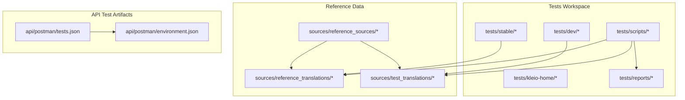
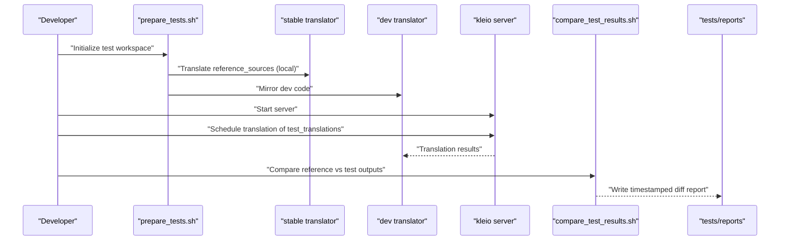
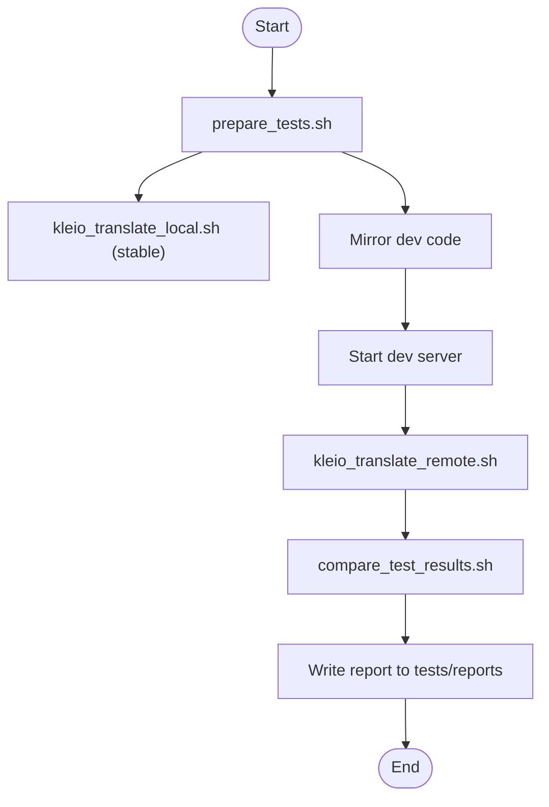
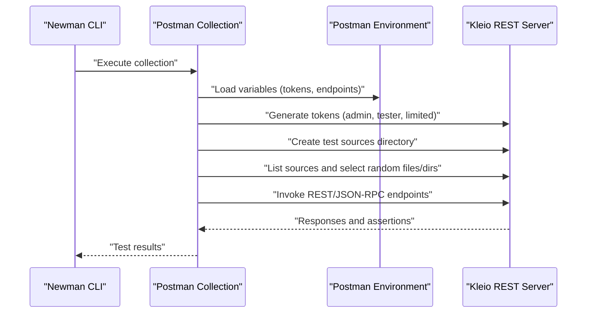
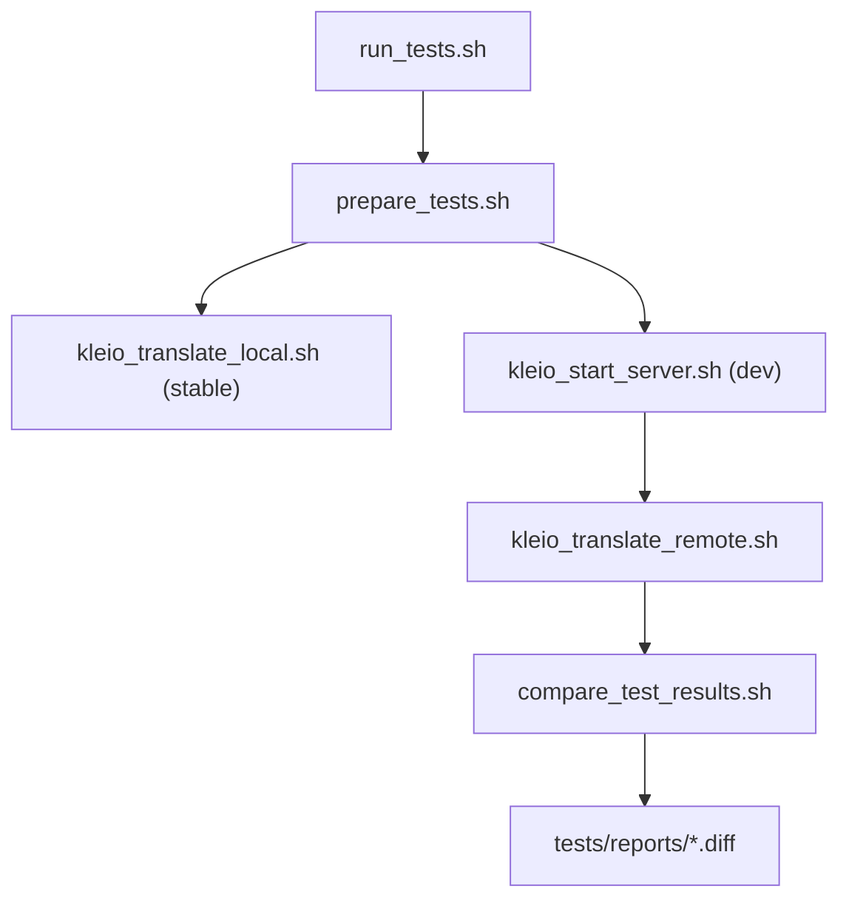
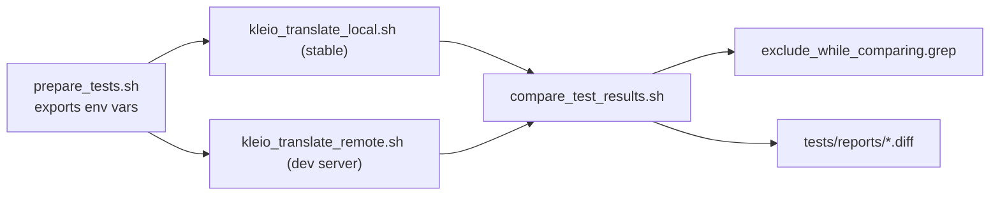

# Testing Framework

<cite>
**Referenced Files in This Document**
- [tests/README.md](file://tests/README.md)
- [tests/scripts/run_tests.sh](file://tests/scripts/run_tests.sh)
- [tests/scripts/run_tests_local.sh](file://tests/scripts/run_tests_local.sh)
- [tests/scripts/prepare_tests.sh](file://tests/scripts/prepare_tests.sh)
- [tests/scripts/compare_test_results.sh](file://tests/scripts/compare_test_results.sh)
- [tests/scripts/kleio_translate_local.sh](file://tests/scripts/kleio_translate_local.sh)
- [tests/scripts/kleio_translate_remote.sh](file://tests/scripts/kleio_translate_remote.sh)
- [tests/scripts/exclude_while_comparing.grep](file://tests/scripts/exclude_while_comparing.grep)
- [api/postman/tests.json](file://api/postman/tests.json)
- [api/postman/environment.json](file://api/postman/environment.json)
- [tests/stable](file://tests/stable)
- [tests/dev](file://tests/dev)
- [tests/reports](file://tests/reports)
</cite>

## Table of Contents
1. [Introduction](#introduction)
2. [Project Structure](#project-structure)
3. [Core Components](#core-components)
4. [Architecture Overview](#architecture-overview)
5. [Detailed Component Analysis](#detailed-component-analysis)
6. [Dependency Analysis](#dependency-analysis)
7. [Performance Considerations](#performance-considerations)
8. [Troubleshooting Guide](#troubleshooting-guide)
9. [Conclusion](#conclusion)
10. [Appendices](#appendices)

## Introduction
This document describes the Timelink Kleio testing framework, focusing on automated validation of the translator and REST API. It explains the dual testing approach:
- Semantic tests: compare translation outputs between a stable baseline and the development version to detect behavioral regressions.
- API tests: validate REST and JSON-RPC endpoints using Postman/Newman collections to ensure service functionality.

It documents the test data hierarchy (stable, development, reference), the testing script infrastructure (execution, comparison, reporting), and provides practical guidance for authoring and maintaining tests, debugging failures, and integrating with continuous testing workflows.

## Project Structure
The testing system is organized around a dedicated tests workspace with three primary datasets and supporting scripts:
- Stable dataset: a snapshot of the translator code used as the reference baseline.
- Development dataset: the current working translator code under test.
- Reference dataset: a curated set of source files used to drive translations and comparisons.

Key directories and files:
- tests/stable: stable translator code and assets used as the reference.
- tests/dev: development translator code mirrored for local or server-side testing.
- tests/kleio-home/sources/reference_sources: canonical source files for translation.
- tests/kleio-home/sources/reference_translations: outputs from the stable translator run.
- tests/kleio-home/sources/test_translations: outputs from the development translator run.
- tests/scripts: orchestration and comparison utilities.
- api/postman: Postman collection and environment for API tests.

**Diagram sources**
- [tests/README.md](file://tests/README.md#L38-L75)
- [tests/scripts/prepare_tests.sh](file://tests/scripts/prepare_tests.sh#L9-L51)
- [tests/scripts/run_tests.sh](file://tests/scripts/run_tests.sh#L1-L39)
- [api/postman/tests.json](file://api/postman/tests.json#L1-L20)

**Section sources**
- [tests/README.md](file://tests/README.md#L38-L75)
- [tests/scripts/prepare_tests.sh](file://tests/scripts/prepare_tests.sh#L9-L51)

## Core Components
- Semantic testing pipeline
  - Preparation: mirrors reference sources into both reference_translations and test_translations and copies current translator code into dev.
  - Execution: runs stable translator on reference_translations and development translator on test_translations.
  - Comparison: diffs outputs and filters expected noise via a pattern list.
  - Reporting: writes a timestamped report to tests/reports.

- API testing pipeline
  - Uses Postman collection to exercise REST endpoints and JSON-RPC methods.
  - Generates tokens dynamically and manages test directories and files.
  - Executes via Newman CLI with a Postman environment.

- Test data hierarchy
  - Stable: baseline translator code and structure files.
  - Development: current translator code under test.
  - Reference: canonical sources and expected outputs.

**Section sources**
- [tests/README.md](file://tests/README.md#L4-L12)
- [tests/scripts/run_tests.sh](file://tests/scripts/run_tests.sh#L1-L39)
- [tests/scripts/compare_test_results.sh](file://tests/scripts/compare_test_results.sh#L1-L9)
- [tests/scripts/exclude_while_comparing.grep](file://tests/scripts/exclude_while_comparing.grep#L1-L51)
- [api/postman/tests.json](file://api/postman/tests.json#L1-L20)

## Architecture Overview
The testing architecture comprises two complementary pipelines: semantic and API.

**Diagram sources**
- [tests/scripts/run_tests.sh](file://tests/scripts/run_tests.sh#L24-L36)
- [tests/scripts/kleio_translate_local.sh](file://tests/scripts/kleio_translate_local.sh#L1-L23)
- [tests/scripts/kleio_translate_remote.sh](file://tests/scripts/kleio_translate_remote.sh#L1-L15)
- [tests/scripts/compare_test_results.sh](file://tests/scripts/compare_test_results.sh#L1-L9)
- [tests/reports](file://tests/reports)

## Detailed Component Analysis

### Semantic Testing Pipeline
Semantic tests ensure behavioral parity between the stable and development translator versions by comparing their outputs on the same reference sources. The pipeline:
- Prepares the workspace by cleaning and mirroring reference sources into both reference_translations and test_translations, and copying current translator code into dev.
- Runs the stable translator locally against reference_translations.
- Starts the development server and schedules translation of test_translations remotely.
- Compares outputs with a diff, filtering expected differences (paths, timestamps, auto-generated identifiers).

**Diagram sources**
- [tests/scripts/prepare_tests.sh](file://tests/scripts/prepare_tests.sh#L30-L39)
- [tests/scripts/kleio_translate_local.sh](file://tests/scripts/kleio_translate_local.sh#L1-L23)
- [tests/scripts/kleio_translate_remote.sh](file://tests/scripts/kleio_translate_remote.sh#L1-L15)
- [tests/scripts/compare_test_results.sh](file://tests/scripts/compare_test_results.sh#L1-L9)
- [tests/reports](file://tests/reports)

**Section sources**
- [tests/README.md](file://tests/README.md#L101-L127)
- [tests/scripts/run_tests.sh](file://tests/scripts/run_tests.sh#L24-L36)
- [tests/scripts/prepare_tests.sh](file://tests/scripts/prepare_tests.sh#L30-L39)
- [tests/scripts/kleio_translate_local.sh](file://tests/scripts/kleio_translate_local.sh#L1-L23)
- [tests/scripts/kleio_translate_remote.sh](file://tests/scripts/kleio_translate_remote.sh#L1-L15)
- [tests/scripts/compare_test_results.sh](file://tests/scripts/compare_test_results.sh#L1-L9)

### API Testing Pipeline
API tests validate REST and JSON-RPC endpoints using a Postman collection executed by Newman. The workflow:
- Generates tokens for admin, tester, and limited users.
- Creates and populates a test sources directory from reference_sources.
- Exercises endpoints for listing, uploading, translating, deleting, and managing directories.
- Stores environment variables for dynamic selection of files and directories.

**Diagram sources**
- [api/postman/tests.json](file://api/postman/tests.json#L1-L20)
- [api/postman/tests.json](file://api/postman/tests.json#L16-L39)
- [api/postman/tests.json](file://api/postman/tests.json#L204-L251)
- [api/postman/tests.json](file://api/postman/tests.json#L306-L364)
- [api/postman/tests.json](file://api/postman/tests.json#L370-L732)
- [api/postman/environment.json](file://api/postman/environment.json#L1-L109)

**Section sources**
- [tests/README.md](file://tests/README.md#L139-L178)
- [api/postman/tests.json](file://api/postman/tests.json#L1-L20)
- [api/postman/environment.json](file://api/postman/environment.json#L1-L109)

### Test Data Hierarchy and Management
- Stable dataset: snapshot of translator code and structure files used as the reference baseline.
- Development dataset: current working translator code mirrored for testing.
- Reference dataset: curated sources under reference_sources used to populate both reference_translations and test_translations.
- Reports: timestamped diff outputs stored under tests/reports.

Guidelines for adding test data:
- Add new reference sources under tests/kleio-home/sources/reference_sources and subdirectories.
- For semantic tests, ensure both reference_translations and test_translations are populated by the preparation script.
- For API tests, place sources under tests/kleio-home/sources/api or the appropriate test directory managed by the Postman collection.

**Section sources**
- [tests/README.md](file://tests/README.md#L46-L52)
- [tests/scripts/prepare_tests.sh](file://tests/scripts/prepare_tests.sh#L34-L39)
- [tests/reports](file://tests/reports)

### Script Infrastructure
- run_tests.sh orchestrates the semantic test run, including preparation, stable translation, dev server translation, and comparison.
- run_tests_local.sh supports local-only runs using local translator invocations.
- prepare_tests.sh exports environment variables, cleans and mirrors directories, and copies structure files.
- kleio_translate_local.sh iterates over .cli/.kleio files and invokes SWI-Prolog to translate each file.
- kleio_translate_remote.sh schedules translation via REST on a running server.
- compare_test_results.sh performs a directory diff and filters expected differences using exclude_while_comparing.grep.

**Diagram sources**
- [tests/scripts/run_tests.sh](file://tests/scripts/run_tests.sh#L1-L39)
- [tests/scripts/prepare_tests.sh](file://tests/scripts/prepare_tests.sh#L1-L51)
- [tests/scripts/kleio_translate_local.sh](file://tests/scripts/kleio_translate_local.sh#L1-L23)
- [tests/scripts/kleio_translate_remote.sh](file://tests/scripts/kleio_translate_remote.sh#L1-L15)
- [tests/scripts/compare_test_results.sh](file://tests/scripts/compare_test_results.sh#L1-L9)
- [tests/reports](file://tests/reports)

**Section sources**
- [tests/scripts/run_tests.sh](file://tests/scripts/run_tests.sh#L1-L39)
- [tests/scripts/run_tests_local.sh](file://tests/scripts/run_tests_local.sh#L1-L13)
- [tests/scripts/prepare_tests.sh](file://tests/scripts/prepare_tests.sh#L1-L51)
- [tests/scripts/kleio_translate_local.sh](file://tests/scripts/kleio_translate_local.sh#L1-L23)
- [tests/scripts/kleio_translate_remote.sh](file://tests/scripts/kleio_translate_remote.sh#L1-L15)
- [tests/scripts/compare_test_results.sh](file://tests/scripts/compare_test_results.sh#L1-L9)
- [tests/scripts/exclude_while_comparing.grep](file://tests/scripts/exclude_while_comparing.grep#L1-L51)

## Dependency Analysis
The semantic testing pipeline depends on:
- Environment variables exported by prepare_tests.sh.
- Stable and dev translator binaries invoked by kleio_translate_local.sh and kleio_start_server.sh.
- REST endpoint invocation by kleio_translate_remote.sh.
- Pattern-based filtering by compare_test_results.sh using exclude_while_comparing.grep.

**Diagram sources**
- [tests/scripts/prepare_tests.sh](file://tests/scripts/prepare_tests.sh#L9-L29)
- [tests/scripts/kleio_translate_local.sh](file://tests/scripts/kleio_translate_local.sh#L1-L23)
- [tests/scripts/kleio_translate_remote.sh](file://tests/scripts/kleio_translate_remote.sh#L1-L15)
- [tests/scripts/compare_test_results.sh](file://tests/scripts/compare_test_results.sh#L1-L9)
- [tests/scripts/exclude_while_comparing.grep](file://tests/scripts/exclude_while_comparing.grep#L1-L51)
- [tests/reports](file://tests/reports)

**Section sources**
- [tests/scripts/prepare_tests.sh](file://tests/scripts/prepare_tests.sh#L9-L29)
- [tests/scripts/compare_test_results.sh](file://tests/scripts/compare_test_results.sh#L1-L9)
- [tests/scripts/exclude_while_comparing.grep](file://tests/scripts/exclude_while_comparing.grep#L1-L51)

## Performance Considerations
- Parallelization: The semantic pipeline translates files sequentially via local invocation. For large datasets, consider batching or parallelizing file-level translations while preserving deterministic output ordering for comparison.
- Filtering overhead: The diff filtering reduces false positives but adds processing time. Keep exclude patterns concise and targeted.
- Server mode: Using the REST server for translation introduces network latency; ensure the server is tuned for worker concurrency and idle timeouts appropriate to the test environment.
- Reporting: Timestamped reports help track performance trends over time; archive reports selectively to manage storage.

[No sources needed since this section provides general guidance]

## Troubleshooting Guide
Common issues and resolutions:
- Paths differ between reference and test outputs
  - Symptom: diffs show different absolute paths.
  - Resolution: Confirm exclude patterns in exclude_while_comparing.grep include path-specific entries.
- Auto-generated identifiers vary across runs
  - Symptom: IDs differ between runs.
  - Resolution: Ensure exclude patterns match ID formats; confirm translation counts and structure files are consistent.
- Timestamps and metadata differences
  - Symptom: Reports and logs contain differing timestamps.
  - Resolution: Add patterns to exclude timestamp lines and metadata headers.
- Server not reachable
  - Symptom: Remote translation fails with connection errors.
  - Resolution: Verify server startup and port configuration; ensure KLEIO_ADMIN_TOKEN is set and valid.
- Missing or outdated structure files
  - Symptom: Translation errors due to missing structure definitions.
  - Resolution: Copy structure files to both KLEIO_DEFAULT_STRU and KLEIO_STRU_DIR_ALT during preparation.
- Postman environment variables
  - Symptom: API tests fail due to unset tokens or endpoints.
  - Resolution: Load api/postman/environment.json and ensure endpoint and tokens are configured.

Interpreting test results:
- Full compatibility: No diffs remain after filtering.
- Partial compatibility: Differences remain; review filtered lines to determine if they represent expected changes or regressions.
- Failures: Non-zero exit status or assertion failures indicate functional issues requiring investigation.

Reproducing issues:
- Semantic tests: rerun the semantic pipeline and inspect the timestamped report in tests/reports.
- API tests: rerun the Postman collection with Newman and review assertion logs.

**Section sources**
- [tests/README.md](file://tests/README.md#L108-L127)
- [tests/scripts/exclude_while_comparing.grep](file://tests/scripts/exclude_while_comparing.grep#L1-L51)
- [tests/scripts/run_tests.sh](file://tests/scripts/run_tests.sh#L36-L39)
- [api/postman/tests.json](file://api/postman/tests.json#L1-L20)
- [api/postman/environment.json](file://api/postman/environment.json#L1-L109)

## Conclusion
The Timelink Kleio testing framework combines robust semantic validation with comprehensive API coverage. By maintaining stable, development, and reference datasets, and leveraging a clear script infrastructure with targeted diff filtering, the system ensures reliable regression detection and service validation. Adopting the provided guidelines for test authoring, data management, and troubleshooting will sustain a healthy and effective testing practice.

[No sources needed since this section summarizes without analyzing specific files]

## Appendices

### Guidelines for Writing New Tests
- Semantic tests
  - Add representative sources under tests/kleio-home/sources/reference_sources.
  - Use the preparation script to mirror sources into reference_translations and test_translations.
  - Run the semantic pipeline and review the generated report.
  - If expected output changes are intentional, update the stable baseline or refine exclude patterns.
- API tests
  - Extend the Postman collection with new requests and assertions.
  - Manage environment variables for tokens and endpoints.
  - Execute via Newman and review assertion outcomes.

Maintaining test suites
- Keep exclude patterns focused and documented.
- Periodically refresh reference sources to reflect evolving formats.
- Archive reports and monitor trends over time.

Continuous integration
- Integrate make test-semantics and make test-api targets into CI jobs.
- Configure environment variables for server ports, tokens, and paths.
- Publish reports and artifacts for historical tracking.

**Section sources**
- [tests/README.md](file://tests/README.md#L76-L100)
- [tests/README.md](file://tests/README.md#L101-L127)
- [tests/README.md](file://tests/README.md#L139-L178)
- [tests/scripts/prepare_tests.sh](file://tests/scripts/prepare_tests.sh#L34-L39)
- [tests/scripts/exclude_while_comparing.grep](file://tests/scripts/exclude_while_comparing.grep#L1-L51)