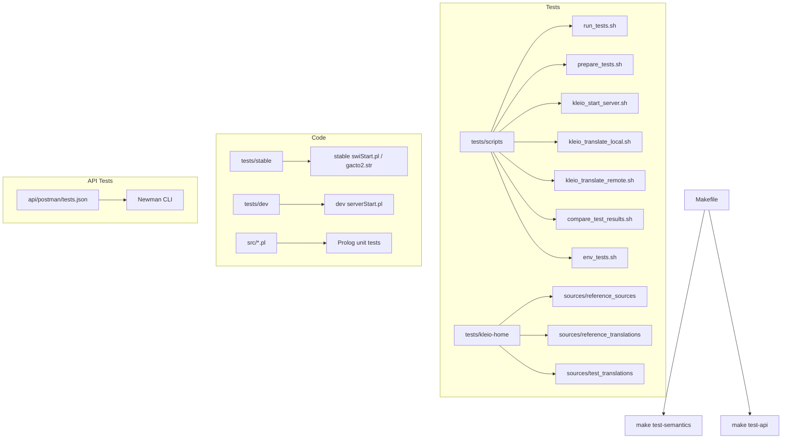
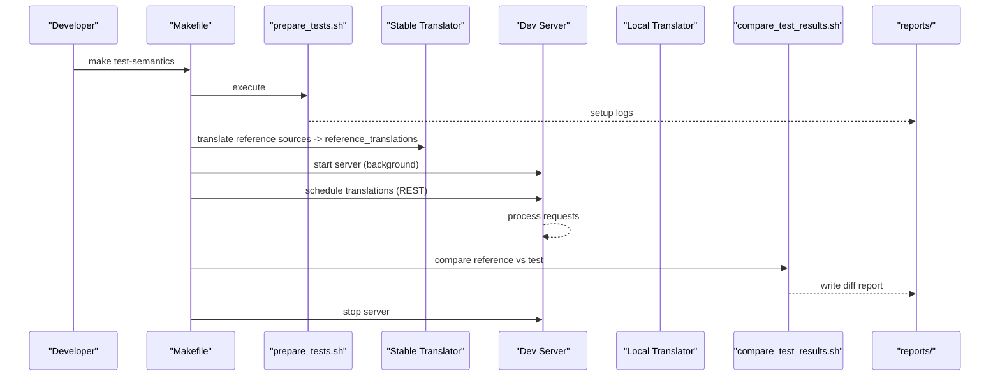
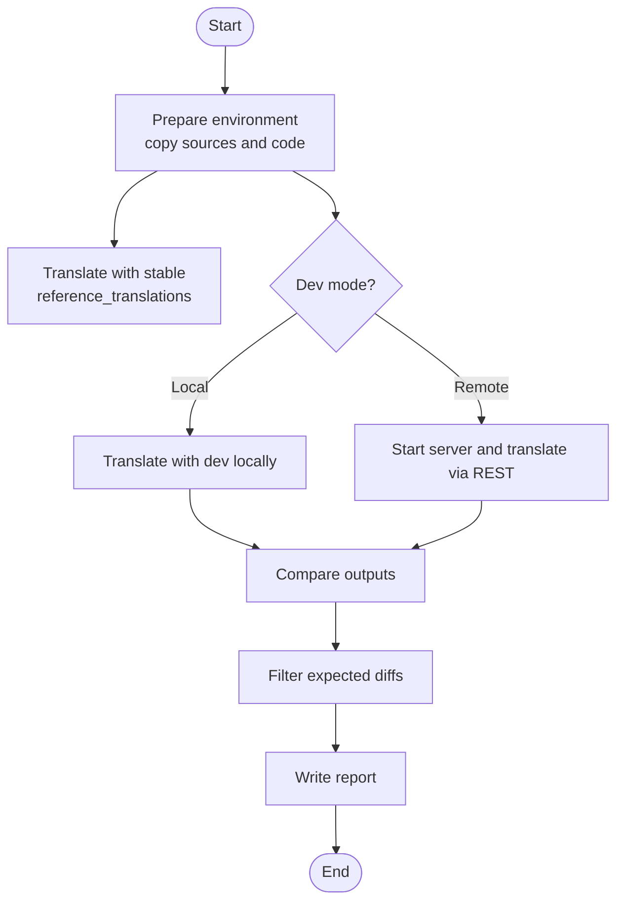
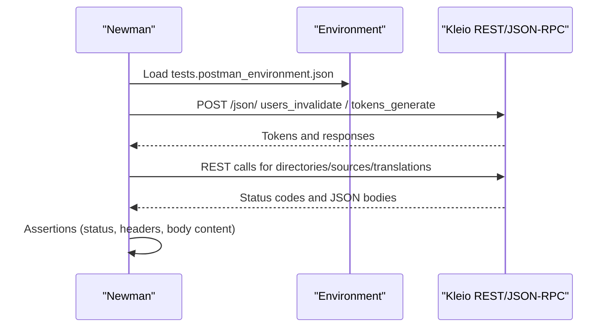
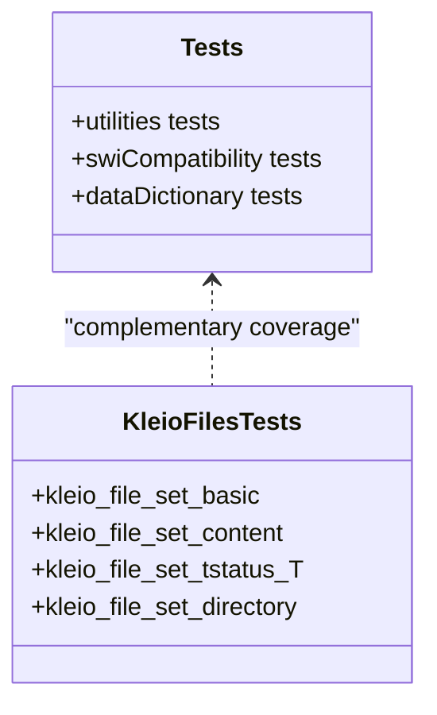
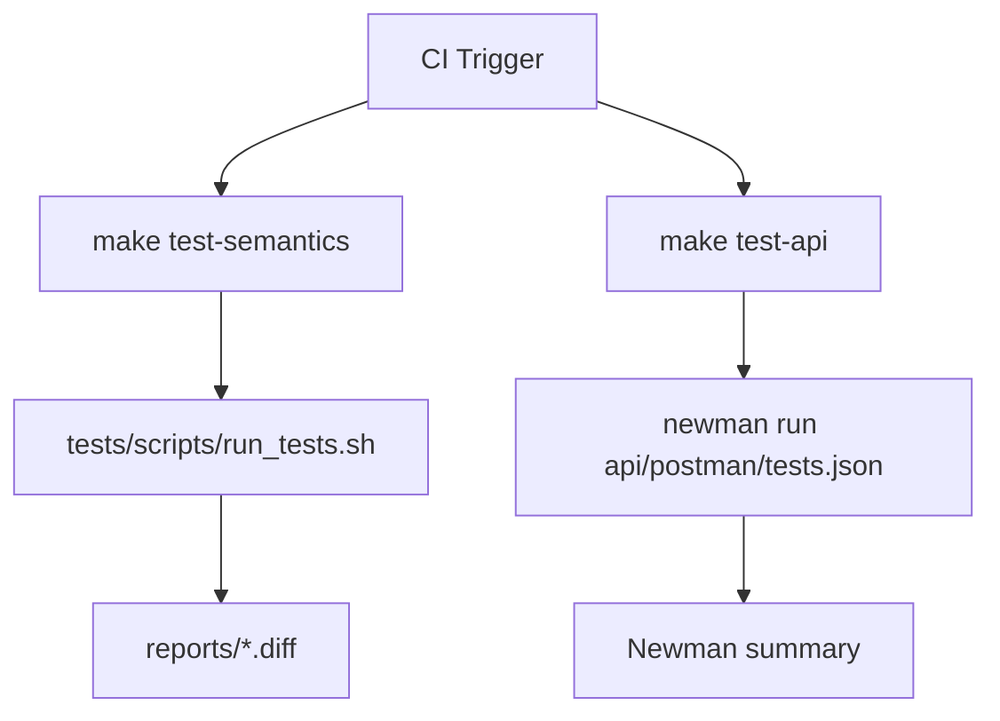
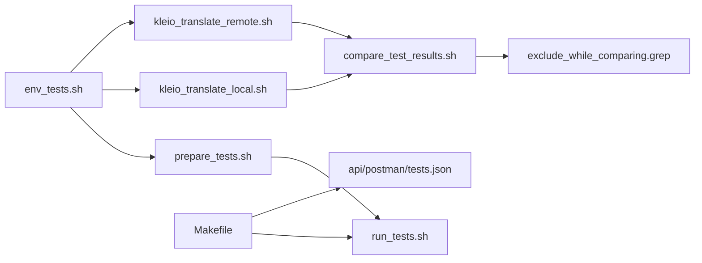

# Testing and Quality Assurance

<cite>
**Referenced Files in This Document**
- [tests/README.md](file://tests/README.md)
- [Makefile](file://Makefile)
- [tests/scripts/run_tests.sh](file://tests/scripts/run_tests.sh)
- [tests/scripts/prepare_tests.sh](file://tests/scripts/prepare_tests.sh)
- [tests/scripts/env_tests.sh](file://tests/scripts/env_tests.sh)
- [tests/scripts/kleio_start_server.sh](file://tests/scripts/kleio_start_server.sh)
- [tests/scripts/kleio_translate_local.sh](file://tests/scripts/kleio_translate_local.sh)
- [tests/scripts/kleio_translate_remote.sh](file://tests/scripts/kleio_translate_remote.sh)
- [tests/scripts/compare_test_results.sh](file://tests/scripts/compare_test_results.sh)
- [tests/scripts/exclude_while_comparing.grep](file://tests/scripts/exclude_while_comparing.grep)
- [api/postman/tests.json](file://api/postman/tests.json)
- [src/tests.pl](file://src/tests.pl)
- [src/test_kleiofiles.pl](file://src/test_kleiofiles.pl)
- [tests/docker-compose.yaml](file://tests/docker-compose.yaml)
</cite>

## Table of Contents
1. [Introduction](#introduction)
2. [Project Structure](#project-structure)
3. [Core Components](#core-components)
4. [Architecture Overview](#architecture-overview)
5. [Detailed Component Analysis](#detailed-component-analysis)
6. [Dependency Analysis](#dependency-analysis)
7. [Performance Considerations](#performance-considerations)
8. [Troubleshooting Guide](#troubleshooting-guide)
9. [Conclusion](#conclusion)
10. [Appendices](#appendices)

## Introduction
This document describes the testing and quality assurance strategy for the Kleio translation system. It covers:
- Semantic tests that compare translation outputs against a stable reference using diff with filtering
- API tests that validate REST and JSON-RPC endpoints via Postman/Newman
- Test execution procedures, test data management, and continuous integration hooks
- Guidance on writing new tests, debugging failures, and maintaining suites
- Strategies for performance, load, and regression testing

The goal is to ensure semantic stability across architectural changes while validating API behavior and enabling rapid iteration through isolated, composable scripts.

## Project Structure
The testing framework is organized under tests/, with supporting automation in Makefile and API definitions in api/postman/. The key directories and files are:
- tests/scripts: Shell-based orchestration for semantic tests (prepare, translate local/remote, start/stop server, compare)
- tests/kleio-home: A minimal Kleio installation used by tests, including sources and configuration
- tests/stable and tests/dev: Copies of the translator code used as baseline and development versions
- api/postman: Postman collection and environment for API tests
- src/*.pl: Prolog unit tests and helpers invoked during development or server-side workflows

**Diagram sources**
- [tests/scripts/run_tests.sh:1-39](file://tests/scripts/run_tests.sh#L1-L39)
- [tests/scripts/prepare_tests.sh:1-33](file://tests/scripts/prepare_tests.sh#L1-L33)
- [tests/scripts/env_tests.sh:1-27](file://tests/scripts/env_tests.sh#L1-L27)
- [tests/scripts/kleio_start_server.sh:1-22](file://tests/scripts/kleio_start_server.sh#L1-L22)
- [tests/scripts/kleio_translate_local.sh:1-24](file://tests/scripts/kleio_translate_local.sh#L1-L24)
- [tests/scripts/kleio_translate_remote.sh:1-16](file://tests/scripts/kleio_translate_remote.sh#L1-L16)
- [tests/scripts/compare_test_results.sh:1-9](file://tests/scripts/compare_test_results.sh#L1-L9)
- [api/postman/tests.json:1-800](file://api/postman/tests.json#L1-L800)
- [Makefile:256-271](file://Makefile#L256-L271)

**Section sources**
- [tests/README.md:1-330](file://tests/README.md#L1-L330)
- [Makefile:256-271](file://Makefile#L256-L271)

## Core Components
- Semantic test pipeline:
  - Prepare: cleans and copies current source into dev, and reference sources into both reference and test output directories
  - Translate reference with stable translator (baseline)
  - Translate with dev translator (local or remote via REST)
  - Compare outputs using diff with exclusion patterns
- API test suite:
  - Postman collection executed by Newman
  - Validates authentication, token scoping, directory/file operations, and translations
- Prolog unit tests:
  - Small focused tests for utilities, compatibility, dictionary, and file handling

Key responsibilities:
- Orchestration and environment setup: env_tests.sh, prepare_tests.sh, run_tests.sh
- Server lifecycle: kleio_start_server.sh, kleio_stop_server.sh
- Translation execution: kleio_translate_local.sh, kleio_translate_remote.sh
- Comparison and filtering: compare_test_results.sh, exclude_while_comparing.grep
- API validation: api/postman/tests.json
- Unit tests: src/tests.pl, src/test_kleiofiles.pl

**Section sources**
- [tests/README.md:1-330](file://tests/README.md#L1-L330)
- [tests/scripts/env_tests.sh:1-27](file://tests/scripts/env_tests.sh#L1-L27)
- [tests/scripts/prepare_tests.sh:1-33](file://tests/scripts/prepare_tests.sh#L1-L33)
- [tests/scripts/run_tests.sh:1-39](file://tests/scripts/run_tests.sh#L1-L39)
- [tests/scripts/kleio_start_server.sh:1-22](file://tests/scripts/kleio_start_server.sh#L1-L22)
- [tests/scripts/kleio_translate_local.sh:1-24](file://tests/scripts/kleio_translate_local.sh#L1-L24)
- [tests/scripts/kleio_translate_remote.sh:1-16](file://tests/scripts/kleio_translate_remote.sh#L1-L16)
- [tests/scripts/compare_test_results.sh:1-9](file://tests/scripts/compare_test_results.sh#L1-L9)
- [tests/scripts/exclude_while_comparing.grep:1-62](file://tests/scripts/exclude_while_comparing.grep#L1-L62)
- [api/postman/tests.json:1-800](file://api/postman/tests.json#L1-L800)
- [src/tests.pl:1-103](file://src/tests.pl#L1-L103)
- [src/test_kleiofiles.pl:1-49](file://src/test_kleiofiles.pl#L1-L49)

## Architecture Overview
The semantic test workflow compares outputs from two translators:
- Stable translator produces baseline outputs in reference_translations
- Dev translator (local or via REST) produces outputs in test_translations
- compare_test_results.sh diffs these directories after filtering expected differences

**Diagram sources**
- [Makefile:256-271](file://Makefile#L256-L271)
- [tests/scripts/run_tests.sh:1-39](file://tests/scripts/run_tests.sh#L1-L39)
- [tests/scripts/prepare_tests.sh:1-33](file://tests/scripts/prepare_tests.sh#L1-L33)
- [tests/scripts/kleio_start_server.sh:1-22](file://tests/scripts/kleio_start_server.sh#L1-L22)
- [tests/scripts/kleio_translate_remote.sh:1-16](file://tests/scripts/kleio_translate_remote.sh#L1-L16)
- [tests/scripts/compare_test_results.sh:1-9](file://tests/scripts/compare_test_results.sh#L1-L9)

## Detailed Component Analysis

### Semantic Test Pipeline
- Preparation:
  - Cleans test directories and copies current source into dev
  - Copies reference sources into both reference and test output directories
- Translation:
  - Stable translator runs locally over reference sources to produce baseline outputs
  - Dev translator runs either locally or via REST server
- Comparison:
  - Uses diff with grep filters to ignore timestamps, IDs, paths, and other expected differences

**Diagram sources**
- [tests/scripts/prepare_tests.sh:1-33](file://tests/scripts/prepare_tests.sh#L1-L33)
- [tests/scripts/kleio_translate_local.sh:1-24](file://tests/scripts/kleio_translate_local.sh#L1-L24)
- [tests/scripts/kleio_start_server.sh:1-22](file://tests/scripts/kleio_start_server.sh#L1-L22)
- [tests/scripts/kleio_translate_remote.sh:1-16](file://tests/scripts/kleio_translate_remote.sh#L1-L16)
- [tests/scripts/compare_test_results.sh:1-9](file://tests/scripts/compare_test_results.sh#L1-L9)
- [tests/scripts/exclude_while_comparing.grep:1-62](file://tests/scripts/exclude_while_comparing.grep#L1-L62)

**Section sources**
- [tests/README.md:1-330](file://tests/README.md#L1-L330)
- [tests/scripts/run_tests.sh:1-39](file://tests/scripts/run_tests.sh#L1-L39)
- [tests/scripts/prepare_tests.sh:1-33](file://tests/scripts/prepare_tests.sh#L1-L33)
- [tests/scripts/kleio_translate_local.sh:1-24](file://tests/scripts/kleio_translate_local.sh#L1-L24)
- [tests/scripts/kleio_translate_remote.sh:1-16](file://tests/scripts/kleio_translate_remote.sh#L1-L16)
- [tests/scripts/compare_test_results.sh:1-9](file://tests/scripts/compare_test_results.sh#L1-L9)
- [tests/scripts/exclude_while_comparing.grep:1-62](file://tests/scripts/exclude_while_comparing.grep#L1-L62)

### API Test Suite (Postman/Newman)
- Collection-driven tests validate:
  - Authentication and token scoping (admin, coordinator, limited user)
  - Directory and file operations (create, copy, delete)
  - Source listing and status queries
  - Translation scheduling and results retrieval
- Environment variables include endpoint, tokens, and Kleio home path
- Execution via Newman with environment file and admin token injection

**Diagram sources**
- [api/postman/tests.json:1-800](file://api/postman/tests.json#L1-L800)

**Section sources**
- [tests/README.md:268-330](file://tests/README.md#L268-L330)
- [api/postman/tests.json:1-800](file://api/postman/tests.json#L1-L800)

### Prolog Unit Tests
- Lightweight tests for core modules:
  - Utilities and compatibility functions
  - Data dictionary creation and group handling
  - File set construction and attributes for .cli files
- Executed within SWI-Prolog; useful for fast feedback during development

**Diagram sources**
- [src/tests.pl:1-103](file://src/tests.pl#L1-L103)
- [src/test_kleiofiles.pl:1-49](file://src/test_kleiofiles.pl#L1-L49)

**Section sources**
- [src/tests.pl:1-103](file://src/tests.pl#L1-L103)
- [src/test_kleiofiles.pl:1-49](file://src/test_kleiofiles.pl#L1-L49)

### Continuous Integration Hooks
- Makefile targets:
  - test-semantics: runs full semantic pipeline
  - redo-test-semantics: re-runs dev-only steps
  - test-api: starts server image and runs Newman with environment
- Docker Compose for running server in isolation during tests

**Diagram sources**
- [Makefile:256-271](file://Makefile#L256-L271)
- [tests/docker-compose.yaml:1-20](file://tests/docker-compose.yaml#L1-L20)

**Section sources**
- [Makefile:256-271](file://Makefile#L256-L271)
- [tests/docker-compose.yaml:1-20](file://tests/docker-compose.yaml#L1-L20)

## Dependency Analysis
- Semantic tests depend on:
  - Environment variables defined in env_tests.sh
  - Scripts for preparation, translation, server lifecycle, and comparison
  - Exclusion patterns to filter expected differences
- API tests depend on:
  - Postman collection and environment
  - Running server instance (via docker compose or local)
- Makefile orchestrates both pipelines and integrates with Docker

**Diagram sources**
- [tests/scripts/env_tests.sh:1-27](file://tests/scripts/env_tests.sh#L1-L27)
- [tests/scripts/prepare_tests.sh:1-33](file://tests/scripts/prepare_tests.sh#L1-L33)
- [tests/scripts/kleio_translate_local.sh:1-24](file://tests/scripts/kleio_translate_local.sh#L1-L24)
- [tests/scripts/kleio_translate_remote.sh:1-16](file://tests/scripts/kleio_translate_remote.sh#L1-L16)
- [tests/scripts/compare_test_results.sh:1-9](file://tests/scripts/compare_test_results.sh#L1-L9)
- [tests/scripts/exclude_while_comparing.grep:1-62](file://tests/scripts/exclude_while_comparing.grep#L1-L62)
- [Makefile:256-271](file://Makefile#L256-L271)
- [api/postman/tests.json:1-800](file://api/postman/tests.json#L1-L800)

**Section sources**
- [tests/scripts/env_tests.sh:1-27](file://tests/scripts/env_tests.sh#L1-L27)
- [tests/scripts/prepare_tests.sh:1-33](file://tests/scripts/prepare_tests.sh#L1-L33)
- [tests/scripts/run_tests.sh:1-39](file://tests/scripts/run_tests.sh#L1-L39)
- [tests/scripts/compare_test_results.sh:1-9](file://tests/scripts/compare_test_results.sh#L1-L9)
- [tests/scripts/exclude_while_comparing.grep:1-62](file://tests/scripts/exclude_while_comparing.grep#L1-L62)
- [Makefile:256-271](file://Makefile#L256-L271)
- [api/postman/tests.json:1-800](file://api/postman/tests.json#L1-L800)

## Performance Considerations
- Parallelization:
  - Use multiple workers when starting the server to handle concurrent translation requests
  - Consider batching translation requests to reduce overhead
- Resource usage:
  - Monitor memory and CPU during large-scale semantic comparisons
  - Limit recursion depth if translating very deep hierarchies
- Caching:
  - Reuse prepared environments to avoid repeated copying of large datasets
  - Keep reference_translations stable to minimize diff work
- Load testing strategies:
  - Generate synthetic source sets to simulate production scale
  - Measure throughput and latency for REST translation endpoints
  - Validate error handling under high concurrency

[No sources needed since this section provides general guidance]

## Troubleshooting Guide
Common issues and resolutions:
- Port conflicts:
  - Ensure KLEIO_SERVER_PORT is free; adjust in env_tests.sh or environment
- Token errors:
  - Verify KLEIO_ADMIN_TOKEN matches server configuration; regenerate if necessary
- Missing dependencies:
  - Install SWI-Prolog for local translation tests
  - Install Newman for API tests
- Large diffs:
  - Review exclude_while_comparing.grep patterns; add new patterns for expected differences
- Server not responding:
  - Check kleio_start_server.log for startup errors
  - Restart server and retry translation requests

Operational tips:
- Isolate steps:
  - Run prepare, translate, and compare independently to pinpoint failures
- Use reports:
  - Inspect generated diff reports in reports/ for detailed discrepancies
- Debugging server:
  - Enable debug flags and use Prolog debugger for server-side tracing

**Section sources**
- [tests/README.md:1-330](file://tests/README.md#L1-L330)
- [tests/scripts/env_tests.sh:1-27](file://tests/scripts/env_tests.sh#L1-L27)
- [tests/scripts/kleio_start_server.sh:1-22](file://tests/scripts/kleio_start_server.sh#L1-L22)
- [tests/scripts/compare_test_results.sh:1-9](file://tests/scripts/compare_test_results.sh#L1-L9)
- [tests/scripts/exclude_while_comparing.grep:1-62](file://tests/scripts/exclude_while_comparing.grep#L1-L62)

## Conclusion
The Kleio testing framework combines semantic regression checks with comprehensive API validation. By leveraging shell-based orchestration, Postman/Newman, and Prolog unit tests, it ensures both output stability and functional correctness. The modular design allows developers to run targeted tests quickly, maintain robust baselines, and integrate seamlessly into CI pipelines.

[No sources needed since this section summarizes without analyzing specific files]

## Appendices

### Writing New Semantic Tests
- Add or update input files in tests/kleio-home/sources/reference_sources
- Update reference outputs by regenerating with stable translator
- If intentional output changes occur, add exclusion patterns to exclude_while_comparing.grep
- Validate by running the full pipeline or individual steps

**Section sources**
- [tests/README.md:1-330](file://tests/README.md#L1-L330)
- [tests/scripts/exclude_while_comparing.grep:1-62](file://tests/scripts/exclude_while_comparing.grep#L1-L62)

### Writing New API Tests
- Extend api/postman/tests.json with new request sequences and assertions
- Use environment variables for dynamic values (tokens, endpoints, paths)
- Run via Newman with appropriate environment file and admin token

**Section sources**
- [api/postman/tests.json:1-800](file://api/postman/tests.json#L1-L800)
- [tests/README.md:268-330](file://tests/README.md#L268-L330)

### Example Test Scenarios
- Semantic scenarios:
  - Baptism records translation consistency
  - Marriage records with complex relationships
  - Linked data references and identifiers
- API scenarios:
  - Create and manage directories under sources
  - Upload and version control files
  - Query sources by translation status
  - Schedule translations and retrieve results

[No sources needed since this section provides conceptual examples]