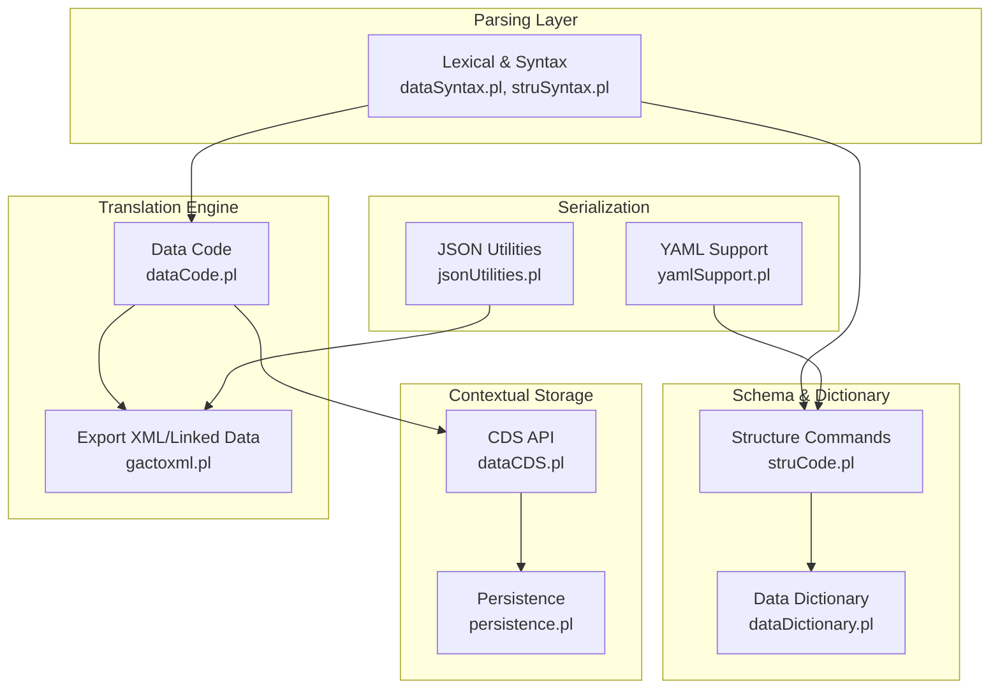
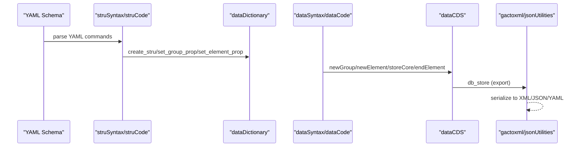
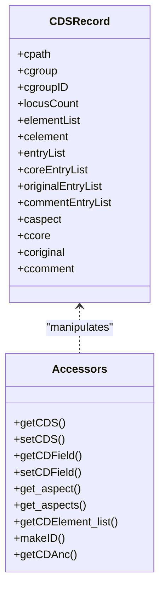
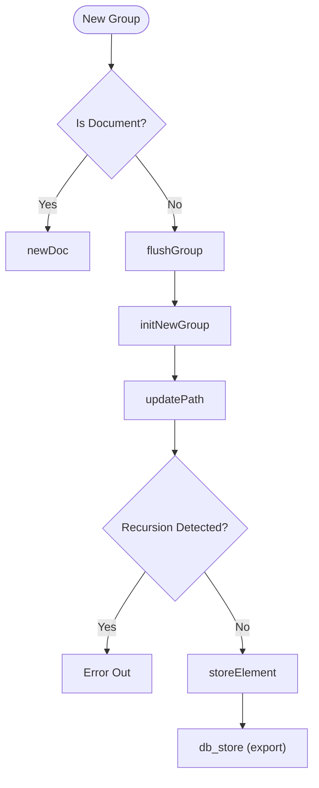
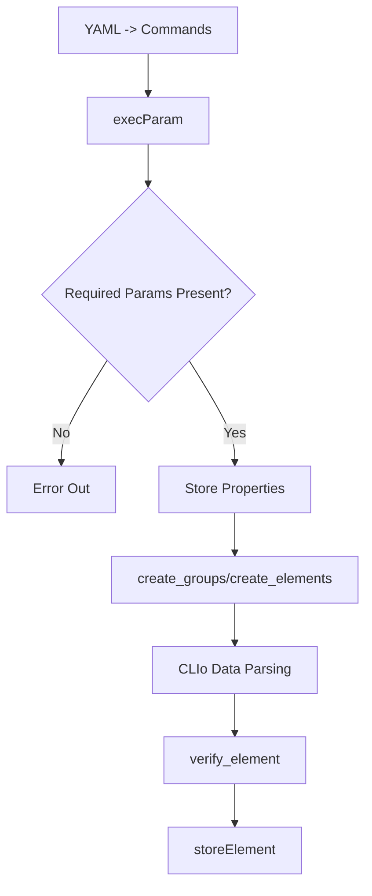
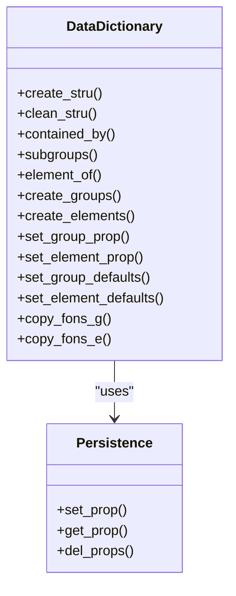
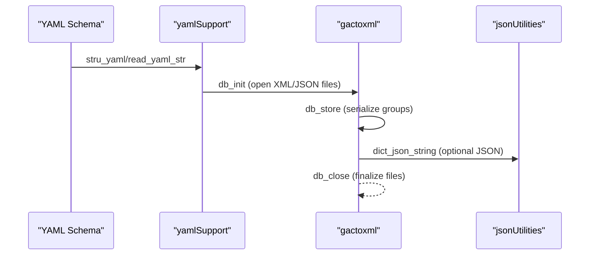
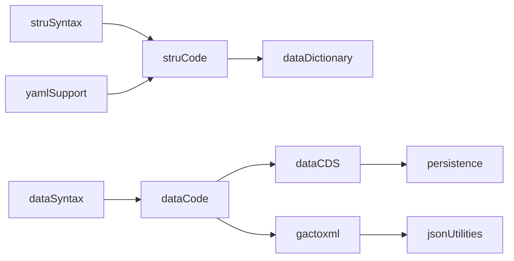

# Data Processing Structures

<cite>
**Referenced Files in This Document**
- [dataCDS.pl](file://src/dataCDS.pl)
- [dataCode.pl](file://src/dataCode.pl)
- [dataDictionary.pl](file://src/dataDictionary.pl)
- [dataSyntax.pl](file://src/dataSyntax.pl)
- [persistence.pl](file://src/persistence.pl)
- [utilities.pl](file://src/utilities.pl)
- [struCode.pl](file://src/struCode.pl)
- [struSyntax.pl](file://src/struSyntax.pl)
- [yamlSupport.pl](file://src/yamlSupport.pl)
- [gactoxml.pl](file://src/gactoxml.pl)
- [jsonUtilities.pl](file://src/jsonUtilities.pl)
- [xref_kleio.pl](file://src/xref_kleio.pl)
</cite>

## Table of Contents
1. [Introduction](#introduction)
2. [Project Structure](#project-structure)
3. [Core Components](#core-components)
4. [Architecture Overview](#architecture-overview)
5. [Detailed Component Analysis](#detailed-component-analysis)
6. [Dependency Analysis](#dependency-analysis)
7. [Performance Considerations](#performance-considerations)
8. [Troubleshooting Guide](#troubleshooting-guide)
9. [Conclusion](#conclusion)
10. [Appendices](#appendices)

## Introduction
This document focuses on the internal data representation and processing frameworks used by the Timelink Kleio translation engine. It explains the Contextual Data Structures (CDS) that organize and manage hierarchical relationships in historical documents, the cross-reference mechanisms that track entity relationships and maintain referential integrity, the data syntax validation systems that ensure structural and semantic correctness, and the data dictionary management systems that standardize terminology across sources. It also covers memory management strategies for large datasets, performance optimization techniques, error handling for malformed data, and serialization/deserialization processes that convert between internal representations and external output formats.

## Project Structure
The data processing pipeline is organized around a layered architecture:
- Lexical and syntax analysis for structure and data files
- Schema definition and dictionary management
- Temporary contextual storage (CDS) during translation
- Export modules for serialization to XML/JSON/YAML
- Persistence utilities for thread-safe property storage

**Diagram sources**
- [dataSyntax.pl](file://src/dataSyntax.pl#L38-L62)
- [struSyntax.pl](file://src/struSyntax.pl#L48-L58)
- [struCode.pl](file://src/struCode.pl#L64-L82)
- [dataDictionary.pl](file://src/dataDictionary.pl#L119-L125)
- [dataCDS.pl](file://src/dataCDS.pl#L153-L214)
- [persistence.pl](file://src/persistence.pl#L42-L49)
- [dataCode.pl](file://src/dataCode.pl#L53-L70)
- [gactoxml.pl](file://src/gactoxml.pl#L129-L166)
- [yamlSupport.pl](file://src/yamlSupport.pl#L28-L43)
- [jsonUtilities.pl](file://src/jsonUtilities.pl#L11-L13)

**Section sources**
- [dataSyntax.pl](file://src/dataSyntax.pl#L38-L62)
- [struSyntax.pl](file://src/struSyntax.pl#L48-L58)
- [struCode.pl](file://src/struCode.pl#L64-L82)
- [dataDictionary.pl](file://src/dataDictionary.pl#L119-L125)
- [dataCDS.pl](file://src/dataCDS.pl#L153-L214)
- [persistence.pl](file://src/persistence.pl#L42-L49)
- [dataCode.pl](file://src/dataCode.pl#L53-L70)
- [gactoxml.pl](file://src/gactoxml.pl#L129-L166)
- [yamlSupport.pl](file://src/yamlSupport.pl#L28-L43)
- [jsonUtilities.pl](file://src/jsonUtilities.pl#L11-L13)

## Core Components
- Contextual Data Structures (CDS): A compact, record-based representation of the current group’s elements, aspects, and entries. It supports efficient updates and retrieval during translation.
- Data Dictionary: Manages schema definitions, group/element metadata, containment relationships, and default properties.
- Syntax Validators: Enforce structure and data syntax rules, ensuring correct CLIo/YAML usage and consistent element/aspect handling.
- Persistence Layer: Thread-local and shared property storage enabling safe concurrent access and global state sharing.
- Export Modules: Convert internal structures to XML, JSON, and YAML, with support for linked data and cross-references.

**Section sources**
- [dataCDS.pl](file://src/dataCDS.pl#L91-L104)
- [dataDictionary.pl](file://src/dataDictionary.pl#L119-L125)
- [dataSyntax.pl](file://src/dataSyntax.pl#L38-L62)
- [persistence.pl](file://src/persistence.pl#L42-L49)
- [gactoxml.pl](file://src/gactoxml.pl#L129-L166)

## Architecture Overview
The translation engine transforms CLIo/YAML schema and data into structured outputs. The flow:
- YAML schema is parsed into internal commands and stored as properties.
- CLIo data is lexed and parsed into calls that manipulate the CDS.
- The CDS is validated against the data dictionary and exported to target formats.

**Diagram sources**
- [yamlSupport.pl](file://src/yamlSupport.pl#L28-L43)
- [struSyntax.pl](file://src/struSyntax.pl#L48-L58)
- [struCode.pl](file://src/struCode.pl#L105-L118)
- [dataDictionary.pl](file://src/dataDictionary.pl#L119-L125)
- [dataSyntax.pl](file://src/dataSyntax.pl#L57-L62)
- [dataCode.pl](file://src/dataCode.pl#L115-L121)
- [dataCDS.pl](file://src/dataCDS.pl#L153-L214)
- [gactoxml.pl](file://src/gactoxml.pl#L341-L367)
- [jsonUtilities.pl](file://src/jsonUtilities.pl#L11-L13)

## Detailed Component Analysis

### Contextual Data Structures (CDS)
CDS organizes the current translation state as a compact record with fields for path, group, element list, and aspect entries. It supports:
- Field-level accessors and setters
- Aspect-aware entry accumulation (core/original/comment)
- Hierarchical path construction and ancestor resolution
- ID generation for groups

Key behaviors:
- Record-based storage improves performance by minimizing copying overhead.
- Aspect handling separates core, original, and comment entries per element.
- Path management enforces containment rules and detects recursion.

**Diagram sources**
- [dataCDS.pl](file://src/dataCDS.pl#L91-L104)
- [dataCDS.pl](file://src/dataCDS.pl#L153-L214)
- [dataCDS.pl](file://src/dataCDS.pl#L368-L400)

Concrete examples from the codebase:
- Creating and cleaning CDS: [createCD](file://src/dataCDS.pl#L240-L244), [cleanCD](file://src/dataCDS.pl#L256-L273)
- Setting/getting fields: [setCDField](file://src/dataCDS.pl#L280-L285), [getCDField](file://src/dataCDS.pl#L307-L312)
- Aspect handling: [get_aspect](file://src/dataCDS.pl#L368-L375), [g_asp](file://src/dataCDS.pl#L390-L405)
- ID generation: [makeID](file://src/dataCDS.pl#L450-L455), [mkid_group](file://src/dataCDS.pl#L469-L472)

**Section sources**
- [dataCDS.pl](file://src/dataCDS.pl#L91-L104)
- [dataCDS.pl](file://src/dataCDS.pl#L153-L214)
- [dataCDS.pl](file://src/dataCDS.pl#L240-L273)
- [dataCDS.pl](file://src/dataCDS.pl#L280-L312)
- [dataCDS.pl](file://src/dataCDS.pl#L368-L405)
- [dataCDS.pl](file://src/dataCDS.pl#L450-L472)

### Cross-Reference Mechanisms and Referential Integrity
Cross-references are managed through:
- Containment relationships: [contained_by/2](file://src/dataDictionary.pl#L188-L191) and inference with caches [contained_by_cache/2](file://src/dataDictionary.pl#L105-L106)
- Ancestor path building: [updatePath](file://src/dataCode.pl#L217-L223) ensures hierarchical linkage and detects recursion [check_for_recursion](file://src/dataCode.pl#L269-L281)
- Element membership verification: [verify_element/1](file://src/dataCode.pl#L308-L321) and [velement/2](file://src/dataCode.pl#L312-L321)
- Export-time linking: [process_same_as](file://src/gactoxml.pl#L353-L353) and [process_linked_data](file://src/gactoxml.pl#L358-L358)

**Diagram sources**
- [dataCode.pl](file://src/dataCode.pl#L115-L121)
- [dataCode.pl](file://src/dataCode.pl#L140-L152)
- [dataCode.pl](file://src/dataCode.pl#L178-L193)
- [dataCode.pl](file://src/dataCode.pl#L217-L281)
- [dataCode.pl](file://src/dataCode.pl#L340-L404)
- [gactoxml.pl](file://src/gactoxml.pl#L341-L367)

**Section sources**
- [dataDictionary.pl](file://src/dataDictionary.pl#L188-L261)
- [dataCode.pl](file://src/dataCode.pl#L178-L281)
- [dataCode.pl](file://src/dataCode.pl#L308-L404)
- [gactoxml.pl](file://src/gactoxml.pl#L341-L367)

### Data Syntax Validation Systems
Validation spans structure and data syntax:
- Structure validation: YAML-to-command parsing and parameter completeness checks [check_complete/2](file://src/struCode.pl#L306-L321), [params/2](file://src/struSyntax.pl#L124-L135)
- Data syntax validation: CLIo line parsing with DCG rules [compile_data/1](file://src/dataSyntax.pl#L57-L62), [a_line/1](file://src/dataSyntax.pl#L65-L66)
- Element presence checks: [check_elements/2](file://src/dataCode.pl#L154-L168) validates required elements (certe)
- Property defaults and inheritance: [set_group_defaults/1](file://src/dataDictionary.pl#L463-L466), [copy_fons_g/2](file://src/dataDictionary.pl#L620-L626)

**Diagram sources**
- [struSyntax.pl](file://src/struSyntax.pl#L48-L58)
- [struCode.pl](file://src/struCode.pl#L306-L321)
- [struCode.pl](file://src/struCode.pl#L156-L186)
- [dataSyntax.pl](file://src/dataSyntax.pl#L57-L62)
- [dataCode.pl](file://src/dataCode.pl#L154-L168)
- [dataCode.pl](file://src/dataCode.pl#L308-L321)

**Section sources**
- [struSyntax.pl](file://src/struSyntax.pl#L124-L135)
- [struCode.pl](file://src/struCode.pl#L306-L321)
- [dataSyntax.pl](file://src/dataSyntax.pl#L57-L62)
- [dataCode.pl](file://src/dataCode.pl#L154-L168)
- [dataCode.pl](file://src/dataCode.pl#L308-L321)

### Data Dictionary Management
The data dictionary maintains:
- Schema definitions: [create_stru/1](file://src/dataDictionary.pl#L119-L125), [clean_stru/1](file://src/dataDictionary.pl#L139-L146)
- Group and element definitions: [create_groups/1](file://src/dataDictionary.pl#L316-L326), [create_elements/1](file://src/dataDictionary.pl#L363-L369)
- Containment and inheritance: [contained_by/2](file://src/dataDictionary.pl#L188-L261), [copy_fons_g/2](file://src/dataDictionary.pl#L620-L626), [copy_fons_e/2](file://src/dataDictionary.pl#L634-L641)
- Defaults and properties: [set_group_defaults/1](file://src/dataDictionary.pl#L463-L466), [set_element_defaults/1](file://src/dataDictionary.pl#L473-L476), [set_group_prop/3](file://src/dataDictionary.pl#L398-L400)

**Diagram sources**
- [dataDictionary.pl](file://src/dataDictionary.pl#L119-L125)
- [dataDictionary.pl](file://src/dataDictionary.pl#L139-L146)
- [dataDictionary.pl](file://src/dataDictionary.pl#L188-L261)
- [dataDictionary.pl](file://src/dataDictionary.pl#L316-L369)
- [dataDictionary.pl](file://src/dataDictionary.pl#L398-L400)
- [dataDictionary.pl](file://src/dataDictionary.pl#L463-L476)
- [dataDictionary.pl](file://src/dataDictionary.pl#L620-L641)
- [persistence.pl](file://src/persistence.pl#L131-L143)

**Section sources**
- [dataDictionary.pl](file://src/dataDictionary.pl#L119-L146)
- [dataDictionary.pl](file://src/dataDictionary.pl#L188-L261)
- [dataDictionary.pl](file://src/dataDictionary.pl#L316-L369)
- [dataDictionary.pl](file://src/dataDictionary.pl#L398-L400)
- [dataDictionary.pl](file://src/dataDictionary.pl#L463-L476)
- [dataDictionary.pl](file://src/dataDictionary.pl#L620-L641)
- [persistence.pl](file://src/persistence.pl#L131-L143)

### Memory Management and Performance Optimization
- Thread-local vs shared properties: [persistence.pl](file://src/persistence.pl#L42-L65) and [persistence.pl](file://src/persistence.pl#L131-L143) enable safe concurrent access.
- Record-based CDS: [dataCDS.pl](file://src/dataCDS.pl#L91-L104) minimizes copying overhead.
- Efficient list operations: [utilities.pl](file://src/utilities.pl#L107-L116) and [utilities.pl](file://src/utilities.pl#L254-L262) provide fast truncation and concatenation.
- Incremental counters: [inc_group_count/3](file://src/dataCode.pl#L548-L551) and [resetGroupCounters/1](file://src/dataCode.pl#L534-L540) reduce repeated scans.
- Caching containment inference: [contained_by_cache/2](file://src/dataDictionary.pl#L105-L106) avoids repeated containment checks.

**Section sources**
- [persistence.pl](file://src/persistence.pl#L42-L65)
- [persistence.pl](file://src/persistence.pl#L131-L143)
- [dataCDS.pl](file://src/dataCDS.pl#L91-L104)
- [utilities.pl](file://src/utilities.pl#L107-L116)
- [utilities.pl](file://src/utilities.pl#L254-L262)
- [dataCode.pl](file://src/dataCode.pl#L534-L551)
- [dataDictionary.pl](file://src/dataDictionary.pl#L105-L106)

### Serialization and Deserialization
- YAML schema processing: [yamlSupport.pl](file://src/yamlSupport.pl#L28-L43) reads YAML and translates to internal commands.
- Export to XML/Linked Data: [gactoxml.pl](file://src/gactoxml.pl#L129-L166) initializes output files and writes XML headers; [group_export/2](file://src/gactoxml.pl#L409-L543) dispatches to specialized processors.
- JSON utilities: [jsonUtilities.pl](file://src/jsonUtilities.pl#L11-L13) converts dictionaries to JSON strings; [dict_json_string/2](file://src/jsonUtilities.pl#L11-L13) serializes dictionaries.
- File lifecycle and renaming: [rename_files/4](file://src/gactoxml.pl#L264-L317) manages .cli/.ids/.org/.old transitions.

**Diagram sources**
- [yamlSupport.pl](file://src/yamlSupport.pl#L28-L43)
- [gactoxml.pl](file://src/gactoxml.pl#L129-L166)
- [gactoxml.pl](file://src/gactoxml.pl#L341-L367)
- [jsonUtilities.pl](file://src/jsonUtilities.pl#L11-L13)

**Section sources**
- [yamlSupport.pl](file://src/yamlSupport.pl#L28-L43)
- [gactoxml.pl](file://src/gactoxml.pl#L129-L166)
- [gactoxml.pl](file://src/gactoxml.pl#L341-L367)
- [jsonUtilities.pl](file://src/jsonUtilities.pl#L11-L13)

## Dependency Analysis
The modules interact as follows:
- dataSyntax and struSyntax depend on lexical utilities and produce tokens consumed by struCode and dataCode.
- dataDictionary depends on persistence for property storage and on dataCDS for group/element metadata.
- dataCode orchestrates CDS manipulation and invokes export modules.
- gactoxml depends on dataCDS and dataDictionary for group/element information and on jsonUtilities for JSON serialization.

**Diagram sources**
- [dataSyntax.pl](file://src/dataSyntax.pl#L24-L28)
- [struSyntax.pl](file://src/struSyntax.pl#L37-L42)
- [struCode.pl](file://src/struCode.pl#L49-L55)
- [dataDictionary.pl](file://src/dataDictionary.pl#L87-L98)
- [dataCode.pl](file://src/dataCode.pl#L39-L47)
- [dataCDS.pl](file://src/dataCDS.pl#L83-L88)
- [persistence.pl](file://src/persistence.pl#L17-L18)
- [gactoxml.pl](file://src/gactoxml.pl#L93-L104)
- [jsonUtilities.pl](file://src/jsonUtilities.pl#L7-L8)
- [yamlSupport.pl](file://src/yamlSupport.pl#L17-L25)

**Section sources**
- [dataSyntax.pl](file://src/dataSyntax.pl#L24-L28)
- [struSyntax.pl](file://src/struSyntax.pl#L37-L42)
- [struCode.pl](file://src/struCode.pl#L49-L55)
- [dataDictionary.pl](file://src/dataDictionary.pl#L87-L98)
- [dataCode.pl](file://src/dataCode.pl#L39-L47)
- [dataCDS.pl](file://src/dataCDS.pl#L83-L88)
- [persistence.pl](file://src/persistence.pl#L17-L18)
- [gactoxml.pl](file://src/gactoxml.pl#L93-L104)
- [jsonUtilities.pl](file://src/jsonUtilities.pl#L7-L8)
- [yamlSupport.pl](file://src/yamlSupport.pl#L17-L25)

## Performance Considerations
- Prefer record-based CDS updates to minimize copying overhead.
- Use caches for containment inference to avoid repeated containment checks.
- Leverage thread-local properties for counters and temporary state.
- Batch property updates via set_group_prop/set_element_prop to reduce dictionary churn.
- Use incremental counters and path cutting to avoid scanning entire histories.

[No sources needed since this section provides general guidance]

## Troubleshooting Guide
Common issues and resolutions:
- Missing required elements in a group: [check_elements/2](file://src/dataCode.pl#L154-L168) reports missing certe elements.
- Unknown element in group: [verify_element/1](file://src/dataCode.pl#L308-L321) and [velement/2](file://src/dataCode.pl#L312-L321) trigger errors.
- Containment recursion: [check_for_recursion/2](file://src/dataCode.pl#L269-L281) prevents infinite loops.
- YAML parameter errors: [badparam/1](file://src/struSyntax.pl#L114-L119) and [params/2](file://src/struSyntax.pl#L124-L135) report missing or mismatched parameters.
- Export file lifecycle failures: [rename_files/4](file://src/gactoxml.pl#L264-L317) handles .cli/.ids/.org/.old transitions.

**Section sources**
- [dataCode.pl](file://src/dataCode.pl#L154-L168)
- [dataCode.pl](file://src/dataCode.pl#L308-L321)
- [dataCode.pl](file://src/dataCode.pl#L269-L281)
- [struSyntax.pl](file://src/struSyntax.pl#L114-L119)
- [struSyntax.pl](file://src/struSyntax.pl#L124-L135)
- [gactoxml.pl](file://src/gactoxml.pl#L264-L317)

## Conclusion
The Timelink Kleio translation engine employs a robust, layered architecture centered on a record-based CDS for efficient in-memory representation, a comprehensive data dictionary for schema and metadata management, and strict syntax validators to ensure structural and semantic correctness. Cross-reference mechanisms enforce hierarchical integrity, while persistence utilities and caching strategies optimize performance for large historical datasets. Export modules provide flexible serialization to XML, JSON, and YAML, enabling interoperability and linked data integration.

[No sources needed since this section summarizes without analyzing specific files]

## Appendices
- Cross-reference report generation: [xref_kleio.pl](file://src/xref_kleio.pl#L38-L74) enables modular design verification by showing usage and dependencies across modules.

**Section sources**
- [xref_kleio.pl](file://src/xref_kleio.pl#L38-L74)