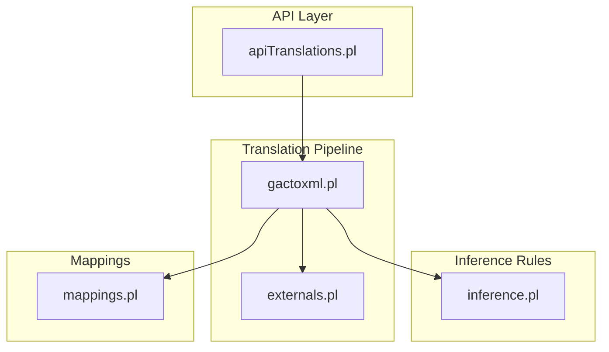
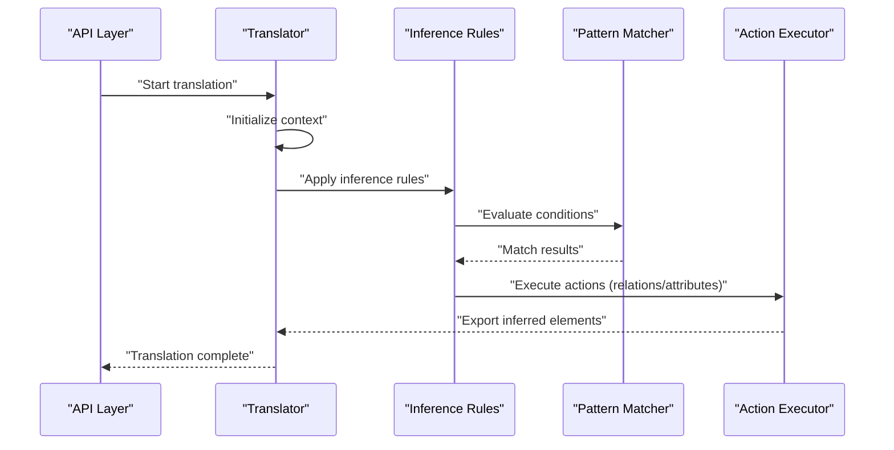
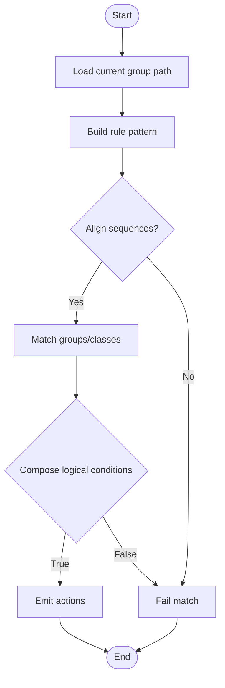
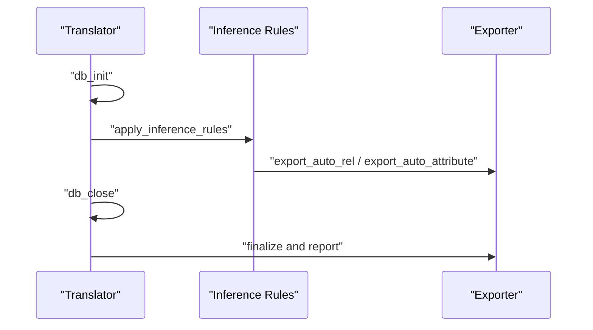
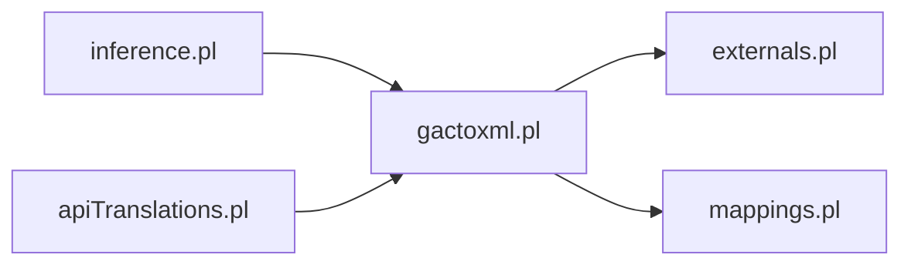

# Inference Engine

<cite>
**Referenced Files in This Document**
- [inference.pl](file://src/inference.pl)
- [gactoxml.pl](file://src/gactoxml.pl)
- [externals.pl](file://src/externals.pl)
- [mappings.pl](file://src/mappings.pl)
- [apiTranslations.pl](file://src/apiTranslations.pl)
- [inference_sample.yml](file://tests/kleio-home/inferences/inference_sample.yml)
</cite>

## Table of Contents
1. [Introduction](#introduction)
2. [Project Structure](#project-structure)
3. [Core Components](#core-components)
4. [Architecture Overview](#architecture-overview)
5. [Detailed Component Analysis](#detailed-component-analysis)
6. [Dependency Analysis](#dependency-analysis)
7. [Performance Considerations](#performance-considerations)
8. [Troubleshooting Guide](#troubleshooting-guide)
9. [Conclusion](#conclusion)

## Introduction
This document explains the inference engine of the Timelink Kleio system, focusing on how automatic relationship discovery and knowledge extraction transform raw historical documents into enriched semantic knowledge. The engine uses declarative inference rules to detect implicit connections among persons, events, and locations based on contextual clues encoded in structured sources. It integrates tightly with the translation pipeline to augment the semantic richness of exported data.

## Project Structure
The inference engine spans several modules:
- Inference rules: Declarative patterns that trigger actions when matched against parsed data.
- Translation pipeline: Orchestrates parsing, rule application, and export.
- External APIs: Provide access to parsed data and metadata for rule evaluation.
- Mappings: Define how inferred relations and attributes map to relational schema.

**Diagram sources**
- [inference.pl](file://src/inference.pl#L1-L120)
- [gactoxml.pl](file://src/gactoxml.pl#L1-L120)
- [externals.pl](file://src/externals.pl#L1-L120)
- [mappings.pl](file://src/mappings.pl#L1-L120)
- [apiTranslations.pl](file://src/apiTranslations.pl#L1-L120)

**Section sources**
- [inference.pl](file://src/inference.pl#L1-L120)
- [gactoxml.pl](file://src/gactoxml.pl#L1-L120)
- [externals.pl](file://src/externals.pl#L1-L120)
- [mappings.pl](file://src/mappings.pl#L1-L120)
- [apiTranslations.pl](file://src/apiTranslations.pl#L1-L120)

## Core Components
- Inference rules: Declarative patterns that match parsed groups and generate relations or attributes.
- Pattern matcher: Matches rule patterns against the current group path.
- Action executor: Applies generated relations/attributes to the export stream.
- Scope management: Controls when to reset accumulated context during rule application.

Key behaviors:
- Rule syntax supports logical combinations (and/or) and positional sequences.
- Actions include generating relations, attributes, and resetting scope.
- Rules leverage group inheritance and extension mechanisms to generalize matches.

**Section sources**
- [inference.pl](file://src/inference.pl#L1-L120)
- [gactoxml.pl](file://src/gactoxml.pl#L1683-L1737)

## Architecture Overview
The inference engine runs during translation. After initializing the translation context, the pipeline applies inference rules to discovered groups and emits inferred relations and attributes alongside the original data.

**Diagram sources**
- [gactoxml.pl](file://src/gactoxml.pl#L170-L188)
- [gactoxml.pl](file://src/gactoxml.pl#L1683-L1737)
- [inference.pl](file://src/inference.pl#L1-L120)

## Detailed Component Analysis

### Inference Rule Syntax and Semantics
Rules follow an if-then structure with optional and/or combinations. Patterns can include:
- sequence(C): Matches a sequence of groups with a shared context.
- group(Name, ID): Matches a specific group name and binds an identifier.
- extends(Class, ID): Matches any group extending a given class and binds an identifier.
- clause(C): Calls a predicate in the Prolog environment.

Actions include:
- relation(type, value, origin, destination): Creates a relation between entities.
- attribute(id, type, value): Adds an attribute to an entity.
- newscope: Resets the current scope (clears accumulated state).

Example rule categories:
- Kinship relations (e.g., parent-child, spouses).
- Marital relations with prior marriages.
- Functional roles inferred from document structure.

**Section sources**
- [inference.pl](file://src/inference.pl#L1-L120)
- [inference.pl](file://src/inference.pl#L36-L103)
- [inference.pl](file://src/inference.pl#L104-L235)
- [inference.pl](file://src/inference.pl#L244-L306)
- [inference.pl](file://src/inference.pl#L308-L517)

### Pattern Matching Algorithm
The pattern matcher operates over the current group path and attempts to align rule patterns with the parsed structure. It supports:
- Sequence alignment: Ensures multiple conditions share a common prefix path.
- Group/class matching: Resolves group names and inheritance relationships.
- Logical composition: Handles and/or combinations across multiple conditions.

**Diagram sources**
- [gactoxml.pl](file://src/gactoxml.pl#L1710-L1737)

**Section sources**
- [gactoxml.pl](file://src/gactoxml.pl#L1710-L1737)

### Automated Reasoning and Scope Management
Scope rules constrain which groups can be related:
- Automatic relations are inferred only between groups that are either ancestors/descendants or share a direct common ancestor.
- Container-contained relationships must be expressed from container to contained.

Scope management:
- new scope resets accumulated path and attribute caches.
- Clean paths removes stale path references after rule application.

Temporal and spatial proximity:
- Proximity is implicit in the document structure (sequence alignment) and explicit through location mappings.

**Section sources**
- [gactoxml.pl](file://src/gactoxml.pl#L1566-L1581)
- [gactoxml.pl](file://src/gactoxml.pl#L1732-L1736)

### Action Execution and Export
Actions are executed immediately upon successful pattern matches:
- relation(...) triggers export of a relation with origin and destination entities.
- attribute(...) adds an attribute to an entity.
- newscope clears the current scope and caches.

Export integration:
- Relations and attributes are emitted as part of the group’s inferred elements, ensuring downstream consumers receive enriched knowledge.

**Section sources**
- [gactoxml.pl](file://src/gactoxml.pl#L1725-L1731)
- [gactoxml.pl](file://src/gactoxml.pl#L1811-L1818)

### Translation Workflow Integration
The translation lifecycle integrates inference:
- Initialization clears caches and prepares context.
- do_auto_rels and do_auto_rels2 orchestrate legacy and modern inference modes.
- Closing stage exports inferred elements and finalizes reports.

**Diagram sources**
- [gactoxml.pl](file://src/gactoxml.pl#L129-L166)
- [gactoxml.pl](file://src/gactoxml.pl#L170-L188)
- [gactoxml.pl](file://src/gactoxml.pl#L1658-L1669)

**Section sources**
- [gactoxml.pl](file://src/gactoxml.pl#L129-L166)
- [gactoxml.pl](file://src/gactoxml.pl#L170-L188)
- [gactoxml.pl](file://src/gactoxml.pl#L1658-L1669)

### Configuration of Inference Rules
Rule configuration can be provided via YAML samples and integrated into the translation process. The YAML format mirrors the Prolog syntax and supports:
- Conditions with sequence, extends, and group placeholders.
- Actions to generate relations and attributes.
- Optional rule metadata (name, description).

Example configuration demonstrates parent-child relations and marital relations with prior spouses.

**Section sources**
- [inference_sample.yml](file://tests/kleio-home/inferences/inference_sample.yml#L1-L100)
- [inference.pl](file://src/inference.pl#L1-L120)

### Concrete Examples from the Codebase
- Parent-child relations: Rules infer parent-child ties for both male and female actors across multiple generational levels.
- Spousal relations: Rules infer marriages and prior marriages, marking attributes such as mortality status.
- Functional roles: Rules infer roles like head-of-household and direct members based on group membership.

These examples illustrate how contextual cues (e.g., “noivo” and “noiva” in marriage acts) are transformed into standardized relations.

**Section sources**
- [inference.pl](file://src/inference.pl#L36-L103)
- [inference.pl](file://src/inference.pl#L104-L235)
- [inference.pl](file://src/inference.pl#L244-L306)

### Handling Uncertainty and Incomplete Information
- Inference rules are designed to match available context; missing information leads to partial matches or skipped actions.
- Attribute caching and scope clearing prevent carryover of incomplete state across unrelated contexts.
- The system relies on structure files to constrain possible matches, reducing ambiguity.

**Section sources**
- [gactoxml.pl](file://src/gactoxml.pl#L1684-L1688)
- [gactoxml.pl](file://src/gactoxml.pl#L1732-L1736)

### Performance Optimization for Complex Inference Chains
- Indexing: Automatic relation clauses are indexed to accelerate lookups.
- Lazy evaluation: Conditions are evaluated only when needed.
- Scope pruning: Cleaning paths and caches reduces memory overhead.
- Mode selection: Legacy vs. modern inference modes allow tuning trade-offs.

**Section sources**
- [gactoxml.pl](file://src/gactoxml.pl#L1927-L1936)
- [gactoxml.pl](file://src/gactoxml.pl#L1663-L1674)

### Debugging Techniques for Inference Rule Development
- Logging: Use debug logs to trace rule application and path matching.
- Test harness: Run targeted translations on representative sources to validate rules.
- Incremental rule addition: Start with simple rules and progressively add complexity.
- YAML-driven validation: Use YAML samples to verify rule semantics before integrating into Prolog.

**Section sources**
- [gactoxml.pl](file://src/gactoxml.pl#L129-L166)
- [inference_sample.yml](file://tests/kleio-home/inferences/inference_sample.yml#L1-L100)

## Dependency Analysis
The inference engine depends on:
- Translation pipeline for context and export.
- External predicates for accessing parsed data and metadata.
- Mappings for translating inferred elements into relational schema.

**Diagram sources**
- [inference.pl](file://src/inference.pl#L1-L120)
- [gactoxml.pl](file://src/gactoxml.pl#L93-L104)
- [externals.pl](file://src/externals.pl#L1-L120)
- [mappings.pl](file://src/mappings.pl#L1-L120)
- [apiTranslations.pl](file://src/apiTranslations.pl#L1-L120)

**Section sources**
- [gactoxml.pl](file://src/gactoxml.pl#L93-L104)
- [externals.pl](file://src/externals.pl#L1-L120)
- [mappings.pl](file://src/mappings.pl#L1-L120)
- [apiTranslations.pl](file://src/apiTranslations.pl#L1-L120)

## Performance Considerations
- Minimize redundant pattern matching by leveraging sequence alignment and scope boundaries.
- Prefer indexed automatic relations for frequent checks.
- Limit rule complexity to reduce backtracking and unify conditions where possible.
- Monitor memory usage through path and attribute cache cleanup.

[No sources needed since this section provides general guidance]

## Troubleshooting Guide
Common issues and remedies:
- Rules not firing: Verify that group paths align with sequence expectations and that inheritance resolves correctly.
- Incorrect relations: Confirm scope rules and directionality (container-to-contained).
- Memory growth: Ensure newscope and cache cleaning are invoked after rule application.
- API integration: Confirm that user-defined mappings and inference rules are loaded before translation starts.

**Section sources**
- [gactoxml.pl](file://src/gactoxml.pl#L1683-L1737)
- [gactoxml.pl](file://src/gactoxml.pl#L1732-L1736)
- [apiTranslations.pl](file://src/apiTranslations.pl#L76-L82)

## Conclusion
The Timelink Kleio inference engine augments historical documents with implicit knowledge by combining declarative rules, robust pattern matching, and tight integration with the translation pipeline. By structuring rules around group inheritance, sequence alignment, and scope constraints, it reliably discovers relationships and enriches the semantic output suitable for downstream analysis and linkage.