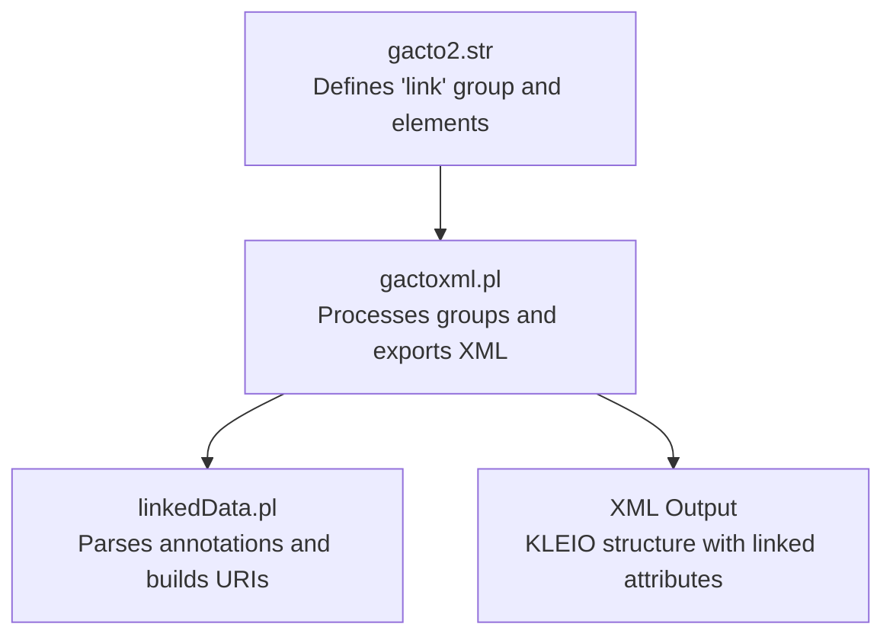
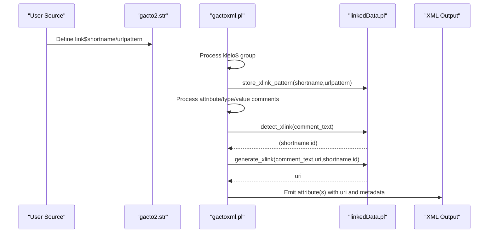
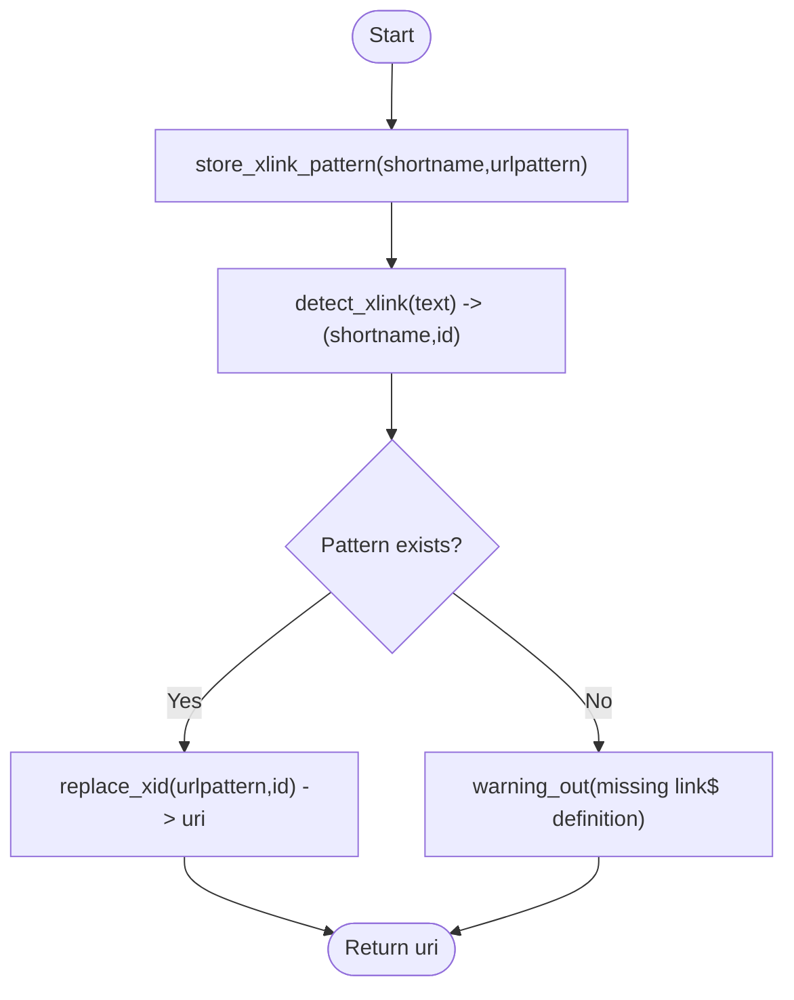
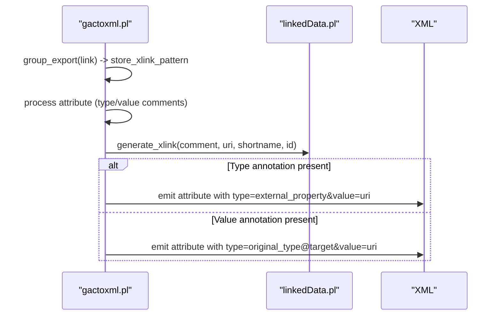
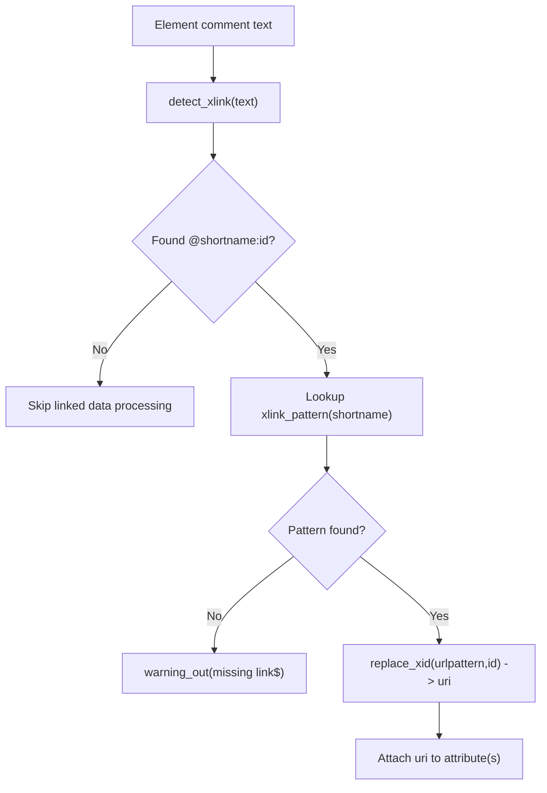
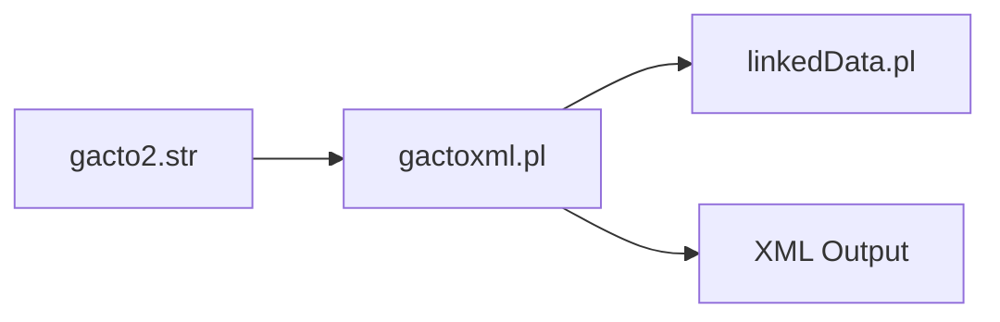

# Linked Data Integration

<cite>
**Referenced Files in This Document**
- [linkedData.pl](file://src/linkedData.pl)
- [gactoxml.pl](file://src/gactoxml.pl)
- [gacto2.str](file://src/stru/gacto2.str)
- [linked_data.md](file://docs/doc/linked_data.md)
</cite>

## Table of Contents
1. [Introduction](#introduction)
2. [Project Structure](#project-structure)
3. [Core Components](#core-components)
4. [Architecture Overview](#architecture-overview)
5. [Detailed Component Analysis](#detailed-component-analysis)
6. [Dependency Analysis](#dependency-analysis)
7. [Performance Considerations](#performance-considerations)
8. [Troubleshooting Guide](#troubleshooting-guide)
9. [Conclusion](#conclusion)
10. [Appendices](#appendices)

## Introduction
This document explains the linked data integration capabilities of the translation engine, focusing on how external identifiers are resolved, how semantic links are represented in XML output, and how the system implements a lightweight, standards-aligned approach to linking Kleio data items to external knowledge bases (e.g., Wikidata). It covers:
- Link declaration via kleio$ link$ entries
- Annotation syntax for values and types using @shortname:id comments
- URI generation strategies and pattern substitution
- Cross-reference management and attribute duplication with semantic attributes
- XML export behavior for database import and downstream processing
- Performance considerations and troubleshooting techniques

## Project Structure
The linked data feature spans three main areas:
- Configuration schema that defines the link group and elements
- The linked data module that parses annotations and generates URIs
- The XML exporter that integrates linked data into the generated XML

**Diagram sources**
- [gacto2.str:168-187](file://src/stru/gacto2.str#L168-L187)
- [gactoxml.pl:483-489](file://src/gactoxml.pl#L483-L489)
- [linkedData.pl:1-48](file://src/linkedData.pl#L1-L48)

**Section sources**
- [gacto2.str:168-187](file://src/stru/gacto2.str#L168-L187)
- [gactoxml.pl:483-489](file://src/gactoxml.pl#L483-L489)
- [linkedData.pl:1-48](file://src/linkedData.pl#L1-L48)

## Core Components
- Link declaration schema: The link group is defined in the structure file with shortname and urlpattern elements. This allows users to register external targets such as wikidata or geonames.
- Annotation parsing and URI generation: The linked data module detects annotations of the form @shortname:id within element comments and constructs URIs by substituting id into the registered urlpattern.
- Exporter integration: The XML exporter processes attributes and other elements, extracts type/value comments, resolves linked data, and emits additional attributes carrying the generated URIs.

Key responsibilities:
- Store and clear link patterns per translation run
- Detect annotations in text
- Replace placeholders in URL patterns
- Integrate linked attributes into exported XML

**Section sources**
- [gacto2.str:168-187](file://src/stru/gacto2.str#L168-L187)
- [linkedData.pl:51-116](file://src/linkedData.pl#L51-L116)
- [gactoxml.pl:483-489](file://src/gactoxml.pl#L483-L489)
- [gactoxml.pl:780-819](file://src/gactoxml.pl#L780-L819)
- [gactoxml.pl:1116-1151](file://src/gactoxml.pl#L1116-L1151)

## Architecture Overview
The end-to-end flow from source annotation to XML output:

**Diagram sources**
- [gacto2.str:168-187](file://src/stru/gacto2.str#L168-L187)
- [gactoxml.pl:483-489](file://src/gactoxml.pl#L483-L489)
- [gactoxml.pl:780-819](file://src/gactoxml.pl#L780-L819)
- [gactoxml.pl:1116-1151](file://src/gactoxml.pl#L1116-L1151)
- [linkedData.pl:51-116](file://src/linkedData.pl#L51-L116)

## Detailed Component Analysis

### Link Declaration Schema
The link group defines:
- shortname: a human-readable alias for an external target
- urlpattern: a URL template containing a placeholder for the external identifier

These definitions are consumed during translation to build URIs.

**Section sources**
- [gacto2.str:168-187](file://src/stru/gacto2.str#L168-L187)

### Linked Data Module (linkedData.pl)
Responsibilities:
- Register link patterns: store_xlink_pattern/2 persists shortname-urlpattern pairs
- Clear patterns: clear_xlink_patterns/0 resets state at start of translation
- Detect annotations: detect_xlink/3 parses @shortname:id from comment text
- Generate URIs: generate_xlink/4 substitutes id into urlpattern and returns the final URI
- Utility: replace_xid/3 performs placeholder replacement; clear_xlink_data/0 clears auxiliary storage

Implementation notes:
- Patterns are stored dynamically and thread-local to avoid cross-run contamination
- Regex-based detection supports flexible whitespace and allowed characters in ids
- Warnings are emitted when a link$ definition is missing for a referenced shortname

**Diagram sources**
- [linkedData.pl:51-116](file://src/linkedData.pl#L51-L116)

**Section sources**
- [linkedData.pl:51-116](file://src/linkedData.pl#L51-L116)

### XML Exporter Integration (gactoxml.pl)
Integration points:
- Initialization: clears link patterns at the start of translation
- Processing link declarations: when encountering a link group, stores the pattern
- Attribute processing: inspects type and value comments for annotations
- Generating linked attributes:
  - For type annotations: duplicates the attribute with a new type representing the external property and sets its value to the generated URI
  - For value annotations: creates a new attribute whose type encodes the original type plus the external target, and whose value is the generated URI
- Error handling: emits warnings/errors if link$ definitions are missing or URI generation fails

**Diagram sources**
- [gactoxml.pl:483-489](file://src/gactoxml.pl#L483-L489)
- [gactoxml.pl:780-819](file://src/gactoxml.pl#L780-L819)
- [gactoxml.pl:1116-1151](file://src/gactoxml.pl#L1116-L1151)

**Section sources**
- [gactoxml.pl:483-489](file://src/gactoxml.pl#L483-L489)
- [gactoxml.pl:780-819](file://src/gactoxml.pl#L780-L819)
- [gactoxml.pl:1116-1151](file://src/gactoxml.pl#L1116-L1151)

### Identifier Resolution Workflow
The resolution workflow proceeds as follows:
1. Parse element comments to find annotations of the form @shortname:id
2. Look up the registered urlpattern for shortname
3. Substitute id into the urlpattern to produce the final URI
4. Attach the URI to the appropriate attribute(s) in the XML output

**Diagram sources**
- [linkedData.pl:73-108](file://src/linkedData.pl#L73-L108)
- [gactoxml.pl:780-819](file://src/gactoxml.pl#L780-L819)
- [gactoxml.pl:1116-1151](file://src/gactoxml.pl#L1116-L1151)

**Section sources**
- [linkedData.pl:73-108](file://src/linkedData.pl#L73-L108)
- [gactoxml.pl:780-819](file://src/gactoxml.pl#L780-L819)
- [gactoxml.pl:1116-1151](file://src/gactoxml.pl#L1116-L1151)

### Semantic Web Standards Alignment
- Identifiers: Uses standard URI-based identifiers for external entities
- Property modeling: External properties can be modeled by generating attributes whose types encode the external property reference
- Observability: Original comments and values are preserved alongside generated attributes, aiding traceability
- Interoperability: The resulting XML is suitable for import into databases and for further transformation into RDF triples by downstream tools

Note: The current implementation focuses on embedding linked data references in XML attributes rather than emitting native RDF triples directly.

[No sources needed since this section provides general guidance]

### Examples of Linked Data Patterns
- Declaring a target:
  - link$wikidata/"http://wikidata.org/wiki/$1"
- Annotating a value:
  - ls$jesuita-entrada/Goa, Índia# @wikidata:Q1171/15791200
- Resulting attribute:
  - An additional attribute is added with the generated URI and metadata about the original value and comment

For more examples and usage guidance, see the linked data documentation.

**Section sources**
- [linked_data.md:10-55](file://docs/doc/linked_data.md#L10-L55)

## Dependency Analysis
High-level dependencies among components:

**Diagram sources**
- [gacto2.str:168-187](file://src/stru/gacto2.str#L168-L187)
- [gactoxml.pl:483-489](file://src/gactoxml.pl#L483-L489)
- [linkedData.pl:51-116](file://src/linkedData.pl#L51-L116)

**Section sources**
- [gacto2.str:168-187](file://src/stru/gacto2.str#L168-L187)
- [gactoxml.pl:483-489](file://src/gactoxml.pl#L483-L489)
- [linkedData.pl:51-116](file://src/linkedData.pl#L51-L116)

## Performance Considerations
- Pattern registration cost: Minimal; link$ entries are processed once per translation run
- Annotation detection: Regex-based scanning occurs per attribute/comment; keep annotations concise
- URI generation: Simple string substitution; negligible overhead
- XML emission: Additional attributes increase output size; consider batching or filtering large datasets if necessary
- Thread-local storage: Prevents contention across concurrent runs; ensure proper cleanup between translations

[No sources needed since this section provides general guidance]

## Troubleshooting Guide
Common issues and resolutions:
- Missing link$ definition:
  - Symptom: Warning indicating a missing link$ definition for a shortname
  - Action: Ensure kleio$ includes a matching link$shortname/urlpattern entry
- Invalid annotation format:
  - Symptom: No linked attribute generated
  - Action: Verify the annotation follows @shortname:id syntax and contains allowed characters
- Placeholder not substituted:
  - Symptom: Generated URI lacks expected id
  - Action: Confirm urlpattern contains the $1 placeholder and id is non-empty
- Multiple annotations:
  - Symptom: Only one link applied
  - Action: Use separate annotations for type and value as documented; ensure each has a valid link$ definition

Operational checks:
- Confirm link patterns are cleared at translation start
- Validate that link groups are processed before attributes referencing them

**Section sources**
- [linkedData.pl:96-108](file://src/linkedData.pl#L96-L108)
- [gactoxml.pl:780-819](file://src/gactoxml.pl#L780-L819)
- [gactoxml.pl:1142-1151](file://src/gactoxml.pl#L1142-L1151)

## Conclusion
The translation engine’s linked data integration enables robust linkage of Kleio data to external knowledge bases through a simple, declarative mechanism. By registering link targets and annotating values and types, the system automatically generates URIs and embeds semantic attributes into the XML output. This design balances ease of use with extensibility, allowing downstream systems to transform the XML into RDF or other semantic formats while preserving provenance and original content.

[No sources needed since this section summarizes without analyzing specific files]

## Appendices

### API Reference Summary
- linkedData.pl
  - store_xlink_pattern/2: Register a shortname-urlpattern pair
  - clear_xlink_patterns/0: Reset all registered patterns
  - detect_xlink/3: Parse @shortname:id from text
  - generate_xlink/4: Build URI from pattern and id
  - replace_xid/3: Perform placeholder substitution
  - clear_xlink_data/0: Clear auxiliary link data
- gactoxml.pl
  - group_export(link): Process link$ declarations
  - Attribute processing: Extract type/value comments and generate linked attributes
  - Error/warning reporting for missing definitions or failed generation

**Section sources**
- [linkedData.pl:1-48](file://src/linkedData.pl#L1-L48)
- [linkedData.pl:51-116](file://src/linkedData.pl#L51-L116)
- [gactoxml.pl:483-489](file://src/gactoxml.pl#L483-L489)
- [gactoxml.pl:780-819](file://src/gactoxml.pl#L780-L819)
- [gactoxml.pl:1116-1151](file://src/gactoxml.pl#L1116-L1151)