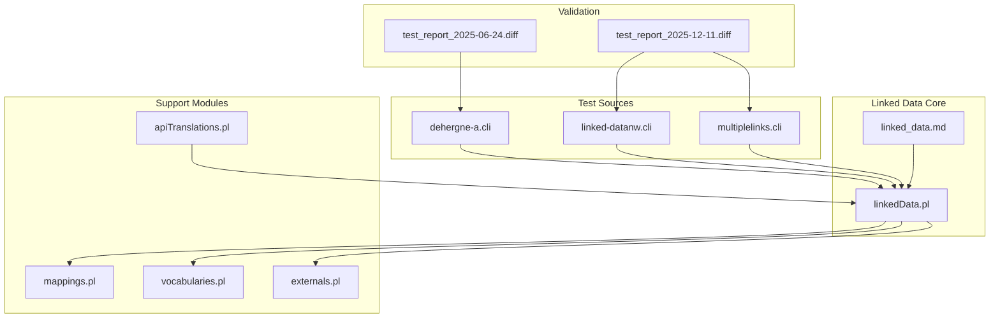
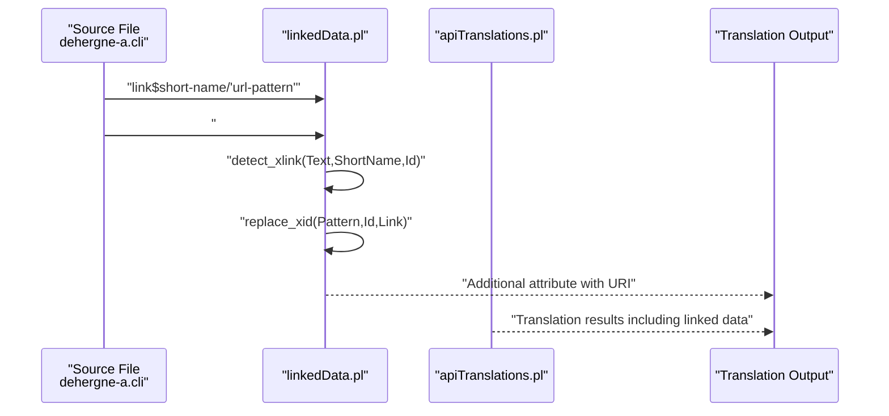
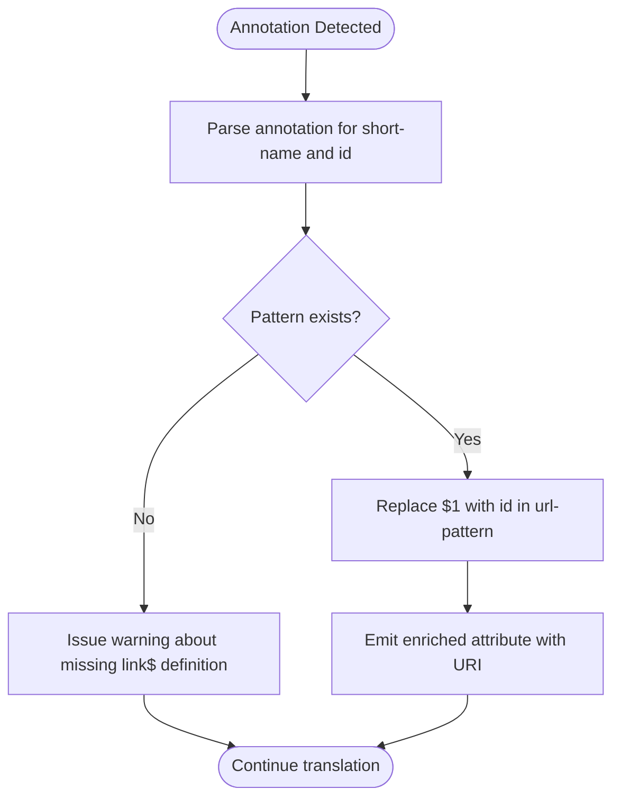
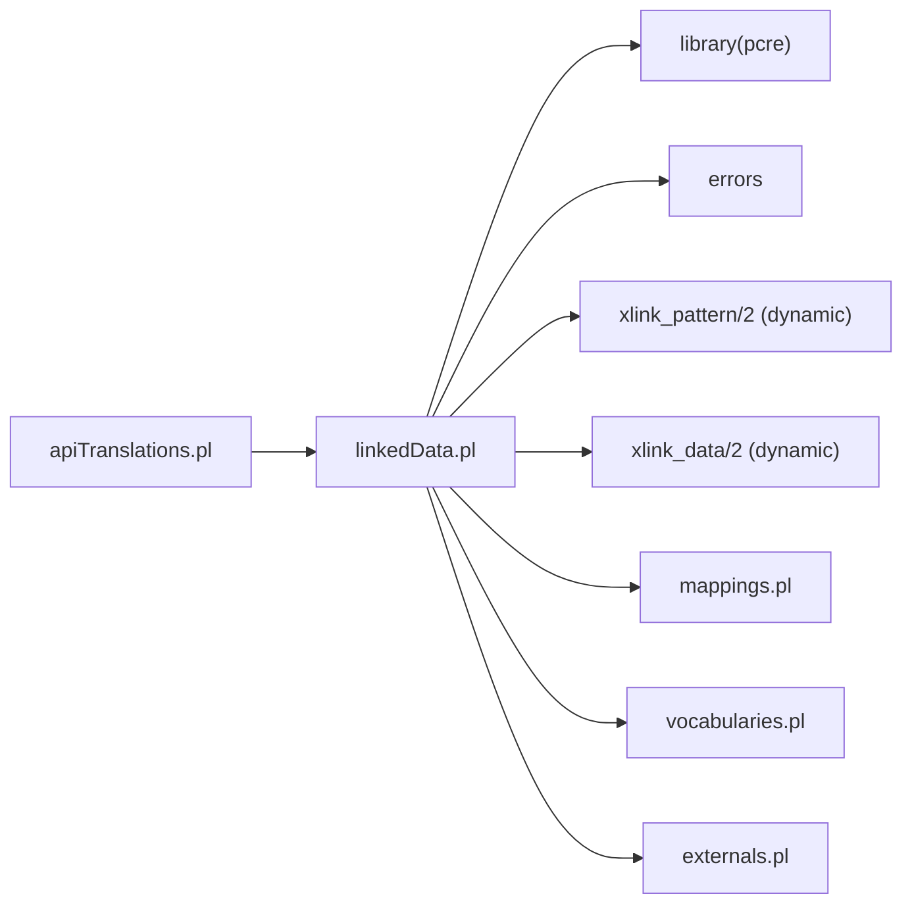

# Linked Data Integration

<cite>
**Referenced Files in This Document**
- [linkedData.pl](file://src/linkedData.pl)
- [linked_data.md](file://docs/doc/linked_data.md)
- [dehergne-a.cli](file://tests/kleio-home/sources/reference_sources/linked_data/dehergne-a.cli)
- [linked-datanw.cli](file://tests/kleio-home/sources/reference_sources/linked_data/linked-datanw.cli)
- [multiplelinks.cli](file://tests/kleio-home/sources/reference_sources/linked_data/multiplelinks.cli)
- [mappings.pl](file://src/mappings.pl)
- [vocabularies.pl](file://src/vocabularies.pl)
- [externals.pl](file://src/externals.pl)
- [apiTranslations.pl](file://src/apiTranslations.pl)
- [README.md](file://README.md)
- [test_report_2025-06-24_12:36:15.diff](file://tests/reports/test_report_2025-06-24_12:36:15.diff)
- [test_report_2025-12-11_18:28:25.diff](file://tests/reports/test_report_2025-12-11_18:28:25.diff)
</cite>

## Table of Contents
1. [Introduction](#introduction)
2. [Project Structure](#project-structure)
3. [Core Components](#core-components)
4. [Architecture Overview](#architecture-overview)
5. [Detailed Component Analysis](#detailed-component-analysis)
6. [Dependency Analysis](#dependency-analysis)
7. [Performance Considerations](#performance-considerations)
8. [Troubleshooting Guide](#troubleshooting-guide)
9. [Conclusion](#conclusion)

## Introduction
This document explains the linked data integration subsystem that connects historical entities in the system to external knowledge bases and semantic web resources. It covers how the system declares external sources, resolves historical references to standardized identifiers, generates URIs, and enriches translation outputs with external context such as locations, biographical facts, and institutional affiliations. It also documents configuration of external knowledge base connections, handling of network failures and timeouts, and strategies for maintaining data quality. Privacy and licensing considerations and their impact on translation performance are addressed.

## Project Structure
The linked data capability is implemented as a small set of cooperating modules and is exercised by representative test sources:
- Core predicate library for linked data handling
- Documentation describing the notation and expected behavior
- Test sources demonstrating declarations and annotations
- Supporting modules for mappings, vocabularies, and translation orchestration
- Reports and diffs validating behavior across test runs

**Diagram sources**
- [linkedData.pl](file://src/linkedData.pl#L1-L116)
- [linked_data.md](file://docs/doc/linked_data.md#L1-L55)
- [dehergne-a.cli](file://tests/kleio-home/sources/reference_sources/linked_data/dehergne-a.cli#L1-L120)
- [linked-datanw.cli](file://tests/kleio-home/sources/reference_sources/linked_data/linked-datanw.cli#L1-L6)
- [multiplelinks.cli](file://tests/kleio-home/sources/reference_sources/linked_data/multiplelinks.cli#L1-L9)
- [mappings.pl](file://src/mappings.pl#L1-L200)
- [vocabularies.pl](file://src/vocabularies.pl#L1-L76)
- [externals.pl](file://src/externals.pl#L1-L200)
- [apiTranslations.pl](file://src/apiTranslations.pl#L1-L200)
- [test_report_2025-06-24_12:36:15.diff](file://tests/reports/test_report_2025-06-24_12:36:15.diff#L200-L226)
- [test_report_2025-12-11_18:28:25.diff](file://tests/reports/test_report_2025-12-11_18:28:25.diff#L179-L217)

**Section sources**
- [linkedData.pl](file://src/linkedData.pl#L1-L116)
- [linked_data.md](file://docs/doc/linked_data.md#L1-L55)
- [dehergne-a.cli](file://tests/kleio-home/sources/reference_sources/linked_data/dehergne-a.cli#L1-L120)
- [linked-datanw.cli](file://tests/kleio-home/sources/reference_sources/linked_data/linked-datanw.cli#L1-L6)
- [multiplelinks.cli](file://tests/kleio-home/sources/reference_sources/linked_data/multiplelinks.cli#L1-L9)
- [mappings.pl](file://src/mappings.pl#L1-L200)
- [vocabularies.pl](file://src/vocabularies.pl#L1-L76)
- [externals.pl](file://src/externals.pl#L1-L200)
- [apiTranslations.pl](file://src/apiTranslations.pl#L1-L200)
- [test_report_2025-06-24_12:36:15.diff](file://tests/reports/test_report_2025-06-24_12:36:15.diff#L200-L226)
- [test_report_2025-12-11_18:28:25.diff](file://tests/reports/test_report_2025-12-11_18:28:25.diff#L179-L217)

## Core Components
- Linked data declaration and URI generation
  - Declaring external sources via link$ attributes in the kleio$ group
  - Extracting and validating external annotations in element comments
  - Replacing placeholders in URL patterns to produce URIs
- Translation-time enrichment
  - Generating additional attributes enriched with external URIs during translation
  - Managing warnings for missing link$ definitions without failing the process
- Validation and reporting
  - Using test reports to confirm expected behavior and detect regressions

Key behaviors and mechanisms:
- Declaration format: link$short-name/"url-pattern" with $1 placeholder
- Annotation format: # @short-name:id in element comments
- Output enrichment: Additional attributes carrying resolved URIs and preserved metadata

**Section sources**
- [linkedData.pl](file://src/linkedData.pl#L11-L116)
- [linked_data.md](file://docs/doc/linked_data.md#L8-L55)
- [dehergne-a.cli](file://tests/kleio-home/sources/reference_sources/linked_data/dehergne-a.cli#L1-L120)
- [linked-datanw.cli](file://tests/kleio-home/sources/reference_sources/linked_data/linked-datanw.cli#L1-L6)
- [multiplelinks.cli](file://tests/kleio-home/sources/reference_sources/linked_data/multiplelinks.cli#L1-L9)

## Architecture Overview
The linked data pipeline integrates with the translation process to resolve annotations and produce enriched outputs. The flow below maps to actual predicates and test sources.

**Diagram sources**
- [linkedData.pl](file://src/linkedData.pl#L68-L108)
- [dehergne-a.cli](file://tests/kleio-home/sources/reference_sources/linked_data/dehergne-a.cli#L1-L120)
- [apiTranslations.pl](file://src/apiTranslations.pl#L52-L82)

## Detailed Component Analysis

### Linked Data Module (linkedData.pl)
Responsibilities:
- Store and manage external source patterns (link$ short-name -> url-pattern)
- Detect external annotations in text comments
- Generate URIs by replacing placeholders in patterns
- Provide cleanup predicates for patterns and stored link data

Processing logic:
- Pattern storage replaces previous entries for the same short name
- Detection uses pattern matching to extract short-name and id from annotations
- URI generation requires a matching pattern; otherwise a warning is issued

**Diagram sources**
- [linkedData.pl](file://src/linkedData.pl#L68-L108)

**Section sources**
- [linkedData.pl](file://src/linkedData.pl#L51-L116)

### Documentation and Notation (linked_data.md)
Guidelines:
- Declaring external sources with link$ short-name and quoted url-pattern
- Annotating element values with # @short-name:id
- Expected output enrichment with additional attributes carrying URIs

Examples:
- Multiple external sources declared and used in a single file
- Mixed annotations with and without link$ definitions

**Section sources**
- [linked_data.md](file://docs/doc/linked_data.md#L8-L55)
- [multiplelinks.cli](file://tests/kleio-home/sources/reference_sources/linked_data/multiplelinks.cli#L1-L9)
- [dehergne-a.cli](file://tests/kleio-home/sources/reference_sources/linked_data/dehergne-a.cli#L1-L120)

### Test Sources and Behavior
Representative test sources demonstrate:
- Declaring multiple external sources (wikidata, bnportugal, archive, bdconline)
- Annotating elements with external identifiers
- Handling missing link$ definitions with warnings instead of errors

Validation:
- Test reports compare reference outputs with generated outputs
- Differences indicate expected vs. actual behavior for linked data enrichment

**Section sources**
- [dehergne-a.cli](file://tests/kleio-home/sources/reference_sources/linked_data/dehergne-a.cli#L1-L120)
- [linked-datanw.cli](file://tests/kleio-home/sources/reference_sources/linked_data/linked-datanw.cli#L1-L6)
- [multiplelinks.cli](file://tests/kleio-home/sources/reference_sources/linked_data/multiplelinks.cli#L1-L9)
- [test_report_2025-06-24_12:36:15.diff](file://tests/reports/test_report_2025-06-24_12:36:15.diff#L200-L226)
- [test_report_2025-12-11_18:28:25.diff](file://tests/reports/test_report_2025-12-11_18:28:25.diff#L179-L217)

### Supporting Modules
- Mappings (mappings.pl): Defines schema mappings for entities and attributes; indirectly supports enrichment by structuring output.
- Vocabularies (vocabularies.pl): Manages vocabulary initialization and storage; useful for controlled terms in enrichment contexts.
- Externals (externals.pl): Provides predicates for accessing current group, elements, aspects, and baseclass relationships; helpful for translation-time context.
- API Translations (apiTranslations.pl): Orchestrates translation jobs and manages parameters; ensures linked data enrichment participates in translation runs.

**Section sources**
- [mappings.pl](file://src/mappings.pl#L1-L200)
- [vocabularies.pl](file://src/vocabularies.pl#L1-L76)
- [externals.pl](file://src/externals.pl#L1-L200)
- [apiTranslations.pl](file://src/apiTranslations.pl#L52-L82)

## Dependency Analysis
Linked data predicates depend on:
- Dynamic storage of link patterns (thread-local)
- Regular expression utilities for parsing annotations
- Optional warnings for missing link$ definitions

**Diagram sources**
- [linkedData.pl](file://src/linkedData.pl#L42-L48)
- [mappings.pl](file://src/mappings.pl#L1-L200)
- [vocabularies.pl](file://src/vocabularies.pl#L1-L76)
- [externals.pl](file://src/externals.pl#L1-L200)
- [apiTranslations.pl](file://src/apiTranslations.pl#L52-L82)

**Section sources**
- [linkedData.pl](file://src/linkedData.pl#L42-L48)
- [apiTranslations.pl](file://src/apiTranslations.pl#L52-L82)

## Performance Considerations
- Pattern lookup and replacement are linear in the number of declared link$ sources; keep the number reasonable.
- Regular expressions are used for detection; ensure patterns avoid excessive backtracking.
- Translation performance is primarily influenced by the volume of annotations and the number of link$ sources; batching and caching of link$ definitions help.
- Warnings for missing link$ definitions avoid aborting translation, reducing runtime failures but potentially increasing report verbosity.

[No sources needed since this section provides general guidance]

## Troubleshooting Guide
Common issues and resolutions:
- Missing link$ definition
  - Symptom: Warning emitted instead of error
  - Resolution: Add link$short-name with a valid url-pattern containing $1
- Invalid annotation format
  - Symptom: Annotation not recognized
  - Resolution: Ensure annotation follows # @short-name:id
- Placeholder mismatch
  - Symptom: URI generation fails silently
  - Resolution: Confirm url-pattern contains exactly one $1 placeholder
- Network failures and timeouts
  - Observation: Linked data enrichment is local; remote resolution is not performed by the system
  - Strategy: Validate URIs locally; external resolution is outside the scope of this module

Evidence from repository:
- Version notes indicate fixes for handling linked data notation with no link$ statement and improved warnings
- Test reports show differences between reference and generated outputs, highlighting expected behavior

**Section sources**
- [README.md](file://README.md#L408-L442)
- [linkedData.pl](file://src/linkedData.pl#L96-L108)
- [test_report_2025-06-24_12:36:15.diff](file://tests/reports/test_report_2025-06-24_12:36:15.diff#L200-L226)
- [test_report_2025-12-11_18:28:25.diff](file://tests/reports/test_report_2025-12-11_18:28:25.diff#L179-L217)

## Conclusion
The linked data integration provides a lightweight, declarative mechanism to connect historical entities to external knowledge bases. By declaring link$ patterns and annotating elements with @short-name:id, the system generates enriched attributes with standardized URIs during translation. The design emphasizes robustness with warnings for missing configurations and focuses on local URI generation without performing remote resolution. Together with supporting modules and validated test sources, this subsystem enables high-quality, interoperable historical data outputs aligned with global knowledge graphs.