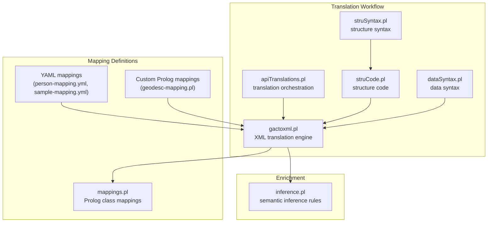
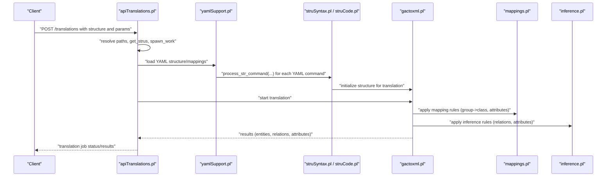
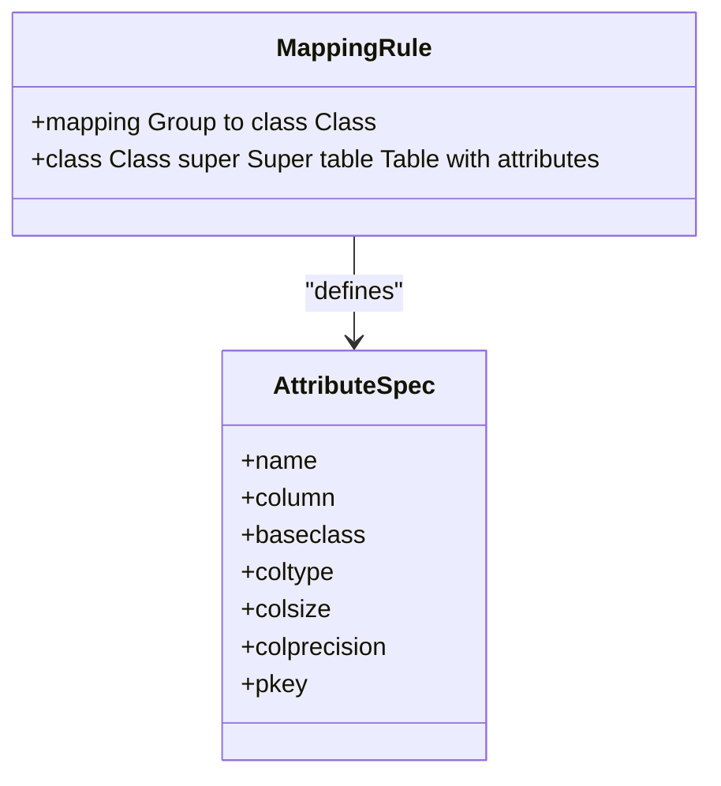
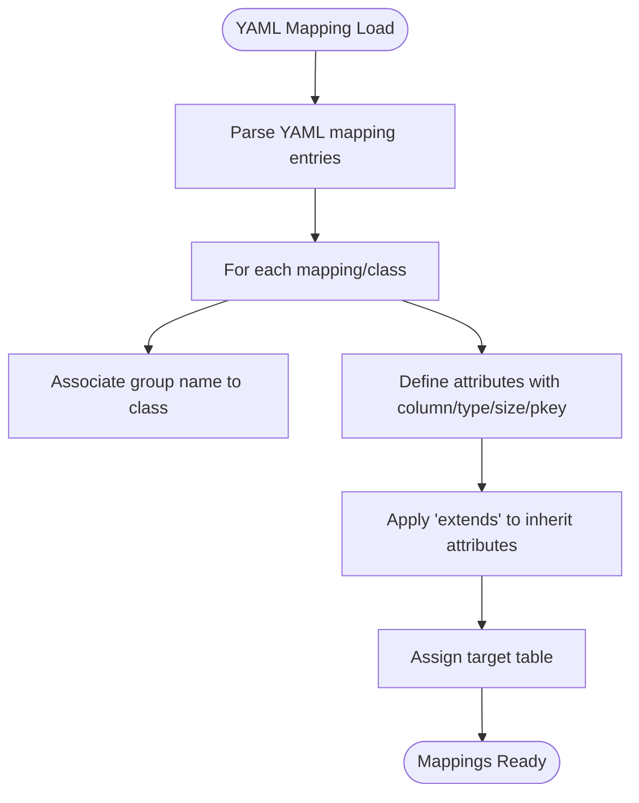
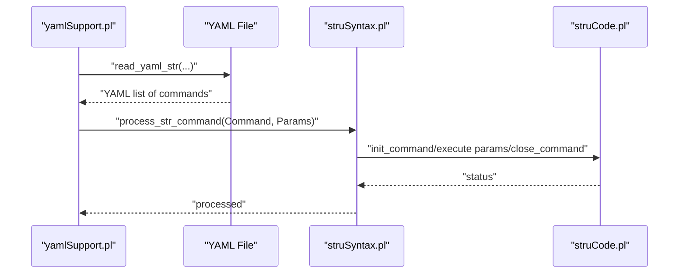
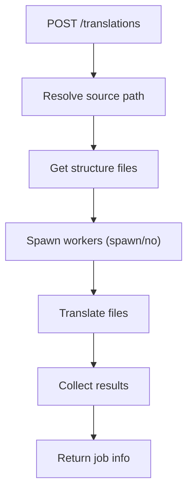
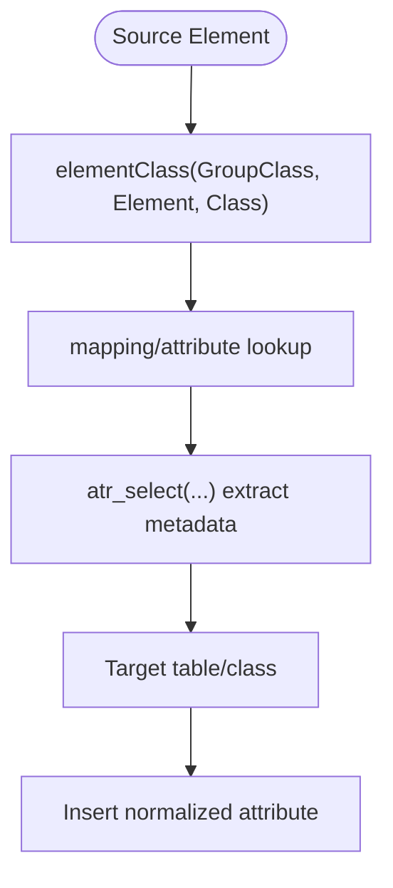
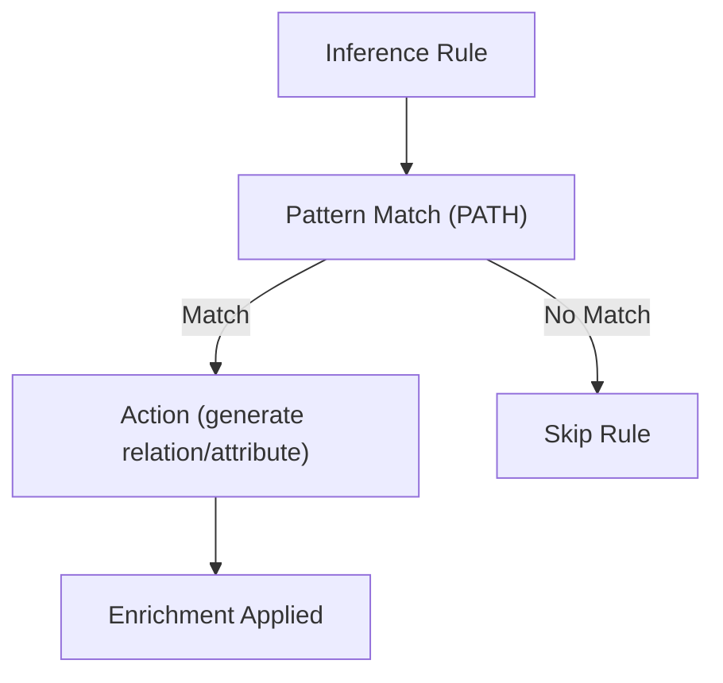
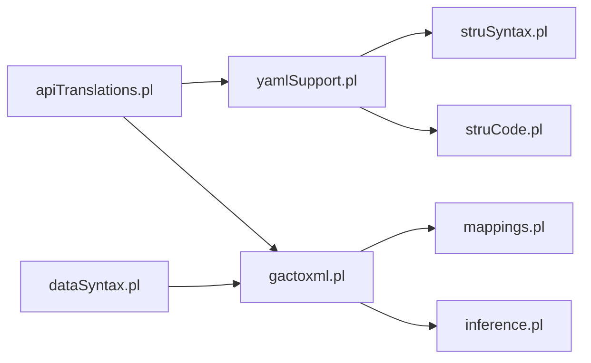

# Mapping System

<cite>
**Referenced Files in This Document**
- [mappings.pl](file://src/mappings.pl)
- [yamlSupport.pl](file://src/yamlSupport.pl)
- [apiTranslations.pl](file://src/apiTranslations.pl)
- [gactoxml.pl](file://src/gactoxml.pl)
- [struCode.pl](file://src/struCode.pl)
- [struSyntax.pl](file://src/struSyntax.pl)
- [dataSyntax.pl](file://src/dataSyntax.pl)
- [inference.pl](file://src/inference.pl)
- [person-mapping.yml](file://tests/kleio-home/mappings/person-mapping.yml)
- [sample-mapping.yml](file://tests/kleio-home/mappings/sample-mapping.yml)
- [geodesc-mapping.pl](file://tests/kleio-home/mappings/geodesc-mapping.pl)
- [sources-structure.yaml](file://tests/kleio-home/structures/sources-structure.yaml)
</cite>

## Table of Contents
1. [Introduction](#introduction)
2. [Project Structure](#project-structure)
3. [Core Components](#core-components)
4. [Architecture Overview](#architecture-overview)
5. [Detailed Component Analysis](#detailed-component-analysis)
6. [Dependency Analysis](#dependency-analysis)
7. [Performance Considerations](#performance-considerations)
8. [Troubleshooting Guide](#troubleshooting-guide)
9. [Conclusion](#conclusion)

## Introduction
This document explains the mapping system of the Timelink Kleio system with a focus on data transformation and enrichment. It covers:
- Mapping rule syntax and transformation logic that converts raw Kleio data into structured relational models
- Mapping file formats: YAML-based mappings and Prolog-based custom mappings
- The rule-based transformation engine that applies semantic enrichment to historical data
- Practical examples from the codebase showing how mapping rules transform source data, handle conditional transformations, and manage normalization
- Configuration options, performance considerations for large-scale transformations, and troubleshooting approaches
- The relationship between mappings and the overall translation workflow, including interactions with structure definitions and inference rules

## Project Structure
The mapping system spans multiple modules:
- Prolog mapping definitions define class-to-relational mappings and attribute schemas
- YAML support reads and processes structure and mapping files
- Translation orchestration coordinates mapping loading and execution
- XML translation engine applies mappings and inference rules during data processing
- Structure syntax and code modules parse and validate structure definitions

**Diagram sources**
- [mappings.pl](file://src/mappings.pl#L1-L518)
- [yamlSupport.pl](file://src/yamlSupport.pl#L1-L273)
- [apiTranslations.pl](file://src/apiTranslations.pl#L1-L200)
- [gactoxml.pl](file://src/gactoxml.pl#L2127-L2195)
- [struCode.pl](file://src/struCode.pl#L1-L200)
- [struSyntax.pl](file://src/struSyntax.pl#L1-L200)
- [dataSyntax.pl](file://src/dataSyntax.pl#L1-L194)
- [inference.pl](file://src/inference.pl#L1-L200)
- [person-mapping.yml](file://tests/kleio-home/mappings/person-mapping.yml#L1-L15)
- [sample-mapping.yml](file://tests/kleio-home/mappings/sample-mapping.yml#L1-L24)
- [geodesc-mapping.pl](file://tests/kleio-home/mappings/geodesc-mapping.pl#L1-L52)

**Section sources**
- [mappings.pl](file://src/mappings.pl#L1-L518)
- [yamlSupport.pl](file://src/yamlSupport.pl#L1-L273)
- [apiTranslations.pl](file://src/apiTranslations.pl#L1-L200)
- [gactoxml.pl](file://src/gactoxml.pl#L2127-L2195)
- [struCode.pl](file://src/struCode.pl#L1-L200)
- [struSyntax.pl](file://src/struSyntax.pl#L1-L200)
- [dataSyntax.pl](file://src/dataSyntax.pl#L1-L194)
- [inference.pl](file://src/inference.pl#L1-L200)
- [person-mapping.yml](file://tests/kleio-home/mappings/person-mapping.yml#L1-L15)
- [sample-mapping.yml](file://tests/kleio-home/mappings/sample-mapping.yml#L1-L24)
- [geodesc-mapping.pl](file://tests/kleio-home/mappings/geodesc-mapping.pl#L1-L52)

## Core Components
- Prolog mapping definitions: Define how source groups map to classes and attributes, including column names, types, sizes, and primary keys. See [mappings.pl](file://src/mappings.pl#L24-L518).
- YAML mapping definitions: Provide a declarative way to define mappings and classes with attributes, including inheritance and table targets. See [person-mapping.yml](file://tests/kleio-home/mappings/person-mapping.yml#L1-L15) and [sample-mapping.yml](file://tests/kleio-home/mappings/sample-mapping.yml#L1-L24).
- YAML structure processing: Reads YAML structure files, resolves includes, sanitizes values, and bridges to structure code. See [yamlSupport.pl](file://src/yamlSupport.pl#L28-L193).
- Translation orchestration: Starts translations, manages parameters (structure, echo, recursion, spawn), and coordinates worker distribution. See [apiTranslations.pl](file://src/apiTranslations.pl#L52-L82).
- XML translation engine: Applies mappings and inference rules during data processing, selects target classes, and normalizes attribute values. See [gactoxml.pl](file://src/gactoxml.pl#L2127-L2195).
- Structure parsing: Validates and executes structure commands, storing internal representations. See [struSyntax.pl](file://src/struSyntax.pl#L48-L101) and [struCode.pl](file://src/struCode.pl#L91-L118).
- Data syntax: Tokenizes and parses raw data lines into structured elements. See [dataSyntax.pl](file://src/dataSyntax.pl#L57-L62).
- Inference rules: Provide semantic enrichment via conditional rules that generate relations and attributes. See [inference.pl](file://src/inference.pl#L36-L135).

**Section sources**
- [mappings.pl](file://src/mappings.pl#L24-L518)
- [yamlSupport.pl](file://src/yamlSupport.pl#L28-L193)
- [apiTranslations.pl](file://src/apiTranslations.pl#L52-L82)
- [gactoxml.pl](file://src/gactoxml.pl#L2127-L2195)
- [struSyntax.pl](file://src/struSyntax.pl#L48-L101)
- [struCode.pl](file://src/struCode.pl#L91-L118)
- [dataSyntax.pl](file://src/dataSyntax.pl#L57-L62)
- [inference.pl](file://src/inference.pl#L36-L135)
- [person-mapping.yml](file://tests/kleio-home/mappings/person-mapping.yml#L1-L15)
- [sample-mapping.yml](file://tests/kleio-home/mappings/sample-mapping.yml#L1-L24)

## Architecture Overview
The mapping system integrates structure definitions, mapping rules, and translation logic to produce normalized relational outputs enriched with inferred semantics.

**Diagram sources**
- [apiTranslations.pl](file://src/apiTranslations.pl#L52-L82)
- [yamlSupport.pl](file://src/yamlSupport.pl#L28-L193)
- [struSyntax.pl](file://src/struSyntax.pl#L48-L101)
- [struCode.pl](file://src/struCode.pl#L91-L118)
- [gactoxml.pl](file://src/gactoxml.pl#L2127-L2195)
- [mappings.pl](file://src/mappings.pl#L24-L518)
- [inference.pl](file://src/inference.pl#L36-L135)

## Detailed Component Analysis

### Prolog Mapping Definitions (mappings.pl)
- Purpose: Define how source groups map to classes and how attributes are mapped to relational columns with types, sizes, and primary keys.
- Syntax highlights:
  - mapping Group to class Class.
  - class Class super Super table TableName with attributes attr column Col baseclass BaseClass coltype Type colsize Size colprecision Precision pkey IsPK and ...
- Examples:
  - Entity mappings for geoentity, aregister, rentity, rperson, robject, source, act, person, object, relation, attribute, group_element, item, proparr, registo-merces, acta, household, escritura, good, divida, siza, aforamento, escambo, caso, acusacao, cartaperdao, crime, perdao, carta, event, adenda, topico.
- Attribute selection helpers:
  - Helper predicates extract attribute metadata (name, column, baseclass, type, size, precision, pkey) from attribute lists.

**Diagram sources**
- [mappings.pl](file://src/mappings.pl#L24-L518)

**Section sources**
- [mappings.pl](file://src/mappings.pl#L24-L518)

### YAML Mapping Definitions (person-mapping.yml, sample-mapping.yml)
- Purpose: Declarative mapping definitions in YAML for classes and attributes, including inheritance (extends), table targets, and descriptions.
- Structure highlights:
  - mapping: { name: group-name, class: class-name }
  - class: { name, extends, table, description, attributes: [ { name, column, class, type, size, pkey } ] }
- Example references:
  - Person mapping: [person-mapping.yml](file://tests/kleio-home/mappings/person-mapping.yml#L1-L15)
  - Sample act-like mapping: [sample-mapping.yml](file://tests/kleio-home/mappings/sample-mapping.yml#L1-L24)

**Diagram sources**
- [person-mapping.yml](file://tests/kleio-home/mappings/person-mapping.yml#L1-L15)
- [sample-mapping.yml](file://tests/kleio-home/mappings/sample-mapping.yml#L1-L24)

**Section sources**
- [person-mapping.yml](file://tests/kleio-home/mappings/person-mapping.yml#L1-L15)
- [sample-mapping.yml](file://tests/kleio-home/mappings/sample-mapping.yml#L1-L24)

### YAML Structure Processing (yamlSupport.pl)
- Purpose: Read YAML structure/mapping files, resolve includes, sanitize values, and dispatch commands to structure code.
- Key steps:
  - Normalize file paths and track stack to prevent cycles
  - Read YAML, inspect each command, and process parameters
  - Bridge to struSyntax and struCode for command execution
- Sanitization ensures YAML values are converted to atoms/lists as needed.

**Diagram sources**
- [yamlSupport.pl](file://src/yamlSupport.pl#L46-L137)
- [struSyntax.pl](file://src/struSyntax.pl#L48-L101)
- [struCode.pl](file://src/struCode.pl#L91-L118)

**Section sources**
- [yamlSupport.pl](file://src/yamlSupport.pl#L28-L193)
- [struSyntax.pl](file://src/struSyntax.pl#L48-L101)
- [struCode.pl](file://src/struCode.pl#L91-L118)

### Translation Orchestration (apiTranslations.pl)
- Purpose: Start translations, resolve structure files, distribute work, and return results.
- Key parameters:
  - structure: structure file to use
  - echo: include source lines in rpt
  - recurse: descend into subdirectories
  - status: filter by translation status
  - spawn: parallel workers vs single-threaded
- Notes:
  - TODO comments indicate hooks for user-defined mappings and inference rules

**Diagram sources**
- [apiTranslations.pl](file://src/apiTranslations.pl#L52-L82)

**Section sources**
- [apiTranslations.pl](file://src/apiTranslations.pl#L52-L82)

### XML Translation Engine (gactoxml.pl) and Attribute Selection
- Purpose: Apply mappings and inference rules during translation, selecting target classes and normalizing attribute values.
- Key logic:
  - elementClass/3 resolves the target class for a given element within a group
  - rch_get_attribute/2 and atr_select/2 extract attribute metadata from mapping definitions
  - output_mappings/0 demonstrates conversion from legacy str mappings to Prolog syntax

**Diagram sources**
- [gactoxml.pl](file://src/gactoxml.pl#L2127-L2195)
- [mappings.pl](file://src/mappings.pl#L24-L518)

**Section sources**
- [gactoxml.pl](file://src/gactoxml.pl#L2127-L2195)
- [mappings.pl](file://src/mappings.pl#L24-L518)

### Inference Rules (inference.pl)
- Purpose: Provide semantic enrichment via conditional rules that generate relations and attributes based on observed patterns in the data.
- Rule syntax highlights:
  - if PATH then ACTION
  - PATH supports sequences, group names, class extensions, and Prolog clauses
  - ACTION supports generating relations and attributes, and scoping control
- Examples:
  - Parent-child relations derived from pai/mae and filho/filha
  - Spousal relations across multiple marriage contexts
  - Attribute assignments for marital status

**Diagram sources**
- [inference.pl](file://src/inference.pl#L36-L135)

**Section sources**
- [inference.pl](file://src/inference.pl#L36-L135)

### Relationship Between Mappings and Structure Definitions
- YAML structure files compose mappings and include reusable definitions.
- Example structure composition:
  - [sources-structure.yaml](file://tests/kleio-home/structures/sources-structure.yaml#L1-L9) includes elements, groups, and Portuguese-specific structure files.

**Section sources**
- [sources-structure.yaml](file://tests/kleio-home/structures/sources-structure.yaml#L1-L9)

## Dependency Analysis
The mapping system exhibits layered dependencies:
- YAML support depends on YAML library and bridges to structure syntax/code
- Translation orchestration depends on YAML support and structure processing
- Translation engine depends on mapping definitions and inference rules
- Data syntax underpins tokenization and parsing for translation

**Diagram sources**
- [yamlSupport.pl](file://src/yamlSupport.pl#L17-L26)
- [struSyntax.pl](file://src/struSyntax.pl#L37-L42)
- [struCode.pl](file://src/struCode.pl#L49-L56)
- [apiTranslations.pl](file://src/apiTranslations.pl#L21-L32)
- [gactoxml.pl](file://src/gactoxml.pl#L2127-L2195)
- [mappings.pl](file://src/mappings.pl#L1-L18)
- [inference.pl](file://src/inference.pl#L1-L7)
- [dataSyntax.pl](file://src/dataSyntax.pl#L24-L29)

**Section sources**
- [yamlSupport.pl](file://src/yamlSupport.pl#L17-L26)
- [struSyntax.pl](file://src/struSyntax.pl#L37-L42)
- [struCode.pl](file://src/struCode.pl#L49-L56)
- [apiTranslations.pl](file://src/apiTranslations.pl#L21-L32)
- [gactoxml.pl](file://src/gactoxml.pl#L2127-L2195)
- [mappings.pl](file://src/mappings.pl#L1-L18)
- [inference.pl](file://src/inference.pl#L1-L7)
- [dataSyntax.pl](file://src/dataSyntax.pl#L24-L29)

## Performance Considerations
- Parallel translation: Use the spawn parameter to distribute work across workers for large datasets. See [apiTranslations.pl](file://src/apiTranslations.pl#L75-L80).
- Status caching: The translation status endpoint caches results to reduce repeated computation. See [apiTranslations.pl](file://src/apiTranslations.pl#L168-L199).
- YAML includes and stack tracking: Prevents redundant processing and cycles during structure/mapping loads. See [yamlSupport.pl](file://src/yamlSupport.pl#L46-L69).
- Attribute normalization: Mapping attribute selection and type/size constraints help maintain consistent schemas and reduce downstream processing overhead. See [mappings.pl](file://src/mappings.pl#L24-L518) and [gactoxml.pl](file://src/gactoxml.pl#L2141-L2157).

[No sources needed since this section provides general guidance]

## Troubleshooting Guide
- YAML command errors: Unknown or misspelled commands in YAML structure/mapping files trigger warnings and halt processing. See [yamlSupport.pl](file://src/yamlSupport.pl#L149-L154).
- Structure command errors: Invalid or unimplemented commands in structure files produce detailed error messages with file and line context. See [struSyntax.pl](file://src/struSyntax.pl#L52-L58).
- Mapping attribute extraction: If attribute metadata cannot be selected, verify mapping definitions and attribute ordering. See [gactoxml.pl](file://src/gactoxml.pl#L2141-L2157).
- Inference rule mismatches: If expected relations/attributes are missing, review inference rule patterns and data context. See [inference.pl](file://src/inference.pl#L36-L135).
- Translation status inconsistencies: Use the status cache and filtering mechanisms to diagnose issues. See [apiTranslations.pl](file://src/apiTranslations.pl#L107-L122).

**Section sources**
- [yamlSupport.pl](file://src/yamlSupport.pl#L149-L154)
- [struSyntax.pl](file://src/struSyntax.pl#L52-L58)
- [gactoxml.pl](file://src/gactoxml.pl#L2141-L2157)
- [inference.pl](file://src/inference.pl#L36-L135)
- [apiTranslations.pl](file://src/apiTranslations.pl#L107-L122)

## Conclusion
The Timelink Kleio mapping system combines Prolog-based class mappings, YAML-based structure and mapping definitions, and a robust translation engine to transform raw historical data into normalized relational models enriched by inference rules. The system’s modular design enables flexible configuration, scalable translation, and reliable enrichment, while its diagnostics and caching mechanisms support efficient operation at scale.