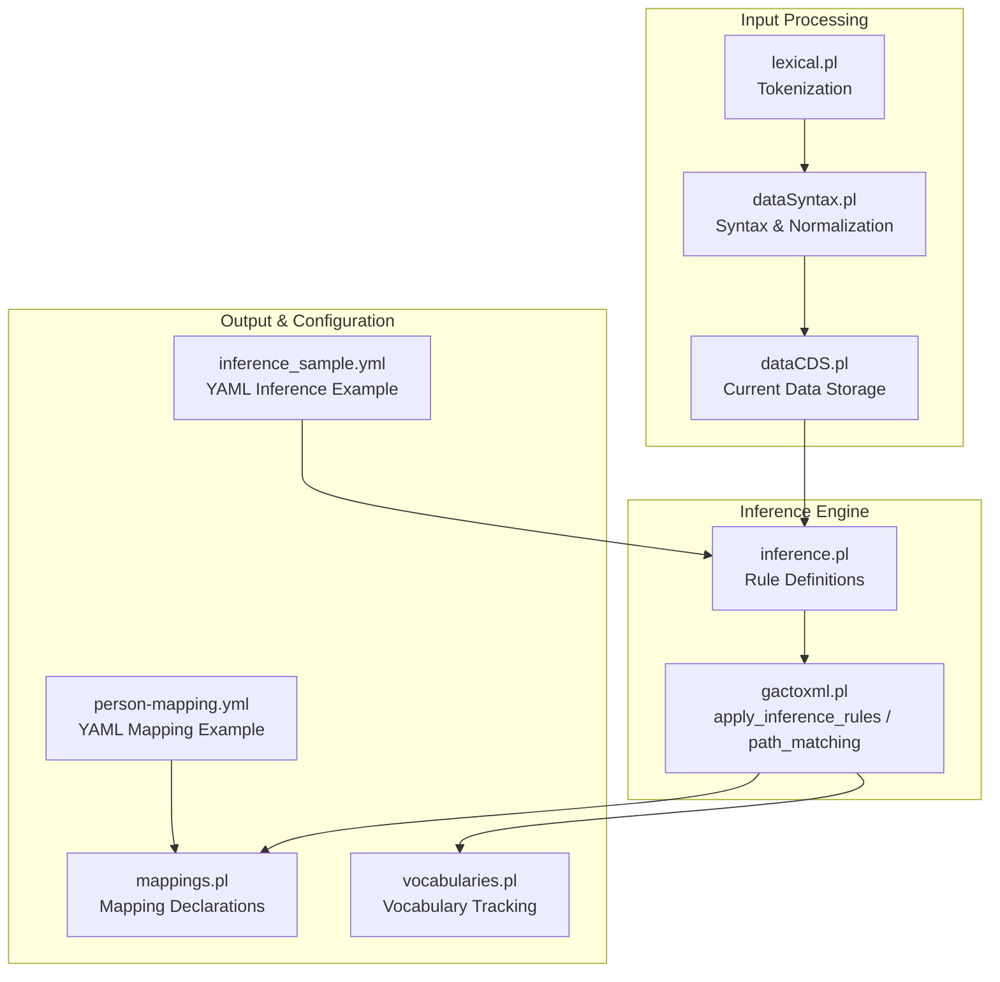
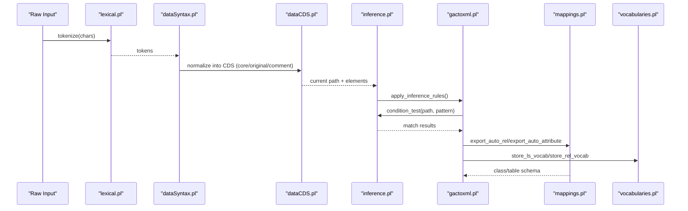
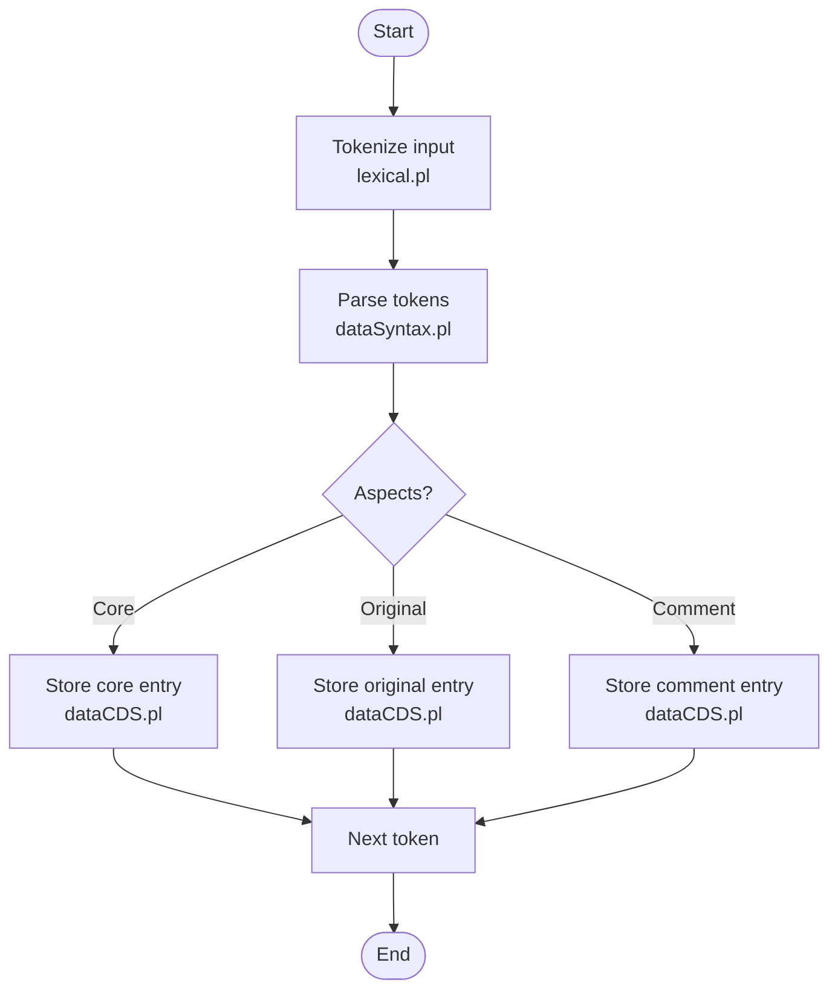
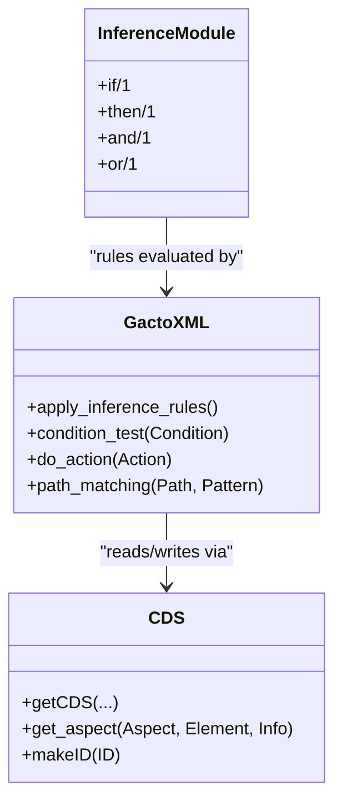
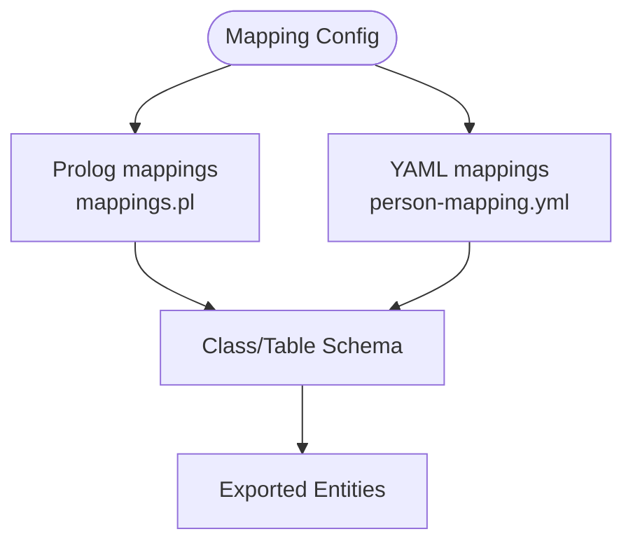
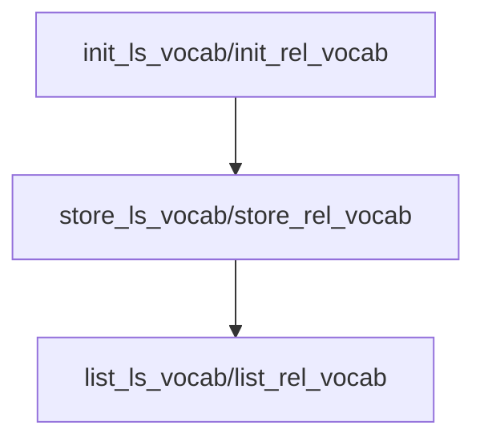
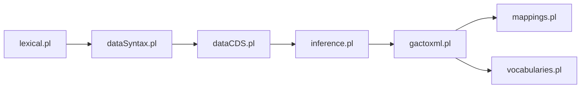

# Normalization and Inference

<cite>
**Referenced Files in This Document**
- [inference.pl](file://src/inference.pl)
- [gactoxml.pl](file://src/gactoxml.pl)
- [dataSyntax.pl](file://src/dataSyntax.pl)
- [lexical.pl](file://src/lexical.pl)
- [dataCDS.pl](file://src/dataCDS.pl)
- [mappings.pl](file://src/mappings.pl)
- [vocabularies.pl](file://src/vocabularies.pl)
- [person-mapping.yml](file://tests/kleio-home/mappings/person-mapping.yml)
- [inference_sample.yml](file://tests/kleio-home/inferences/inference_sample.yml)
</cite>

## Table of Contents
1. Introduction
2. Project Structure
3. Core Components
4. Architecture Overview
5. Detailed Component Analysis
6. Dependency Analysis
7. Performance Considerations
8. Troubleshooting Guide
9. Conclusion

## Introduction
This document explains the normalization and inference systems within the translation engine. It covers how raw input is tokenized and normalized into a structured intermediate representation, how contextual inference rules generate additional relations and attributes, and how mapping configurations transform data into target formats. It also documents the inference rule engine, vocabulary management, and configuration options for domain-specific requirements, along with debugging techniques for inference logic.

## Project Structure
The normalization and inference pipeline spans several modules:
- Lexical analysis and tokenization
- Syntax parsing and normalization into an internal Current Data Storage (CDS)
- Inference rule evaluation to derive new facts
- Mapping definitions to export or persist derived structures
- Vocabulary tracking for attribute and relation values

**Diagram sources**
- [lexical.pl:1-120](file://src/lexical.pl#L1-L120)
- [dataSyntax.pl:1-120](file://src/dataSyntax.pl#L1-L120)
- [dataCDS.pl:1-120](file://src/dataCDS.pl#L1-L120)
- [inference.pl:1-52](file://src/inference.pl#L1-L52)
- [gactoxml.pl:1695-1749](file://src/gactoxml.pl#L1695-L1749)
- [mappings.pl:1-64](file://src/mappings.pl#L1-L64)
- [vocabularies.pl:1-76](file://src/vocabularies.pl#L1-L76)
- [person-mapping.yml:1-15](file://tests/kleio-home/mappings/person-mapping.yml#L1-L15)
- [inference_sample.yml:1-100](file://tests/kleio-home/inferences/inference_sample.yml#L1-L100)

**Section sources**
- [lexical.pl:1-120](file://src/lexical.pl#L1-L120)
- [dataSyntax.pl:1-120](file://src/dataSyntax.pl#L1-L120)
- [dataCDS.pl:1-120](file://src/dataCDS.pl#L1-L120)
- [inference.pl:1-52](file://src/inference.pl#L1-L52)
- [gactoxml.pl:1695-1749](file://src/gactoxml.pl#L1695-L1749)
- [mappings.pl:1-64](file://src/mappings.pl#L1-L64)
- [vocabularies.pl:1-76](file://src/vocabularies.pl#L1-L76)
- [person-mapping.yml:1-15](file://tests/kleio-home/mappings/person-mapping.yml#L1-L15)
- [inference_sample.yml:1-100](file://tests/kleio-home/inferences/inference_sample.yml#L1-L100)

## Core Components
- Tokenizer and lexical flags: Converts raw characters into tokens and supports configurable separators and quoting.
- Syntax analyzer and normalizer: Parses tokens into structured elements and stores them in CDS with core/original/comment aspects.
- Current Data Storage (CDS): Maintains current group context, element lists, and multi-entry values; generates IDs based on schema.
- Inference rule engine: Evaluates declarative if-then rules over the current path and context to produce relations and attributes.
- Mapping system: Declares class-to-table mappings and attribute schemas for output persistence.
- Vocabulary tracker: Collects observed attribute and relation value sets for validation and reporting.

**Section sources**
- [lexical.pl:1-120](file://src/lexical.pl#L1-L120)
- [dataSyntax.pl:1-120](file://src/dataSyntax.pl#L1-L120)
- [dataCDS.pl:1-120](file://src/dataCDS.pl#L1-L120)
- [inference.pl:1-52](file://src/inference.pl#L1-L52)
- [gactoxml.pl:1695-1749](file://src/gactoxml.pl#L1695-L1749)
- [mappings.pl:1-64](file://src/mappings.pl#L1-L64)
- [vocabularies.pl:1-76](file://src/vocabularies.pl#L1-L76)

## Architecture Overview
The pipeline transforms raw text into normalized records, applies inference rules to enrich the model, and then maps entities to target tables/classes.

**Diagram sources**
- [lexical.pl:1-120](file://src/lexical.pl#L1-L120)
- [dataSyntax.pl:1-120](file://src/dataSyntax.pl#L1-L120)
- [dataCDS.pl:1-120](file://src/dataCDS.pl#L1-L120)
- [inference.pl:1-52](file://src/inference.pl#L1-L52)
- [gactoxml.pl:1695-1749](file://src/gactoxml.pl#L1695-L1749)
- [mappings.pl:1-64](file://src/mappings.pl#L1-L64)
- [vocabularies.pl:1-76](file://src/vocabularies.pl#L1-L76)

## Detailed Component Analysis

### Normalization Pipeline
- Tokenization: The tokenizer recognizes names, numbers, quoted strings, and special data flags. Flags allow customizing separators and escape sequences.
- Syntax compilation: The syntax analyzer interprets tokens to create groups and elements, handling triple-quoted blocks, double-quoted strings, and aspect markers.
- Normalization into CDS: Elements are stored with multiple entries and aspects (core, original, comment). IDs are generated according to schema-defined identification rules.

**Diagram sources**
- [lexical.pl:1-120](file://src/lexical.pl#L1-L120)
- [dataSyntax.pl:1-120](file://src/dataSyntax.pl#L1-L120)
- [dataCDS.pl:1-120](file://src/dataCDS.pl#L1-L120)

**Section sources**
- [lexical.pl:1-120](file://src/lexical.pl#L1-L120)
- [dataSyntax.pl:1-120](file://src/dataSyntax.pl#L1-L120)
- [dataCDS.pl:1-120](file://src/dataCDS.pl#L1-L120)

### Inference Rule Engine
- Rule format: Declarative rules use if-then patterns over the current path and context. Patterns support sequence matching, group/class extension checks, and custom Prolog clauses.
- Actions: Rules can emit relations, set attributes, or reset scope.
- Evaluation: The engine iterates rules, tests conditions against the current path, and executes actions by exporting auto-generated relations and attributes.

**Diagram sources**
- [inference.pl:1-52](file://src/inference.pl#L1-L52)
- [gactoxml.pl:1695-1749](file://src/gactoxml.pl#L1695-L1749)
- [dataCDS.pl:1-120](file://src/dataCDS.pl#L1-L120)

**Section sources**
- [inference.pl:1-52](file://src/inference.pl#L1-L52)
- [gactoxml.pl:1695-1749](file://src/gactoxml.pl#L1695-L1749)

### Mapping Configuration
- Prolog-based mappings define source-to-class relationships and table schemas with column types, sizes, and primary key flags.
- YAML-based mappings provide an alternative configuration style for classes and attributes.

**Diagram sources**
- [mappings.pl:1-64](file://src/mappings.pl#L1-L64)
- [person-mapping.yml:1-15](file://tests/kleio-home/mappings/person-mapping.yml#L1-L15)

**Section sources**
- [mappings.pl:1-64](file://src/mappings.pl#L1-L64)
- [person-mapping.yml:1-15](file://tests/kleio-home/mappings/person-mapping.yml#L1-L15)

### Vocabulary Management
- Tracks observed attribute and relation values during processing.
- Provides initialization, storage, and listing utilities for auditing and validation.

**Diagram sources**
- [vocabularies.pl:1-76](file://src/vocabularies.pl#L1-L76)

**Section sources**
- [vocabularies.pl:1-76](file://src/vocabularies.pl#L1-L76)

### Examples

#### Normalization Patterns
- Triple-quoted blocks preserve literal content across lines.
- Double-quoted strings handle embedded quotes and escapes.
- Aspect markers separate core, original wording, and comments.

**Section sources**
- [dataSyntax.pl:1-120](file://src/dataSyntax.pl#L1-L120)
- [lexical.pl:1-120](file://src/lexical.pl#L1-L120)

#### Inference Rules
- Parent-child relations inferred from actor groups and parent elements.
- Spousal relations inferred from marriage contexts and partner elements.
- Attribute generation for marital status and prior marriages.

**Section sources**
- [inference.pl:1-52](file://src/inference.pl#L1-L52)
- [inference_sample.yml:1-100](file://tests/kleio-home/inferences/inference_sample.yml#L1-L100)

#### Mapping Configurations
- Class-to-table declarations with column metadata.
- YAML class definitions extending base classes and specifying attributes.

**Section sources**
- [mappings.pl:1-64](file://src/mappings.pl#L1-L64)
- [person-mapping.yml:1-15](file://tests/kleio-home/mappings/person-mapping.yml#L1-L15)

## Dependency Analysis
Key dependencies among components:
- dataSyntax depends on lexical and errors modules.
- dataCDS depends on dataCode, dataDictionary, persistence, and utilities.
- gactoxml orchestrates inference application and interacts with mappings and vocabularies.
- inference module defines rules consumed by gactoxml’s evaluation loop.

**Diagram sources**
- [lexical.pl:1-120](file://src/lexical.pl#L1-L120)
- [dataSyntax.pl:1-120](file://src/dataSyntax.pl#L1-L120)
- [dataCDS.pl:1-120](file://src/dataCDS.pl#L1-L120)
- [inference.pl:1-52](file://src/inference.pl#L1-L52)
- [gactoxml.pl:1695-1749](file://src/gactoxml.pl#L1695-L1749)
- [mappings.pl:1-64](file://src/mappings.pl#L1-L64)
- [vocabularies.pl:1-76](file://src/vocabularies.pl#L1-L76)

**Section sources**
- [lexical.pl:1-120](file://src/lexical.pl#L1-L120)
- [dataSyntax.pl:1-120](file://src/dataSyntax.pl#L1-L120)
- [dataCDS.pl:1-120](file://src/dataCDS.pl#L1-L120)
- [inference.pl:1-52](file://src/inference.pl#L1-L52)
- [gactoxml.pl:1695-1749](file://src/gactoxml.pl#L1695-L1749)
- [mappings.pl:1-64](file://src/mappings.pl#L1-L64)
- [vocabularies.pl:1-76](file://src/vocabularies.pl#L1-L76)

## Performance Considerations
- Tokenization and parsing are line-oriented; avoid excessive quoting and complex nested structures where possible.
- Inference rule evaluation scans all rules; keep rule sets focused and leverage sequence/path matching to reduce backtracking.
- CDS operations manipulate properties; batch updates when feasible and minimize repeated lookups.
- Vocabulary tracking adds overhead; initialize only when needed and list outputs sparingly.

[No sources needed since this section provides general guidance]

## Troubleshooting Guide
- Enable detailed logging around inference application to trace rule matches and actions.
- Inspect CDS state after normalization to verify element presence and aspects.
- Use vocabulary listings to validate expected attribute and relation value sets.
- Check mapping definitions for correct class/table and column specifications.

**Section sources**
- [gactoxml.pl:1695-1749](file://src/gactoxml.pl#L1695-L1749)
- [dataCDS.pl:1-120](file://src/dataCDS.pl#L1-L120)
- [vocabularies.pl:1-76](file://src/vocabularies.pl#L1-L76)
- [mappings.pl:1-64](file://src/mappings.pl#L1-L64)

## Conclusion
The normalization and inference subsystem integrates robust tokenization, structured parsing, and a flexible rule engine to enrich historical data models. Mapping configurations bridge the internal representation to target schemas, while vocabulary management supports validation and auditing. By leveraging these components, domains can implement custom normalization patterns, inference rules, and mapping strategies tailored to their requirements.

[No sources needed since this section summarizes without analyzing specific files]