# Semantic Analysis

<cite>
**Referenced Files in This Document**
- [dataCDS.pl](file://src/dataCDS.pl)
- [dataCode.pl](file://src/dataCode.pl)
- [dataDictionary.pl](file://src/dataDictionary.pl)
- [struSyntax.pl](file://src/struSyntax.pl)
- [struCode.pl](file://src/struCode.pl)
- [externals.pl](file://src/externals.pl)
- [apiTranslations.pl](file://src/apiTranslations.pl)
- [errors.pl](file://src/errors.pl)
- [logging.pl](file://src/logging.pl)
</cite>

## Table of Contents
1. [Introduction](#introduction)
2. [Project Structure](#project-structure)
3. [Core Components](#core-components)
4. [Architecture Overview](#architecture-overview)
5. [Detailed Component Analysis](#detailed-component-analysis)
6. [Dependency Analysis](#dependency-analysis)
7. [Performance Considerations](#performance-considerations)
8. [Troubleshooting Guide](#troubleshooting-guide)
9. [Conclusion](#conclusion)

## Introduction
This document explains the semantic analysis phase of the translation engine. It focuses on how parsed structures are validated against schema definitions, how context-aware normalization rules are applied, and how semantic relationships between entities are established. It details Current Data Structure (CDS) management, group hierarchy processing, element validation against dictionary definitions, path resolution for nested groups, entity linking mechanisms, and constraint checking. Examples cover semantic validation rules, inheritance handling, and relationship establishment. Performance optimization strategies for complex hierarchical structures and debugging techniques for semantic errors are also provided.

## Project Structure
The semantic analysis spans several modules:
- Schema parsing and command execution: struSyntax.pl, struCode.pl
- Dictionary and hierarchy management: dataDictionary.pl
- Current Data Storage (CDS): dataCDS.pl
- Data processing and semantic checks: dataCode.pl
- External API to access current state and dictionary: externals.pl
- Translation orchestration and file-to-schema mapping: apiTranslations.pl
- Error reporting and logging: errors.pl, logging.pl

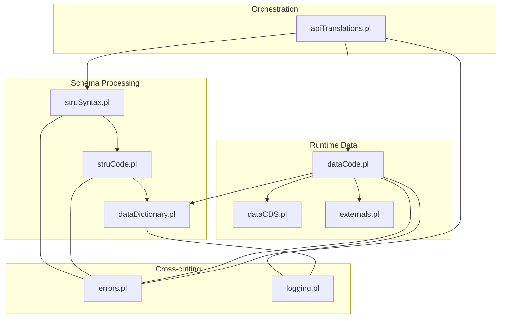

**Diagram sources**
- [struSyntax.pl:1-120](file://src/struSyntax.pl#L1-L120)
- [struCode.pl:1-120](file://src/struCode.pl#L1-L120)
- [dataDictionary.pl:1-120](file://src/dataDictionary.pl#L1-L120)
- [dataCode.pl:1-120](file://src/dataCode.pl#L1-L120)
- [dataCDS.pl:1-120](file://src/dataCDS.pl#L1-L120)
- [externals.pl:1-120](file://src/externals.pl#L1-L120)
- [apiTranslations.pl:1-120](file://src/apiTranslations.pl#L1-L120)
- [errors.pl:1-120](file://src/errors.pl#L1-L120)
- [logging.pl:1-120](file://src/logging.pl#L1-L120)

**Section sources**
- [struSyntax.pl:1-120](file://src/struSyntax.pl#L1-L120)
- [struCode.pl:1-120](file://src/struCode.pl#L1-L120)
- [dataDictionary.pl:1-120](file://src/dataDictionary.pl#L1-L120)
- [dataCode.pl:1-120](file://src/dataCode.pl#L1-L120)
- [dataCDS.pl:1-120](file://src/dataCDS.pl#L1-L120)
- [externals.pl:1-120](file://src/externals.pl#L1-L120)
- [apiTranslations.pl:1-120](file://src/apiTranslations.pl#L1-L120)
- [errors.pl:1-120](file://src/errors.pl#L1-L120)
- [logging.pl:1-120](file://src/logging.pl#L1-L120)

## Core Components
- Current Data Storage (CDS): Maintains the current group, path, elements, entries, and aspects during data processing. Provides getters/setters and helpers to build IDs and inspect ancestors.
- Data Dictionary: Stores schema definitions (groups, elements), containment relations, inheritance via fons/source, and default property propagation.
- Data Code: Orchestrates parsing callbacks (newGroup, newElement, endElement, storeCore), validates elements against the dictionary, updates CDS, constructs IDs, enforces constraints (e.g., certe), and flushes groups to storage.
- Syntax and Command Execution: Parses structure files, executes commands (nomino, pars, terminus), and populates the dictionary with defaults and inheritance.
- External API: Exposes current state and dictionary queries to exporters and semantic processors.
- Orchestration: Maps source files to structure files, initializes processing, and coordinates translation jobs.
- Errors and Logging: Centralized error/warning reporting with context; structured logging for diagnostics.

**Section sources**
- [dataCDS.pl:1-120](file://src/dataCDS.pl#L1-L120)
- [dataDictionary.pl:1-120](file://src/dataDictionary.pl#L1-L120)
- [dataCode.pl:1-120](file://src/dataCode.pl#L1-L120)
- [struSyntax.pl:1-120](file://src/struSyntax.pl#L1-L120)
- [struCode.pl:1-120](file://src/struCode.pl#L1-L120)
- [externals.pl:1-120](file://src/externals.pl#L1-L120)
- [apiTranslations.pl:1-120](file://src/apiTranslations.pl#L1-L120)
- [errors.pl:1-120](file://src/errors.pl#L1-L120)
- [logging.pl:1-120](file://src/logging.pl#L1-L120)

## Architecture Overview
The semantic analysis pipeline integrates schema loading, runtime data accumulation, and validation:

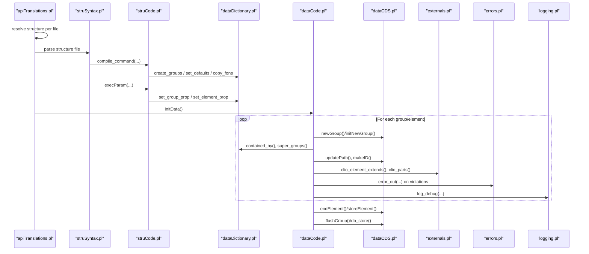

**Diagram sources**
- [apiTranslations.pl:440-484](file://src/apiTranslations.pl#L440-L484)
- [struSyntax.pl:48-120](file://src/struSyntax.pl#L48-L120)
- [struCode.pl:105-120](file://src/struCode.pl#L105-L120)
- [dataDictionary.pl:118-147](file://src/dataDictionary.pl#L118-L147)
- [dataCode.pl:115-152](file://src/dataCode.pl#L115-L152)
- [dataCDS.pl:153-214](file://src/dataCDS.pl#L153-L214)
- [externals.pl:124-151](file://src/externals.pl#L124-L151)
- [errors.pl:85-113](file://src/errors.pl#L85-L113)
- [logging.pl:98-113](file://src/logging.pl#L98-L113)

## Detailed Component Analysis

### Current Data Structure (CDS) Management
- Purpose: Holds the current group, its ID, ancestor path, element list, current element, entry lists (core/original/comment), and aspect pointer.
- Key operations:
  - Create/clean/reset: initialize empty state and counters.
  - Get/Set fields: typed accessors for all fields.
  - Aspect extraction: retrieve core/original/comment values, supporting multiple entries.
  - Ancestor and ID utilities: compute group ID from identification element or counter.
- Complexity: Most operations are O(1) except list scans for elements and aspects.

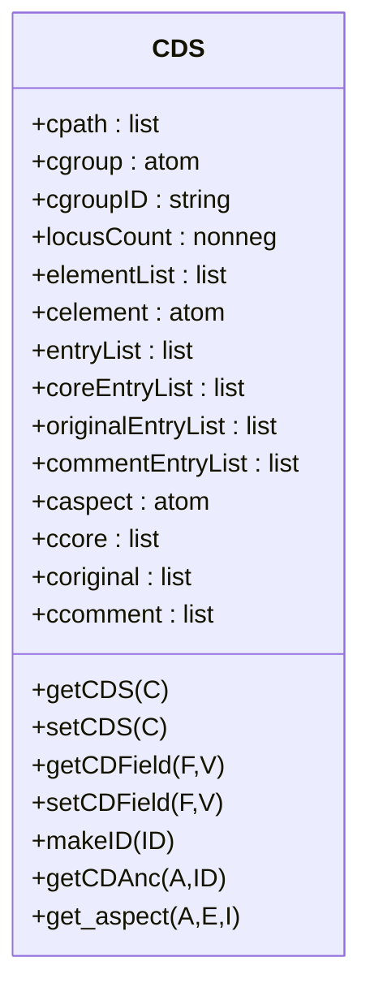

**Diagram sources**
- [dataCDS.pl:91-104](file://src/dataCDS.pl#L91-L104)
- [dataCDS.pl:153-214](file://src/dataCDS.pl#L153-L214)
- [dataCDS.pl:307-328](file://src/dataCDS.pl#L307-L328)
- [dataCDS.pl:368-405](file://src/dataCDS.pl#L368-L405)
- [dataCDS.pl:450-498](file://src/dataCDS.pl#L450-L498)

**Section sources**
- [dataCDS.pl:153-214](file://src/dataCDS.pl#L153-L214)
- [dataCDS.pl:307-328](file://src/dataCDS.pl#L307-L328)
- [dataCDS.pl:368-405](file://src/dataCDS.pl#L368-L405)
- [dataCDS.pl:450-498](file://src/dataCDS.pl#L450-L498)

### Group Hierarchy Processing and Path Resolution
- Containment and inheritance:
  - Direct containment via pars/semper/solum/repetitio properties.
  - Super-group traversal via fons/source; cached results avoid repeated computation.
- Path update algorithm:
  - Prefer direct containment with current group.
  - If not found, search ancestors in reverse path order.
  - Support base-class matching for flexible linkage.
  - Detect recursion to prevent infinite loops.
- ID generation:
  - Use identification element if present and single-valued.
  - Otherwise use signum prefix plus incrementing counter.

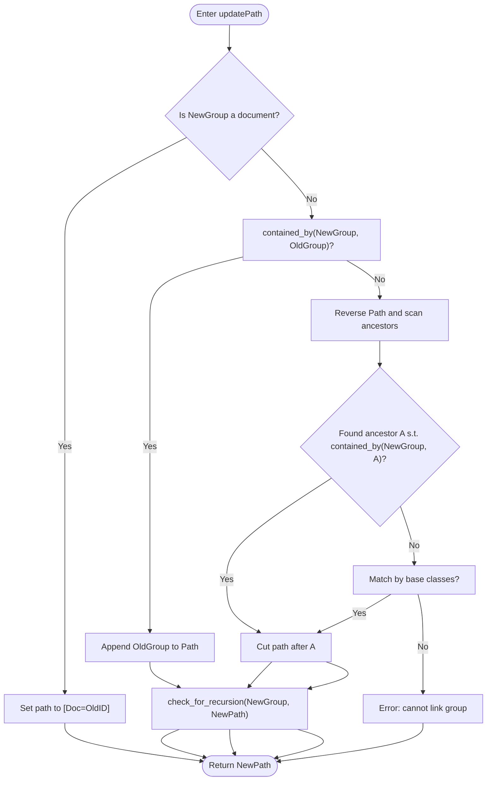

**Diagram sources**
- [dataCode.pl:217-281](file://src/dataCode.pl#L217-L281)
- [dataDictionary.pl:184-261](file://src/dataDictionary.pl#L184-L261)

**Section sources**
- [dataCode.pl:217-281](file://src/dataCode.pl#L217-L281)
- [dataDictionary.pl:184-261](file://src/dataDictionary.pl#L184-L261)

### Element Validation Against Dictionary Definitions
- Element existence:
  - Must be declared in the group’s locus/ceteri/certe lists.
  - Specialization allowed: an element extending a base element is accepted if the base is valid in the group.
- Implicit naming:
  - If no explicit element name is given, the next position in the group’s locus list is used.
- Constraint enforcement:
  - At group end, check that all certe elements are present; otherwise report missing elements.

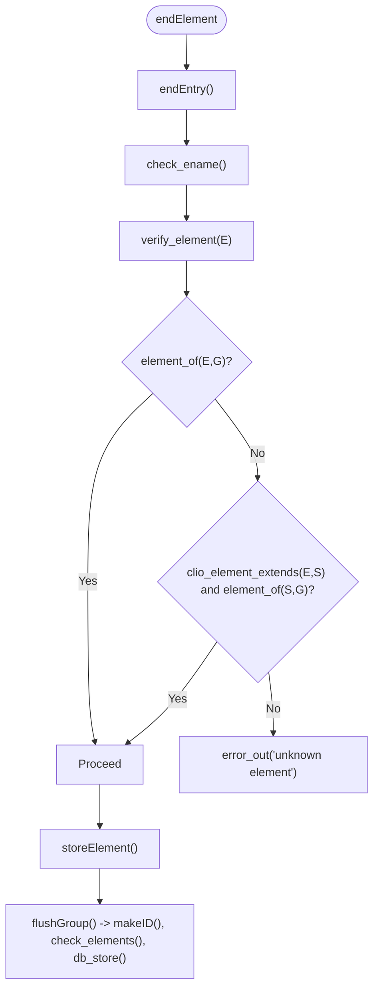

**Diagram sources**
- [dataCode.pl:340-404](file://src/dataCode.pl#L340-L404)
- [dataCode.pl:308-321](file://src/dataCode.pl#L308-L321)
- [dataCode.pl:154-168](file://src/dataCode.pl#L154-L168)
- [dataDictionary.pl:289-308](file://src/dataDictionary.pl#L289-L308)
- [externals.pl:140-151](file://src/externals.pl#L140-L151)

**Section sources**
- [dataCode.pl:340-404](file://src/dataCode.pl#L340-L404)
- [dataCode.pl:308-321](file://src/dataCode.pl#L308-L321)
- [dataCode.pl:154-168](file://src/dataCode.pl#L154-L168)
- [dataDictionary.pl:289-308](file://src/dataDictionary.pl#L289-L308)
- [externals.pl:140-151](file://src/externals.pl#L140-L151)

### Context-Aware Normalization Rules
- Aspects:
  - Core, original, comment aspects are tracked separately; multi-entry support wraps lists in a mult structure when needed.
- Leading/trailing whitespace:
  - Entry text is trimmed before finalizing entries.
- Locus-driven ordering:
  - When implicit element names are used, the locus count ensures correct positional assignment.

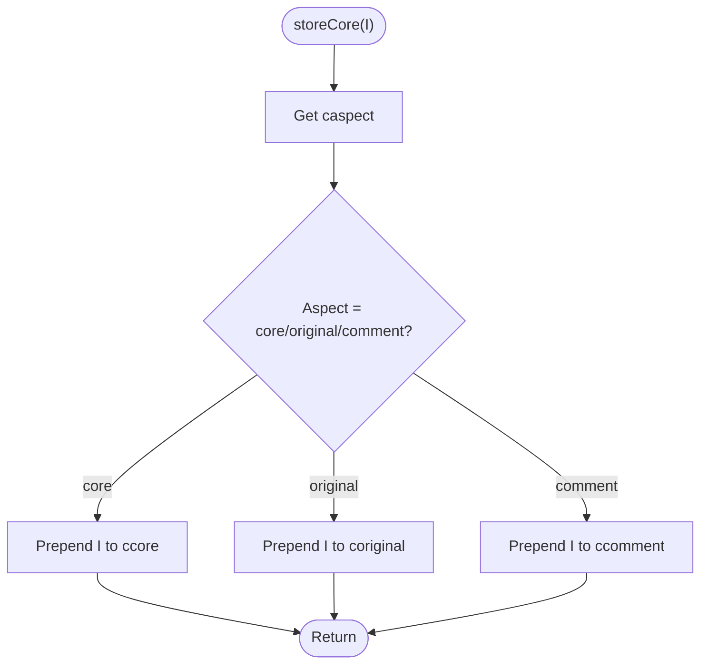

**Diagram sources**
- [dataCode.pl:475-488](file://src/dataCode.pl#L475-L488)
- [dataCDS.pl:390-405](file://src/dataCDS.pl#L390-L405)

**Section sources**
- [dataCode.pl:475-488](file://src/dataCode.pl#L475-L488)
- [dataCDS.pl:390-405](file://src/dataCDS.pl#L390-L405)

### Entity Linking Mechanisms and Relationship Establishment
- Same-as links:
  - Exporters can detect specializations of same_as elements and generate relation records linking current group to referenced external IDs.
- Base element lookup:
  - The external API provides clio_belement_aspect to find expected semantics even when source uses specialized element names.

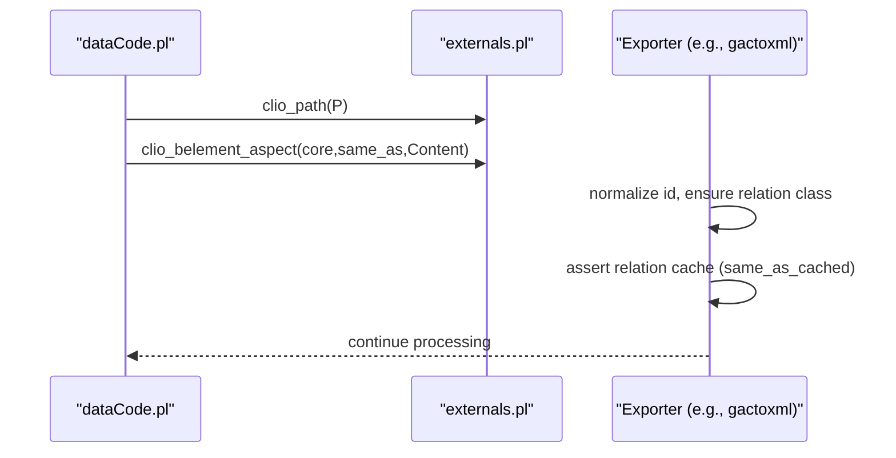

**Diagram sources**
- [externals.pl:184-197](file://src/externals.pl#L184-L197)
- [gactoxml.pl:849-869](file://src/gactoxml.pl#L849-L869)

**Section sources**
- [externals.pl:184-197](file://src/externals.pl#L184-L197)
- [gactoxml.pl:849-869](file://src/gactoxml.pl#L849-L869)

### Inheritance Handling (Groups and Elements)
- Groups:
  - fons/source defines superclass; copy_fons_g propagates properties from source group to current group.
  - Generic groups allow prefix/suffix-based property inheritance (not commonly used).
- Elements:
  - fons/source allows element specialization; copy_fons_e copies properties from source element.
- Topological ordering:
  - Utility to traverse and sort hierarchies for consistent processing.

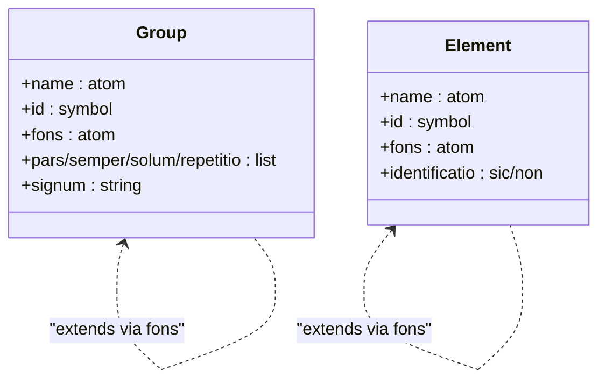

**Diagram sources**
- [struCode.pl:218-226](file://src/struCode.pl#L218-L226)
- [dataDictionary.pl:624-645](file://src/dataDictionary.pl#L624-L645)
- [dataDictionary.pl:665-686](file://src/dataDictionary.pl#L665-L686)

**Section sources**
- [struCode.pl:218-226](file://src/struCode.pl#L218-L226)
- [dataDictionary.pl:624-645](file://src/dataDictionary.pl#L624-L645)
- [dataDictionary.pl:665-686](file://src/dataDictionary.pl#L665-L686)

### Constraint Checking and Semantic Validation Rules
- Required elements (certe):
  - Enforced at group closure; missing elements produce detailed errors.
- Identification uniqueness:
  - Identification elements must be single-valued; multiple entries cause errors.
- Recursion prevention:
  - Path update detects cycles and aborts invalid nesting.

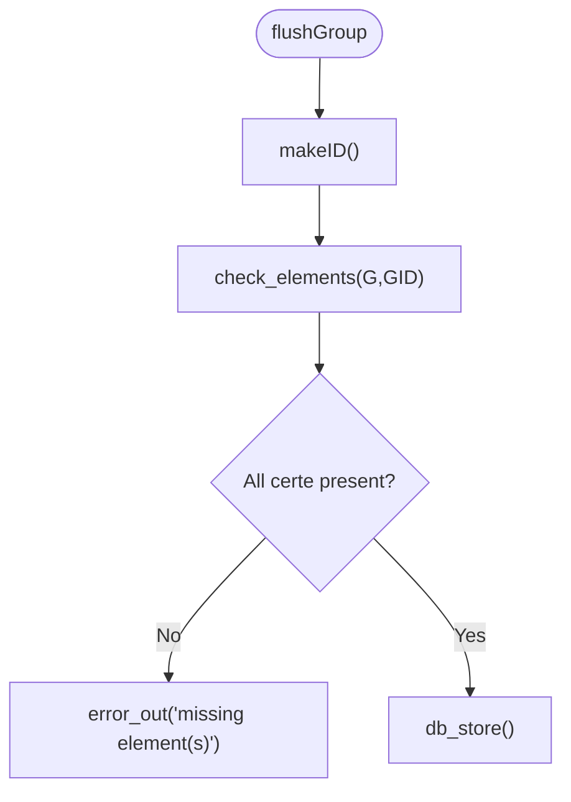

**Diagram sources**
- [dataCode.pl:140-168](file://src/dataCode.pl#L140-L168)
- [dataCode.pl:275-281](file://src/dataCode.pl#L275-L281)
- [dataCDS.pl:481-488](file://src/dataCDS.pl#L481-L488)

**Section sources**
- [dataCode.pl:140-168](file://src/dataCode.pl#L140-L168)
- [dataCode.pl:275-281](file://src/dataCode.pl#L275-L281)
- [dataCDS.pl:481-488](file://src/dataCDS.pl#L481-L488)

### Path Resolution Algorithm for Nested Groups
- Decision points:
  - Is the new group a document?
  - Is it directly contained by the previous group?
  - Does it match any ancestor in the current path?
  - Does it match by base class?
- Outcome:
  - Construct longest possible path without cycles.

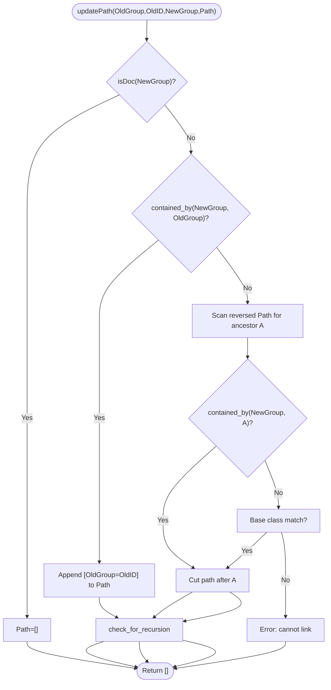

**Diagram sources**
- [dataCode.pl:217-281](file://src/dataCode.pl#L217-L281)
- [dataDictionary.pl:184-261](file://src/dataDictionary.pl#L184-L261)

**Section sources**
- [dataCode.pl:217-281](file://src/dataCode.pl#L217-L281)
- [dataDictionary.pl:184-261](file://src/dataDictionary.pl#L184-L261)

## Dependency Analysis
Key dependencies among semantic components:

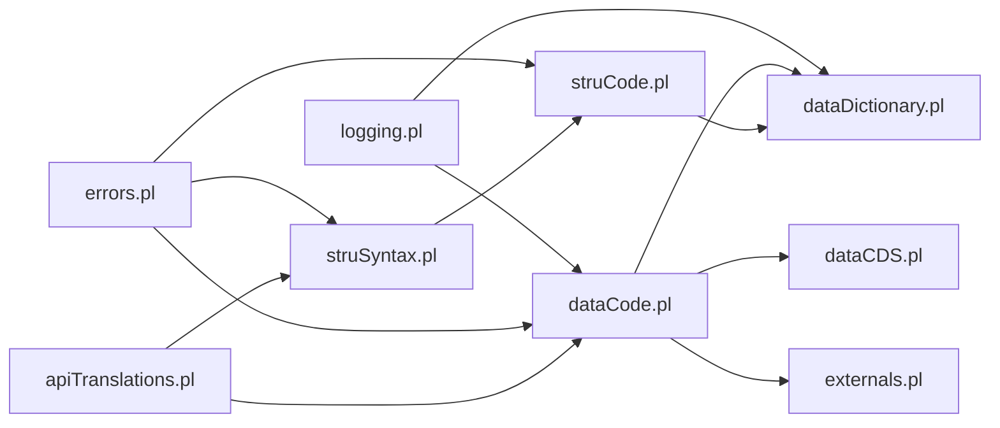

**Diagram sources**
- [struSyntax.pl:1-120](file://src/struSyntax.pl#L1-L120)
- [struCode.pl:1-120](file://src/struCode.pl#L1-L120)
- [dataDictionary.pl:1-120](file://src/dataDictionary.pl#L1-L120)
- [dataCode.pl:1-120](file://src/dataCode.pl#L1-L120)
- [dataCDS.pl:1-120](file://src/dataCDS.pl#L1-L120)
- [externals.pl:1-120](file://src/externals.pl#L1-L120)
- [apiTranslations.pl:1-120](file://src/apiTranslations.pl#L1-L120)
- [errors.pl:1-120](file://src/errors.pl#L1-L120)
- [logging.pl:1-120](file://src/logging.pl#L1-L120)

**Section sources**
- [struSyntax.pl:1-120](file://src/struSyntax.pl#L1-L120)
- [struCode.pl:1-120](file://src/struCode.pl#L1-L120)
- [dataDictionary.pl:1-120](file://src/dataDictionary.pl#L1-L120)
- [dataCode.pl:1-120](file://src/dataCode.pl#L1-L120)
- [dataCDS.pl:1-120](file://src/dataCDS.pl#L1-L120)
- [externals.pl:1-120](file://src/externals.pl#L1-L120)
- [apiTranslations.pl:1-120](file://src/apiTranslations.pl#L1-L120)
- [errors.pl:1-120](file://src/errors.pl#L1-L120)
- [logging.pl:1-120](file://src/logging.pl#L1-L120)

## Performance Considerations
- Containment caching:
  - Cache positive and negative containment results to reduce repeated graph traversals.
- Record-based CDS:
  - Use record variants for faster field access and reduced term copying.
- Efficient list operations:
  - Prepend entries to lists and reverse once at endEntry to minimize overhead.
- Mutexed initialization:
  - Protect structure and data initialization with mutexes to avoid redundant work in concurrent environments.
- Logging level control:
  - Adjust log levels to reduce overhead in production runs.

[No sources needed since this section provides general guidance]

## Troubleshooting Guide
- Common semantic errors:
  - Unknown element in group: verify element declaration or inheritance.
  - Missing required elements (certe): ensure all required fields are present before group closure.
  - Multiple entries in identification element: ensure single-valued identification.
  - Recursive group nesting: fix hierarchy to avoid cycles.
- Debugging techniques:
  - Enable debug logging to trace path updates and containment checks.
  - Inspect CDS state using showCDS-like routines to visualize current group and entries.
  - Review error reports with line context for precise localization.

**Section sources**
- [dataCode.pl:308-321](file://src/dataCode.pl#L308-L321)
- [dataCode.pl:154-168](file://src/dataCode.pl#L154-L168)
- [dataCDS.pl:506-516](file://src/dataCDS.pl#L506-L516)
- [errors.pl:85-113](file://src/errors.pl#L85-L113)
- [logging.pl:98-113](file://src/logging.pl#L98-L113)

## Conclusion
The semantic analysis phase integrates schema-driven validation, context-aware normalization, and robust hierarchy management. Through careful CDS design, efficient containment checks, and clear error reporting, the system supports complex hierarchical structures while maintaining performance and debuggability. Proper use of inheritance, identification rules, and relationship establishment enables rich semantic modeling across diverse source documents.