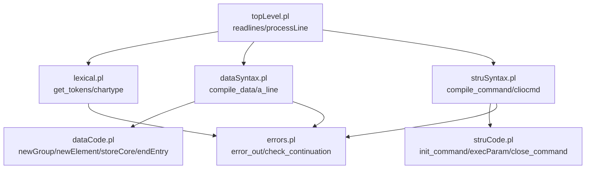
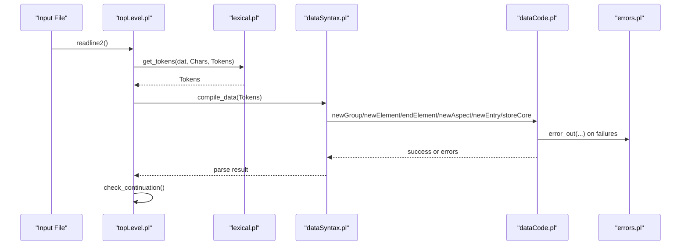
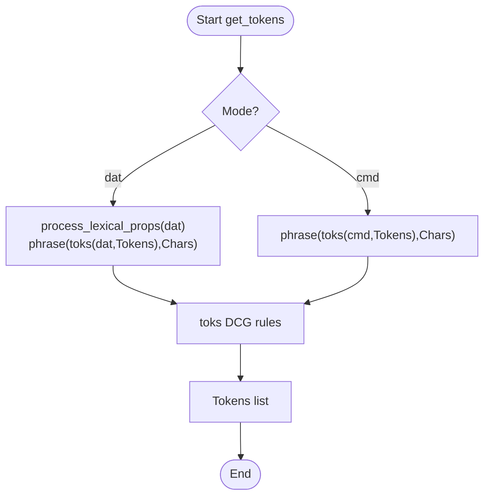
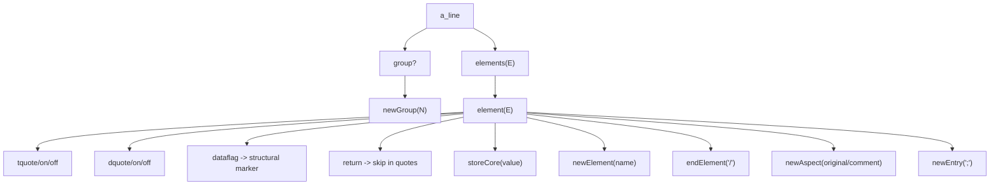
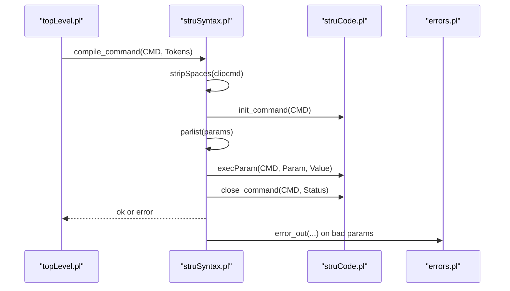
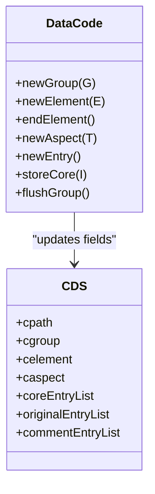
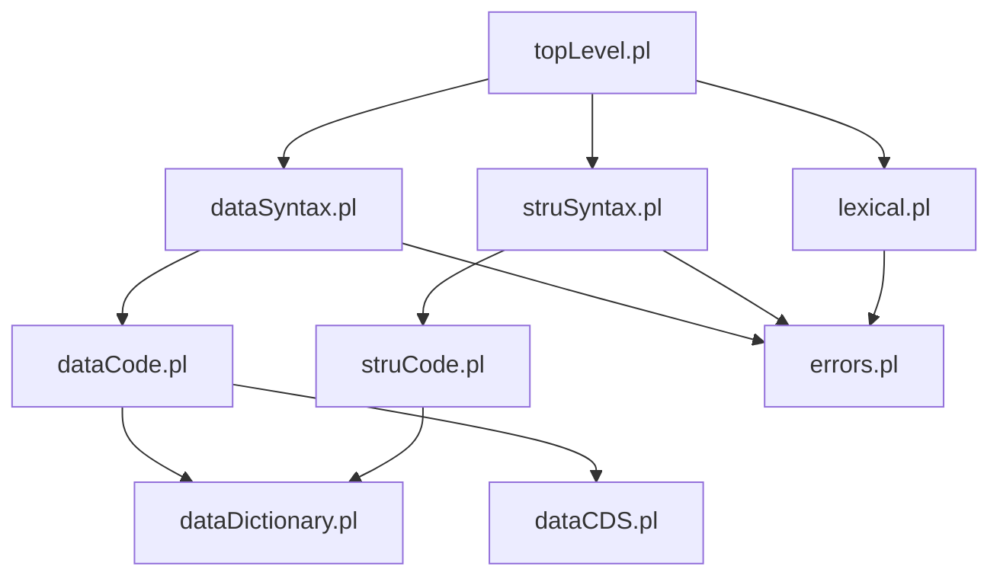

# Syntax Processing

<cite>
**Referenced Files in This Document**
- [lexical.pl](file://src/lexical.pl)
- [dataSyntax.pl](file://src/dataSyntax.pl)
- [struSyntax.pl](file://src/struSyntax.pl)
- [dataCode.pl](file://src/dataCode.pl)
- [struCode.pl](file://src/struCode.pl)
- [topLevel.pl](file://src/topLevel.pl)
- [errors.pl](file://src/errors.pl)
- [kleio_data.ebnf](file://syntax/kleio_data.ebnf)
- [kleio_parser.py](file://syntax/python/kleio_parser.py)
</cite>

## Table of Contents
1. [Introduction](#introduction)
2. [Project Structure](#project-structure)
3. [Core Components](#core-components)
4. [Architecture Overview](#architecture-overview)
5. [Detailed Component Analysis](#detailed-component-analysis)
6. [Dependency Analysis](#dependency-analysis)
7. [Performance Considerations](#performance-considerations)
8. [Troubleshooting Guide](#troubleshooting-guide)
9. [Conclusion](#conclusion)
10. [Appendices](#appendices)

## Introduction
This document explains the Kleio syntax processing pipeline with a focus on:
- Lexical analysis that tokenizes input text for both data and command files
- Syntactic parsing that validates structure against grammar rules
- Token management and state handling during parsing
- Handling of Kleio constructs: groups, elements, aspects (core/original/comment), and entries
- Error detection, recovery mechanisms, and debugging techniques
- Examples of valid and invalid patterns, common issues, and troubleshooting strategies
- Performance considerations for large documents and memory management during parsing

The implementation is primarily in Prolog with an additional Python SAX-like parser reference.

## Project Structure
The syntax processing pipeline spans several modules:
- Top-level orchestration reads lines and dispatches to lexical and syntactic phases
- Lexical analyzer produces tokens from character streams
- Data file parser builds a Current Data Structure (CDS) and emits actions to store data
- Structure file parser validates and executes commands to build schema definitions
- Error reporting centralizes diagnostics and continuation control
- EBNF grammar defines the Kleio notation; a Python parser provides a SAX-style alternative

**Diagram sources**
- [topLevel.pl:168-289](file://src/topLevel.pl#L168-L289)
- [lexical.pl:27-122](file://src/lexical.pl#L27-L122)
- [dataSyntax.pl:38-126](file://src/dataSyntax.pl#L38-L126)
- [struSyntax.pl:48-120](file://src/struSyntax.pl#L48-L120)
- [dataCode.pl:115-170](file://src/dataCode.pl#L115-L170)
- [struCode.pl:91-146](file://src/struCode.pl#L91-L146)
- [errors.pl:77-198](file://src/errors.pl#L77-L198)

**Section sources**
- [topLevel.pl:168-289](file://src/topLevel.pl#L168-L289)
- [lexical.pl:27-122](file://src/lexical.pl#L27-L122)
- [dataSyntax.pl:38-126](file://src/dataSyntax.pl#L38-L126)
- [struSyntax.pl:48-120](file://src/struSyntax.pl#L48-L120)
- [dataCode.pl:115-170](file://src/dataCode.pl#L115-L170)
- [struCode.pl:91-146](file://src/struCode.pl#L91-L146)
- [errors.pl:77-198](file://src/errors.pl#L77-L198)

## Core Components
- Lexical Analyzer (lexical.pl): Converts character lists into tokens for data and command modes, supports configurable data flags, quoted strings, triple-quoted multiline strings, numbers, names, and special characters.
- Data Syntax Parser (dataSyntax.pl): Parses tokenized data lines into semantic actions (newGroup, newElement, endElement, newAspect, newEntry, storeCore). Handles quoting and multiline content.
- Structure Syntax Parser (struSyntax.pl): Parses structure definition commands, validates parameters, and triggers execution via struCode.pl.
- Data Execution Layer (dataCode.pl): Manages CDS state, group path updates, element validation, entry/aspects accumulation, and persistence calls.
- Structure Execution Layer (struCode.pl): Initializes/closes commands, sets defaults, executes parameter handlers, and persists structure definitions.
- Error Reporting (errors.pl): Centralized error/warning output with context, counters, and max-error abort control.
- Orchestration (topLevel.pl): Reads lines, invokes lexical and syntactic phases, manages multi-line commands, and coordinates initialization/finalization.

**Section sources**
- [lexical.pl:27-122](file://src/lexical.pl#L27-L122)
- [dataSyntax.pl:38-126](file://src/dataSyntax.pl#L38-L126)
- [struSyntax.pl:48-120](file://src/struSyntax.pl#L48-L120)
- [dataCode.pl:115-170](file://src/dataCode.pl#L115-L170)
- [struCode.pl:91-146](file://src/struCode.pl#L91-L146)
- [errors.pl:77-198](file://src/errors.pl#L77-L198)
- [topLevel.pl:168-289](file://src/topLevel.pl#L168-L289)

## Architecture Overview
The pipeline follows a classic lexer/parser architecture with immediate execution semantics:
- Input is read line-by-line
- Each line is tokenized by the lexer
- Tokens are parsed by either the data or structure parser
- Parsing triggers action predicates that update internal state and persist results

**Diagram sources**
- [topLevel.pl:272-289](file://src/topLevel.pl#L272-L289)
- [lexical.pl:42-58](file://src/lexical.pl#L42-L58)
- [dataSyntax.pl:54-66](file://src/dataSyntax.pl#L54-L66)
- [dataCode.pl:115-170](file://src/dataCode.pl#L115-L170)
- [errors.pl:77-198](file://src/errors.pl#L77-L198)

## Detailed Component Analysis

### Lexical Analysis Phase
Responsibilities:
- Classify characters into types (letters, digits, spaces, tabs, quotes, operators)
- Produce tokens for data mode (dat) and command mode (cmd)
- Support dynamic data flags (e.g., semicolon vs pipe as multiple-value separator)
- Handle single-quoted strings in command mode and triple-quoted multiline strings in data mode

Key behaviors:
- get_tokens/dat/cmd dispatch based on file type
- toks DCG grammar drives tokenization
- data_flag mapping allows customizing delimiter characters
- dquote/tquote handle quote boundaries and escapes

**Diagram sources**
- [lexical.pl:42-58](file://src/lexical.pl#L42-L58)
- [lexical.pl:95-122](file://src/lexical.pl#L95-L122)

**Section sources**
- [lexical.pl:27-122](file://src/lexical.pl#L27-L122)
- [lexical.pl:238-333](file://src/lexical.pl#L238-L333)

### Syntactic Parsing: Data Files
Responsibilities:
- Parse a line of tokens into semantic actions
- Manage quoting states (double-quote and triple-quote)
- Recognize groups, elements, aspects, entries, and values
- Accumulate core/original/comment aspects and entries

Grammar highlights:
- a_line matches optional group followed by one or more elements
- element handles tquote/dquote, dataflags, returns, fill, names, numbers, dqstring
- dataflag tokens map to structural markers ($, /, =, #, %, |, ;, :)

**Diagram sources**
- [dataSyntax.pl:65-126](file://src/dataSyntax.pl#L65-L126)

**Section sources**
- [dataSyntax.pl:38-126](file://src/dataSyntax.pl#L38-L126)

### Syntactic Parsing: Structure Files
Responsibilities:
- Parse structure commands (nomino, pars, terminus, exitus)
- Validate parameters and execute side effects
- Support inline documentation directives
- Map English keywords to Latin equivalents

Key behaviors:
- cliocmd recognizes command and parameters
- param/equal/val parse key=value pairs
- execParam delegates to struCode for action
- engkw maps English to canonical keywords

**Diagram sources**
- [struSyntax.pl:48-120](file://src/struSyntax.pl#L48-L120)
- [struSyntax.pl:291-416](file://src/struSyntax.pl#L291-L416)
- [struCode.pl:91-146](file://src/struCode.pl#L91-L146)
- [errors.pl:77-198](file://src/errors.pl#L77-L198)

**Section sources**
- [struSyntax.pl:48-120](file://src/struSyntax.pl#L48-L120)
- [struSyntax.pl:291-416](file://src/struSyntax.pl#L291-L416)
- [struCode.pl:91-146](file://src/struCode.pl#L91-L146)

### Token Management System
Responsibilities:
- Maintain current group path and identifiers
- Track current element name and aspect
- Accumulate entries per aspect
- Flush and persist group data when complete

Key structures and flows:
- CDS fields: cpath, cgroup, celement, caspect, core/original/comment entry lists
- newGroup updates path and resets counters
- newElement verifies element validity within group
- endElement resolves implicit element names using locus order
- newAspect switches active aspect
- newEntry finalizes current entry for the active aspect
- storeCore appends value to current aspect’s entry list

**Diagram sources**
- [dataCode.pl:175-203](file://src/dataCode.pl#L175-L203)
- [dataCode.pl:298-321](file://src/dataCode.pl#L298-L321)
- [dataCode.pl:340-401](file://src/dataCode.pl#L340-L401)
- [dataCode.pl:411-451](file://src/dataCode.pl#L411-L451)
- [dataCode.pl:466-488](file://src/dataCode.pl#L466-L488)

**Section sources**
- [dataCode.pl:175-203](file://src/dataCode.pl#L175-L203)
- [dataCode.pl:298-321](file://src/dataCode.pl#L298-L321)
- [dataCode.pl:340-401](file://src/dataCode.pl#L340-L401)
- [dataCode.pl:411-451](file://src/dataCode.pl#L411-L451)
- [dataCode.pl:466-488](file://src/dataCode.pl#L466-L488)

### Handling Kleio Constructs
Groups:
- Declared with a name optionally followed by $ and positional/named elements on the same line
- Group path updated and validated; recursion checks prevent cycles

Elements:
- Named elements use name=value; positional elements provide values in locus order
- Element names validated against group definition and inheritance

Aspects:
- Core aspect is default; original marked by %; comment marked by #
- Aspects accumulate separate entry lists

Entries:
- Multiple values separated by configured dataflag (default semicolon)
- Entries finalized at end of element or when switching aspects

Quoting:
- Double quotes preserve literal content including whitespace and returns
- Triple quotes support multiline blocks

**Section sources**
- [dataSyntax.pl:65-126](file://src/dataSyntax.pl#L65-L126)
- [dataCode.pl:115-170](file://src/dataCode.pl#L115-L170)
- [dataCode.pl:298-321](file://src/dataCode.pl#L298-L321)
- [dataCode.pl:340-401](file://src/dataCode.pl#L340-L401)
- [dataCode.pl:411-451](file://src/dataCode.pl#L411-L451)
- [dataCode.pl:466-488](file://src/dataCode.pl#L466-L488)

### Error Detection and Recovery
Error reporting:
- Centralized via errors.pl with context (file, line number, line text, previous line)
- Counts errors and warnings; aborts translation after max_errors threshold

Recovery mechanisms:
- Data parser continues accumulating until end of element/group
- Structure parser reports bad parameters but proceeds if possible
- Multi-line command caching allows completion across lines

Common error scenarios:
- Unknown element in group
- Missing required parameters in structure commands
- Mismatched quotes or unexpected tokens
- Invalid group nesting or recursion

**Section sources**
- [errors.pl:77-198](file://src/errors.pl#L77-L198)
- [dataCode.pl:154-168](file://src/dataCode.pl#L154-L168)
- [struSyntax.pl:114-120](file://src/struSyntax.pl#L114-L120)
- [topLevel.pl:212-216](file://src/topLevel.pl#L212-L216)

### Debugging Techniques
- Use test utilities in lexical.pl to classify characters and tokenize sample inputs
- Enable echo mode to print each processed line
- Inspect CDS fields during parsing to verify state transitions
- Review error messages which include near lines for context

**Section sources**
- [lexical.pl:345-363](file://src/lexical.pl#L345-L363)
- [topLevel.pl:223-226](file://src/topLevel.pl#L223-L226)
- [errors.pl:135-167](file://src/errors.pl#L135-L167)

### Valid and Invalid Patterns
Valid patterns:
- Group declaration with positional elements: name$ val1/val2/val3
- Named elements with aspects: name=core_value%original_value#comment_value
- Multiline strings: """ ... """
- Multiple values: name=val1;val2;val3

Invalid patterns:
- Unknown element name not defined in group
- Missing required parameters in structure commands
- Unclosed quotes or mismatched delimiters
- Recursive group nesting causing path linking failure

Examples can be constructed using the EBNF grammar and tested via the Python parser or Prolog tests.

**Section sources**
- [kleio_data.ebnf:1-62](file://syntax/kleio_data.ebnf#L1-L62)
- [kleio_parser.py:466-477](file://syntax/python/kleio_parser.py#L466-L477)

## Dependency Analysis
High-level dependencies:
- topLevel depends on lexical, dataSyntax, struSyntax, dataCode, struCode, errors
- dataSyntax depends on lexical and dataCode
- struSyntax depends on lexical, dataSyntax, struCode, errors
- dataCode depends on dataDictionary, dataCDS, errors, gactoxml, persistence
- struCode depends on dataDictionary, persistence, utilities, basicio, errors

Potential circularities:
- None detected among core parsing modules; cross-module calls are unidirectional from parsers to execution layers

External integration points:
- Persistence layer for token database and structure metadata
- Reports module for structured output
- Logging utilities for debug traces

**Diagram sources**
- [topLevel.pl:34-57](file://src/topLevel.pl#L34-L57)
- [dataSyntax.pl:24-28](file://src/dataSyntax.pl#L24-L28)
- [struSyntax.pl:37-42](file://src/struSyntax.pl#L37-L42)
- [dataCode.pl:39-47](file://src/dataCode.pl#L39-L47)
- [struCode.pl:49-55](file://src/struCode.pl#L49-L55)

**Section sources**
- [topLevel.pl:34-57](file://src/topLevel.pl#L34-L57)
- [dataSyntax.pl:24-28](file://src/dataSyntax.pl#L24-L28)
- [struSyntax.pl:37-42](file://src/struSyntax.pl#L37-L42)
- [dataCode.pl:39-47](file://src/dataCode.pl#L39-L47)
- [struCode.pl:49-55](file://src/struCode.pl#L49-L55)

## Performance Considerations
- Line-by-line processing minimizes memory footprint for large documents
- CDS accumulates entries per aspect and flushes at group boundaries, reducing persistent writes
- Data flag configuration avoids repeated lookups by setting df8 once per file
- Quoted string handling uses incremental concatenation; consider avoiding excessively large triple-quoted blocks
- Error counting and early abort prevent wasted work after too many errors
- For structure files, command caching supports multi-line commands without re-parsing

Recommendations:
- Keep triple-quoted strings reasonably sized
- Prefer named elements over deep positional chains for clarity and performance
- Configure data flags appropriately to reduce ambiguity
- Monitor error counts and fix root causes early to avoid cascading failures

[No sources needed since this section provides general guidance]

## Troubleshooting Guide
Common issues and strategies:
- Unknown element: Verify element exists in group definition or inherits correctly
- Missing parameters: Ensure required parameters are present for structure commands
- Quote problems: Check for balanced quotes and proper escaping
- Recursion errors: Avoid self-referencing group paths
- Max errors reached: Reduce error count by fixing top-level issues first

Debug steps:
- Use lexical test utilities to validate tokenization
- Enable echo mode to trace processed lines
- Inspect error messages for near lines context
- Validate group hierarchy and element ordering

**Section sources**
- [errors.pl:77-198](file://src/errors.pl#L77-L198)
- [dataCode.pl:154-168](file://src/dataCode.pl#L154-L168)
- [struSyntax.pl:114-120](file://src/struSyntax.pl#L114-L120)
- [lexical.pl:345-363](file://src/lexical.pl#L345-L363)
- [topLevel.pl:223-226](file://src/topLevel.pl#L223-L226)

## Conclusion
The Kleio syntax processing pipeline combines a robust lexer with two specialized parsers for data and structure files. It maintains clear separation between tokenization, parsing, and execution, while providing comprehensive error reporting and recovery. The design supports flexible quoting, configurable delimiters, and efficient streaming of large documents. By understanding the components and their interactions, users can diagnose issues effectively and optimize performance for complex datasets.

[No sources needed since this section summarizes without analyzing specific files]

## Appendices

### EBNF Grammar Reference
The Kleio notation grammar defines document structure, groups, elements, values, aspects, and separators. It serves as the authoritative specification for valid syntax.

**Section sources**
- [kleio_data.ebnf:1-62](file://syntax/kleio_data.ebnf#L1-L62)

### Python SAX-like Parser
A Python implementation demonstrates event-driven parsing aligned with the EBNF grammar. It can be used to prototype handlers and validate behavior before integrating with the Prolog pipeline.

**Section sources**
- [kleio_parser.py:1-477](file://syntax/python/kleio_parser.py#L1-L477)