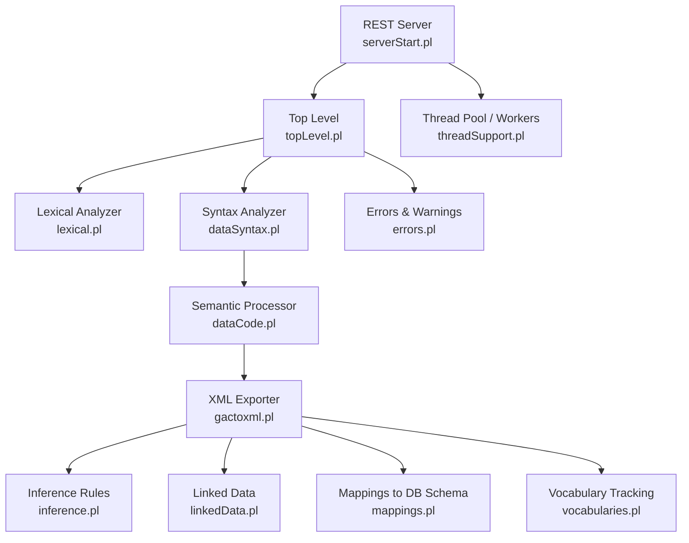
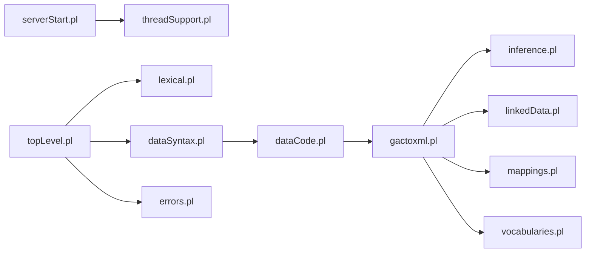

# Translation Engine

<cite>
**Referenced Files in This Document**
- [README.md](file://README.md)
- [README_KLEIO_NOTATION.md](file://README_KLEIO_NOTATION.md)
- [topLevel.pl](file://src/topLevel.pl)
- [lexical.pl](file://src/lexical.pl)
- [dataSyntax.pl](file://src/dataSyntax.pl)
- [dataCode.pl](file://src/dataCode.pl)
- [gactoxml.pl](file://src/gactoxml.pl)
- [inference.pl](file://src/inference.pl)
- [linkedData.pl](file://src/linkedData.pl)
- [errors.pl](file://src/errors.pl)
- [serverStart.pl](file://src/serverStart.pl)
- [threadSupport.pl](file://src/threadSupport.pl)
- [mappings.pl](file://src/mappings.pl)
- [vocabularies.pl](file://src/vocabularies.pl)
</cite>

## Table of Contents
1. [Introduction](#introduction)
2. [Project Structure](#project-structure)
3. [Core Components](#core-components)
4. [Architecture Overview](#architecture-overview)
5. [Detailed Component Analysis](#detailed-component-analysis)
6. [Dependency Analysis](#dependency-analysis)
7. [Performance Considerations](#performance-considerations)
8. [Troubleshooting Guide](#troubleshooting-guide)
9. [Conclusion](#conclusion)
10. [Appendices](#appendices)

## Introduction
This document explains the Kleio translation engine that converts Kleio notation files into normalized data and XML for Timelink. It covers the full pipeline from lexical analysis through syntax parsing, semantic processing, normalization, context-aware inference, linked data integration, and XML generation. It also documents error handling, warnings, debugging techniques, performance optimization, parallel processing, custom mappings, vocabulary management, extension points, and the relationship between Kleio notation and Timelink database schema mapping.

## Project Structure
The translation engine is implemented in SWI-Prolog with a modular architecture:
- Top-level orchestration and file I/O
- Lexical analyzer (tokenizer)
- Syntax analyzer (parser)
- Semantic processor (group/element handling, validation, path resolution)
- Exporter to XML and auxiliary outputs
- Inference rules for automatic relations and attributes
- Linked data annotation support
- Error/warning reporting
- REST server entry point and worker pool for parallel processing
- Mappings to Timelink database classes and tables
- Vocabulary tracking utilities



**Diagram sources**
- [serverStart.pl](file://src/serverStart.pl)
- [topLevel.pl](file://src/topLevel.pl)
- [lexical.pl](file://src/lexical.pl)
- [dataSyntax.pl](file://src/dataSyntax.pl)
- [dataCode.pl](file://src/dataCode.pl)
- [gactoxml.pl](file://src/gactoxml.pl)
- [inference.pl](file://src/inference.pl)
- [linkedData.pl](file://src/linkedData.pl)
- [mappings.pl](file://src/mappings.pl)
- [threadSupport.pl](file://src/threadSupport.pl)
- [vocabularies.pl](file://src/vocabularies.pl)

**Section sources**
- [README.md](file://README.md)
- [README_KLEIO_NOTATION.md](file://README_KLEIO_NOTATION.md)

## Core Components
- Top-level driver: initializes environment, reads files line-by-line, dispatches tokens to parser, and coordinates lifecycle hooks for export modules.
- Lexical analyzer: tokenizes input according to Kleio special characters and configurable multi-entry separator; supports quoted strings and triple-quoted multiline blocks.
- Syntax analyzer: parses tokens into structured events (new group, new element, aspects, entries), accumulates element data per group, and flushes groups at boundaries.
- Semantic processor: validates elements against structure definitions, resolves implicit positional elements, maintains group hierarchy paths, and stores intermediate data structures.
- XML exporter: transforms processed groups into XML, applies linked data annotations, generates IDs, writes pretty-printed intermediates, and finalizes output.
- Inference engine: declarative rules derive relations and attributes based on group context and patterns.
- Linked data module: recognizes link declarations and inline annotations to produce external URIs.
- Error reporting: centralized error and warning logging with line context and counts.
- Parallel execution: thread pool or message queue workers execute translations concurrently.
- Mappings: declarative mapping from Kleio groups/classes to Timelink database tables and columns.
- Vocabularies: tracks attribute and relation value vocabularies for validation and reporting.

**Section sources**
- [topLevel.pl](file://src/topLevel.pl)
- [lexical.pl](file://src/lexical.pl)
- [dataSyntax.pl](file://src/dataSyntax.pl)
- [dataCode.pl](file://src/dataCode.pl)
- [gactoxml.pl](file://src/gactoxml.pl)
- [inference.pl](file://src/inference.pl)
- [linkedData.pl](file://src/linkedData.pl)
- [errors.pl](file://src/errors.pl)
- [threadSupport.pl](file://src/threadSupport.pl)
- [mappings.pl](file://src/mappings.pl)
- [vocabularies.pl](file://src/vocabularies.pl)

## Architecture Overview
The translation pipeline follows a classic compiler-like flow:
- Input files are read line by line.
- Each line is tokenized by the lexical analyzer.
- Tokens are parsed into semantic actions.
- Actions update an internal current data structure and group path.
- On group completion, the exporter receives callbacks to generate XML and perform inference.
- Linked data annotations are resolved to URIs.
- Errors and warnings are recorded with contextual information.
- The REST server can dispatch multiple translations via a worker pool.

```mermaid
sequenceDiagram
participant Client as "Client"
participant Server as "REST Server<br/>serverStart.pl"
participant Worker as "Worker<br/>threadSupport.pl"
participant Top as "Top Level<br/>topLevel.pl"
participant Lex as "Lexer<br/>lexical.pl"
participant Par as "Parser<br/>dataSyntax.pl"
participant Sem as "Semantics<br/>dataCode.pl"
participant Exp as "Exporter<br/>gactoxml.pl"
participant Inf as "Inference<br/>inference.pl"
participant LD as "Linked Data<br/>linkedData.pl"
Client->>Server : POST translate(file, stru)
Server->>Worker : post_job(translate_goal)
Worker->>Top : run translation
Top->>Lex : tokenize(line)
Lex-->>Top : tokens
Top->>Par : compile_data(tokens)
Par->>Sem : newGroup/newElement/storeCore...
Sem-->>Exp : db_store(group)
Exp->>LD : process_linked_data()
Exp->>Inf : do_auto_rels()
Exp-->>Worker : XML + reports
Worker-->>Server : result
Server-->>Client : JSON response
```

**Diagram sources**
- [serverStart.pl](file://src/serverStart.pl)
- [threadSupport.pl](file://src/threadSupport.pl)
- [topLevel.pl](file://src/topLevel.pl)
- [lexical.pl](file://src/lexical.pl)
- [dataSyntax.pl](file://src/dataSyntax.pl)
- [dataCode.pl](file://src/dataCode.pl)
- [gactoxml.pl](file://src/gactoxml.pl)
- [inference.pl](file://src/inference.pl)
- [linkedData.pl](file://src/linkedData.pl)

## Detailed Component Analysis

### Pipeline Orchestration (Top-Level)
Responsibilities:
- Initialize translator state and counters.
- Read structure and data files line by line.
- Dispatch lines to lexer and parser.
- Manage command vs data modes.
- Coordinate lifecycle hooks for exporters.

Key behaviors:
- Initializes error counting and report settings.
- For structure files, processes commands and builds dictionary.
- For data files, opens input, sets up compiler, reads lines, and closes resources.
- Maintains line number and text properties for diagnostics.

**Section sources**
- [topLevel.pl](file://src/topLevel.pl)

### Lexical Analyzer
Responsibilities:
- Classify characters into types.
- Tokenize Kleio input for both commands and data.
- Support dynamic data flags (e.g., configurable multi-entry separator).
- Handle double quotes and triple-quoted multiline strings.

Normalization rules:
- Whitespace collapsed to single space except inside quoted regions.
- Special characters mapped to data flags (e.g., $, =, /, %, #, ; or configured char).
- Numbers preserved as atoms to avoid trailing zero loss.

Extensibility:
- Data flag 8 can be remapped via property multiple-entry-flag.

**Section sources**
- [lexical.pl](file://src/lexical.pl)

### Syntax Analyzer
Responsibilities:
- Parse token streams into semantic actions.
- Recognize groups, explicit elements, end-of-element markers, aspects (original/comment), and multiple entries.
- Manage quoting contexts and pass raw content for preservation.

Processing logic:
- Accumulate element data until endElement.
- Use locus lists to infer implicit element names when not explicitly provided.
- Flush accumulated calls to storeEls after each line.

**Section sources**
- [dataSyntax.pl](file://src/dataSyntax.pl)

### Semantic Processor
Responsibilities:
- Maintain current group, element, and aspect state.
- Validate elements against structure definitions.
- Resolve hierarchical group paths and detect recursion.
- Store core/original/comment aspects and multiple entries.

Normalization and validation:
- Trim leading spaces in values.
- Check required elements (certe) and warn about missing ones.
- Generate IDs and manage counters for subgroups.

Path resolution:
- Link new groups to the longest possible ancestor path.
- Prevent recursive nesting by checking existing path members.

**Section sources**
- [dataCode.pl](file://src/dataCode.pl)

### XML Exporter
Responsibilities:
- Receive group callbacks and emit XML nodes.
- Apply same-as linking, auto-relation generation, and linked data processing.
- Write pretty-printed intermediate files and finalize XML.
- Report translation summaries and auxiliary metadata.

Key flows:
- Group dispatch selects specialized exporters based on derived class.
- Person/object/geoentity processors add inferred attributes (e.g., sex, type).
- Attribute caching supports later linkage and cross-group references.

**Section sources**
- [gactoxml.pl](file://src/gactoxml.pl)

### Inference Engine
Responsibilities:
- Declarative rules derive relations and attributes from group context.
- Support sequence matching, class extension checks, and nested scopes.

Examples:
- Parent-child relationships inferred from actor roles.
- Spousal relations inferred from marriage constructs.
- Sibling relations inferred from shared parents.

Extension points:
- Add new if/then rules to extend behavior without changing core code.

**Section sources**
- [inference.pl](file://src/inference.pl)

### Linked Data Integration
Responsibilities:
- Declare external sources with short-name and URL pattern placeholders.
- Detect inline annotations in comments or values.
- Generate URIs by substituting identifiers into patterns.

Workflow:
- Process kleio$ link$ declarations to register patterns.
- Scan comment/value aspects for @shortname:id annotations.
- Emit linked data links and warnings if patterns are missing.

**Section sources**
- [linkedData.pl](file://src/linkedData.pl)
- [gactoxml.pl](file://src/gactoxml.pl)

### Error Handling and Warnings
Responsibilities:
- Centralized error and warning output with file and line context.
- Counters for errors and warnings; abort after threshold.
- Provide near-line context for better diagnostics.

Usage:
- Call error_out/warning_out throughout pipeline.
- Context options include file, line_number, line_text, last_line_text.

**Section sources**
- [errors.pl](file://src/errors.pl)

### REST Server and Parallel Processing
Responsibilities:
- Start REST server and debug endpoints.
- Configure environment variables and ports.
- Create worker pools or message queues for concurrent translations.

Parallel capabilities:
- Thread pool mode or message queue mode.
- Jobs queued and executed by workers; status tracked for queued and processing jobs.

**Section sources**
- [serverStart.pl](file://src/serverStart.pl)
- [threadSupport.pl](file://src/threadSupport.pl)

### Mappings to Timelink Database Schema
Responsibilities:
- Declarative mapping from Kleio groups/classes to Timelink entities and tables.
- Define column types, sizes, precision, primary keys, and inheritance.

Relationships:
- Base classes like entity, act, object provide common fields.
- Specific classes (person, source, relation, attribute, etc.) map to corresponding tables.

**Section sources**
- [mappings.pl](file://src/mappings.pl)

### Vocabulary Management
Responsibilities:
- Track attribute and relation value vocabularies during translation.
- Initialize, store, and list observed values for validation and reporting.

Use cases:
- Identify unexpected values.
- Summarize domain usage across datasets.

**Section sources**
- [vocabularies.pl](file://src/vocabularies.pl)

## Dependency Analysis
High-level dependencies:
- serverStart depends on restServer and threadSupport.
- topLevel orchestrates lexical, syntax, semantics, and exporter.
- gactoxml integrates inference, linked data, mappings, and vocabularies.
- errors provides centralized diagnostics used across modules.



**Diagram sources**
- [serverStart.pl](file://src/serverStart.pl)
- [threadSupport.pl](file://src/threadSupport.pl)
- [topLevel.pl](file://src/topLevel.pl)
- [lexical.pl](file://src/lexical.pl)
- [dataSyntax.pl](file://src/dataSyntax.pl)
- [dataCode.pl](file://src/dataCode.pl)
- [gactoxml.pl](file://src/gactoxml.pl)
- [inference.pl](file://src/inference.pl)
- [linkedData.pl](file://src/linkedData.pl)
- [mappings.pl](file://src/mappings.pl)
- [vocabularies.pl](file://src/vocabularies.pl)
- [errors.pl](file://src/errors.pl)

**Section sources**
- [serverStart.pl](file://src/serverStart.pl)
- [threadSupport.pl](file://src/threadSupport.pl)
- [topLevel.pl](file://src/topLevel.pl)
- [lexical.pl](file://src/lexical.pl)
- [dataSyntax.pl](file://src/dataSyntax.pl)
- [dataCode.pl](file://src/dataCode.pl)
- [gactoxml.pl](file://src/gactoxml.pl)
- [inference.pl](file://src/inference.pl)
- [linkedData.pl](file://src/linkedData.pl)
- [mappings.pl](file://src/mappings.pl)
- [vocabularies.pl](file://src/vocabularies.pl)
- [errors.pl](file://src/errors.pl)

## Performance Considerations
- Parallelization: Use thread pool or message queue workers to process multiple files concurrently. Tune worker count via environment variables.
- Quoting overhead: Triple-quoted blocks preserve content verbatim; minimize unnecessary large blocks where possible.
- Inference rules: Keep rule sets focused; excessive complex rules may increase processing time.
- Linked data lookups: Cache patterns and reuse them; avoid repeated regex operations by leveraging built-in facilities.
- File I/O: Pretty-printing and auxiliary files (.ids, .srpt, .files.json) add overhead; consider disabling pretty-printing for batch runs if needed.
- Memory: Monitor Prolog stacks and limits; adjust stack sizes for deep hierarchies or large documents.

[No sources needed since this section provides general guidance]

## Troubleshooting Guide
Common issues and remedies:
- Unknown element errors: Ensure element names are defined in structure and match locus ordering if implicit.
- Missing required elements: Check certe constraints in structure definitions.
- Recursion detected in group nesting: Adjust hierarchy to avoid cycles.
- Linked data warnings: Verify link$ declarations and ensure @shortname:id annotations match registered patterns.
- Maximum errors reached: Reduce noisy inputs or fix structural issues; review error logs with line context.
- Permission errors on generated files: Ensure write permissions for output directories.

Debugging techniques:
- Enable debug logging via environment variable.
- Use server test helpers to run specific files and inspect results.
- Inspect generated .ids, .srpt, and .files.json for detailed traces.
- Review error messages with near-line context for precise localization.

**Section sources**
- [errors.pl](file://src/errors.pl)
- [serverStart.pl](file://src/serverStart.pl)
- [gactoxml.pl](file://src/gactoxml.pl)

## Conclusion
The Kleio translation engine provides a robust, extensible pipeline for converting historical source transcriptions into normalized, linked, and queryable data. Its modular design separates concerns across lexing, parsing, semantics, inference, and export, while offering powerful features such as context-aware normalization, linked data integration, and parallel processing. With clear extension points for mappings and inference rules, it adapts well to diverse historical domains and evolving requirements.

[No sources needed since this section summarizes without analyzing specific files]

## Appendices

### Kleio Notation Basics
- Groups represent entities; elements represent attributes; aspects capture core, original wording, and comments.
- Special characters define structure and semantics; whitespace normalization occurs outside quoted regions.
- Multiple values supported via configurable separators.

**Section sources**
- [README_KLEIO_NOTATION.md](file://README_KLEIO_NOTATION.md)

### Relationship Between Kleio Notation and Timelink Schema Mapping
- Kleio groups/classes map to Timelink entities and tables via declarative mappings.
- Common base classes standardize fields like id, date, type, obs.
- Specific classes model persons, acts, relations, attributes, and domain-specific records.

**Section sources**
- [mappings.pl](file://src/mappings.pl)