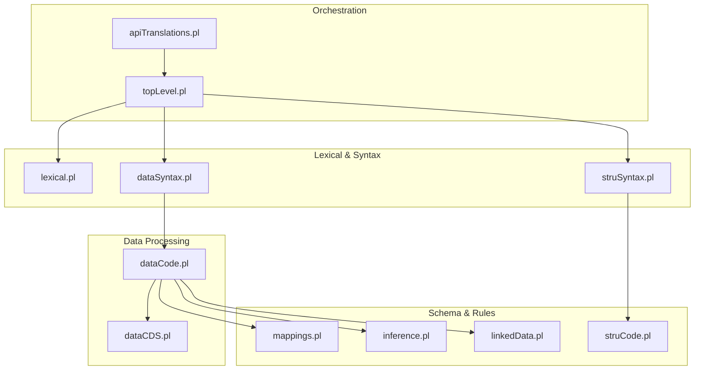
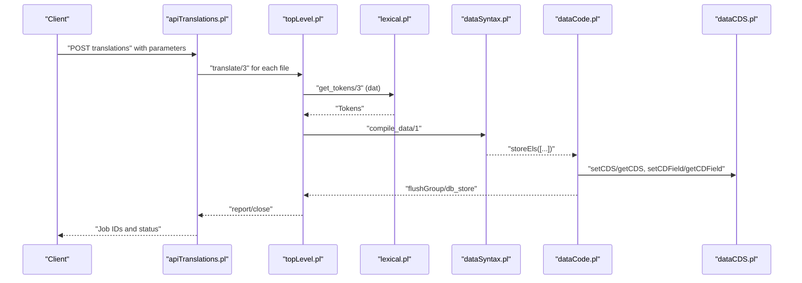
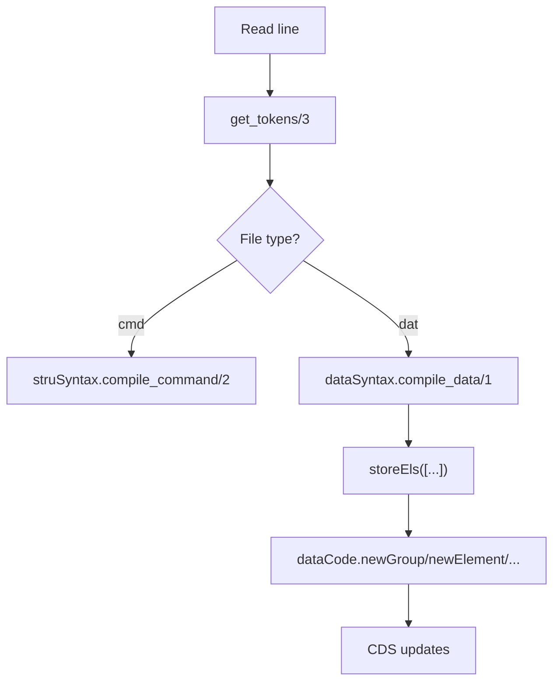
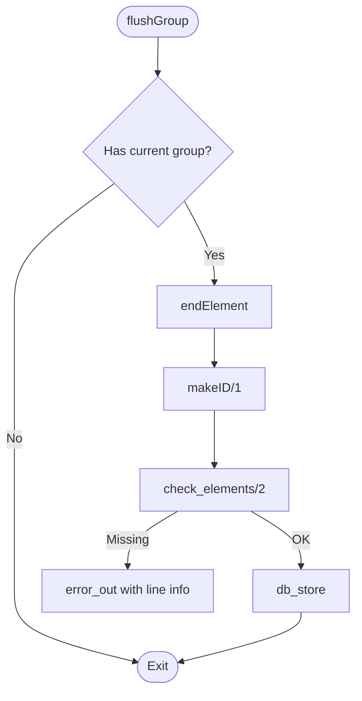
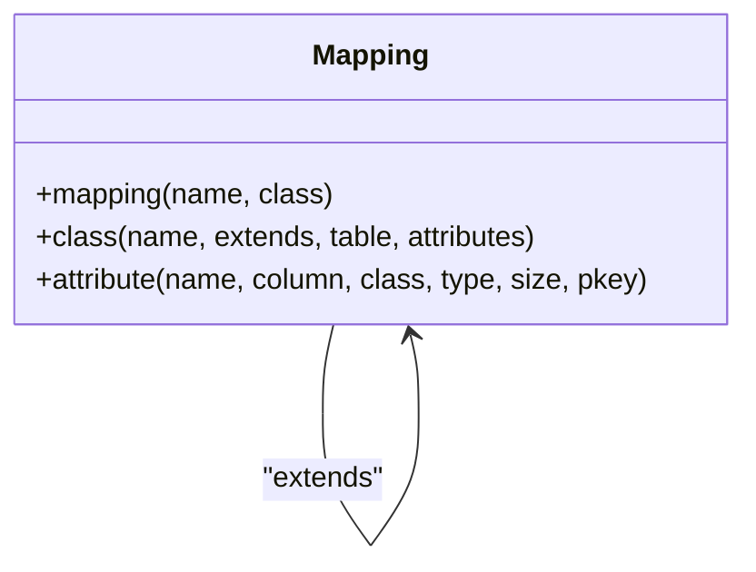
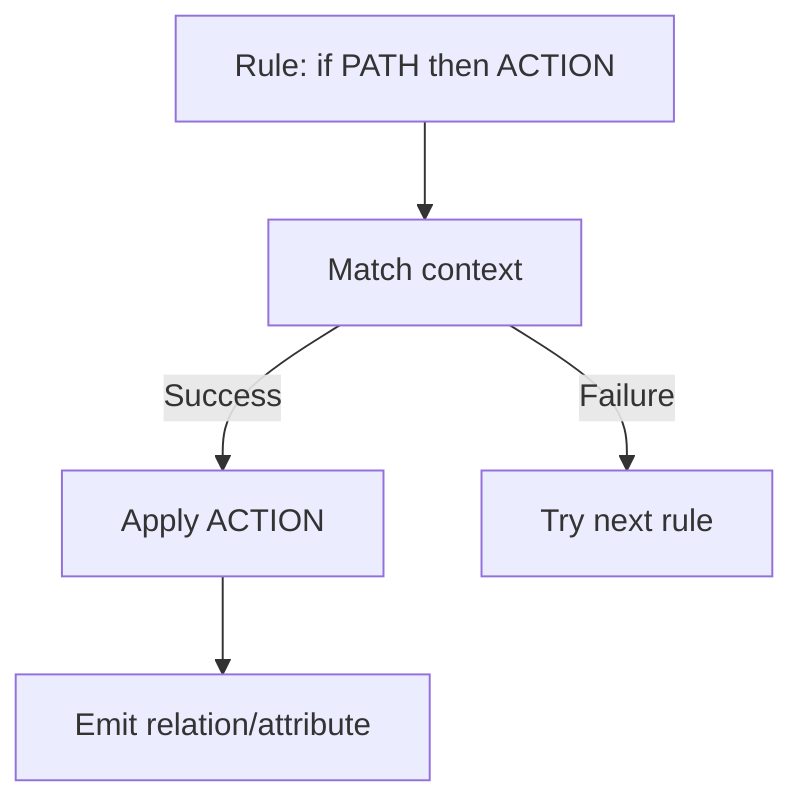
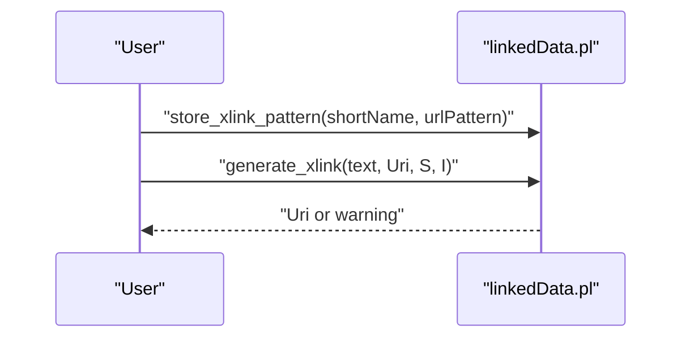
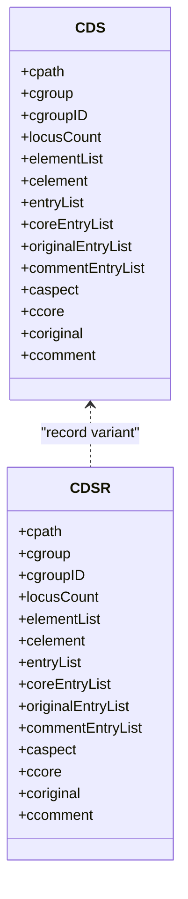
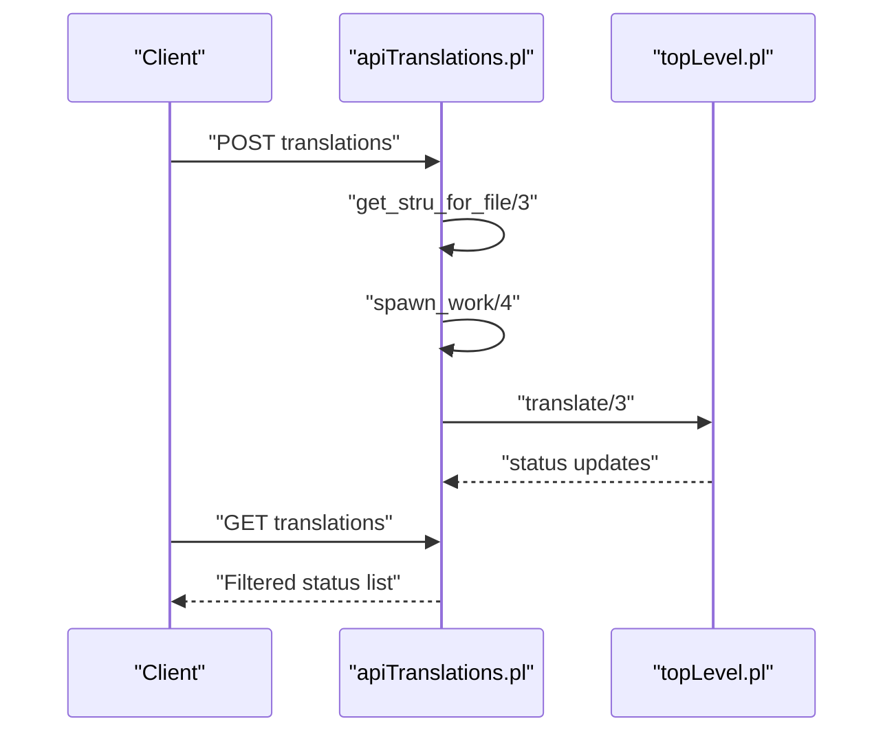
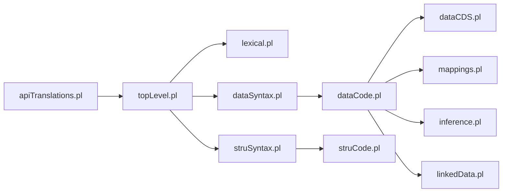

# Translation Engine

<cite>
**Referenced Files in This Document**
- [topLevel.pl](file://src/topLevel.pl)
- [apiTranslations.pl](file://src/apiTranslations.pl)
- [dataSyntax.pl](file://src/dataSyntax.pl)
- [struSyntax.pl](file://src/struSyntax.pl)
- [lexical.pl](file://src/lexical.pl)
- [dataCode.pl](file://src/dataCode.pl)
- [dataCDS.pl](file://src/dataCDS.pl)
- [mappings.pl](file://src/mappings.pl)
- [inference.pl](file://src/inference.pl)
- [linkedData.pl](file://src/linkedData.pl)
- [xref_kleio.pl](file://src/xref_kleio.pl)
- [person-mapping.yml](file://tests/kleio-home/mappings/person-mapping.yml)
- [sample-mapping.yml](file://tests/kleio-home/mappings/sample-mapping.yml)
- [inference_sample.yml](file://tests/kleio-home/inferences/inference_sample.yml)
</cite>

## Table of Contents
1. [Introduction](#introduction)
2. [Project Structure](#project-structure)
3. [Core Components](#core-components)
4. [Architecture Overview](#architecture-overview)
5. [Detailed Component Analysis](#detailed-component-analysis)
6. [Dependency Analysis](#dependency-analysis)
7. [Performance Considerations](#performance-considerations)
8. [Troubleshooting Guide](#troubleshooting-guide)
9. [Conclusion](#conclusion)
10. [Appendices](#appendices)

## Introduction
This document describes the translation engine of the Timelink Kleio system, focusing on the end-to-end workflow that transforms raw Kleio input into structured, validated, mapped, inferred, and linked data. The engine comprises:
- Syntax parsing for structure (.str/.yaml) and data (.cli) files
- Semantic validation and integrity checks
- Mapping application to align source groups to target classes and attributes
- Inference processing to discover relationships and enrich missing information
- Linked data integration to connect entities to external knowledge bases
- Cross-referencing and normalization via Contextual Data Structures (CDS)

The goal is to explain how each stage operates, how they interact, and how to configure and troubleshoot them effectively.

## Project Structure
The translation engine spans several modules:
- Top-level orchestration and file processing
- Lexical analysis and syntax parsing
- Data compilation and CDS management
- Structure definition processing
- Mapping and inference engines
- Linked data linking utilities
- API entry points for translation jobs

**Diagram sources**
- [topLevel.pl](file://src/topLevel.pl#L165-L282)
- [apiTranslations.pl](file://src/apiTranslations.pl#L433-L482)
- [lexical.pl](file://src/lexical.pl#L27-L73)
- [dataSyntax.pl](file://src/dataSyntax.pl#L38-L62)
- [struSyntax.pl](file://src/struSyntax.pl#L12-L51)
- [dataCode.pl](file://src/dataCode.pl#L49-L79)
- [dataCDS.pl](file://src/dataCDS.pl#L1-L80)
- [struCode.pl](file://src/struCode.pl#L49-L120)
- [mappings.pl](file://src/mappings.pl#L1-L35)
- [inference.pl](file://src/inference.pl#L1-L35)
- [linkedData.pl](file://src/linkedData.pl#L1-L41)

**Section sources**
- [topLevel.pl](file://src/topLevel.pl#L1-L286)
- [apiTranslations.pl](file://src/apiTranslations.pl#L1-L120)

## Core Components
- Lexical analyzer: tokenizes input streams for both commands and data.
- Data syntax parser: recognizes group/element/aspects and builds calls to store data.
- Structure syntax parser: validates and executes schema commands.
- Data code: orchestrates group lifecycle, flushing, and database storage hooks.
- CDS: in-memory staging area for current group data and metadata.
- Mappings: define how source groups/classes map to target relational classes and attributes.
- Inference: declarative rules to infer relations and attributes from context.
- Linked data: declares external link patterns and generates URIs for entities.

**Section sources**
- [lexical.pl](file://src/lexical.pl#L27-L73)
- [dataSyntax.pl](file://src/dataSyntax.pl#L38-L62)
- [struSyntax.pl](file://src/struSyntax.pl#L12-L51)
- [dataCode.pl](file://src/dataCode.pl#L49-L79)
- [dataCDS.pl](file://src/dataCDS.pl#L16-L81)
- [mappings.pl](file://src/mappings.pl#L1-L35)
- [inference.pl](file://src/inference.pl#L1-L35)
- [linkedData.pl](file://src/linkedData.pl#L11-L41)

## Architecture Overview
The translation pipeline is file-centric. For structure files (.str/.yaml), the system parses commands and builds an internal schema representation. For data files (.cli), it lexes, parses, compiles, and stages data in CDS, then persists it through database hooks.

**Diagram sources**
- [apiTranslations.pl](file://src/apiTranslations.pl#L433-L482)
- [topLevel.pl](file://src/topLevel.pl#L165-L282)
- [lexical.pl](file://src/lexical.pl#L27-L73)
- [dataSyntax.pl](file://src/dataSyntax.pl#L38-L62)
- [dataCode.pl](file://src/dataCode.pl#L75-L152)
- [dataCDS.pl](file://src/dataCDS.pl#L153-L214)

## Detailed Component Analysis

### Syntax Parsing and Compilation
- Lexical analysis converts input characters into typed tokens depending on file type (cmd/dat).
- Data syntax grammar recognizes groups, elements, aspects, and entries, generating calls to dataCode predicates.
- Structure syntax grammar validates commands and delegates execution to struCode.

**Diagram sources**
- [lexical.pl](file://src/lexical.pl#L27-L73)
- [struSyntax.pl](file://src/struSyntax.pl#L48-L51)
- [dataSyntax.pl](file://src/dataSyntax.pl#L57-L62)
- [dataCode.pl](file://src/dataCode.pl#L75-L121)

**Section sources**
- [lexical.pl](file://src/lexical.pl#L27-L73)
- [dataSyntax.pl](file://src/dataSyntax.pl#L38-L62)
- [struSyntax.pl](file://src/struSyntax.pl#L12-L51)

### Semantic Validation and Integrity Checks
- Group initialization resets path and counters, saving line metadata for diagnostics.
- On group end, the system finalizes elements, enforces “certe” requirements, computes IDs, and invokes persistence hooks.
- Missing mandatory elements produce errors with contextual line information.

**Diagram sources**
- [dataCode.pl](file://src/dataCode.pl#L140-L168)

**Section sources**
- [dataCode.pl](file://src/dataCode.pl#L178-L200)

### Mapping Application
Mappings define how source groups and elements map to target classes and attributes. They support:
- Class declarations with table names and attribute schemas
- Inheritance via “extends”
- Attribute metadata (column, type, size, primary key)

Examples:
- YAML mapping for a person class with id/name/sex/obs attributes
- YAML mapping for minutes extending act with day/month/year/summary/pages/obs

**Diagram sources**
- [mappings.pl](file://src/mappings.pl#L24-L518)
- [person-mapping.yml](file://tests/kleio-home/mappings/person-mapping.yml#L1-L15)
- [sample-mapping.yml](file://tests/kleio-home/mappings/sample-mapping.yml#L7-L23)

**Section sources**
- [mappings.pl](file://src/mappings.pl#L1-L35)
- [person-mapping.yml](file://tests/kleio-home/mappings/person-mapping.yml#L1-L15)
- [sample-mapping.yml](file://tests/kleio-home/mappings/sample-mapping.yml#L1-L24)

### Inference Engine
Inference rules automatically discover relationships and attributes from context. The engine supports:
- Path expressions: sequence, group, extends, and clause
- Actions: relation creation, attribute addition, and scope management

Example rule sets demonstrate parent-child relationships and marital relations across multiple generations.

**Diagram sources**
- [inference.pl](file://src/inference.pl#L11-L34)
- [inference_sample.yml](file://tests/kleio-home/inferences/inference_sample.yml#L28-L93)

**Section sources**
- [inference.pl](file://src/inference.pl#L1-L35)
- [inference_sample.yml](file://tests/kleio-home/inferences/inference_sample.yml#L1-L100)

### Linked Data Integration
Linked data enables mapping Kleio entities to external identifiers. The process involves:
- Declaring link patterns per external source
- Annotating elements with external IDs
- Generating URIs from patterns and annotations

**Diagram sources**
- [linkedData.pl](file://src/linkedData.pl#L51-L108)

**Section sources**
- [linkedData.pl](file://src/linkedData.pl#L11-L41)

### Contextual Data Structures (CDS) Processing
CDS is the in-memory staging area for current group data:
- Fields include path, group, group ID, element lists, entry lists, and aspects
- Predicates set/get CDS, manage fields, compute IDs, and print diagnostics
- Supports both property-based and record-based access

**Diagram sources**
- [dataCDS.pl](file://src/dataCDS.pl#L91-L104)
- [dataCDS.pl](file://src/dataCDS.pl#L153-L214)

**Section sources**
- [dataCDS.pl](file://src/dataCDS.pl#L16-L81)

### Cross-Reference Mechanisms and Normalization
Cross-references are supported through:
- Group path tracking in CDS for ancestry resolution
- ID generation with configurable prefixes and counters
- Element-level aspect handling (core/original/comment)

Normalization occurs at:
- Group boundaries (flushGroup)
- Element completion (endElement)
- ID computation (makeID)

**Section sources**
- [dataCDS.pl](file://src/dataCDS.pl#L436-L456)
- [dataCode.pl](file://src/dataCode.pl#L49-L79)

### API Translation Workflow
The API layer coordinates translation jobs:
- Authentication and authorization checks
- File discovery and structure resolution
- Job spawning (single or parallel)
- Status reporting and filtering
- Cleanup of derived artifacts

**Diagram sources**
- [apiTranslations.pl](file://src/apiTranslations.pl#L52-L82)
- [apiTranslations.pl](file://src/apiTranslations.pl#L295-L324)
- [apiTranslations.pl](file://src/apiTranslations.pl#L241-L260)
- [topLevel.pl](file://src/topLevel.pl#L139-L160)

**Section sources**
- [apiTranslations.pl](file://src/apiTranslations.pl#L34-L82)
- [topLevel.pl](file://src/topLevel.pl#L139-L160)

## Dependency Analysis
The translation engine exhibits layered dependencies:
- Orchestration depends on lexical and syntax modules
- Data compilation depends on CDS and database hooks
- Schema processing depends on dictionary and code modules
- Mapping and inference depend on data structures and persistence
- Linked data depends on pattern storage and utilities

**Diagram sources**
- [xref_kleio.pl](file://src/xref_kleio.pl#L7-L35)

**Section sources**
- [xref_kleio.pl](file://src/xref_kleio.pl#L1-L77)

## Performance Considerations
- Parallel translation: use the spawn option to distribute work across workers; otherwise, a single worker processes multiple files with shared structure initialization.
- Caching: translation status is cached to reduce repeated computation for large sets.
- Echo mode: enabling echo writes source lines to reports, increasing I/O overhead.
- Error limits: maximum errors are configurable to prevent runaway processing.
- Thread safety: synchronization via mutexes around structure and data files to avoid concurrent writes.

[No sources needed since this section provides general guidance]

## Troubleshooting Guide
Common issues and remedies:
- Syntax errors in data files: review line numbers and texts captured during lexical and syntax phases; errors are emitted with context.
- Missing elements: “certe” element enforcement triggers errors listing required elements.
- Structure resolution failures: verify structure file existence and path resolution logic.
- Mapping mismatches: ensure mapping names align with source group/class names and attribute definitions are correct.
- Inference misses: adjust rule conditions to match context; verify group names and relationships.
- Linked data URIs: confirm link pattern definitions and annotation syntax (@shortName:id).

**Section sources**
- [dataSyntax.pl](file://src/dataSyntax.pl#L54-L62)
- [dataCode.pl](file://src/dataCode.pl#L154-L168)
- [apiTranslations.pl](file://src/apiTranslations.pl#L272-L293)
- [linkedData.pl](file://src/linkedData.pl#L96-L108)

## Conclusion
The Timelink Kleio translation engine integrates lexical analysis, syntax parsing, semantic validation, mapping, inference, and linked data linking into a cohesive pipeline. Its modular design enables extensibility through mappings and inference rules, while robust APIs and caching support scalable batch processing. Proper configuration of structure files, mappings, and inference rules ensures accurate transformation of historical data into enriched, interconnected knowledge.

[No sources needed since this section summarizes without analyzing specific files]

## Appendices

### Configuration Options
- Structure selection: explicit structure file or default resolution
- Echo mode: include source lines in reports
- Spawn mode: parallel vs. sequential processing
- Status filtering: filter by translation status
- Multiple-entry flag: dynamic data flag for entries

**Section sources**
- [apiTranslations.pl](file://src/apiTranslations.pl#L42-L49)
- [apiTranslations.pl](file://src/apiTranslations.pl#L74-L76)
- [apiTranslations.pl](file://src/apiTranslations.pl#L598-L610)
- [lexical.pl](file://src/lexical.pl#L65-L71)