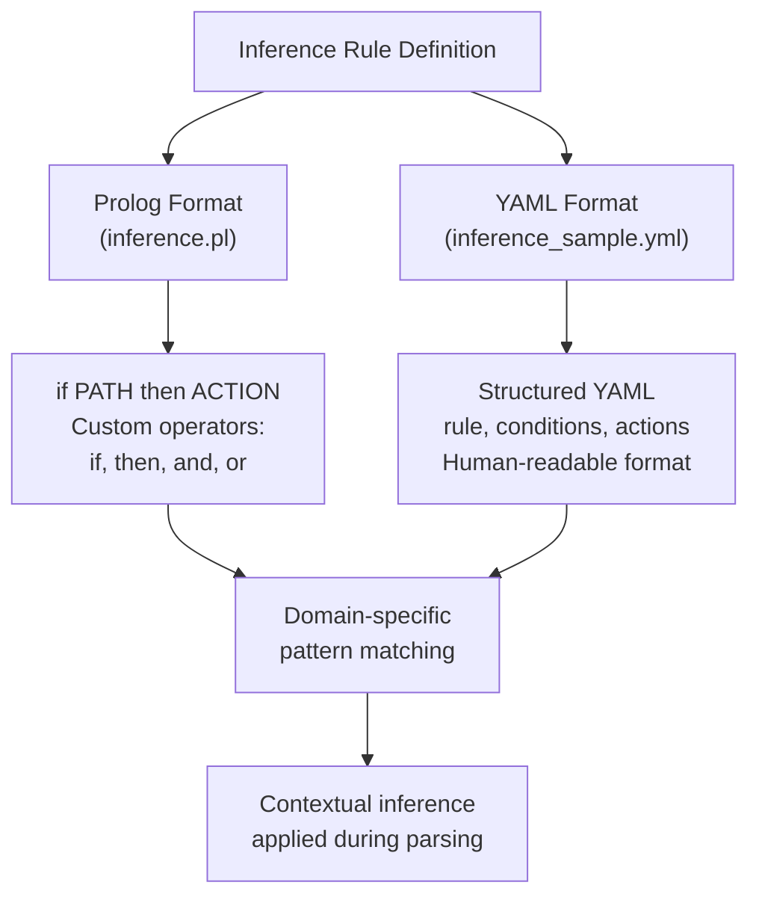
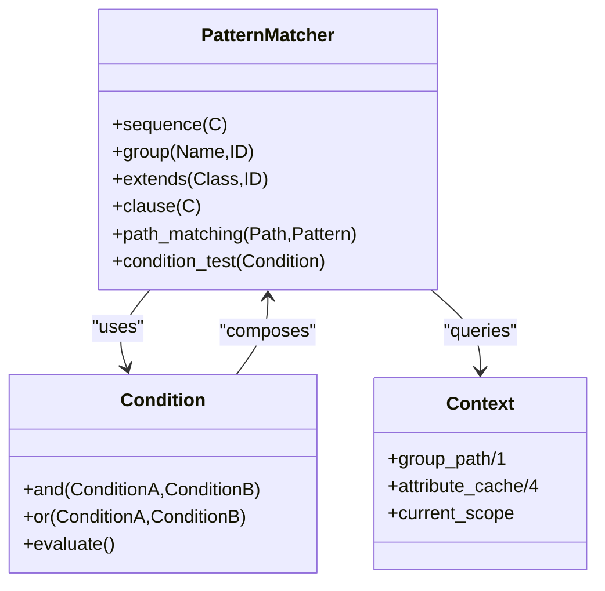
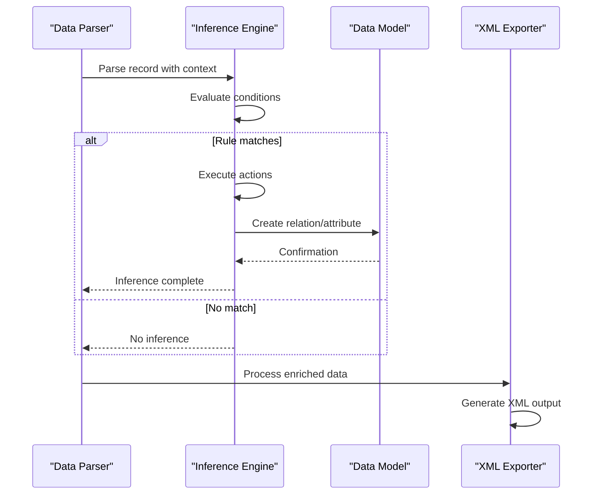
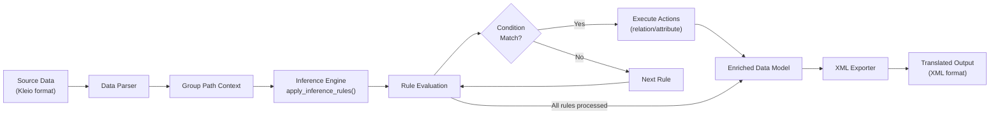

# Contextual Inference

<cite>
**Referenced Files in This Document**   
- [inference.pl](file://src/inference.pl)
- [inference_sample.yml](file://tests/kleio-home/inferences/inference_sample.yml)
- [gactoxml.pl](file://src/gactoxml.pl)
- [yamlSupport.pl](file://src/yamlSupport.pl)
</cite>

## Table of Contents
1. [Introduction](#introduction)
2. [Inference Rule Definition Format](#inference-rule-definition-format)
3. [Pattern Matching and Condition Evaluation](#pattern-matching-and-condition-evaluation)
4. [Action Execution and Data Enrichment](#action-execution-and-data-enrichment)
5. [Inference Triggering and Translation Pipeline Integration](#inference-triggering-and-translation-pipeline-integration)
6. [Configuration and Rule Management](#configuration-and-rule-management)
7. [Performance Considerations](#performance-considerations)
8. [Troubleshooting and Debugging](#troubleshooting-and-debugging)

## Introduction
The contextual inference system in timelink-kleio applies domain-specific rules to enrich and disambiguate data during translation. This system leverages context from surrounding records and external knowledge to automatically generate relations and attributes that are not explicitly stated in the source data. The inference engine operates as a core component of the translation pipeline, enhancing data normalization and semantic richness through rule-based reasoning.

The system is implemented primarily in Prolog, with inference rules defined in both Prolog syntax (inference.pl) and YAML format (inference_sample.yml). These rules are applied during parsing to infer relationships such as parentage, marital status, and household structures based on patterns in the data. The inference process is tightly integrated with the main translation workflow, ensuring that enriched data is available for downstream processing and export.

**Section sources**
- [inference.pl](file://src/inference.pl#L1-L800)
- [gactoxml.pl](file://src/gactoxml.pl#L1650-L1849)

## Inference Rule Definition Format
The inference system supports two formats for defining rules: Prolog syntax in inference.pl and YAML format in inference_sample.yml. Both formats express the same logical structure but cater to different use cases and user preferences.

In the Prolog format, rules follow the pattern `if PATH then ACTION`, where PATH represents a sequence of conditions and ACTION specifies the resulting data enrichment. The system defines custom operators to create a domain-specific language for inference rules:
- `if` (prefix operator with priority 230)
- `then` (infix operator with priority 220)
- `and` (infix operator with priority 210)
- `or` (infix operator with priority 210)

The YAML format provides a more accessible syntax for defining inference rules, particularly for users less familiar with Prolog. The inference_sample.yml file demonstrates this format, using a structured approach with explicit condition and action definitions. Each rule includes a name, description, and one or more conditional statements that map to the same logical constructs available in the Prolog format.

**Diagram sources **
- [inference.pl](file://src/inference.pl#L1-L100)
- [inference_sample.yml](file://tests/kleio-home/inferences/inference_sample.yml#L1-L100)

**Section sources**
- [inference.pl](file://src/inference.pl#L1-L100)
- [inference_sample.yml](file://tests/kleio-home/inferences/inference_sample.yml#L1-L100)

## Pattern Matching and Condition Evaluation
The inference system employs sophisticated pattern matching to identify contexts where rules should be applied. The core pattern matching elements include:

- `sequence(C)`: Matches a sequence of groups, including an empty sequence
- `group(Name,ID)`: Matches a specific group with the given name and ID
- `extends(Class,ID)`: Matches any group that extends a specified class
- `clause(C)`: Calls a Prolog predicate as a condition

The condition evaluation process is implemented in the `condition_test/1` predicate in gactoxml.pl, which handles logical operators `and` and `or` to combine multiple conditions. The system evaluates conditions against the current group path, which represents the hierarchical context of the data being processed.

For example, the rule `if [sequence(_),extends(actorm,N),pai(P)] then relation(parentesco,pai,P,N)` matches any male actor (actorm) with a father (pai) reference and creates a parent-child relationship. The `extends` pattern allows the rule to apply to any group that inherits from the actorm class, providing flexibility in schema design.

The pattern matching system also supports complex hierarchical contexts, such as nested structures in baptism records where godparents' parents need to be inferred. Specialized rules handle these cases by specifying the full path context, like `if [kleio(_),fonte(_),bap(_),n(_),mad(Mad),pmad(PMad)] then relation(parentesco,pai,PMad,Mad)` which infers the father of a godmother in a baptism record.

**Diagram sources **
- [inference.pl](file://src/inference.pl#L1-L800)
- [gactoxml.pl](file://src/gactoxml.pl#L1700-L1758)

**Section sources**
- [inference.pl](file://src/inference.pl#L1-L800)
- [gactoxml.pl](file://src/gactoxml.pl#L1700-L1758)

## Action Execution and Data Enrichment
When inference rules are triggered, the system executes actions that enrich the data model by creating relations and attributes. The primary actions supported by the system are:

- `relation(type,value,idorigin,iddestination)`: Generates a relationship between two entities
- `attribute(id,type,value)`: Adds an attribute to an entity
- `newscope`: Cleans the current scope, forgetting previous actor and object references

The action execution is handled by the `do_actions/1` and `do_action/1` predicates in gactoxml.pl. These functions process the action specifications and generate the appropriate data structures in the output. For relations, the system creates XML GROUP elements with the "relation" class, while attributes are exported as ELEMENTs within the appropriate context.

The inference system implements several domain-specific enrichment patterns:

1. **Family relationships**: Automatically infers parent-child, spousal, and sibling relationships based on naming conventions and positional patterns in the data
2. **Marital status**: Derives marital status from relationship references, setting attributes like `ec=c` (married) when appropriate
3. **Household structures**: Identifies head-of-household relationships in census-like records (rois de confessados)
4. **Procurator relationships**: Creates sociability relations when procuradores (representatives) are used for godparents

For example, the rule `if [sequence(Path),cas(C),noivo(N)] and [sequence(Path),cas(C),mulher1(M)] then relation(parentesco,foi-marido,N,M) and attribute(M,morta,antes)` infers that a previous wife has died when referenced as mulher1 in a marriage record.

**Diagram sources **
- [inference.pl](file://src/inference.pl#L30-L31)
- [gactoxml.pl](file://src/gactoxml.pl#L1711-L1727)

**Section sources**
- [inference.pl](file://src/inference.pl#L30-L31)
- [gactoxml.pl](file://src/gactoxml.pl#L1711-L1727)

## Inference Triggering and Translation Pipeline Integration
The inference system is integrated into the main translation pipeline through the `apply_inference_rules/0` predicate in gactoxml.pl, which is called during the data processing phase. The inference engine operates at the act scope level, ensuring that rules are applied in the appropriate contextual hierarchy.

The triggering mechanism follows a specific sequence:
1. The parser processes input data and builds the group path context
2. The `do_auto_rels2/0` predicate initiates the inference process
3. All inference rules are evaluated against the current context
4. Matching rules trigger their associated actions
5. Results are incorporated into the data model before XML export

The integration occurs in the gactoxml.pl module, which serves as the main translation engine. The `apply_inference_rules/0` function iterates through all defined rules, testing their conditions and executing actions for those that match. This process happens after initial parsing but before final XML generation, ensuring that inferred data is included in the output.

The system supports both built-in rules (defined in inference.pl) and user-defined rules. Although the code contains TODO comments about loading user inference rules (`check_user_irules/1`), this functionality appears to be planned but not yet implemented. The current system relies on the pre-defined rules in inference.pl and inference_sample.yml.

**Diagram sources **
- [gactoxml.pl](file://src/gactoxml.pl#L1650-L1697)
- [inference.pl](file://src/inference.pl#L1-L800)

**Section sources**
- [gactoxml.pl](file://src/gactoxml.pl#L1650-L1697)

## Configuration and Rule Management
The inference system is configured through rule files located in specific directories within the project structure. The primary rule definitions are stored in inference.pl for Prolog-based rules and in the inferences directory for YAML-based rules.

The system architecture supports multiple rule definition formats to accommodate different user needs:
- **Prolog format** (inference.pl): Provides full programming capabilities for complex rules
- **YAML format** (inference_sample.yml): Offers a more accessible, structured format for simpler rules

Rule management follows a hierarchical approach where rules are organized by domain and complexity. The inference.pl file contains comprehensive rules for family relationships, while specialized rules for specific record types (like baptism procurators or household lists) are defined separately.

Configuration options for enabling or disabling inference rules are not explicitly implemented in the current codebase. However, the modular structure allows for rule management through:
- Commenting out rules in inference.pl
- Selectively including rule files
- Modifying rule conditions to prevent triggering

The AGENTS.md documentation suggests that developers can extend functionality by adding new inference rules, indicating that rule management is intended to be flexible and extensible. The TODO comments in apiTranslations.pl and gactoxml.pl indicate plans for user-defined inference rules, suggesting future enhancements to the configuration system.

**Section sources**
- [inference.pl](file://src/inference.pl#L1-L800)
- [inference_sample.yml](file://tests/kleio-home/inferences/inference_sample.yml#L1-L100)
- [AGENTS.md](file://AGENTS.md#L136-L144)

## Performance Considerations
The inference system's performance is influenced by several factors related to rule complexity, data volume, and implementation efficiency. The current implementation uses a straightforward approach of evaluating all rules for each context, which can impact performance with large datasets.

Key performance characteristics include:
- **Rule evaluation overhead**: Each rule must be tested against the current context, with complexity increasing with the number of rules and conditions
- **Pattern matching cost**: The path_matching/4 predicate performs recursive matching against group paths, which can be computationally expensive for deep hierarchies
- **Memory usage**: The system maintains context information in thread-local predicates like group_path/1 and attribute_cache/4

The apply_inference_rules/0 predicate uses a fail-driven loop to process all rules, which ensures completeness but may not be optimal for performance. Each rule is evaluated independently, without optimization for rule dependencies or ordering.

Potential performance improvements could include:
- Rule indexing based on trigger patterns to reduce unnecessary evaluations
- Caching of frequently used context information
- Parallel processing of independent rules
- Early termination when certain rule sets are mutually exclusive

The system's integration point in the translation pipeline (after initial parsing but before XML export) means that inference overhead directly impacts overall translation time. For large datasets with complex relationships, this could become a significant factor in processing time.

**Section sources**
- [gactoxml.pl](file://src/gactoxml.pl#L1682-L1697)
- [inference.pl](file://src/inference.pl#L1-L800)

## Troubleshooting and Debugging
Troubleshooting inference issues requires understanding both the rule logic and the data context in which rules are applied. Common issues include incorrect inferences, rule conflicts, and unexpected behavior due to context sensitivity.

Debugging strategies include:
- **Rule tracing**: The system includes reporting predicates that can output debug information about rule evaluation
- **Context inspection**: Examining the group_path/1 predicate to understand the current context
- **Step-by-step evaluation**: Testing rules individually to isolate issues

Common troubleshooting scenarios:
1. **Incorrect inferences**: Occur when rules match unintended patterns. This can be addressed by refining condition specificity or reordering rules to handle edge cases first.
2. **Rule conflicts**: Happen when multiple rules apply to the same context with contradictory actions. Resolution involves prioritizing rules or adding exclusion conditions.
3. **Missing inferences**: Result from rules not matching expected patterns. This may require adjusting pattern definitions or ensuring proper data structure.

The system provides limited built-in debugging tools, but developers can leverage Prolog's debugging capabilities to trace rule execution. The TODO comments in the code suggest planned enhancements for user-defined rules and better integration with the API, which would improve troubleshooting capabilities.

When debugging inference issues, it's essential to:
- Verify the input data structure matches expectations
- Check that group names and extensions are correctly defined
- Ensure the context path contains the expected sequence of groups
- Validate that variable bindings are correct in rule conditions

**Section sources**
- [gactoxml.pl](file://src/gactoxml.pl#L1682-L1697)
- [inference.pl](file://src/inference.pl#L1-L800)