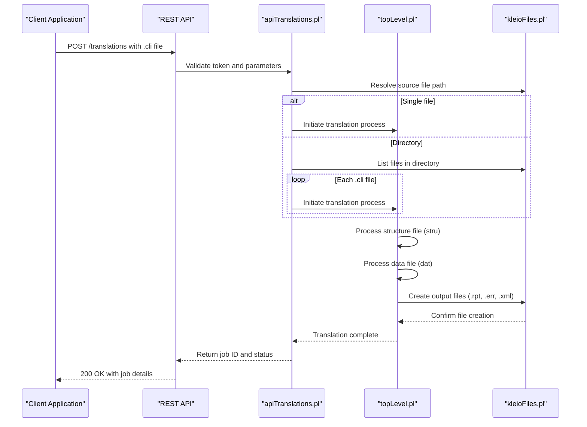
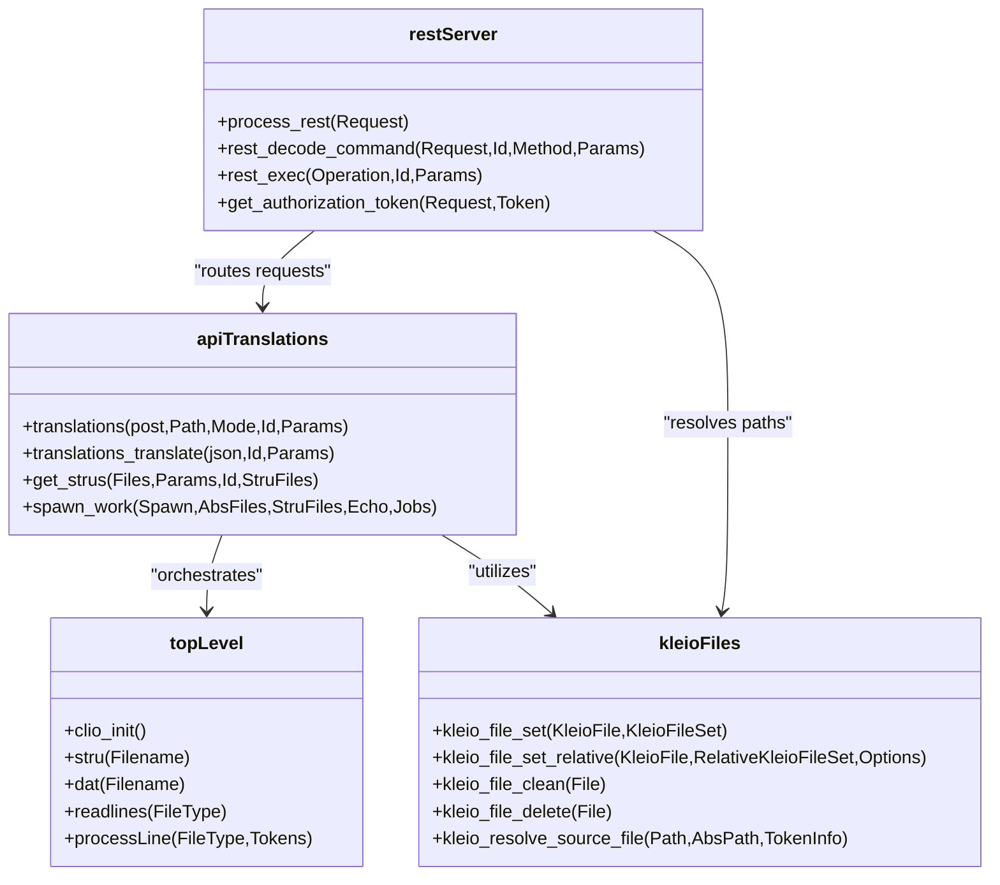

# File Translation

<cite>
**Referenced Files in This Document**   
- [apiTranslations.pl](file://src/apiTranslations.pl)
- [topLevel.pl](file://src/topLevel.pl)
- [restServer.pl](file://src/restServer.pl)
- [kleioFiles.pl](file://src/kleioFiles.pl)
</cite>

## Table of Contents
1. [Introduction](#introduction)
2. [Translation Workflow](#translation-workflow)
3. [Configuration Options](#configuration-options)
4. [Error Handling](#error-handling)
5. [Code Analysis](#code-analysis)
6. [Troubleshooting](#troubleshooting)

## Introduction
The timelink-kleio system provides a comprehensive file translation sub-feature that enables the processing of Kleio source files (.cli) through a REST API endpoint. This documentation details the complete workflow from file upload to translation execution, including temporary storage, parsing initiation, and result retrieval. The system leverages Prolog-based processing to transform historical document data into structured formats, supporting both XML and report outputs.

**Section sources**
- [apiTranslations.pl](file://src/apiTranslations.pl#L1-L779)
- [topLevel.pl](file://src/topLevel.pl#L1-L286)

## Translation Workflow
The file translation process in timelink-kleio follows a structured workflow that begins with the REST API endpoint `/translations`. When a client uploads a .cli file, the system first validates the API token through the authorization mechanism in `restServer.pl`. The `apiTranslations.pl` module then handles the translation request by resolving the source file path and determining whether the target is a single file or directory.

For directory targets, the system recursively processes all .cli files within the directory structure. The translation pipeline is orchestrated by `topLevel.pl`, which coordinates the parsing process. The workflow involves two main phases: structure processing (`stru/1`) and data processing (`dat/1`). First, the structure file (typically with .str or .yaml extension) is processed to establish the schema definitions. Then, the actual .cli data files are processed according to this schema.

During processing, the system creates temporary files for error reporting (.err), translation reports (.rpt), and XML output (.xml). The `kleioFiles.pl` module manages these file operations, ensuring proper creation and cleanup of temporary files. The translation status is tracked throughout the process, with files marked as queued, processing, or completed based on their current state in the pipeline.

**Diagram sources**
- [apiTranslations.pl](file://src/apiTranslations.pl#L52-L82)
- [topLevel.pl](file://src/topLevel.pl#L102-L159)
- [kleioFiles.pl](file://src/kleioFiles.pl#L69-L126)

**Section sources**
- [apiTranslations.pl](file://src/apiTranslations.pl#L52-L82)
- [topLevel.pl](file://src/topLevel.pl#L102-L159)
- [kleioFiles.pl](file://src/kleioFiles.pl#L69-L126)

## Configuration Options
The file translation system supports several configuration options that can be specified in the API request parameters. These options control various aspects of the translation process, including output format, processing mode, and error handling behavior.

The `echo` parameter determines whether source lines are included in the translation report (.rpt file). When set to "yes", the original source content is echoed in the report, providing a complete audit trail of the translation process. The `spawn` parameter controls parallel processing: when set to "yes", files are distributed to different worker threads for parallel translation, while "no" processes files sequentially with a single worker.

Translation mode can be specified through the `structure` parameter, which allows users to define a custom structure file for the translation process. If not specified, the system uses the default structure file defined in the environment variables. The system also supports recursive processing through the `recurse` parameter, which when enabled, processes all subdirectories when translating a directory.

Output format options include XML generation and report creation. The system automatically generates XML output files (.xml) containing the structured data extracted from the .cli files. Additionally, detailed text reports (.rpt) are created for each translation, containing processing information, warnings, and errors.

**Section sources**
- [apiTranslations.pl](file://src/apiTranslations.pl#L42-L49)
- [topLevel.pl](file://src/topLevel.pl#L67-L70)

## Error Handling
The timelink-kleio system implements comprehensive error handling strategies to manage various failure scenarios during the translation process. Errors are categorized and tracked through the `errors.pl` module, which integrates with the translation pipeline to capture and report issues.

Common error types include malformed input, file encoding problems, and timeout errors. Malformed input is detected during the parsing phase by the `dataSyntax.pl` module, which validates the structure of the .cli files against the defined schema. When malformed input is detected, the system generates detailed error messages in the .err file, including line numbers and specific error descriptions.

File encoding problems are handled by the `basicio.pl` module, which attempts to detect and convert file encodings during the initial file reading phase. If encoding conversion fails, the system returns an appropriate error response through the REST API. Timeout errors are managed by the `threadSupport.pl` module, which monitors the execution time of translation jobs and terminates processes that exceed predefined limits.

The system also implements a robust error recovery mechanism. When a translation fails, the system preserves the original .cli file and any partial output files for diagnostic purposes. The `kleio_file_clean/1` predicate in `kleioFiles.pl` provides functionality to clean up translation artifacts while preserving the original source data.

**Section sources**
- [apiTranslations.pl](file://src/apiTranslations.pl#L519-L525)
- [kleioFiles.pl](file://src/kleioFiles.pl#L118-L126)
- [errors.pl](file://src/errors.pl)

## Code Analysis
The core translation functionality is implemented across several Prolog modules, with `apiTranslations.pl` serving as the primary entry point for translation requests. This module defines the `translations/5` predicate that handles the REST API calls, validating authentication tokens and processing parameters before initiating the translation pipeline.

The `topLevel.pl` module contains the fundamental predicates for the translation process: `clio_init/0` for initialization, `stru/1` for structure processing, and `dat/1` for data processing. The `stru/1` predicate processes structure definition files, while `dat/1` processes the actual .cli data files according to the previously processed structure.

The `kleioFiles.pl` module provides essential file management utilities, including `kleio_file_set/2` for managing translation artifacts and `kleio_resolve_source_file/3` for path resolution. These predicates ensure proper handling of file paths and permissions, particularly important in multi-user environments.

The system's architecture follows a modular design with clear separation of concerns. The REST API layer (`restServer.pl`) handles HTTP requests and responses, the translation orchestration layer (`apiTranslations.pl`) manages the translation workflow, and the core processing layer (`topLevel.pl`) executes the actual parsing and transformation logic.

**Diagram sources**
- [apiTranslations.pl](file://src/apiTranslations.pl#L52-L82)
- [topLevel.pl](file://src/topLevel.pl#L34-L42)
- [kleioFiles.pl](file://src/kleioFiles.pl#L1-L33)
- [restServer.pl](file://src/restServer.pl#L1-L22)

**Section sources**
- [apiTranslations.pl](file://src/apiTranslations.pl#L52-L82)
- [topLevel.pl](file://src/topLevel.pl#L34-L42)
- [kleioFiles.pl](file://src/kleioFiles.pl#L1-L33)
- [restServer.pl](file://src/restServer.pl#L1-L22)

## Troubleshooting
Common issues in the file translation process typically fall into three categories: configuration problems, input file issues, and system resource constraints. For configuration problems, verify that the KLEIO_HOME_DIR environment variable is correctly set and that the default structure file exists at the specified location.

Input file issues often involve malformed .cli syntax or incorrect file encoding. To diagnose these issues, enable the `echo` parameter to include source lines in the translation report, which helps identify the exact location of syntax errors. For encoding problems, ensure that .cli files are saved in UTF-8 encoding, as this is the preferred format for the system.

Timeout errors may occur when processing large files or directories. These can be addressed by increasing the server timeout value through the KLEIO_IDLE_TIMEOUT environment variable or by processing files in smaller batches. Monitoring the server's worker thread usage through the `KLEIO_SERVER_WORKERS` setting can also help optimize performance for large translation jobs.

When debugging translation issues, examine the .err and .rpt files generated during processing. These files contain detailed information about errors, warnings, and processing status. The system's logging functionality, accessible through the `logging.pl` module, can also provide additional diagnostic information when enabled in debug mode.

**Section sources**
- [apiTranslations.pl](file://src/apiTranslations.pl#L519-L525)
- [kleioFiles.pl](file://src/kleioFiles.pl#L118-L126)
- [restServer.pl](file://src/restServer.pl#L175-L182)