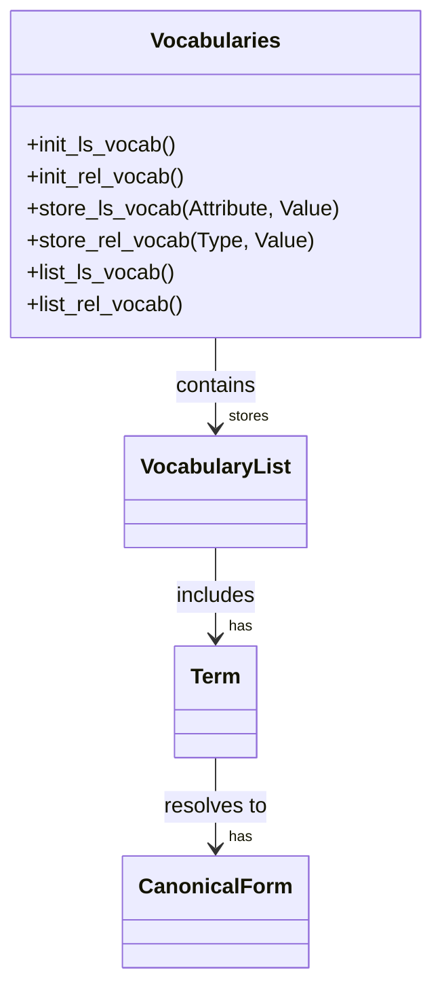

# Normalization Rules

<cite>
**Referenced Files in This Document**   
- [dataCode.pl](file://src/dataCode.pl)
- [gactoxml.pl](file://src/gactoxml.pl)
- [vocabularies.pl](file://src/vocabularies.pl)
- [dataSyntax.pl](file://src/dataSyntax.pl)
- [dataDictionary.pl](file://src/dataDictionary.pl)
- [dataCDS.pl](file://src/dataCDS.pl)
- [inference.pl](file://src/inference.pl)
- [lexical.pl](file://src/lexical.pl)
</cite>

## Table of Contents
1. [Introduction](#introduction)
2. [Normalization Pipeline Overview](#normalization-pipeline-overview)
3. [Raw Syntax Transformation](#raw-syntax-transformation)
4. [Controlled Vocabularies and Canonical Forms](#controlled-vocabularies-and-canonical-forms)
5. [Normalization Pipeline Stages](#normalization-pipeline-stages)
6. [Configuration and Customization](#configuration-and-customization)
7. [Common Issues and Mitigation Strategies](#common-issues-and-mitigation-strategies)
8. [Conclusion](#conclusion)

## Introduction
The timelink-kleio system employs a sophisticated normalization rules engine to transform raw Kleio syntax into standardized XML representations. This process ensures consistent formatting, encoding, and structural conventions across historical source transcriptions. The normalization pipeline is primarily driven by two core components: `dataCode.pl` and `gactoxml.pl`, which work in tandem to parse, analyze, and transform the input data. The `vocabularies.pl` module plays a critical role in maintaining controlled terminologies for entities such as persons, places, and actions, ensuring that variant spellings and abbreviations are resolved to canonical forms. This document details the entire normalization process, from initial text cleaning and date standardization to identifier generation and cross-reference resolution, providing a comprehensive understanding of the system's inner workings.

## Normalization Pipeline Overview

The normalization process in timelink-kleio is a multi-stage pipeline that begins with the lexical analysis of raw Kleio text and culminates in the generation of standardized XML. The process is orchestrated by the `gactoxml.pl` export module, which acts as a bridge between the raw data and the final XML output. The pipeline can be visualized as a sequence of transformations, where each stage builds upon the output of the previous one.

```mermaid
flowchart TD
A[Raw Kleio Text] --> B[Lexical Analysis]
B --> C[Syntax Analysis]
C --> D[Data Storage (CDS)]
D --> E[Normalization Rules]
E --> F[Controlled Vocabularies]
F --> G[XML Generation]
G --> H[Standardized XML]
```

**Diagram sources**
- [dataCode.pl](file://src/dataCode.pl#L1-L612)
- [gactoxml.pl](file://src/gactoxml.pl#L1-L2781)
- [dataSyntax.pl](file://src/dataSyntax.pl#L1-L194)

**Section sources**
- [dataCode.pl](file://src/dataCode.pl#L1-L612)
- [gactoxml.pl](file://src/gactoxml.pl#L1-L2781)
- [dataSyntax.pl](file://src/dataSyntax.pl#L1-L194)

## Raw Syntax Transformation

The transformation of raw Kleio syntax into a structured format is handled by the `dataCode.pl` and `gactoxml.pl` modules. The process begins with lexical analysis, where the input text is tokenized into meaningful units such as group names, element names, and data flags. The `lexical.pl` module defines the grammar for this tokenization, identifying special characters like the dollar sign (`$`) for group delimiters and the semicolon (`;`) for multiple entries.

Once tokenized, the `dataSyntax.pl` module uses a Definite Clause Grammar (DCG) to parse the tokens and build a syntactic structure. This parser generates a series of calls to predicates defined in `dataCode.pl`, such as `newGroup/1` and `newElement/1`, which are responsible for managing the current data structure (CDS). The CDS is a temporary storage mechanism that holds information about the current group, its elements, and their entries as they are being processed.

The `gactoxml.pl` module then takes over, acting as an export module that is called by the Clio translator whenever a new group of data is available. It retrieves the data from the CDS and applies a series of normalization rules to generate XML. This includes constructing unique identifiers for groups, resolving cross-references, and applying inference rules to generate implicit relationships. The final output is a well-formed XML document that adheres to a predefined schema, ensuring consistency and interoperability with other systems.

**Section sources**
- [dataCode.pl](file://src/dataCode.pl#L1-L612)
- [gactoxml.pl](file://src/gactoxml.pl#L1-L2781)
- [dataSyntax.pl](file://src/dataSyntax.pl#L1-L194)
- [lexical.pl](file://src/lexical.pl#L1-L492)

## Controlled Vocabularies and Canonical Forms

The `vocabularies.pl` module is central to maintaining controlled terminologies and canonical forms for entities within the timelink-kleio system. It provides a mechanism for storing and managing a vocabulary of attributes and relationship types, ensuring that all data entries conform to a standardized set of terms. This is particularly important for historical data, where variant spellings, abbreviations, and synonyms are common.

The module defines predicates such as `init_ls_vocab/0` and `init_rel_vocab/0` to initialize the vocabulary for life story attributes and relationships, respectively. As the system processes data, it uses `store_ls_vocab/2` and `store_rel_vocab/2` to record the attributes and values encountered. This allows the system to build a comprehensive vocabulary of all terms used in the dataset, which can then be reviewed and standardized.

For example, when processing a person's occupation, the system might encounter variations such as "blacksmith," "black-smith," or "blacke-smith." The `vocabularies.pl` module would record all these variations and allow the user to define a canonical form, such as "blacksmith," which would be used in the final XML output. This process helps to ensure data consistency and facilitates more accurate data analysis and querying.



**Diagram sources**
- [vocabularies.pl](file://src/vocabularies.pl#L1-L76)

**Section sources**
- [vocabularies.pl](file://src/vocabularies.pl#L1-L76)

## Normalization Pipeline Stages

The normalization pipeline in timelink-kleio consists of several distinct stages, each responsible for a specific aspect of data transformation. The first stage is text cleaning, where the raw input is processed to remove extraneous whitespace, normalize line endings, and handle special characters. This is followed by date standardization, where dates in various formats are converted to a consistent ISO 8601 format.

The next stage involves identifier generation, where unique identifiers are created for each group and element. This is handled by the `makeID/1` predicate in `dataCDS.pl`, which constructs an ID based on the group name and a counter. Cross-reference resolution is then performed, where references to other entities are resolved to their canonical forms. This is facilitated by the `inference.pl` module, which contains a set of rules for automatically generating relationships and attributes based on the context.

Finally, the normalized data is transformed into XML using the `gactoxml.pl` module. This involves mapping the data to a predefined schema, adding metadata, and ensuring that the output is well-formed and valid. The entire process is designed to be both robust and flexible, allowing for the handling of a wide variety of input data while maintaining a high degree of consistency and accuracy.

**Section sources**
- [dataCDS.pl](file://src/dataCDS.pl#L1-L591)
- [inference.pl](file://src/inference.pl#L1-L2936)
- [gactoxml.pl](file://src/gactoxml.pl#L1-L2781)

## Configuration and Customization

The timelink-kleio normalization engine is highly configurable, allowing users to customize various aspects of the process to suit their specific needs. Configuration options are primarily managed through the structure definition files (`.str` files) and can be used to define custom vocabularies, set normalization thresholds, and control output formatting.

For example, users can define custom vocabularies by specifying a list of allowed terms for specific attributes in the structure file. This ensures that only approved terms are used in the data, reducing the risk of inconsistencies. Normalization thresholds can be set to control how aggressively the system resolves variant spellings and abbreviations. A higher threshold might require a closer match between the input and the canonical form, while a lower threshold might allow for more leniency.

Output formatting can also be customized, with options to control the structure of the generated XML, the inclusion of metadata, and the handling of special characters. These configuration options are typically specified in the `nomino` command of the structure file, which defines the overall parameters for the data processing.

**Section sources**
- [dataDictionary.pl](file://src/dataDictionary.pl#L1-L1057)
- [struCode.pl](file://src/struCode.pl#L1-L391)

## Common Issues and Mitigation Strategies

Despite its robust design, the timelink-kleio normalization engine can encounter several common issues. One of the most frequent is over-normalization, where the system incorrectly resolves a variant spelling or abbreviation to an incorrect canonical form. This can be mitigated by carefully defining the vocabulary and setting appropriate normalization thresholds.

Another issue is the loss of source fidelity, where the normalization process alters the original data in a way that obscures its historical context. This can be addressed by preserving the original text in a separate field, such as the `original` aspect in the CDS, and by using comments to document any significant changes.

Performance bottlenecks can also occur, particularly when processing large datasets. These can be mitigated by optimizing the inference rules, using efficient data structures, and parallelizing the processing where possible. Regular monitoring and profiling of the system can help to identify and address performance issues before they become critical.

**Section sources**
- [dataCode.pl](file://src/dataCode.pl#L1-L612)
- [gactoxml.pl](file://src/gactoxml.pl#L1-L2781)
- [inference.pl](file://src/inference.pl#L1-L2936)

## Conclusion
The normalization rules engine in timelink-kleio is a powerful and flexible system for transforming raw Kleio syntax into standardized XML representations. By leveraging a combination of lexical analysis, syntactic parsing, controlled vocabularies, and inference rules, it ensures that historical data is consistently formatted and accurately represented. The system's modular design and extensive configuration options make it well-suited for a wide range of applications, from small-scale research projects to large-scale digital humanities initiatives. With careful attention to detail and a thorough understanding of its inner workings, users can harness the full potential of this sophisticated tool to unlock new insights from historical sources.