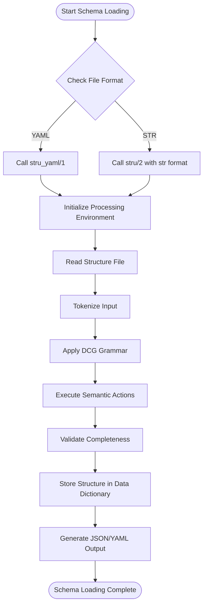
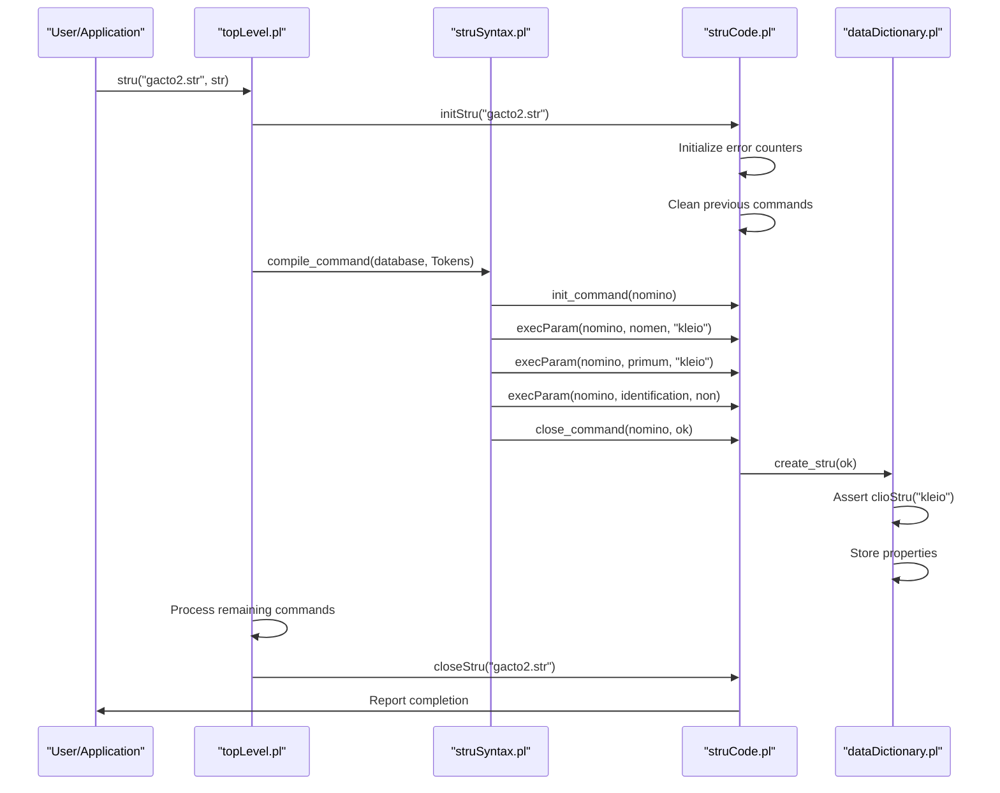
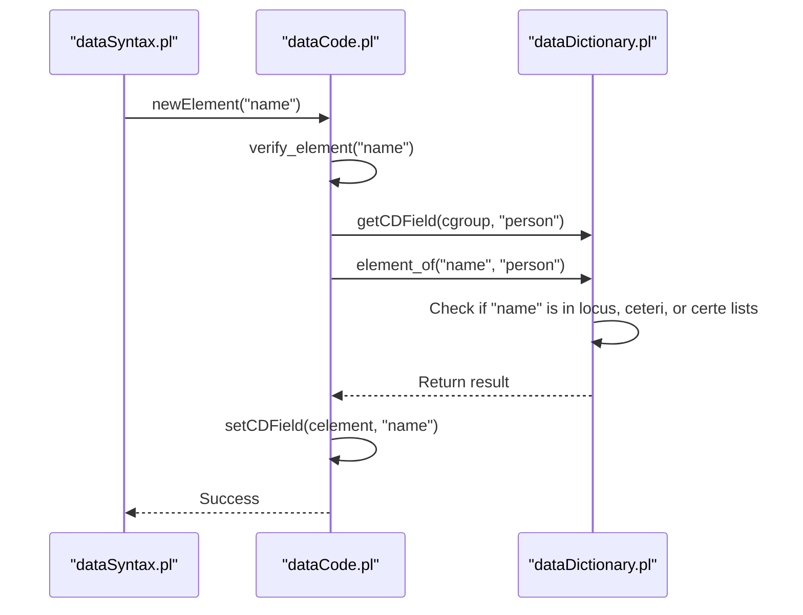
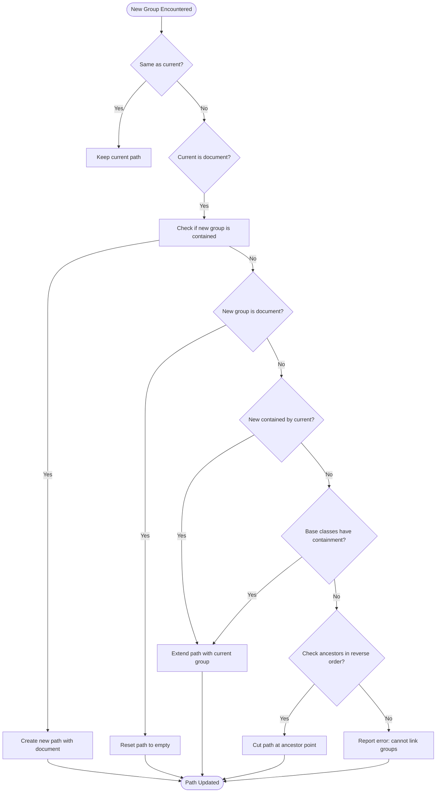
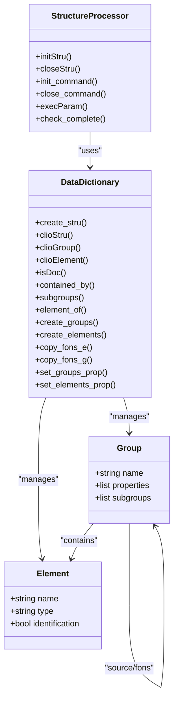
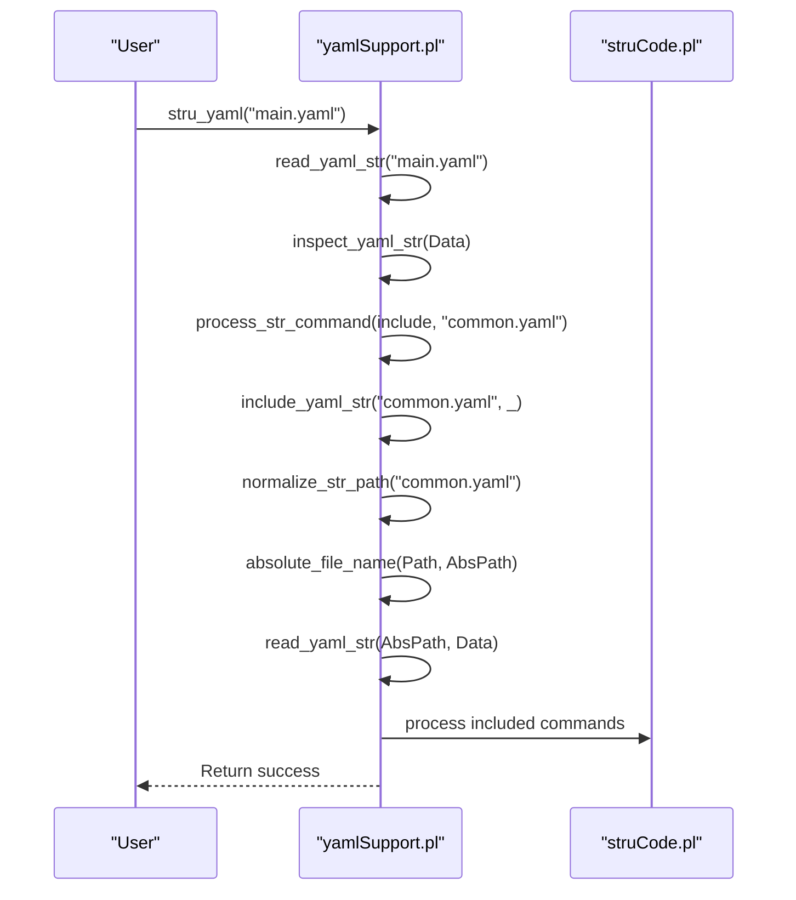
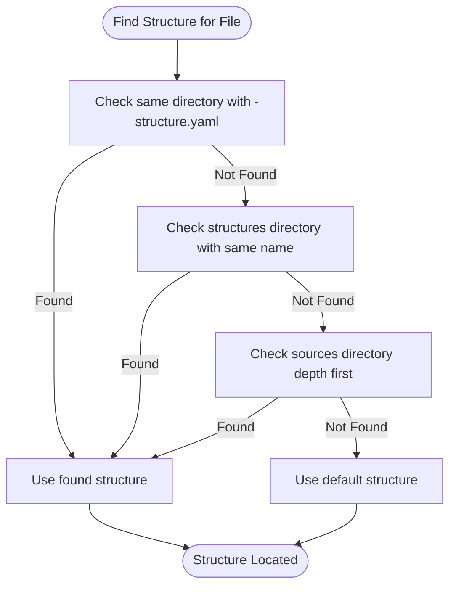
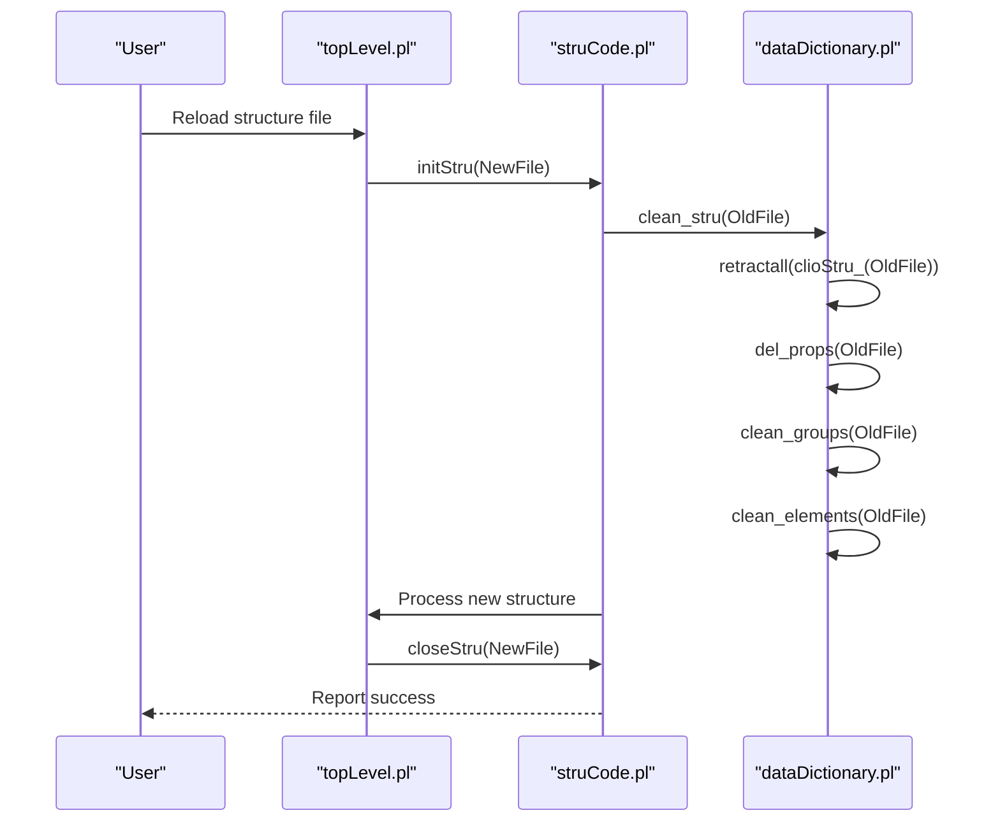
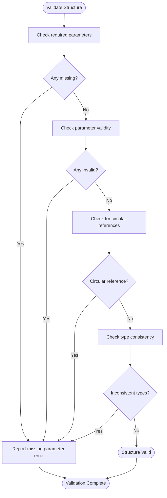
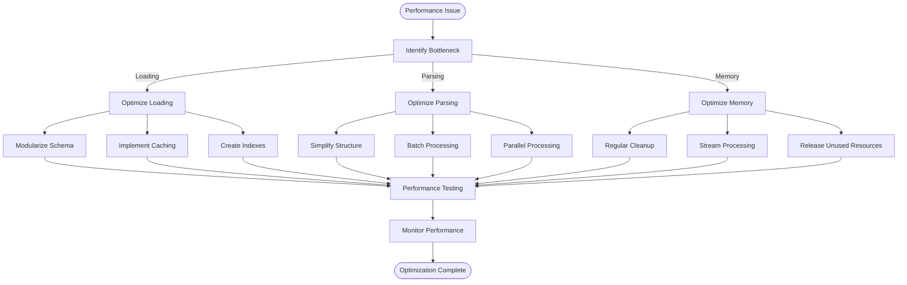

# Structure Processing

<cite>
**Referenced Files in This Document**   
- [struCode.pl](file://src/struCode.pl)
- [struSyntax.pl](file://src/struSyntax.pl)
- [dataCode.pl](file://src/dataCode.pl)
- [dataSyntax.pl](file://src/dataSyntax.pl)
- [dataDictionary.pl](file://src/dataDictionary.pl)
- [yamlSupport.pl](file://src/yamlSupport.pl)
- [gacto2.str](file://src/stru/gacto2.str)
- [sources-structure.yaml](file://src/stru/sources-structure.yaml)
</cite>

## Table of Contents
1. [Introduction](#introduction)
2. [Structure Definition Files](#structure-definition-files)
3. [Structure Processing Components](#structure-processing-components)
4. [Schema Loading and Interpretation](#schema-loading-and-interpretation)
5. [Integration with Data Parsing](#integration-with-data-parsing)
6. [Structure Inheritance and Composition](#structure-inheritance-and-composition)
7. [Configuration and Customization](#configuration-and-customization)
8. [Common Issues and Resolution Strategies](#common-issues-and-resolution-strategies)
9. [Performance Optimization](#performance-optimization)
10. [Conclusion](#conclusion)

## Introduction
The timelink-kleio system employs a sophisticated structure processing component that defines and enforces the schema for Kleio notation. This documentation details how STR and YAML structure files define the schema and parsing rules, how the system loads and interprets these definitions through struCode.pl and struSyntax.pl, and how structure metadata integrates with the data parsing process in dataSyntax.pl and dataCode.pl. The system supports hierarchical organization, field validation, type coercion, structure inheritance, and modular composition, providing a robust framework for processing historical data.

## Structure Definition Files

The timelink-kleio system supports two formats for structure definition files: the legacy STR format and the modern YAML format. These files define the schema that governs how Kleio notation is parsed and interpreted.

### STR Format Structure Files
The STR format uses a domain-specific language with commands like `database`, `part`, and `element` to define the structure schema. The `gacto2.str` file serves as a comprehensive example of this format, defining base data types, hierarchical groups, and element relationships. Key components include:

- **Database command**: Establishes the top-level group (e.g., `kleio`) and initialization parameters
- **Element definitions**: Declare atomic data types and their properties (e.g., `element name=number`)
- **Group (part) definitions**: Define hierarchical containers with parameters like `guaranteed`, `also`, `position`, and `part` to specify required elements, optional elements, display order, and subgroups

The STR format uses Latin-based command names and parameters, though English equivalents are supported through keyword mapping.

### YAML Format Structure Files
The YAML format provides a more modern, human-readable alternative to the STR format. The `sources-structure.yaml` file demonstrates this format, using YAML syntax to define the same schema information. Key advantages include:

- **Improved readability**: Standard YAML syntax with clear key-value pairs
- **Better tooling support**: Compatibility with standard YAML parsers and editors
- **Enhanced extensibility**: Easier to extend with additional metadata and annotations

The YAML structure files maintain compatibility with the STR format semantics while providing a more accessible format for schema definition.

**Section sources**
- [gacto2.str](file://src/stru/gacto2.str#L1-L800)
- [sources-structure.yaml](file://src/stru/sources-structure.yaml#L1-L800)

## Structure Processing Components

The structure processing in timelink-kleio is handled by a suite of interconnected components that work together to load, interpret, and apply structure definitions to data parsing.

### struCode.pl: Structure Code Processing
The `struCode.pl` module contains the core logic for processing structure definitions. It implements predicates that handle the execution of structure commands and maintain temporary state during parsing:

- **initStru/1**: Initializes the structure processing environment, resetting error counters and cleaning previous command information
- **closeStru/1**: Finalizes structure analysis and reports completion
- **init_command/1**: Initializes processing for a specific command, deleting previous parameters and setting defaults
- **close_command/2**: Finalizes command processing, performing completeness checks and storing structure information
- **execParam/3**: Takes appropriate action for each parameter-value pair encountered in structure definitions
- **check_complete/3**: Validates that required parameters are present for each command

The module uses Prolog's property system to store temporary information about commands and their parameters during processing.

### struSyntax.pl: Structure Syntax Analysis
The `struSyntax.pl` module implements a Definite Clause Grammar (DCG) for parsing structure definition files. It acts as the syntactic analyzer that bridges the gap between raw tokens and semantic processing:

- **compile_command/2**: The main entry point that analyzes token lists and triggers semantic processing
- **DCG rules**: Define the grammar for structure commands, parameters, and values
- **Keyword handling**: Supports both Latin and English keywords through the `is_kw/2` predicate and `engkw/2` mappings
- **Error recovery**: Provides meaningful error messages for syntax errors and unknown commands

The syntax analyzer is designed to be data-driven, relying on data predicates to check command variants rather than expanding each variant in the grammar rules.

### yamlSupport.pl: YAML Structure Processing
The `yamlSupport.pl` module extends the structure processing capabilities to handle YAML format files. It integrates with the existing STR processing infrastructure:

- **stru_yaml/1**: Entry point for processing YAML structure files
- **read_yaml_str/2**: Reads and processes YAML files, handling include directives and circular reference detection
- **inspect_yaml_str/1**: Iterates through YAML structure commands and processes them
- **process_str_command/2**: Bridges YAML commands to the existing STR command processing system
- **include_yaml_str/2**: Handles file inclusion with path normalization and circular reference prevention

This module enables seamless integration between the modern YAML format and the legacy STR processing infrastructure.

**Section sources**
- [struCode.pl](file://src/struCode.pl#L1-L391)
- [struSyntax.pl](file://src/struSyntax.pl#L1-L417)
- [yamlSupport.pl](file://src/yamlSupport.pl#L1-L273)

## Schema Loading and Interpretation

The process of loading and interpreting structure schemas in timelink-kleio follows a well-defined workflow that transforms raw structure definition files into an internal representation used for data parsing.

### Loading Process Workflow
The schema loading process begins with the `stru/2` predicate in `topLevel.pl`, which dispatches to the appropriate handler based on the file format:



**Diagram sources **
- [topLevel.pl](file://src/topLevel.pl#L106-L137)
- [struCode.pl](file://src/struCode.pl#L64-L82)
- [struSyntax.pl](file://src/struSyntax.pl#L48-L58)

### Interpretation of Structure Commands
The interpretation of structure commands follows a consistent pattern across different command types:

#### Database Command Processing
The `database` command initializes the structure definition environment:



**Diagram sources **
- [struCode.pl](file://src/struCode.pl#L105-L109)
- [dataDictionary.pl](file://src/dataDictionary.pl#L115-L121)
- [struSyntax.pl](file://src/struSyntax.pl#L77-L78)

#### Group and Element Command Processing
Group (`part`) and element (`element`) commands define the schema structure:

```mermaid
flowchart TD
Start([Process Group/Element Command]) --> InitCommand[init_command(CMD)]
InitCommand --> SetDefaults[set_defaults(CMD)]
SetDefaults --> ProcessParams[Process Parameter List]
ProcessParams --> ParamLoop{More Parameters?}
ParamLoop --> |Yes| ExecParam[execParam(CMD, Param, Value)]
ExecParam --> StoreProp[Store property or create structure]
StoreProp --> ParamLoop
ParamLoop --> |No| CheckComplete[check_complete(CMD, Result)]
CheckComplete --> |Missing Params| SetError[Set status to notOk]
CheckComplete --> |Complete| CloseCommand[close_command(CMD, ok)]
CloseCommand --> |nomino| CreateStru[dataDictionary:create_stru(ok)]
CloseCommand --> |pars| CreateGroups[dataDictionary:create_groups()]
CloseCommand --> |terminus| CreateElements[dataDictionary:create_elements()]
CreateStru --> Complete([Command Processed])
CreateGroups --> Complete
CreateElements --> Complete
SetError --> Complete
```

**Diagram sources **
- [struCode.pl](file://src/struCode.pl#L148-L279)
- [dataDictionary.pl](file://src/dataDictionary.pl#L12-L15)
- [struSyntax.pl](file://src/struSyntax.pl#L95-L101)

## Integration with Data Parsing

The structure metadata defined in STR and YAML files is tightly integrated with the data parsing process, enabling validation, type coercion, and hierarchical organization of parsed data.

### Data Parsing Workflow
The data parsing process leverages the loaded structure schema to guide the interpretation of Kleio data files:

```mermaid
flowchart TD
Start([Start Data Parsing]) --> InitData[initData(FileName)]
InitData --> CreateCDS[Create CDS structure]
InitData --> ResetCounters[Reset group counters]
InitData --> InitDB[Call database initialization]
CreateCDS --> ProcessLines[Process Data Lines]
ProcessLines --> LineLoop{More Lines?}
LineLoop --> |Yes| Tokenize[Tokenize Line]
Tokenize --> ParseSyntax[Parse with dataSyntax.pl]
ParseSyntax --> GenerateCalls[Generate predicate calls]
GenerateCalls --> ExecuteCalls[Execute calls via storeEls/1]
ExecuteCalls --> UpdateCDS[Update CDS structure]
UpdateCDS --> LineLoop
LineLoop --> |No| FlushGroup[flushGroup()]
FlushGroup --> ValidateElements[Validate required elements]
FlushGroup --> GenerateID[Generate group ID]
FlushGroup --> StoreDB[Call database storage]
StoreDB --> Complete([Data Parsing Complete])
```

**Diagram sources **
- [dataCode.pl](file://src/dataCode.pl#L53-L70)
- [dataSyntax.pl](file://src/dataSyntax.pl#L57-L60)
- [dataCode.pl](file://src/dataCode.pl#L139-L149)

### Field Validation and Type Coercion
The structure schema enables comprehensive field validation and type coercion during data parsing:

#### Element Validation
When a new element is encountered in the data, the system validates it against the current group's definition:



**Diagram sources **
- [dataCode.pl](file://src/dataCode.pl#L284-L291)
- [dataCode.pl](file://src/dataCode.pl#L293-L303)
- [dataDictionary.pl](file://src/dataDictionary.pl#L10-L11)

#### Type Coercion
The system applies type coercion based on the element definitions in the structure schema:

```mermaid
flowchart TD
Start([Store Core Data]) --> GetAspect[Get current aspect]
GetAspect --> StoreCore[storeCore(I)]
StoreCore --> GetField[Get CDS field for aspect]
GetField --> Reverse[Reverse token list]
Reverse --> RemoveSpaces[Remove leading/trailing spaces]
RemoveSpaces --> Append[Append to entry list]
Append --> UpdateCDS[Update CDS structure]
UpdateCDS --> Complete([Data Stored])
```

**Diagram sources **
- [dataCode.pl](file://src/dataCode.pl#L457-L470)
- [dataCode.pl](file://src/dataCode.pl#L408-L415)
- [dataCode.pl](file://src/dataCode.pl#L436-L443)

### Hierarchical Organization
The structure schema defines the hierarchical relationships between groups, which are maintained during data parsing:

#### Group Hierarchy Management
The `updatePath/5` predicate manages the hierarchical path of nested groups:



**Diagram sources **
- [dataCode.pl](file://src/dataCode.pl#L213-L268)
- [dataCode.pl](file://src/dataCode.pl#L115-L121)
- [dataCode.pl](file://src/dataCode.pl#L180-L188)

## Structure Inheritance and Modular Composition

The timelink-kleio system supports sophisticated structure inheritance and modular composition mechanisms that enable reusable and extensible schema definitions.

### Inheritance Mechanisms
Structure inheritance is implemented through the `source` (or `fons`) parameter in group definitions, allowing groups to inherit properties and elements from parent groups.

#### Inheritance Implementation
The inheritance mechanism works through property copying and relationship tracking:



**Diagram sources **
- [struCode.pl](file://src/struCode.pl#L268-L272)
- [struCode.pl](file://src/struCode.pl#L288-L293)
- [dataDictionary.pl](file://src/dataDictionary.pl#L14-L15)

#### Example: Person Gender Specialization
The `gacto2.str` file demonstrates inheritance through the specialization of the `person` group into `female` and `male` subgroups:

```prolog
part name=person;
    guaranteed=name,sex;
    also=id,obs,same_as;
    position=name,sex,id,same_as,xsame_as;
    arbitrary=atr,rel,ls

part name=female;
    source=person;
    guaranteed=name;
    also=obs,id,same_as,xsame_as;
    position=name,sex

part name=male;
    source=person;
    guaranteed=name;
    also=obs,id,same_as,xsame_as;
    position=name,sex
```

This inheritance pattern allows the `female` and `male` groups to inherit all properties and elements from the `person` group while specializing specific aspects (like setting the sex field implicitly).

### Modular Composition
The system supports modular composition through file inclusion and hierarchical organization of structure definitions.

#### File Inclusion Mechanism
The YAML format supports modular composition through the `include` directive:



**Diagram sources **
- [yamlSupport.pl](file://src/yamlSupport.pl#L116-L126)
- [yamlSupport.pl](file://src/yamlSupport.pl#L189-L192)
- [yamlSupport.pl](file://src/yamlSupport.pl#L46-L67)

#### Hierarchical Organization Example
The `sources-structure.yaml` file demonstrates hierarchical organization with nested groups:

```yaml
- group:
    name: kleio
    part:
    - historical-source
    - fonte
    - authority-register
    - identifications
    - link
    - property

- group:
    name: historical-source
    part:
    - historical-act
    - event

- group:
    name: historical-act
    arbitrary:
    - person
    - object
    - geoentity
    - abstraction
    - ls
    - atr
    - rel
```

This hierarchical structure enables organized and scalable schema definitions.

**Section sources**
- [gacto2.str](file://src/stru/gacto2.str#L311-L340)
- [sources-structure.yaml](file://src/stru/sources-structure.yaml#L207-L800)
- [yamlSupport.pl](file://src/yamlSupport.pl#L116-L126)

## Configuration and Customization

The timelink-kleio system provides several configuration options for customizing structure processing behavior, including custom structure paths, dynamic reloading, and schema validation.

### Custom Structure Paths
The system supports flexible structure path resolution through multiple mechanisms:

#### Path Resolution Algorithm
The `get_stru_for_file/3` predicate in `apiTranslations.pl` implements a comprehensive algorithm for locating structure files:



**Diagram sources **
- [apiTranslations.pl](file://src/apiTranslations.pl#L338-L399)
- [apiTranslations.pl](file://src/apiTranslations.pl#L403-L417)

#### Path Types
The system supports several path types for structure file resolution:

- **Relative paths**: Files in the same directory as the data file
- **Structures directory**: Centralized structure definitions in a dedicated directory
- **Sources directory**: Structure files colocated with source data
- **System directory**: Default system-wide structure definitions
- **Home directory**: User-specific structure definitions

### Dynamic Reloading
The system supports dynamic reloading of structure definitions, allowing changes to be applied without restarting the application:

#### Reloading Process


**Diagram sources **
- [struCode.pl](file://src/struCode.pl#L64-L68)
- [dataDictionary.pl](file://src/dataDictionary.pl#L135-L140)
- [struCode.pl](file://src/struCode.pl#L80-L82)

### Schema Validation
The system includes comprehensive schema validation to ensure structure definitions are correct and complete:

#### Validation Mechanisms
- **Required parameter checking**: The `check_complete/3` predicate verifies that required parameters are present
- **Parameter validity checking**: The `execParam/3` predicate validates parameter values against allowed options
- **Circular reference detection**: The `read_yaml_str/2` predicate tracks processed files to prevent circular includes
- **Type consistency checking**: Element types are validated against defined base types



**Diagram sources **
- [struCode.pl](file://src/struCode.pl#L306-L326)
- [struCode.pl](file://src/struCode.pl#L180-L185)
- [yamlSupport.pl](file://src/yamlSupport.pl#L50-L54)

**Section sources**
- [apiTranslations.pl](file://src/apiTranslations.pl#L326-L417)
- [struCode.pl](file://src/struCode.pl#L306-L326)
- [yamlSupport.pl](file://src/yamlSupport.pl#L50-L54)

## Common Issues and Resolution Strategies

Despite the robust design of the structure processing system, certain issues may arise during development and usage. This section addresses common problems and provides resolution strategies.

### Structure Mismatches
Structure mismatches occur when data does not conform to the defined schema.

#### Symptoms
- Validation errors for missing required elements
- Warnings for unknown elements
- Data parsing failures

#### Resolution Strategies
1. **Verify structure file association**: Ensure the correct structure file is being used for the data file
2. **Check element definitions**: Verify that all required elements are defined in the structure
3. **Review inheritance chains**: Ensure that inherited elements are properly defined
4. **Use debugging tools**: Utilize `show_stru/0` and `show_groups/0` predicates to inspect the loaded structure

### Circular References
Circular references can occur in structure definitions, particularly with file inclusion.

#### Prevention
- **File processing tracking**: The system maintains a stack of processed files to detect circular includes
- **Warning system**: Issues warnings when attempting to process already-processed files
- **Stack depth monitoring**: Reports inclusion depth for debugging

#### Resolution
1. **Restructure includes**: Reorganize structure files to eliminate circular dependencies
2. **Use conditional inclusion**: Implement logic to skip already-included files
3. **Flatten hierarchy**: Reduce nesting depth when possible

### Performance Degradation with Complex Schemas
Complex schemas with deep inheritance hierarchies or numerous elements can impact performance.

#### Symptoms
- Slow structure loading times
- Increased memory usage
- Delayed data parsing

#### Optimization Techniques
1. **Schema modularization**: Break large schemas into smaller, focused modules
2. **Caching mechanisms**: Implement caching for frequently accessed structure information
3. **Indexing**: Create indexes for commonly queried structure elements
4. **Lazy loading**: Load structure components on-demand rather than all at once



**Diagram sources **
- [yamlSupport.pl](file://src/yamlSupport.pl#L49-L50)
- [dataDictionary.pl](file://src/dataDictionary.pl#L135-L140)
- [struCode.pl](file://src/struCode.pl#L67-L74)

**Section sources**
- [struCode.pl](file://src/struCode.pl#L50-L56)
- [yamlSupport.pl](file://src/yamlSupport.pl#L49-L50)
- [dataDictionary.pl](file://src/dataDictionary.pl#L135-L140)

## Performance Optimization

Optimizing the performance of the structure processing component is crucial for handling large and complex schemas efficiently.

### Loading Performance
Optimizing the loading of structure definitions can significantly improve startup times.

#### Techniques
- **Incremental loading**: Load structure components as needed rather than all at once
- **Precompiled schemas**: Cache compiled schema representations to avoid reprocessing
- **Parallel processing**: Process independent structure components concurrently
- **Memory management**: Release temporary processing data promptly

### Parsing Performance
Optimizing the data parsing process ensures efficient handling of large datasets.

#### Techniques
- **CDS optimization**: Optimize the Current Data Storage structure for faster access
- **Batch processing**: Process multiple data lines in batches
- **Indexing**: Create indexes for frequently accessed elements
- **Caching**: Cache frequently used structure information

### Memory Usage
Managing memory usage is critical for long-running applications.

#### Techniques
- **Regular cleanup**: Clean up temporary data structures regularly
- **Object pooling**: Reuse objects rather than creating new ones
- **Lazy initialization**: Initialize components only when needed
- **Resource monitoring**: Monitor memory usage and trigger cleanup when thresholds are exceeded

**Section sources**
- [dataCode.pl](file://src/dataCode.pl#L55-L56)
- [dataCDS.pl](file://src/dataCDS.pl#L91-L104)
- [struCode.pl](file://src/struCode.pl#L73-L74)

## Conclusion
The structure processing component of timelink-kleio provides a comprehensive and flexible system for defining and enforcing schemas for Kleio notation. Through the integration of STR and YAML structure files, the system supports both legacy and modern schema definition formats. The struCode.pl and struSyntax.pl modules work together to load and interpret these definitions, while dataSyntax.pl and dataCode.pl integrate the structure metadata with the data parsing process for field validation, type coercion, and hierarchical organization.

The system's support for structure inheritance and modular composition enables reusable and extensible schema definitions, as demonstrated by examples from gacto2.str and sources-structure.yaml. Configuration options for custom structure paths, dynamic reloading, and schema validation provide flexibility for different deployment scenarios.

While potential issues such as structure mismatches, circular references, and performance degradation with complex schemas may arise, the system provides resolution strategies and optimization techniques to address these challenges. By following best practices for schema design and performance optimization, users can effectively leverage the full capabilities of the timelink-kleio structure processing system.