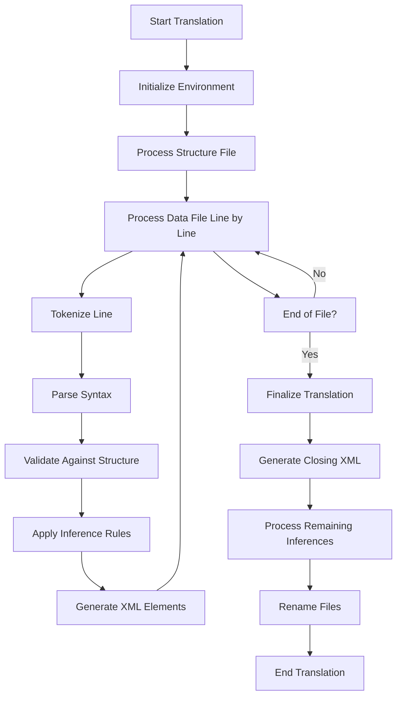
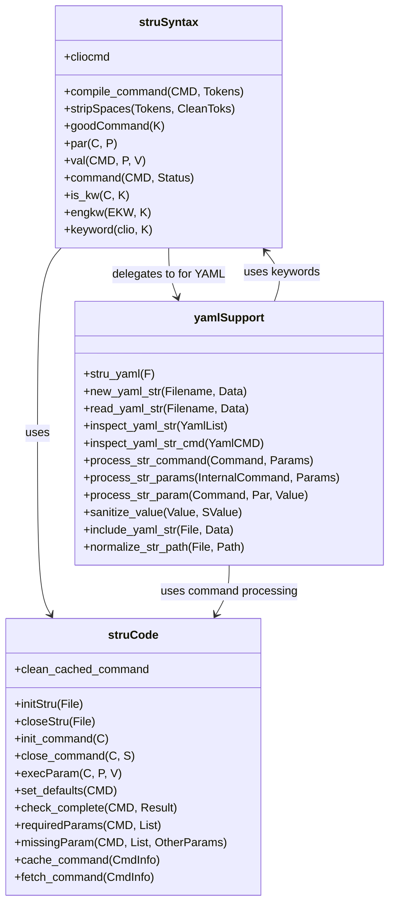
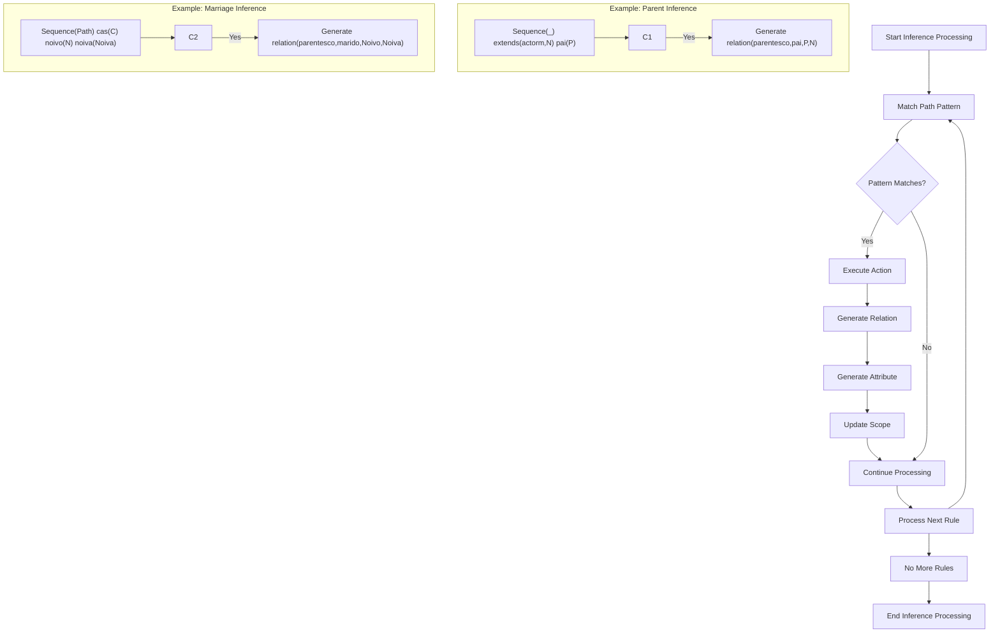
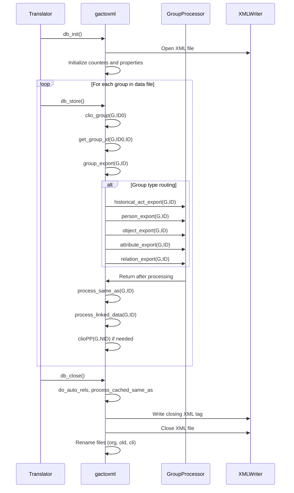

# Translation Services

<cite>
**Referenced Files in This Document**   
- [gactoxml.pl](file://src/gactoxml.pl)
- [clioPP.pl](file://src/clioPP.pl)
- [lexical.pl](file://src/lexical.pl)
- [struCode.pl](file://src/struCode.pl)
- [struSyntax.pl](file://src/struSyntax.pl)
- [inference.pl](file://src/inference.pl)
- [yamlSupport.pl](file://src/yamlSupport.pl)
- [dataSyntax.pl](file://src/dataSyntax.pl)
- [topLevel.pl](file://src/topLevel.pl)
- [dataDictionary.pl](file://src/dataDictionary.pl)
- [externals.pl](file://src/externals.pl)
</cite>

## Table of Contents
1. [Introduction](#introduction)
2. [Processing Pipeline Overview](#processing-pipeline-overview)
3. [Lexical Analysis and Syntax Processing](#lexical-analysis-and-syntax-processing)
4. [Structure Definition Processing](#structure-definition-processing)
5. [Contextual Inference and Normalization](#contextual-inference-and-normalization)
6. [XML Generation Process](#xml-generation-process)
7. [Configuration and Performance](#configuration-and-performance)
8. [Error Handling and Troubleshooting](#error-handling-and-troubleshooting)
9. [Conclusion](#conclusion)

## Introduction

The timelink-kleio translation engine provides a sophisticated system for converting Kleio notation files (.cli) into normalized XML output. This system processes historical source data through a multi-stage pipeline that combines lexical analysis, structural validation, contextual inference, and XML generation. The engine uses STR/YAML structure definition files to validate and interpret the source data, applying normalization rules to enhance data quality and consistency. The translation process is driven by Prolog-based modules that handle parsing, inference, and output generation, with the final XML output produced by the gactoxml.pl module. This document details the complete translation workflow, from source input through lexical analysis, semantic interpretation, and final XML generation.

**Section sources**
- [gactoxml.pl](file://src/gactoxml.pl#L1-L2781)
- [topLevel.pl](file://src/topLevel.pl#L1-L286)

## Processing Pipeline Overview

The translation engine follows a structured processing pipeline that transforms Kleio notation files into normalized XML output through several distinct phases. The process begins with initialization, where the `db_init` predicate in gactoxml.pl sets up the translation environment by creating output files and initializing counters. The main processing phase involves parsing the input file line by line, with each line being tokenized and analyzed for syntactic structure. During this phase, the system validates the data against the structure definition and applies contextual inference rules to enrich the data. The final phase, handled by the `db_close` predicate, completes the translation by generating closing XML tags, processing any remaining inferences, and performing file management operations such as renaming the original and processed files. Throughout this process, the system maintains state information and handles error reporting to ensure data integrity.

**Diagram sources**
- [gactoxml.pl](file://src/gactoxml.pl#L123-L166)
- [gactoxml.pl](file://src/gactoxml.pl#L179-L188)
- [topLevel.pl](file://src/topLevel.pl#L269-L282)

## Lexical Analysis and Syntax Processing

The lexical analysis phase is handled by the lexical.pl module, which transforms character streams into meaningful tokens through a comprehensive grammar system. The `get_tokens/3` predicate processes input characters, categorizing them into tokens such as names, numbers, quotes, and special data flags. This module defines character types through the `chartype/2` predicate and handles various data flags that represent special characters in Kleio notation. The syntax processing is managed by dataSyntax.pl, which parses the tokenized input using a DCG (Definite Clause Grammar) approach. The `compile_data/1` predicate analyzes each line of tokens, recognizing groups, elements, and their aspects (core, original, comment). This phase handles special cases like triple quotes for multiline content and double quotes for quoted strings, ensuring proper parsing of complex Kleio constructs.

**Section sources**
- [lexical.pl](file://src/lexical.pl#L1-L492)
- [dataSyntax.pl](file://src/dataSyntax.pl#L1-L194)

## Structure Definition Processing

Structure definition processing is a critical component of the translation engine, handled primarily by the struSyntax.pl and struCode.pl modules. The system processes STR/YAML files that define the schema for Kleio data, using a command-based syntax with directives like `nomino`, `pars`, and `terminus`. The `compile_command/2` predicate in struSyntax.pl analyzes these commands, validating parameters and ensuring completeness through the `check_complete/2` predicate. The struCode.pl module implements the execution logic for these commands, storing temporary information and creating an internal representation of the structure. The yamlSupport.pl module extends this functionality to handle YAML-based structure definitions, allowing for more modern and readable schema definitions. This processing creates a data dictionary that defines valid groups, elements, and their relationships, which is then used to validate the source data during translation.

**Diagram sources**
- [struSyntax.pl](file://src/struSyntax.pl#L1-L417)
- [struCode.pl](file://src/struCode.pl#L1-L391)
- [yamlSupport.pl](file://src/yamlSupport.pl#L1-L273)

## Contextual Inference and Normalization

The contextual inference system, implemented in inference.pl, enhances data quality by automatically generating relationships and attributes based on patterns in the data. This system uses a rule-based approach where inference rules are defined as "if-then" statements that match specific patterns in the data hierarchy. For example, rules can automatically infer parent-child relationships when certain group patterns are detected, such as identifying that a person with a "pai" (father) element should have a parentesco (kinship) relationship established. The system also handles gender-specific inferences, where the extension of abstract groups like "actorm" (male actor) or "actorf" (female actor) allows the system to validate and generate appropriate relationships. These inference rules are processed during translation, enriching the data with contextual information that improves its semantic value and consistency.

**Diagram sources**
- [inference.pl](file://src/inference.pl#L1-L800)
- [gactoxml.pl](file://src/gactoxml.pl#L376-L382)

## XML Generation Process

The XML generation process is orchestrated by the gactoxml.pl module, which implements the export predicates required by the Clio translator framework. The `db_store/0` predicate is called whenever a new group is read from the data file, triggering the generation of corresponding XML elements. This process uses the `group_export/2` predicate as a dispatch mechanism, routing different group types to specialized processors like `historical_act_export/2`, `person_export/2`, and `object_export/2`. Each processor generates appropriate XML elements with attributes based on the group's properties and aspects. The system also handles special cases like authority registers, linked data, and properties. The `group_to_xml/3` predicate is used to generate the actual XML output, incorporating elements like date, type, and user information. The process maintains state through thread-local predicates and property storage, ensuring consistent ID generation and relationship tracking throughout the translation.

**Diagram sources**
- [gactoxml.pl](file://src/gactoxml.pl#L333-L371)
- [gactoxml.pl](file://src/gactoxml.pl#L409-L534)
- [gactoxml.pl](file://src/gactoxml.pl#L686-L720)

## Configuration and Performance

The translation engine provides several configuration options that affect translation behavior and performance. The system supports both traditional STR files and modern YAML-based structure definitions, with the yamlSupport.pl module handling the latter format. Configuration parameters can be specified in the structure files using commands like `nomino` with parameters such as `modus`, `antiquum`, and `scribe`. The system also supports performance optimizations for processing large files, including efficient memory management through the use of thread-local storage and property-based state management. The `clioPP.pl` module provides pretty-printing functionality that generates intermediate files with explicit IDs, facilitating safe reimport of data after modifications. For large files, the system's performance can be optimized by minimizing the use of complex inference rules and ensuring that structure definitions are well-organized to reduce parsing overhead.

**Section sources**
- [gactoxml.pl](file://src/gactoxml.pl#L424-L445)
- [clioPP.pl](file://src/clioPP.pl#L1-L227)
- [yamlSupport.pl](file://src/yamlSupport.pl#L1-L273)

## Error Handling and Troubleshooting

The translation engine includes comprehensive error handling and reporting mechanisms to assist with troubleshooting common issues. The errors.pl module provides predicates like `error_out/1` and `warning_out/1` that generate detailed error messages with context information including file name, line number, and surrounding text. The system tracks error and warning counts, allowing for early termination if a maximum error threshold is reached. Common issues such as parsing errors, structure mismatches, and performance bottlenecks are addressed through specific error reporting and recovery mechanisms. For example, the `check_continuation/0` predicate monitors error counts and can abort translation if too many errors occur. The system also generates detailed reports that document the translation process, including information about processed groups, elements, and any issues encountered. These reports help identify and resolve problems in the source data or structure definitions.

**Section sources**
- [errors.pl](file://src/errors.pl#L1-L220)
- [reports.pl](file://src/reports.pl#L1-L136)
- [gactoxml.pl](file://src/gactoxml.pl#L127-L128)

## Conclusion

The timelink-kleio translation engine provides a robust and flexible system for converting Kleio notation files into normalized XML output. By combining lexical analysis, structural validation, contextual inference, and XML generation, the system ensures high-quality data transformation that preserves the semantic richness of historical sources. The modular architecture, with specialized components for different aspects of the translation process, allows for extensibility and customization. The use of STR/YAML structure definitions provides a powerful mechanism for defining and validating data schemas, while the inference system enhances data quality through automated relationship generation. The comprehensive error handling and reporting capabilities make the system reliable and maintainable, even when processing complex or large datasets. This translation engine serves as a critical component in the digital humanities workflow, enabling the structured analysis and sharing of historical data.